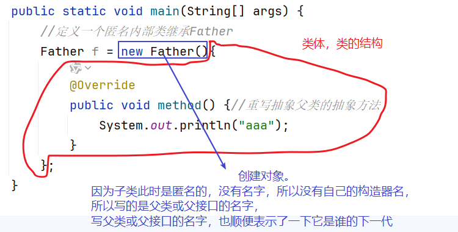
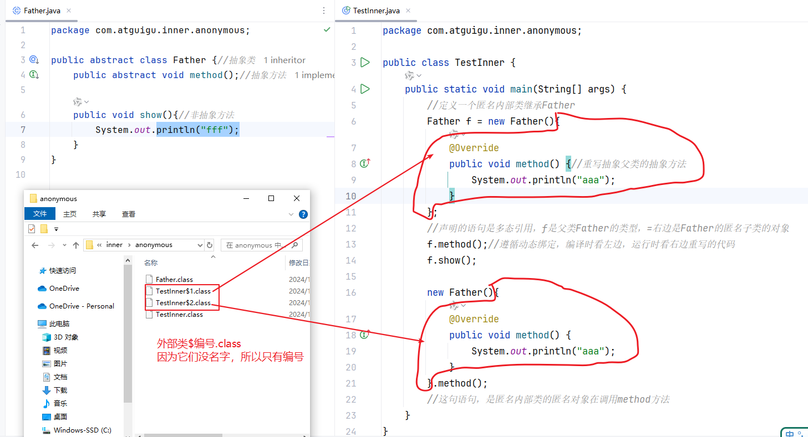
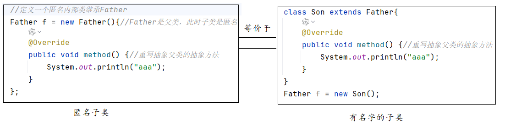
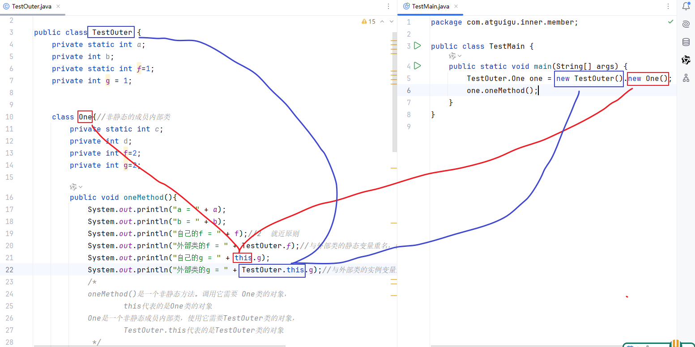

# 三、内部类

## 3.1 什么是内部类？

定义在另一个类里面的类，称为内部类。外面这个类通常被称为外部类。


## 3.2 内部类有几种形式？4种

- 成员内部类：
  - 位置：类中方法外
  - 分为：静态成员内部类 和 非静态成员内部类
- 局部内部类：
  - 位置：方法内部
  - 分为：有名字的局部内部类 和 匿名的局部内部类

```java
public class Outer{
    class One{ //成员内部类，没有static，所以是非静态成员内部类
        
    }
    
    static class Two{//成员内部类，有static，所以是静态成员内部类
        
    }
    
    public void method(){
        class Three{ //有名字的局部内部类
            
        }
        
        new Object(){ //匿名内部类
            
        };
    }
}
```


## 静态内部类

在 Java 中，**静态类（Static Class）特指 “静态内部类”**（Static Nested Class），因为 Java 不允许顶级类（独立的类）被声明为`static`。静态内部类是定义在另一个类内部、并用`static`修饰的类，它有以下核心特点

### 1. 不依赖外部类的实例，属于外部类本身

静态内部类是 “外部类的静态成员”，而非 “外部类实例的成员”。这意味着：

- 创建静态内部类的实例时，**不需要先创建外部类的实例**；
- 普通内部类（非静态）必须依赖外部类的实例才能创建，而静态内部类完全独立于外部类的实例。

```java
class OuterClass {
    // 静态内部类
    static class StaticNestedClass {
        void print() {
            System.out.println("静态内部类的方法");
        }
    }
    
    // 普通内部类（非静态）
    class NonStaticInnerClass {
        void print() {
            System.out.println("普通内部类的方法");
        }
    }
}

public class Main {
    public static void main(String[] args) {
        // 创建静态内部类实例：直接通过外部类名访问，无需外部类实例
        OuterClass.StaticNestedClass staticObj = new OuterClass.StaticNestedClass();
        staticObj.print(); // 正常执行
        
        // 创建普通内部类实例：必须先有外部类实例
        OuterClass outerObj = new OuterClass();
        OuterClass.NonStaticInnerClass nonStaticObj = outerObj.new NonStaticInnerClass();
        nonStaticObj.print(); // 正常执行
    }
}
```

### 2. 只能访问外部类的静态成员（变量 / 方法）

静态内部类与外部类的非静态成员（属于实例）没有直接关联，因此：

- 可以直接访问外部类的**静态成员**（包括`private`静态成员）；
- **不能直接访问外部类的非静态成员**（需通过外部类的实例间接访问）。

```java
class OuterClass {
    private static int staticVar = 10; // 静态变量
    private int nonStaticVar = 20;     // 非静态变量
    
    static class StaticNestedClass {
        void accessOuter() {
            // 可以访问外部类的静态成员
            System.out.println("静态变量：" + staticVar);
            
            // 不能直接访问外部类的非静态成员（编译错误）
            // System.out.println("非静态变量：" + nonStaticVar);
            
            // 若要访问非静态成员，需先创建外部类实例
            OuterClass outer = new OuterClass();
            System.out.println("通过外部类实例访问非静态变量：" + outer.nonStaticVar);
        }
    }
}
```

### 3. 可包含静态成员和非静态成员

静态内部类自身可以像普通类一样，定义：

- 静态变量、静态方法；
- 非静态变量、非静态方法；
- 构造器（不能是`static`的）。

```java
class OuterClass {
    static class StaticNestedClass {
        // 静态成员
        private static int staticField = 100;
        public static void staticMethod() {
            System.out.println("静态内部类的静态方法");
        }
        
        // 非静态成员
        private int nonStaticField = 200;
        public void nonStaticMethod() {
            System.out.println("静态内部类的非静态方法");
        }
    }
}
```

### 4. 作用域与访问控制

- 静态内部类的访问权限可以是`public`、`protected`、`private`或默认（包权限），由声明时的修饰符决定；
- 若静态内部类被声明为`private`，则只能在外部类内部访问；若为`public`，则可在任意地方通过 “外部类名。静态内部类名” 访问。

### 5. 典型用途

静态内部类的设计主要是为了：

- **逻辑上关联的类组织**：当一个类仅为另一个类服务，且不依赖外部类实例时，将其定义为静态内部类，避免单独创建顶级类造成的命名污染；
- **封装与隔离**：例如 Java 集合框架中，`HashMap`的`Entry`类（存储键值对的节点）被定义为静态内部类，因为它仅为`HashMap`服务，且不需要依赖`HashMap`的实例


## 3.3 匿名内部类

声明匿名内部类的语法格式：

```java
new 父类名(){//这个匿名内部类继承了这个父类，()空着表示子类的构造器中调用了父类的无参构造
    //类的成员：成员变量、成员方法等
}
```

```java
new 父类名(实参列表){//这个匿名内部类继承了这个父类，()不是空着表示子类的构造器中调用了父类的有参构造
    //类的成员：成员变量、成员方法等
}
```

```java
new 父接口名(){ //这个匿名内部类实现了这个接口，()空着表示调用的是Object()的无参构造，因为接口没有构造器
    //类的成员：成员变量、成员方法等
}
```

因为匿名内部类没有名字，所以必须在声明类的同时，就把对象创建好。而且这个类只有唯一的对象。






### 案例1：匿名内部类继承父类

```java
package com.atguigu.inner.anonymous;

public abstract class Father {//抽象类
    public abstract void method();//抽象方法

    public void show(){//非抽象方法
        System.out.println("fff");
    }
}
```



```java
package com.atguigu.inner.anonymous;

public class TestFather {
    public static void main(String[] args) {
        //定义一个匿名内部类继承Father
        Father f = new Father(){
            @Override
            public void method() {//重写抽象父类的抽象方法
                System.out.println("aaa");
            }
        };
        //声明的语句是多态引用，f是父类Father的类型，=右边是Father的匿名子类的对象
        f.method();//遵循动态绑定，编译时看左边，运行时看右边重写的代码
        f.show();

        new Father(){
            @Override
            public void method() {
                System.out.println("ccc");
            }
        }.method();
        //这句语句，是匿名内部类的匿名对象在调用method方法
    }
}
```

### 案例2：匿名内部类实现接口

```java
package com.atguigu.inner.anonymous;

public interface Flyable {
    void fly();//抽象方法，省略public abstract
}

```

```java
package com.atguigu.inner.anonymous;

public class TestFlyable {
    public static void main(String[] args) {
        Flyable f = new Flyable() {

            @Override
            public void fly() {
                System.out.println("我要飞的更高！");
            }
        };
        f.fly();

        new Flyable(){
            @Override
            public void fly() {
                System.out.println("我要借助风的力量飞上云霄！");
            }
        }.fly();
    }
}
```


## 3.4 匿名内部类的应用场景之一：比较器

### 3.4.1 回忆：Comparable接口

当某个类的对象要比较大小或排序，就可以让这个类实现Comparable接口。

Comparable接口：自然比较接口，通常都是优先考虑它。

抽象方法：int compareTo(Object obj)，在重写这个抽象方法的时候，比较大小的两个对象是this 和obj。

因为Comparable接口是要比较大小的对象的类本身实现的接口。例如：Student对象要比较对象，学生对象1.compareTo(学生对象2)，学生对象1是this，学生对象2是obj

### 3.4.2 补充：Comparator接口

Comparator接口：定制比较接口，或者备选的比较接口。只有在Comparable接口不能解决我们问题的情况下，才考虑它。

抽象方法：int compare(Object o1, Object o2)，在重写这个抽象方法的时候，比较大小的两个对象是o1和o2。

因为Comparator接口是其他类（这个类可以有名字，也可能没名字）实现，所以在compare方法中的this是Comparator接口的实现类对象本身，不是要比较大小的对象。

### 3.4.3 示例代码

#### 案例1：Student实现Comparable接口

```java
package com.atguigu.inner.anonymous;

//Comparable是able结尾，是形容词，表示Student对象本身可比较大小
public class Student implements Comparable{
    private int id;
    private String name;
    private int score;

    public Student() {
    }

    public Student(int id, String name, int score) {
        this.id = id;
        this.name = name;
        this.score = score;
    }

    public int getId() {
        return id;
    }

    public void setId(int id) {
        this.id = id;
    }

    public String getName() {
        return name;
    }

    public void setName(String name) {
        this.name = name;
    }

    public int getScore() {
        return score;
    }

    public void setScore(int score) {
        this.score = score;
    }

    @Override
    public String toString() {
        return "Student{" +
                "id=" + id +
                ", name='" + name + '\'' +
                ", score=" + score +
                '}';
    }

    @Override
    public int compareTo(Object other) {
        //this对象和other的编号比较大小
        return this.id - ((Student)other).id;

    }
}

```

```java
package com.atguigu.inner.anonymous;

public class MyArrays {
    public static void sort(Comparable[] arr){
        for(int i=1; i<arr.length; i++){
            for(int j=0; j<arr.length-i; j++){
                //arr[j] > arr[j+1] 会返回正整数
                if(arr[j].compareTo(arr[j+1]) > 0 ){
                    Comparable temp = arr[j];
                    arr[j] = arr[j+1];
                    arr[j+1] = temp;
                }
            }
        }
    }
}

```

```java
package com.atguigu.inner.anonymous;

public class TestStudents {
    public static void main(String[] args) {
        Student[] arr = new Student[3];
        arr[0] = new Student(2,"熊二",89);
        arr[1] = new Student(1,"熊大",96);
        arr[2] = new Student(3,"张三",50);

        //希望按照编号从低到高排列
        System.out.println("按照编号从低到高排列：");
        MyArrays.sort(arr);

        for (int i = 0; i < arr.length; i++) {
            System.out.println(arr[i]);
        }
    }
}

```

#### 案例2：有名字的类实现Comparator接口

```java
package com.atguigu.inner.anonymous;

import java.util.Comparator;

//Comparator是tor结尾，是名称，表示这个类的对象是一个工具
//用于比较两个学生对象的对象，它本身不是学生对象
public class StudentComparator implements Comparator {
	/*    compare的调用会涉及到3个对象
    StudentComparator的对象，用于调用compare方法，
    两个对象对象，分别给o1和o2*/
    @Override
    public int compare(Object o1, Object o2) {
//        this是StudentComparator的对象
        Student s1 = (Student) o1;//向下转型
        Student s2 = (Student) o2;//向下转型
        return s1.getScore() - s2.getScore();
    }
}
```

```java
package com.atguigu.inner.anonymous;

import java.util.Comparator;

public class TestStudents {
    public static void main(String[] args) {
        Student[] arr = new Student[3];
        arr[0] = new Student(2,"熊二",89);
        arr[1] = new Student(1,"熊大",96);
        arr[2] = new Student(3,"张三",50);

        //希望按照编号从低到高排列
        System.out.println("按照编号从低到高排列：");
        MyArrays.sort(arr);

        for (int i = 0; i < arr.length; i++) {
            System.out.println(arr[i]);
        }

        //希望同一个数组，接下来按照成绩从低到高排序
        System.out.println("按照成绩从低到高排序：");
        StudentComparator sc = new StudentComparator();//有名字的普通类
        for(int i=1; i<arr.length; i++){
            for(int j=0; j<arr.length-i; j++){
                //用sc对象compare方法，比较两个学生对象的大小
                if(sc.compare(arr[j], arr[j+1]) > 0){
                    Student temp = arr[j];
                    arr[j] = arr[j+1];
                    arr[j+1] = temp;
                }
            }
        }
        for (int i = 0; i < arr.length; i++) {
            System.out.println(arr[i]);
        }
    }
}

```

#### 案例3：匿名内部类实现Comparator接口

```java
package com.atguigu.inner.anonymous;

import java.util.Comparator;

public class TestStudents {
    public static void main(String[] args) {
        Student[] arr = new Student[3];
        arr[0] = new Student(2,"熊二",89);
        arr[1] = new Student(1,"熊大",96);
        arr[2] = new Student(3,"张三",50);

        //希望按照编号从低到高排列
        System.out.println("按照编号从低到高排列：");
        MyArrays.sort(arr);

        for (int i = 0; i < arr.length; i++) {
            System.out.println(arr[i]);
        }

        //希望同一个数组，接下来按照成绩从低到高排序
        System.out.println("按照成绩从低到高排序：");

        Comparator sc = new Comparator(){
            @Override
            public int compare(Object o1, Object o2) {
            //        this是匿名内部类的对象
                Student s1 = (Student) o1;//向下转型
                Student s2 = (Student) o2;//向下转型
                return s1.getScore() - s2.getScore();
            }
        };

        for(int i=1; i<arr.length; i++){
            for(int j=0; j<arr.length-i; j++){
                //用sc对象compare方法，比较两个学生对象的大小
                if(sc.compare(arr[j], arr[j+1]) > 0){
                    Student temp = arr[j];
                    arr[j] = arr[j+1];
                    arr[j+1] = temp;
                }
            }
        }
        for (int i = 0; i < arr.length; i++) {
            System.out.println(arr[i]);
        }

        System.out.println("按照成绩从高到低排序：");
        Comparator sc2 = new Comparator(){
            @Override
            public int compare(Object o1, Object o2) {
                //        this是匿名内部类的对象
                Student s1 = (Student) o1;//向下转型
                Student s2 = (Student) o2;//向下转型
                return s2.getScore() - s1.getScore();
            }
        };

        for(int i=1; i<arr.length; i++){
            for(int j=0; j<arr.length-i; j++){
                //用sc对象compare方法，比较两个学生对象的大小
                if(sc2.compare(arr[j], arr[j+1]) > 0){
                    Student temp = arr[j];
                    arr[j] = arr[j+1];
                    arr[j+1] = temp;
                }
            }
        }
        for (int i = 0; i < arr.length; i++) {
            System.out.println(arr[i]);
        }
    }
}

```

#### 案例4：抽取MyArrays工具类

```java
package com.atguigu.inner.anonymous;

import java.util.Comparator;

public class MyArrays {
    public static void sort(Comparable[] arr){
        for(int i=1; i<arr.length; i++){
            for(int j=0; j<arr.length-i; j++){
                //arr[j] > arr[j+1] 会返回正整数
                if(arr[j].compareTo(arr[j+1]) > 0 ){
                    Comparable temp = arr[j];
                    arr[j] = arr[j+1];
                    arr[j+1] = temp;
                }
            }
        }
    }

    public static void sort(Object[] arr, Comparator sc){
        for(int i=1; i<arr.length; i++){
            for(int j=0; j<arr.length-i; j++){
                //用sc对象compare方法，比较两个学生对象的大小
                if(sc.compare(arr[j], arr[j+1]) > 0){
                    Object temp = arr[j];
                    arr[j] = arr[j+1];
                    arr[j+1] = temp;
                }
            }
        }
    }
}

```

```java
package com.atguigu.inner.anonymous;

import java.util.Comparator;

public class TestStudents {
    public static void main(String[] args) {
        Student[] arr = new Student[3];
        arr[0] = new Student(2,"熊二",89);
        arr[1] = new Student(1,"熊大",96);
        arr[2] = new Student(3,"张三",50);

        //希望按照编号从低到高排列
        System.out.println("按照编号从低到高排列：");
        MyArrays.sort(arr);

        for (int i = 0; i < arr.length; i++) {
            System.out.println(arr[i]);
        }

        //希望同一个数组，接下来按照成绩从低到高排序
        System.out.println("按照成绩从低到高排序：");

        Comparator sc = new Comparator(){
            @Override
            public int compare(Object o1, Object o2) {
            //        this是匿名内部类的对象
                Student s1 = (Student) o1;//向下转型
                Student s2 = (Student) o2;//向下转型
                return s1.getScore() - s2.getScore();
            }
        };

        MyArrays.sort(arr, sc);
        for (int i = 0; i < arr.length; i++) {
            System.out.println(arr[i]);
        }

        System.out.println("按照成绩从高到低排序：");
        Comparator sc2 = new Comparator(){
            @Override
            public int compare(Object o1, Object o2) {
                //        this是匿名内部类的对象
                Student s1 = (Student) o1;//向下转型
                Student s2 = (Student) o2;//向下转型
                return s2.getScore() - s1.getScore();
            }
        };

        MyArrays.sort(arr, sc2);
        for (int i = 0; i < arr.length; i++) {
            System.out.println(arr[i]);
        }
    }
}
```


### 3.4.4 答疑：

问题：有名字的类与匿名的类目前看，没有省略什么代码，为什么要用匿名的类？

- 当某个接口的实现类，如果有多个的时候，那么用有名字的类，就会有多个的xxx.java文件，.java文件越多，维护的复杂度就越高
- 以Comparator接口为例，如果有多个类似（但又不相同）的实现类的时候，取名字是一个比较难的工作
- 这个接口的实现类只在某个地方使用一次，那么用独立的.java文件的话，聚合性不够强。而采用匿名内部类可以满足 高内聚的开发原则。避免了在.java文件之间来回切换跳转。
- 后面咱们会学习新的语法Lambda表达式，它可以大大的简化咱们匿名内部类的写法，到时候，就可以看成用匿名内部类会比用有名字的类省事，代码更简洁


## 3.5 局部内部类（了解）

```java
package com.atguigu.inner.local;

public class TestOuter {
    private static int num;//成员变量，静态变量
    
    public static void main(String[] args) {
        String info = "尚硅谷";//局部变量
       // info = "atguigu";

        //用有名字的局部内部类继承Father类
        class Son extends Father{
            @Override
            public void method() {
                System.out.println("使用外部类的静态变量：" + num);
                System.out.println("使用外部类的方法的局部变量：" + info);
            }
        }
        //有名字的类的好处，
        // (1)和匿名内部类比，可以创建它多个对象
        // （2）与普通的非内部类比，可以直接使用外部类的私有成员
        //(3)与成员内部类的区别，可以使用当前方法的局部变量。如果外部类方法的局部变量被局部内部类使用了，这个局部变量就会自动加final.
        //这个final在JDK8之前，需要手动添加，JDK8之后，自动添加
        Son s1 = new Son();
        Son s2 = new Son();

        s1.method();
        s2.method();
    }
}
```


## 3.6 成员内部类

> 问：什么时候用静态成员内部类，什么时候用非静态成员内部类？
>
> 原则：如果要在成员内部类中，访问外部类的非静态成员（通常是实例变量或实例方法），那么就只能用非静态成员内部类。
>
> 
>
> 问：内部类能用外部类的私有成员吗？
>
> 答：可以，所有内部类都可以使用外部类的私有成员。只要不违反 静态不能使用非静态的原则即可。
>
> 
>
> 问：外部类能用成员内部类的私有成员吗？
>
> 答：可以。外部类与内部类是互相信任的关系。比父子类还要亲密。比喻：间谍侵入到组织内部，可以获取所有机密。
>
> 
>
> 问：非静态内部类的非静态方法中，如果要区别是内部类的对象，还是外部类的对象，怎么做？
>
> 答：内部类的对象就是this，外部类的对象用 外部类名.this




```java
package com.atguigu.inner.member;

public class TestOuter {
    private static int a;
    private int b;
    private static int f=1;
    private int g = 1;


    class One{//非静态的成员内部类
        private static int c;
        private int d;
        private int f=2;
        private int g=2;

        public static void oneShow(){
            System.out.println("oneShow");
        }

        public void oneMethod(){
            System.out.println("a = " + a);
            System.out.println("b = " + b);
            System.out.println("自己的f = " + f);//2  就近原则
            System.out.println("外部类的f = " + TestOuter.f);//与外部类的静态变量重名，使用“外部类名.静态变量”
            System.out.println("自己的g = " + this.g);
            System.out.println("外部类的g = " + TestOuter.this.g);//与外部类的实例变量重名，使用“外部类名.this.实例变量"
            /*
            oneMethod()是一个非静态方法。调用它需要 One类的对象，
                    this代表的是One类的对象
            One是一个非静态成员内部类，使用它需要TestOuter类的对象，
                    TestOuter.this代表的是TestOuter类的对象
             */
        }
    }

    public void outShow(){
        //使用非静态内部类One类的c和d
        System.out.println("One的c = " + One.c);
        One one = new One();
        System.out.println("One的d = " + one.d);

        //使用静态内部类Two类的c和d
        System.out.println("Two的c = " + Two.c);
        Two two = new Two();
        System.out.println("Two的d = " + two.d);
    }

    public static void outMethod(){
        //使用非静态内部类One类的c和d
        System.out.println("One的c = " + One.c);
        //One one = new One();//错误，因为outMethod()是静态的，不可以使用本类TestOuter的非静态成员One
        //System.out.println("One的d = " + one.d);

        //使用静态内部类Two类的c和d
        System.out.println("Two的c = " + Two.c);
        Two two = new Two();
        System.out.println("Two的d = " + two.d);
    }

    static class Two{//静态的成员内部类
        private static int c;
        private int d;

        public void twoMethod(){
            System.out.println("a = " + a);
            //System.out.println("b = " + b);//错误的，静态内部类不能用外部类的非静态成员。
        }

        public static void twoShow(){
            System.out.println("twoShow");
        }
    }
}

```

```java
//按照要求，补齐代码
Interface Inter { void show(); }
class Outer { //补齐代码 }
class OuterDemo {
    public static void main(String[] args) {
        Outer.method().show();
    }
}
//要求在控制台输出"HelloWorld"
   
(1)Outer.method() => method()是静态方法，因为调用方式是 “类名.方法”，
                =>()空着，代表method是无参的方法

(2) method()可以继续.show() => 说明method()方法的返回值类型是Inter类型，
                        因为Inter接口类型中有show()方法

(3)method方法的返回值类型是Inter类型，说明需要return 一个Inter接口的实现类的对象
所以需要在method方法中，声明一个类实现Inter接口

(4) 要求最终输出结果是 "HelloWorld"，说明重写接口的抽象方法show()时，要输出"HelloWorld"
    
package com.atguigu.inner.member;

public class TestMain {
    public static void main(String[] args) {
        //调用非静态内部类的方法
        TestOuter.One one = new TestOuter().new One();
        one.oneMethod();
        TestOuter.One.oneShow();//特殊
        //当使用非静态成员内部类的静态成员时，编译时认为此时不需要非静态内部类的对象，
        //那么它认为也可以省略外部类的对象创建过程
        //非静态内部类中可以包含静态成员的特性在JDK16才支持。

        //调用静态内部类的方法
        TestOuter.Two two = new TestOuter.Two();
        two.twoMethod();
        TestOuter.Two.twoShow();
    }
}
```

```java
package day_12.test_03;

interface Inter {
    void show();
}

class Outer {
    public static Inter method() {
        return new Inter() {
            @Override
            public void show() {
                System.out.println("HelloWorld");
            }
        };
    }
}

public class OuterDemo {
    public static void main(String[] args) {
        Outer.method().show();
    }
}
```


## 3.7 总结

- 同一个类中，静态成员不能直接使用非静态成员。
- 跨类使用，
  - A使用B的静态成员，B.静态成员
  - A使用B的非静态成员，先创建B的对象b，b.非静态成员

- 外部类和内部类是互相信任的关系，可以互相使用对方的私有成员，但是不能违反上面两条


# 四、代码块（了解）

类的成员有5个：

- 成员变量
- 构造器
- 成员方法
- 内部类
- 代码块


## 4.1 代码块的分类

```java
【修饰符】 class 类名{
    static{
        //静态代码块
    }
    
    {
        //非静态代码块
       
    }
}
```


## 4.2 代码块的作用

静态代码块：用于给静态变量初始化

非静态代码块：用于给实例变量初始化


## 4.3 代码块的执行特点

静态代码块：随着类的加载和初始化而执行，一个类的静态代码块只会执行1次。

非静态代码块：随着对象的创建而执行，每次new对象都会执行1次。先于构造器的代码。

```java
package com.atguigu.block;

public class Demo {
    static {
        System.out.println("静态代码块");
    }

    public Demo(){
        System.out.println("构造器代码");
    }

    {
        System.out.println("非静态代码块");
    }

}

```

```java
package com.atguigu.block;

public class TestDemo {
    public static void main(String[] args) {
        Demo d1 = new Demo();
        Demo d2 = new Demo();
    }
}

```


## 4.4 面试题

### 4.4.1 父类和子类

```java
package com.atguigu.block;

public class Base {
    static {
        System.out.println("Base父类的静态代码块(1)");
    }
    {
        System.out.println("Base父类的非静态代码块(2)");
    }
    Base(){
        System.out.println("Base父类的构造器(5)");
    }
}

```

```java
package com.atguigu.block;

public class Sub extends Base{
    static {
        System.out.println("Sub子类的静态代码块(3)");
    }
    {
        System.out.println("Sub子类的非静态代码块(4)");
    }
    Sub(){
        System.out.println("Sub子类类的构造器(6)");
    }
}

```


```java
package com.atguigu.block;

public class TestSub {
    public static void main(String[] args) {
        Sub s1 = new Sub();
        Sub s2 = new Sub();
        //1325462546
        //13是表示，先加载父类，再加载子类
        //2546是表示，先通过父类的非静态代码块和父类的构造器 完成对父类实例变量的初始化，再通过子类非静态代码块和子类构造器完成子类的实例变量的初始化
        //2546是因为创建了2个子类对象
        //先进行类，再进行实例对象的部分，这也是13、24的原因
    }
}

```

### 4.4.2 结合变量的值

深度剖析：

对象的实例初始化过程：

1. super() 或 super(实参列表) ：代表父类实例变量的初始化过程
   - 之前super() 和 superes（实参列表）是代表父类的构造器代码
   - 现在super() 和 superes（实参列表）`不只是代表父类的构造器代码，而是代表父类实例初始化过程的1234部分代码`
2. 本类实例变量的显式赋值  ，即在实例变量声明的后面直接写 实例变量 = 值;
3. 非静态代码块
4. 构造器中除了1剩下的语句

其中2和3与编写顺序有关，而1和4一定是一前一后

```java
【修饰符】 class  子类名{
    【private等权限修饰符】 数据类型 实例变量名 = 值; //2
    
    {
        非静态代码块//3
    }
    
    【修饰符】 子类名(【形参列表】){
        super(); 或  super(实参列表); //1
        
        //其他语句  4
        
    }
}
```


类初始化过程：

1. 静态变量的显式赋值
2. 静态代码块

这里的1和2也与编写顺序有关

```java
【修饰符】 class  类名{
    【private等权限修饰符】 static 数据类型 静态变量 = 值;//1
    static{
        静态代码块//2
    }
}
```

