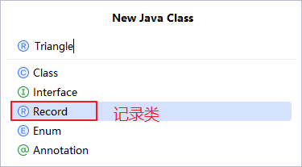
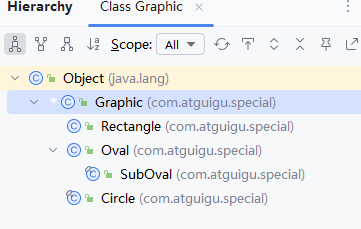
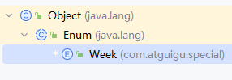
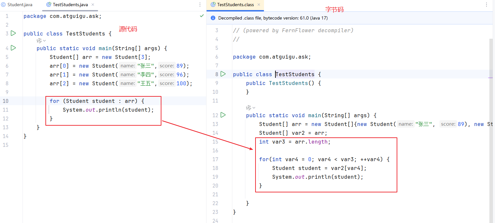
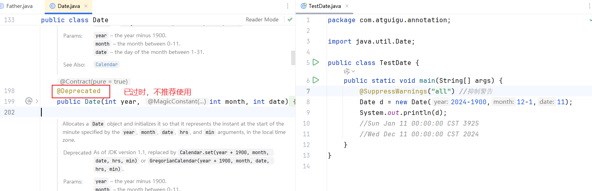

# 五、特殊类

## 5.1 新特性：记录类（了解）

Record类在JDK14、15预览特性，在JDK16中转正。

Record类是指常量类，它的实例变量都是final的，声明记录类的关键字是record



记录类中会自动重写equals和hashCode，toString，get方法。当然，你也可以再次手动重写。

```java
package com.atguigu.special;

/*
(double a, double b, double c)既是有参构造的形参列表，也是Triangle类的3个final的实例变量。
 */
public record Triangle(double a, double b, double c) {
}

```

```java
package com.atguigu.special;

public class TestTriangle {
    public static void main(String[] args) {
        Triangle t1 = new Triangle(3,4,5);
        Triangle t2 = new Triangle(3,4,5);
        System.out.println(t1);// System.out.println(t1.toString());
        System.out.println(t2);
        //打印对象，会自动调用对象的toString()
        //如果没有重写toString，默认出来的 像地址值的东西
        System.out.println(t1.equals(t2));
        //如果equals没有重写，默认比较的是对象的首地址

        System.out.println("单独获取a边的值：" + t1.a());
    }
}

```


## 5.2 新特性：密封类（了解）

Java 15通过密封的类和接口来增强Java编程语言，这是新引入的预览功能并在Java 16中进行了二次预览，并在Java17最终确定下来。

回忆：

如果一个类加了final修饰，表示这个类不能被继承，没有子类。

如果一个类加了abstract修饰，表示这个类是抽象类，不能直接创建对象，需要创建它子类的对象，抽象类是用来被继承的。

现在：

密封类是用来***限定某个类只能是被部分子类继承***的写法。

- 密封类本身得有sealed关键字修饰，同时要用permits关键字来说明允许哪些子类可以继承它
- 密封类的子类必须是以下3种之一
  - 继续是密封类sealed
  - 恢复普通类 non-sealed
  - 确定是断子绝孙类 final



```java
package com.atguigu.special;


/*
希望Graphic类只能被Circle，Rectangle类继承，不能被其他类继承
sealed：声明密封类的关键字
permits：声明该密封类只能允许哪些类继承它
    Graphic类只能被Circle, Rectangle继承
 */
public sealed class Graphic permits Circle, Rectangle,Oval {//图形类
    //关于类的成员，正常定义就可以
}

```

```java
package com.atguigu.special;

public final class Circle extends Graphic{
    //关于类的成员，正常定义就可以
}

```

```java
package com.atguigu.special;

public non-sealed class Rectangle extends Graphic{
    //关于类的成员，正常定义就可以
}

```

```java
package com.atguigu.special;

public sealed class Oval extends Graphic permits SubOval{//椭圆
    //关于类的成员，正常定义就可以
}

```

```java
package com.atguigu.special;

public final class SubOval extends Oval{
    //关于类的成员，正常定义就可以
}

```


## 5.3 枚举类（掌握）

枚举类是一种对象是固定的有限的几个常量对象的类型。枚举类的对象`不能`在外面随便new，它的对象是提前new好的，外面只能用它new好的对象。

应用场景：星期、月份等类型，它们的对象就是固定new好的。

JDK5之前需要通过：

- 构造器私有化
- 在类的内部提前创建好几个常量对象供外面使用


JDK5之后，通过enum关键字来声明枚举类型，可以轻松实现枚举效果。

- 声明枚举的关键字是enum
- 此时所有构造器默认都是private，也只能是private
- 它的直接父类java.lang.Enum，也只能是Enum
- 它没有子类，因为它的构造器私有化
- 它会从Object和Enum类中继承一些方法
  - String toString()：默认返回常量对象名，当然我们可以继续重写。
  - String name()：返回常量对象名
  - int ordinale()：返回常量对象的下标
  - static 枚举类型[] values()

- `建议`枚举类的实例变量加final，因为枚举类的对象都是常量对象，所以它们的属性一般也不建议修改。



```java
package com.atguigu.special;

/*
用普通类来实现，对象是固定的几个常量对象。
 */
/*
public class Week {
    public static final Week MONDAY = new Week();
    public static final Week TUESDAY = new Week();
    public static final Week WEDNESDAY = new Week("星期三");
    public static final Week THURSDAY = new Week();
    public static final Week FRIDAY = new Week();
    public static final Week SATURDAY = new Week();
    public static final Week SUNDAY = new Week();

    private String description;

    private Week(){//构造器私有化

    }

    private Week(String description) {//构造器私有化
        this.description = description;
    }

    @Override
    public String toString() {
        return "Week{" +
                "description='" + description + '\'' +
                '}';
    }
}
*/

public enum Week {
    MONDAY("星期一"),
    TUESDAY("星期二"),
    WEDNESDAY("星期三"),
    THURSDAY("星期四"),
    FRIDAY("星期五"),
    SATURDAY("星期六"),
    SUNDAY("星期日");


    private final String description;//建议实例变量加final

    //private在这里完全可以省略，因为枚举类中的构造器一定是私有的
/*    private Week(){//构造器私有化

    }*/
    private Week(String description) {//构造器私有化
        this.description = description;
    }

    //可以再次重写toString

    @Override
    public String toString() {
        return "Week{" +
                "name = " + name() +
                "，description='" + description + '\'' +
                '}';
    }
}
```

```java
package com.atguigu.special;

public class TestWeek {
    public static void main(String[] args) {
//       Week w1 = new Week();//外面不能new对象
        Week w3 = Week.WEDNESDAY;//获取对象，而不是重新创建对象
        System.out.println(w3);

        String name = w3.name();
        System.out.println("name = " + name);
        int index = w3.ordinal();
        System.out.println("index = " + index);
        System.out.println("=========================");
        Week[] all = Week.values();
        for (int i = 0; i < all.length; i++) {
            System.out.println(all[i]);
        }

        System.out.println("=========================");
        //switch结构支持哪些数据类型？
        //byte,short,int,char，String，枚举
        switch (w3){
            case MONDAY -> System.out.println("最困的一天1");
            case TUESDAY -> System.out.println("最困的一天2");
            case WEDNESDAY -> System.out.println("最困的一天3");
            case THURSDAY -> System.out.println("最困的一天4");
            case FRIDAY -> System.out.println("最困的一天5");
            case SATURDAY -> System.out.println("最困的一天6");
            case SUNDAY -> System.out.println("最清醒的一天");
        }
    }
}
```


# 六、增强for循环

增强for循环是一个语法糖。它以一种更简洁的方式，来编写代码。对于遍历数组来说，本质上仍然是普通的for循环。

```java
for(元素的类型 元素的临时名称 : 数组名或集合名){
    System.out.println(元素的临时名称);
}
```





# 七、注解

注解是给代码加一些注释，这个注释不仅是给人看，还给编译器等程序来看。

例如：@Override

它的作用用于标记某个方法是重写父类或父接口的方法，编译器看到他之后，会对这个方法做格式检查，看是不是满足重写的要求。

例如：@Deprecated

用于标记某个方法或类，已过时。

例如：@SuppressWarnings("all") 抑制警告




```java
package com.atguigu.annotation;

public class Father {
    public void print1n(){
        System.out.println("父类的方法");
    }

    public static void method(){
        System.out.println("父类的静态方法");
    }

    public void show(){
        System.out.println("父类的show()");
    }
}

```

```java
package com.atguigu.annotation;

public class Son extends Father{
//    @Override
    public void println(){
        System.out.println("子类重写的方法");
    }
//    @Override
    public static void method(){
        System.out.println("子类的静态方法");
    }

    //只要是正确重写，那么加不加@Override都一样
    public void show(){
        System.out.println("子类的show()");
    }
}

```

```java
package com.atguigu.annotation;

public class TestSon {
    public static void main(String[] args) {
        Father f = new Son();
        f.show();
    }
}

```

# 一