# 一、异常

## 1.1 什么是异常？

异常是指在Java程序中，发生不正常的情况，使得程序无法正常运行。


## 1.2 异常的分类（掌握分类）

1、编译时异常：编译器`“预感”`到这个程序`“可能”`存在问题，就提醒你要注意，提前做好`预案`，即如果这个异常真发生了，你要怎么处理，否则编译就不通过。处理有两种态度：（1）当前方法不管它，直接抛出去，扔给调用者处理，如果是main，扔出去的话，相当于直接挂掉（2）积极处理，try-catch。

2、运行时异常：编译器“检测”不到，直到程序运行时才发生异常。

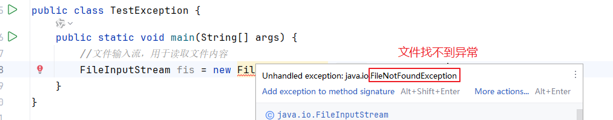

> 结论：
>
> 如果编译器在编译阶段就给出“预警”的异常类型，就是编译时异常，否则就是运行时异常。

```java
package com.atguigu.exception;

import java.io.FileInputStream;
import java.io.FileNotFoundException;

public class TestException {
    public static void main(String[] args) {
        try {
            //文件输入流，用于读取文件内容
            FileInputStream fis = new FileInputStream("d:\\1.txt");
        } catch (FileNotFoundException e) {
            System.out.println("...");
        }

        //System.out.println(1/0);//编译器没有提示我们风险，运行时发生ArithmeticException算术异常
//        int[] arr = {1,2,3};
//        System.out.println(arr[5]);//编译器没有提示我们风险，运行时发生ArrayIndexOutOfBoundsException

      //  Object obj = "hello";//多态引用，父类Object的变量指向子类String的对象
      //  Integer num = (Integer) obj;//编译器没有提示我们风险，运行时发生ClassCastException
    }
}

```


## 1.3 异常的体系结构

Java中一切皆对象。同样，Java中的异常和错误也用对象表示。Java中所有异常和错误的根类型是java.lang.Throwable类型。

查看Java的API文档，所谓的API文档是 Application Program Interface（应用程序编程接口）的帮助文档。在JDK的API文档中说明了核心类库JRE中提供给我们程序员用的类、接口及其公共方法的说明。

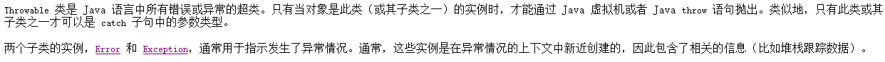

Throwable又分为两大类：

- Error：用于指示合理的应用程序不应该试图捕获的严重问题。例如：VirtualMachineError下的OutOfMemoryError（堆内存溢出错误）, StackOverflowError(栈内存溢出错误，曾经在递归中见过)
- Exception：指出了合理的应用程序想要捕获的条件。对于Exception的态度，建议大家（1）能避免的尽量避免（通过基础知识的把握以及条件判断来避免）（2）不能避免的，再用try-catch等机制来解决。
  - Exception又分为编译时和运行时异常（见1.2小节）。所有运行时异常都是RuntimeException及其子类。

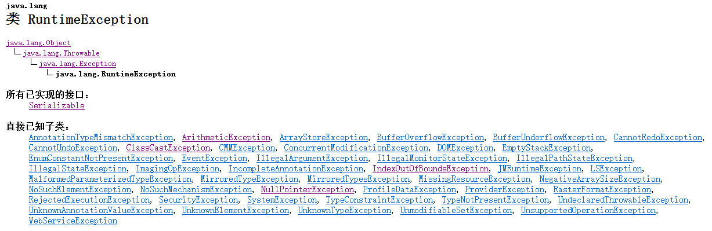


## 1.4 异常的处理（掌握5个关键字）         

### 1.4.1 try-catch

try：尝试执行xx代码。

catch：尝试捕获xx异常对象。

```java
try{
    可能发生异常的代码
}catch(异常的类型1 参数名){//参数名习惯上用e表示，当然也可以是别的
    编写打印异常的代码（前期是打印到控制台，后期是记录到日志当中） 以及 处理异常的代码
}catch(异常的类型2 参数名){//参数名习惯上用e表示，当然也可以是别的
    编写打印异常的代码（前期是打印到控制台，后期是记录到日志当中） 以及 处理异常的代码
}catch(异常的类型3 参数名){//参数名习惯上用e表示，当然也可以是别的
    编写打印异常的代码（前期是打印到控制台，后期是记录到日志当中） 以及 处理异常的代码
}
```

多个catch分支，遵循从上往下依次判断的顺序，如果上面的类型匹配了，下面catch就不看了。如果多个catch的异常类型有父子类关系的话，那么子在上父在下。如果它们没有父子类关系，那么顺序可以随意。

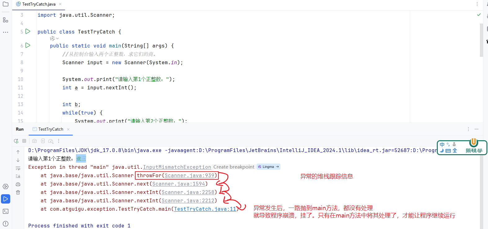

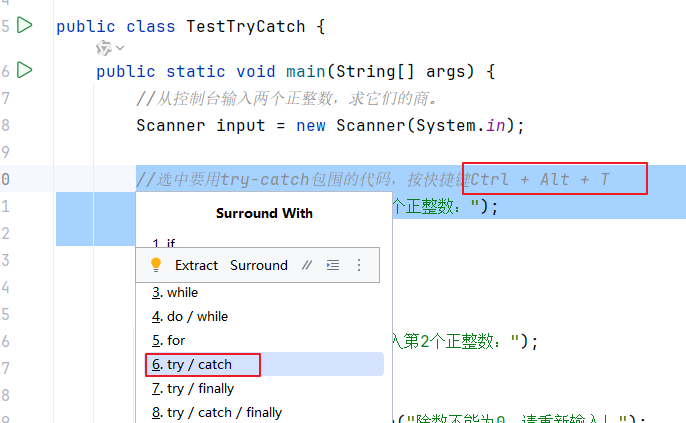


```java
package com.atguigu.exception;

import java.util.InputMismatchException;
import java.util.Scanner;

public class TestTryCatch {
    public static void main(String[] args) {
        //从控制台输入两个正整数，求它们的商。
        Scanner input = new Scanner(System.in);
        int a = 0;

        while (true) {
            try {
                //选中要用try-catch包围的代码，按快捷键Ctrl + Alt + T
                System.out.print("请输入第1个正整数：");
                a = input.nextInt();
                break;//如果input.nextInt()没有发生异常，那么break;会执行，catch不走。如果input.nextInt()发生异常了，break;不执行，跳到catch执行
            } catch (InputMismatchException e) {//当然你写它的笼统的父类Exception也可以。
                //打印异常
                //方式一：
                //System.out.println(e);//普通信息的打印
                //方式二：
                // System.err.println(e);//错误信息的打印，默认用红色打印错误信息
                //方式三：
                // e.printStackTrace();//异常自带的标准的打印方式（前期一般用它）

                //把错误的不符合int类型的数据读取掉
                input.nextLine();//读取一整行，这里没有接收，因为这是错误的数据，不是我们要的数据
            }
        }

        int b;
        while(true) {
            try {
                System.out.print("请输入第2个正整数：");
                b = input.nextInt();
                if (b == 0) {
                    System.out.println("除数不能为0，请重新输入！");
                }else{
                    break;
                }
            } catch (Exception e) {
                //把错误的不符合int类型的数据读取掉
                input.nextLine();//读取一整行，这里没有接收，因为这是错误的数据，不是我们要的数据
            }
        }

        if(a<0){
            a = -a;//写法1，求负数的绝对值
        }
        b = Math.abs(b);//写法2，求绝对值

        int result = a / b;
        System.out.println("result = " + result);

        input.close();

    }
}

```


### 自我练习题目

```
顺序 1（子类→父类）：正常捕获 NullPointerException，因为异常会匹配第一个符合的 catch 块。
顺序 2（父类→子类）：编译器报错 “Unreachable catch block for NullPointerException”，
因为 Exception 是所有异常的父类，会先捕获所有异常，子类异常的 catch 块永远执行不到。
结论：catch 块必须按 “子类异常在前，父类异常在后” 排列，否则子类异常的 catch 块会被父类异常 “屏蔽”，无法执行。
```

`FileReader` 的构造方法抛出的是 **checked 异常**（具体是 `FileNotFoundException`，它是 `IOException` 的子类）。

`FileNotFoundException` 继承自 `IOException`，而 `IOException` 是 checked 异常，因此必须在编译时处理。

### 为什么必须处理？

### 1. **文件操作的不确定性**

文件相关的操作具有很多不可控因素：

- 文件可能不存在
- 路径可能错误
- 权限不足无法访问
- 文件被其他程序占用

### 2. **编译时强制检查**

checked 异常的设计哲学是：**强制程序员处理可能发生的、可预期的错误情况**。

java

```java
// 不处理会编译错误
FileReader reader = new FileReader("test.txt"); // ❌ 编译错误

// 必须用 try-catch
try {
    FileReader reader = new FileReader("test.txt");
} catch (FileNotFoundException e) {
    e.printStackTrace();
}

// 或者用 throws 声明
public void readFile() throws FileNotFoundException {
    FileReader reader = new FileReader("test.txt");
}
```


### 3. **资源管理的必要性**

文件是重要的系统资源，必须确保：

- 打开成功后才能使用
- 使用完毕后正确关闭
- 异常情况下有合适的恢复策略

### checked与 unchecked 异常的区别

| checked 异常                  | unchecked 异常                                     |
| :---------------------------- | :------------------------------------------------- |
| 必须显式处理                  | 不强制处理                                         |
| 编译时检查                    | 运行时检查                                         |
| 可预期的错误                  | 程序逻辑错误                                       |
| 如：IOException, SQLException | 如：NullPointerException, IllegalArgumentException |

```java
// 推荐：使用 try-with-resources 自动管理资源
try (FileReader reader = new FileReader("test.txt");
     BufferedReader br = new BufferedReader(reader)) {
    // 使用 reader
} catch (FileNotFoundException e) {
    System.out.println("文件未找到: " + e.getMessage());
} catch (IOException e) {
    System.out.println("IO错误: " + e.getMessage());
}
```

### 题目要求

1. 定义一个 **自定义异常类** `AgeIllegalException`，继承 `Exception`，用于表示 “年龄不合法”（如年龄 <0 或 >150）。
2. 编写一个方法 `checkAge(int age)`，如果年龄不合法，抛出 `AgeIllegalException`，并传入提示信息（如 “年龄不能小于 0！”）。
3. 在 `main` 方法中调用 `checkAge()`，传入不同的年龄值（如 20、-5、200），使用 try-catch 捕获 `AgeIllegalException`，并打印异常信息。

```java
package day_13.test_01异常.test_01_01;

import java.util.Scanner;

/*
* 题目要求
定义一个 自定义异常类 AgeIllegalException，继承 Exception，用于表示 “年龄不合法”（如年龄 <0 或 >150）。
编写一个方法 checkAge(int age)，如果年龄不合法，抛出 AgeIllegalException，并传入提示信息（如 “年龄不能小于 0！”）。
在 main 方法中调用 checkAge()，传入不同的年龄值（如 20、-5、200），使用 try-catch 捕获 AgeIllegalException，并打印异常信息。
* */
public class test_004 {
    public static void main(String[] args) {
        Scanner sc = new Scanner(System.in);
        try {
            System.out.println("请输入年龄:");
            int age = sc.nextInt();
            checkAge(age);
        } catch (AgeIllegalException e) {
            //throw new RuntimeException(e);
            System.out.println(e.getMessage());
        }
    }
    public static void checkAge(int age) throws AgeIllegalException {
        /*
 - AgeIllegalException 继承自 Exception 类（非 RuntimeException ），属于 检查型异常
- Java语言规定： 所有检查型异常必须在方法签名中使用 throws 声明，或者在方法体内使用 try-catch 捕获,也就是捕获后不会编译报错
- 如果不加第12行的 throws AgeIllegalException 声明，直接在第14行抛出该异常，违反了Java的编译规则
- 如果方法中抛出了检查型异常但未声明，编译器会报错并拒绝编译通过
- 这种机制确保开发者必须显式处理潜在的异常情况，提高程序的健壮性
        * */
        if (age < 0) {
            throw new AgeIllegalException();
        }
    }
}

```

```java
package day_13.test_01异常.test_01_01;

public class AgeIllegalException extends Exception{
    public AgeIllegalException() {
        System.out.println("年龄不合法!");
    }

    public AgeIllegalException(String message) {
        super(message);
    }

    public AgeIllegalException(String message, Throwable cause) {
        super(message, cause);
    }

    public AgeIllegalException(Throwable cause) {
        super(cause);
    }

    public AgeIllegalException(String message, Throwable cause, boolean enableSuppression, boolean writableStackTrace) {
        super(message, cause, enableSuppression, writableStackTrace);
    }
}

```


### 1.4.2 try-catch-finally

finally块是用于编写无论如何都要执行的代码。解释无论如何：

- 无论try中是否会发生异常
- 也不管catch能不能捕获异常
- 哪怕try-catch中有return语句

唯一能让它不执行的是System.exit(0);退出JVM

#### 案例1：try没有异常

```java
package com.atguigu.exception;

public class TestTryCatchFinally {
    public static void main(String[] args) {
        try{
            System.out.println("hello");
        }catch(Exception e){
            System.err.println("错误信息");
        }finally {
            System.out.println("finally");
        }
        System.out.println("atguigu");
    }
}

```

执行结果：

```
hello
finally
atguigu
```

#### 案例2：try有异常且捕获

```java
package com.atguigu.exception;

public class TestTryCatchFinally2 {
    public static void main(String[] args) {
        try{
            System.out.println(1/0);//有异常
        }catch(Exception e){
            System.err.println("错误信息");
        }finally {
            System.out.println("finally");
        }
        System.out.println("atguigu");
    }
}

```

执行结果：

```
错误信息
finally
atguigu
```

#### 案例3：try有异常未捕获

```java
package com.atguigu.exception;

public class TestTryCatchFinally3 {
    public static void main(String[] args) {
        try{
            System.out.println(1/0);//有异常 算术异常
        }catch(ArrayIndexOutOfBoundsException e){//捕获下标越界异常
            System.err.println("错误信息");
        }finally {
            System.out.println("finally");
        }
        System.out.println("atguigu");
    }
}
```

执行结果：

```
finally
Exception in thread "main" java.lang.ArithmeticException: / by zero
	at com.atguigu.exception.TestTryCatchFinally3.main(TestTryCatchFinally3.java:6)
```

#### 案例4：try有return

```java
package com.atguigu.exception;

public class TestTryCatchFinally4 {
    public static void main(String[] args) {
        try{
            System.out.println("hello");
            return;//结束main
        }catch(Exception e){
            System.err.println("错误信息");
        }finally {
            System.out.println("finally");
        }

        System.out.println("atguigu");//不执行
    }
}

```

执行结果：

```
hello
finally
```

#### 案例5：try有System.exit(0)

```java
package com.atguigu.exception;

public class TestTryCatchFinally5 {
    public static void main(String[] args) {
        try{
            System.out.println("hello");
            System.exit(0);//退出JVM
        }catch(Exception e){
            System.err.println("错误信息");
        }finally {
            System.out.println("finally");
        }

        System.out.println("atguigu");
    }
}

```

执行结果：

```
hello
```

#### 练习题1

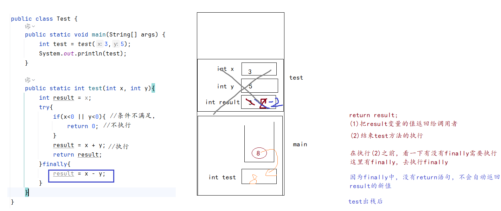

#### 练习题2

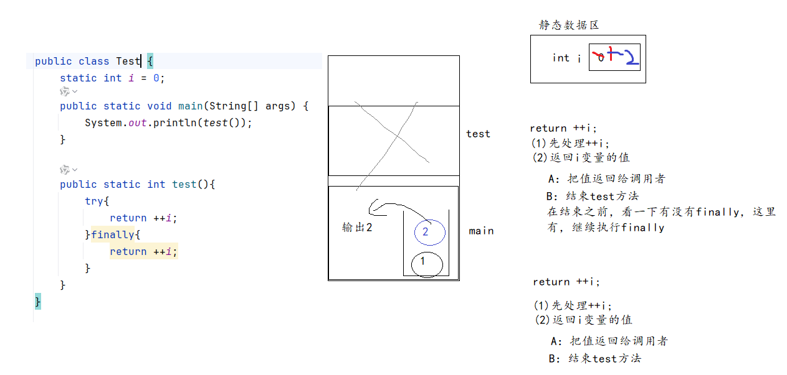


### 1.4.3 关键字：throws

throws的作用：用于`声明`当前方法中`可能`发生xx类型的`异常`，而且当前方法`未处理`，交给调用者处理。谁调用谁处理。

调用者最好要用try-catch处理，如果所有方法都不处理，都选择throws，那么一旦发生异常，程序就挂了，程序很脆弱。

```java
【修饰符】 class 类名{
    //比如下面的方法声明就写出了抛出异常，但是如果在方法的内部使用了try/catch，则不需要再声明后面抛出异常
     public static void checkAge(int age) throws AgeIllegalException
    【①修饰符】 ②返回值类型 ③方法名(④【形参列表】)【⑤throws 异常列表】{
        ⑥方法体语句;
    }
}
```

说明：throws后面写异常的类型，而且可以是多个类型，用逗号分隔。

|                                              | 重载             | 重写                                                         |
| -------------------------------------------- | ---------------- | ------------------------------------------------------------ |
| 位置                                         | 同一个类或父子类 | 父子类中（父类或父接口）                                     |
| 权限修饰符                                   | 不看             | >=，不能是private                                            |
| 其他修饰符                                   | 不看             | 不能是static，final                                          |
| 返回值类型                                   | 不看             | （1）基本数据类型和void：完全相同<br />（2）引用数据类型：<= |
| 方法名                                       | 完全相同         | 完全相同                                                     |
| 形参列表（个数、类型、顺序）<br />与名字无关 | 完全不同         | 完全相同                                                     |
| throws 异常类型列表                          | 不看             | 总：<=<br />小于等于的原则是针对编译时异常类型，关于运行时异常其实编译器是检测不到的 |

> 重写的要求：两同两小一大

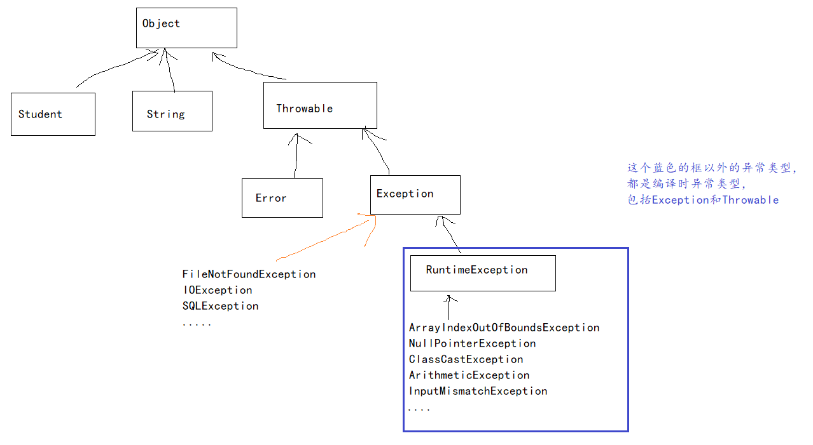

```java
package com.atguigu.exception;

import java.io.FileInputStream;
import java.io.FileNotFoundException;

public class FileTools {
    //打算写一个复制文件的方法
    //srcFile代表源文件
    //destDirectory代表目标文件夹
    //例如：D:\\1.txt 复制到 D:\\temp文件夹
    public static void copy(String srcFile, String destDirectory)throws FileNotFoundException{
        //第一步：读取源文件的内容
        FileInputStream fis = new FileInputStream(srcFile);
        //.....
    }
}

```

```JAVA
package com.atguigu.exception;

import java.io.FileNotFoundException;
import java.util.Scanner;

public class TestThrows {
    public static void main(String[] args) {
        Scanner input = new Scanner(System.in);

        while(true) {
            try {
                System.out.print("请输入你要复制的文件的路径名：");
                String srcFile = input.next();

                FileTools.copy(srcFile, "d:\\temp");
                break;
            } catch (FileNotFoundException e) {
                System.out.println("你输入的文件路径不存在，请重新输入！");
            }
        }

        input.close();
    }
}
```


### 1.4.4 关键字：throw

|            | throws                                 | throw                                                  |
| ---------- | -------------------------------------- | ------------------------------------------------------ |
| 出现的位置 | 出现在方法的()后面                     | 出现构造器/成员方法的方法体{ } 里面                    |
| 作用       | 告知调用者当前方法可能发生xx类型的异常 | 手动抛出一个异常对象，只要这个语句执行了，异常就发生了 |

```java
package com.atguigu.exception;

public class Triangle {
    private double a;
    private double b;
    private double c;

    public Triangle(double a, double b, double c) throws Exception{
        if(a>0 && b > 0 && c >0 && a+b>c && b+c>a && a+c>b) {
            this.a = a;
            this.b = b;
            this.c = c;
        }else{
         //   throw new IllegalArgumentException(a+","+b+","+c +"无法构成三角形");
            //非法参数异常（Illegal非法,Argument参数）
            throw new Exception(a+","+b+","+c +"无法构成三角形");
            //IllegalArgumentException异常是运行时异常，编译器不检测
            //Exception是编译时异常，编译器会预警，告诉你，这个异常可能发生，你需要提前准备
            //（1）要么throws（2）用么try-catch
        }
    }
    //省略get/set

    @Override
    public String toString() {
        return "Triangle{" +
                "a=" + a +
                ", b=" + b +
                ", c=" + c +
                '}';
    }
}

```

```java
package com.atguigu.exception;

public class TestTriangle {
    public static void main(String[] args) {
        try {
            Triangle t1 = new Triangle(3,4,5);
            System.out.println(t1);
        } catch (Exception e) {
            e.printStackTrace();
        }

        try {
            Triangle t2 = new Triangle(3,3,7);
            System.out.println(t2);
        } catch (Exception e) {
            e.printStackTrace();
        }

        System.out.println("atguigu");
    }
}

```


## 1.5 Object类的方法

### 1.5.1 Object类的clone方法（了解）

Object类的方法，所有类都会继承。所以，我们需要了解Object类的**所有方法**。

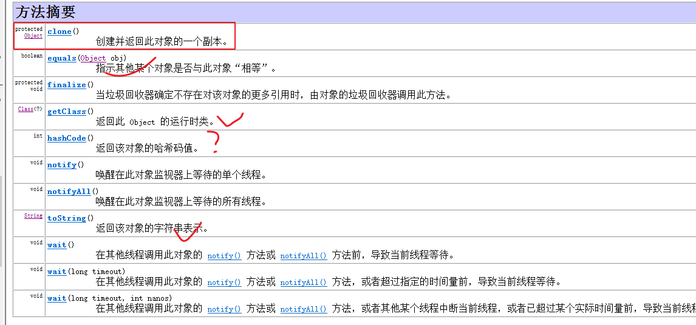

clone方法用于克隆对象的，就是复制一个一模一样的对象。

子类如果需要使用克隆功能，需要实现Cloneable接口，然后重写clone方法。

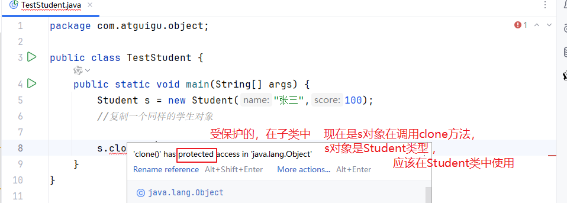

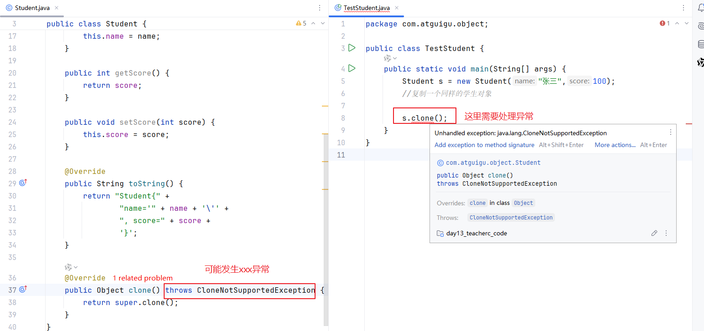


```java
package com.atguigu.object;

public class Student implements Cloneable{
    private String name;
    private int score;

    public Student(String name, int score) {
        this.name = name;
        this.score = score;
    }

    public String getName() {
        return name;
    }

    public void setName(String name) {
        this.name = name;
    }

    public int getScore() {
        return score;
    }

    public void setScore(int score) {
        this.score = score;
    }

    @Override
    public String toString() {
        return "Student{" +
                "name='" + name + '\'' +
                ", score=" + score +
                '}';
    }

    @Override
    public Student clone() throws CloneNotSupportedException {
        return (Student) super.clone();

    }
}

```


```java
package com.atguigu.object;

public class TestStudent {
    public static void main(String[] args) {
        Student s = new Student("张三",100);
        System.out.println(s);
        //复制一个同样的学生对象

        try {
            Student s2 = s.clone();
            System.out.println(s2);
        } catch (CloneNotSupportedException e) {
            e.printStackTrace();
        }
    }
}

```

### 1.5.2 Object类finalize方法

finalize方法现在已经过时了，不推荐我们使用了。

> 面试题：final、finally、finalize有什么区别？
>
> final：修饰类不能被继承，修饰方法不能被重写，修饰变量值不能被修改。
>
> finally：结合try-catch使用，无论如何都要执行的代码放finally块，一般写资源关闭代码，后面学习的IO流，网络连接等资源对象的关闭。
>
> ​		      应该避免在finally类中计算的代码，避免写return语句。
>
> finalize：Object类的一个方法，早期的时候是用于GC（垃圾回收器）在回收对象之前，做清理工作。