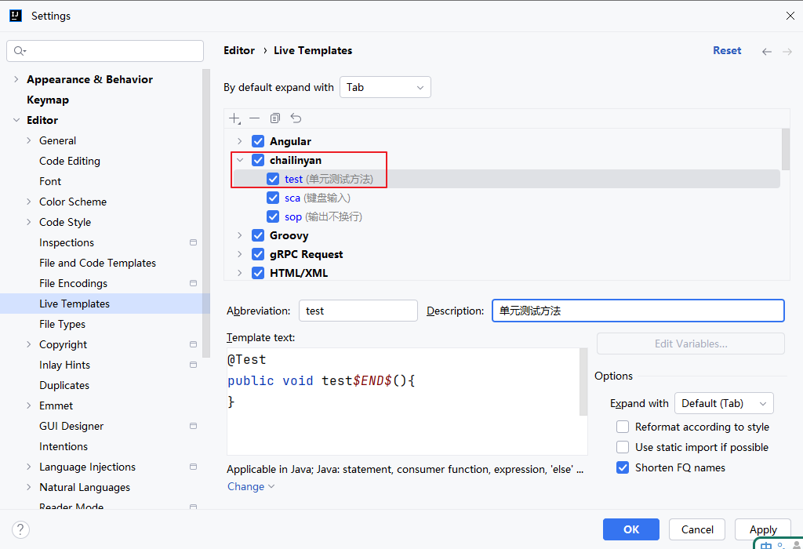
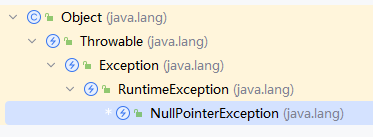
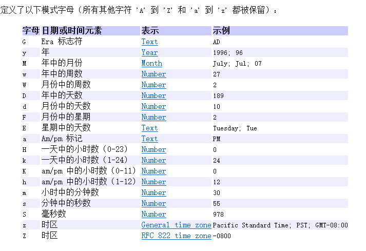
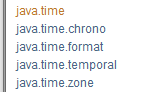
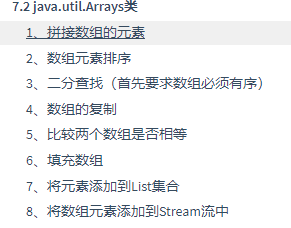
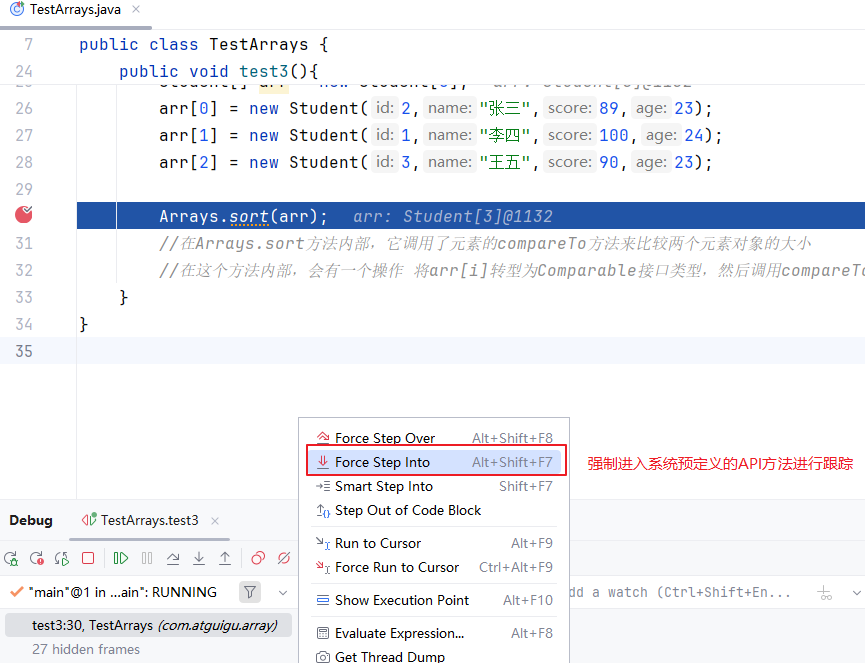

# 三、常用类的API

## 3.1 包装类

### 3.1.1 什么是包装类

Java是面向对象的编程语言，但是它不纯。因为它包含8种基本数据类型和void，这些类型都不是引用数据类型。但是，Java后面的很多API，或新特性都是只为对象服务的，那么8种基本数据类型的数据就无法使用那些新的API或新特性，例如：泛型、集合等。

为了解决这个问题，Java为8种基本数据类型分别设置了包装类，使得基本数据类型和对象之间可以自由切换。

| 基本数据类型 | 包装类    |
| ------------ | --------- |
| byte         | Byte      |
| short        | Short     |
| int          | Integer   |
| long         | Long      |
| float        | Float     |
| double       | Double    |
| char         | Character |
| boolean      | Boolean   |

### 3.1.2 自动装箱与拆箱

JDK5之前需要手动装箱与拆箱，比较麻烦。JDK5之后才支持自动装箱与拆箱。

- 装箱：基本数据类型 -> 包装类对象
- 拆箱：包装类对象 -> 基本数据类型的数据

> 自动装箱与拆箱，只支持对应类型之间，对应关系看上面的表格。




### 3.1.3 装箱和拆箱的应用

- 当一个包装类对象与一个基本数据类型 比较 == 和 != ，或大小比较等，都会把包装类对象拆箱
- 如果是两个包装类对象之间 == 和 != 比较，`不拆箱`
- 如果是两个包装类对象之间的>, <等大小比较，也会自动拆箱

```java
package com.atguigu.wrap;

import org.junit.Test;

public class TestBoxing {
    @Test
    public void test1(){
        Integer i = 1;//自动装箱，左边是引用数据类型，右边是基本数据类型
        int j = i;//自动拆箱，i是对象，j是基本数据类型
    }

    @Test
    public void test2(){
        Integer i = 200;
        int j = 200;
        System.out.println(i == j);//把i自动拆箱，变为2个int值比较
    }

    @Test
    public void test3(){
        Integer i = 200;
        Integer j = 200;
        System.out.println(i == j);//false  比较两个对象的地址值
    }

    @Test
    public void test4(){
        Integer i = 200;
        Double j = 200.0;
        //System.out.println(i == j);//报错， 两个对象的类型不一致，它们之间也没有父子类关系，是无法比较地址是否相等

    }

    @Test
    public void test5(){
        Integer i = 200;
        double j = 200.0;
        System.out.println(i == j);//i会自动拆箱
    }

    @Test
    public void test6(){
        Integer i = 200;
        Double j = 200.0;
        System.out.println(i > j);//两个都拆箱会基本数据类型
    }

    @Test
    public void test7(){
       // Double d = 1; //无法自动装箱
       // int a = d;//无法自动拆箱
        //Double 对应的类型 double
        //int 对应的类型是Integer
        //int 与 Double不是对应类型

        double d = 1;//基本数据类型的自动提升
        Double d2 = 1.0;
        Double d3 = 1D; //D代表double类型
    }
}

```


### 3.1.4 特殊2点

#### 1、对象不可变

```java
package com.atguigu.wrap;

import org.junit.Test;

public class TestChange {
    @Test
    public void test1(){
        Integer a = 1;
        int[] nums = {1};//一个元素的数组
        int b = 1;
        change(a, nums,b );
        System.out.println("a = " + a);//a = 1
        System.out.println("nums[0] = " + nums[0]);//nums[0] = 2
        System.out.println("b = " + b);//b=1
    }

    public void change(Integer i,int[] arr, int k){
        //因为包装类对象不可变，那么只要修改包装类对象的值，就会得到新对象
        i++; //等价于 i = new Integer(i+1);
        i=10; //等价于 i = new Integer(10);

        arr[0]++;
        arr = new int[2];//一旦形参指向新对象，就与原来实参对象无关了
        arr[0] = 10;

        k++; //形参是基本数据类型，无论怎么修改都与实参无关
    }
}


```


#### 2、部分包装类对象可以共享

共享的好处：可以大量的减少对象的数量。

共享的前提：对象不可变。

| 基本数据类型 | 包装类    | 缓存对象/共享对象 | 包装类和基本数据的数据范围 |
| ------------ | --------- | ----------------- | -------------------------- |
| byte         | Byte      | [-128, 127]       | [-128, 127]                |
| short        | Short     | [-128, 127]       | [-32768,32767]             |
| int          | Integer   | [-128, 127]       | 很大                       |
| long         | Long      | [-128, 127]       | 很大                       |
| float        | Float     | 无                | 很大                       |
| double       | Double    | 无                | 很大                       |
| char         | Character | [0,127]           | [0,65535]                  |
| boolean      | Boolean   | true和false       | true和false                |

```java
package com.atguigu.wrap;

import org.junit.Test;

public class TestShare {
    @Test
    public void test1(){
        Integer i = 200;
        Integer j = 200;
        System.out.println(i == j);//false
    }
    @Test
    public void test2(){
        Integer i = 1;
        Integer j = 1;
        System.out.println(i == j);//true
        //两个1对象共享，i和j指向同一个1对象
    }

    @Test
    public void test3(){
        Integer i = Integer.valueOf(1);
        Integer j = Integer.valueOf(1);;
        System.out.println(i == j);//true
        //两个1对象共享，i和j指向同一个1对象
    }

    @Test
    public void test4(){
        Integer i = new Integer(1);//严重警告
        Integer j = new Integer(1);
        System.out.println(i == j);//false
    }
}

```


### 3.1.5 常用的常量和方法

- 包装类.MAX_VALUE
- 包装类.MIN_VALUE
- 包装类.compare（参数1，参数2）
- 包装类.parseXxx(字符串) 
  - Integer.parseInt(字符串)
  - Double.parseDouble(字符串)

```java
package com.atguigu.wrap;

import lombok.AllArgsConstructor;
import lombok.Data;
import lombok.NoArgsConstructor;

@Data //自动生成get/set，equals和hashCode，toString等方法
@NoArgsConstructor //生成无参构造
@AllArgsConstructor //生成全参构造，为所有实例变量初始化的构造器
public class Employee implements  Comparable{
    private int id;
    private String name;
    private double salary;
    private int age;

    @Override
    public int compareTo(Object o) {
        return this.id - ((Employee)o).id;
    }
}

```

```java
package com.atguigu.wrap;

import org.junit.Test;

import java.util.Arrays;
import java.util.Comparator;

public class TestAPI {
    @Test
    public void test1(){
        System.out.println("int整数的最大值：" + Integer.MAX_VALUE);
        System.out.println("int整数的最小值：" + Integer.MIN_VALUE);
        /*
        int整数的最大值：2147483647
        int整数的最小值：-2147483648
         */
    }

    @Test
    public void test2(){
        Employee[] arr = new Employee[4];
        arr[0] = new Employee(2,"张三",15000,23);
        arr[1] = new Employee(1,"李四",16000,26);
        arr[2] = new Employee(3,"王五",12000,27);
        arr[3] = new Employee(4,"赵六",19000,21);

        System.out.println("按照id升序排序：");
        //直接使用java.util.Arrays工具类
        Arrays.sort(arr);//会按照元素的compareTo方法来比较两个对象的大小

        //增强for
        for (Employee e : arr) {
            System.out.println(e);
        }

        System.out.println("按照年龄升序排序：");
        //按照年龄排序，从小到大
        Comparator c = new Comparator(){
            @Override
            public int compare(Object o1, Object o2) {
                Employee e1 = (Employee) o1;
                Employee e2 = (Employee) o2;
//                return e1.getAge() - e2.getAge();
                return Integer.compare(e1.getAge(),e2.getAge());//作用与上面相减的相同
            }
        };
        Arrays.sort(arr, c);//让它用c对象的compare方法来比较两个员工对象的大小
        //再次遍历
        for (Employee e : arr) {
            System.out.println(e);
        }

        System.out.println("按照薪资升序排序：");
        Comparator c2 = new Comparator() {
            @Override
            public int compare(Object o1, Object o2) {
                Employee e1 = (Employee) o1;
                Employee e2 = (Employee) o2;
                /*if(e1.getSalary() > e2.getSalary()){
                    return 1;
                }else if(e1.getSalary() < e2.getSalary()){
                    return -1;
                }
                return 0;*/
                return Double.compare(e1.getSalary(),e2.getSalary());
            }
        };
        Arrays.sort(arr, c2);//让它用c2对象的compare方法来比较两个员工对象的大小
        //再次遍历
        for (Employee e : arr) {
            System.out.println(e);
        }
    }

    @Test
    public void test4(){
        //整数 -> String
        int num = 1;
        String str = num + "";
        String str2 = String.valueOf(num);

        //String -> int
        String str3 = "123";
        String str4 = "456";
        System.out.println(str3 + str4);//拼接 123456
        int a = Integer.parseInt(str3);
        int b = Integer.parseInt(str4);
        System.out.println(a + b);//求和
    }

    @Test
    public void test5(){
        String s1 = "3.14";
        String s2 = "6.36";
        double d1 = Double.parseDouble(s1);
        double d2 = Double.parseDouble(s2);
        System.out.println(d1 + d2);
    }
}

```

### 第3题：设备状态枚举类

（1）声明设备状态枚举类Status

- 声明final修饰的String类型的属性description和int类型的属性value，value值初始化为ordinal()值
- 声明有参构造Status(String description)
- 重写toString方法，返回description值
- 提供静态方法public static Status getByValue(int value)：根据value值获取Status状态对象
- 创建3个常量对象：

```java
FREE("空闲"), USED("在用"), SCRAP("报废")
```

（2）声明设备类型Equipment

- 声明设备编号(int)、设备的品牌（String）、价格（double）、设备名称（String）、状态（Status）属性，私有化
- 提供无参和有参构造
- 重写toString方法，返回设备信息

（3）现有Data.java，代码如下：

```java
public class Data {
    public static final String[][] EQUIPMENTS = {
            {"1", "联想", "6000", "拯救者","0"},
            {"2", "宏碁 ","5000", "AT7-N52","0"},
            {"3", "小米", "2000", "5V5Pro","1"},
            {"4", "戴尔", "4000", "3800-R33","1"},
            {"5", "苹果", "12000", "MBP15","1"},
            {"6", "华硕", "8000", "K30BD-21寸","2"},
            {"7", "联想", "7000", "YOGA","0"},
            {"8", "惠普", "5800", "X500","2"},
            {"9", "苹果", "4500","2021Pro","0"},
            {"10", "惠普", "5800", "FZ5","1"}
    };
}
```

（4）在测试类中，创建Equipment类型的数组，并使用Data类的二维数组EQUIPMENTS的信息初始化设备对象，遍历输出

```java
package day_13.homework_01;

public  enum Status {
    FREE("空闲"),
    USED("在用"),
    SCRAP("报废");

    private final String description;
    private final int value;

    // 私有构造器
    private Status(String description) {
        this.description = description;
        this.value = ordinal();
        //ordinal() 是Java枚举类型内置的方法，它返回枚举常量在声明时的位置序号（从0开始）。
        //由于每个枚举的实例化对象创建的时候都会调用构造器，所以FREE、USED、SCRAP三个实例化对象创建的时候就调用私有化构造器了，而私有化
        //构造器中直接 this.value = ordinal(); 所以这些实例化的枚举对象就根据自身声明时的编号放入了自己的value属性中，也就实现了
        //getByValue(int value)方法中增强for循环的status对象可以直接访问自己的value属性
    }

    // 重写toString方法，返回description值
    @Override
    public String toString() {
        return description;
    }

    // 提供静态方法根据value值获取Status状态对象
    public static Status getByValue(int value) {
        for (Status status : Status.values()) {
            //Status.values() ：这是Java枚举类型自带的静态方法，它返回一个包含所有枚举常量的数组，在这个例子中就是
            // FREE 、 USED 和 SCRAP 这三个枚举实例
            if (status.value == value) {
                /*
在Java中，枚举类型有些特殊。当我们定义一个枚举类型时（如 Status ），编译器会自动为我们创建一些特殊的东西：
枚举常量 ：像 FREE 、 USED 、 SCRAP 这样的常量，它们实际上是 Status 类型的 实例对象 ，而不仅仅是名称。
values()方法 ：这是枚举类自动拥有的静态方法，它返回一个包含所有枚举常量的数组。

也就是说，这里的每一次循环的status，实际上都已经代表着Status.values()方法返回的一个实例对象，所以能够访问自身对应的value                * */
                return status;
            }
        }
        return null;
    }
}


```

```java
package day_13.homework_01;

public class TestMyWork {
    public static void main(String[] args) {
        // 创建Equipment数组
        Equipment[] equipments = new Equipment[10];
        
        // 使用Data.EQUIPMENTS数据初始化设备对象
        for (int i = 0; i < Data.EQUIPMENTS.length; i++) {
            String[] data = Data.EQUIPMENTS[i];
            int id = Integer.parseInt(data[0]);
            //将字符串的整数值转为int型整数值
            String brand = data[1];
            double price = Double.parseDouble(data[2]);
            //将字符串类型的小数值转为double型的小数值
            String name = data[3];
            int statusValue = Integer.parseInt(data[4]);
            Status status = Status.getByValue(statusValue);
            
            equipments[i] = new Equipment(id, brand, price, name, status);
        }
        
        // 遍历输出设备信息
        System.out.println("设备信息列表：");
        System.out.println("--------------------------------------------");
        for (Equipment equipment : equipments) {
            System.out.println(equipment);
        }
        System.out.println("--------------------------------------------");
    }
}

```

### 第3题：分析运行结果

```java
public class Test {
	public static int fun(){
		int result = 5;
		try{
			result = result / 0;
			return result;
		}catch(Exception e){
			System.out.println("Exception");
			result = -1;
			return result;
		}finally{
			result = 10;
			System.out.println("I am in finally.");
		}
	}
	public static void main(String[] args) {
		int x = fun();
		System.out.println(x);
	}
}

```

参考答案：

```java
Exception
I am in finally.
-1
```

答案解析：

```java
package com.atguigu.homework3;

public class Test {
    public static int fun(){
        int result = 5;
        try{
            result = result / 0;//发生异常
            return result;
        }catch(Exception e){//捕获异常
            System.out.println("Exception");
            result = -1;
            return result;//将-1存入返回值缓冲区，但方法尚未真正返回
        }finally{//finally要在方法结束之前执行
            result = 10;//这里修改的是局部变量result的值
//- 当执行到try或catch块中的 return 语句时，JVM会先将返回值保存到一个临时缓冲区中
//然后无条件执行finally块中的代码
//最后，如果finally块中没有新的 return 语句覆盖原来的返回值，方法会返回之前保存在缓冲区中的值
            System.out.println("I am in finally.");
        }
    }
    public static void main(String[] args) {
        int x = fun();
        System.out.println(x);
    }
}
```


# 一、复习

## 1.1 异常的类型

异常分为编译时异常（受检异常）和运行时异常（非受检异常）。

- 编译时异常：FileNotFoundException，CloneNotSupportedException等
- 运行时异常：ArithmeticException，ArrayIndexOutOfBoudsException，ClassCastException，NullPointerException，InputMismatchException等


异常的父类型：Exception，异常根父类：Throwable，类的根父类：Object。

Throwable有两大子类：Error和Exception。

运行时异常的父类：RuntimeException。




## 1.2 异常的处理

```java
try{
    语句①;
    语句②;
    语句③;
}catch(异常的类型1 参数名){
    语句④
}catch(异常的类型2 参数名){
    语句⑤
}catch(异常的类型3 参数名){
    语句⑥
}

语句⑦;
```

情况1：try中没有发生异常，①②③执行，④⑤⑥不执行。执行完整个try-catch，语句⑦会执行。

情况2：try中语句②发生异常，①②执行，③不执行。语句②的异常与异常类型2匹配，那么会进入第2个catch分支，执行语句5。会先判断异常类型1是不是匹配，不匹配，才看异常类型的2，因为匹配异常类型2了，所以下面的catch就不看了。执行完整个try-catch，语句⑦会执行。

情况3：try中语句②发生异常，①②执行，③不执行。语句②的异常与3种异常类型都不匹配，那么相当于这个异常没有被捕获，当前方法就会挂掉。此时语句⑦不会执行。如果当前方法是main方法 或 JUnit的@Test方法，那么程序就挂了。如果是其他方法，那么这个异常会被JVM传给调用者，由调用者处理。


```java
try{
    语句①;
    语句②; 
    语句③;
}catch(异常的类型1 参数名){
    语句④
}catch(异常的类型2 参数名){
    语句⑤
}finally{
    语句⑥
}

语句⑦;
```

情况1：try中没有发生异常，①②③⑥⑦执行，④⑤不执行。

情况2：try中语句②发生异常，发生的异常类型是 异常类型2，①②⑤⑥⑦执行，③④不执行。

情况3：try中语句②发生异常，发生的异常类型不是异常类型1和2，两个catch都不匹配。①②⑥执行，③④⑤⑦不执行。

finally：无论try有没有异常，不管catch能不能抓住，就算try和catch有return语句，finally都要执行。


|              | throws                                                       | throw                                                        |
| ------------ | ------------------------------------------------------------ | ------------------------------------------------------------ |
| 使用位置     | 【修饰符】 返回值类型  方法名(【形参列表】) throws 异常类型们{} | 【修饰符】 返回值类型  方法名(【形参列表】) {<br />             throw new 异常类型(参数);<br />} |
| 作用         | 表示当前方法内部可能发生xxx类型的异常，当前方法没用try-catch处理，要由调用者try-catch处理。 | 主动抛出异常对象，这个异常对象要么自己try-catch处理（一般不会这么做），要么通过throws告知调用者处理（这种情况更多）。 |
| 后面跟是什么 | throws  异常的类型                                           | throw  异常的对象;                                           |


## 1.3 常用类

包装类：

| 基本数据类型 | 包装类    | 数据范围                                    | 缓存对象的范围 |
| ------------ | --------- | ------------------------------------------- | -------------- |
| byte         | Byte      | [-128 , 127]                                | [-128 , 127]   |
| short        | Short     | [-32768, 32767]                             | [-128 , 127]   |
| int          | Integer   | [Integer.MIN_VALUE, Integer.MAX_VALUE] 很大 | [-128 , 127]   |
| long         | Long      | [Long.MIN_VALUE, Long.MAX_VALUE] 更大       | [-128 , 127]   |
| float        | Float     | 很大范围                                    | 无             |
| double       | Double    | 很大范围                                    | 无             |
| char         | Character | [0, 65535]                                  | [0,127]        |
| boolean      | Boolean   | true,false                                  | true,false     |

包装类的特点：

- 包装类对象不可变。
  - 常见考题。形参是包装类等不可变对象类型，形参做任何修改，与实参无关。此时，与基本数据类型一样。

- 包装类对象有缓存对象。只要用的是缓存对象，那么就会`共享`。当然，能用缓存对象的方式有2种，（1）自动装箱（2）valueOf方法得到。自己new的不会使用缓存对象。

自动装箱：把基本数据类型赋值给包装类 / Number/Object类型 的变量，都会自动装箱。

自动拆箱：把包装类型的对象，赋值给基本数据类型的变量，就会自动拆箱。当包装类与基本数据类型的值进行计算，相等比较，大小比较，算术计算等计算时会拆箱。但是，两个包装类对象比较==，!=，不会拆箱。两个包装类对象的大小比较会拆箱。


包装类的方法：

- 常量：包装类.MAX_VALUE 和 包装类.MIN_VALUE
- 从字符串转基本数据类型值：包装类.parseXxx(字符串)
- 比较大小：包装类.compare(参数1，参数2)，当参数1大于、小于、等于参数2，返回正整数、负整数、零。


# 二、数学计算相关

## 2.1 Math类

java.lang包

- double Math.PI：圆周率
- double Math.random()：返回[0,1 ) 范围的小数
- double Math.sqrt(参数x)：返回x的平方根
- 基本数据类型 Math.abs(参数x)：返回x的绝对值，这个方法有重载形式，支持多种参数类型。
- double Math.ceil(x)：对x向上取整
- double Math.floor(x)：对x向下取整
- double Math.round(x)：类似于四舍五入
- double Math.pow(x, y)：求x的y次方，x,y可以是整数可以是小数
- double Math.max(x,y)：求x,y的最大值
- double Math.min(x,y)：求x,y的最小值

```java
package com.atguigu.math;

import org.junit.Test;

public class TestMath {
    @Test
    public void test(){
        //求2的10次方
        System.out.println(Math.pow(2,10));//1024.0

        //求近似整数值
        System.out.println(Math.round(2.7));//3  类似于四舍五入
        System.out.println(Math.ceil(2.7));//3.0  向上取整
        System.out.println(Math.floor(2.7));//2.0 向下取整

        System.out.println(Math.round(2.3));//2
        System.out.println(Math.ceil(2.3));//3.0
        System.out.println(Math.floor(2.3));//2.0

        System.out.println(Math.round(2.5));//3
        System.out.println(Math.round(-2.5));//-2
        System.out.println(Math.round(-2.6));//-3
        System.out.println(Math.round(-2.4));//-2
        // Math.round(x)   (int)(x + 0.5)
        //2.5 + 0.5 = (int)3.0 = 3
        //-2.5 + 0.5 = (int)-2.0 = -2
        //-2.6 + 0.5 = (int)-2.1 = -3  向下取整 往小
        //-2.4 + 0.5 = (int)-1.9 = -2  向下取整 往小
    }

    @Test
    public void test2(){
        int x = 3;
        int y = 2;

        System.out.println(Math.max(x,y));//3
        System.out.println(Math.min(x,y));//2
    }
}

```


## 2.2 BigInteger和BigDecimal类

java.math包

- BigInteger：用于表示任意大小的整数，它不受int，long这个范围的限制。
- BigDecimal：用于表示任意精度的小数，它不受float，double这个范围和精度的限制。

```java
package com.atguigu.math;

import org.junit.Test;

import java.math.BigDecimal;
import java.math.BigInteger;
import java.math.RoundingMode;

public class TestBig {
    @Test
    public void test1(){
//        long a = 863214563214563214589321456325632521452L;//超出long范围
        BigInteger a = new BigInteger("863214563214563214589321456325632521452");
        BigInteger b = new BigInteger("896954562145215245244253215323296214586214521452");

        //凡是对象要完成xx功能，就是通过调用方法
        System.out.println("和：" + a.add(b));
        System.out.println("差：" + a.subtract(b));
        System.out.println("乘积：" + a.multiply(b));
        System.out.println("商：" + a.divide(b));
        System.out.println("余数：" + a.remainder(b));
    }

    @Test
    public void test2(){
        double d = 896954562145215245244253215323296214586214521452.0;
        System.out.println(d);
    }

    @Test
    public void test3(){
        BigDecimal a = new BigDecimal("896954562145215245244253215323296214586214521452.0");
        BigDecimal b = new BigDecimal("896954562145.215245244253215323296214586214521452");
        //凡是对象要完成xx功能，就是通过调用方法
        System.out.println("和：" + a.add(b));
        System.out.println("差：" + a.subtract(b));
        System.out.println("乘积：" + a.multiply(b));
        System.out.println("商：" + a.divide(b));
        System.out.println("余数：" + a.remainder(b));

    }

    @Test
    public void test4(){
        BigDecimal a = new BigDecimal("896954562145215245244253215323296214586214521452.0");
        BigDecimal b = new BigDecimal("86214522.395251");
        //凡是对象要完成xx功能，就是通过调用方法
        System.out.println("和：" + a.add(b));
        System.out.println("差：" + a.subtract(b));
        System.out.println("乘积：" + a.multiply(b));
//        System.out.println("商：" + a.divide(b));//除不尽
        System.out.println("商：" + a.divide(b,1000, RoundingMode.CEILING));
        //这里的1000代表保留到小数点后1000位
        //这里的RoundingMode.CEILING代表第1001位的怎么处理，CEILING代表进位
        System.out.println("余数：" + a.remainder(b));

    }
}

```


> 问：int，Integer，BigInteger的区别？
>
> （1）int是基本数据类型，Integer，BigInteger是引用数据类型
>
> （2）Integer是int的包装类，可以与int之间进行自动装箱和自动拆箱，可以互相自由转换。
>
> int和BigInteger不能自由转换，需要通过方法来完成转换。
>
> （3）当int和Integer表示不了的数字范围可以用BigInteger。
>
> （4）int支持丰富的运算符。Integer，BigInteger要完成计算，需要调用方法。


## 2.3 产生随机数

double Math.random()

java.util.Random 类有很多nextXxx的方法，用于产生各种类型的随机数值。

```java
package com.atguigu.math;

import org.junit.Test;

import java.util.Random;

public class TestRandom {
    @Test
    public void test1(){
        double d = Math.random();//[0,1)
        //[a,b)范围的整数
        int a = 10;
        int b = 50;
        int num = (int) (Math.random() * (b - a) + a);
        System.out.println("num = " + num);
    }

    @Test
    public void test2(){
        Random r = new Random();
        double a = r.nextDouble();
        boolean b = r.nextBoolean();
        int c = r.nextInt();//int范围的任意整数
        int d = r.nextInt(100);//[0,100)
        int e = r.nextInt(10,50);//[10,50)  这个方法的版本比较新

        System.out.println("a = " + a);// 0.9671156811567097
        System.out.println("b = " + b);//true
        System.out.println("c = " + c);//-327530929
        System.out.println("d = " + d);//52
        System.out.println("e = " + e);//48
    }
}
```


# 三、日期时间类

在Java中日期时间API大的改动，主要经历了3代。

## 3.1 第1代

第1代：java.util.Date

缺点：

- 不支持不同时区的日期时间，也不友好，因为无法根据不同地区的用户习惯显示日期时间值。
- 线程安全问题
- 日期对象可变性


第1代：格式化工具类SimpleDateFormat



```java
package com.atguigu.datetime;

import org.junit.Test;

import java.text.SimpleDateFormat;
import java.util.Date;

public class TestFirst {
    @Test
    public void test1(){
        Date d = new Date();
        System.out.println(d);
        //Sat Dec 14 10:50:24 CST 2024

        d.setTime(5862152152L);
        System.out.println(d);
        //Tue Mar 10 04:22:32 CST 1970
    }

    @Test
    public void test2(){
        Date d = new Date();
        //2024年12月14日 10:54 周六
        SimpleDateFormat sf = new SimpleDateFormat("yyyy年MM月dd日 HH:mm E 是这一年的第D天");
        String str = sf.format(d);//把日期转为字符串
        System.out.println(str);//2024年12月14日 10:55 周六 是这一年的第349天
    }
}

```


## 3.2 第2代

java.util.Calendar（日历类）：解决了时区的问题

java.util.TimeZone：时区

java.util.Locale：地区和语言环境

缺点：

- 很难用
- 不支持SimpleDateFormat
- 日期时间对象可变
- 线程安全问题

```java
package com.atguigu.datetime;

import org.junit.Test;

import java.util.Calendar;
import java.util.Locale;
import java.util.TimeZone;

public class TestSecond {
    @Test
    public void test1(){
//        Calendar c = new GregorianCalendar();//格里高利日历
        Calendar c = Calendar.getInstance();//通过一个静态方法来获取Calendar的子类对象
        System.out.println(c);

        int year = c.get(Calendar.YEAR);
        int month = c.get(Calendar.MONTH) + 1;//0-11
        int day = c.get(Calendar.DAY_OF_MONTH);

        int hour = c.get(Calendar.HOUR_OF_DAY);
        int minute = c.get(Calendar.MINUTE);
        System.out.println(year + "年" + month +"月" + day +"日" + hour +":" + minute);
    }

    @Test
    public void test2(){
        //查看所有时区ID
        String[] all = TimeZone.getAvailableIDs();
        for (int i = 0; i < all.length; i++) {
            System.out.println(all[i]);
        }

    }

    @Test
    public void test3(){
        TimeZone zone = TimeZone.getTimeZone("America/Los_Angeles");
        Locale area = Locale.US;
        Calendar c = Calendar.getInstance(zone,area);
        int year = c.get(Calendar.YEAR);
        int month = c.get(Calendar.MONTH) + 1;//0-11
        int day = c.get(Calendar.DAY_OF_MONTH);

        int hour = c.get(Calendar.HOUR_OF_DAY);
        int minute = c.get(Calendar.MINUTE);
        System.out.println(year + "年" + month +"月" + day +"日" + hour +":" + minute);
        //2024年12月13日19:3
    }
}

```


## 3.3 第3代

JDK8引入了第3代的日期时间API。主要集中在java.time及其子包中，挑选一部分讲一下。

解决了对象不可变的问题，使用方便性的问题。第3代也是线程安全的。



### 3.3.1 本地的日期时间类（重要）

- LocalDate：本地日期
- LocalTime：本地时间
- LocalDateTime：本地日期时间

```java
package com.atguigu.datetime;

import org.junit.Test;

import java.time.LocalDate;
import java.time.LocalDateTime;
import java.time.LocalTime;
import java.time.Month;

public class TestThird {
    @Test
    public void test1(){
        //今天的日期
        LocalDate today = LocalDate.now();
        System.out.println(today);
        //2024-12-14
    }

    @Test
    public void test2(){
        //现在时间
        LocalTime now = LocalTime.now();
        System.out.println(now);
        //11:19:23.539160300
    }

    @Test
    public void test3(){
        LocalDateTime dateTime = LocalDateTime.now();
        System.out.println(dateTime);
        //2024-12-14T11:19:57.219802900
    }

    @Test
    public void test4(){
        //开班日期
        LocalDate kai = LocalDate.of(2024,11,25);
        System.out.println(kai);
    }

    @Test
    public void test5(){
        LocalDate today = LocalDate.now();
        int year = today.getYear();
        Month month = today.getMonth();
        int monthValue = today.getMonthValue();
        int day = today.getDayOfMonth();
    }

    @Test
    public void test6(){
        //开班日期
        LocalDate kai = LocalDate.of(2024,11,25);

        //过195天是哪一天
        LocalDate bi = kai.plusDays(195);
        System.out.println(kai);//2024-11-25 对象不可变
        System.out.println(bi);//2025-06-08
    }

    @Test
    public void test7(){
        //开班日期
        LocalDate kai = LocalDate.of(2024,11,25);

        //100天之前
        LocalDate before = kai.minusDays(100);
        System.out.println(before);//2024-08-17
    }
}

```


### 3.3.2 日期或时间间隔

- Period：日期间隔
- Duration：时间间隔

```java
package com.atguigu.datetime;

import org.junit.Test;

import java.time.Duration;
import java.time.LocalDate;
import java.time.LocalTime;
import java.time.Period;

public class TestThird2 {
    @Test
    public void test1(){
        LocalDate today = LocalDate.now();
        LocalDate birthday = LocalDate.of(1990,8,16);

        Period p = Period.between(birthday, today );
        System.out.println(p);//P34Y3M28D
        //34年 3个月 28天
    }

    @Test
    public void test2(){
        LocalTime now = LocalTime.now();
        LocalTime xia =LocalTime.of(12,0,0);
        Duration d = Duration.between(now, xia);
        System.out.println(d);//PT28M50.8431153S
    }
}

```

### 3.3.3 其他时区的日期时间

- ZonedDateTime：不同时区的日期时间
- ZoneID：时区

```java
package com.atguigu.datetime;

import org.junit.Test;

import java.time.ZoneId;
import java.time.ZonedDateTime;

public class TestThird3 {
    @Test
    public void test1(){
        ZoneId id = ZoneId.of("America/Los_Angeles");
        ZonedDateTime time = ZonedDateTime.now(id);
        System.out.println(time);
        //2024-12-13T19:33:07.531241200-08:00[America/Los_Angeles]
    }


}

```


### 3.3.4 格式化

- DateTimeFormatter：代替第1代SimpleDateFormat，对第3代日期时间对象进行格式化。

```java
package com.atguigu.datetime;

import org.junit.Test;

import java.time.LocalDateTime;
import java.time.ZoneId;
import java.time.format.DateTimeFormatter;
import java.time.format.FormatStyle;

public class TestThird4 {
    @Test
    public void test1(){
        LocalDateTime now = LocalDateTime.now();

        //2024年12月14日 10时54分10秒
        //DateTimeFormatter与SimpleDateFormat
        //自定义模板
        DateTimeFormatter  dt = DateTimeFormatter.ofPattern("yyyy年MM月dd日 HH时mm分ss秒");
        String str = dt.format(now);
        System.out.println(str);
        //2024年12月14日 11时36分00秒
    }

    @Test
    public void test2(){
        LocalDateTime now = LocalDateTime.now();

        //使用预定义模板
        DateTimeFormatter  dt = DateTimeFormatter.ofLocalizedDateTime(FormatStyle.SHORT);
        String str = dt.format(now);
        System.out.println(str);//2024/12/14 上午11:37
    }

    @Test
    public void test3(){
        LocalDateTime now = LocalDateTime.now();

        //使用预定义模板
        DateTimeFormatter  dt = DateTimeFormatter.ofLocalizedDateTime(FormatStyle.MEDIUM);
        String str = dt.format(now);
        System.out.println(str);//2024年12月14日 上午11:38:02
    }

    @Test
    public void test4(){
        LocalDateTime now = LocalDateTime.now();

        //使用预定义模板
        ZoneId id = ZoneId.of("Asia/Shanghai");
        DateTimeFormatter  dt = DateTimeFormatter.ofLocalizedDateTime(FormatStyle.LONG).withZone(id);
        String str = dt.format(now);
        System.out.println(str);//2024年12月14日 CST 上午11:40:00
    }

    @Test
    public void test5(){
        LocalDateTime now = LocalDateTime.now();

        //使用预定义模板
        ZoneId id = ZoneId.of("Asia/Shanghai");
        DateTimeFormatter  dt = DateTimeFormatter.ofLocalizedDateTime(FormatStyle.FULL).withZone(id);
        String str = dt.format(now);
        System.out.println(str);//2024年12月14日星期六 中国标准时间 上午11:40:40
    }
}

```

### 3.3.5 本初子午线时间

- Instant：瞬时，不考虑任何时区，本初子午线的日期时间。

```java
package com.atguigu.datetime;

import org.junit.Test;

import java.time.Instant;
import java.time.LocalDateTime;

public class TestThird5 {
    @Test
    public void test1(){
        Instant time =Instant.now();
        LocalDateTime now = LocalDateTime.now();

        System.out.println(time);//2024-12-14T03:41:57.613496300Z
        System.out.println(now);//2024-12-14T11:41:57.624459800  东8区
    }
}

```

## 3.4 不同代际日期时间的转换（了解）

```java
package com.atguigu.datetime;

import org.junit.Test;

import java.time.Instant;
import java.time.LocalDateTime;
import java.time.ZoneId;
import java.time.ZoneOffset;
import java.util.Calendar;
import java.util.Date;

public class TestChange {
    @Test
    public void test1(){
        Date d = new Date();//第一代日期时间对象
        System.out.println(d);//Sat Dec 14 13:51:57 CST 2024
        Instant instant = d.toInstant();//第1代转为第3代
        System.out.println(instant);//2024-12-14T05:51:57.105Z

        ZoneId id = ZoneId.of("Asia/Shanghai");
        LocalDateTime dateTime = LocalDateTime.ofInstant(instant,id);
        System.out.println(dateTime);
    }

    @Test
    public void test2(){
        LocalDateTime now = LocalDateTime.now();//第三代日期时间对象
        System.out.println(now);//第三代

        ZoneOffset offset = ZoneOffset.of("+08:00");
        Instant instant = now.toInstant(offset);
        Date date = Date.from(instant);
        System.out.println(date);//第一代
    }

    @Test
    public void test3(){
        //第1代与第2代的转换
        Date d = new Date();//第一代日期时间对象
        System.out.println(d);

        Calendar c = Calendar.getInstance();//第二代的日期时间对象
        c.setTime(d);//设置具体的第1代日期时间值
        int year = c.get(Calendar.YEAR);
        int month = c.get(Calendar.MONTH) + 1;//0-11
        int day = c.get(Calendar.DAY_OF_MONTH);

        int hour = c.get(Calendar.HOUR_OF_DAY);
        int minute = c.get(Calendar.MINUTE);
        System.out.println(year + "年" + month +"月" + day +"日" + hour +":" + minute);
    }

    @Test
    public void test4(){
        Calendar c = Calendar.getInstance();//第二代的日期时间
        Date date = c.getTime();
        System.out.println(date);
    }
}

```


# 四、数组工具类（重要）

## 4.1 Arrays工具类

Arrays工具类提供了各种静态方法，来为各种类型的一维数组服务。






```java
package com.atguigu.array;

import lombok.AllArgsConstructor;
import lombok.Data;
import lombok.NoArgsConstructor;

@NoArgsConstructor
@AllArgsConstructor
@Data
public class Student implements Comparable{
    private int id;
    private String name;
    private int score;
    private int age;

    @Override
    public int compareTo(Object o) {
        return this.id - ((Student)o).id;
    }
}

```

```java
package com.atguigu.array;

public class MyArrays {//模仿Arrays数组工具类
    public static int[] copyOf(int[] arr, int newLength){
        //第一步：创建新数组
        int[] newArr = new int[newLength];

        //第二步：复制元素
/*        for (int i = 0; i < newArr.length && i<arr.length; i++) {
            newArr[i] = arr[i];
        }*/
        for (int i = 0; i < Math.min(arr.length,newArr.length); i++) {
            newArr[i] = arr[i];
        }

        //第三步：返回新数组
        return newArr;
    }
}

```


```java
package com.atguigu.array;

import org.junit.Test;

import java.text.Collator;
import java.util.Arrays;
import java.util.Comparator;
import java.util.Locale;

public class TestArrays {
    @Test
    public void test1() {
        int[] arr = {1, 2, 3, 4, 5};
        System.out.println(Arrays.toString(arr));
        //[1, 2, 3, 4, 5]
    }

    @Test
    public void test2() {
        int[] arr = {11, 20, 13, 4, 15};
        System.out.println("排序前：" + Arrays.toString(arr));
        Arrays.sort(arr);
        System.out.println("排序后：" + Arrays.toString(arr));
    }

    @Test
    public void test3() {
        Student[] arr = new Student[3];
        arr[0] = new Student(2, "张三", 89, 23);
        arr[1] = new Student(1, "李四", 100, 24);
        arr[2] = new Student(3, "王五", 90, 23);

        //按照id排序，这里实现这个功能是因为Student类实现了Comparable，并且重写了compare方法通过ID排序
        Arrays.sort(arr);
        //在Arrays.sort方法内部，它调用了元素的compareTo方法来比较两个元素对象的大小
        //在这个方法内部，会有一个操作 将arr[i]转型为Comparable接口类型，然后调用compareTo方法

        System.out.println(Arrays.toString(arr));

        //按照成绩排序
        //需要定制比较规则，找Comparator接口，用这个接口的compare方法
        Comparator c = new Comparator() {
            @Override
            public int compare(Object o1, Object o2) {
                Student s1 = (Student) o1;
                Student s2 = (Student) o2;
                return Integer.compare(s1.getScore(), s2.getScore());
            }
        };
        Arrays.sort(arr, c);
        //在Arrays.sort（参数1，参数2）方法内部，一定有调用c.compare(元素1，元素2)
        //因为上面的匿名内部类重写了compare方法，所以sort方法内部调用的compare方法就是咱们重写的这个代码
        System.out.println(Arrays.toString(arr));

        //按照姓名排序
        Comparator nameComparator = new Comparator() {
            @Override
            public int compare(Object o1, Object o2) {
                Student s1 = (Student) o1;
                Student s2 = (Student) o2;
                return s1.getName().compareTo(s2.getName());
                //s1.getName()是String类型，String类实现了Comparable接口
            }
        };
        Arrays.sort(arr, nameComparator);
        System.out.println(Arrays.toString(arr));
    }

    @Test
    public void test4() {
        Student[] arr = new Student[3];
        arr[0] = new Student(2, "zhangsan", 89, 23);
        arr[1] = new Student(1, "lisi", 100, 24);
        arr[2] = new Student(3, "wangwu", 90, 23);
        //按照姓名排序
        Comparator nameComparator = new Comparator() {
            @Override
            public int compare(Object o1, Object o2) {
                Student s1 = (Student) o1;
                Student s2 = (Student) o2;
                return s1.getName().compareTo(s2.getName());
                //s1.getName()是String类型，String类实现了Comparable接口
                //按照字符串中每一个字符的编码值，先比第1个字符，如果不相同，就按第1个字符的编码值排序，如果第1个字符相同，就看第2个
            }
        };
        Arrays.sort(arr, nameComparator);
        System.out.println(Arrays.toString(arr));
    }

    @Test
    public void test5() {
        Student[] arr = new Student[3];
        arr[0] = new Student(2, "张三", 89, 23);
        arr[1] = new Student(1, "柴林燕", 100, 24);
        arr[2] = new Student(3, "孙浩伟", 90, 23);
        //按照姓名排序
        /*
        在java.text包下有一个Collator
        Collator 类执行区分语言环境的 String 比较。它实现了Comparator接口

         */
        Comparator nameComparator = new Comparator() {
            @Override
            public int compare(Object o1, Object o2) {
                Student s1 = (Student) o1;
                Student s2 = (Student) o2;
                Collator collator = Collator.getInstance(Locale.CHINA);
                 //Locale.CHINA  这是将语言环境设置为中文环境的意思，用于中文的字符串比较
//Collator类执行区域设置敏感String比较。 您使用此类来构建自然语言文本的搜索和排序例程
/*
 以下示例显示如何使用默认语言环境的Collator比较两个字符串。 

 // Compare two strings in the default locale
 Collator myCollator = Collator.getInstance();
 if( myCollator.compare("abc", "ABC") < 0 )
     System.out.println("abc is less than ABC");
 else
     System.out.println("abc is greater than or equal to ABC");
 */
                return collator.compare(s1.getName(), s2.getName());

            }
        };
        Arrays.sort(arr, nameComparator);
        System.out.println(Arrays.toString(arr));
    }

    @Test
    public void test6() {
        int[] arr = {2, 5, 8, 9, 12, 34};//有序数组

        int target = 6;
        int index = Arrays.binarySearch(arr, target);
        System.out.println("index = " + index);
        //index = -3
        //不存在时返回的结果是 -插入点-1
        //插入点是指如果把这个target插入到现在的数组中，应该在哪里

        int insertIndex = Math.abs(index + 1);
        System.out.println("insertIndex = " + insertIndex);

        target = 12;
        index = Arrays.binarySearch(arr, target);
        
        System.out.println("index = " + index);
        //index = 4
        //存在返回正常的下标
    }

    @Test
    public void test7(){
        Student[] arr = new Student[3];
        arr[0] = new Student(1, "张三", 89, 23);
        arr[1] = new Student(3, "柴林燕", 100, 24);
        arr[2] = new Student(4, "孙浩伟", 90, 23);

        Student s = new Student(2,"熊二",85,25);

        //按照id大小比较来确定元素的位置，因为Student的compareTo方法是按照id比较大小
        int index = Arrays.binarySearch(arr, s);
        System.out.println(index);
    }

    @Test
    public void test8(){
        Student[] arr = new Student[3];
        arr[0] = new Student(3, "张三", 89, 23);
        arr[1] = new Student(1, "柴林燕", 90, 24);
        arr[2] = new Student(4, "孙浩伟", 100, 23);

        Student s = new Student(2,"熊二",85,25);

        //按照成绩确定元素位置
        Comparator c = new Comparator() {
            @Override
            public int compare(Object o1, Object o2) {
                Student s1 = (Student) o1;
                Student s2 = (Student) o2;
                return Integer.compare(s1.getScore(), s2.getScore());
            }
        };
        int index = Arrays.binarySearch(arr, s, c);
        System.out.println(index);//-1
    }

    @Test
    public void test9(){
        int[] arr = {2, 5, 8, 9, 12, 34};

        //复制数组
        int[] newArr1 = Arrays.copyOf(arr, arr.length);
        int[] newArr2 = Arrays.copyOf(arr, arr.length / 2);
        int[] newArr3 = Arrays.copyOf(arr, arr.length * 2);
        System.out.println(Arrays.toString(newArr1));//[2, 5, 8, 9, 12, 34]
        System.out.println(Arrays.toString(newArr2));//[2, 5, 8]
        System.out.println(Arrays.toString(newArr3));//[2, 5, 8, 9, 12, 34, 0, 0, 0, 0, 0, 0]
    }

    @Test
    public void test10(){
        int[] arr = {2, 5, 8, 9, 12, 34};

        //默认Arrays的copyOf实现复制数组
        int[] newArr1 = MyArrays.copyOf(arr, arr.length);
        int[] newArr2 = MyArrays.copyOf(arr, arr.length / 2);
        int[] newArr3 = MyArrays.copyOf(arr, arr.length * 2);
        System.out.println(Arrays.toString(newArr1));//[2, 5, 8, 9, 12, 34]
        System.out.println(Arrays.toString(newArr2));//[2, 5, 8]
        System.out.println(Arrays.toString(newArr3));//[2, 5, 8, 9, 12, 34, 0, 0, 0, 0, 0, 0]
    }

    @Test
    public void test11(){
        int[] arr = {2, 5, 8, 9, 12, 34};

        //复制arr[2] ~ arr[4] 的元素
        //在Java的方法中如果传入[a,b)两个下标，遵循左闭右开的原则，即含左不含右
        int[] newArr = Arrays.copyOfRange(arr, 2, 5);
        System.out.println(Arrays.toString(newArr));
    }

    @Test
    public void test12(){
        int[] arr = {2, 5, 8, 9, 12, 34};
        int[] newArr = {2, 5, 8, 9, 12, 35};

        System.out.println(Arrays.equals(arr, newArr));
    }

    @Test
    public void test13(){
        int[] arr = new int[5];//元素默认值是0
        Arrays.fill(arr, 1);
        System.out.println(Arrays.toString(arr));
    }

}

```


## 4.2 System.arraycopy方法

```java
package com.atguigu.array;

import org.junit.Test;

import java.util.Arrays;

public class TestSystemArraycopy {
    @Test
    public void test1(){
        int[] nums = {1,2,3,4,5};
        int[] arr = new int[10];

        //想要实现将nums的5个元素，复制到arr数组中 arr[0]~arr[4]
        System.arraycopy(nums, 0, arr, 0, 5);
        /*
        从原数组复制元素到目标数组
        第1个参数：原数组
        第2个参数：要复制的元素的最左边的下标
        第3个参数：目标数组
        第4个参数：目标数组要存储新元素最左边的下标
        第5个参数：一共几个元素
         */
        System.out.println(Arrays.toString(arr));
    }

    @Test
    public void test2(){
        int[] nums = {1,2,3,4,5};
        int[] arr = new int[10];

        //想要实现将nums的5个元素，复制到arr数组中 arr[3]~arr[7]
        System.arraycopy(nums, 0, arr, 3, 5);
        /*
        从原数组复制元素到目标数组
        第1个参数：原数组
        第2个参数：要复制的元素的最左边的下标
        第3个参数：目标数组
        第4个参数：目标数组要存储新元素最左边的下标
        第5个参数：一共几个元素
         */
        System.out.println(Arrays.toString(arr));
    }

    @Test
    public void test3(){
        int[] nums = {1,2,3,4,5};

        //将元素2删除，即把nums[1]位置的元素删除
        //实现的思路：把nums[2],nums[3],nums[4]元素往左复制
        //          nums[2] -> nums[1]
        //          nums[3] -> nums[2]
        //          nums[4] -> nums[3]
        System.arraycopy(nums, 2, nums, 1, 3);
        System.out.println(Arrays.toString(nums));//[1, 3, 4, 5, 5]

//        nums[nums.length-1] = 0;
//        System.out.println(Arrays.toString(nums));//[1, 3, 4, 5, 0]
        nums = Arrays.copyOf(nums, nums.length-1);
        System.out.println(Arrays.toString(nums));
    }

    @Test
    public void test4(){
        int[] nums = {1,2,3,4,5};
        //在nums[1]位置插入6元素 ，使得数组变为 {1,6,2,3,4,5}

        //扩容
        nums = Arrays.copyOf(nums, nums.length+1);
        System.out.println(Arrays.toString(nums));//[1, 2, 3, 4, 5, 0]

        //将nums[1]~nums[4]元素往右复制到nums[2]~nums[5]
        System.arraycopy(nums, 1, nums, 2, 4);
        System.out.println(Arrays.toString(nums));

        nums[1] = 6;
        System.out.println(Arrays.toString(nums));
    }
}

```


