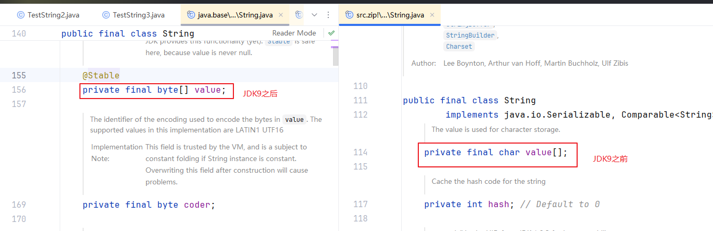
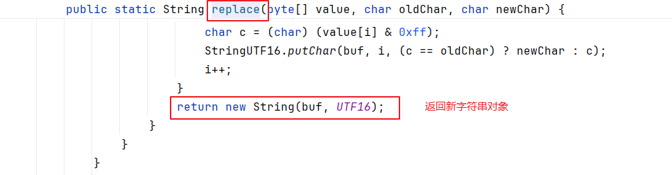
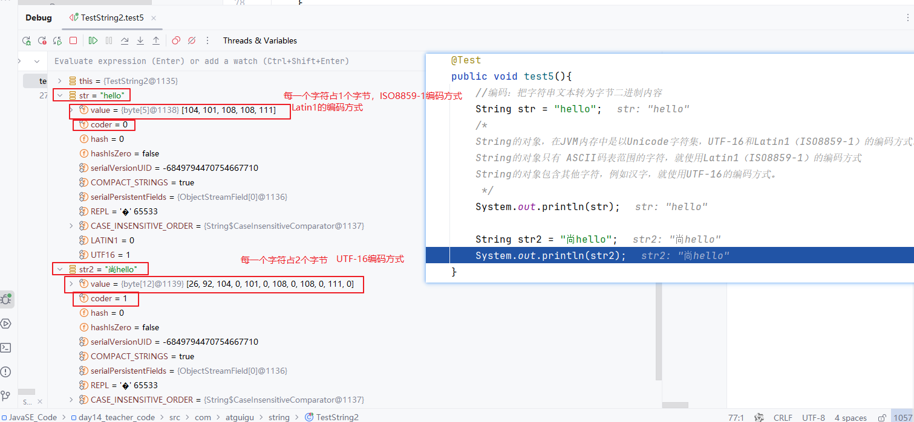
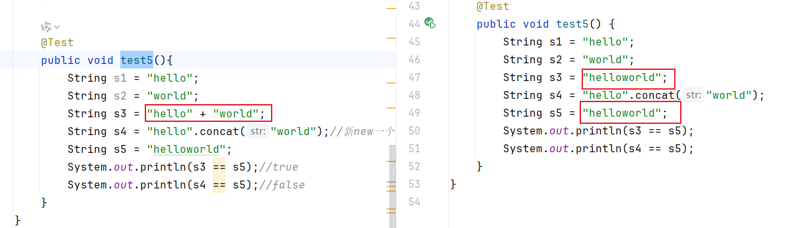
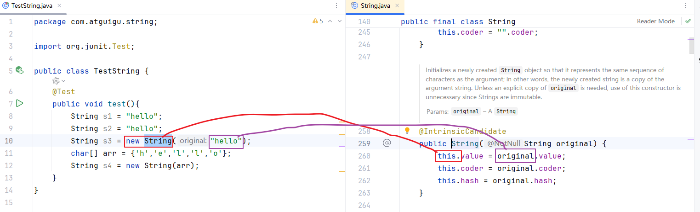
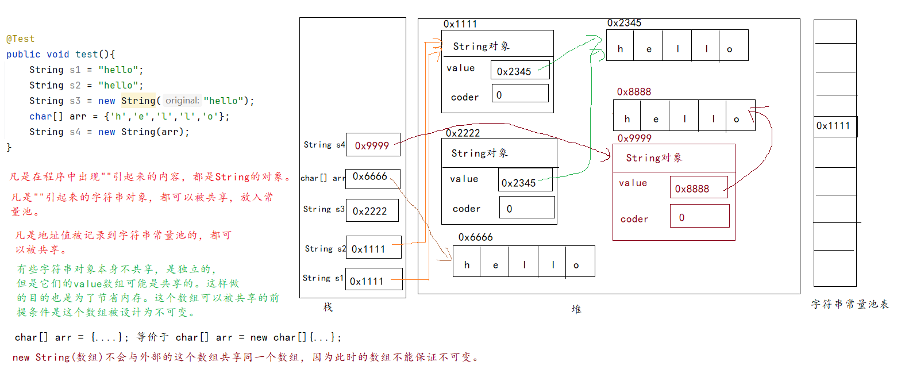

# 五、字符串（重要）

## 5.1 字符串拼接工具类（了解）

StringJoiner工具类用于拼接字符串。

```java
package com.atguigu.string;

import org.junit.Test;

import java.util.StringJoiner;

public class TestStringJoiner {
    @Test
    public void test1(){
        //拼接 hello,world,java这些单词为一个字符串，拼接时想要指定前缀，后缀，中间的连接符
        StringJoiner joiner  =new StringJoiner("-","[","]");
        joiner.add("hello");
        joiner.add("world");
        joiner.add("java");
        String str = joiner.toString();
        System.out.println(str);//[hello-world-java]
    }

    @Test
    public void test2(){
        //拼接 hello,world,java这些单词为一个字符串，拼接时想要指定前缀，后缀，中间的连接符
        StringJoiner joiner  =new StringJoiner(",");
        joiner.add("hello");
        joiner.add("world");
        joiner.add("java");
        String str = joiner.toString();
        System.out.println(str);//hello,world,java
    }
}

```


## 5.2 可变字符序列/字符串缓冲区

StringBuffer和StringBuilder。

它们的内部有一个数组，用于存储一组字符，随着字符数量的增加，内部数组会自动扩容。默认数组的长度是16。

- 增
  - append
  - insert

- 删
  - delete(start, end)
  - deleteCharAt(下标)

- 改
  - replace
  - setCharAt
  - setLength
  - reverse

- 查
  - length
  - indexOf
  - lastIndexOf

```java
package com.atguigu.string;

import org.junit.Test;

public class TestStringBuffer {
    @Test
    public void test1(){
        StringBuffer s = new StringBuffer();
        s.append("hello");
        s.append("world");//末尾追加
        s.append("atguigu");
        //默认扩容是 数组的长度 * 2 + 2

    }
    @Test
    public void test2(){
        StringBuffer s = new StringBuffer(0);
        //思考题：为什么有+2？
        //如果手动指定了初始容量为0，首次扩容时，也能的2的长度
    }

    @Test
    public void test3(){
        StringBuffer s = new StringBuffer();
        s.append("hello");
        s.append("world");

        s.insert(5,"chailinyan");//中间插入
        System.out.println(s);//hellochailinyanworld
    }

    @Test
    public void test4(){
        StringBuffer s = new StringBuffer();
        s.append("hello");
        s.append("world");
        System.out.println(s);//helloworld

        s.delete(3,6);//[3,6)删除多个字符
        System.out.println(s);//helorld

        s.deleteCharAt(1);//删除1个字符
        System.out.println(s);//hlorld
    }

    @Test
    public void test5(){
        StringBuffer s = new StringBuffer("helloworld");
        s.replace(3,7,"chai");//替换[3,7)范围的字符
        System.out.println(s);//helchairld
    }

    @Test
    public void test6(){
        StringBuffer s = new StringBuffer("helloworld");
        s.reverse();//反转
        System.out.println(s);//dlrowolleh
    }

    @Test
    public void test7(){
        StringBuffer s = new StringBuffer("helloworld");
        s.setCharAt(1,'a');//修改[1]位置的字符
        System.out.println(s);//halloworld
        s.setLength(5);
        System.out.println(s);//hallo
        s.setLength(10);//可以改长，但是后面是空字符
        System.out.println(s);//hallo
    }

    @Test
    public void test8(){
        StringBuffer s = new StringBuffer("helloworld");

        int index = s.indexOf("o");
        System.out.println("index = " + index);//index = 4

        int last = s.lastIndexOf("o");
        System.out.println("last = " + last);//last = 6
    }

    @Test
    public void test10(){
        StringBuffer s = new StringBuffer("helloworld");

        int length = s.length();
        System.out.println("length = " + length);//length = 10  字符的个数
    }
}

```

> StringBuffer和StringBuilder的区别？
>
> StringBuffer：古老的，线程安全的，效率较低。
>
> StringBuilder：较新的，线程不安全，效率较高。单线程情况下，优先使用它。


## 5.3 不可变字符序列

String类的方法：

### 5.3.1 系列1：基础方法


### 5.3.2 系列2：与char[]和byte[]有关

```java
package com.atguigu.string;

import org.junit.Test;

import java.io.UnsupportedEncodingException;
import java.util.Arrays;
import java.util.Scanner;

public class TestString2 {
    @Test
    public void test1(){
        String str = "hello";

        //可以转为char[]
        char[] array = str.toCharArray();
        System.out.println(Arrays.toString(array));
        //[h, e, l, l, o]
    }

    @Test
    public void test2(){
        char[] arr = {'a','b','c','d'};

        //把char[]转为字符串
        String str = new String(arr);
        String str2 = String.valueOf(arr);
        System.out.println(str);//abcd
        System.out.println(str2);//abcd
    }

    @Test
    public void test3(){
        String str = "hello";
        char first = str.charAt(0);
        char second = str.charAt(1);
        System.out.println("first = " + first);//h
        System.out.println("second = " + second);//e
    }

    @Test
    public void test4(){
        Scanner input = new Scanner(System.in);
        //创建了Scanner类的对象
        //对象名是input
        //使用Scanner类的有参构造创建了Scanner的对象

        /*
        System.in，它的类型InputStream类型
        System.out，它的类型PrintStream类型
        是System类的两个静态常量对象。
                print方法是PrintStream类的方法
         */

        System.out.print("请输入性别：");
        char gender = input.next().charAt(0);
        /*
        input.next() ： input是Scanner类的对象，next()是Scanner类的方法
                        next()是非静态的实例方法，返回值类型是String类型
        charAt(0)是String类的方法，因为next()方法得到一个String类的对象
                        字符串对象.charAt(0)，返回值类型是char
         */

        input.close();
    }

    @Test
    public void test5(){
        //编码：把字符串文本转为字节二进制内容
        String str = "hello";
        /*
        String的对象，在JVM内存中是以Unicode字符集，UTF-16和Latin1（ISO8859-1）的编码方式。
        String的对象只有 ASCII码表范围的字符，就使用Latin1（ISO8859-1）的编码方式
        String的对象包含其他字符，例如汉字，就使用UTF-16的编码方式。
         */
        System.out.println(str);

        String str2 = "尚hello";
        System.out.println(str2);
    }

    @Test
    public void test6() throws UnsupportedEncodingException {
        //编码：把字符串文本转为字节二进制内容
        String str = "he";

        //如果想要让字符串在网络中传输，文件中保存，那么字符编码方式要另定
        byte[] gbkBytes = str.getBytes("GBK");
        System.out.println(Arrays.toString(gbkBytes));
        //[104, 101]

        String str2 = "尚he";
        byte[] gbkBytes2 = str2.getBytes("GBK");
        System.out.println(Arrays.toString(gbkBytes2));
        //[-55, -48, 104, 101]
        //在GBK编码的规则中，每一个汉字占2个字节，所有的字母等ASCII范围的字符占1个字节。
    }

    @Test
    public void test7()throws UnsupportedEncodingException{
        //编码：把字符串文本转为字节二进制内容
        String str = "he";

        //如果想要让字符串在网络中传输，文件中保存，那么字符编码方式要另定
        byte[] gbkBytes = str.getBytes("UTF-8");
        System.out.println(Arrays.toString(gbkBytes));
        //[104, 101]

        String str2 = "尚he";
        byte[] gbkBytes2 = str2.getBytes("UTF-8");
        System.out.println(Arrays.toString(gbkBytes2));
        //[-27, -80, -102, 104, 101]
        //在GBK编码的规则中，每一个汉字占3个字节，所有的字母等ASCII范围的字符占1个字节。
    }

    @Test
    public void test8()throws Exception{
        byte[] arr = {-27, -80, -102, 104, 101};//上面通过UTF-8编码得到的字节数据
        String str = new String(arr, "UTF-8");
        System.out.println(str);//尚he

        String str2 = new String(arr,"GBK");
        System.out.println(str2);//灏歨e
    }
}

```


### 5.3.3 系列3：其他方法

```java
package com.atguigu.string;

import org.junit.Test;

public class TestString3 {
    @Test
    public void test1(){
        String str = "hello.java";

        System.out.println(str.startsWith("hello"));//true
        System.out.println(str.endsWith(".java"));//true
    }

    @Test
    public void test2(){
        String str = "hella.java";
        //查找a字符在str中位置
        System.out.println(str.indexOf("a"));//4
        System.out.println(str.lastIndexOf("a"));//9
        System.out.println(str.contains("a"));//true

        System.out.println(str.indexOf("t"));//-1
        System.out.println(str.contains("t"));//false
    }

    @Test
    public void test3(){
        String str = "hello.java";
        int index = str.lastIndexOf(".");
        String filename = str.substring(0, index);
        System.out.println(filename);//hello

        String ext = str.substring(index);//从[index]开始截取到最后
        System.out.println(ext);
    }

    @Test
    public void test4(){
        String str = "hello,world,java";
        String[] strings = str.split(",");
        for (int i = 0; i < strings.length; i++) {
            System.out.println(strings[i]);
        }
    }

    @Test
    public void test5(){
        String str = "hello,world,java";
        //把上述单词中所有o替换为尚
        str = str.replace("o","尚");
        System.out.println(str);//hell尚,w尚rld,java
    }

    @Test
    public void test6(){
        String str = "hello,world,java";
        //把上述单词中所有o替换为尚
        str = str.replaceFirst("o","尚");
        System.out.println(str);//hell尚,world,java
    }

    @Test
    public void test7(){
        String str = "hello,world,java";
        //把上述单词中所有o替换为尚
        str = str.replaceAll("o","尚");
        System.out.println(str);//hell尚,w尚rld,java
    }

    @Test
    public void test8(){
        String str = "hello5655world85java3334";
        //去掉上述单词中的数字
        /*
        正则表达式：代表一个字符串的规则。
        例如：
            用户名和密码的规则要求
            手机号码的规则要求

            \d：数字
            .：代表字符
            |：代表或
            正则的数量表示： +代表是1次或多次
                          *代表0次或多次
                          ?代表0次或1次
         */
        str = str.replaceAll("\\d+","");
        System.out.println(str);
    }

    @Test
    public void test9(){
        String str = "hello8world9java";
        String[] strings = str.split("\\d");
        for (int i = 0; i < strings.length; i++) {
            System.out.println(strings[i]);
        }
    }

    @Test
    public void test10(){
        String str = "hello.world.java";
        String[] strings = str.split("\\.");
        for (int i = 0; i < strings.length; i++) {
            System.out.println(strings[i]);
        }
    }

    @Test
    public void test11(){
        String str = "hello|world|java";
        String[] strings = str.split("\\|");
        for (int i = 0; i < strings.length; i++) {
            System.out.println(strings[i]);
        }
    }

    @Test
    public void test12(){
        //判断当前字符串是不是全部由字母组成[a-zA-Z]
        String str = "hello";
        System.out.println(str.matches("[a-zA-Z]+"));
    }

    @Test
    public void test13(){
        //判断当前字符串是不是全部不是由字母组成[a-zA-Z]
        String str = "588_&";
        System.out.println(str.matches("[^a-zA-Z]+"));
    }

    @Test
    public void test14(){
        //判断当前字符串是不是由字母、数字、下划线、美元符号组成
        //数字不能开头
        String str = "hello_88world";
        System.out.println(str.matches("[a-zA-Z_$][a-zA-Z0-9_$]+"));
    }
}

```


## 5.4 String类的原理（面试重灾区）

### 5.4.1 String类的特点

问：String类能不能被继承？

String不能被继承，因为它是final


问：String类的对象可变吗？

不可变


问：String类的对象如何做到不可变的？

String的内部使用value数组来存储一组字符，JDK9之前是char[]，JDK9之后byte[]，它们都有final修饰。意味着这个数组不能修改地址，即不能扩容（因为扩容会创建新数组）。

这个数组是private，意味着在String类的外部不能直接操作这个value数组，需要通过String提供的各种方法来使用和修改这个value数组。在String类中所有涉及到修改value数组元素的方法，都是返回新的String对象。







问：String底层是如何存储一串字符的？

JDK9之前是char[]，JDK9之后byte[]。


问：为什么要从char[]换为byte[]数组？

1个byte占1个字节，1个char占2个字节。

那么程序中大部分字符串都是英文字母组成的，这些字母其实用1个字节就可以存储了，从char改为byte可以节省一半内存。


问：对于汉字等，怎么办呢？

String会自由选择，如果字符串中都是ASCII码表范围的字符，那么1个字符用1个字节，coder是0，采用Latin1编码方式。

如果字符串中包含ASCII码表以外的字符，例如汉字，那么每一个字符都用2个字节，coder是1，采用UTF16编码方式。




问：字符串对象为什么要设计为不可变？

因为字符串对象不可变，才能被共享。

```java
    @Test
    public void test2(){
        String s1 = "hello";
        String s2 = "hello";
        System.out.println(s1 == s2);//true
        //因为这里"hello"被共享了，它是字符串常量，s1和s2使用同一个"hello"对象
    }
```


问：哪些字符串对象可以被共享呢？

- 直接""引起来的对象
- 字符串对象.intern()的结果


问：String s1 = new String("hello");有几个字符串对象

答：2个


问：两种拼接用那种（1）+（2）concat

答：先用+




```java
package com.atguigu.string;

import org.junit.Test;

import java.util.Arrays;

public class TestString4 {
    @Test
    public void test1(){
       final byte[] bytes = {1,2,3,4,5};
//        bytes = new byte[10];
        bytes[0] = 100;
        System.out.println(Arrays.toString(bytes));
    }

    @Test
    public void test2(){
        String s1 = "hello";
        String s2 = "hello";
        System.out.println(s1 == s2);//true
        //因为这里"hello"被共享了，它是字符串常量，s1和s2使用同一个"hello"对象
    }

    @Test
    public void test3(){
        String s1 = new String("hello");//这句代码有几个字符串对象？
        /*
        "hello"是一个字符串对象，它可以被共享，会被放到常量池中
        又新创建一个字符串对象，不会直接使用常量池中的"hello"
         */
        String s2 = s1.intern();
        /*
        intern()先从字符串常量池中查找有没有相同内容的字符串 ，可以找到，直接使用常量池中"hello"的地址
         */

        System.out.println(s1 == s2);//false
    }

    @Test
    public void test4(){
        String s1 = new String("hel".concat("lo"));
        /*
        "hel" 一个字符串，在常量池
        "lo" 也是一个字符串，在常量池
        "hel".concat("lo") 也是一个字符串，concat会新new一个字符串，它在“堆”
        new String 新new的字符串
         */
        String s2 =s1.intern();
        /*
        intern()先从字符串常量池中查找有没有相同内容的字符串 ，没有在常量池中找到"hello"的地址
        就会把s1这个字符串对象的地址放入常量池，以便共享
         */
        System.out.println(s1 == s2);//true
    }

    @Test
    public void test5(){
        String s1 = "hello";
        String s2 = "world";
        String s3 = "hello" + "world";
        String s4 = "hello".concat("world");//新new一个
        String s5 = "helloworld";
        String s6 = s1 + s2;//两个变量相加，底层会用concat
        System.out.println(s3 == s5);//true
        System.out.println(s4 == s5);//false
        System.out.println(s6 == s5);//false
    }
}

```

# 一、字符串（结尾）

## 1.1  复习

字符串相关的类型：String、StringBuffer、StringBuilder、StringJoiner。

- StringJoiner：用于完成多个String对象的`拼接`，在拼接时可以指定前缀，后缀，连接符。
- String、StringBuffer、StringBuilder：都是字符序列，用于表示一串字符，简称字符串。
- String：表示`不可变`的字符序列。
- StringBuffer、StringBuilder：表示`可变的`字符序列。
- StringBuffer：线程`安全`的。
- StringBuilder：线程`不安全`的，效率最高，单线程环境下，StringBuffer与StringBuilder之间优先考虑StringBuilder。

StringJoiner的方法：

```java
add方法，调用1次用于拼接一个字符串
toString：把拼接结果转为字符串
```

StringBuffer、StringBuilder的方法完全相同：

```java
增：append，insert
删：delete，deleteCharAt
改：replace，setCharAt，setLength，reverse
查：length，indexOf，lastIndexOf... 
```

String的方法：

```java
length、toUpperCase、toLowerCase、equals、equalsIgnoreCase、compareTo、compareToIgnoreCase、isEmpty、isBlank、trim
startsWith、endsWith、substring、split、replace、replaceFirst、replaceAll、matches
toCharArray、getBytes、charAt、indexOf、lastIndexOf、contains
new String(char[]),new String(char[], 起始下标，长度)，new String(byte[]， 编码方式)
```

String的特点和原理：

- String不能被继承，因为它有final修饰
- String对象底层用char[]（JDK9之前）或byte[]（JDK9之后）类型的value数组来存储。JDK9之后，如果字符串中全部都是ASCII码表范围的字符，那么coder是0,1个字符占1个字节。如果字符串中有ASCII码表范围之外的字符，例如中文，那么coder是1,1个字符占2个字节。这个特征同样适用于StringBuffer、StringBuilder。
- String对象不可变，底层的value数组有final和private。final意味着value数组不能扩容，private意味着外部不能直接获取到这个数组，无法对其元素直接修改，而String内部的方法不会修改value数组的元素，如果元素要修改，都会返回新的String对象。
- 因为String对象不可变，所以可以被共享。当然不是所有字符串对象都会被共享的，只有放入常量池的字符串对象才会被共享。
  - 直接""引起来的字符串
  - 调用intern()方法的结果字符串。如果这个结果在字符串常量池中已经存在，那么直接复用常量池中的字符串。如果这个结果在字符串常量池中找不到，会把这个结果的对象放入常量池以便重复使用。


## 1.2 字符串的常量池

字符串常量池其实底层是一个哈希表的数据结构。这个哈希表只记录了哪些字符串对象可以被共享，只负责记录它们的首地址。

这个哈希表的位置在哪里？

- JDK6以及之前，它在方法区
- JDK7版本，它挪到了堆，此时与堆中其他对象的存储还是有区别，相当于独立的一块位置
- JDK8版本以及之后，它正式和普通堆融合
  - 这样设计的好处是大部分字符串对象都可以被共享。如果某个new出来的字符串对象，调用intern()方法，也有机会被放入常量池共享。

关于哈希表的具体结构和原理，放到集合章节统一再分析。这个结构与对象的hashCode紧密相连，底层有数组+链表等数据结构。

## 1.3 字符串对象的内存分析





## 1.4 效率对比（了解）

提示：测试一段代码的运行时间：

```java
long start = System.currentTimeMillis();

//....

long end = System.currentTimeMillis();

long time = end - start; //这个时间就是中间这段代码的运行时间
```

提示：测试一段的内存的情况（粗糙）：

```java
Runtime代表JVM的运行时内存
Runtime runtime = Runtime.getRuntime();//得到JVM运行环境的对象
long totalMemory = runtime.totalMemory();//总内存
long freeMemory = runtime.freeMemory();//空闲内存
long useMemory = totalMemory - freeMemory;//占用内存
```

```java
package com.atguigu.string;

import org.junit.Test;

public class TestStringConcat {
    @Test
    public void test1(){
        long start = System.currentTimeMillis();
        System.out.println(start);//1734311935115
        //当前系统时间距离1970-1-1 0:0:0 0毫秒 过了多少毫秒
        Runtime runtime = Runtime.getRuntime();//得到JVM运行环境的对象
        long totalMemory = runtime.totalMemory();//总内存
        long freeMemory = runtime.freeMemory();//空闲内存
        long useMemory = totalMemory - freeMemory;//占用内存
    }

    @Test
    public void test2(){
        long start = System.currentTimeMillis();

        //拼接100000次字符串的时间
        String str = "";
        for(int i=1; i<=100000; i++){
            str += i;
        }

        long end = System.currentTimeMillis();
        Runtime runtime = Runtime.getRuntime();//得到JVM运行环境的对象
        long totalMemory = runtime.totalMemory();//总内存
        long freeMemory = runtime.freeMemory();//空闲内存
        long useMemory = totalMemory - freeMemory;//占用内存

        System.out.println("时间：" + (end-start) +"毫秒");//时间：2952毫秒
        System.out.println("内存：" + useMemory +"字节");//内存：257451288字节
    }

    @Test
    public void test3(){
        long start = System.currentTimeMillis();

        //拼接100000次字符串的时间
        StringBuffer str = new StringBuffer();
        for(int i=1; i<=100000; i++){
            str.append(i);
        }

        long end = System.currentTimeMillis();
        Runtime runtime = Runtime.getRuntime();//得到JVM运行环境的对象
        long totalMemory = runtime.totalMemory();//总内存
        long freeMemory = runtime.freeMemory();//空闲内存
        long useMemory = totalMemory - freeMemory;//占用内存

        System.out.println("时间：" + (end-start) +"毫秒");//时间：15毫秒
        System.out.println("内存：" + useMemory +"字节");//内存：7109456字节
    }

    @Test
    public void test4(){
        long start = System.currentTimeMillis();

        //拼接100000次字符串的时间
        StringBuilder str = new StringBuilder();
        for(int i=1; i<=100000; i++){
            str.append(i);
        }

        long end = System.currentTimeMillis();
        Runtime runtime = Runtime.getRuntime();//得到JVM运行环境的对象
        long totalMemory = runtime.totalMemory();//总内存
        long freeMemory = runtime.freeMemory();//空闲内存
        long useMemory = totalMemory - freeMemory;//占用内存

        System.out.println("时间：" + (end-start) +"毫秒");//时间：12毫秒
        System.out.println("内存：" + useMemory +"字节");//内存：7109480字节
    }

}

```

> 结论：如果程序中涉及到字符串的大量拼接或修改，可以用StringBuffer、StringBuilder，效率更高。
>
> ​            如果是少量的，那么使用String更简洁。