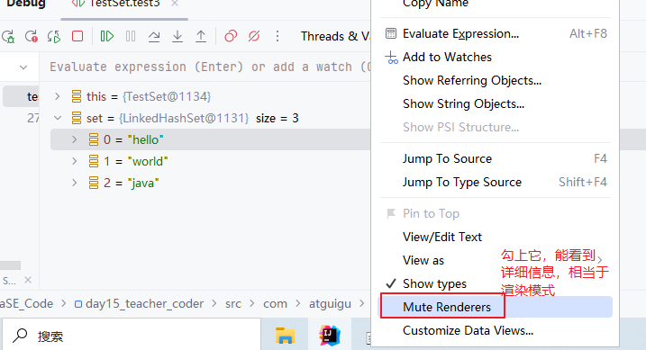
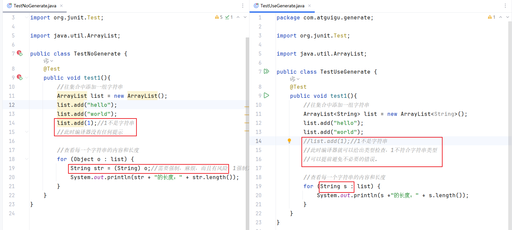
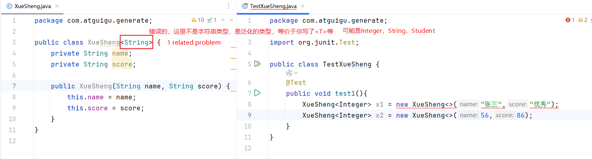
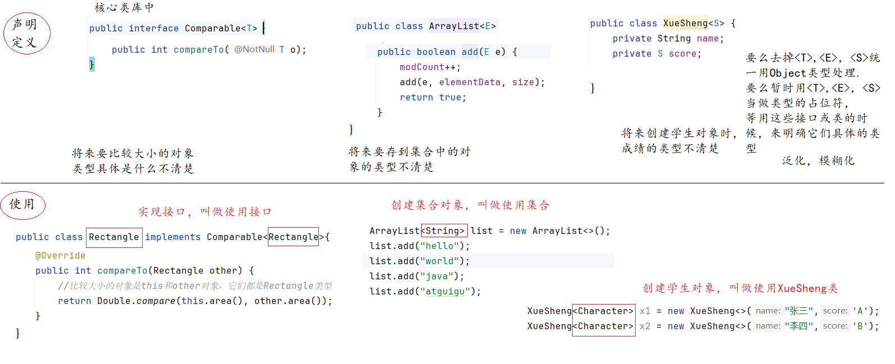
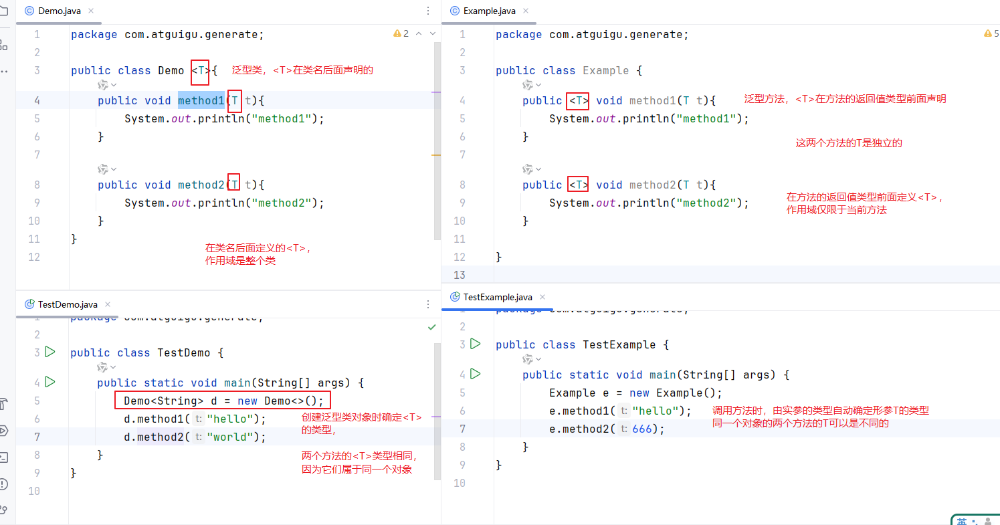

# 二、集合（非常重要）

## 2.1 集合的概念

集合是代表一种`容器`，一种数据结构。它用来装对象的，也`只能用来装对象`，不能用来装基本数据类型的值。如果要把基本数据类型的值放到集合中，会自动装箱为包装类的对象。

集合在Java中大体上可以分为两大类：

- Collection：单列集合，存储一组独立对象的集合。比喻：单身party。
- Map：双列集合，存储一组键值对(key,value)的集合。比喻：情侣party。


## 2.2 Collection系列的集合

### 2.2.1 Collection接口及其API

Collection系列的集合以java.util.Collection接口为根接口，根接口中定义了这个系列集合都支持什么样的操作。操作主线：增、删、改、查、遍历。

Collection接口的实现类非常多，使用频率最高的是ArrayList集合类。以下方法以ArrayList为例演示。

#### 1、增

- add（一个元素）：添加一个元素到当前集合中
- addAll（另一个集合）：添加另一个集合的所有元素到当前集合中

```java
package com.atguigu.collection;

import org.junit.Test;

import java.util.ArrayList;
import java.util.Collection;


//演示Collection接口的添加方法
public class TestCollection1 {
    @Test
    public void test1(){
        //ArrayList list  = new ArrayList();//正常来说，应该这么写
        Collection list = new ArrayList();//准备了一个容器，装对象的容器，此时没有元素
        /*
        这里这么写有两个用意：
        （1）强调以下 ArrayList 是 Collection接口的实现类，注意一下它们的关系
        （2）ArrayList类的方法比Collection接口要多，因为子类有扩展新的方法。
            现在是学习Collection接口的方法，采用多态引用的话，遵循：编译时看左边，运行时看右边。
            编译时只能看到Collection接口的方法
         */
        list.add("hello");//添加元素到集合容器中
        list.add("world");
        list.add("java");
        list.add("atguigu");

        System.out.println(list);//自动调用list的toString方法，说明ArrayList重写了toString方法
        //可以看到元素情况
        //[hello, world, java, atguigu]
    }

    @Test
    public void test2(){
        Collection list = new ArrayList();
        list.add("hello");//添加元素到集合容器中
        list.add("world");

        Collection list2 = new ArrayList();
        list2.add("java");//添加元素到集合容器中
        list2.add("atguigu");
        list2.add("hello");

        //想要把第二个集合list2的元素，也添加到第一个集合list中
        list.addAll(list2);//list = list ∪ list2
        //数学中 集合的元素是不能重复的，此时ArrayList这个集合的元素是可以重复的
        System.out.println(list);//[hello, world, java, atguigu, hello]
    }
}

```


#### 2、删

- remove（一个元素对象）：删除一个对象
- removeAll（另一个集合）：从当前集合中删除两个集合的交集
- clear()：清空当前集合
- removeIf(Predicate接口的实现类对象)：编写匿名内部类实现Predicate接口，重写public boolean test(Object obj)方法，在方法内部编写根据什么条件删除元素。

```java
package com.atguigu.collection;

import org.junit.Test;

import java.util.ArrayList;
import java.util.Collection;
import java.util.function.Predicate;

//演示删除操作
public class TestCollection2 {
    @Test
    public void test1(){
        Collection list = new ArrayList();
        list.add("hello");//添加元素到集合容器中
        list.add("world");
        list.add("atguigu");
        list.add("java");
        list.add("world");
        System.out.println("初始：" + list);
        //初始：[hello, world, atguigu, java, world]

        list.remove("world");//删除一个元素
        System.out.println("删除world之后" + list);
        //删除world之后[hello, atguigu, java, world]
    }

    @Test
    public void test2(){
        Collection list = new ArrayList();
        list.add("hello");//添加元素到集合容器中
        list.add("world");
        list.add("atguigu");
        list.add("java");
        list.add("world");

        Collection list2 = new ArrayList();
        list2.add("java");//添加元素到集合容器中
        list2.add("hello");
        list2.add("world");

        System.out.println("初始：" + list);
        //初始：[hello, world, atguigu, java, world]

        list.removeAll(list2);//list = list - list ∩ list2
        System.out.println("删除list2集合的元素之后" + list);
        //删除list2集合的元素之后[atguigu]
    }

    @Test
    public void test3(){
        Collection list = new ArrayList();
        list.add("hello");//添加元素到集合容器中
        list.add("world");
        list.add("atguigu");
        list.add("java");
        list.add("world");

        System.out.println("初始：" + list);
        //初始：[hello, world, atguigu, java, world]

        list.clear();
        System.out.println("清空list之后" + list);
    }

    @Test
    public void test4(){
        Collection list = new ArrayList();
        list.add("hello");//添加元素到集合容器中
        list.add("world");
        list.add("atguigu");
        list.add("java");
        list.add("world");

        System.out.println("初始：" + list);

        //删除包含a字母的单词
        /*
        removeIf方法是JDK8引入的，
        这个方法的形参是Predicate接口类型
        调用这个方法时，需要传入一个Predicate接口的实现类的对象。
        需要用有名字的类或匿名内部类实现Predicate接口，重写public boolean test(Object obj)方法
        这个方法中，用于编写删除元素的条件。此时方法的形参obj就是代表集合中的元素，
        元素满足某个删除条件，就返回true，否则返回false
         */
        Predicate p = new Predicate() {
            @Override
            public boolean test(Object obj) {
                //判断obj这个元素是不是包含"a"字母
                //编译时形参obj是Object类型，实际上元素是String类型，因为list集合添加了一组字符串
                String str = (String) obj;
                return str.contains("a");//如果包含a字母，contains方法就会返回true，否则返回false
            }
        };
        list.removeIf(p);
        /*
        在集合的removeIf方法的内部，会遍历集合的元素，然后每一个元素都会调用p的test方法进行判断，看它是否满足删除条件。
         */

        System.out.println("删除包含a字母的单词之后：" + list);
        //删除包含a字母的单词之后：[hello, world, world]
    }
}

```

```java
//这就是Conllection.removeIf(Predicate p)方法的简单实现，可以看见要调用这个方法删除Collection集合中的带有某个字符的元素，就需要先实现Perdicate接口，用于判断（匿名内部类中并非必须使用contains方法）
default boolean removeIf(Predicate<? super E> filter) {
        Objects.requireNonNull(filter);
        boolean removed = false;
        final Iterator<E> each = iterator();
        while (each.hasNext()) {
            if (filter.test(each.next())) {
                each.remove();
                removed = true;
            }
        }
        return removed;
    }
```


#### 3、修改（没有）

#### 4、查询

- boolean contains(一个元素)：判断当前集合是不是包含这1个元素
- boolean containsAll（另一个集合）：判断当前集合是不是包含另一个集合的所有元素，即判断另一个集合是不是当前集合的子集。
- int size()：查询当前集合的元素个数
- boolean isEmpty()：判断当前集合是不是空集合

```java
package com.atguigu.collection;

import org.junit.Test;

import java.util.ArrayList;
import java.util.Collection;

//演示查询的方法
public class TestCollection3 {
    @Test
    public void test1(){
        Collection list = new ArrayList();
        list.add("hello");//添加元素到集合容器中
        list.add("world");
        list.add("atguigu");
        list.add("java");
        list.add("world");

        System.out.println(list.contains("world"));//true
        System.out.println(list.contains("a"));//false
        /*
        这里的contains不是String类的contains方法，而是集合的contains方法
         */
    }

    @Test
    public void test2(){
        Collection list = new ArrayList();
        list.add("hello");//添加元素到集合容器中
        list.add("world");
        list.add("atguigu");
        list.add("java");
        list.add("world");

        Collection list2 = new ArrayList();
        list2.add("java");//添加元素到集合容器中
        list2.add("hello");
        list2.add("world");

        Collection list3 = new ArrayList();
        list3.add("chai");//添加元素到集合容器中
        list3.add("hello");
        list3.add("world");


        System.out.println(list.containsAll(list2));//true
        System.out.println(list.containsAll(list3));//false
        //判断list2或list3是不是list集合的子集
    }

    @Test
    public void test3(){
        Collection list = new ArrayList();
        list.add("hello");//添加元素到集合容器中
        list.add("world");
        list.add("atguigu");
        list.add("java");
        list.add("world");

        System.out.println("元素的个数：" + list.size());//字符串的长度是用length，集合的元素个数用size方法
        System.out.println("集合为空吗？" + list.isEmpty());
    }
}

```


#### 5、遍历

- Collection集合不能直接用普通for循环遍历
- 增强for循环遍历
- 迭代器遍历（后面单独讲）

```java
package com.atguigu.collection;

import org.junit.Test;

import java.util.ArrayList;
import java.util.Collection;

public class TestCollection4 {
    @Test
    public void test1(){
        Collection list = new ArrayList();
        list.add("hello");//添加元素到集合容器中
        list.add("world");
        list.add("atguigu");
        list.add("java");
        list.add("world");

        //普通for循环不能直接用来遍历Collection集合
/*        for(int i=0; i<list.size(); i++){
            System.out.println(list[i]);//错误
        }*/
    }

    @Test
    public void test2(){
        Collection list = new ArrayList();
        list.add("hello");//添加元素到集合容器中
        list.add("world");
        list.add("atguigu");
        list.add("java");
        list.add("world");

        //增强for循环
        //快捷键是iter
        for (Object obj : list) {//这里obj代表集合的元素
            System.out.println(obj);
        }
    }

    @Test
    public void test3(){
        Collection list = new ArrayList();
        list.add("hello");//添加元素到集合容器中
        list.add("world");
        list.add("atguigu");
        list.add("java");
        list.add("world");

        System.out.println(list);
        //查看集合中的所有元素，以及每一个字符串的长度值
        for (Object obj : list) {
            String str = (String) obj;
            System.out.println(str + "的长度：" +str.length());
        }
    }
}

```


### 2.2.2 Collection的子接口Set

Set接口的实现类也很多，所有实现类有一个共同特点：`元素不可重复`。

Set接口的常用实现类：HashSet、LinkedHashSet、TreeSet。

- HashSet：元素存储没有规律。元素的存储位置与元素的hashCode值有关（具体什么关系，再讲哈希表原理时再说）。
- LinkedHashSet：元素存储有规律，按照添加的顺序。因为它底层有一个双向链表来记录元素的添加顺序。
  - HashSet和LinkedHashSet要确定元素是否重复，需要调用元素的equals和hashCode方法，如果要根据元素的属性值来确定元素重复情况的话，必须重写这两个方法。
- TreeSet：元素存储按照大小顺序排列。依赖于Comparable接口 或 Comparator接口。当Comparable的compareTo方法，或Comparator的compare方法结果返回0的话，TreeSet就会认为它们是重复元素。



> 问：HashSet和LinkedHashSet如何选择？
>
> 如果项目业务场景对元素的添加顺序没有要求的话，选择HashSet，因为它更简洁，效率更高。

> 问：HashSet和TreeSet如何选择？
>
> 如果项目业务场景对元素的大小顺序没有要求的话，选择HashSet，因为它更简洁，效率更高。

```java
package com.atguigu.set;

import lombok.AllArgsConstructor;
import lombok.Data;
import lombok.NoArgsConstructor;

@Data
@NoArgsConstructor
@AllArgsConstructor
public class Student implements Comparable{
    private int id;
    private String name;
    private int age;

    @Override
    public int compareTo(Object o) {
        //假设按照id比较大小
        return this.id - ((Student)o).id;
    }
}

```

```java
package com.atguigu.set;

import java.util.Objects;

public class Employee {
    private int id;
    private String name;

    public Employee(int id, String name) {
        this.id = id;
        this.name = name;
    }

    public int getId() {
        return id;
    }

    public void setId(int id) {
        this.id = id;
    }

    public String getName() {
        return name;
    }

    public void setName(String name) {
        this.name = name;
    }

    @Override
    public boolean equals(Object o) {
        if (this == o) return true;
        if (o == null || getClass() != o.getClass()) return false;

        Employee employee = (Employee) o;
        return id == employee.id && Objects.equals(name, employee.name);
    }
    @Override
    public int hashCode() {
        int result = id;
        result = 31 * result + Objects.hashCode(name);
        return result;
    }

    @Override
    public String toString() {
        return "Employee{" +
                "id=" + id +
                ", name='" + name + '\'' +
                '}';
    }
}

```

```java
package com.atguigu.set;

import org.junit.Test;

import java.util.*;

public class TestSet {
    @Test
    public void test1(){
        HashSet set = new HashSet();
        //Set接口的方法与Collection接口的一样

        set.add("hello");
        set.add("world");
        set.add("java");
        set.add("java");
        set.add("java");

        System.out.println(set);
        //[world, java, hello]
        //无规律
    }

    @Test
    public void test2(){
        Collection list = new ArrayList();
        list.add("hello");
        list.add("world");
        list.add("java");
        list.add("java");
        list.add("java");

        System.out.println(list);
        //[hello, world, java, java, java]
        //list集合元素可重复，有顺序
    }

    @Test
    public void test3(){
        LinkedHashSet set = new LinkedHashSet();
        //Set接口的方法与Collection接口的一样

        set.add("hello");
        set.add("world");
        set.add("java");
        set.add("java");
        set.add("java");

        System.out.println(set);
        //[hello, world, java]
        //按照元素的添加顺序排列
    }

    @Test
    public void test4(){
        TreeSet set = new TreeSet();
        //Set接口的方法与Collection接口的一样

        set.add("hello");
        set.add("world");
        set.add("java");
        set.add("java");
        set.add("java");
        System.out.println(set);
        //[hello, java, world]
        //按照元素的大小顺序排列
        //因为元素是String类型，所以会用到String类的compareTo方法比较两个字符串的大小
        //String类中compareTo方法是按照字符的Unicode编码值来比较
    }

    @Test
    public void test5(){
        TreeSet set = new TreeSet();

        set.add(new Student(2,"张三",89));
        set.add(new Student(1,"李四",100));
        set.add(new Student(3,"王五",96));

        System.out.println(set);
        //按照元素的大小顺序排列
        //因为元素是Student类型，所以会用到Student类的compareTo方法比较两个学生对象的大小
        //要求Student必须实现Comparable接口
    }

    @Test
    public void test6(){
        //想要元素按照长短顺序排列，需要定制比较器
        //定义匿名内部类，实现Comparator接口，重写int compare(Object o1, Object o2)方法
        Comparator c = new Comparator() {
            @Override
            public int compare(Object o1, Object o2) {
                String s1 = (String) o1;
                String s2 = (String) o2;
                return s1.length() - s2.length();
            }
        };

        TreeSet set = new TreeSet(c);//一会儿添加元素时，调用c的compare方法来比较元素的大小，决定它的存储位置
        //Set接口的方法与Collection接口的一样

        set.add("hello");
        set.add("world");
        set.add("java");
        set.add("java");
        set.add("java");
        System.out.println(set);
        //[java, hello]
    }

    @Test
    public void test7(){
        //想要元素按照长短顺序排列，需要定制比较器
        //定义匿名内部类，实现Comparator接口，重写int compare(Object o1, Object o2)方法
        //如果长度相同，再看编码值
        Comparator c = new Comparator() {
            @Override
            public int compare(Object o1, Object o2) {
                String s1 = (String) o1;
                String s2 = (String) o2;
                int result = s1.length() - s2.length();
                return result != 0 ? result : s1.compareTo(s2);
            }
        };

        TreeSet set = new TreeSet(c);//一会儿添加元素时，调用c的compare方法来比较元素的大小，决定它的存储位置
        //Set接口的方法与Collection接口的一样

        set.add("hello");
        set.add("world");
        set.add("java");
        set.add("java");
        set.add("java");
        System.out.println(set);
        //[java, hello, world]
    }

    @Test
    public void test88(){
        HashSet set = new HashSet();
        set.add(new Employee(1,"张三"));
        set.add(new Employee(1,"张三"));

        System.out.println(set);
        //[Employee{id=1, name='张三'}, Employee{id=1, name='张三'}]
        //重写equals和hashCode方法，就可以去重
    }
}

```


# 三、泛型

## 3.1 什么是泛型？

泛型：泛化的类型，泛指某种类型。例如：Collection<E>的<E>就是一种泛化的类型，它只是用于表示元素element的类型，但没有具体说明是哪一种类型（String，Student）等。这种类型需要在使用集合的时候，再来确定，如果没有明确指明，它这里用Object类型处理。


## 3.2 为什么要用泛型

如果没有泛型的语法，在设计集合类型、比较器接口类型、Predicate接口类型等，这些类型时，就无法“动态”的来确定它们的元素的类型，只能统一按照Object等公共的父类来处理。使用Object类型确实可以接收任意类型的对象，但是这样会导致（1）不安全隐患（2）需要强制类型转换，非常麻烦。

如果有泛型的语法，在设计集合类型、比较器接口类型、Predicate接口类型等，可以用泛化的字母，例如：<E>，<T>等代表它们未能在设计时确定的元素的类型，当用户使用时，可以“动态”的确定它们的类型，编译器就可以提前做类型的检查。



> 结论：当我们使用集合、比较器接口类型、Predicate接口类型等这些类型时，需要正确指定泛型。

```java
package com.atguigu.generate;

import org.junit.Test;

import java.util.ArrayList;

public class TestNoGenerate {
    @Test
    public void test1(){
        //以下代码没有使用泛型
        //往集合中添加一组字符串
        ArrayList list = new ArrayList();
        list.add("hello");
        list.add("world");
        list.add(1);//1不是字符串
        //此时编译器没有任何提示

        //查看每一个字符串的内容和长度
        for (Object o : list) {
            String str = (String) o;//需要强制，麻烦，而且有风险，1强制为String类型发生ClassCastExeption
            System.out.println(str + "的长度：" + str.length());
        }
    }
}

```

```java
package com.atguigu.generate;

import org.junit.Test;

import java.util.ArrayList;

public class TestUseGenerate {
    @Test
    public void test1(){
        //以下代码使用了泛型
        //往集合中添加一组字符串
        ArrayList<String> list = new ArrayList<String>();
        list.add("hello");
        list.add("world");
        //list.add(1);//1不是字符串
        //此时编译器就可以给出类型检查，1不符合字符串类型
        //可以提前避免不必要的错误。

        //查看每一个字符串的内容和长度
        for (String s : list) {
            System.out.println(s +"的长度：" + s.length());
        }
    }
}

```


## 3.3 泛型类与泛型接口

### 3.3.1 什么是泛型类与泛型接口

什么是泛型类与泛型接口？

```java
【修饰符】 class 类名<泛型字母>{ //泛型类
    
}
```

```java
【修饰符】 interface 接口名<泛型字母>{ //泛型接口
    
}
```

回看之前学习的类与接口，看看哪些是泛型类，泛型接口？

```java
public interface Comparable<T>  ：自然比较接口
public interface Comparator<T>  ：定制比较接口
public interface Collection<E>  ：集合根接口
public interface Set<E>		    ：Set集合接口
public interface Predicate<T>	：判断型接口
```

```java
public class ArrayList<E>
public class HashSet<E>
public class LinkedHashSet<E>
public class TreeSet<E>
```


### 3.3.2 如何正确`使用`泛型类与泛型接口

```java
接口名<类型>
类名<类型>
```

```java
集合类型  ArrayList<E>、HashSet<E>、LinkedHashSet<E>、TreeSet<E>、Collection<E>、Set<E>	等
    <E>代表的是元素element的类型
比较器：Comparable<T>、Comparator<T> 
    <T>代表的是要比较大小的对象的类型 T：Type
判断型接口：Predicate<T>
    <T>代表的是要进行条件判断的对象的类型
```

#### 案例1：创建泛型类的对象

应用举例：创建泛型类的对象

```java
ArrayList<E>是一个带泛型的类，HashSet<E>是一个带泛型的类，简称泛型类。
ArrayList<String> list = new ArrayList<>();    
```


```java
package com.atguigu.set;

import lombok.AllArgsConstructor;
import lombok.Data;
import lombok.NoArgsConstructor;

@Data
@NoArgsConstructor
@AllArgsConstructor
public class Student implements Comparable{
    private int id;
    private String name;
    private int age;

    @Override
    public int compareTo(Object o) {
        //假设按照id比较大小
        return this.id - ((Student)o).id;
    }
}
```


```java
package com.atguigu.generate;

import com.atguigu.set.Student;
import org.junit.Test;

import java.util.ArrayList;
import java.util.HashSet;

public class TestGenerateClassInterface {
    @Test
    public void test1(){
        //对于集合来说，<>里面应该填写集合元素的具体类型
        //从JDK7开始，右边<>中的类型可以省略，它可以根据左边<>中的类型自动推断，但是<>得保留
        //如果<>省略的话，会有警告，因为它认为你擦除了泛型
        ArrayList<String> list = new ArrayList<>();//表示它的元素只能是String及其子类
        list.add("hello");
        list.add("world");
        System.out.println(list);

        ArrayList<Integer> list2 =new ArrayList<>();//表示它的元素只能是Integer及其子类
        list2.add(1);
        list2.add(2);
        System.out.println(list2);

        HashSet<Student> set = new HashSet<>();//表示它的元素只能是Student及其子类
//        set.add("张三"); //"张三"表示字符串类型
        set.add(new Student(2,"张三",23));
        System.out.println(set);
    }
}

```


#### 案例2：有名字的类实现泛型接口

应用举例：有名字的类实现泛型接口

```java
Comparable<T>是一个带泛型的接口，简称泛型接口
    
  public class Rectangle implements Comparable<Rectangle>  
```


```java
package com.atguigu.generate;

import lombok.AllArgsConstructor;
import lombok.Data;
import lombok.NoArgsConstructor;


/*
Rectangle类实现 Comparable接口
    Rectangle implements Comparable
    重写抽象方法 public int compareTo(Object obj)
    比较大小的两个对象 this 和 obj
      这里 this 和 obj 应该都是Rectangle的对象
 */
@Data
@NoArgsConstructor
@AllArgsConstructor
public class Rectangle implements Comparable<Rectangle>{
    private double length;
    private double width;

    public double area(){
        return length * width;
    }

    public double perimeter(){
        return 2 * (length + width);
    }

    @Override
    public int compareTo(Rectangle other) {
        //比较大小的对象是this和other对象，它们都是Rectangle类型
        return Double.compare(this.area(), other.area());
    }
}

```

```java
package com.atguigu.generate;


import org.junit.Test;

import java.util.TreeSet;
public class TestGenerateClassInterface {

    @Test
    public void test2(){
        //默认按照Rectangle的compareTo方法比较大小，按照面积比较大小
        TreeSet<Rectangle> set = new TreeSet<>();
        set.add(new Rectangle(5,3));
        set.add(new Rectangle(4,2));
        set.add(new Rectangle(6,1));
        System.out.println(set);
    }

}

```


#### 案例3：匿名内部类实现泛型接口

应用举例：匿名内部类实现泛型接口

```java
Comparator<T> 是一个带泛型的接口，简称泛型接口
    
	Comparator<Rectangle> c = new Comparator<>() {
            @Override
            public int compare(Rectangle o1, Rectangle o2) {
                return Double.compare(o1.perimeter(),o2.perimeter());
            }
        };  
```

```java
Predicate<T>是一个带泛型的接口，简称泛型接口
 Predicate<String> p = new Predicate<>() {
            @Override
            public boolean test(String s) {
                return s.contains("o");
            }
        };
```


```java
package com.atguigu.generate;

import com.atguigu.set.Student;
import org.junit.Test;

import java.util.ArrayList;
import java.util.Comparator;
import java.util.HashSet;
import java.util.TreeSet;
import java.util.function.Predicate;

public class TestGenerateClassInterface {

    @Test
    public void test3(){
        //希望按照周长比较大小
        Comparator<Rectangle> c = new Comparator<>() {
            @Override
            public int compare(Rectangle o1, Rectangle o2) {
                return Double.compare(o1.perimeter(),o2.perimeter());
            }
        };

        TreeSet<Rectangle> set = new TreeSet<>(c);
        set.add(new Rectangle(5,3));
        set.add(new Rectangle(4,2));
        set.add(new Rectangle(6,1));
        System.out.println(set);
    }

    @Test
    public void test4(){
        ArrayList<String> list = new ArrayList<>();
        list.add("hello");
        list.add("world");
        list.add("java");
        list.add("atguigu");
        //删除包含o字母的单词
        Predicate<String> p = new Predicate<>() {
            @Override
            public boolean test(String s) {
                return s.contains("o");
            }
        };
        list.removeIf(p);
        System.out.println(list);
    }
}

```

#### 案例4：继承泛型类

```java
ArrayList<E>是一个带泛型的类，HashSet<E>是一个带泛型的类，简称泛型类。
```

```java
package com.atguigu.generate;

import java.util.ArrayList;

//咱们自己定义了一个普通的类 StringArrayList，让它继承ArrayList<E>
//实现目标，这个StringArrayList集合的元素只能是String类型
public class StringArrayList extends ArrayList<String> {
}

```

```java
package com.atguigu.generate;

import org.junit.Test;

public class TestStringArrayList {
    @Test
    public void test1(){
        StringArrayList list = new StringArrayList();
        list.add("hello");
        list.add("java");
        System.out.println(list);

    }
}

```


### 3.3.3 如何自定义泛型类或泛型接口（了解）

需求：

- 定义一个学生类XueSheng，它的姓名是String，它的成绩是未能确定的类型。
- 语文老师说，成绩应该是字符串类型，用优秀、良好、及格等表示。
- 数学老师说，成绩应该是86.5的小数值
- 英语老师说，成绩应该是A,B,C,D等

现在要求这个学生类需要同时能满足这些老师的要求。

```java
【修饰符】 class 类名<泛型字母>{
    
}

```

- 定义泛型类时，这里<>里面不推荐使用单词，建议使用单个大写字母
- 使用泛型类时，如果要明确<泛型字母>具体代表什么类型时，需要指定引用数据类型，不能指定基本数据类型。如果是基本数据类型，得改用它的包装类。
- 在类名或接口名后面声明的<泛型字母>`不能用于静态成员`。每一个对象或每一次实现这个接口都要单独指定类型。



```java
package com.atguigu.generate;

//声明泛型类的位置
public class XueSheng<S> {
    private String name;
    private S score;

    public XueSheng(String name, S score) {
        this.name = name;
        this.score = score;
    }

    public String getName() {
        return name;
    }

    public void setName(String name) {
        this.name = name;
    }

    public S getScore() {
        return score;
    }

    public void setScore(S score) {
        this.score = score;
    }
}

```

```java
package com.atguigu.generate;

import org.junit.Test;

public class TestXueSheng {
    @Test
    public void test1(){
        //实现泛型类的位置
        XueSheng<Integer> x1 = new XueSheng<>("张三",96);
        XueSheng<Integer> x2 = new XueSheng<>("李四",86);
        //XueSheng<int> x3 = new XueSheng<>("王五",86);
    }

    @Test
    public void test2(){
        XueSheng<Double> x1 = new XueSheng<>("张三",96.0);
        XueSheng<Double> x2 = new XueSheng<>("李四",86.5);
//        XueSheng<double> x3 = new XueSheng<>("李四",86.5);
    }

    @Test
    public void test3(){
        XueSheng<String> x1 = new XueSheng<>("张三","优秀");
        XueSheng<String> x2 = new XueSheng<>("李四","良好");
    }

    @Test
    public void test4(){
        XueSheng<Character> x1 = new XueSheng<>("张三",'A');
        XueSheng<Character> x2 = new XueSheng<>("李四",'B');
       // XueSheng<char> x3 = new XueSheng<>("李四",'B');
    }
}

```


### 3.4.4 答疑

#### 1、声明与使用分不清



#### 2、泛型字母可以多个吗

```java
【修饰符】 class 类名<泛型字母1,泛型字母2,泛型字母3>{
    
}
```

```java
public class XueSheng<S,T,A>{ //多个泛型字母
    
}
```

```java
XueSheng<String,Integer,String> x = new XueSheng<>(实参列表);//就需要指定多个泛型字母的具体类型
```


## 3.4 泛型方法

### 3.4.1 什么是泛型方法

```java
【修饰符】 class 类名{
    【修饰符】 <泛型字母> 返回值类型 方法名(【形参列表】){//在方法的返回值类型前面定义了新的<泛型字母>，这样的方法称为泛型方法
        
    }
}
```

### 3.4.2 使用泛型方法

泛型方法的<T>通常用于方法的形参类型，此时<T>类型通常由实参的类型自动确定。



```java
package com.atguigu.generate;

public class Demo <T>{//泛型类
    public void method1(T t){
        System.out.println("method1");
    }

    public void method2(T t){
        System.out.println("method2");
    }
}

```

```java
package com.atguigu.generate;

public class Example {
    public <T> void method1(T t){//泛型方法1
        System.out.println("method1");
    }

    public <T> void method2(T t){//泛型方法2
        System.out.println("method2");
    }

}

```

```java
package com.atguigu.generate;

public class TestDemo {
    public static void main(String[] args) {
        //创建泛型类的对象
        Demo<String> d = new Demo<>();
        d.method1("hello");
        d.method2("world");
        //每次new对象<T>独立的
        Demo<Integer> d2 = new Demo<>();
        d2.method1(1);
        d2.method2(2);
    }
}

```

```java
package com.atguigu.generate;

import java.time.LocalDate;

public class TestExample {
    public static void main(String[] args) {
        Example e = new Example();
        //调用泛型方法
        e.method1("hello");
        e.method2(666);
        e.method1(LocalDate.now());
        e.method1(6.0);
        //每一次调用<T>都是独立的
    }
}

```


## 3.5 通配符?

### 3.5.1 通配符的应用场景

当我们`使用`一个`泛型类或泛型接口`时，仍然无法确定它的<泛型字母>该用什么具体类型时，可以用<?>通配符来指定。


### 3.5.2 使用形式

#### 1、<?>

所有类型通通都匹配。

```java
package com.atguigu.generic;

import org.junit.Test;

import java.util.ArrayList;
import java.util.Collection;

public class TestWild {
    /*
    定义一个方法，这个方法的作用是用于遍历一个Collection系列的集合。
    遍历的效果是：
        第1个元素：xxx
        第2个元素：xxx
        第3个元素：xxx

     此时<?>可能是<String>，<Integer>，。。。。
     */
    public void print(Collection<?> coll){
        int count = 0;
        for (Object object : coll) {//增强for循环，或foreach循环。
            count++;
            System.out.println("第" + count +"个元素：" + object);
        }
    }

    @Test
    public void test1(){
        //第一个集合
        ArrayList<String> list = new ArrayList<>();
        list.add("hello");
        list.add("world");
        list.add("java");

        print(list);
    }

    @Test
    public void test2(){
        //第二个集合
        ArrayList<Integer> list = new ArrayList<>();
        list.add(10);
        list.add(20);
        list.add(30);

        print(list);
    }
}

```


#### 2、<? extends 上限>

```java
package com.atguigu.generic;

import org.junit.Test;

import java.util.ArrayList;
import java.util.Collection;

public class TestWild2 {
    /*
    定义一个方法，这个方法的作用是用于遍历一个Collection系列的集合。
    遍历的效果是：
        第1个元素：xxx
        第2个元素：xxx
        第3个元素：xxx

    要求，集合的元素类型只能是Number或Number的子类。

 此时<? extends Number>可能是<Double>，<Integer>，<BigDecimal>。。。。
 它们必须是继承Number类

如果这个时候此方法和前面的在一起，会直接报错，而不是认为是方法的重载，原因如下：
两个print方法无法构成重载的原因是Java泛型的类型擦除机制。
具体来说：
1. 第一个方法定义为 public void print(Collection<?> coll)
2. 第二个方法定义为 public void print(Collection<? extends Number> coll)
虽然从表面上看这两个方法的参数类型不同，但在Java中，泛型信息只在编译时存在，
然而，方法重载的判断是基于方法签名的，而方法签名只包括方法名和参数类型。由于Java的类型擦除机制，
这两个方法在编译后实际上具有相同的方法签名： print(Collection) ，因此编译器会认为这是重复定义的方法，导致编译错误。
简单的说，泛型这里的<?>和<? extends Number>在编译后都是Collection<Object>，
因此无法构成重载。
 
 */
    public void print(Collection<? extends Number> coll){
        int count = 0;
        for (Object object : coll) {//增强for循环，或foreach循环。
            count++;
            System.out.println("第" + count +"个元素：" + object);
        }
    }
/*    @Test
    public void test1(){
        //第一个集合
        ArrayList<String> list = new ArrayList<>();
        list.add("hello");
        list.add("world");
        list.add("java");

        print(list);//因为String不是Number的子类
    }*/

    @Test
    public void test2(){
        //第二个集合
        ArrayList<Integer> list = new ArrayList<>();
        list.add(10);
        list.add(20);
        list.add(30);

        print(list);
    }

    @Test
    public void test3(){
        //第三个集合
        ArrayList<Double> list = new ArrayList<>();
        list.add(10.0);
        list.add(20.0);
        list.add(30.0);

        print(list);
    }

    @Test
    public void test4(){
        //第三个集合
        ArrayList<Object> list = new ArrayList<>();
        list.add(10.0);
        list.add(20.0);
        list.add(30.0);

//        print(list);//Object是Number的父类
    }
}

```


#### 3、<? super 下限>

```java
package com.atguigu.generic;

import org.junit.Test;

import java.util.ArrayList;
import java.util.Collection;

public class TestWild3 {
    /*
    定义一个方法，这个方法的作用是用于遍历一个Collection系列的集合。
    遍历的效果是：
        第1个元素：xxx
        第2个元素：xxx
        第3个元素：xxx

    要求，集合的元素类型必须指定为Number或Number的父类。

 此时<? super Number>可能是<Number>，<Object>
 它们必须Number类或Number的父类
 */
    public void print(Collection<? super Number> coll){
        int count = 0;
        for (Object object : coll) {//增强for循环，或foreach循环。
            count++;
            System.out.println("第" + count +"个元素：" + object);
        }
    }
    @Test
    public void test1(){
        //第一个集合
        ArrayList<String> list = new ArrayList<>();
        list.add("hello");
        list.add("world");
        list.add("java");

//        print(list);//因为String不是Number的父类
    }

    @Test
    public void test2(){
        //第二个集合
        ArrayList<Integer> list = new ArrayList<>();
        list.add(10);
        list.add(20);
        list.add(30);

//        print(list);//Integer也不是Number的父类
    }

    @Test
    public void test3(){
        //第三个集合
        ArrayList<Double> list = new ArrayList<>();
        list.add(10.0);
        list.add(20.0);
        list.add(30.0);

//        print(list);//Double也不是Number的父类
    }

    @Test
    public void test4(){
        //第三个集合
        ArrayList<Object> list = new ArrayList<>();
        list.add(10.0);
        list.add(20.0);
        list.add(30.0);

        print(list);//Object是Number的父类
    }
}

```


### 3.5.3 缺点

一旦泛型类<?> 或  泛型类<? extends 上限> 或 泛型类<? super 下限>，这些泛型类基本上只能看，不能修改元素或泛型类型对应的属性。

它们3个的应用场景通常出现在方法的形参列表中。

```java
package com.atguigu.generic;

import org.junit.Test;

import java.util.ArrayList;

public class TestWild4 {
    @Test
    public void test1(){
        ArrayList<?> coll = new ArrayList<>();
//        coll.add("hello");
//        coll.add(1);
//        coll.add(1.0);
        /*
        编译时看左边，左边说元素的类型不确定，可能是<String>,<Integer>,<Double>...
        那么"hello" 它对于<Integer>,<Double>就错了
        那么1 它对于<String>,<Double>就错了
        没有任何一个对象，可以符合所有类型的检查
         */
        coll.add(null);
    }

    @Test
    public void test2(){
        ArrayList<? extends Number> coll = new ArrayList<>();
//        coll.add("hello");
//        coll.add(1);
//        coll.add(1.0);
        /*
        编译时看左边，左边说元素的类型不确定，可能是<Integer>,<Double>...
        那么"hello" 它对于<Integer>,<Double>就错了
        那么1 它对于<Double>就错了
        没有任何一个对象，可以符合所有类型的检查
         */
    }

    @Test
    public void test3(){
        ArrayList<? super Number> coll = new ArrayList<>();
//        coll.add("hello");
        coll.add(1);
        coll.add(1.0);
        /*
        编译时看左边，左边说元素的类型不确定，可能是<Number>,<Object>...
        那么"hello" 它对于<Number>就错了
        那么1 它对于<Number>,<Object>都可以
        那么1.0 它对于<Number>,<Object>都可以
        只有Number系列的对象才符合上面的类型检查
         */
    }
}

```


## 3.6 <T> 和 <?>的对比

- <T>中T可以当做独立的类型使用，?不能独立使用，只能结合泛型类或泛型接口使用。
- 同一个方法中，<T>的类型一定是相同的，但是<?>类型可以是不同的。
- <T>在声明时，只能指定上限，上限可以是多个，多个上限用&连接，多个上限中类只能有1个，接口可以多个。<?>可以指定上限，也可以指定下限。

```java
package com.atguigu.generic;

import java.util.ArrayList;

public class TestDifferent {
    public <T> void method(T t){

    }
    //public  void method(? t){}//错误

    public  void method(ArrayList<?> t){}

    public <T> void method2(T t1, T t2){//同一个方法的两个T肯定是同一种类型，如果是不同类型，必须使用不同的字母表示。

    }
    public <T> void method2(ArrayList<T> t1, ArrayList<T> t2){//同一个方法的两个T肯定是同一种类型，如果是不同类型，必须使用不同的字母表示。

    }
    public  void method3(ArrayList<?> list1, ArrayList<?> list2){}
    //同一个方法的两个<?>类型不一定一样

    //这里声明<T>字母是最多只能指定上限，不能指定下限，而且上限可以多个
    //<T extends Number & Comparable> 表示这个T类型要求同时继承Number父类又实现Comparable和Cloneable接口
    public <T extends Number & Comparable & Cloneable> void method4(T t1, T t2){

    }
}

```

# 一、复习

## 1.1 集合

1、Collection集合

Collection系列的集合以Collection接口为根接口，围绕增、删、改、查、遍历的方法演示。

```java
add(一个元素)、addAll（另一个Collection的集合）
remove（一个元素）、removeAll（另一个Collection的集合）、clear（）、removeIf（Predicate接口的实现类对象）
contains（一个元素）、containsAll（另一个Collection的集合）、isEmpty()、size（）
retainAll（另一个Collection的集合)：表示在当前集合中只保留两个集合的交集元素。
```

遍历Collection系列的集合，目前只讲了增强for循环，也称为foreach循环。

```java
for(元素的类型 元素名 ： 集合名/数组名){
    
}
```


2、Set集合

- HashSet：元素没有规律。
- LinkedHashSet：元素按照添加的顺序。
  - HashSet和LinkedHashSet的去重依赖于元素的equals和hashCode方法
- TreeSet：元素按照大小的顺序。使用TreeSet集合时一定会依赖于Comparable接口 或 Comparator接口。元素本身的类实现Comparable接口，而Comparator接口需要单独的类（可以是有名字的类，也可以是匿名内部类）实现它。
  - TreeSet的去重依赖于元素的compareTo方法 或 定制比较器的compare方法

共同点：`元素不能重复`


## 1.2 泛型

### 1.2.1 泛型类与泛型接口

1、`声明`泛型类或泛型接口：

```java
【修饰符】 class  类名<泛型字母>{ 
    
}
```

```java
【修饰符】 interface 接口名<泛型字母>{
    
}
```

- <泛型字母>不推荐使用单词，使用单个的大小字母，可以是多个，如果有多个泛型字母，用逗号分隔。
- <泛型字母>每一个字母代表一种等待确定的引用数据类型，每一个泛型字母可以设置上限
  - <T, U> 就表示需要确定两个引用数据类型
  - <T extends 上限1 & 上限2 & 上限3>：多个上限中类只能是1个，接口可以是多个 （看懂即可）

2、`使用`泛型类或泛型接口：

- 使用泛型类创建对象，例如：ArrayList<E>

```java
ArrayList<String> list = new ArrayList<>();
//需要写引用数据类型
```

- 实现泛型接口

```java
【修饰符】 class 类名 implements 接口名<具体的类型>{
    
}
```

```java
//例如：Comparable<T>
public class Employee implements Comparable<Employee>{
    
}
```

- 匿名内部类实现接口

```java
接口名<具体的类型> 对象名 = new 接口名<>(){
  	//重写抽象方法  
};
```

```java
//例如：Comparator<T>

Comparator<Employee> c = new Comparator<>(){
    @Override
    public int compare(Employee e1, Employee e2){
        //...
    }
};
```

- 继承泛型父类

```java
【修饰符】 class 子类名 extends 父类名<具体的类型>{
    
}
```

```java
//例如：ArrayList<E>
public class MyArrayList extends ArrayList<String>{ //表示MyArrayList这个集合的元素只能是String
    
}
```

###  1.2.2 泛型方法

```java
【修饰符】 class 类名{
    【①修饰符】 <②泛型字母>  ③返回值类型  ④方法名(⑤【形参列表】) 【⑥throws 异常类型列表】{
        ⑦方法体语句;
    }
}
```

此时声明的<泛型字母>通常用在形参列表中，需要在调用这个方法时，由实参的类型来`自动确定`它的具体类型。


### 1.2.3 通配符

```java
泛型类名<?>  或 泛型接口名<?> ：此时<?>代表 <>中可以是任意类型
    例如：ArrayList<?>为例
    		ArrayList<?> list = new ArrayList<String>(); 
			ArrayList<?> list = new ArrayList<Integer>(); 
			ArrayList<?> list = new ArrayList<Object>(); 
			ArrayList<?> list = new ArrayList<Double>(); 
			ArrayList<?> list = new ArrayList<Number>(); 

泛型类名<? extends 上限>  或 泛型接口名<? extends 上限> ：此时<? extends 上限>代表<>中必须是上限或上限的子类类型
    	   ArrayList<? extends Number> list = new ArrayList<String>(); //错误
			ArrayList<? extends Number> list = new ArrayList<Integer>(); 
			ArrayList<? extends Number> list = new ArrayList<Object>(); //错误
			ArrayList<? extends Number> list = new ArrayList<Double>(); 
			ArrayList<? extends Number> list = new ArrayList<Number>(); 

泛型类名<? super 下限>  或 泛型接口名<? super 下限> ：此时<? super 下限>代表<>中必须是下限或下限的父类类型
    	   ArrayList<? super Number> list = new ArrayList<String>(); //错误
			ArrayList<? super Number> list = new ArrayList<Integer>(); //错误
			ArrayList<? super Number> list = new ArrayList<Object>(); 
			ArrayList<? super Number> list = new ArrayList<Double>(); //错误
			ArrayList<? super Number> list = new ArrayList<Number>(); 
```


### 1.2.4 答疑

```java
package com.atguigu.review;

import java.util.ArrayList;

public class TestGeneric {
    public static void method1(ArrayList<?> list, Object obj){//只读
        //如果在这个方法中，只是查看元素，不会修改集合等操作，那么用上面这个更简洁
//        list.add(obj);//无法添加
    }

    public static <T> void method2(ArrayList<T> list, T t){//可读可写
        //如果在这个方法中，可能存在对集合进行修改等操作，那么下面这种写法才可以实现
        list.add(t);
    }
}

```


