# 二、集合（续）

## 2.1 Collection的子接口：List

### 2.1.1 List接口的常用API

首先，List接口是Collection的子接口，会继承Collection的所有方法。（昨天讲过的那些增删改查的方法，进行可以继续使用）

其次，List接口又扩展了一些新的方法，这些方法基本上都与元素的“下标/索引”有关系。

#### 1、增（新增）

- add(下标，一个元素)
- addAll（下标，另一个集合）

```java
package com.atguigu.list;

import org.junit.Test;

import java.util.ArrayList;

public class TestList {
    @Test
    public void test1(){
        //ArrayList是List接口的实现类
        ArrayList<String> list = new ArrayList<>();
        list.add("hello");
        list.add(0,"java");
        //list.add(5,"atguigu");//错误，现在可以插入新元素的下标范围是[0,1,2]
        System.out.println(list);//java,hello
    }

    @Test
    public void test2(){
        ArrayList<String> list = new ArrayList<>();
        list.add("hello");
        list.add("world");
        list.add("java");

        ArrayList<String> list2 = new ArrayList<>();
        list2.add("张三");
        list2.add("李四");
        list2.add("王五");

//        list.addAll(list2);//末尾添加
//        System.out.println(list);//[hello, world, java, 张三, 李四, 王五]

        list.addAll(1,list2);
        System.out.println(list);//[hello, 张三, 李四, 王五, world, java]
    }


}

```


#### 2、删（新增）

- remove（下标）

```java
package com.atguigu.list;

import org.junit.Test;

import java.util.ArrayList;

public class TestList2 {
    @Test
    public void test1(){
        ArrayList<String> list = new ArrayList<>();
        list.add("hello");
        list.add("world");
        list.add("java");

        list.remove(1);
        System.out.println(list);//[hello, java]

    }

    @Test
    public void test2(){
        ArrayList<String> list = new ArrayList<>();
        list.add("hello");
        list.add("world");
        list.add("java");

        System.out.println(list.remove("hello"));//true   [world,java]
        System.out.println(list.remove(1));//java 返回被删除元素
    }


}

```


#### 3、改（新增）

- set（下标，新元素）
- replaceAll（UnaryOperator接口的实现类对象）：需要编写匿名内部类实现UnaryOperator接口，重写apply抽象方法
- sort(null)：用Comparable接口的compareTo方法比较大小
- sort(Comparator接口的实现类对象)：用定制比较器Comparator的compare方法比较大小

```java
package com.atguigu.list;

import org.junit.Test;

import java.util.ArrayList;
import java.util.Comparator;
import java.util.function.UnaryOperator;

public class TestList3 {
    @Test
    public void test1(){
        ArrayList<String> list = new ArrayList<>();
        list.add("hello");
        list.add("world");
        list.add("java");

        list.set(1,"世界");
        System.out.println(list);//[hello, 世界, java]
    }


    @Test
    public void test2(){
        ArrayList<String> list = new ArrayList<>();
        list.add("hello");
        list.add("world");
        list.add("java");

        /*
        replaceAll方法的形参是UnaryOperator<T>类型的接口，
        它又继承了Function<T, R>接口，它的抽象方法  R apply(T t);
        在UnaryOperator<T>接口中的 抽象方法  T apply(T t)
        现在是在集合的replaceAll方法这个上下文中，那么它是要完成把旧元素替换为新元素。
        参数代表旧元素，返回值代表新元素，类型相同，可能值不同了

        需求：把上述单词的首字母改为大写
         */
        UnaryOperator<String> u = new UnaryOperator<String>() {
            @Override
            public String apply(String s) {//s代表list集合的旧元素，apply方法的返回值代表list集合的新元素
                //把s中的单词首字母改为大写
                //思路：截取首字母，把首字母改为大写，再与剩下的字母拼接起来
                /*String first = s.substring(0,1);
                first = first.toUpperCase();
                String after = s.substring(1);
                return first + after;*/

                return s.substring(0,1).toUpperCase().concat(s.substring(1));
 /*实现逻辑：
- s.substring(0,1) ：截取字符串的第一个字符
- .toUpperCase() ：将第一个字符转换为大写
- .concat(s.substring(1)) ：将大写首字母与剩余部分拼接
- replaceAll 是 List 接口的方法，用于 批量替换集合中的所有元素
- 参数为 UnaryOperator<E> 类型，即转换规则
- 执行后，原集合中的每个元素都会被 apply 方法的返回值替换
*/
            }
        };
        list.replaceAll(u);
        System.out.println(list);//[Hello, World, Java]
    }

    @Test
    public void test3(){
        ArrayList<String> list = new ArrayList<>();
        list.add("hello");
        list.add("world");
        list.add("java");

        //所有单词转为大写
        UnaryOperator<String> u = new UnaryOperator<String>() {
            @Override
            public String apply(String s) {//把s转为大写
                return s.toUpperCase();
            }
        };
        list.replaceAll(u);//上述的apply方法在replaceAll方法内部调用
        System.out.println(list);//[HELLO, WORLD, JAVA]
    }

    @Test
    public void test4(){
        ArrayList<String> list = new ArrayList<>();
        list.add("hello");
        list.add("world");
        list.add("java");

        //凡是Java中对象 比较大小，排序，一定要找 Comparable 或 Comparator接口之一
        //String类实现类Comparable接口，重写了compareTo方法
        list.sort(null);//修改顺序
        //这里传入null，表示不给他Comparator接口的对象，意思就使用Comparable接口
        System.out.println(list);//[hello, java, world]
    }

    @Test
    public void test5(){
        ArrayList<String> list = new ArrayList<>();
        list.add("hello");
        list.add("world");
        list.add("chailinyan");
        list.add("atguigu");
        list.add("java");

        //按照字符串的长短排序，从长到短
        Comparator<String> c = new Comparator<String>() {
            @Override
            public int compare(String o1, String o2) {
                return o2.length()-o1.length();
            }
        };
        list.sort(c);
        System.out.println(list);//[chailinyan, atguigu, hello, world, java]
    }
}

```

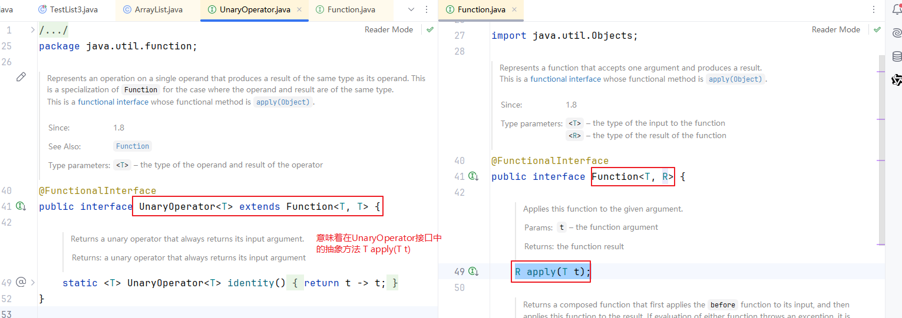

#### 4、查（新增）

- E get（下标）：返回[下标]对应的元素
- List<E> subList(起始下标，终止下标)：返回子集
- int indexOf（元素）：返回元素首次出现的下标
- int lastIndexOf（元素）：返回元素最后一次的下标

```java
package com.atguigu.list;

import org.junit.Test;

import java.util.ArrayList;
import java.util.List;

public class TestList4 {
    @Test
    public void test1(){
        ArrayList<String> list = new ArrayList<>();
        list.add("hello");
        list.add("world");
        list.add("world");
        list.add("java");
        list.add("atguigu");
        list.add("chai");
        list.add("world");

        String s = list.get(0);//指定下标
        System.out.println(s);//hello

        List<String> sub = list.subList(1, 4);
        System.out.println(sub);//[world, java, atguigu]

        int index = list.indexOf("world");
        int lastIndex = list.lastIndexOf("world");
        System.out.println("index = " + index);
        System.out.println("lastIndex = " + lastIndex);


    }


}

```


#### 5、遍历

- 增强for循环
- 普通for循环
- 迭代器（后面单独说这个主题）

```java
package com.atguigu.list;

import org.junit.Test;

import java.util.ArrayList;
import java.util.Arrays;

public class TestList5 {
    @Test
    public void test1(){
        ArrayList<String> list = new ArrayList<>();
        list.add("hello");
        list.add("world");
        list.add("world");

        //昨天讲的foreach循环仍然可以使用
        for (String s : list) {
            System.out.println(s);
        }
    }

    @Test
    public void test2(){
        ArrayList<String> list = new ArrayList<>();
        list.add("hello");
        list.add("world");
        list.add("world");

        //普通for循环遍历，可以完成，但是不推荐
        for(int i =0; i<list.size(); i++){
//            System.out.println(list[i]);//不是数组
            System.out.println(list.get(i));//获取[i]下标对应的元素
        }
    }

    @Test
    public void test3(){
        ArrayList<String> list = new ArrayList<>();
        list.add("hello");
        list.add("world");
        list.add("world");

        //可以实现把集合转为数组
        Object[] array = list.toArray();
        System.out.println(Arrays.toString(array));

        String[] strings = new String[0];//这里创建一个String[]，长度随意
        String[] array2 = list.toArray(strings);

    }
}

```


### 2.1.2 List接口的基础/常用实现类

#### 1、ArrayList和Vector

- ArrayList：俗称动态数组，因为它底层是用数组结构来存储一组元素。这个内部数组会自动扩容。
- Vector：旧版的动态数组。

> 问：ArrayList与Vector的区别？
>
> 相同点：动态数组
>
> 不同点：
>
> ​		（1）数组的初始化长度：ArrayList从JDK7开始，初始化为 长度为0的空数组，Vector初始化为长度为10的数组。
>
> ​										ArrayList在第1次添加元素时，会创建长度为10的数组。
>
> ​		（2）扩容机制/规则：ArrayList是1.5倍扩容，Vector是2倍扩容
>
> ​                       1.5倍是谨慎的扩容，空间的利用率高，浪费率低。缺点：扩容频率增加。
>
> ​                       2倍是大胆扩容，空间的利用率低，浪费高。优点：扩容频率低。
>
> ​         如果对元素的个数有大致的预判的话，那么可以直接使用**[ArrayList](../../java/util/ArrayList.html#ArrayList(int))**(int initialCapacity) 和 **[Vector](../../java/util/Vector.html#Vector(int))**(int initialCapacity)直接给定初始化容量
>
> ​     （3）Vector是古老的动态数组，线程是安全的。 ArrayList比Vector新，线程不安全的。
>
> ​      联想：StringBuffer（旧，线程安全的）和StringBuilder（新，线程不安全的）

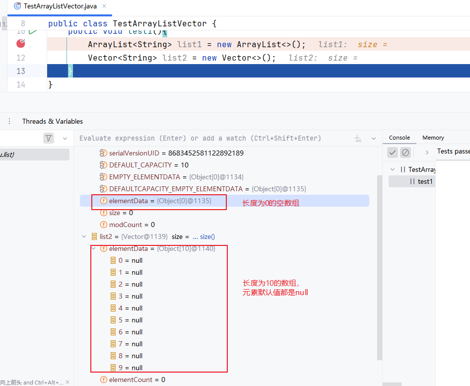


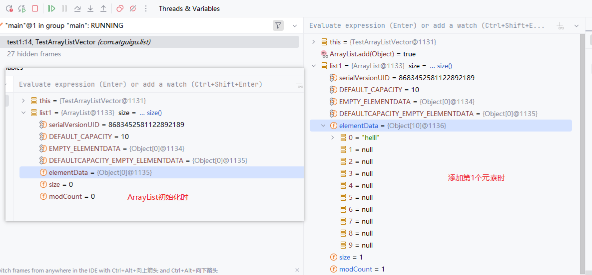


#### 2、LinkedList

LinkedList：双向链表

> 问：动态数组与双向链表有什么区别？
>
> 答：（1）数据结构不同：动态数组的物理结构是数组，双向链表的物理是链表
>
> ​        （2）动态数组的元素是连续存储，当我们创建ArrayList或Vector时，需要在堆中申请一整块连续的内存空间，来存储它的元素。
>
> 					双向链表，不要求元素是连续存储的，可以见缝插针的存元素，前后元素只要知道对方的地址即可。双向链表不仅仅需要存储元素，还得存储前后元素的地址，这就增加了负担。
>
> ​				补充：早期的时候，GC的算法效率或设计也好没有现在优秀，所以当数组变大以后要找一整块连续存储空间，压力比较大。
>
> ​					现在JVM的GC算法已经很优秀，而且内存的容量比之前大，所以，现在ArrayList的使用频率远远高于LinkedList。
>
> ​		（3）动态数组涉及到扩容。非末尾位置插入和删除元素需要移动元素。双向链表不需要扩容，不需要移动元素，但是每一个元素需要“结点”。
>
> ​					早期的时候，JVM内存拷贝技术一般，所以数组显得非常慢。而现在JVM内存拷贝技术很优秀了，数组的扩容和移动元素的拷贝效率非常高，而链表结点对象的创建和维护的时空消耗反而凸显出来了，使得现在LinkedList看起来更慢。
>
> ​		 （4）根据下标的查询，动态数组的效率极高，时间复杂度是O(1)，即可以直接根据数组首地址+下标，算出来元素的存储位置。
>
> ​                   根据下标的查询，双向链表的查询只能从头或从尾遍历，时间复杂度是O(n)。
>
> ​	    （5）不是根据下标查询，都得从头遍历，效率是一样的。


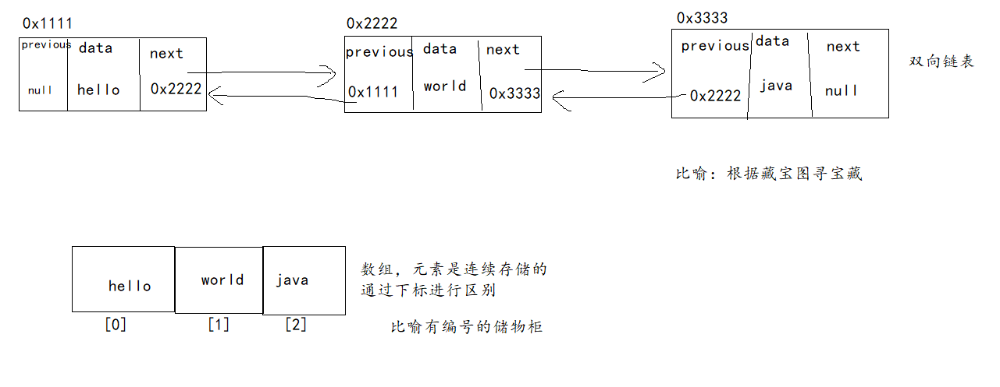

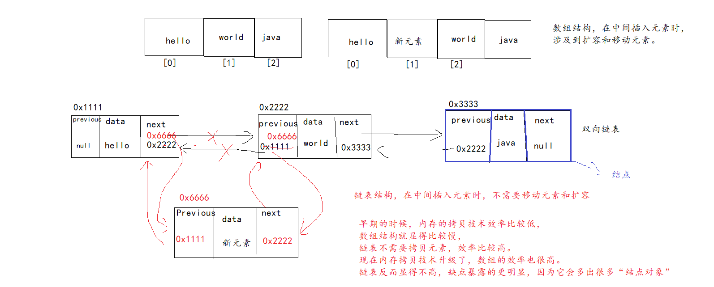

```java
package com.atguigu.list;

import org.junit.Test;

import java.util.ArrayList;
import java.util.LinkedList;
import java.util.Random;

public class TestTime {
    @Test
    public void test1(){
        long start = System.currentTimeMillis();
        ArrayList<Integer> list = new ArrayList<>();
        list.add(1);//这里先添加1个，保证list.size()不为0
        Random random = new Random();
        for(int i=1; i<=10000; i++){
            int index = random.nextInt(0, list.size());
            list.add(index, i);
        }
        long end = System.currentTimeMillis();
        System.out.println("时间：" + (end-start));//时间：4
    }

    @Test
    public void test2(){
        long start = System.currentTimeMillis();
        LinkedList<Integer> list = new LinkedList<>();
        list.add(1);//这里先添加1个，保证list.size()不为0
        Random random = new Random();
        for(int i=1; i<=10000; i++){
            int index = random.nextInt(0, list.size());
            list.add(index, i);
        }
        long end = System.currentTimeMillis();
        System.out.println("时间：" + (end-start));//时间：68
    }
}

```

#### 3、Stack

Stack是栈。它是Vector的子类。但是它在Vector的基础上，增加了几个特殊的方法，体现栈的数据结构特点，即先进后出（FILO，First In Last Out）或后进先出（LIFO，Last In First Out）。

- push()：压入栈
- pop()：弹出栈
- peek()：查看栈顶元素，不拿走
- search(元素)：查看这个元素从栈顶开始数是第几个元素，这里不是下标。

```java
package com.atguigu.list;

import org.junit.Test;

import java.util.Stack;

public class TestStack {
    @Test
    public void test1(){
        //Stack新增的方法
        Stack<String> stack = new Stack<>();
        stack.push("hello");
        stack.push("world");
        stack.push("java");
        stack.push("atguigu");

        System.out.println(stack.pop());//直接打印pop方法的返回值  atguigu
        System.out.println(stack.pop());//直接打印pop方法的返回值  java
        System.out.println(stack.pop());//直接打印pop方法的返回值  world
        System.out.println(stack.pop());//直接打印pop方法的返回值  hello
        System.out.println(stack.pop());//直接打印pop方法的返回值 报错EmptyStackException空栈异常
    }

    @Test
    public void test2(){
        //Stack新增的方法
        Stack<String> stack = new Stack<>();
        stack.push("hello");
        stack.push("world");
        stack.push("java");
        stack.push("atguigu");

        System.out.println(stack.peek());//atguigu
        System.out.println(stack.peek());//atguigu
        System.out.println(stack.peek());//atguigu

        System.out.println(stack.search("world"));//3
        System.out.println(stack.search("atguigu"));//1
    }
}

```

> 问：Stack和LinkedList都有push，pop，peek等方法，它们有什么区别？
>
> Stack成为顺序栈，底层是数组结构。
>
> LinkedList成为链式栈，底层是双向链表。


## 2.2 Collection的子接口：Queue和Deque

Queue称为队列，队列的特点是先进先出（FIFO，First In First Out）。它的实现类也有很多，基础阶段说一个LinkedList。

Queue有一个子接口Deque，它是双端队列（double ended queue）。基础阶段说一个LinkedList。

Queue接口的方法大致如下：添加往队尾添加，出来从队头出来

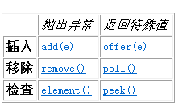

左边的方法如果添加，删除，查询失败，会抛出异常。右边的方法如果添加，删除，查询失败，会返回特殊值。

Deque接口的方法大致如下：可以从队头、队尾添加，也可以从队头、队尾出来

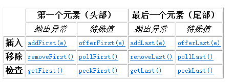

```java
package com.atguigu.list;

import org.junit.Test;

import java.util.LinkedList;

public class TestLinkedList {
    @Test
    public void test1(){
        LinkedList<String> list = new LinkedList<>();//LinkedList的栈结构特点
        list.push("hello");
        list.push("world");
        list.push("java");

        //后进先出
        System.out.println(list.pop());//java
        System.out.println(list.pop());//world
        System.out.println(list.pop());//hello
    }

    @Test
    public void test2(){
        LinkedList<String> list = new LinkedList<>();//LinkedList的队列结构特点

        list.add("hello");
        list.add("world");
        list.add("java");

        //先进先出
        System.out.println(list.remove());//删除队头元素 hello
        System.out.println(list.remove());//删除队头元素  world
        System.out.println(list.remove());//删除队头元素  java
        System.out.println(list.element());//查看队头元素， NoSuchElementException
        System.out.println(list.remove());//删除队头元素  NoSuchElementException
    }

    @Test
    public void test3(){
        LinkedList<String> list = new LinkedList<>();//LinkedList的队列结构特点

        list.offer("hello");
        list.offer("world");
        list.offer("java");

        //先进先出
        System.out.println(list.poll());//删除队头元素 hello
        System.out.println(list.poll());//删除队头元素  world
        System.out.println(list.poll());//删除队头元素  java
        System.out.println(list.poll());//删除队头元素  null 返回特殊值
        System.out.println(list.peek());//查看队头元素 null 返回特殊值
    }

    @Test
    public void test4(){
        LinkedList<String> list = new LinkedList<>();//LinkedList的双端队列结构特点

        list.addFirst("hello");
        list.addFirst("world");
        list.addLast("java");
        list.addFirst("atguigu");
        list.addLast("chai");
        //头     尾
        //atguigu  world  hello   java   chai
        System.out.println(list.removeFirst());//atguigu
        System.out.println(list.removeFirst());//world
        System.out.println(list.removeFirst());//hello
        System.out.println(list.removeFirst());//java
        System.out.println(list.removeFirst());//chai
    }
}

```


## 2.3 Collection集合的关系图

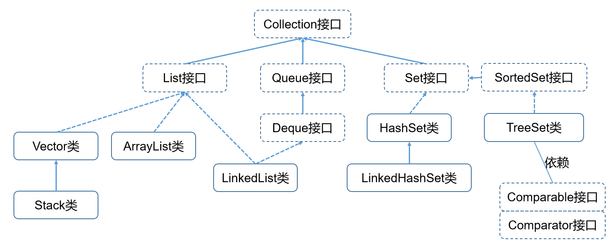


## 2.4 Map集合

Map是双列集合，它用于存储键值对(key,value)，键值对又被称为映射关系。


### 2.4.1 Map接口的API

所有Map集合以Map接口为根接口。Map的实现类有很多，其中使用频率最高的是HashMap。

#### 1、增

- put(key ,value )：添加一对键值对
- putAll(另一个Map)：将另一个Map中的键值对添加到当前Map中

```java
package com.atguigu.map;

import org.junit.Test;

import java.util.HashMap;

public class TestMap {
    @Test
    public void test1(){
        //存储同学名称及其手机号码
        HashMap<String, String> map = new HashMap<>();

        map.put("小孙", "10086");//添加一对键值对
        map.put("老王", "10010");

        System.out.println(map);
    }

    @Test
    public void test2(){
        HashMap<String, String> map = new HashMap<>();

        map.put("小孙", "10086");//添加一对键值对
        map.put("老王", "10010");

        HashMap<String, String> map2 = new HashMap<>();

        map2.put("小何", "110");//添加一对键值对
        map2.put("小孙", "120");

        map.putAll(map2);//把map2中的键值对添加到map中
        System.out.println(map);
        //{小孙=120, 老王=10010, 小何=110}
    }

}

```


#### 2、删

- remove(key)：只要key对应就删除一对键值对
- remove(key, value)：要求key,value都对应再删除一对键值对
- clear()：清空map集合

```java
package com.atguigu.map;

import org.junit.Test;

import java.util.HashMap;

public class TestMap2 {
    @Test
    public void test1(){
        HashMap<String, String> map = new HashMap<>();

        map.put("小孙", "10086");//添加一对键值对
        map.put("老王", "10010");

        map.remove("小孙");//根据key删除一对键值对
        System.out.println(map);//{老王=10010}

        map.remove("老王","120");//如果传入(key,value)，要求key和value都对应才能删除一对键值对。
        System.out.println(map);//{老王=10010}
    }

    @Test
    public void test2(){
        HashMap<String, String> map = new HashMap<>();

        map.put("小孙", "10086");//添加一对键值对
        map.put("老王", "10010");

        map.clear();
        System.out.println(map);
    }
}

```


#### 3、改

- replace(key，新value)
- replace(key，旧value，新value)
- replaceAll(BiFunction接口的实现类)，需要用匿名内部类实现BiFunction接口接口，重写apply方法，新Value类型  apply（key，旧value）

```java
package com.atguigu.map;

import org.junit.Test;

import java.util.HashMap;
import java.util.function.BiFunction;

public class TestMap3 {
    @Test
    public void test1(){
        HashMap<String, String> map = new HashMap<>();

        map.put("小孙", "10086");//添加一对键值对
        map.put("老王", "10010");

        map.replace("小孙","110"); //等价于 map.put("小孙" ,"110");  根据key覆盖原来的value
        System.out.println(map);//{小孙=110, 老王=10010}
    }

    @Test
    public void test2(){
        HashMap<String, String> map = new HashMap<>();

        map.put("小孙", "10086");//添加一对键值对
        map.put("老王", "10010");

        map.replace("小孙","10086","110");
        map.replace("老王","10086","120");
        //要求key和旧value都对应，才会用新的value覆盖原来的value
        System.out.println(map);
    }

    @Test
    public void test3(){
        HashMap<String, String> map = new HashMap<>();

        map.put("小孙", "10086");//添加一对键值对
        map.put("老王", "10010");

        /*
        replaceAll方法的形参：BiFunction<? super K, ? super V, ? extends V> （使用）
        BiFunction接口的原型 BiFunction<T, U, R> 抽象方法  R apply(T t, U u); （声明）
        现在结合它俩：
                现在的抽象方法  新Value的类型 apply(Key的类型， 旧Value的类型)

            //假设我这里想要在所有value值前面拼接上 "010-"
         */
        BiFunction<String,String,String> bi = new BiFunction<String, String, String>() {
            @Override
            public String apply(String key, String oldValue) {
                return "010-" + oldValue;
            }
        };

        map.replaceAll(bi);
        System.out.println(map);
    }

    @Test
    public void test4(){
        //存储学号 对应 英文名
        HashMap<Integer, String> map = new HashMap<>();

        map.put(1, "irene");//添加一对键值对
        map.put(2, "lucy");
        map.put(3, "lily");
        map.put(4, "alice");

        /*
        replaceAll方法的形参：BiFunction<? super K, ? super V, ? extends V> （使用）
        BiFunction接口的原型 BiFunction<T, U, R> 抽象方法  R apply(T t, U u); （声明）
        现在结合它俩：
                现在的抽象方法  新Value的类型 apply(Key的类型， 旧Value的类型)

            假设我这里想要把 key为偶数的键值对的 value的值改为大写
         */
        BiFunction<Integer,String,String> bi = new BiFunction<>() {
            @Override
            public String apply(Integer key, String oldValue) {
                return key%2==0 ? oldValue.toUpperCase() : oldValue;
            }
        };

        map.replaceAll(bi);
        System.out.println(map);
    }
}

```


#### 4、查

- V get(key)：根据key查询value
- V getOrDefault(key)：根据key查询value，如果该key对应的value不存在，用默认值返回
- boolean containsKey(key)：判断某个key有没有
- boolean containsValue(value)：判断某个value有没有
- boolean isEmpty()：判断是否为空
- int size()：返回键值对的数量

```java
package com.atguigu.map;

import org.junit.Test;

import java.util.HashMap;

public class TestMap4 {
    @Test
    public void test1(){

        HashMap<String, String> map = new HashMap<>();

        map.put("小孙", "10086");//添加一对键值对
        map.put("老王", "10010");

        //根据key查询它对应的value
        String value = map.get("小孙");
        System.out.println(value);//10086

        //根据key查询它对应的value，如果这个key对应的value不存在，就返回默认value值
        String tel = map.getOrDefault("小孙", "110");
        System.out.println(tel);//10086

        tel = map.getOrDefault("小柴", "110");
        System.out.println(tel);//110
    }

    @Test
    public void test2(){
        HashMap<String, String> map = new HashMap<>();

        map.put("小孙", "10086");//添加一对键值对
        map.put("老王", "10010");

        System.out.println(map.containsKey("小孙"));//true
        System.out.println(map.containsValue("10086"));//true
        System.out.println(map.size());//键值对的数量
        System.out.println(map.isEmpty());//map是否为空

    }
}

```


#### 5、遍历

- Set<K> keySet()：遍历所有key
- Collection<V> values()：遍历所有value
- Set<Map.Entry<K,V>  entrySet()：遍历所有键值对

```java
package com.atguigu.map;

import org.junit.Test;

import java.util.Collection;
import java.util.HashMap;
import java.util.Map;
import java.util.Set;

public class TestMap5 {
    @Test
    public void test1(){
        HashMap<String, String> map = new HashMap<>();

        map.put("小孙", "10086");//添加一对键值对
        map.put("老王", "10010");


        //方式一：遍历所有的key
        //Set集合的元素不可以重复，因为key不能重复
        Set<String> keys = map.keySet();//通过keySet()方法，获取map中所有的key
//        public Set<K> keySet() {
//            Set<K> ks = keySet;
//            if (ks == null) {
//                ks = new HashMap.KeySet();
//                keySet = ks;
//            }
//            return ks;
//        }
        for (String key : keys) {
            System.out.println(key);
        }

        for (String key : keys) {
            System.out.println(key +"->" + map.get(key));
        }
    }

    @Test
    public void test2(){
        HashMap<String, String> map = new HashMap<>();

        map.put("小孙", "10086");//添加一对键值对
        map.put("老王", "10086");
        System.out.println(map);


        //方式二：遍历所有的value
        Collection<String> values = map.values();
        for (String value : values) {
            System.out.println(value);
        }
    }

    @Test
    public void test3(){
        HashMap<String, String> map = new HashMap<>();

        map.put("小孙", "10086");//添加一对键值对
        map.put("老王", "10086");
        System.out.println(map);

        //方式三：遍历所有的键值对
        Set<Map.Entry<String, String>> entries = map.entrySet();
        //最外层是Set表示，所有的(key,value)的映射关系不会重复
        //内层是 Map.Entry，它是所有(key,value)键值对的公共父接口类型
        //因为Entry接口是Map接口的内部接口，所以名字上写的是Map.Entry
        for (Map.Entry<String, String> entry : entries) {//一个entry代表一个键值对
//            System.out.println(entry);
            System.out.println("key:" + entry.getKey() +"\tvalue = " +entry.getValue());
        }
    }

}

```


## 增强 for 循环与 forEach 循环的区别对比表

|       对比维度       |                        增强 for 循环                         |                         forEach 循环                         |
| :------------------: | :----------------------------------------------------------: | :----------------------------------------------------------: |
|     **语法结构**     | Java 5 引入的语法糖，形式为 `for (Element e : collection) { ... }` | Java 8 引入的方法，是`Iterable`接口的默认方法，形式为 `collection.forEach(element -> { ... })` |
|     **底层实现**     | 编译后转换为传统 for 循环，使用迭代器（Iterator）或索引访问  |   内部使用迭代器（Iterator）实现，不同集合类型有差异化优化   |
|     **适用范围**     |         适用于任何实现`Iterable`接口的集合或**数组**         | 适用于实现`Iterable`接口的集合，以及 Java 8 + 的流（Stream） |
| **对集合修改的限制** | 遍历中直接修改集合结构（增 / 删元素）会抛出`ConcurrentModificationException` | 直接修改集合结构同样抛`ConcurrentModificationException`，但可通过`removeIf()`等方法安全修改 |
|     **异常处理**     |             可直接使用传统`try-catch`块捕获异常              |     Lambda 表达式中的异常需显式处理，或声明为运行时异常      |
|     **性能差异**     | 数组遍历性能与传统 for 循环相当；集合遍历性能略低于传统 for 循环 |     性能与增强 for 循环相近，并行流场景下可获得更优性能      |
|  **可读性和易用性**  |                 语法简洁直观，易于理解和上手                 |      结合 Lambda 表达式，代码更简洁，符合函数式编程风格      |
|  **函数式编程支持**  |           不支持函数式编程，仅适用于命令式编程范式           |       支持 Lambda 表达式和方法引用，便于函数式编程开发       |
|      **控制流**      |         可使用`break`、`continue`关键字控制循环流程          | 无法直接使用`break`、`continue`，需通过`return`或抛出异常控制 |

## 示例代码对比

```java
// 增强for循环示例
for (Student student : arrayList) {
    System.out.println(student.getName());
}

// forEach循环 Lambda表达式示例
arrayList.forEach(student -> System.out.println(student.getName()));

// forEach循环 方法引用示例
arrayList.forEach(System.out::println);
```

## 总结

循环类型适用场景增强 for 循环简单遍历场景，需要使用`break`/`continue`控制循环流程时forEach 循环函数式编程风格开发、并行流处理，追求代码简洁性时

### 2.4.2 Map集合的特点

- Map的key不可重复。如果两对(key,value)添加到同一个map，key重复的话，新的value会覆盖旧的value。
- Map的value可以重复。
- `Map的key不可修改`，value可以修改。开发中通常会用Integer，String类的对象作为key，因为它们不可变。当然，如果使用得当，可以是任意类型的对象作为key。


### 2.4.3 Map的常见实现类

Map的常见实现类：

- HashMap<K,V>：哈希表
- Hashtable<K,V>：哈希表
- LinkedHashMap<K,V>：链式哈希表，LinkedHashMap是HashMap子类。
- TreeMap<K,V>：红黑树
- Properties：它是Hashtable的子类，它的key和value默认用String类型。而且添加键值对建议用setProperty方法，获取value建议用getProperty方法。通常用于封装 xx.properties配置文件的信息。

> 问：HashMap和Hashtable有什么区别？
>
> Hashtable是古老的哈希表，线程安全的。不允许key和value为null。底层数据结构是：数组+单链表。
>
> HashMap是比Hashtable更新的哈希表，线程不安全的。允许key和value为null。底层数据结构：Java之后 数组+单链表+红黑树。

> 问：HashMap与LinkedHashMap有什么区别？
>
> HashMap存储键值对遍历没有规律。
>
> LinkedHashMap存储键值对按照添加的顺序遍历。有一个双向链表来记录所有键值对的添加顺序。

> 问：HashMap与TreeMap有什么区别？
>
> HashMap存储键值对遍历没有规律。
>
> TreeMap存储键值对遍历按照key的大小顺序排列。依赖于Comparable 或 Comparator接口。

```java
package com.atguigu.map;

import org.junit.Test;

import java.io.IOException;
import java.util.*;

public class TestMapImpl {
    @Test
    public void test1(){
        HashMap<Integer,String> map = new HashMap<>();
        map.put(null,"hello");
        map.put(2,null);
        System.out.println(map);
    }

    @Test
    public void test2(){
        Hashtable<Integer,String> map = new Hashtable<>();//不允许key和value为null
        map.put(null,"hello");
        map.put(2,null);
        System.out.println(map);
    }

    @Test
    public void test3(){
        HashMap<Integer,String> map = new HashMap<>();
        map.put(1,"hello");
        map.put(11,"java");
        map.put(21,"world");
        map.put(34,"atguigu");
        map.put(12,"chai");
        map.put(15,"mysql");
        System.out.println(map);
        //{1=hello, 34=atguigu, 21=world, 11=java, 12=chai, 15=mysql}
        //无规律
    }

    @Test
    public void test4(){
        LinkedHashMap<Integer,String> map = new LinkedHashMap<>();
        map.put(1,"hello");
        map.put(11,"java");
        map.put(21,"world");
        map.put(34,"atguigu");
        map.put(12,"chai");
        map.put(15,"mysql");
        System.out.println(map);
        //{1=hello, 11=java, 21=world, 34=atguigu, 12=chai, 15=mysql}
        //按照添加顺序
    }

    @Test
    public void test5(){
        //key是Integer类型，它实现了Comparable接口
        TreeMap<Integer,String> map = new TreeMap<>();
        map.put(1,"hello");
        map.put(11,"java");
        map.put(21,"world");
        map.put(34,"atguigu");
        map.put(12,"chai");
        map.put(15,"mysql");
        System.out.println(map);
        //{1=hello, 11=java, 12=chai, 15=mysql, 21=world, 34=atguigu}
        //按照key的大小顺序排列
    }

    @Test
    public void test6(){
        //key是Integer类型，它实现了Comparable接口，从小到大排序
        //想要从大到小排列
        Comparator<Integer> c = new Comparator<Integer>() {
            @Override
            public int compare(Integer o1, Integer o2) {
                return o2-o1;
            }
        };
        TreeMap<Integer,String> map = new TreeMap<>(c);
        map.put(1,"hello");
        map.put(11,"java");
        map.put(21,"world");
        map.put(34,"atguigu");
        map.put(12,"chai");
        map.put(15,"mysql");
        System.out.println(map);
        //{34=atguigu, 21=world, 15=mysql, 12=chai, 11=java, 1=hello}
        //按照key的大小顺序排列
    }

    @Test
    public void test7(){
        Properties p = new Properties();
        //添加键值对建议用setProperty方法，获取value建议用getProperty方法
        p.setProperty("username","chai");
        p.setProperty("password","123456");
        System.out.println(p);
    }

    @Test
    public void test8() throws IOException {
        Properties p = new Properties();
        //因为jdbc.properties文件是在src下，与咱们写的类是在一起的，所以用类加载器帮我们加载这个文件
        p.load(ClassLoader.getSystemClassLoader().getResourceAsStream("jdbc.properties"));//加载
        System.out.println(p);

        String user = p.getProperty("user");
        System.out.println("user = " + user);
    }
}

```

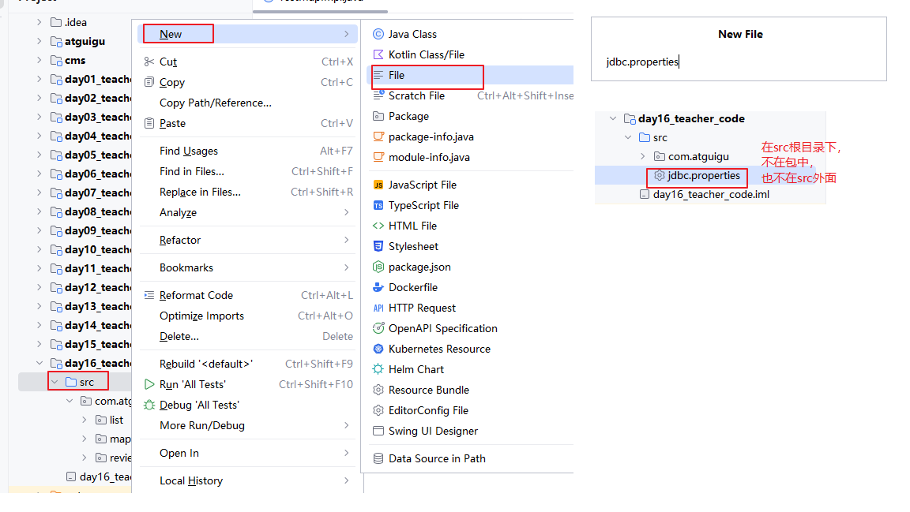

### 2.4.4 Map集合的关系图

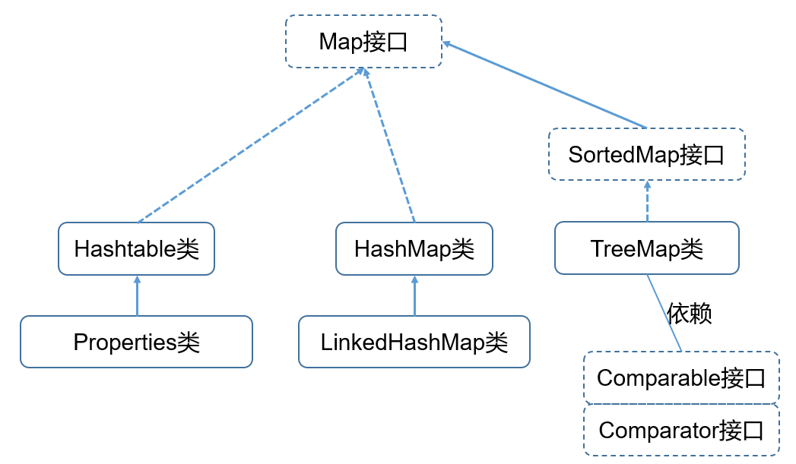

### 2.4.5 Set和Map有什么关系

所有Set的内部结构都是一个Map，存储到Set中的元素都是内部Map的key，它们的value都是一个Object类型的常量对象PRESENT。

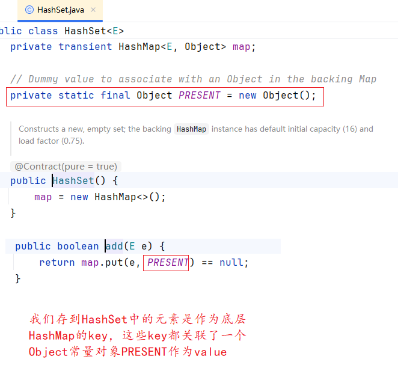


### 2.4.6 如果value是多个对象怎么办？

如果value是多个对象，就再用集合装起来就可以。

```java
package com.atguigu.map;

import org.junit.Test;

import java.util.ArrayList;
import java.util.HashMap;

public class TestKeyValues {
    @Test
    public void test1(){
        //存储咱们班的男同学及其女朋友
        HashMap<String, String> map = new HashMap<>();
        map.put("小孙", "翠花");
        map.put("小孙", "如花");
        map.put("小孙", "花花");
        System.out.println(map);
    }

    @Test
    public void test2(){
        //存储咱们班的男同学及其女朋友
        HashMap<String, ArrayList<String>> map = new HashMap<>();
        ArrayList<String> girls = new ArrayList<>();
        girls.add("翠花");
        girls.add("如花");
        girls.add("花花");
        map.put("小孙", girls);
        map.put("小司",null);

        System.out.println(map);
    }
}

```


### 2.4.7 Collection、Map、Set、List、Queue有什么区别？

Collection系列的集合是单列集合，存储一组对象。Set和List、Queue都是它的子接口

Map系列的集合是双列集合，存储一组键值对。Map与Collection是独立的，并列的两个接口，没有继承关系。

Set系列的集合不能重复，List系列的集合可以重复，Set系列的集合是无序（不能通过下标进行操作），List系列的集合是有序的（可以通过下标进行操作）。Queue是体现先进先出的集合特点。


## 2.5 集合工具类Collections

Collections是工具类，它里面提供了很多静态方法，服务于各种集合。

Collections 是一个操作 Set、List 和 Map 等集合的工具类。Collections 中提供了一系列静态的方法对集合元素进行排序、查询和修改等操作，还提供了对集合对象设置不可变、对集合对象实现同步控制（线程安全）等方法：

* public static <T> boolean addAll(Collection<? super T> c,T... elements)：将所有指定元素添加到指定 collection 中。
* public static <T> int binarySearch(List<? extends Comparable<? super T>> list,T key)：在List集合中查找某个元素的下标，List的元素必须支持可比较大小，即支持自然排序。而且List集合也事先必须是有序的，否则结果不确定。
* public static <T> int binarySearch(List<? extends T> list,T key,Comparator<? super T> c)：在List集合中查找某个元素的下标，List的元素使用定制比较器c的compare方法比较大小。而且List集合也事先必须是有序的，否则结果不确定。

* public static <T extends Object & Comparable<? super T>> T max(Collection<? extends T> coll)在coll集合中找出最大的元素，集合中的对象必须是T或T的子类对象，而且支持自然排序
* public static <T> T max(Collection<? extends T> coll,Comparator<? super T> comp)在coll集合中找出最大的元素，集合中的对象必须是T或T的子类对象，按照比较器comp找出最大者
* public static void reverse(List<?> list)反转指定列表List中元素的顺序。
* public static void shuffle(List<?> list) List 集合元素进行随机排序，类似洗牌
* public static <T extends Comparable<? super T>> void sort(List<T> list)根据元素的自然顺序对指定 List 集合元素按升序排序
* public static <T> void sort(List<T> list,Comparator<? super T> c)根据指定的 Comparator 产生的顺序对 List 集合元素进行排序
* public static void swap(List<?> list,int i,int j)将指定 list 集合中的 i 处元素和 j 处元素进行交换
* public static int frequency(Collection<?> c,Object o)返回指定集合中指定元素的出现次数
* public static <T> void copy(List<? super T> dest,List<? extends T> src)将src中的内容复制到dest中
* public static <T> boolean replaceAll(List<T> list，T oldVal，T newVal)：使用新值替换 List 对象的所有旧值
* Collections 类中提供了多个 synchronizedXxx() 方法，该方法可使将指定集合包装成线程同步的集合，从而可以解决多线程并发访问集合时的线程安全问题
* Collections类中提供了多个unmodifiableXxx()方法，该方法返回指定 Xxx的不可修改的视图。

```java
package com.atguigu.collections;

import lombok.AllArgsConstructor;
import lombok.Data;
import lombok.NoArgsConstructor;

@Data
@NoArgsConstructor
@AllArgsConstructor
public class Student implements Comparable<Student>{
    private String name;
    private int score;

    @Override
    public int compareTo(Student o) {
        return this.score - o.score;
    }
}

```

```java
package com.atguigu.collections;

import org.junit.Test;

import java.util.ArrayList;
import java.util.Collections;

public class TestCollections {
    @Test
    public void test1(){
        ArrayList<String> list = new ArrayList<>();
        //同时添加多个元素 hello,world,java,atguigu
        Collections.addAll(list, "hello","world","java","atguigu");
        System.out.println(list);
    }

    @Test
    public void test2(){
        //二分查找，一定要基于“有序”的数组或集合
        //因为和下标有关系，所以是针对List系列集合
        ArrayList<String> list = new ArrayList<>();
        //同时添加多个元素 hello,world,java,atguigu
        Collections.addAll(list, "abc","chai","java","zero");

        //String类型实现Comparable接口
        int index = Collections.binarySearch(list, "chai");
        System.out.println(index);//1

        index = Collections.binarySearch(list, "atguigu");
        System.out.println(index);//-2
    }

    @Test
    public void test3(){
        ArrayList<Student> list = new ArrayList<>();
        list.add(new Student("张三",86));
        list.add(new Student("李四",96));
        list.add(new Student("王五",100));

        int index = Collections.binarySearch(list, new Student("王五", 100));
        System.out.println("index = " + index);
    }

    @Test
    public void test4(){
        ArrayList<Student> list = new ArrayList<>();
        list.add(new Student("张三",86));
        list.add(new Student("王五",100));
        list.add(new Student("李四",96));

        //找出最高分的同学
        Student max = Collections.max(list);
        System.out.println(max);

    }

    @Test
    public void test5(){
        ArrayList<Integer> list = new ArrayList<>();
        Collections.addAll(list, 1,2,3,4,5);
        System.out.println(list);

        Collections.reverse(list);//反转List集合
        System.out.println(list);
    }

    @Test
    public void test6(){
        ArrayList<Integer> list = new ArrayList<>();
        Collections.addAll(list, 1,2,3,4,5);
        System.out.println(list);

        Collections.shuffle(list);//打乱List元素的顺序，类似于洗牌
        System.out.println(list);
    }

    @Test
    public void test7(){
        ArrayList<String> list = new ArrayList<>();
        //同时添加多个元素 hello,world,java,atguigu
        Collections.addAll(list, "hello","world","java","atguigu");
        System.out.println(list);

        //交换[0] 与 [3]位置的元素
        Collections.swap(list,0,3);
        System.out.println(list);
    }

    @Test
    public void test8(){
        ArrayList<Integer> list = new ArrayList<>();
        Collections.addAll(list, 1,2,1,4,1,1,3,4,1);
        //统计1出现几次
        int count = Collections.frequency(list, 1);
        System.out.println(count);
    }

    @Test
    public void test9(){
        ArrayList<String> list = new ArrayList<>();
        //同时添加多个元素 hello,world,java,atguigu
//        Collections.addAll(list, "hello","world","java","atguigu");
        Collections.addAll(list, "hello");

        ArrayList<String> list2 = new ArrayList<>();
        Collections.addAll(list2,"张三","李四");

        Collections.copy(list, list2);//把list2的元素复制到list，逐位覆盖原来的元素
        //如果目标集合list的元素个数少于list2，那么会报错
        System.out.println(list);
    }

    @Test
    public void test10(){
        ArrayList<String> list = new ArrayList<>();
        //同时添加多个元素 hello,world,java,atguigu
        Collections.addAll(list, "hello","world","java","atguigu");

        ArrayList<String> list2 = new ArrayList<>();
        Collections.addAll(list2,"张三","李四");

        list.addAll(list2);//把list2的元素复制到list中，放到末尾，追加
        System.out.println(list);
    }
}

```


