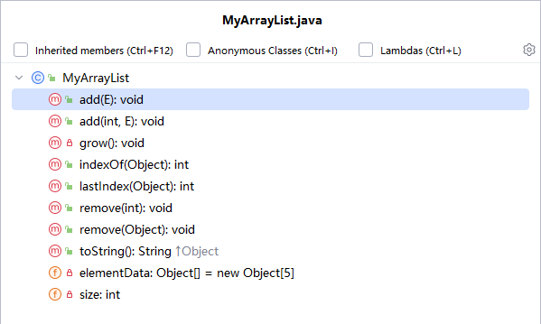

# 三、源码分析

## 1.1 动态数组

### 1.1.1  模仿ArrayList写简易版的MyArrayList（昨天）

```java
快速查看一个类的成员有哪些，打开这个类，按快捷键Ctrl + F2
```



ArrayList和Vector是动态数组。

```java
package com.atguigu.arraylist;

import java.util.Arrays;
import java.util.Objects;
import java.util.StringJoiner;

/*
因为直接跟踪ArrayList和Vector的源码，比较有难度。
为了捋清它的底层思路，我们“模仿”ArrayList写一个简易迷你版的动态数组。

这个思想弄清楚之后，对于ArrayList和Vector，StringBuffer，StringBuilder等的理解都有好处
 */
public class MyArrayList<E> {
    private Object[] elementData = new Object[5];//先初始化为长度5的数组，后续不够了再扩容
    private int size;//记录实际存储的元素的个数  正常来说 size <= elementData.length

   /* public void add(E e){//末尾位置添加
        //选中要抽取到新方法中的代码，然后按Ctrl +Alt + M
        if(size >= elementData.length){//说明数组已满，无法加新元素了
            //扩容
//            elementData = Arrays.copyOf(elementData, elementData.length + (elementData.length>>1));
            elementData = Arrays.copyOf(elementData, elementData.length + elementData.length/2);
            //让elementData指向新数组
        }
        elementData[size++] = e;
    }*/
   public void add(E e){//末尾位置添加
       //检查要不要扩容，如果需要，就进行扩容
       grow();
       elementData[size++] = e;
   }

    private void grow() {
        if(size >= elementData.length){//说明数组已满，无法加新元素了
            //扩容
 //            elementData = Arrays.copyOf(elementData, elementData.length + (elementData.length>>1));
            elementData = Arrays.copyOf(elementData, elementData.length + elementData.length/2);
            //让elementData指向新数组
        }
    }

    public void add(int index, E e){//中间位置插入
        if(index<0 || index>size){
            throw new IndexOutOfBoundsException(index+"越界了");
        }
        //检查要不要扩容，如果需要，就进行扩容
        grow();
        /*
        移动元素,新元素的插入位置是index
        假设 elementData数组的长度为5，size=4， index=1
             需要移动 elementData[1],elementData[2],elementData[3]
             分别移到  elementData[2],elementData[3],elementData[4]
             个数：size-index
         */
        System.arraycopy(elementData,index, elementData, index+1, size-index);
        //把新元素放到[index]位置
        elementData[index] = e;
        //元素个数增加
        size++;
    }

    public void remove(int index){
       if(index<0 || index>=size){
           throw new IndexOutOfBoundsException(index+"越界了");
       }
        /*
        移动元素,删除的位置是index
        假设 elementData数组的长度为5，size=4， index=1
             需要移动 elementData[2],elementData[3]
             分别移到  elementData[1],elementData[2]
             个数：size-index-1
         */
        System.arraycopy(elementData, index+1, elementData, index, size-index-1);
        //把末尾位置置为null，且元素个数减少
        elementData[--size] = null;
    }

    public void remove(Object obj){
       //先找到obj在当前数组的位置
        int index = indexOf(obj);
        if(index==-1){
            return;//提前结束删除过程，不删除了
        }
        remove(index);
    }

    public int indexOf(Object obj){
       //找到了，返回正常的下标
        //思路一：分情况讨论
        /*if(obj == null){
            for (int i = 0; i < size; i++) {
                if (obj == elementData[i]) {
                    return i;
                }
            }
        }else {
            for (int i = 0; i < size; i++) {
                if (obj.equals(elementData[i])) {
                    return i;
                }
            }
        }*/
        //思路二：用Objects工具类的equals方法
        for (int i = 0; i < size; i++) {
            if (Objects.equals(elementData[i],obj)) {
                return i;
            }
        }
       return -1;//代表不存在
    }

    public int lastIndex(Object obj){
        //思路二：用Objects工具类的equals方法
        for (int i = size-1; i >=0; i--) {
            if (Objects.equals(elementData[i],obj)) {
                return i;
            }
        }
        return -1;//代表不存在
    }

    @Override
    public String toString() {
        //return Arrays.toString(elementData);//可以，不够完美，会把null元素也暴露了
        //希望有size个元素，就返回size个元素给对方看
        StringJoiner joiner = new StringJoiner(",","[","]");
        for(int i=0; i<size; i++){
            joiner.add(elementData[i]+"");
        }
        return joiner.toString();
    }
}

```

```java
package com.atguigu.arraylist;

import org.junit.Test;

public class TestMyArrayList {
    @Test
    public void test1(){
        MyArrayList<String> list = new MyArrayList<>();
        list.add("hello");
        list.add("world");
        list.add(0,"java");
        System.out.println(list);

        System.out.println(list.indexOf(new String("hello")));
    }

    @Test
    public void test2(){
        MyArrayList<String> list = new MyArrayList<>();
        list.add("hello");
        list.add("world");
        list.add(null);
        list.add("chai");

        System.out.println(list.indexOf("chai"));
        System.out.println(list.indexOf(null));
    }

    @Test
    public void test3(){
        MyArrayList<String> list = new MyArrayList<>();
        list.add("hello");
        list.add("world");
        list.add(null);
        list.add("chai");

        list.remove(1);
        list.remove("chai");
        System.out.println(list);
    }
}
```

### 1.1.2 ArrayList部分的源码

成员变量：

```java
Object[] elementData;  //数组,用来存储元素的
int size; //记录实际元素的个数

Object[] EMPTY_ELEMENTDATA = {}; //空数组
Object[] DEFAULTCAPACITY_EMPTY_ELEMENTDATA = {}; //默认空数组

int DEFAULT_CAPACITY = 10; //默认容量
```

构造器：

```java
    public ArrayList() {
        this.elementData = DEFAULTCAPACITY_EMPTY_ELEMENTDATA; //初始化为空数组
    }
```

方法：

```java
    public boolean add(E e) {
        modCount++;
        add(e, elementData, size);
        return true;
    }

	private void add(E e, Object[] elementData, int s) {//s是size
        if (s == elementData.length)  //数组是否已满
            elementData = grow(); //扩容
        elementData[s] = e; //把新元素放到[size]位置
        size = s + 1;//元素个数+1
    }

    private Object[] grow() {
        return grow(size + 1);
    }
	private Object[] grow(int minCapacity) { //minCapacity等于size+1，数组的长度至少能装size+1个元素
        int oldCapacity = elementData.length;//扩容之前的数组长度
        if (oldCapacity > 0 || elementData != DEFAULTCAPACITY_EMPTY_ELEMENTDATA) {//原来的数组不是空数组，不是第一次添加元素
            //newCapacity 数组的新容量（容量就是长度的意思）
            //通过ArraysSupport工具类的newLength方法来计算新数组的长度
            int newCapacity = ArraysSupport.newLength(oldCapacity,
                    minCapacity - oldCapacity, /* minimum growth */
                    oldCapacity >> 1           /* preferred growth */);
            /*
            newLength方法的3个实参：
            	（1）旧数组的容量/长度，
            	（2)最小容量 - 旧数组的长度 ，即至少需要新增加几个元素的位置，简称为最小增量
            	（3）oldCapacity >> 1 原来数组的一半，预备增长的容量
            */
            
            
            //通过Arrays.copyOf方法完成扩容
            return elementData = Arrays.copyOf(elementData, newCapacity);//数组扩容，新数组的长度newCapacity
        } else { //原来的数组是空数组
            return elementData = new Object[Math.max(DEFAULT_CAPACITY, minCapacity)];//新建数组
            // Math.max(DEFAULT_CAPACITY, minCapacity) 找默认数组容量10 与 最小要求的容量(size+1)的最大值
        }
    }
```

```java
	//ArraysSupport类的newLength方法
	int SOFT_MAX_ARRAY_LENGTH = Integer.MAX_VALUE - 8; //JVM的限制，Java中数组的长度最大值

	//3个形参：（1）旧数组容量（2）最小增量（3）预备增长的容量
	public static int newLength(int oldLength, int minGrowth, int prefGrowth) {
        // preconditions not checked because of inlining
        // assert oldLength >= 0
        // assert minGrowth > 0

        //Math.max(minGrowth, prefGrowth)找最小增量和预备增量的容量的最大值
        int prefLength = oldLength + Math.max(minGrowth, prefGrowth); // might overflow
        if (0 < prefLength && prefLength <= SOFT_MAX_ARRAY_LENGTH) {
            return prefLength;
        } else {
            // put code cold in a separate method
            return hugeLength(oldLength, minGrowth);//创建最大长度的数组
        }
    }
```

```java
	public boolean remove(Object o) {//在当前集合中删除o对象
        final Object[] es = elementData; //用局部变量es来代表成员变量 elementData数组
        final int size = this.size;  //用局部变量size 来代表 成员变量size
        int i = 0;
        found: {//给一个局部代码块取了一个标签名
            if (o == null) { 
                for (; i < size; i++)//在[0,size-1]范围找，这个范围是我们存储了元素的范围
                    if (es[i] == null) //找到数组中的第一个null值
                        break found; //跳出整个标签{}起来的代码块
            } else {
                for (; i < size; i++)
                    if (o.equals(es[i])) //找到数组中第一个与o相等的元素
                        break found;
            }
            return false; //如果没有找到，就返回false，结束当前方法
        }
        //出了上面的循环，i的值就是要被删除的元素的下标值
        fastRemove(es, i);
        return true;
    }
	private void fastRemove(Object[] es, int i) {//i是要被删除的元素的下标
        modCount++;
        final int newSize;
        //newSize相当于新的元素的个数值
        if ((newSize = size - 1) > i) //如果i=size-1，说明删除的是最后一个元素，不需要移动元素。
            						 //如果i<size-1，非末尾位置删除，需要移动元素
            System.arraycopy(es, i + 1, es, i, newSize - i);
        	//把es数组从[i+1]开始是元素 移动到 es[i]位置，往前移动
        es[size = newSize] = null; //把size赋值为newSize，相当于size-1。  把末尾位置变为null。
    }
```

### 1.1.3 Vector部分源码

成员变量：

```java
Object[] elementData; //用于存储元素的数组
int elementCount;  //记录元素的个数
int capacityIncrement; //增量  如果没有通过构造器手动指定，默认值是0
```

构造器：

```java
    public Vector() {
        this(10); //调用本类的有参构造
    }
	public Vector(int initialCapacity) {
        this(initialCapacity, 0);
    }
	/*
	这个构造器中，throw了异常，但是没有在构造器后面写throws的原因：
		这个异常是运行时异常，编译器没有检测到。
		编译器没有检测到，不代表它无害，一旦它发生，当前构造器仍然会挂掉，而且会被这个异常带回到调用这个构造器的地方。
	*/
    public Vector(int initialCapacity, int capacityIncrement) {
        super(); //调用父类的无参构造
        if (initialCapacity < 0) //如果手动指定的初始化容量为负数
            throw new IllegalArgumentException("Illegal Capacity: "+initialCapacity); //抛出异常
        
        this.elementData = new Object[initialCapacity]; //创建新数组，长度为initialCapacity，无参构造过来的话，就是10
        this.capacityIncrement = capacityIncrement;//初始化增量，无参构造过来的话，就是0
    }
```

添加方法：

```java
    public synchronized boolean add(E e) {
        modCount++;
        add(e, elementData, elementCount);
        return true;
    }
  	private void add(E e, Object[] elementData, int s) {//s代表元素个数,e代表要添加的新元素
        if (s == elementData.length) //判断数组是不是满了
            elementData = grow();
        elementData[s] = e; //把新元素放到[elementCount]的位置，末尾位置
        elementCount = s + 1;//元素个数+1
    }
    private Object[] grow() {
        return grow(elementCount + 1);
    }
    private Object[] grow(int minCapacity) {
        int oldCapacity = elementData.length; //旧数组容量
        //newCapacity新数组容量
        //通过ArraysSupport的newLength方法来计算新数组容量
        int newCapacity = ArraysSupport.newLength(oldCapacity,
                minCapacity - oldCapacity, /* minimum growth */
                capacityIncrement > 0 ? capacityIncrement : oldCapacity
                                           /* preferred growth */);
        /*
        newLength方法的3个实参：
        （1）旧数组容量
        （2） minCapacity - oldCapacity 最小增量
        （3）capacityIncrement > 0 ? capacityIncrement : oldCapacity 
        	如果手动指定了capacityIncrement的值，那么它不会为0，就按照这个规则来扩容
        	如果没有手动指定capacityIncrement的值，它的默认值是0， 增量就按照旧数组容量来，它是预备增量
        
        */
        
        return elementData = Arrays.copyOf(elementData, newCapacity); //扩容，新数组容量是newCapacity
    }
```

```java
	//ArraysSupport类的newLength方法
	int SOFT_MAX_ARRAY_LENGTH = Integer.MAX_VALUE - 8; //JVM的限制，Java中数组的长度最大值

	//3个形参：（1）旧数组容量（2）最小增量（3）预备增长的容量
	public static int newLength(int oldLength, int minGrowth, int prefGrowth) {
        // preconditions not checked because of inlining
        // assert oldLength >= 0
        // assert minGrowth > 0

        //Math.max(minGrowth, prefGrowth)找最小增量和预备增量的容量的最大值
        int prefLength = oldLength + Math.max(minGrowth, prefGrowth); // might overflow
        if (0 < prefLength && prefLength <= SOFT_MAX_ARRAY_LENGTH) {
            return prefLength;
        } else {
            // put code cold in a separate method
            return hugeLength(oldLength, minGrowth);//创建最大长度的数组
        }
    }
```


