## 1.2 双向链表

### 1.2.1 结点

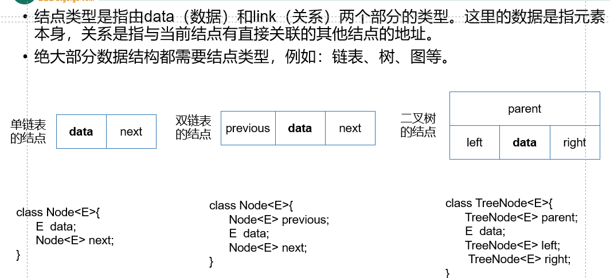

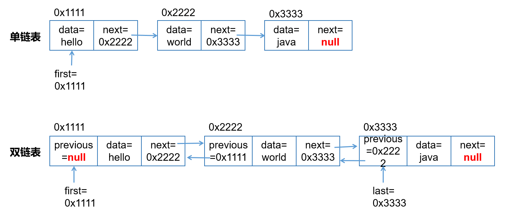

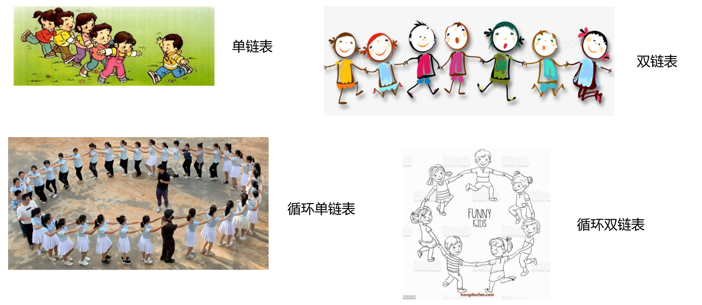

### 1.2.2 模仿LinkedList写简易版的双链表

#### 1、准备工作

```java
package com.atguigu.list;

public class MyLinkedList<E> {
    private Node<E> first;//用于记录双向链表的头结点的地址，默认值是null
    private Node<E> last;//用于记录双向链表的尾结点的地址，默认值是null
    private int size;//记录双向链表中结点的数量，同时就是元素个数

    


    //内部类，静态成员内部类，因为在Node内部类中，没有用到外部类MyLinkedList的任何非静态成员
    private static class Node<E>{
        Node<E> previous;//记录前一个结点的地址
        E data;
        Node<E> next;//记录下一个结点的地址

        Node(Node<E> previous, E data, Node<E> next) {
            this.previous = previous;
            this.data = data;
            this.next = next;
        }
    }
}

```


#### 2、添加

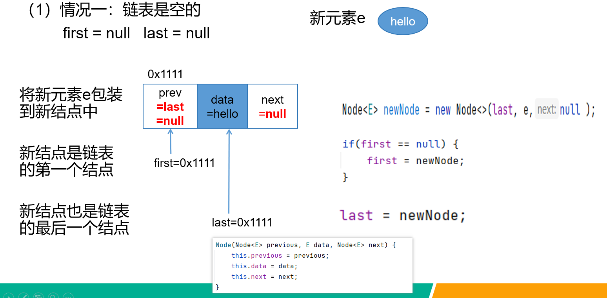

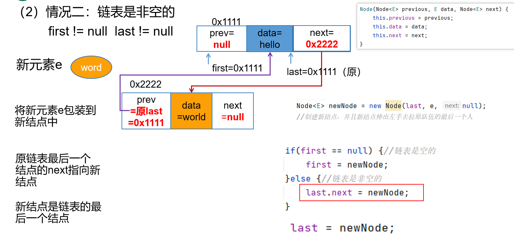


#### 3、遍历

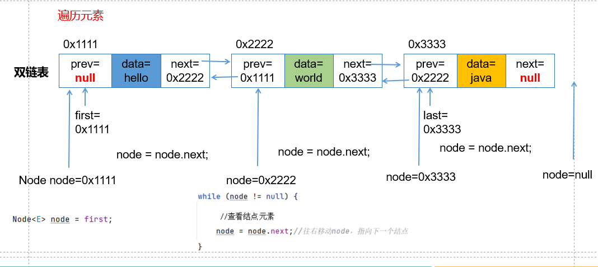


#### 4、删除

（1）没找到

（2）找到了，在中间

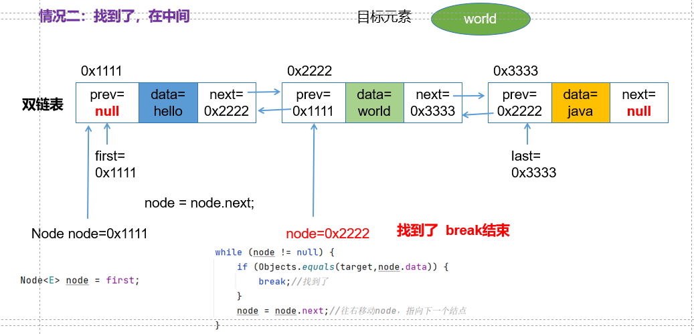

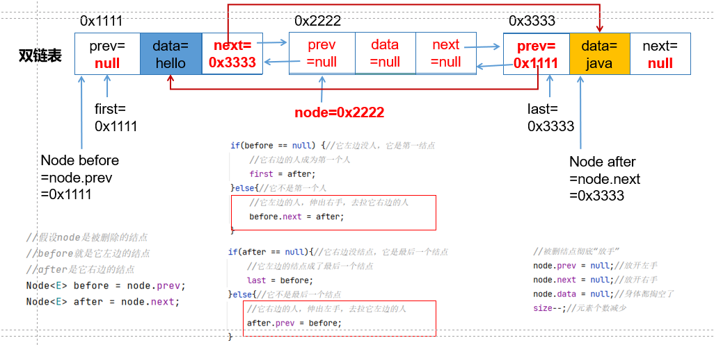

（3）找到了，在第一个

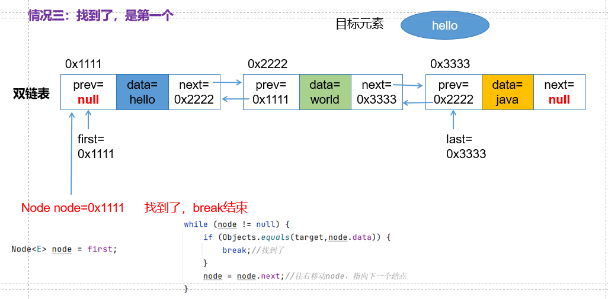

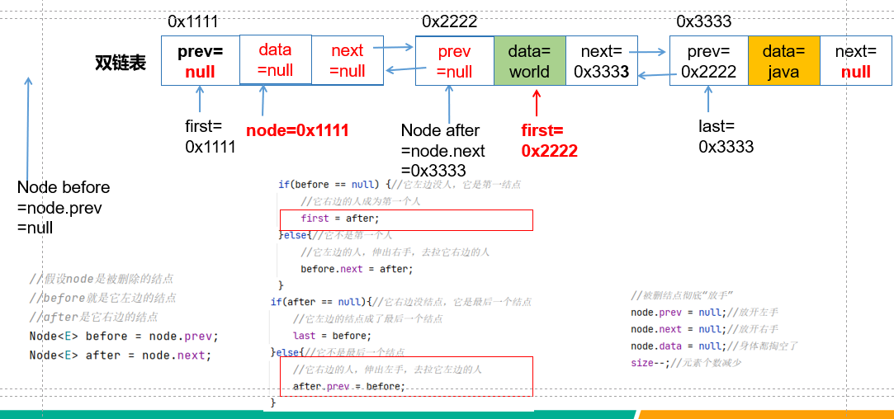

（4）找到了，最后一个

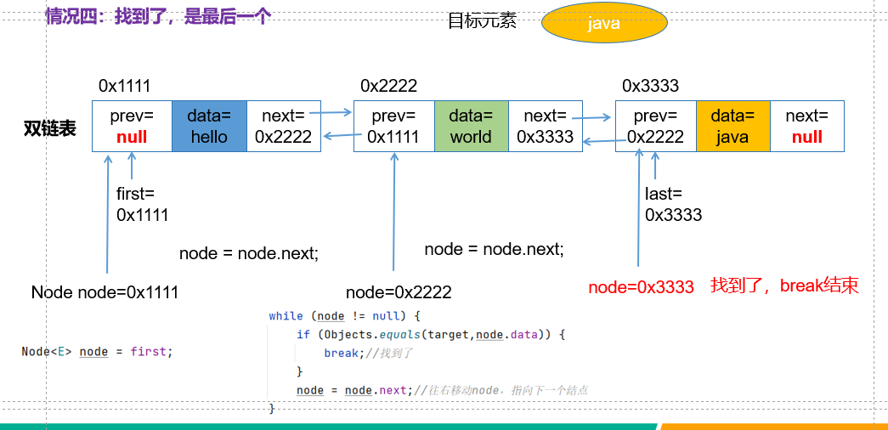

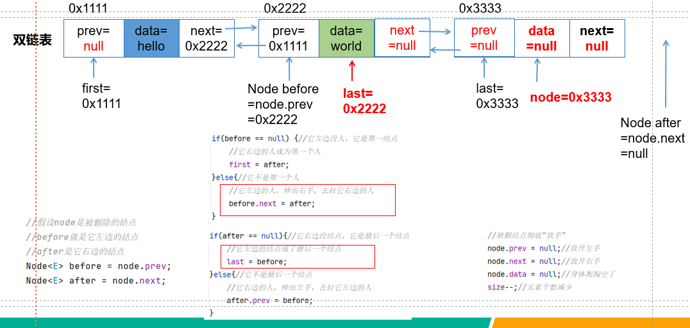

#### 5、示例代码

```java
package com.atguigu.list;

import java.util.Objects;
import java.util.StringJoiner;

public class MyLinkedList<E> {
    private Node<E> first;//用于记录双向链表的头结点的地址，默认值是null
    private Node<E> last;//用于记录双向链表的尾结点的地址，默认值是null
    private int size;//记录双向链表中结点的数量，同时就是元素个数

    public void add(E e){//把新结点添加到链表的最后
        //（1）创建新结点，把e包装到新结点中
        Node<E> newNode = new Node<>(last,e,null);
        /*
        Node(last,e, null)
        last代表链表原来的最后一点，它将会是新结点的前一个结点，所以新结点的previous等于它
        这里null是因为新结点后面没有其他结点了
         */
        //（2）分情况讨论
        if(first == null){//说明链表是空的   或 if(last == null) 或 if(size==0)
            first = newNode;//新结点成了链表的第一个结点
        }else{//说明链表是非空的
            last.next = newNode; //链表原来的最后一个结点，需要指向新结点
        }

        last = newNode;//新结点成了链表的最后一个结点

        //元素或结点个数+1
        size++;
    }

    public void remove(Object target){
        //找到target对应的结点
        Node<E> node = findNode(target);
        if(node == null){
            return;//结束remove，不删除
        }
        Node<E> before = node.previous;
        Node<E> after = node.next;

        if(before == null){//被删除结点node是第一个结点
            first = after;
        }else{
            before.next = after;
        }

        if(after == null){//被删除结点node是最后一个结点
            last = before;
        }else{
            after.previous = before;
        }

        //元素个数减少
        size--;
    }

    private Node<E> findNode(Object target){
        Node<E> node = first;
        while(node != null){
            if(Objects.equals(node.data, target)){
                break;
            }
            node = node.next;
        }
        return node;//如果没找到,node=null，如果找到了，node是目标结点的地址
    }


    public String toString(){
        //拼接所有结点的data，返回
        StringJoiner joiner = new StringJoiner(",","[","]");
        Node<E> node = first;
        while(node!= null){
            joiner.add(node.data+"");
            node = node.next;//让node往右移动
        }

        return joiner.toString();
    }


    //内部类，静态成员内部类，因为在Node内部类中，没有用到外部类MyLinkedList的任何非静态成员
    private static class Node<E>{
        Node<E> previous;//记录前一个结点的地址
        E data;
        Node<E> next;//记录下一个结点的地址

        Node(Node<E> previous, E data, Node<E> next) {
            this.previous = previous;
            this.data = data;
            this.next = next;
        }
    }
}

```

```java
package com.atguigu.list;

import org.junit.Test;

public class TestMyLinkedList {
    @Test
    public void test1(){
        MyLinkedList<String> list = new MyLinkedList<>();
        list.add("hello");
        list.add("world");
        list.add("java");
        list.add("atguigu");
        list.add("chai");
        System.out.println(list);

        list.remove("java");
        System.out.println(list);

        list.remove("hello");
        System.out.println(list);

        list.remove("chai");
        System.out.println(list);

        list.remove("world");
        System.out.println(list);

        list.remove("atguigu");
        System.out.println(list);
    }
}

```


### 1.2.3 核心类库LinkedList的部分源码

结点的内部类：

```java
    private static class Node<E> {
        E item; //结点的元素
        Node<E> next;//下一个结点
        Node<E> prev;//上一个结点

        Node(Node<E> prev, E element, Node<E> next) {
            this.item = element;
            this.next = next;
            this.prev = prev;
        }
    }
```

双向链表的成员变量：

```java
int size = 0;
Node<E> first;
Node<E> last;
```

添加方法：

```java
    public boolean add(E e) {
        linkLast(e); //连接到链表的最后
        return true;
    }
    void linkLast(E e) {
        final Node<E> l = last; //l代表原链表的最后一个结点
        final Node<E> newNode = new Node<>(l, e, null); //创建新结点，并且新结点的prev指向原链表的最后一个结点
        												//新结点的next是null，没有下一个结点
        last = newNode;//链表的最后一个结点是新结点
        if (l == null) // 原链表为空
            first = newNode; //新结点成了链表的第一个结点
        else  //原链表非空
            l.next = newNode; //原链表的最后一个结点的next指向新结点
        size++; //元素个数增加
        modCount++;
    }
```

删除方法：

```java
public boolean remove(Object o) {
        if (o == null) {
            for (Node<E> x = first; x != null; x = x.next) { //循环是在查找o对应的结点
                if (x.item == null) {
                    unlink(x); //x是要被删除的结点，unlink断开x结点与当前链表的关系
                    return true;
                }
            }
        } else {
            for (Node<E> x = first; x != null; x = x.next) {//循环是在查找o对应的结点
                if (o.equals(x.item)) {
                    unlink(x);
                    return true;
                }
            }
        }
        return false;
    }
 	E unlink(Node<E> x) {
        // assert x != null;
        final E element = x.item;
        final Node<E> next = x.next;
        final Node<E> prev = x.prev;

        if (prev == null) { //被删除结点是第一个结点
            first = next;
        } else {
            prev.next = next; //让被删除结点的前一个结点的next指向被删除结点的下一个结点
            x.prev = null; //清空x结点的prev值
        }

        if (next == null) { //被删除结点是最后一个结点
            last = prev;
        } else {
            next.prev = prev; //让被删除结点的下一个结点的prev指向被删除结点的上一个结点
            x.next = null;//清空x结点的next值
        }

        x.item = null;//清空x结点的item值
        size--;//元素个数减少
        modCount++;
        return element;
    }
```

根据下标查询：

```java
    public E get(int index) { //index是下标
        checkElementIndex(index); //检查index的合法性，应该在[0,size-1]
        return node(index).item;
        //node(index)返回index对应的结点
        // node(index).item 返回这个结点的元素
    }

	Node<E> node(int index) {//index是下标
        // assert isElementIndex(index);
		//size>>1等价于 size/2
        //index < size/2，表示目标在链表的左半边
        if (index < (size >> 1)) {
            Node<E> x = first; //从头开始找
            for (int i = 0; i < index; i++)//退出循环 i == index
                x = x.next;
            return x; //x就是 index对应的结点
        } else { //表示目标在链表的右半边
            Node<E> x = last;//从尾开始找
            for (int i = size - 1; i > index; i--) //退出循环 i == index
                x = x.prev;
            return x; //x就是 index对应的结点
        }
    }
```

## 我自己的双向链表（带改正前后对比代码）

```java
package day_17.MyLinkedList;

import java.util.Objects;
import java.util.StringJoiner;

public class MyLinkedList<E> {
    private Node<E> first;//用于记录双向链表的头结点的地址，默认值是null
    private Node<E> last;//用于记录双向链表的尾结点的地址，默认值是null
    private int size;//记录双向链表中结点的数量，同时就是元素个数

    //添加内部类 ,静态成员内部类，因为在Node内部类中，没有用到外部类MyLinkedList的任何非静态成员
    private static class Node<E>{
        Node<E> previous;//记录前一个结点的地址
        E data;
        Node<E> next;//记录下一个结点的地址

        Node(Node<E> previous, E data, Node<E> next) {
            this.previous = previous;
            this.data = data;
            this.next = next;
        }
    }

    public void add(E e){//新增节点
        //直接从last后面开始新增，不管链表中原本有没有节点，都是可以使用的(原本没有节点的last是null)
        Node<E> newNode = new Node<>(last,e,null);
/*
前向连接 ： newNode.prev = last （在构造函数中完成）
后向连接 ： last.next = newNode （在else分支中完成）
指针更新 ： last = newNode （确保后续添加操作基于新的尾节点）
### 3. 为什么需要双向连接？
如果只设置 newNode.prev = last ，而不设置 last.next = newNode ：

- 新节点知道自己的前一个节点是last ，但
- last不知道自己的后一个节点是newNode
这会导致：

- 从 first 开始遍历链表时，无法到达 newNode （因为 last.next 仍然是 null ）
- 链表结构不完整，新节点实际上 未被整合到链表中
* */
       if(first == null){
           first = newNode; //如果原来不存在首节点，那么新增的节点就是链表的首节点，这样直接操作赋值的是地址
       }else{
           last.next = newNode;//添加的方式，尾插的方式就是直接在其last的下一位的地址改为该节点的地址实现添加到链表中
       }
        last = newNode;//新结点成了链表的最后一个结点
        //元素或结点个数+1
        size++;
    }

/*    public Node<E> findNode(Object o){//查找
    if (o == null) {
        //System.out.println("查询的对象为null");
        return null;
    }else{
        Node<E> myNode =first; //这个时候直接从第一个的地址给创建的新对象，然后按照顺序往后走
        while (myNode.next != null){//链表不是空的或则不是最后一个节点
            if ( !myNode.equals(o)){
            - myNode 是 Node 类型（节点对象）， o 是传入的目标对象。实际比较 ：比较的是 Node 实例和目标对象，而不是 节点中存储的数据 和目标对象。
                myNode = myNode.next;//一个链表中，节点的next就是下一个节点的地址，这里作为一个新对象，也就等于是变为了下一个节点
                break;
            }
        }
        return myNode;//如果没找到,node=null，如果找到了，node是目标结点的地址
    }
### 空值处理错误
- 错误原因 ：当 o == null 时直接返回 null ，但实际上应该允许查找 null 元素。
- 正确做法 ：当 o == null 时，比较 myNode.data == null
}*/

    public Node<E> findNode(Object o){
        Node<E> current = first;
        while (current != null) {
            // 处理 null 值的情况
            if (o == null ? current.data == null : Objects.equals(o,current.data)) {
                return current; // 找到节点，返回
            }
            current = current.next; // 移动到下一个节点
        }
        return null; // 遍历完整个链表，未找到节点
    }

/*    public void remove(Object o){ //自己写的方法
        if(o == null){
            System.out.println("输入错误");
            return;  //直接结束方法
        }else{
            Node<E> myNode = findNode(o);
            //删除一个节点，将该节点对应的上一个节点的next改为下一个节点的地址，将该节点下一个节点的previous改为此节点上一个节点的地址即可
            myNode.previous.next = myNode.next;
            myNode.next.previous = myNode.previous;
            //直接这样做的不足之处在于，只是从这个链表中删除了节点，但对于链表原本的完整没有做检查和维护
        }
        //元素个数减少
        size--;

### 空指针异常风险
- 问题 ：当删除的是 头节点 时， myNode.previous 为 null ，执行 myNode.previous.next 会抛出 NullPointerException
- 问题 ：当删除的是 尾节点 时， myNode.next 为 null ，执行 myNode.next.previous 会抛出 NullPointerException
- 问题 ：当 findNode(o) 返回 null （未找到节点）时，执行 myNode.previous 会抛出 NullPointerException
- 问题 ：删除头节点后， first 指针仍指向被删除的节点
- 问题 ：删除尾节点后， last 指针仍指向被删除的节点
- 影响 ：后续操作（如遍历、添加新节点）会出错
- 问题 ：当 o == null 时直接返回，不符合Java集合的惯例（ LinkedList 允许删除 null 元素）
- 问题 ：未找到节点时没有任何提示或处理
### 内存泄漏风险
- 问题 ：被删除节点的 prev 和 next 引用未置为 null ，可能导致垃圾回收延迟
    }*/

    public boolean remove(Object o){
        // 找到目标节点
        Node<E> myNode = findNode(o);
        // 未找到节点，返回false
        if (myNode == null) {
            return false;
        }
        // 处理头节点删除
        if (myNode == first) {
            first = myNode.next;
            // 如果删除后链表不为空，更新新头节点的prev为null
            if (first != null) {
                first.previous = null;
            }
        } else {
            // 非头节点，更新前一个节点的next
            myNode.previous.next = myNode.next;
        }
        // 处理尾节点删除
        if (myNode == last) {
            last = myNode.previous;
            // 如果删除后链表不为空，更新新尾节点的next为null
            if (last != null) {
                last.next = null;
            }
        } else {
            // 非尾节点，更新后一个节点的prev
            if (myNode.next != null) {
                myNode.next.previous = myNode.previous;
            }
        }
        // 清空被删除节点的引用，避免内存泄漏
        myNode.previous = null;
        myNode.next = null;
        // 元素个数减少
        size--;
        return true;
    }

    @Override
    public String toString(){
        //拼接所有结点的data，返回
        StringJoiner joiner = new StringJoiner(",","[","]");
        Node<E> node = first;
        while(node!= null){
            joiner.add(node.data+"");
            node = node.next;//让node往右移动
        }

        return joiner.toString();
    }
}

```

