# 二、迭代器


迭代：循环遍历的意思。遍历：挨个查看元素的行为。

迭代器：遍历集合元素的工具。

迭代器是为Collection系列的集合服务的。Map系列的集合通常要通过 keySet、values 、entrySet方法转换为Collection系列的集合再遍历。

## 2.1 Iterator接口

Collection系列的集合的底层实现各不相同，有数组、链表等，具体的遍历细节肯定不相同，但是Java为了统一标准，为所有Collection系列的集合设计了统一的迭代器的接口java.util.Iterator。

这个接口有2个抽象方法：

- boolean hasNext()：判断是否还有元素可迭代
- E next()：取出迭代器当前位置的元素，然后让迭代器走向下一个元素。

```java
package com.atguigu.iter;

import org.junit.Test;

import java.util.*;

public class TestIterator {
    @Test
    public void test1(){
        ArrayList<String> list = new ArrayList<>();
        Collections.addAll(list, "hello","java","world");

        //这里方法是Collection接口提供的
        Iterator<String> iterator = list.iterator();//这句代码可以得到一个迭代器对象
        while(iterator.hasNext()){
            String s = iterator.next();
            System.out.println(s);
        }
    }

    @Test
    public void test2(){
        HashSet<String> set = new HashSet<>();
        Collections.addAll(set, "hello","java","world");
        //这里方法是Collection接口提供的
        Iterator<String> iterator = set.iterator();//这句代码可以得到一个迭代器对象
        while(iterator.hasNext()){
            String s = iterator.next();
            System.out.println(s);
        }
    }

    @Test
    public void test3(){
        HashMap<Integer, String> map = new HashMap<>();
        map.put(1,"hello");
        map.put(2,"world");
        map.put(3,"java");

        Set<Map.Entry<Integer, String>> entries = map.entrySet();
        Iterator<Map.Entry<Integer, String>> iterator = entries.iterator();
        while(iterator.hasNext()){
            Map.Entry<Integer, String> s = iterator.next();
            System.out.println(s);
        }
    }
}

```


## 2.2 foreach循环与Iterator有什么关系？

foreach循环是一种语法糖。

> 语法糖（Syntactic Sugar）是指在编程语言中添加的某种语法，这种语法本身不会增加语言的功能，但是可以使程序更加简洁易读，减少编写代码时的重复工作。语法糖通常是为了提高开发效率和代码可读性而设计的。

foreach在遍历数组时，其实本质上仍然普通for循环。

foreach在遍历集合时，其实本质上仍然迭代器。

```java
package com.atguigu.iter;

import org.junit.Test;

import java.util.ArrayList;
import java.util.Collections;

public class TestForeach {
    @Test
    public void test(){
        int[] arr = {10,20,30,40};
        for (int num : arr) {
            System.out.println(num);
        }
    }

    @Test
    public void test2(){
        ArrayList<String> list = new ArrayList<>();
        Collections.addAll(list, "hello","java","world");

        for (String s : list) {
            System.out.println(s);
        }
    }
}

```


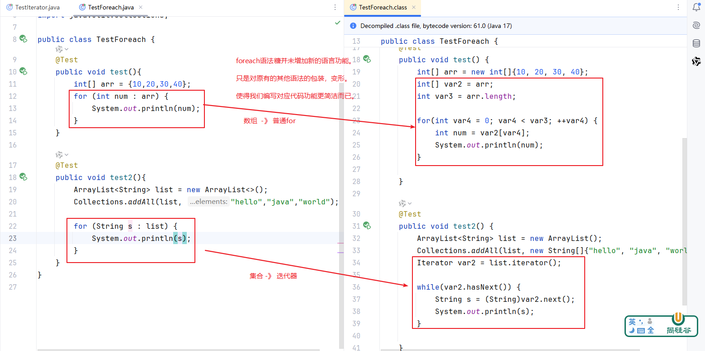


## 2.3 Iterable接口

```java
Comparable VS Comparator
Iterable   VS Iterator
形容词      VS 名词
    
Comparable：是要比较大小的元素类自己实现的。 Comparator：是需要单独一个类（有名字，或匿名）来实现它。
Iterable：需要被遍历的集合自己实现的（一般就是集合通过内部类的方式实现）。这里就是所有Collection系列的集合实现。 Iterator：是需要单独一个类（有名字，或匿名）来实现它。 
```

凡是实现Iterable接口的集合，都可以使用foreach循环进行遍历，本质上都是使用Iterator进行遍历。在这些集合内部都会有一个单独的类，来实现Iterator接口。

例如：ArrayList 实现了 Iterable接口，所以它支持foreach循环。 ArrayList的内部类有一个内部类 Itr ，它实现Iterator接口。

例如：HashSet 实现了 Iterable接口，所以它支持foreach循环。HashSet 的内部本质上是HashMap，HashMap类有一个内部类KeyIterator ，它实现Iterator接口。


> 思考：我们上午写的MyArrayList，和MyLinkedList 集合，它们是模仿ArrayList和LinkedList，能不能直接使用foreach循环遍历呢？
>
> 如果没有实现Iterable接口，就不支持。实现了Iterable接口，就支持。
>
> 实现Iterable接口，就要重写 Iterator iterator()方法，以便可以获取到Iterator的对象。


### 案例1：MyArrayList实现Iterable接口

```java
public class MyArrayList<E>  implements Iterable<E>{
    private Object[] elementData = new Object[5];//先初始化为长度5的数组，后续不够了再扩容
    private int size;//记录实际存储的元素的个数  正常来说 size <= elementData.length
    
    //中间省略了很多代码，请看 $1.1.1小节
    
        @Override
    public Iterator<E> iterator() {
        return new MyItr<E>();
        //创建的是迭代器MyItr的对象
        //MyItr是Iterator接口的实现类
    }

    private class MyItr<E> implements Iterator<E>{
        int index;//代表下标，默认值是0

        @Override
        public boolean hasNext() {
            return index<size;
        }

        @Override
        public E next() {
            return (E) elementData[index++];
        }
    }
}
```

### 案例2：MyLinkedList 实现Iterable接口

```java
public class MyLinkedList<E> implements Iterable<E> {
    private Node<E> first;//用于记录双向链表的头结点的地址，默认值是null
    private Node<E> last;//用于记录双向链表的尾结点的地址，默认值是null
    private int size;//记录双向链表中结点的数量，同时就是元素个数
    
    //省略了一些方法，请看$1.2.2小节

	@Override
    public Iterator<E> iterator() {
        return new MyItr();
        //创建的是迭代器MyItr的对象
        //MyItr是Iterator接口的实现类
    }

    private class MyItr implements Iterator<E>{
        Node<E> node = first;//默认指向第一个结点

        @Override
        public boolean hasNext() {
            return node!=null;
        }

        @Override
        public E next() {
            E element = node.data;
            node = node.next;
            return element;
        }
    }
}

```

### 原理

```java
package day_17.迭代器;

import day_17.MyLinkedList.MyLinkedList;

import java.util.Iterator;
import java.util.Objects;
import java.util.StringJoiner;

public class MyLinkedList_Iterator<E> implements Iterable<E>{
    private Node<E> first;//用于记录双向链表的头结点的地址，默认值是null
    private Node<E> last;//用于记录双向链表的尾结点的地址，默认值是null
    private int size;//记录双向链表中结点的数量，同时就是元素个数

    private static class Node<E>{
        MyLinkedList_Iterator.Node<E> previous;//记录前一个结点的地址
        E data;
        MyLinkedList_Iterator.Node<E> next;//记录下一个结点的地址

        Node(MyLinkedList_Iterator.Node<E> previous, E data, MyLinkedList_Iterator.Node<E> next) {
            this.previous = previous;
            this.data = data;
            this.next = next;
        }
    }

/*    public class MyLinkedListIterator<E>  implements Iterator<E>{
        int index;

        @Override
        public boolean hasNext() {
            return index < size;  //链表中还有没有元素存在
        }

        @Override
        public E next() {
            return null;
        }
    }*/

    // 移除内部类的泛型参数（使用外部类的泛型）
    public class MyLinkedListIterator implements Iterator<E> {
        private Node<E> current; // 当前迭代节点
        private int index; // 当前迭代索引

        // 构造方法，从首节点开始迭代
        public MyLinkedListIterator() {
            this.current = first;
            this.index = 0;
        }

        @Override
        public boolean hasNext() {
            return index < size; // 还有元素未遍历
        }

        @Override
        public E next() {
            if (!hasNext()) {
                throw new java.util.NoSuchElementException();
            }
            E data = current.data; // 获取当前节点数据
            current = current.next; // 移动到下一个节点
            index++; // 索引递增
            return data; // 返回当前元素
        }
    }

   public void add(E e){
       MyLinkedList_Iterator.Node<E> newNode = new MyLinkedList_Iterator.Node<>(last,e,null);
       if(first == null){
           first = newNode; //如果原来不存在首节点，那么新增的节点就是链表的首节点，这样直接操作赋值的是地址
       }else{
           last.next = newNode;//添加的方式，尾插的方式就是直接在其last的下一位的地址改为该节点的地址实现添加到链表中
       }
       last = newNode;//新结点成了链表的最后一个结点
       //元素或结点个数+1
       size++;
   }

   public Node<E> findNode(Object o){
       MyLinkedList_Iterator.Node<E> current = first;
       while(current!=null){
           // 处理 null 值的情况
           if (o == null ? current.data == null : Objects.equals(o,current.data)) {
               return current; // 找到节点，返回
           }
           current = current.next; // 移动到下一个节点
       }
       return null;
   }

    public boolean remove(Object o){
        // 找到目标节点
        MyLinkedList_Iterator.Node<E> myNode = findNode(o);
        // 未找到节点，返回false
        if (myNode == null) {
            return false;
        }
        // 处理头节点删除
        if (myNode == first) {
            first = myNode.next;
            // 如果删除后链表不为空，更新新头节点的prev为null
            if (first != null) {
                first.previous = null;
            }
        } else {
            // 非头节点，更新前一个节点的next
            myNode.previous.next = myNode.next;
        }
        // 处理尾节点删除
        if (myNode == last) {
            last = myNode.previous;
            // 如果删除后链表不为空，更新新尾节点的next为null
            if (last != null) {
                last.next = null;
            }
        } else {
            // 非尾节点，更新后一个节点的prev
            if (myNode.next != null) {
                myNode.next.previous = myNode.previous;
            }
        }
        // 清空被删除节点的引用，避免内存泄漏
        myNode.previous = null;
        myNode.next = null;
        // 元素个数减少
        size--;
        return true;
    }

    @Override
    public String toString() {
        //拼接所有结点的data，返回
        StringJoiner joiner = new StringJoiner(",","[","]");
        MyLinkedList_Iterator.Node<E> node = first;
        while(node!= null){
            joiner.add(node.data+"");
            node = node.next;//让node往右移动
        }

        return joiner.toString();
    }

    @Override
    public Iterator<E> iterator() {
        return new MyLinkedListIterator();
    }
}

```

```java
package day_17.迭代器;

import org.junit.Test;

public class TestMyLinledList {

    @Test
    public void test1() {
        MyLinkedList_Iterator<String> myLinkedListIterator = new MyLinkedList_Iterator<>();
        myLinkedListIterator.add("1 - 1");
        myLinkedListIterator.add("1 - 2");
        myLinkedListIterator.add("1 - 3");
        myLinkedListIterator.add("1 - 4");
        myLinkedListIterator.add("1 - 5");

        for (String str : myLinkedListIterator) {
            //str = str.trim();
            System.out.print(str);
        }
    }
}

```

```java
// 原始代码
for (String str : myLinkedListIterator) {
    System.out.println(str);
}

// 编译器转换后的代码
Iterator<String> iterator = myLinkedListIterator.iterator();
//是调用myLinkedListIterator对象中的iterator()方法创建了一个迭代器的对象iterator
//iterator()方法是返回一个新的MyLinkedListIterator()方法，也就是构造器来创建iterator对象

while (iterator.hasNext()) {
    String str = iterator.next();
    System.out.println(str);
}
```

对于链表来说，传统 for 循环通常需要通过 get(int index) 方法获取元素，但链表的 get 操作时间复杂度是 O(n)，效率较低。所以使用迭代器的forEach效率更高


## 2.4  列表迭代器ListIterator

列表是指所有的List系列的集合，与Set、Map等无关。

ListIterator是Iterator的子接口。但是，它比Iterator功能更强大。它在遍历List集合的时候：

- 可以实现从头到尾遍历，也可以实现从尾到头遍历
- 在遍历时，可以获取元素的下标
- 在遍历时，可以实现增、删、改、查

```java
package com.atguigu.iter;

import org.junit.Test;

import java.util.ArrayList;
import java.util.Collections;
import java.util.ListIterator;

public class TestListIterator {
    @Test
    public void test1(){
        ArrayList<String> list = new ArrayList<>();
        Collections.addAll(list, "hello","java","world");

        //演示从头到尾遍历
        ListIterator<String> listIterator = list.listIterator();
        while(listIterator.hasNext()){
            String s = listIterator.next();
            System.out.println(s);
        }
    }
    @Test
    public void test2(){
        ArrayList<String> list = new ArrayList<>();
        Collections.addAll(list, "hello","java","world");

        //演示从尾到头遍历
        ListIterator<String> listIterator = list.listIterator(list.size());
        //迭代器一开始 [size]位置，第一次previous()取[size-1]位置的元素
        while(listIterator.hasPrevious()){//判断前面还有没有元素可迭代器
            String s = listIterator.previous();//previous取迭代器当前位置的前一个位置的元素
            System.out.println(s);
        }
    }

    @Test
    public void test3(){
        ArrayList<String> list = new ArrayList<>();
        Collections.addAll(list, "hello","java","world");

        //演示从头到尾遍历，取下标
        ListIterator<String> listIterator = list.listIterator();
        while(listIterator.hasNext()){
            int index1 = listIterator.nextIndex();
            String s = listIterator.next();
            int index2 = listIterator.nextIndex();
            System.out.println("next()方法之前：index1 = " + index1);
            System.out.println(s);
            System.out.println("next()方法之后：index2 = " + index2);
            System.out.println();
        }
    }

    @Test
    public void test4(){
        ArrayList<String> list = new ArrayList<>();
        Collections.addAll(list, "hello","java","world");

        //演示从尾到头遍历
        ListIterator<String> listIterator = list.listIterator(list.size());
        //迭代器一开始 [size]位置，第一次previous()取[size-1]位置的元素
        while(listIterator.hasPrevious()){//判断前面还有没有元素可迭代器
            //查看接口的实现类重写接口方法previousIndex的源码，按快捷键Ctrl + Alt + B，然后选择接口的实现类
            int index1 = listIterator.previousIndex(); //previousIndex返回的是当前迭代器位置-1
            String s = listIterator.previous();//previous取迭代器当前位置的前一个位置的元素
            int index2 = listIterator.previousIndex();
            System.out.println("previous()方法之前：index1 = " + index1);
            System.out.println(s);
            System.out.println("previous()方法之后：index2 = " + index2);
            System.out.println();
        }

    }

    @Test
    public void test5(){
        ArrayList<String> list = new ArrayList<>();
        Collections.addAll(list, "hello","java","world","chai");

        //在所有包含"a"字母的单词后面添加一个“尚硅谷”
        //演示从头到尾遍历
        ListIterator<String> listIterator = list.listIterator();
        while(listIterator.hasNext()){
            String s = listIterator.next();
            if(s.contains("a")){//这里contains是String类的方法
                listIterator.add("尚硅谷");//迭代器的add方法，不是集合的add方法
            }
        }

        //再次查看结果
        System.out.println(list);//[hello, java, 尚硅谷, world, chai, 尚硅谷]
    }


    @Test
    public void test6(){
        ArrayList<String> list = new ArrayList<>();
        Collections.addAll(list, "hello","java","world","chai");

        //在所有包含"a"字母的单词后面添加一个“尚硅谷”
        //演示从尾到头遍历
        ListIterator<String> listIterator = list.listIterator(list.size());
        //迭代器一开始 [size]位置，第一次previous()取[size-1]位置的元素
        while(listIterator.hasPrevious()){//判断前面还有没有元素可迭代器
            String s = listIterator.previous();//previous取迭代器当前位置的前一个位置的元素
            if(s.contains("a")){
                listIterator.add("尚硅谷");//迭代器的add方法，不是集合的add方法
            }
        }

        //再次查看结果
        System.out.println(list);//[hello, 尚硅谷, java, world, 尚硅谷, chai]
    }

    @Test
    public void test7(){
        ArrayList<String> list = new ArrayList<>();
        Collections.addAll(list, "hello","java","world","chai");

        //把所有包含"a"字母的单词改为大写
        //演示从头到尾遍历
        ListIterator<String> listIterator = list.listIterator();
        while(listIterator.hasNext()){
            String s = listIterator.next();
            if(s.contains("a")){//这里contains是String类的方法
                listIterator.set(s.toUpperCase());//迭代器的set方法，不是集合的set方法
            }
        }

        //再次查看结果
        System.out.println(list);//[hello, JAVA, world, CHAI]
    }

    @Test
    public void test8(){
        ArrayList<String> list = new ArrayList<>();
        Collections.addAll(list, "hello","java","world","chai");

        //删除所有包含"a"字母的单词
        //演示从头到尾遍历
        ListIterator<String> listIterator = list.listIterator();
        while(listIterator.hasNext()){
            String s = listIterator.next();
            if(s.contains("a")){//这里contains是String类的方法
                listIterator.remove();//迭代器的remove方法，不是集合的remove方法
            }
        }

        //再次查看结果
        System.out.println(list);//[hello, world]
    }
}

```

## 2.5 答疑

```java
package com.atguigu.iter;

import org.junit.Test;

import java.util.*;

public class TestAsk {
    @Test
    public void test1(){
        ArrayList<String> list = new ArrayList<>();
        Collections.addAll(list, "hello","world","java","chailinyan");

        Iterator<String> iterator = list.iterator();
        while(iterator.hasNext()){
            //方法不调用不执行，调用一次执行一次
            //下面调用了2次next()方法，每一次next都会取出当前迭代器位置的元素，然后迭代器往右移动一下
            System.out.println(iterator.next() +"的长度" + iterator.next().length());//错误
        }
        /*
                System.out.println(hello +"的长度" + world.length());
                System.out.println(java +"的长度" + chailinyan.length());
         */
    }

    @Test
    public void test2(){
        HashMap<Integer, String> map = new HashMap<>();
        map.put(1,"hello");
        map.put(2,"world");
        map.put(3,"java");

        /*
        Map接口及其实现类，都没有实现Iterable接口，因此不能对Map及其实现类，直接使用foreach循环和Iterator迭代器进行遍历。
        只能将Map先转为Collection系列的集合。通过（1）keySet（2）values（3）entrySet方法转换
        Map与Collection类型无父子类关系，怎么能转换呢？
        因为这里的转换，不是强制类型转换。而是将元素重新组装到新的集合类型中。
         */
        Set<Map.Entry<Integer, String>> entries = map.entrySet();
        Iterator<Map.Entry<Integer, String>> iterator = entries.iterator();
        while(iterator.hasNext()){
            //现在Set中元素的类型是 Map.Entry类型，它有2个属性，属性的类型分别是Integer和String
            Map.Entry<Integer, String> s = iterator.next();
            System.out.println(s);
        }
    }
}

```

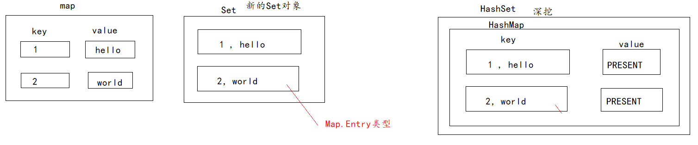


## 2.6 foreach或迭代器遍历过程中调用`集合`的add和remove问题

> 问：遍历Collection系列集合有更简便的foreach循环，为什么还要将Iterator？
>
> 原因：（1）foreach本质上还是Iterator
>
> ​		     （2）少量集合方法的源码中，使用的是Iterator
>
> ​			（3）面试题中，出现了一种新的面试题，如本节标题

当我们在foreach或迭代器遍历集合的过程中，如果调用了集合的add、remove、sort等会影响集合元素个数，元素顺序的方法时，都会`有风险`，要么出现漏删，要么出现ConcurrentModificationException并发修改异常。Java中的集合设计这个`“快速失败”机制`就是为了预防不确定的问题。

设计思路是给集合增加了一个`modCount`的变量，它时刻记录集合元素个数，元素顺序发生的次数，`每变一次，modCount就+1`。迭代器遍历集合的过程中，会时刻检查modCount是否发生变化，如果是通过迭代器的add、remove等方法操作的集合，它会及时同步 modCount 和expectedModCount的值。如果通过集合的add、remove等方法，那么迭代器就无法实现同步，就会`尽快`抛出ConcurrentModificationException异常实现快速失败。

> 结论：
>
> 千万`不要在foreach或迭代器遍历过程`中调用`集合`的add和remove等方法。
>
> 建议：
>
> 如果你要根据条件删除，JDK8之后请用 removeIf方法。
>
> 如果你要在遍历过程中添加，当然这个仅限于列表集合，那么只能使用迭代器的add方法。

```java
package com.atguigu.iter;

import org.junit.Test;

import java.util.ArrayList;
import java.util.Collections;
import java.util.Iterator;

public class TestProblem {
    @Test
    public void test1(){
        ArrayList<String> list = new ArrayList<>();
        Collections.addAll(list, "hello","world","java");

        Iterator<String> iterator = list.iterator();
        while(iterator.hasNext()){
            String s = iterator.next();
            if(s.contains("o")){//删除包含"o"字母的元素
                iterator.remove();
            }
        }
        System.out.println(list);//[java]  正确
    }

    @Test
    public void test2(){
        ArrayList<String> list = new ArrayList<>();
        Collections.addAll(list, "hello","world");

        Iterator<String> iterator = list.iterator();
        while(iterator.hasNext()){
            String s = iterator.next();
            if(s.contains("o")){//删除包含"o"字母的元素
                list.remove(s);
            }
        }
        System.out.println(list);//[world] 漏删
    }

    @Test
    public void test3(){
        ArrayList<String> list = new ArrayList<>();
        Collections.addAll(list, "hello","world","java");
        Iterator<String> iterator = list.iterator();
        while(iterator.hasNext()){
            String s = iterator.next();
            if(s.contains("o")){
                list.remove(s);//报错
            }
        }
    }

    @Test
    public void test4(){
        ArrayList<String> list = new ArrayList<>();
        Collections.addAll(list, "hello","world","java");
        for (String s : list) {
            if(s.contains("o")){
                list.remove(s);//报错
            }
        }
    }
}

```


迭代器快速失败机制分析：

```java
ArrayList集合的相关变量：
Object[]  elementData ：数组，用于存储元素
int size：用于记录元素个数
int modCount：主要用于记录元素个数变化次数，添加或删除元素等都会使得modCount值++
sort和replaceAll方法也会使得modCount++，因为这两个方法会使得元素顺序或元素值发生大变化，导致未遍历过的元素跑到迭代器已遍历过的位置上去，或已遍历过的元素值发生修改
    
ArrayList内部类Itr的相关变量：
int cursor：迭代器当前游标值，即迭代器当前指向elementData元素的下标值
int lastRet：迭代器刚刚访问过的元素下标值，如果迭代器还未访问过元素，或者刚刚访问过的元素已被删除，那么它的值为-1，表示该元素不存在了。
int exepectedModCount：迭代器“预计的”modCount值，它应该与ArrayList的modCount值相等，否则就说明集合在迭代器之外修改了集合，对集合做了添加或删除元素操作。
```

### 1、正确

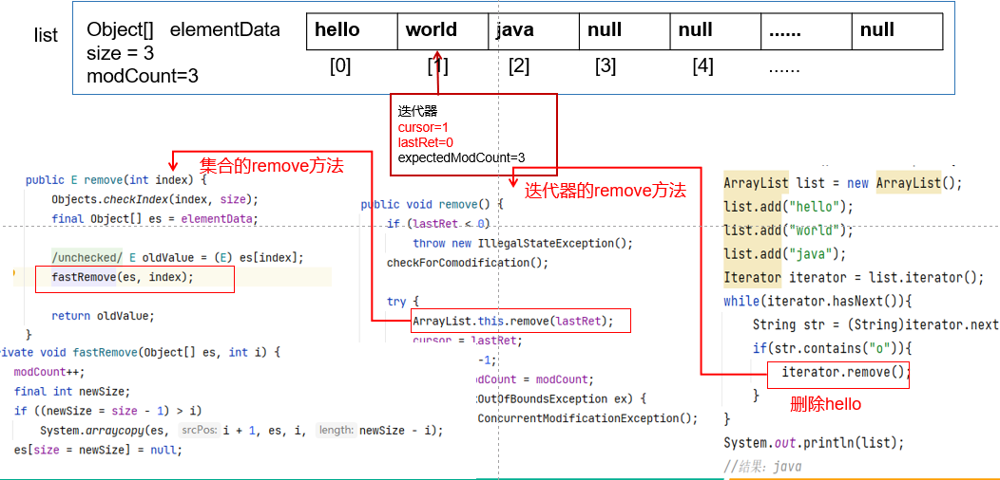

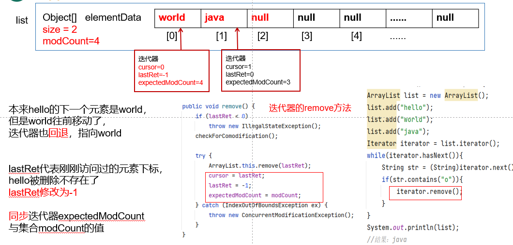

### 2、漏删


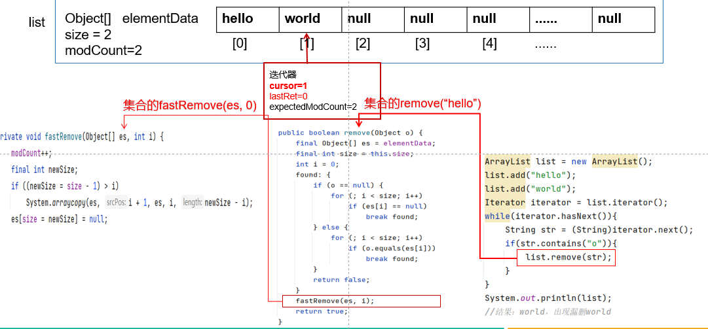

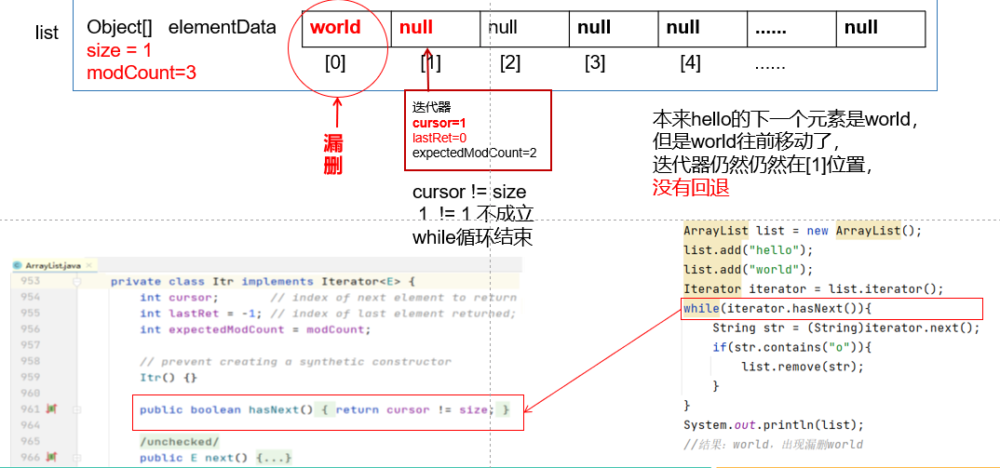

### 3、抛异常


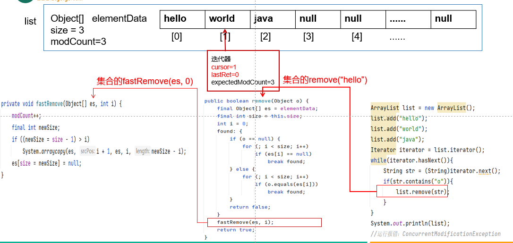

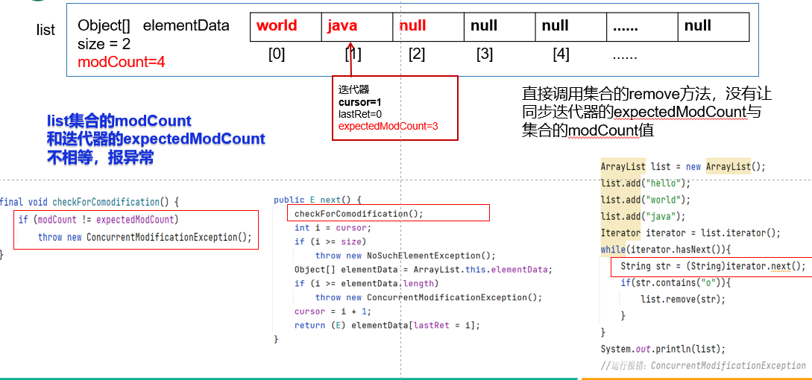


# 三、哈希表

## 3.1 树（了解）

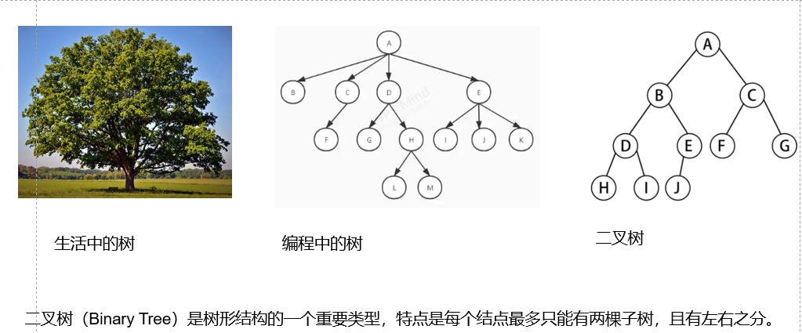

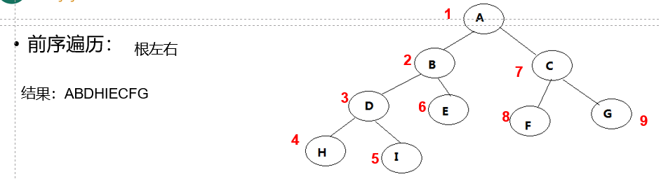

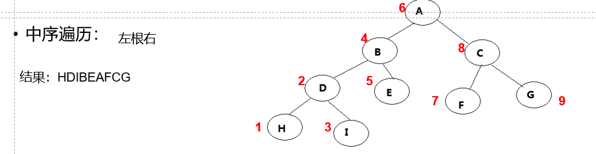


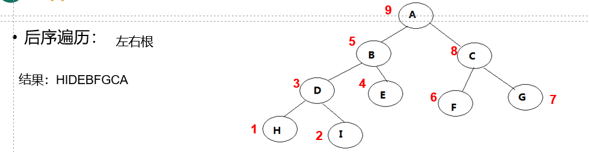


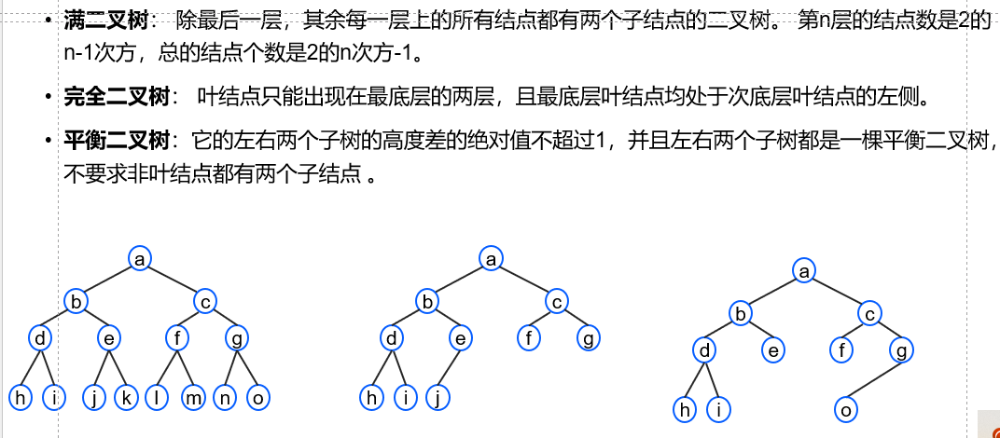

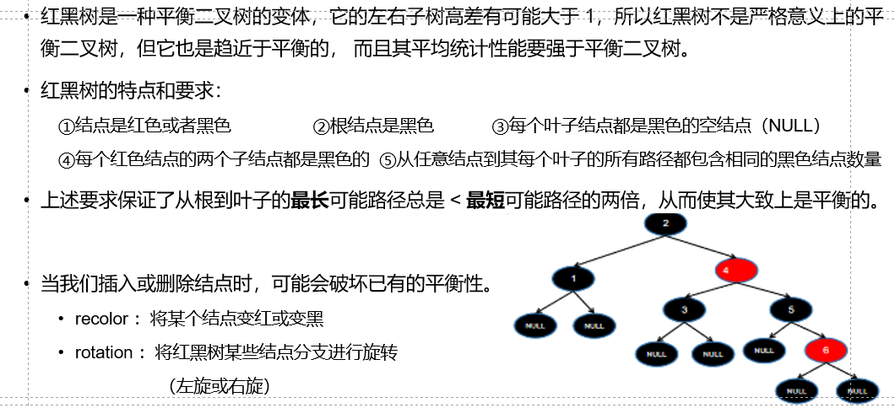
