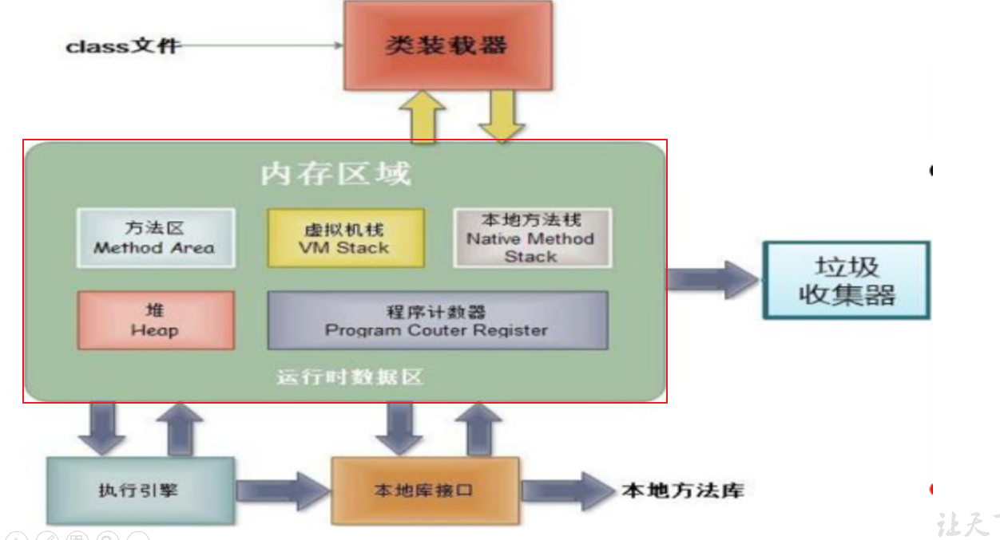
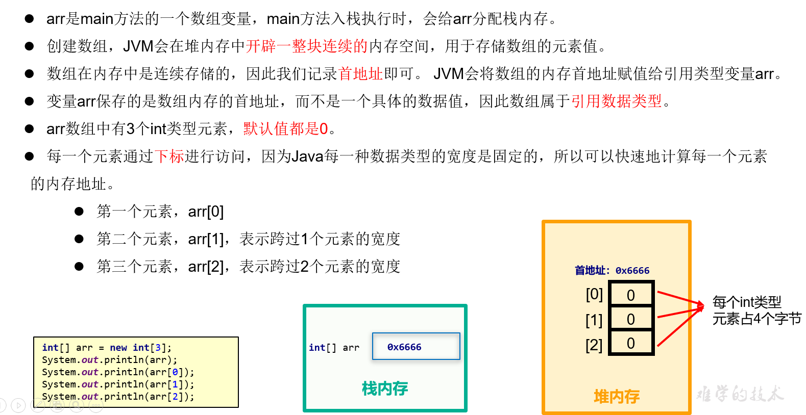
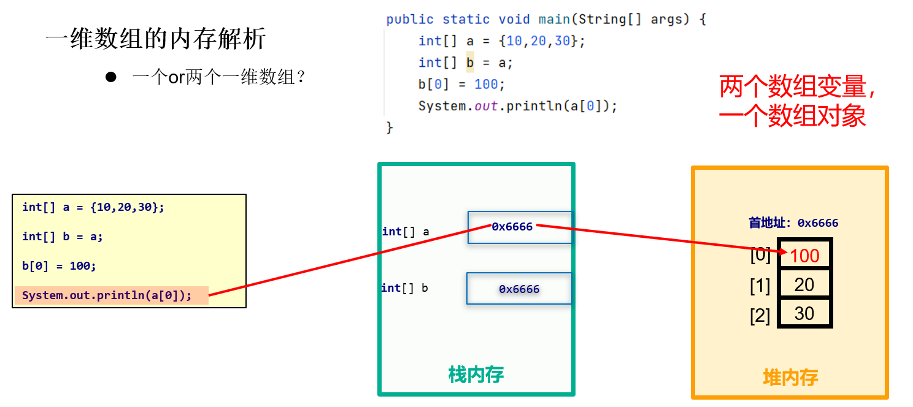
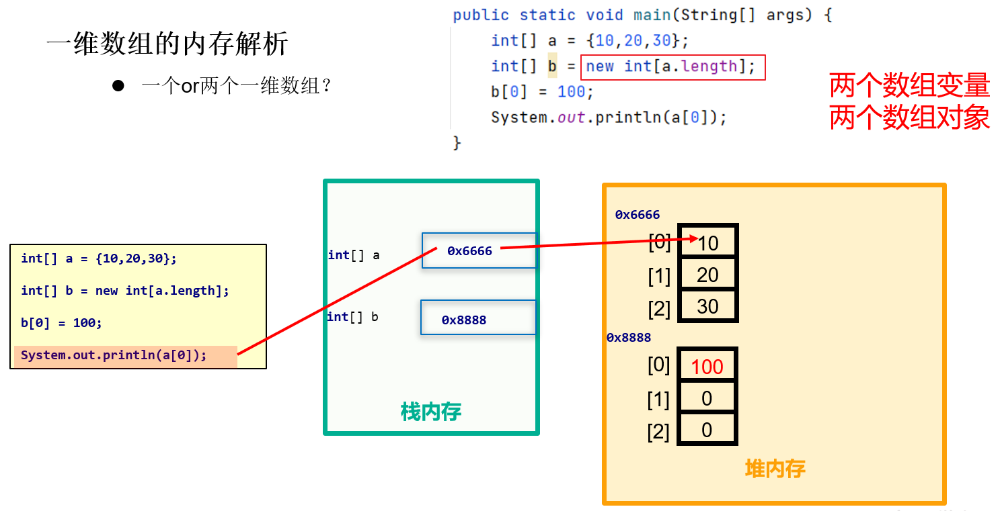
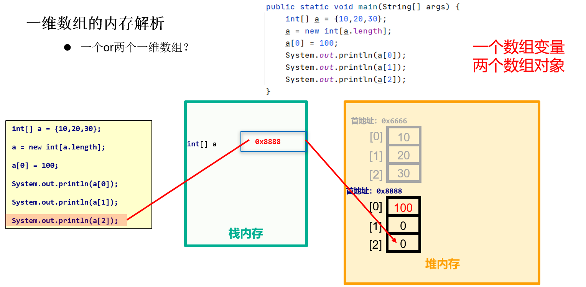
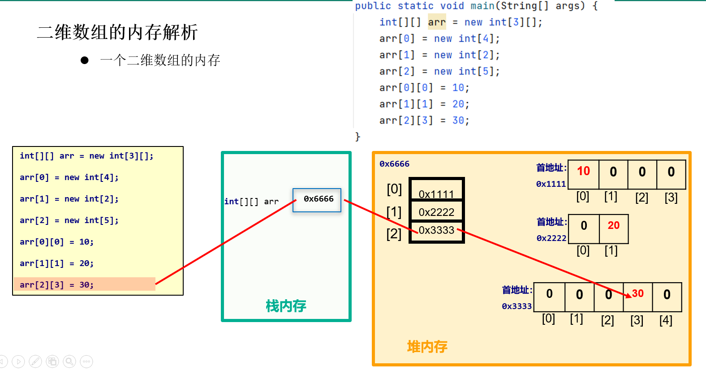
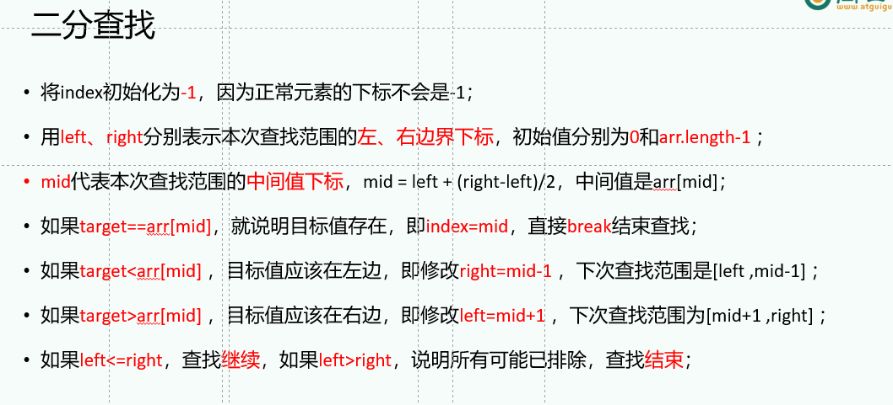
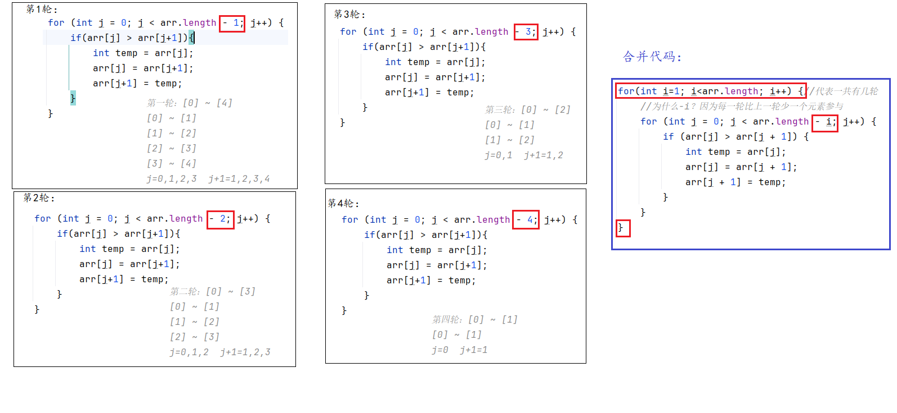

# 一、位运算符

- 左移：<<

  - a << b，等价于 a * 2的b次方
  - 底层原理：a的补码整体往左移动，左边截断b位，右边补b个0
  - 可能出现符号位改变，0变1,1变0

- 右移：>>

  - a >> b，等价于 a / 2的b次方，呈现向下取整的效果
  - 底层原理：a的补码整体往右移动，右边截断b位，左边补b个0或1，原来最高位是0继续0，原来最高位是1继续补1
  - 不会出现改变符号位

- 无符号右移：>>>

  - 正数的>>> 和 >> 相同
  - 负数>>>的底层原理：a的补码整体往右移动，右边截断b位，左边补b个0,
  - 无论是正数还是负数，无符号右移完之后都是正数

- 按位与：&

  - a & b 底层原理：将a和b的补码对齐，逐位计算，1 & 1 为 1，其余为0

- 按位或：|

  - a | b 底层原理：将a和b的补码对齐，逐位计算，0 | 0 为 0，其余为1

- 按位异或：^

  - a ^ b 底层原理：将a和b的补码对齐，逐位计算，相同为0，不同为1

- 按位取反：~

  - ~a 底层原理：将a的补码所有位，包括符号位，全部取反，0变1,1变0
  - 注意，这里的区分规则 与 原码和反码转换不同，因为原码和反码的取反是不动符号位

### 1.2 跳转语句

|          | break                                    | continue                     | return           |
| -------- | ---------------------------------------- | ---------------------------- | ---------------- |
| 使用位置 | switch-case，循环结构                    | 循环结构                     | 方法体中任意位置 |
| 作用     | 用于结束/跳出当前的switch-case或循环结构 | 用于跳过本次循环体剩下的语句 | 用于结束当前方法 |

#### 案例1

```java
public class TestBreakContinueReturn {
    public static void main(String[] args) {
        for (int i = 1; i <= 5; i++) {
            System.out.println("i=" + i + ",(1)");
            if (i == 3) {
                continue;//跳过i==3这次的(2)语句
            }
            System.out.println("i=" + i + ",(2)");
        }
        System.out.println("(3)");
    }
}

```

#### 案例2

```java
public class TestBreakContinueReturn2 {
    public static void main(String[] args) {
        for (int i = 1; i <= 5; i++) {
            System.out.println("i=" + i + ",(1)");
            if (i == 3) {
                break;//当i==3时直接结束for循环
            }
            System.out.println("i=" + i + ",(2)");
        }
        System.out.println("(3)");
    }
}

```

#### 案例3

```java
public class TestBreakContinueReturn3 {
    public static void main(String[] args) {
        for (int i = 1; i <= 5; i++) {
            System.out.println("i=" + i + ",(1)");
            if (i == 3) {
               return;
            }
            System.out.println("i=" + i + ",(2)");
        }
        System.out.println("(3)");
    }
}

```

# 二、数组（`非常重要`）

## 2.1 基本概念（会区分）

数组的标志性符号：[]

数组(array)是用来管理一组相同数据类型的变量/数据的容器/结构。这组相同数据类型的变量，使用一个统一的名称，称为`数组名`。为了区分数组中的每一个数据/变量，我们需要引入索引/编号/下标/下脚标，我个人比较习惯叫`下标(index)`。下标从[0]开始。这组数的总个数，称为`数组的长度`，用`数组名.length`来表示。结合来看，下标的范围是：[0,  数组名.length-1]，如果下标不在这个范围内，会发生`ArrayIndexOutOfBoundsException数组下标越界异常`。数组的每一个数据称为`元素`（element）。

`数组的遍历`，即挨个访问元素的操作，通常使用循环来完成，理论上可以使用for，while ，do -while，习惯上用for最多。

## 2.2 数组的声明和初始化（会用）

数组的声明格式:

```java
元素的类型[] 数组名;
```

初始化：确定数组的长度和数组的元素。它有两种方式：

1、静态初始化

```java
元素的类型[] 数组名 = {元素1，元素2， 元素3};//推荐
```

特别说明一下，当声明和静态初始化不在一个语句完成时，=右边需要加new 元素的类型[]。

```java
元素的类型[] 数组名;
 数组名 = new 元素的类型[]{元素1，元素2， 元素3}; //了解
```

2、动态初始化

```java
元素的类型[] 数组名 = new 元素的类型[长度值]; //确定了数组的长度，元素此时是默认值
```

| 元素的数据类型 | 默认值                         |
| -------------- | ------------------------------ |
| byte           | 0                              |
| short          | 0                              |
| int            | 0                              |
| long           | 0L                             |
| float          | 0.0F                           |
| double         | 0.0                            |
| char           | 编码值为0的空字符，或 '\u0000' |
| boolean        | false                          |
| String         | null                           |

## 2.3 数组的内存分析（理解即可）



数组名中记录的数组的首地址

数组的元素地址计算方式： 首地址 + 每一个元素的宽度 * 下标

- 以int[] 类型为例，假设首地址0x6666

- 取第1个元素：0x6666 + 4 * 0 = 0x6666

- 取第2个元素：0x6666 + 4 * 1 = 0x666a

  



## 2.4 1个数组还是2个数组（会分析）

### 1、两个数组变量指向同一个数组对象



### 2、两个数组变量分别执行不同的数组对象



### 3、一个数组变量先后指向不同的数组对象



## 2.5 二维数组

### 2.5.1 概念

```java
一维数组的标记是[]

二维数组的标记是[][]
```

- 一维数组的作用是用来管理一组相同数据类型的数据。

  - 例如：{89, 96, 85, 74, 65}
  - 例如：{"Monday","Tuesday","Wednesday","Thursday","Friday","Saturday","Sunday"}

- 二维数组的作用是用来管理多组相同数据类型的数据。

  - 例如：{  {89, 96, 85, 74, 65}, {10,20,30} , { 1,2,3,4,5,8} }

    

## 2.5.2  声明和初始化（会基本使用即可）

### 1、静态初始化

```java
元素的类型[][] 数组名 = {{元素1，元素2， 元素3, 元素4},{元素1，元素2},{元素1，元素2， 元素3}};//推荐，每一组的元素个数可以不同
```

```java
public class TestArrayInArray {
    public static void main(String[] args) {
        /*
        存储咱们班3组同学的成绩
         */
        int[][] scores = {{89, 85, 86, 75}, {99, 98, 93, 92, 91}, {63, 76}};
        /*
        scores[0] 是一个一维数组  {89, 85, 86, 75}
        scores[1] 也是一个一维数组  {99, 98, 93, 92, 91}
        scores[2] 也是一个一维数组  {63, 76}

          */
        //System.out.println(scores);//[[I@776ec8df，它是二维数组的首地址，有两个[

        //遍历二维数组
/*        for (int i = 0; i < scores.length; i++) {
            System.out.println(scores[i]);//[I@4eec7777 它是一维数组的首地址，有一个[
        }*/

        /*
        scores.length 是3，代表有3组，把每一组看成一个整体，二维数组也相当于是一维数组，只不过此时它的元素也是数组。
        scores[0].length 是4
        scores[1].length 是5
        scores[2].length 是2
         */
        for (int i = 0; i < scores.length; i++) {
            //scores[i]是一维数组，它的长度是scores[i].length
            for(int j=0; j<scores[i].length; j++){
                System.out.print(scores[i][j]+" ");
            }
            System.out.println();
        }
    }
}

```

### 2、动态初始化之规则的矩阵

每一行的元素个数是相同的

```java
元素的类型[][] 数组名 = new 元素的类型[总行数][每一行的元素个数];
```

```java
public class TestArrayInArray2 {
    public static void main(String[] args) {
        /*
        存储：
            1 1 1 1 1
            2 2 2 2 2
            3 3 3 3 3
         */
        int[][] arr = new int[3][5];

        /*
        等价于下面这个写法
        int[][] arr = new int[3][];
        arr[0] = new int[5];
        arr[1] = new int[5];
        arr[2] = new int[5];

        */

        //[3]代表有3组，[5]代表每一组有5个元素
        for (int i = 0; i < arr.length; i++) {
            for (int j = 0; j < arr[i].length; j++) {
                arr[i][j] = i+1;
                System.out.print(arr[i][j]+" ");
            }
            System.out.println();
        }
    }
}

```

```java
public class TestArrayInArray3 {
    public static void main(String[] args) {
        /*
        随机产生3组[0,100)之间的整数，每一组都要5个元素
         */
        int[][] arr = new int[3][5];

        for (int i = 0; i < arr.length; i++) {
            for (int j = 0; j < arr[i].length; j++) {
                arr[i][j] = (int)(Math.random()*100);
                System.out.print(arr[i][j]+" ");
            }
            System.out.println();
        }
    }
}

```

### 3、动态初始化之不规则的二维表

每一行的元素个数是不一定相同的。

```java
import java.util.Scanner;

public class TestArrayInArray4 {
    public static void main(String[] args) {
        /*
        第1个小组有5个人
        第2个小组有3个人
        第3个小组有4个人
         */
        int[][] arr = new int[3][];
        //这里只确定了一共有3行/组，但是没有确定每一组有几个人
        arr[0] = new int[5];
        //这句代码的作用是确定第1组有5个人
        //如果是数组名后面[]中有数字，代表下标，例如：arr[0]，这个[0]是下标
        //如果是数据类型后面[]中有数字，代表长度，例如：int[3]，这个[3]是长度
        arr[1] = new int[3];
        arr[2] = new int[4];
        //以上3句代码不能少，少了就会发生NullPointerException空指针异常

        Scanner input = new Scanner(System.in);

        for (int i = 0; i < arr.length; i++) {
            for (int j = 0; j < arr[i].length; j++) {
                System.out.print("请输入第" + (i+1)+ "组第" + (j+1) +"个同学的成绩：");
                arr[i][j] = input.nextInt();
            }
        }

        for (int i = 0; i < arr.length; i++) {
            for (int j = 0; j < arr[i].length; j++) {
                System.out.print(arr[i][j]+" ");
            }
            System.out.println();
        }


        input.close();
    }
}

```


## 2.5.3 二维数组内存分析




# 三、一维数组的算法（续）

## 2.1 在数组中查找最大值、最小值

### 1、数组是静态初始化的（掌握，必选）

```java
public class TestArrayMax {
    public static void main(String[] args) {
        int[] arr = {5, 6, 2, 7, 8, 1, 3};

        //故事：猴子掰最大的玉米
        //思路：
        //（1）先假设第1个元素是最大的
        int max = arr[0];

        //（2）用后面的元素与max比较，有比max大的，就替换max变量的值
        //这里i从1开始，表示元素的查找范围是[1, arr.length-1]，把[0]排除了
        for(int i=1; i<arr.length; i++){
            if(arr[i] > max){
                max = arr[i];
            }
        }
        System.out.println("max = " + max);
    }
}

```

```java
public class TestArrayMin {
    public static void main(String[] args) {
        int[] arr = {5, 6, 2, 7, 8, 1, 3};

        //故事：猴子掰最小的玉米
        //思路：
        //（1）先假设第1个元素是最小的
        int min = arr[0];

        //（2）用后面的元素与min比较，有比min小的，就替换min变量的值
        //这里i从1开始，表示元素的查找范围是[1, arr.length-1]，把[0]排除了
        for(int i=1; i<arr.length; i++){
            if(arr[i] < min){
                min = arr[i];
            }
        }
        System.out.println("min = " + min);
    }
}

```

### 2、数组是动态初始化（拓展，可选）

```java
public class TestArrayMax4 {
    public static void main(String[] args) {
        //元素是随机产生的,(-100,0]
        int[] arr = new int[10];//写完这句数组里面的元素是默认值，int类型的默认值是0

        //解决方案一：先产生所有的随机数
        for (int i = 0; i < arr.length; i++) {
            arr[i] = -(int) (Math.random() * 100);
            System.out.print(arr[i] + " ");
        }
        //到这里为止，元素值已经是确定的了

        int max = arr[0];//这一行代码 max =第1个元素的值
        for (int i = 0; i < arr.length; i++) {
            if(arr[i] > max){
                max = arr[i];
            }
        }
        System.out.println("max = " + max);
    }
}

```

```java
public class TestArrayMax5 {
    public static void main(String[] args) {
        //元素是随机产生的,
        int[] arr = new int[10];//写完这句数组里面的元素是默认值，int类型的默认值是0

        //解决方案二：产生随机数的同时，就找最大值
        int max = 0;//随便初始化一个
        for (int i = 0; i < arr.length; i++) {
//            arr[i] = -(int) (Math.random() * 100);
            arr[i] = (int) (Math.random() * 100);
            System.out.print(arr[i] + " ");

            if(i==0){//第1个元素的时候
                max = arr[0];//把max修改为第1个元素
            }else if(arr[i] > max){//不是第一个元素，让它与max比大小
                max = arr[i];
            }
        }

        System.out.println("max = " + max);
    }
}

```


## 2.2 在数组中查找最值及其下标

### 1、元素不重复（掌握，必选）

两种写法，选择一种来熟悉和掌握

```java
public class TestArrayMaxIndex {
    public static void main(String[] args) {
        int[] arr = {5, 6, 2, 7, 8, 1, 3};

        //定义两个变量，一个代表最大值，一个代表最大值的下标
        int max = arr[0];//max是最大值
        int index = 0; //index是下标
        for (int i = 0; i < arr.length; i++) {
            if(arr[i] > max){
                max = arr[i];
                index = i;
            }
        }
        System.out.println("max = " + max);
        System.out.println("index = [" + index +"]");
        System.out.println("第" + (index+1) +"个最大");
    }
}

```

```java
public class TestArrayMaxIndex2 {
    public static void main(String[] args) {
        int[] arr = {5, 6, 2, 7, 8, 1, 3};

        //定义1个变量
        int index = 0; //index是下标，最大值的下班
        for (int i = 0; i < arr.length; i++) {
            if(arr[i] > arr[index]){
                index = i;
            }
        }
        System.out.println("max = " + arr[index]);
        System.out.println("index = [" + index +"]");
        System.out.println("第" + (index+1) +"个最大");
    }
}

```


### 2、元素重复（拓展，可选）

```java
public class TestArrayMaxIndex3 {
    public static void main(String[] args) {
        int[] arr = {5, 6, 8, 7, 8, 9, 3, 9};

        /*
        方案一：（1）先找出最大值（2）再遍历数组，看哪些元素与最大值相同，打印它们的下标
         */
        int max = arr[0];
        for (int i = 0; i < arr.length; i++) {
            if(arr[i] > max){
                max = arr[i];
            }
        }
        System.out.println("max = " + max);

        //看哪些元素、


        与最大值相同，打印它们的下标
        System.out.println("最大值的下标有：");
        for (int i = 0; i < arr.length; i++) {
            if(arr[i] == max){
                System.out.print("[" + i +"] ");
            }
        }
    }
}

```

```java
public class TestArrayMaxIndex4 {
    public static void main(String[] args) {
        int[] arr = {5, 6, 8, 7, 8, 9, 3, 9};

        /*
        方案二：
        (1)假设max表示最大值，初始化为arr[0]
        (2)假设maxIndexStr表示最大值的下标，它是String，初始化为"0"

         */
        int max = arr[0];
        String maxIndexStr = "0";
        for (int i = 0; i < arr.length; i++) {
            if(arr[i] > max){
                max = arr[i];
                maxIndexStr = i + "";
            }else if(arr[i] == max){
                maxIndexStr += "," + i;
            }
        }
        System.out.println("max = " + max);
        System.out.println("maxIndexStr = [" + maxIndexStr+"]");
    }
}

```


## 2.3 在数组查找目标值

### 1、顺序查找（掌握，必选）

```java
import java.util.Scanner;

public class TestArrayOrderFind {
    public static void main(String[] args) {
        int[] arr = {5, 6, 2, 7, 8, 1, 3};

        //从键盘输入一个整数，看它在不在数组中
        Scanner input = new Scanner(System.in);

        System.out.print("请输入一个整数：");
        int target = input.nextInt();//7  or  9

        //用target与数组的元素“一一比较”，确定是否存在
        boolean flag = false;//假设它不存在，flag是一个标记值，false代表不存在，true代表存在
        for (int i = 0; i < arr.length; i++) {
            if(arr[i] == target){
                flag = true;
                break;
            }
        }

       if(flag){// if(flag==true){
            System.out.println("找到了");
        }else{
            System.out.println("没找到");
        }

        input.close();
    }
}

```

思考题：如果数组是有序的，例如：从小到大，那么上面的顺序查找可以优化吗？

```java
import java.util.Scanner;

public class TestArrayOrderFind2 {
    public static void main(String[] args) {
        int[] arr = {2, 4, 6, 8, 12, 24};//数组是有序的情况下

        //从键盘输入一个整数，看它在不在数组中
        Scanner input = new Scanner(System.in);

        System.out.print("请输入一个整数：");
        int target = input.nextInt();//7  or  8

        //用target与数组的元素“一一比较”，确定是否存在
        boolean flag = false;//假设它不存在，flag是一个标记值，false代表不存在，true代表存在
        for (int i = 0; i < arr.length; i++) {
            if (arr[i] == target) {//找到目标
                flag = true;
                break;
            }else if(arr[i] > target){//提前确定不存在
                break;
            }
        }

        if (flag) {// if(flag==true){
            System.out.println("找到了");
        } else {
            System.out.println("没找到");
        }

        input.close();
    }
}

```


### 2、二分查找（拓展，可选）

前提：有序



结论：

- 顺序查找时间复杂度是O(n)
- 二分查找时间复杂度是O(logn)

```java
import java.util.Scanner;

public class TestBinarySearch {
    public static void main(String[] args) {
        int[] arr = {2, 4, 6, 8, 12, 24};//数组是有序的情况下

        Scanner input = new Scanner(System.in);

        System.out.print("请输入要查找的目标值：");
        int target = input.nextInt();

        //无序数组不能用以下二分查找
        int index = -1;//初始值是-1，因为正常下标不会是-1
        int left = 0;//第一个元素的下标
        int right = arr.length - 1;//最后一个元素的下标
        //left ,right, mid，index都是下标
        while(left <= right){//当left > right就需要结束
            int mid = left + (right-left)/2; //或者  mid = (left + right)/2;
            if(target == arr[mid]){
                index = mid;
                break;
            }else if(target > arr[mid]){//去右边
                //修改左边界
                left = mid + 1;
            }else{//target < arr[mid] 去左边
                //修改右边界
                right = mid - 1;
            }
        }

        if(index == -1){
            System.out.println("不存在");
        }else{
            System.out.println("存在");
        }
        input.close();
    }
}

```


## 2.4 数组反转

```java
public class TestArrayReverse {
    public static void main(String[] args) {
        int[] arr = {5, 6, 7, 2, 1};
        //反转后 {1,2,7,6,5}

        System.out.print("交换之前：");
        for (int i = 0; i < arr.length; i++) {
            System.out.print(arr[i] + " ");
        }
        System.out.println();

        //方案一：对称位置的元素交换
        for(int left = 0,right = arr.length-1; left < right; left++,right--){
            //arr[left] ~ arr[right] 交换
            int temp = arr[left];
            arr[left] = arr[right];
            arr[right] = temp;
        }

        System.out.print("交换之后：");
        for (int i = 0; i < arr.length; i++) {
            System.out.print(arr[i] + " ");
        }
        System.out.println();

    }
}

```

```java
public class TestArrayReverse2 {
    public static void main(String[] args) {
        int[] arr = {5, 6, 7, 2, 1};
        //反转后 {1,2,7,6,5}

        System.out.print("交换之前：");
        for (int i = 0; i < arr.length; i++) {
            System.out.print(arr[i] + " ");
        }
        System.out.println();

        //方案二：定义一个新数组
        int[] newArr = new int[arr.length];
        //把arr数组的元素  倒序 放到newArr中
        for (int i = 0; i < arr.length; i++) {
            newArr[arr.length-1-i] = arr[i];
        }
        arr = newArr;

        System.out.print("交换之后：");
        for (int i = 0; i < arr.length; i++) {
            System.out.print(arr[i] + " ");
        }
        System.out.println();

    }
}
```


## 2.5 数组的排序

#### 1、冒泡排序（掌握，必选）

```java
public class TestBubbleSort2 {
    public static void main(String[] args) {
        int[] arr = {2, 8, 6, 3, 1,7,4,3,2};

        for(int i=1; i<arr.length; i++) {//代表一共有几轮
            //为什么-i？因为每一轮比上一轮少一个元素参与
            for (int j = 0; j < arr.length - i; j++) {
                if (arr[j] > arr[j + 1]) {
                    int temp = arr[j];
                    arr[j] = arr[j + 1];
                    arr[j + 1] = temp;
                }
            }
        }

        for (int i = 0; i < arr.length; i++) {
            System.out.print(arr[i]+" ");
        }
        System.out.println();

    }
}

```

冒泡排序的推导过程：



```java
public class TestBubbleSort {
    public static void main(String[] args) {
        int[] arr = {2, 8, 6, 3, 1};

        /*
        第一轮：[0] ~ [4]
        [0] ~ [1]
        [1] ~ [2]
        [2] ~ [3]
        [3] ~ [4]
        j=0,1,2,3,     j+1=1,2,3,4
         */
        for (int j = 0; j < arr.length - 1; j++) {
            if(arr[j] > arr[j+1]){
                int temp = arr[j];
                arr[j] = arr[j+1];
                arr[j+1] = temp;
            }
        }

        System.out.println("第一轮结束：");
        for (int j = 0; j < arr.length; j++) {
            System.out.print(arr[j]+" ");
        }
        System.out.println();

        /*
        第二轮：[0] ~ [3]
        [0] ~ [1]
        [1] ~ [2]
        [2] ~ [3]
        j=0,1,2      j+1=1,2,3
         */
        for (int j = 0; j < arr.length - 2; j++) {
            if(arr[j] > arr[j+1]){
                int temp = arr[j];
                arr[j] = arr[j+1];
                arr[j+1] = temp;
            }
        }
        System.out.println("第二轮结束：");
        for (int j = 0; j < arr.length; j++) {
            System.out.print(arr[j]+" ");
        }
        System.out.println();

       /*
        第三轮：[0] ~ [2]
        [0] ~ [1]
        [1] ~ [2]
        j=0,1,      j+1=1,2
         */
        for (int j = 0; j < arr.length - 3; j++) {
            if(arr[j] > arr[j+1]){
                int temp = arr[j];
                arr[j] = arr[j+1];
                arr[j+1] = temp;
            }
        }
        System.out.println("第三轮结束：");
        for (int j = 0; j < arr.length; j++) {
            System.out.print(arr[j]+" ");
        }
        System.out.println();

        /*
        第四轮：[0] ~ [1]
        [0] ~ [1]
        j=0 ,    j+1=1
         */
        for (int j = 0; j < arr.length - 4; j++) {
            if(arr[j] > arr[j+1]){
                int temp = arr[j];
                arr[j] = arr[j+1];
                arr[j+1] = temp;
            }
        }
        System.out.println("第四轮结束：");
        for (int j = 0; j < arr.length; j++) {
            System.out.print(arr[j]+" ");
        }
        System.out.println();
    }
}

```

思考题：能不能优化冒泡排序的代码？

```java
public class TestBubbleSort3 {
    public static void main(String[] args) {
        int[] arr = {1,2,3,5,4};

        /*
        思考：如果提前已经排好序了，没必要非得执行n-1轮？
        换一个问题：如何通过代码检测数组已经排序好？
        之所以冒泡排序这里i = 1，是因为便于内循环减去i正好是还需要排序的元素的长度
        这样的话j + 1就正好可以放在需要的位置
         */

        for(int i=1; i<arr.length; i++) {
            boolean flag = true;//true代表已经排好序了
            for (int j = 0; j < arr.length - i; j++) {
                if (arr[j] > arr[j + 1]) {
                    int temp = arr[j];
                    arr[j] = arr[j + 1];
                    arr[j + 1] = temp;

                    flag = false;//可能还未排好序
                }
            }

            if(flag){
                break;//结束外循环
            }
        }

        for (int i = 0; i < arr.length; i++) {
            System.out.print(arr[i]+" ");
        }
        System.out.println();
    }
}
```


#### 2、选择排序（拓展，可选）

```java
public class TestSelectSort {
    public static void main(String[] args) {
        int[] arr = {5, 6, 3, 4, 1};
//这里实现将最大或者最小的值通过排序放到指定位置，实现的原因就是外层循环的i,i = 0，的时候，最小值就放在第一个元素
        //外循环控制几轮，n个元素，需要n-1
        //arr.length=5, i=0,1,2,3
        for(int i=0; i<arr.length-1; i++){
            //查找本轮的最小值及其下标
            int min = arr[i];//本轮第1个元素
            int index = i;

            //后面的元素与min比较
            for(int j=i+1; j<arr.length; j++){
                if(arr[j] < min){
                    min = arr[j];
                    index = j;
                }
            }

            //看一下本轮最小值在不在[i]的位置
            if(index != i){
                //交换arr[i] 与 arr[index]位置的元素
                int temp = arr[i];
                arr[i] = arr[index];
                arr[index] = temp;
            }
        }

        System.out.println("排序后：");
        for (int i = 0; i < arr.length; i++) {
            System.out.print(arr[i]+" ");
        }
    }
}
```


## 2.6 数组的扩容（拓展，可选）

数组的特点：一旦长度确定，就无法更改了。

数组扩容的思路：再创建一个更大的数组，然后把原来数组中的元素搬过去（复制过去）

```java
import java.util.Scanner;

public class TestArrayGrow {
    public static void main(String[] args) {
        //一开始，数组的长度为5，从键盘输入整数放到数组中，不断输入，直到输入0为止
        int[] arr = new int[5];

        Scanner input = new Scanner(System.in);

        int count = 0;//输入的数字的个数
        while(true){
            System.out.print("请输入整数：");
            int num = input.nextInt();

            if(num == 0){
                break;
            }else{
                //放到数组中
                arr[count] = num;
                count++;

                //扩容
                if(count >= arr.length){
                    //再创建一个更大的数组
//                    int[] newArr = new int[arr.length+1];//扩1个位置
//                    int[] newArr = new int[arr.length*2];//2倍扩容
//                    int[] newArr = new int[(int)(arr.length*1.5)];//1.5倍
//                    int[] newArr = new int[arr.length + arr.length/2];//1.5倍
                    int[] newArr = new int[arr.length + (arr.length>>1)];//1.5倍

                    //把数组原来的元素copy到新数组中
                    for(int i=0; i<arr.length; i++){
                        newArr[i] = arr[i];
                    }

                    //让arr指向新数组
                    arr = newArr;
                }
            }
        }


        input.close();
    }
}
```


## 2.7 数组元素的插入（拓展，可选）

```java
import java.util.Scanner;

public class TestArrayInsert {
    public static void main(String[] args) {
        int[] arr = {10, 20, 30, 40, 50};

        //从键盘输入1个整数，插入到arr数组的[1]位置
        //（1）先扩容
        int[] newArr = new int[arr.length+1];//扩1个位置
        for(int i=0; i<arr.length; i++){//原样复制元素
            newArr[i] = arr[i];
        }
        arr = newArr;//抛弃旧数组，选用新数组

        //(2)把[1]位置及其后面的元素往右移动
        /*
        [4] -> [5]
        [3] -> [4]
        [2] -> [3]
        [1] -> [2]
         */
        for(int i=arr.length-1; i>1; i--){
            //arr[后面] = arr[前面];
            arr[i] = arr[i-1];
        }


        //（3）在[1]插入新元素
        Scanner input = new Scanner(System.in);
        System.out.print("请输入新元素：");
        int newNum = input.nextInt();

        arr[1] = newNum;

        input.close();

        //（4）遍历数组
        System.out.println("插入新元素之后：");
        for (int i = 0; i < arr.length; i++) {
            System.out.print(arr[i]+" ");
        }
    }
}
```

## 2.8 数组元素的删除（拓展，可选）

```java
public class TestArrayDelete {
    public static void main(String[] args) {
        int[] arr = {10, 20, 30, 40, 50};

        //删除元素20，并且要保证剩下的元素仍然是连续存储
        //(1)把[1]位置及其后面的元素往前移动
        /*
        [2] -> [1]
        [3] -> [2]
        [4] -> [3]
         */
        //arr.length=5,  i=1,2,3
        for(int i=1; i<arr.length-1; i++){
//            arr[前面] = arr[后面];
            arr[i] = arr[i+1];
        }

        //(2)把末尾位置置0
        arr[arr.length-1] = 0;

        System.out.println("删除20元素后：");
        for (int i = 0; i < arr.length; i++) {
            System.out.print(arr[i]+" ");
        }

    }
}

```

