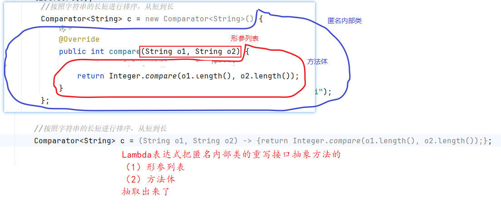

# 一、复习

问：迭代器的作用？

答：遍历集合。遍历Collection集合。

问：迭代器的接口是什么？

答：Iterator

问：迭代器的抽象方法？

- boolean hasNext()
- E next()

问：什么是列表迭代器？

答：ListIterator

问：列表迭代器与普通迭代器有什么区别？

|                                                | 普通迭代器Iterator | 列表迭代器ListIterator |
| ---------------------------------------------- | ------------------ | ---------------------- |
| 关系                                           | 父                 | 子                     |
| 遍历哪些集合                                   | 所有Collection系列 | 仅限于遍历List系列     |
| 支持从左往右/从前往后遍历                      | 支持               | 支持                   |
| 支持从右往左/从后往前遍历                      | 不支持             | 支持                   |
| 遍历过程中支持删除吗（迭代器的删除）           | 支持               | 支持                   |
| 遍历过程中支持添加和修改（迭代器的添加和修改） | 不支持             | 支持                   |
| 遍历List的过程中是否支持获取下标               | 不支持             | 支持                   |

问：Iterable 与 Iterator有什么关系 或 区别？

答：Iterable 依赖于  Iterator。Iterable接口有一个抽象方法： Iterator iterator();

Iterable 是集合类本身实现， Iterator是要单独的类，通常是集合中的内部类来实现。例如：ArrayList集合就实现了Iterable 接口，ArrayList的内部有一个内部类Itr实现类Iterator接口。

问：foreach循环与迭代器有什么关系？

答：foreach循环的底层就是使用迭代器来完成遍历集合的。凡是实现Iterable接口的集合，都可以使用foreach循环遍历。

问：在foreach或Iterator遍历集合的过程中，能不能调用集合的add，remove，sort等方法？

答：千万不能。如果调用了，可能结果不正常，或者发生ConcurrentModificationException异常。


# 二、集合收尾

## 2.1 哈希表原理结尾（续）

请看《尚硅谷_Java基础_第11章_集合原理分析（4）哈希表.pptx》


## 2.2 集合与数组的区别

|                            | 数组   | 集合                   |
| -------------------------- | ------ | ---------------------- |
| 元素是否可以是基本数据类型 | 可以   | 不可以，集合只能装对象 |
| 是否支持自动扩容           | 不支持 | 支持                   |
| 是否支持多种数据结构       | 否     | 很丰富                 |


## 2.3 复习集合路线

1、掌握Collection、List、Map、Iterator这些接口的方法（必须掌握，否则对后面学习有影响）

围绕增、删、改、查、遍历


2、掌握Collection和Map集合的关系图及其它们的实现类的区别（为考试和面试服务）

看最近两次晨考题


3、尽量理解几个集合的源码或原理（为获取更高薪资）

- 动态数组
- 双向链表
- 哈希表
- 迭代器


# 三、Lambda表达式和StreamAPI

新特性的问题：

Java5是一个里程碑版本，它引入了很多新特性：foreach，注解，枚举等等

Java8是另一个里程碑版本，它引入了很多新特性：第3代日期时间API，接口中增加了静态方法和默认方法，Lambda表达式和StreamAPI

Java9-17之间，陆续引入了：记录类、密封类、switch表达式、isntanceof模式匹配等


## 3.1 Lambda表达式

### 3.1.1 什么是Lambda表达式

Lambda表达式是一种语法糖，它是为了简化`函数式接口`的`匿名内部类`代码而设计的语法。本质上仍然是一种匿名内部类的原理。


### 3.1.2 什么是是函数式接口

函数式接口简称为SAM（Single Abstract Method）接口，即只有`1个抽象方法`需要重写的接口。这里没有限制接口的静态方法、默认方法等的数量。Java建议我们只对标记了@FunctionalInterface注解的函数式接口使用Lambda表达式，因为这些接口才有匿名内部类实现它的应用场景。

回忆：

```java
java.lang.Comparable<T>接口  int compareTo(T t)        没有  匿名内部类实现它的场景
java.util.Comparator<T>接口  int compare(T t1, T t2)   匿名内部类实现它的场景
java.util.Predicate<T>接口   boolean test(T t)           匿名内部类实现它的场景
.....
```


```java
java.lang.Iterable<T>接口   只有一个抽象方法，但是 没有  匿名内部类实现它的场景
java.util.Iterator<T>接口   多个抽象方法
java.util.Collection<E>接口  多个抽象方法
java.util.Set接口           多个抽象方法
java.util.List接口		多个抽象方法
java.util.Map接口			多个抽象方法
java.util.Queue接口		多个抽象方法
 ....
```

### 3.1.3  Lambda表达式的语法

```java
（形参列表） -> {方法体或Lambda体;}

//这里要写形参列表的意义，是为了我们自己给形参取名字。类型是不能改。方法体是完成功能的。
```



Lambda表达式的意义，在于让Java原来一切以“对象”为中心的编程方式，增加了可以以“函数或方法”为中心的编程方式。

如果按照之前的面向对象的语法，为了传递一段代码，我们也不得不new一个对象出来，哪怕这个对象的类是匿名的。这样使得代码很繁琐。

Lambda表达式还可以再简化：

- 当抽象方法的形参类型可以确定或可以根据泛型自动推断的话，形参类型可以省略。
- 当 {方法体或Lambda体;}只有1个语句，那么这个语句的;，和{}可以省略。如果这个语句是一个return语句，那么return也要一起省略。
- 当形参列表只有1个形参，且类型省略的情况下，()可以省略。当然，如果形参不止1个或类型没有省略的情况，()不能省略。

#### 案例1

```java
package com.atguigu.lambda;

import org.junit.Test;

import java.util.ArrayList;
import java.util.Collections;
import java.util.Comparator;

public class TestLambda {
    @Test
    public void test(){
        ArrayList<String> list = new ArrayList<>();
        Collections.addAll(list, "hello","java","world","chai");
        System.out.println("排序之前：" + list);

        //按照字符串的长短进行排序，从短到长
        Comparator<String> c = new Comparator<String>() {
            @Override
            public int compare(String o1, String o2) {
//                return o1.length() - o2.length();
                return Integer.compare(o1.length(), o2.length());
            }
        };

        list.sort(c);
        System.out.println("排序之后：" + list);
    }

    @Test
    public void test2(){
        ArrayList<String> list = new ArrayList<>();
        Collections.addAll(list, "hello","java","world","chai");
        System.out.println("排序之前：" + list);

        //按照字符串的长短进行排序，从短到长，长度相同，按照字符的编码值顺序排列
        Comparator<String> c = new Comparator<String>() {
            @Override
            public int compare(String o1, String o2) {
                int result =  Integer.compare(o1.length(), o2.length());
                return result != 0 ? result : o1.compareTo(o2);//这里的compareTo是String类的
            }
        };

        list.sort(c);
        System.out.println("排序之后：" + list);
    }

    @Test
    public void test3(){
        ArrayList<String> list = new ArrayList<>();
        Collections.addAll(list, "hello","java","world","chai");
        System.out.println("排序之前：" + list);

        //按照字符串的长短进行排序，从短到长
       // Comparator<String> c = (String o1, String o2) -> {return Integer.compare(o1.length(), o2.length());};//原型
//        Comparator<String> c =  (o1, o2) -> {return Integer.compare(o1.length(), o2.length());};//省略形参类型
        Comparator<String> c =  (o1, o2) -> Integer.compare(o1.length(), o2.length());//省略return,; ,{}
        list.sort(c);

        //再简化
        list.sort((o1, o2) -> Integer.compare(o1.length(), o2.length()));
        //这里编写Lambda表达式就是为了给sort方法传递一段代码，它代表了排序规则
        //这段代码是给sort方法内部使用的的
        System.out.println("排序之后：" + list);
    }
}

```

#### 案例2

```java
package com.atguigu.lambda;

import org.junit.Test;

import java.util.ArrayList;
import java.util.Collections;
import java.util.function.Predicate;

public class TestLambda2 {
    @Test
    public void test1(){
        ArrayList<String> list = new ArrayList<>();
        Collections.addAll(list, "hello","java","world","chai");

        //删除包含o字母的单词
        Predicate<String> p = new Predicate<String>() {
            @Override
            public boolean test(String s) {
                return s.contains("o");
            }
        };//匿名内部类
        list.removeIf(p);
    }

    @Test
    public void test2(){
        ArrayList<String> list = new ArrayList<>();
        Collections.addAll(list, "hello","java","world","chai");

        //删除包含o字母的单词
//        Predicate<String> p = (String s) ->{return s.contains("o");};//Lambda表达式原型
//        Predicate<String> p = (s) ->{return s.contains("o");};//省略了形参类型
//        Predicate<String> p = (s) ->s.contains("o");//省略了{}和;和return
        /*Predicate<String> p = s ->s.contains("o");//形参列表的()
        list.removeIf(p);*/

        list.removeIf(s ->s.contains("o")); //代码更简洁，可读性更好
        System.out.println(list);
    }
}

```

### 3.1.4 经典的函数式接口

比较器：Comparator

Java8在java.util.function包引入了很多新的函数式接口。它们大致可以分为4类。

#### 1、判断型接口

经典代表：

```java
Predicate<T>接口，  抽象方法 boolean test(T t)
```

它的抽象方法，有形参，有返回值，但是返回值类型是固定的boolean类型。相当于你在这个抽象方法中，一定是编写一个条件，用于判断形参t是不是满足xx条件。

| 序号 | 接口名           | 抽象方法                   | 描述             |
| ---- | ---------------- | -------------------------- | ---------------- |
| 1    | Predicate<T>     | boolean test(T t)          | 接收一个对象     |
| 2    | BiPredicate<T,U> | boolean test(T t, U u)     | 接收两个对象     |
| 3    | DoublePredicate  | boolean test(double value) | 接收一个double值 |
| 4    | IntPredicate     | boolean test(int value)    | 接收一个int值    |
| 5    | LongPredicate    | boolean test(long value)   | 接收一个long值   |

#### 2、消费型接口

经典代表：

```java
Consumer<T>接口，抽象方法 void accept(T t)  
```

它的抽象方法，有形参，无返回值，返回值类型固定是void类型。相当于你在这个抽象方法中“吃”掉了这个形参。

| 序号 | 接口名               | 抽象方法                       | 描述                       |
| ---- | -------------------- | ------------------------------ | -------------------------- |
| 1    | Consumer<T>          | void accept(T t)               | 接收一个对象用于完成功能   |
| 2    | BiConsumer<T,U>      | void accept(T t, U u)          | 接收两个对象用于完成功能   |
| 3    | DoubleConsumer       | void accept(double value)      | 接收一个double值           |
| 4    | IntConsumer          | void accept(int value)         | 接收一个int值              |
| 5    | LongConsumer         | void accept(long value)        | 接收一个long值             |
| 6    | ObjDoubleConsumer<T> | void accept(T t, double value) | 接收一个对象和一个double值 |
| 7    | ObjIntConsumer<T>    | void accept(T t, int value)    | 接收一个对象和一个int值    |
| 8    | ObjLongConsumer<T>   | void accept(T t, long value)   | 接收一个对象和一个long值   |

```java
package com.atguigu.lambda;

import org.junit.Test;

import java.util.ArrayList;
import java.util.Collections;
import java.util.Iterator;
import java.util.function.Consumer;

public class TestLambda3 {
    @Test
    public void test1(){
        ArrayList<String> list = new ArrayList<>();
        Collections.addAll(list, "hello","java","world","chai");

        //遍历上述集合，查看每一个单词的长度
        //(1)foreach循环（复习）
        for (String s : list) {
            System.out.println(s +"的长度：" + s.length());
        }
    }

    @Test
    public void test2(){
        ArrayList<String> list = new ArrayList<>();
        Collections.addAll(list, "hello","java","world","chai");

        //遍历上述集合，查看每一个单词的长度
        //(2)迭代器Iterator（复习）
        Iterator<String> iterator = list.iterator();
        while(iterator.hasNext()){
            String s = iterator.next();
            System.out.println(s +"的长度：" + s.length());
        }
    }

    @Test
    public void test3(){
        ArrayList<String> list = new ArrayList<>();
        Collections.addAll(list, "hello","java","world","chai");

        //遍历上述集合，查看每一个单词的长度
        //(3)forEach方法
        Consumer<String> c = new Consumer<String>() {
            @Override
            public void accept(String s) {
                System.out.println(s +"的长度：" + s.length());
            }
        };//匿名内部类写法
        list.forEach(c);
    }

    @Test
    public void test4(){
        ArrayList<String> list = new ArrayList<>();
        Collections.addAll(list, "hello","java","world","chai");

        //遍历上述集合，查看每一个单词的长度
        //(3)forEach方法
//        Consumer<String> c = (String s) ->{System.out.println(s +"的长度：" + s.length());};//Lambda表达式原型
       /* Consumer<String> c = s ->System.out.println(s +"的长度：" + s.length());//Lambda表达式简化
        list.forEach(c);*/

        list.forEach(s ->System.out.println(s +"的长度：" + s.length()));
    }
}

```


#### 3、功能型接口

经典代表：

```java
Function<T,R>，抽象方法 R apply(T t) 
```

它的抽象方法，有形参，有返回值，返回值类型不固定。返回值类型与形参类型可能不一致，可能一致。相当于你可以在这个抽象方法中，对形参做修改操作。

它有很多兄弟姐妹，子孙后代。例如：

```java
UnaryOperator<T>，抽象方法 T apply(T t)  //在抽象方法中，修改形参的值，不改类型
```

它们的家族：

- 接口名以Function或Operator结尾
  - 以Operator结尾，它的抽象方法的形参类型与返回值类型是一样的
- Bi开头或包含Binary，抽象方法的形参都是2个
- 以ToXxx，表示返回值是Xxx

| 序号 | 接口名                  | 抽象方法                                        | 描述                                                |
| ---- | ----------------------- | ----------------------------------------------- | --------------------------------------------------- |
| 1    | Function<T,R>           | R apply(T t)                                    | 接收一个T类型对象，返回一个R类型对象结果            |
| 2    | UnaryOperator<T>        | T apply(T t)                                    | 接收一个T类型对象，返回一个T类型对象结果            |
| 3    | DoubleFunction<R>       | R apply(double value)                           | 接收一个double值，返回一个R类型对象                 |
| 4    | IntFunction<R>          | R apply(int value)                              | 接收一个int值，返回一个R类型对象                    |
| 5    | LongFunction<R>         | R apply(long value)                             | 接收一个long值，返回一个R类型对象                   |
| 6    | ToDoubleFunction<T>     | double applyAsDouble(T value)                   | 接收一个T类型对象，返回一个double                   |
| 7    | ToIntFunction<T>        | int applyAsInt(T value)                         | 接收一个T类型对象，返回一个int                      |
| 8    | ToLongFunction<T>       | long applyAsLong(T value)                       | 接收一个T类型对象，返回一个long                     |
| 9    | DoubleToIntFunction     | int applyAsInt(double value)                    | 接收一个double值，返回一个int结果                   |
| 10   | DoubleToLongFunction    | long applyAsLong(double value)                  | 接收一个double值，返回一个long结果                  |
| 11   | IntToDoubleFunction     | double applyAsDouble(int value)                 | 接收一个int值，返回一个double结果                   |
| 12   | IntToLongFunction       | long applyAsLong(int value)                     | 接收一个int值，返回一个long结果                     |
| 13   | LongToDoubleFunction    | double applyAsDouble(long value)                | 接收一个long值，返回一个double结果                  |
| 14   | LongToIntFunction       | int applyAsInt(long value)                      | 接收一个long值，返回一个int结果                     |
| 15   | DoubleUnaryOperator     | double applyAsDouble(double operand)            | 接收一个double值，返回一个double                    |
| 16   | IntUnaryOperator        | int applyAsInt(int operand)                     | 接收一个int值，返回一个int结果                      |
| 17   | LongUnaryOperator       | long applyAsLong(long operand)                  | 接收一个long值，返回一个long结果                    |
|      |                         |                                                 |                                                     |
| 18   | BiFunction<T,U,R>       | R apply(T t, U u)                               | 接收一个T类型和一个U类型对象，返回一个R类型对象结果 |
| 19   | BinaryOperator<T>       | T apply(T t, T u)                               | 接收两个T类型对象，返回一个T类型对象结果            |
| 20   | ToDoubleBiFunction<T,U> | double applyAsDouble(T t, U u)                  | 接收一个T类型和一个U类型对象，返回一个double        |
| 21   | ToIntBiFunction<T,U>    | int applyAsInt(T t, U u)                        | 接收一个T类型和一个U类型对象，返回一个int           |
| 22   | ToLongBiFunction<T,U>   | long applyAsLong(T t, U u)                      | 接收一个T类型和一个U类型对象，返回一个long          |
| 23   | DoubleBinaryOperator    | double applyAsDouble(double left, double right) | 接收两个double值，返回一个double结果                |
| 24   | IntBinaryOperator       | int applyAsInt(int left, int right)             | 接收两个int值，返回一个int结果                      |
| 25   | LongBinaryOperator      | long applyAsLong(long left, long right)         | 接收两个long值，返回一个long结果                    |

```java
package com.atguigu.lambda;

import org.junit.Test;

import java.util.ArrayList;
import java.util.Collections;
import java.util.function.UnaryOperator;

public class TestLambda4 {
    @Test
    public void test1(){
        ArrayList<String> list = new ArrayList<>();
        Collections.addAll(list, "hello","java","world","chai");

        //要将上述单词转为大写
        UnaryOperator<String> u = new UnaryOperator<String>() {
            @Override
            public String apply(String s) {
                return s.toUpperCase();
            }
        };//匿名内部类写法
        list.replaceAll(u);
    }

    @Test
    public void test2(){
        ArrayList<String> list = new ArrayList<>();
        Collections.addAll(list, "hello","java","world","chai");

        //要将上述单词转为大写
//        UnaryOperator<String> u = (String s)-> {return s.toUpperCase();};//Lambda表达式原型
      /*  UnaryOperator<String> u = s-> s.toUpperCase();//Lambda表达式简化
        list.replaceAll(u);*/

        list.replaceAll(s-> s.toUpperCase());
        System.out.println(list);
    }
}
```


#### 4、供给型接口

经典代表：

```java
Supplier<T> ，抽象方法 T get()  
```

它的抽象方法，没有形参，有返回值。返回值类型不固定。相当于你在这个抽象方法中，返回了一个结果，但是不需要人家给你任何参数。属于奉献型接口。


| 序号 | 接口名          | 抽象方法               | 描述              |
| ---- | --------------- | ---------------------- | ----------------- |
| 1    | Supplier<T>     | T get()                | 返回一个对象      |
| 2    | BooleanSupplier | boolean getAsBoolean() | 返回一个boolean值 |
| 3    | DoubleSupplier  | double getAsDouble()   | 返回一个double值  |
| 4    | IntSupplier     | int getAsInt()         | 返回一个int值     |
| 5    | LongSupplier    | long getAsLong()       | 返回一个long值    |


## 3.2 方法引用

方法引用也是一种语法糖，它是用于简化Lambda表达式的语法。但是，不是所有的Lambda表达式都能用它进行简化的（就像不是所有匿名内部类都可以使用Lambda表达式简化一样，要有条件）。

当Lambda表达式同时满足以下3个条件时，才能用方法引用进行简化，（如果是编写代码，其实大家不用去记这些条件，因为IDEA都会给你提示）：

- Lambda表达式的{Lambda体}必须只有一个语句，如果{}中有多个语句，不可以。
- 这个语句还必须是一个类.静态方法(【实参】)或一个对象.实例方法(【实参】)的语句。不能是其他语句，例如 a-b; 这样的表达式
- 类名.静态方法用到的实参，全部来源于Lambda表达式的形参，没有额外的数据参与。对象.实例方法用到的实参，全部来源于Lambda表达式的形参，没有额外的数据参与。甚至调用实例方法的对象，都是Lambda表达式的第1个形参。

方法引用语法的3种形式：

- 类名::方法名
- 对象名::方法名
- 类名::new     ：这种情况是属于你的{Lambda体}在调用一个类的构造器创建对象，而且调用构造器用到的实参，全部来源于Lambda表达式的形参

```java
package com.atguigu.reference;

import org.junit.Test;

import java.util.ArrayList;
import java.util.Collections;
import java.util.Comparator;
import java.util.function.Consumer;

public class TestMethodReference {
    @Test
    public void test1(){

        ArrayList<String> list = new ArrayList<>();
        Collections.addAll(list, "hello","java","world","chai");

        //使用list的forEach方法进行遍历
        Consumer<String> c = new Consumer<String>() {
            @Override
            public void accept(String s) {
                System.out.println(s);
            }
        };//匿名内部类
        list.forEach(c);
    }

    @Test
    public void test2(){

        ArrayList<String> list = new ArrayList<>();
        Collections.addAll(list, "hello","java","world","chai");

        //使用list的forEach方法进行遍历
        //list.forEach((String s) -> {System.out.println(s);});//Lambda表达式写法，位简化
        list.forEach(s -> System.out.println(s));//Lambda表达式写法
        /*
        {System.out.println(s);} 只有1个语句
                                这个语句是System.out对象 .println方法
         println方法的实参s来源于 Lambda表达式的形参s
         */
    }

    @Test
    public void test3(){
        ArrayList<String> list = new ArrayList<>();
        Collections.addAll(list, "hello","java","world","chai");

        //使用list的forEach方法进行遍历
        list.forEach(System.out::println);//方法引用
    }

    @Test
    public void test4(){
        ArrayList<String> list = new ArrayList<>();
        Collections.addAll(list, "hello","java","world","chai");

        //按照字符串长短排序
        Comparator<String> c = new Comparator<String>() {
            @Override
            public int compare(String o1, String o2) {
                return Integer.compare(o1.length(), o2.length());
            }
        };//匿名内部类写法

        list.sort(c);
        System.out.println("排序之后：" + list);
    }

    @Test
    public void test5(){
        ArrayList<String> list = new ArrayList<>();
        Collections.addAll(list, "hello","java","world","chai");
        System.out.println("排序之前：" + list);

        //按照字符串的长短进行排序，从短到长
        list.sort((o1, o2) -> Integer.compare(o1.length(), o2.length()));
        System.out.println("排序之后：" + list);
    }

    @Test
    public void test6(){
        ArrayList<String> list = new ArrayList<>();
        Collections.addAll(list, "hello","java","world","chai");
        System.out.println("排序之前：" + list);

        //按照字符串的长短进行排序，从短到长
        list.sort(Comparator.comparingInt(String::length));//方法引用
        System.out.println("排序之后：" + list);
    }
}

```


## 3.3 StreamAPI

### 3.3.1 什么是StreamAPI

这里的Stream流是用于数据加工或数据的统计分析的。Java希望通过一些方法来完成像SQL一样，可以快速的对内存中的数据进行加工处理等操作。

Stream是一个接口，它有很多实现类，但是平时我们不太关注它的具体实现类，一般都是面向接口编程。


### 3.3.2 StreamAPI的使用有几个特点

- 操作分为3个步骤
  - 创建Stream：必选
  - 中间的加工处理：可选 0- n  
  - 终结操作：必选

- 这些流操作的中间处理是`懒处理`，它会等到执行终结操作时，才一并处理。
- Stream对象是不可变的，只要修改，就会返回新对象
- Stream流操作不会写修改数据源。就像是SQL中的select语句对数据库的查询一样。

```java
package com.atguigu.stream;

public class Student {
    private int id;
    private String name;

    public Student(int id, String name) {
        this.id = id;
        this.name = name;
    }

    public int getId() {
        return id;
    }

    public void setId(int id) {
        this.id = id;
    }

    public String getName() {
        System.out.println("getName方法被调用了");
        return name;
    }

    public void setName(String name) {
        this.name = name;
    }

    @Override
    public String toString() {
        return "Student{" +
                "id=" + id +
                ", name='" + name + '\'' +
                '}';
    }
}

```

```java
package com.atguigu.stream;

import org.junit.Test;

import java.util.ArrayList;
import java.util.stream.Stream;

public class TestStream {
    @Test
    public void test1(){
        ArrayList<Student> list = new ArrayList<>();
        list.add(new Student(1,"Lucy"));
        list.add(new Student(2,"Lily"));
        list.add(new Student(3,"Alice"));
        list.add(new Student(4,"Tom"));

        System.out.println("流处理过程和结果：");
        Stream<Student> stream = list.stream();//创建了一个Stream
        //中间处理：筛选出名字中包含i字母的学生对象
/*        Predicate<Student> p = new Predicate<>() {
            @Override
            public boolean test(Student s) {
                return s.getName().contains("i");
            }
        };//匿名内部类写法
        stream.filter(p);*/

        stream = stream.filter(s -> s.getName().contains("i"));//Lambda表达式

        //终结操作
        /*Consumer<Student> c = new Consumer<Student>() {
            @Override
            public void accept(Student student) {
                System.out.println(student);
            }
        };//匿名内部类写法
        stream.forEach(c);*/
      //  stream.forEach(student-> System.out.println(student));//Lambda表达式
        stream.forEach(System.out::println);//方法引用

        System.out.println("处理之后：" +  list);
    }
}

```


### 3.3.3 创建Stream对象的API

1、通过集合对象.stream()

2、通过数组工具类Arrays.stream(数组)

3、Stream.generate(Supplier接口的实现类)

4、Stream.of()

5、Stream.iterate(种子, UnaryOperator接口的实现类)

```java
package com.atguigu.stream;

import org.junit.Test;

import java.util.ArrayList;
import java.util.Arrays;
import java.util.Random;
import java.util.function.Consumer;
import java.util.function.Supplier;
import java.util.stream.IntStream;
import java.util.stream.Stream;

public class TestCreateStream {
    @Test
    public void test1(){
        ArrayList<Student> list = new ArrayList<>();
        list.add(new Student(1,"Lucy"));
        list.add(new Student(2,"Lily"));
        list.add(new Student(3,"Alice"));
        list.add(new Student(4,"Tom"));
        Stream<Student> stream = list.stream();//创建了一个Stream
        System.out.println(stream);
        //后续还需要其他代码
    }

    @Test
    public void test2(){
        int[] arr = {1,2,3,4,4,5};
        IntStream stream = Arrays.stream(arr);
        //后续还需要其他代码
    }

    @Test
    public void test3(){
        //需求：产生1个[0,100)范围的整数
        Random r = new Random();
        Supplier<Integer> s = new Supplier<Integer>() {
            @Override
            public Integer get() {
                return r.nextInt(100);
            }
        };//匿名内部类
        Stream<Integer> stream = Stream.generate(s);//创建一个Stream

        //为了演示这个Stream.generate方法的不同之处，先写一下终结
        Consumer<Integer> c = new Consumer<Integer>() {
            @Override
            public void accept(Integer integer) {
                System.out.println(integer);
            }
        };//匿名内部类
        stream.forEach(c);
    }

    @Test
    public void test4(){
        //需求：产生1个[0,100)范围的整数
        Random r = new Random();
        Stream<Integer> stream = Stream.generate(() -> r.nextInt(100));//创建一个Stream

        //为了演示这个Stream.generate方法的不同之处，先写一下终结
//        stream.forEach(integer -> System.out.println(integer));//Lambda表达式
        stream.forEach(System.out::println);//方法引用
    }

    @Test
    public void test5(){
        Stream<Integer> stream = Stream.of(1, 2, 3, 4, 5);//创建Stream
    }

    @Test
    public void test6(){
        //需求：基于1开始，不断的加2，得到一组数据
        //1,3,5,7,9,.....
/*        UnaryOperator<Integer> u = new UnaryOperator<Integer>() {
            @Override
            public Integer apply(Integer integer) {
                return integer+2;
            }
        };//匿名内部类写法
        Stream<Integer> stream = Stream.iterate(1, u);//迭代方法，迭代就是重复*/

        Stream<Integer> stream = Stream.iterate(1, integer-> integer + 2);
        stream.forEach(System.out::println);//方法引用
    }

    @Test
    public void test7(){
        //需求：基于1开始，不断的加2，得到一组数据
        //1,3,5,7,9,.....
/*        UnaryOperator<Integer> u = new UnaryOperator<Integer>() {
            @Override
            public Integer apply(Integer integer) {
                try {
                    Thread.sleep(500);
                } catch (InterruptedException e) {
                    e.printStackTrace();
                }
                return integer+2;
            }
        };*///匿名内部类写法
       // Stream<Integer> stream = Stream.iterate(1, u);//迭代方法，迭代就是重复

        Stream<Integer> stream = Stream.iterate(1, integer->{
                    try {
                        Thread.sleep(500);
                    } catch (InterruptedException e) {
                        e.printStackTrace();
                    }
                    return integer+2;
        }

        );
        stream.forEach(System.out::println);//方法引用
    }
}


```

### 3.3.4 Stream的中间处理

| 序号 | **方  法**                             | **描  述**                                                   |
| ---- | -------------------------------------- | ------------------------------------------------------------ |
| 1    | Stream filter(Predicate p)             | 接收 Lambda ， 从流中排除某些元素                            |
| 2    | Stream distinct()                      | 筛选，通过流所生成元素的equals() 去除重复元素                |
| 3    | Stream limit(long maxSize)             | 截断流，使其元素不超过给定数量                               |
| 4    | Stream skip(long n)                    | 跳过元素，返回一个扔掉了前 n 个元素的流。若流中元素不足 n 个，则返回一个空流。与 limit(n) 互补 |
| 5    | Stream peek(Consumer action)           | 接收Lambda，对流中的每个数据执行Lambda体操作                 |
| 6    | Stream sorted()                        | 产生一个新流，其中按自然顺序排序                             |
| 7    | Stream sorted(Comparator com)          | 产生一个新流，其中按比较器顺序排序                           |
| 8    | Stream map(Function f)                 | 接收一个函数作为参数，该函数会被应用到每个元素上，并将其映射成一个新的元素。 |
| 9    | Stream mapToDouble(ToDoubleFunction f) | 接收一个函数作为参数，该函数会被应用到每个元素上，产生一个新的 DoubleStream。 |
| 10   | Stream mapToInt(ToIntFunction f)       | 接收一个函数作为参数，该函数会被应用到每个元素上，产生一个新的 IntStream。 |
| 11   | Stream  mapToLong(ToLongFunction f)    | 接收一个函数作为参数，该函数会被应用到每个元素上，产生一个新的 LongStream。 |
| 12   | Stream flatMap(Function f)             | 接收一个函数作为参数，将流中的每个值都换成另一个流，然后把所有流连接成一个流 |

```java
package com.atguigu.stream;

import org.junit.Test;

import java.util.Arrays;
import java.util.Random;
import java.util.stream.Stream;

public class TestMiddle {
    @Test
    public void test1(){
        //演示过滤filter
        Stream<Integer> stream = Stream.of(1,2,3,4,5);//选择其中一种方式创建Stream
        //中间处理
        //需求：筛选出偶数查看
        //Predicate<T>接口，抽象方法 boolean test(T t)
        stream.filter( t-> t%2==0);

        //终结操作
        //Consumer<T>接口，抽象方法 void accept(T t)
        stream.forEach(t-> System.out.println(t));
        //报错java.lang.IllegalStateException: stream has already been operated upon or closed
        //因为Stream对象不可变，中间处理后，Stream改变了，必须接收新的Stream
    }

    @Test
    public void test2(){
        Stream<Integer> stream = Stream.of(1,2,3,4,5);//选择其中一种方式创建Stream
        //中间处理
        //需求：筛选出偶数查看
        //Predicate<T>接口，抽象方法 boolean test(T t)
        stream  = stream.filter( t-> t%2==0);

        //终结操作
        //Consumer<T>接口，抽象方法 void accept(T t)
//        stream.forEach(t-> System.out.println(t));
        stream.forEach(System.out::println);
    }

    @Test
    public void test3(){
        //链式编写法
        //用前一步方法的返回值，直接调用后续的方法
        Stream.of(1,2,3,4,5).filter( t-> t%2==0).forEach(System.out::println);
        //forEach方法后面为什么不能继续.了呢？因为forEach的返回值类型，表示无返回值。
    }

    @Test
    public void test4(){
        //演示去重distinct
        Stream.of(1,1,3,1,5,3,5).distinct().forEach(System.out::println);
    }

    @Test
    public void test5(){
        //演示，限制几个元素
        Stream.of(1,2,3,4,5).limit(3).forEach(System.out::println);
    }

    @Test
    public void test6(){
        //演示，限制几个元素，想要10个元素
        Random r = new Random();
        //Supplier<T>接口，抽象方法 T get()
        Stream.generate(()->r.nextInt(100)).limit(10).forEach(System.out::println);
    }
    @Test
    public void test7(){
        //演示，跳过几个元素
        Stream.of(1,2,3,4,5).skip(3).forEach(System.out::println);
    }

    @Test
    public void test8(){
        //演示：排序
        Stream.of(11,2,31,14,5).sorted().forEach(System.out::println);//从小到大，默认升序
        System.out.println("-----------");
        //Comparator<T>接口  抽象方法 int compare(T t1, T t2)
        Stream.of(11,2,31,14,5).sorted((t1,t2) -> Integer.compare(t2,t1)).forEach(System.out::println);//定制排序，降序
    }

    @Test
    public void test9(){
        //找出一组整数中，最大的3个数
        //Comparator<T>接口  抽象方法 int compare(T t1, T t2)
        Stream.of(11,2,31,14,5,6,45,45,34,7,34,23,45)//创建Stream
                .distinct()//中间之去重
                .sorted((t1,t2) -> Integer.compare(t2,t1))//中间之排序
                .limit(3)//中间之取3个元素
                .forEach(System.out::println);//终结
    }

    @Test
    public void test10(){
        //演示map映射操作， 需求：把所有元素变为原来的2倍
        Stream.of(1,2,3,4,5)
                //Function<T,R>接口，抽象方法 R apply(T t)
                .map(t-> t*2)
                .forEach(System.out::println);//终结

        System.out.println("=========================");
        Stream<Integer> stream1 = Stream.of(1, 2, 3, 4, 5);
        Stream<Integer> stream2 = stream1.map(t -> t * 2);
        stream2.forEach(System.out::println);//终结
    }

    @Test
    public void test11(){
        //演示map映射操作， 需求：把一组字符串的首字母拿出来
        Stream.of("hello","java","world")
                //Function<T,R>接口，抽象方法 R apply(T t)
                .map(t -> t.charAt(0))
                .forEach(System.out::println);//终结

        System.out.println("===================");
        Stream<String> stream1 = Stream.of("hello", "java", "world");
        Stream<Character> stream2 = stream1.map(t -> t.charAt(0));
        stream2.forEach(System.out::println);//终结
        /*
        Stream的map方法，可能会改变流中的元素的类型和值，但是不会流中元素的个数
         */
    }

    @Test
    public void test12(){
        /*
        Stream的map和flatMap的区别？
        Stream的map方法，可能会改变流中的元素的类型和值，但是不会流中元素的个数
        Stream的flatMap方法，可能会改变流中的元素的类型和值，个数。
            因为flatMap会把每一个元素“压扁，揉碎了”加工成新的Stream
            然后把所有元素的Stream再压扁，合成了Stream
         */
        //演示map映射操作， 需求：把一组字符串的所有字母拿出来
        Stream.of("hello","java","world")
                //Function<T,R> 抽象方法 R apply(T t)
                //在flatMap方法的形参中的Function的T是元素类型，这里是String，R是Stream<?>类型
                //这里思考怎么把"hello" 变成 一个Stream，Stream中的元素是 h,e,l,l,o
                .flatMap(t->{
                    char[] arr = t.toCharArray();
                    Character[] arr2 = new Character[arr.length];
                    for(int i=0; i<arr.length; i++){
                        arr2[i] = arr[i];
                    }
                    return Arrays.stream(arr2);
                })
                .forEach(System.out::println);//终结

    }

    

}

```


### 3.3.5 Stream的终结处理

终端操作会从流的流水线生成结果。其结果可以是任何不是流的值，例如：List、Integer，甚至是 void。流进行了终止操作后，不能再次使用。

| 序号 | 方法的返回值类型 | **方法**                             | **描述**                                                     |
| ---- | ---------------- | ------------------------------------ | ------------------------------------------------------------ |
| 1    | boolean          | **allMatch(Predicate p)**            | 检查是否匹配所有元素                                         |
| 2    | boolean          | **anyMatch**(**Predicate p**)        | 检查是否至少匹配一个元素                                     |
| 3    | boolean          | **noneMatch(Predicate  p)**          | 检查是否没有匹配所有元素                                     |
| 4    | Optional<T>      | **findFirst()**                      | 返回第一个元素                                               |
| 5    | Optional<T>      | **findAny()**                        | 返回当前流中的任意元素                                       |
| 6    | long             | **count()**                          | 返回流中元素总数                                             |
| 7    | Optional<T>      | **max(Comparator c)**                | 返回流中最大值                                               |
| 8    | Optional<T>      | **min(Comparator c)**                | 返回流中最小值                                               |
| 9    | void             | **forEach(Consumer c)**              | 迭代                                                         |
| 10   | T                | **reduce(T iden, BinaryOperator b)** | 可以将流中元素反复结合起来，得到一个值。返回 T               |
| 11   | U                | **reduce(BinaryOperator b)**         | 可以将流中元素反复结合起来，得到一个值。返回 Optional<T>     |
| 12   | R                | **collect(Collector c)**             | 将流转换为其他形式。接收一个 Collector接口的实现，用于给Stream中元素做汇总的方法 |

Collector 接口中方法的实现决定了如何对流执行收集的操作(如收集到 List、Set、Map)。另外， Collectors 实用工具类提供了很多静态方法，可以方便地创建常见收集器实例。

```java
package com.atguigu.stream;

import org.junit.Test;

import java.util.*;
import java.util.stream.Collectors;
import java.util.stream.Stream;

public class TestEnding {
    @Test
    public void test1(){
        //allMatch方法的参数类型是Predicate接口
        //Predicate接口的抽象方法 boolean test(T t)
        System.out.println("都是偶数？" + Stream.of(1, 2, 3, 4, 5).allMatch(t -> t % 2 == 0));
        System.out.println("有偶数？" + Stream.of(1, 2, 3, 4, 5).anyMatch(t -> t % 2 == 0));
        System.out.println("没有偶数？" + Stream.of(1, 2, 3, 4, 5).noneMatch(t -> t % 2 == 0));
    }

    @Test
    public void test2(){
        //统计偶数有几个
        long result = Stream.of(1, 2, 3, 4, 5)
                //Predicate接口的抽象方法 boolean test(T t)
                .filter(t -> t % 2 == 0)
                .count();//终结操作，因为count方法有返回值，需要接收
        System.out.println(result);
    }

    @Test
    public void test3(){
        Optional<Integer> max = Stream.of(11, 20, 34, 4, 5)
                //Comparator<T>接口 int compare(T t1, T t2)
                .max((t1,t2)->t1-t2);//正序
        System.out.println("max = " + max);
    }

    @Test
    public void test4(){
        //统计偶数有几个，并且要查看哪些是偶数
        long result = Stream.of(1, 2, 3, 4, 5)
                //Predicate接口的抽象方法 boolean test(T t)
                .filter(t -> t % 2 == 0)
                //Consumer接口 ，抽象方法是 void accept(T t)
                .peek(t-> System.out.println(t))
                .count();
        System.out.println("个数：" + result);
    }

    @Test
    public void test5(){
        //需求：累加所有元素的值
        Optional<Integer> sum = Stream.of(1, 2, 3, 4, 5)
                //BinaryOperator<T> 抽象方法  T apply(T t1, T t2)
                .reduce((t1, t2) -> t1 + t2);//reduce方法有结果返回，要接收
        System.out.println("sum = " + sum);//sum = Optional[15]
    }

    @Test
    public void test6(){
        //当流处理后的结果有多个，可以把这多个的元素收集到集合等容器中。
        //例如：在一组数中，找出所有的偶数，收集到集合中
        List<Integer> list = Stream.of(1, 2, 3, 4, 5, 6, 7, 8, 9, 10)
                //Predicate接口的抽象方法 boolean test(T t)
                .filter(num -> num % 2 == 0) //形参名，可以自己命名
                .collect(Collectors.toList());
        System.out.println(list);//[2, 4, 6, 8, 10]
    }

    @Test
    public void test7(){
        //当流处理后的结果有多个，可以把这多个的元素收集到集合等容器中。
        //例如：在一组数中，找出所有的偶数，收集到集合中
        Set<Integer> set = Stream.of(1, 2, 3, 4, 5, 6, 7, 8, 9, 10, 1, 2, 3, 4, 1, 2, 3, 4)
                //Predicate接口的抽象方法 boolean test(T t)
                .filter(num -> num % 2 == 0) //形参名，可以自己命名
                .collect(Collectors.toSet());//set本身就不支持重复元素
        System.out.println(set);
    }

    @Test
    public void test8(){
        ArrayList<Employee> list = new ArrayList<>();
        list.add(new Employee(1,"张三",'男',15000));
        list.add(new Employee(2,"李四",'女',13000));
        list.add(new Employee(3,"王五",'男',11000));
        list.add(new Employee(4,"赵六",'男',14000));
        list.add(new Employee(5,"钱七",'女',16000));

        //将上述元素中员工的信息提取出来 放到map中
        //key是他们的姓名，value是他们的薪资
        Map<String, Double> map = list.stream()
                //toMap方法有2个形参，都是Function接口类型，一个用于提取key，一个用于提取value
                //Function接口的抽象方法 R apply(T t)
                .collect(Collectors.toMap(t -> t.getName(), t -> t.getSalary()));

        System.out.println(map);
    }

    @Test
    public void test9(){
        ArrayList<Employee> list = new ArrayList<>();
        list.add(new Employee(1,"张三",'男',15000));
        list.add(new Employee(2,"李四",'女',13000));
        list.add(new Employee(3,"王五",'男',11000));
        list.add(new Employee(4,"赵六",'男',14000));
        list.add(new Employee(5,"钱七",'女',16000));

        //统计这些员工的平均薪资，最高薪资，最低薪资，人数等
        DoubleSummaryStatistics result = list.stream()
                //summarizingDouble方法的形参是ToDoubleFunction
                //ToDoubleFunction接口的抽象方法 double applyAsDouble(T value)
                .collect(Collectors.summarizingDouble(t -> t.getSalary()));
        System.out.println(result);
        //DoubleSummaryStatistics{count=5, sum=69000.000000, min=11000.000000, average=13800.000000, max=16000.000000}

        long count = result.getCount();
        double max = result.getMax();
        double min = result.getMin();
        double average = result.getAverage();
        double sum = result.getSum();
        System.out.println("人数：" + count);
        System.out.println("薪资最大值：" + max);
        System.out.println("薪资最小值：" + min);
        System.out.println("薪资平均值：" + average);
        System.out.println("薪资总和：" + sum);
    }

    @Test
    public void test10(){
        ArrayList<Employee> list = new ArrayList<>();
        list.add(new Employee(1,"张三",'男',15000));
        list.add(new Employee(2,"李四",'女',13000));
        list.add(new Employee(3,"王五",'男',11000));
        list.add(new Employee(4,"赵六",'男',14000));
        list.add(new Employee(5,"钱七",'女',16000));

        //需求：先将上述员工分为2组，一组男的，一组女的
        //groupingBy方法的形参是Function接口，抽象方法 R apply(T t)
        Map<Character, List<Employee>> map = list.stream().collect(Collectors.groupingBy(t -> t.getGender()));
        //遍历map
        Set<Map.Entry<Character, List<Employee>>> entries = map.entrySet();
        for (Map.Entry<Character, List<Employee>> entry : entries) {
            Character gender = entry.getKey();
            List<Employee> group = entry.getValue();
            System.out.println("性别：" + gender);
            System.out.println("组员有：" );
            for (Employee e : group) {
                System.out.println(e);
            }
        }
    }

    @Test
    public void test11() {
        ArrayList<Employee> list = new ArrayList<>();
        list.add(new Employee(1, "张三", '男', 15000));
        list.add(new Employee(2, "李四", '女', 13000));
        list.add(new Employee(3, "王五", '男', 11000));
        list.add(new Employee(4, "赵六", '男', 14000));
        list.add(new Employee(5, "钱七", '女', 16000));

        //按照性别分组统计他们的最高薪资
        //groupingBy方法有2个形参，第一个形参Function接口类型，指定按什么分组
        //第二个形参Collector接口类型，是分完组之后的操作规则
        //Function接口，抽象方法 R apply(T t)
        //Collector接口，如何收集结果
        Map<Character, Optional<Employee>> map = list.stream()
                .collect(Collectors.groupingBy(t -> t.getGender(), Collectors.maxBy((t1, t2) -> Double.compare(t1.getSalary(), t2.getSalary()))));
        System.out.println(map);
    }

}

```


## 3.4 自定义函数式接口（了解）

函数式接口定义的要求有2个：

- 保证这个接口中有且只有1个抽象方法需要重写
- 在函数式接口的上方加@FunctionaInterface

案例：

```java
@FunctionalInterface
public interface Callable {
    void call();
}
```

```java
package com.atguigu.inter;

import org.junit.Test;

public class TestCallable {
    @Test
    public void test1(){
        //可以使用匿名内部类对象，给函数式接口的变量赋值
        Callable c = new Callable() {
            @Override
            public void call() {
                System.out.println("柴老师喊你打代码");
            }
        };
        c.call();
    }

    @Test
    public void test2(){
        //使用Lambda表达式，给函数式接口的变量赋值
        Callable c = () -> System.out.println("柴老师喊你打代码");
        c.call();
    }
}

```


