# 一、复习

## 1.1 Lambda表达式

1、Lambda表达式的作用

Lambda表达式的作用是为了`简化`匿名内部类实现函数式接口的语法糖。类似的，foreach循环的作用是为了简化普通for循环遍历数组，或Iterator迭代器遍历Collection系列集合的语法糖。

这里要不是非用不可，不用Lambda表达式，那就用匿名内部类实现函数式接口就可以。

对于非函数式接口，或抽象类等，仍然有匿名内部类的用武之地。

2、Lambda表达式的格式

```java
(形参列表) -> {Lambda体;}
```

- (形参列表)：它是函数式接口的抽象方法的形参列表。`形参名可以根据当前的上下文，自己命名，见名知意`
- {Lambda体;} ：它是实现函数式接口的抽象方法的方法体。

3、Lambda表达式的简化

- (形参列表)中当形参的类型是固定的，或可以根据接口的<泛型>可以自动推断的，那么类型可以省略。
- (形参列表)中当形参只有1个且类型已经省略的情况下，这个()可以省略。其他情况()不能省略。
- {Lambda体;} 中只有1个语句时，{}和里面的;可以省略，如果这个语句还是return语句，那么return也得省略。

4、昨天学过的函数式接口

（1）定制比较器接口  Comparator<T>，抽象方法  int compare(T t1,  T t2)

（2）判断型接口 Predicate<T>，抽象方法  boolean test(T t)

（3）消费型接口 Consumer<T>，抽象方法  void accept(T t)

（4）供给型接口 Supplier<T>，抽象方法 T get()

（5）功能型接口 Function<T,R>，抽象方法 R apply(T t) 

​                               UnaryOperator<T>，抽象方法 R apply(T t)

## 1.2 方法引用

方法引用的格式：

- 类名 :: 方法名
- 对象名 :: 方法名
- 类名 :: new

方法引用的作用是当Lambda表达式满足一些特殊情况时，才可以使用方法引用进行`简化`。这个条件比较苛刻，通常根据IDEA提示来操作（Replace xxxx  with Method Reference）即可。

- {Lambda体;}只有1个语句，且是调用一个类或一个对象的方法或它在new一个对象
- (形参列表)中所有形参正好用于{Lambda体;}中这个语句的(实参列表)，形参的顺序与实参的顺序一致。不能多出其他数据，不能少掉。
  - 或者是 (形参列表)第1个形参是调用方法的对象，其他形参是正好用于{Lambda体;}中这个语句的(实参列表)


## 1.3 StreamAPI

StreamAPI的作用是用于`简化`对数据进行加工处理或统计分析的过程。就像是SQL的select语句对数据库中的表数据进行筛选查看一样。

```java
例如：现在有一个集合，集合中有一堆数据，那么要对数据进行加工处理或统计分析的话。
ArrayList<Student> 的集合中装了一堆学生对象，学生对象中包含：学号、姓名、年龄、成绩、性别、体重....

1、统计分析，这组同学的成绩情况，最高分，最低分，平均值等

（1）不用StreamAPI
思路：一边遍历，一边统计分析  整个过程的算法实现需要自己完成。
（2）使用StreamAPI
思路：可以调用Stream接口中的特定方法直接完成
    
2、“查看”一下这些学生对象中，成绩都加10分的会怎么样
（1）不用StreamAPI
思路：新建一个集合，复制一下这些对象，然后新的集合中的元素做加10分的操作，然后看结果。
    因为我们不能影响原来的数据
（2）使用StreamAPI
思路：   可以调用Stream接口中的特定方法直接完成，因为StreamAPI有一个特点，不会修改原数据 
```


StreamAPI的使用一般分为3步：

（1）创建Stream：必选

- Collection系列集合对象.stream()
- Arrays.stream（数组）
- Stream.of（一组元素）
- Stream.generate(Supplier供给型接口的Lambda表达式)  或 Stream.iterate（UnaryOperator功能型接口的Lambda表达式）

（2）中间加工处理：可选 0 ~ n

- 过滤、去重、排序、limit限制、skip跳过、映射map、压扁映射flatMap、peek等

（3）终结：必选

- forEach、count、max、min、allMatch、anyMatch、noneMacth、collect等
- collect方法要配合Collectors工具类的很多静态方法使用，例如：Collectors. toList，toSet，toMap，groupingBy等


# 二、多线程（重点和难点）

## 2.1 什么是多线程？

1、程序（program）、进程（process）、线程（thread）

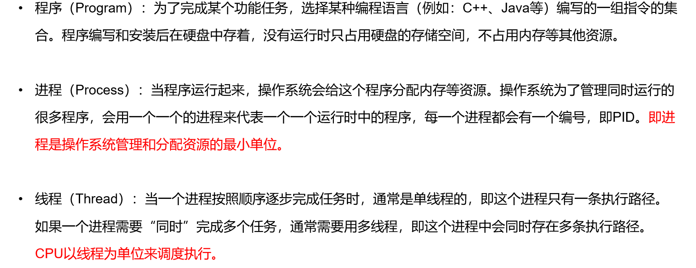


程序是未运行状态。进程是程序的运行时的状态。线程是进程中的其中1条执行路径。

2、串行（serial）、并行（parallel）、并发（concurrent）

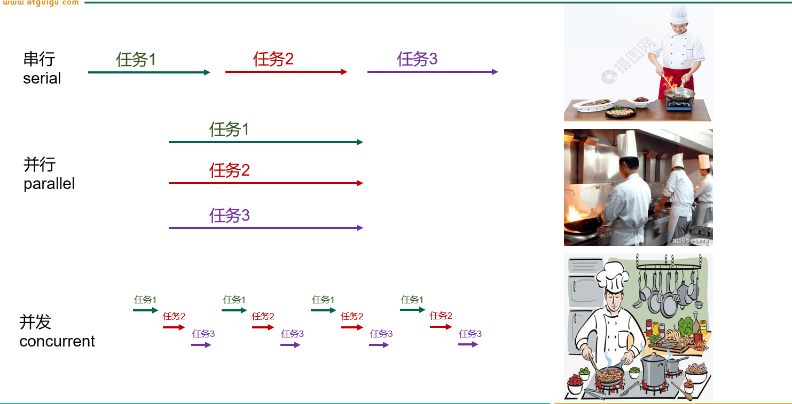


3、如何查看进程、线程的情况

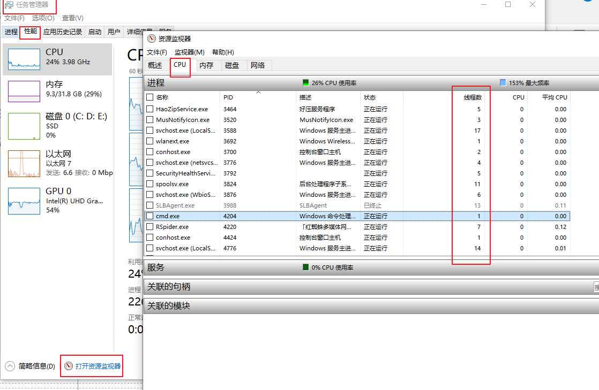


## 2.2 Java中如何创建和启动多线程

Java中一共提供了4种方式来创建和启动多线程。但是我们JavaSE阶段只先2种，在高级部分再讲另外2种。

如果我们没有单独再开启其他线程，Java程序也有一个线程，是main线程，即主线程。现在希望创建和开启main线程之外的线程，与main线程是“同时”执行的关系，并发的关系。

### 2.2.1 继承Thread类

步骤：

- 编写一个类，可以是有名字的类，也可以是匿名的类，继承Thread类
  - 如果这个线程类的代码比较简洁，而且这个线程类的对象只有1个，那么通常使用匿名的类就可以
  - 如果这个线程类的代码比较复杂，而且这个线程类的对象需要创建多个，那么请用有名的类

- `必须`重写public void run()方法
  - 在run方法中编写，你这个线程需要完成的任务代码

- 创建这个线程类的对象
- 启动线程，调用线程类对象的`start`方法

```java
package com.atguigu.thread;

public class MyThread extends Thread{
    @Override
    public void run() {
        //例如：打印1-10的偶数
        for(int i=2; i<=10; i+=2){
            System.out.println("偶数：" + i);
        }
    }
}

```

```java
package com.atguigu.thread;

public class TestMyThread {
    public static void main(String[] args) {
        MyThread m = new MyThread();
        m.start();


        //打印1-10的奇数
        for(int i=1; i<=10; i+=2){
            System.out.println("奇数：" + i);
        }
    }
}

```


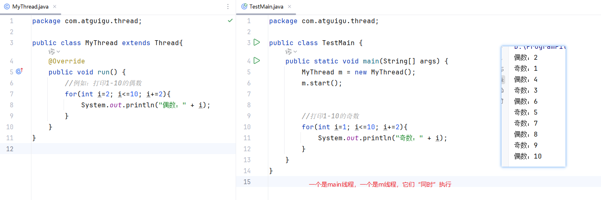

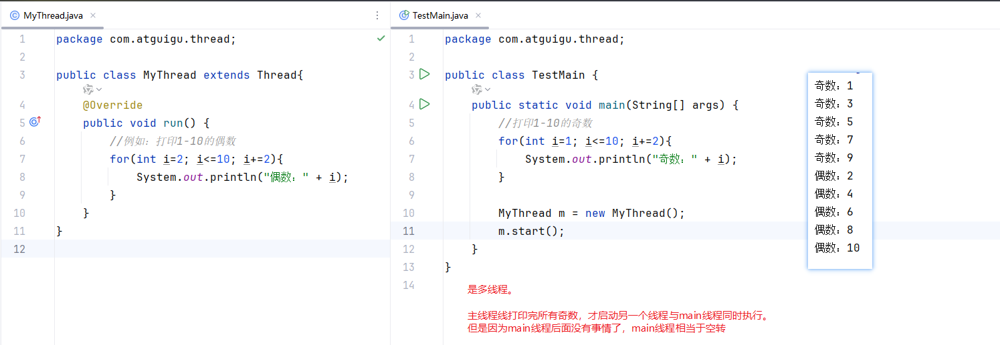

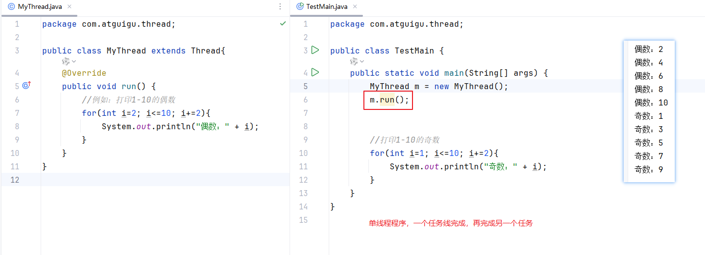

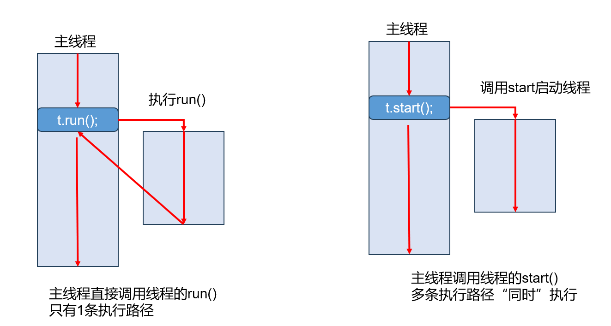

### 2.2.2 实现Runnable接口

Java中类有单继承的限制。有时候，需要使用实现接口的方式来创建多线程。

步骤：

- 让线程类实现java.lang.Runnable接口
- `必须`重写public void run()方法
  - 在run方法中编写，你这个线程需要完成的任务代码

- 创建接口的实现类的对象
- 创建一个Thread类的对象，让它帮我们代理一下这个接口的实现类的对象
- 调用Thread类的start方法

```java
package com.atguigu.thread;

public class MyRunnable implements Runnable{
    @Override
    public void run() {
        //例如：打印1-10的偶数
        for(int i=2; i<=10; i+=2){
            System.out.println("偶数：" + i);
        }
    }
}

```

```java
package com.atguigu.thread;

public class TestMyRunnable {
    public static void main(String[] args) {
        MyRunnable m = new MyRunnable();
        //m.start();//MyRunnable的父类没有start方法，它自己也没有start方法

        Thread t = new Thread(m);//m是被代理的，t是代理
        t.start();//当t线程被启动后，CPU会调用t的run方法，然后t的run再调用m的run方法
        /*
        下面是Thread类的run方法源码：
         public void run() {
            if (target != null) {
                target.run();
            }
        }
        这里的target就是我们创建t对象时，传入的m对象。
         */


        //打印1-10的奇数
        for(int i=1; i<=10; i+=2){
            System.out.println("奇数：" + i);
        }
    }
}

```


### 2.2.3 问题答疑

#### 1、使用JUnit和main方法来测试多线程的区别

- JUnit的test方法自己的代码执行完，就退出JVM了，不会管其他线程是否执行完
- main方法如果自己的代码执行完了，也不会立刻退出JVM，会等其他线程执行完

```java
package com.atguigu.thread;

public class ThreadDemo extends Thread{
    @Override
    public void run() {
        for(int i=1; i<=1000; i++){
            System.out.println("线程类：" + i);
        }
    }
}

```

```java
package com.atguigu.thread;

import org.junit.Test;

public class TestJUnitOrMain {
    /*
    @Test
    public void test(){
        ThreadDemo t = new ThreadDemo();
        t.start();

        for(int i=1; i<=1000; i++) {
            System.out.println("我是JUnit的线程");
        }
    }*/

    public static void main(String[] args) {
        ThreadDemo t = new ThreadDemo();
        t.start();


        System.out.println("我是main的线程");
    }
}
```


#### 2、如果需要多个线程，是不是每一个线程都要弄一个独立的类？

- 如果多个线程的事情是一样的，那么类只需要1个，但是对象可以创建多个。
- 如果多个线程的事情不一样，那么需要每个任务单独写一个类。


练习题1：启动3个线程打印1-100

写法1:   3个线程写3个类（重复代码多）

写法2：一个线程类，创建3个对象

练习题2：

启动一个线程打印1-100，启动一个线程打印26个字母

```java
package com.atguigu.thread;

public class PrintNumberThread1 extends Thread{
    @Override
    public void run() {
        for(int i=1; i<=100; i++){
            //getName()方法是从Thread类继承，它用于获取线程的名字
            System.out.println(getName() + ":" + i);
        }
    }
}

```

```java
package com.atguigu.thread;

public class PrintNumberThread2 extends Thread{
    @Override
    public void run() {
        for(int i=1; i<=100; i++){
            System.out.println(i);
        }
    }
}

```

```java
package com.atguigu.thread;

public class PrintNumberThread3 extends Thread{
    @Override
    public void run() {
        for(int i=1; i<=100; i++){
            System.out.println(i);
        }
    }
}

```

```java
package com.atguigu.thread;

public class TestPrintNumberThread {
    public static void main(String[] args) {
        //启动3个线程打印1-100
        PrintNumberThread1 t1 = new PrintNumberThread1();
        PrintNumberThread2 t2 = new PrintNumberThread2();
        PrintNumberThread3 t3 = new PrintNumberThread3();

        t1.start();
        t2.start();
        t3.start();
    }
}

```

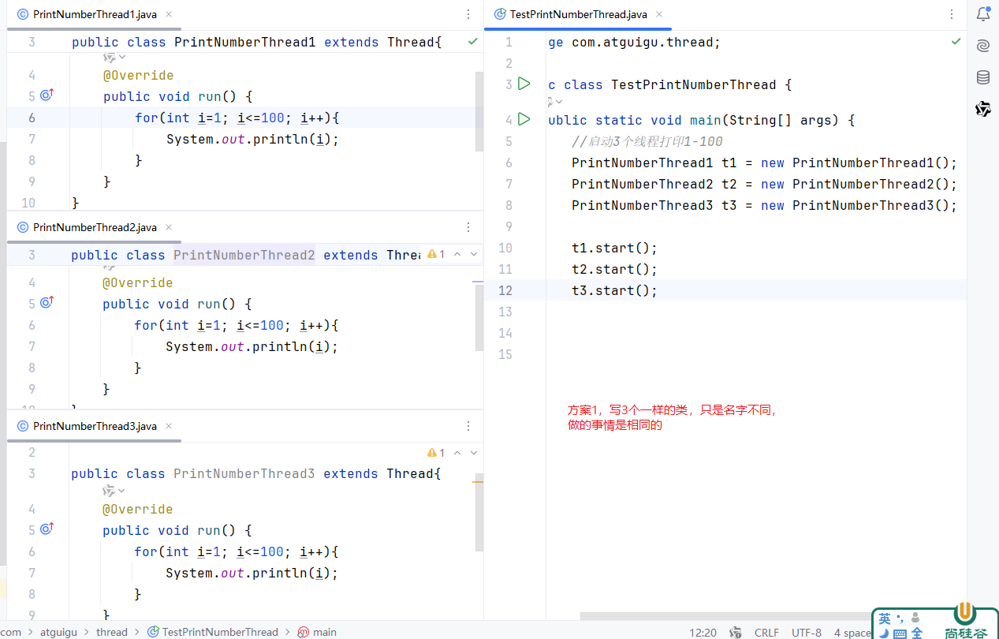

```java
package com.atguigu.thread;

public class PrintNumberThread extends Thread{
    @Override
    public void run() {
        for(int i=1; i<=100; i++){
            //getName()方法是从Thread类继承，它用于获取线程的名字
            System.out.println(getName() + ":" + i);
        }
    }
}

```

```java
package com.atguigu.thread;

public class TestPrintNumbersThread {
    public static void main(String[] args) {
        //启动3个线程打印1-100
        PrintNumberThread t1 = new PrintNumberThread();
        PrintNumberThread t2 = new PrintNumberThread();
        PrintNumberThread t3 = new PrintNumberThread();

        t1.start();
        t2.start();
        t3.start();
    }
}
```


练习题2参考答案：

```java
package com.atguigu.thread;

public class PrintLettersThread extends Thread{
    @Override
    public void run() {
        for(int i=1; i<=3; i++) {
            for (char c = 'a'; c <= 'z'; c++) {
                System.out.println(getName() + "字母：" + c);
            }
        }
    }
}
```

```java
package com.atguigu.thread;

public class TestTwoThread {
    public static void main(String[] args) {
        PrintNumberThread1 t1 = new PrintNumberThread1();
        PrintLettersThread t2 = new PrintLettersThread();

        t1.start();
        t2.start();
    }
}
```

## 2.3 Thread类的方法

### 2.3.1 方法系列1

- String getName()：获取线程名称
  - 默认的线程名称，Thread-下标
- void setName(新名称)：修改线程名字

- int getPriority()：获取优先级
- void setPriority(优先级)：设置优先级
  - 优先级高的线程的几率更大，但是不代表优先级低完全没机会。
  - 如果要设置优先级，必须在 MIN_PRIORITY 到 MAX_PRIORITY 范围内，否则会发生IllegalArgumentException非法参数异常。
  - MIN_PRIORITY：1
  - MAX_PRIORITY ：10
  - NORM_PRIORITY：5

- static Thread currentThread()  ：可以在任意方法中通过Thread.currentThread()调用这个方法，至于获取的是哪个线程对象，就要看是哪个线程在执行这句代码。

```java
package com.atguigu.thread;

public class ThreadMethodDemo extends Thread{
    @Override
    public void run() {
        System.out.println("我是：" + getName() );
//        System.out.println("我是：" + this.getName() );
//        System.out.println("我是：" + super.getName() );
    }
}

```

```java
package com.atguigu.thread;

public class TestThreadMethodDemo {
    public static void main(String[] args) {
        ThreadMethodDemo t = new ThreadMethodDemo();
        t.setName("尚硅谷线程");
        //t.setPriority(1000);//IllegalArgumentException非法参数异常
        t.setPriority(Thread.MAX_PRIORITY);
        t.start();

        System.out.println("在主方法中，也可以获取t线程的名称：" + t.getName());
        System.out.println("获取t线程的优先级：" + t.getPriority());

        Thread mainThread = Thread.currentThread();
        System.out.println("mainThread的线程名称：" + mainThread.getName());
        System.out.println("mainThread的线程优先级：" + mainThread.getPriority());
    }
}

```

```java
package com.atguigu.thread;

public class MyRunnable implements Runnable{
    @Override
    public void run() {
        Thread thread = Thread.currentThread();
        //获取执行这句代码的线程对象
        //例如：打印1-10的偶数
        for(int i=2; i<=10; i+=2){
            System.out.println(thread.getName() + "偶数：" + i);
        }
    }
}

```

```java
package com.atguigu.thread;

public class TestMyRunnable {
    public static void main(String[] args) {
        MyRunnable m = new MyRunnable();
        Thread t = new Thread(m);//m是被代理的，t是代理
        t.setName("t线程");
        t.start();//当t线程被启动后，CPU会调用t的run方法，然后t的run再调用m的run方法
    }
}

```


### 2.3.2 方法系列2

#### 1、sleep

- static void sleep(long millis)：用于让当前线程（执行这句语句的线程）进入休眠状态。时间单位是毫秒。

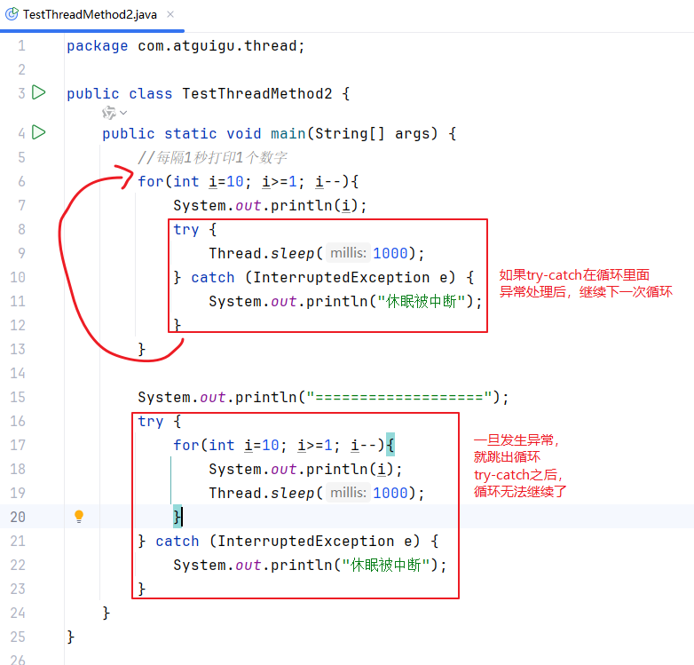

```java
package com.atguigu.thread;

public class TestThreadMethod2 {
    public static void main(String[] args) {
        //每隔1秒打印1个数字
        for(int i=10; i>=1; i--){
            System.out.println(i);
            try {
                Thread.sleep(1000);
            } catch (InterruptedException e) {
                System.out.println("休眠被中断");
            }
        }

//        System.out.println("===================");
//        try {
//            for(int i=10; i>=1; i--){
//                System.out.println(i);
//                Thread.sleep(1000);
//            }
//        } catch (InterruptedException e) {
//            System.out.println("休眠被中断");
//        }
    }
}

```


#### 2、yield

static void yield()：用于让当前线程暂停一下，让出CPU，重新加入抢夺CPU的队伍。比喻：皇上来到了何小妃的寝宫，小何说，皇上你应该雨露均沾，重新考虑一下今晚是不是我。

```java
package com.atguigu.thread;

public class TestThreadMethod3 {
    public static void main(String[] args) {
        Thread t1 = new Thread(){
            @Override
            public void run() {
                for(int i=1; i<=10; i++){
                    System.out.println("数字线程：" + i);
                    if(i==5){
                        Thread.yield();//让当前t1线程暂停一下，让出CPU
                    }
                }
            }
        };
        t1.start();

        Thread t2 = new Thread(){
            @Override
            public void run() {
                for(char i='a'; i<='z'; i++){
                    System.out.println("字母线程：" + i);
                }
            }
        };
        t2.start();
    }
}

```


#### 3、join

public final void join()：让调用这个方法的线程“挤到”当前线程（执行这句代码的线程）之前，阻塞当前线程。当前线程只能等待，等待“挤”进来的线程执行完才能继续。

public final void join(long millis)：让调用这个方法的线程“挤到”当前线程（执行这句代码的线程）之前，阻塞当前线程。当前线程只能等待，等待一段时间，时间到了才能继续。

```java
package com.atguigu.thread;

public class TestThreadMethod4 {
    public static void main(String[] args) {
        Thread t2 = new Thread(){
            @Override
            public void run() {
                for(char i='a'; i<='z'; i++){
                    System.out.println("字母线程：" + i);
                    try {
                        Thread.sleep(1000);
                    } catch (InterruptedException e) {
                        e.printStackTrace();
                    }
                }
            }
        };
        t2.start();
        Thread t1 = new Thread(){
            @Override
            public void run() {
                for(int i=1; i<=10; i++){
                    System.out.println("数字线程：" + i);
                    if(i==5){
                        try {
//                            t2.join();//t1等待t2完全执行完
                            t2.join(5000);//t1等待t2  5秒
                        } catch (InterruptedException e) {
                            e.printStackTrace();
                        }
                    }
                }
            }
        };
        t1.start();

    }
}

```

#### 4、stop

stop：早期有这个方法，但是后面发现有问题，现在以及废弃了，不推荐使用了。

```java
package com.atguigu.thread;

public class TestThreadMethod5 {
    public static void main(String[] args) {
        Thread t = new Thread(){
            @Override
            public void run() {
                for(int i=1; i<=1000; i++){
                    try {
                        Thread.sleep(10);
                    } catch (InterruptedException e) {
                        e.printStackTrace();
                    }
                    System.out.println(i);
                }
            }
        };
        t.start();//开启

        //下面是主线程代码
        try {
            Thread.sleep(100);
        } catch (InterruptedException e) {
            e.printStackTrace();
        }
        t.stop();//停止
    }
}

```

> 那么如何优雅地停止线程？
>
> 可以使用变量来控制线程的执行，通常用boolean 类型的flag变量。

```java
package com.atguigu.thread;

public class TestThreadMethod6 {
    static boolean flag = true;//成员变量，静态变量，因为main方法是静态方法
    public static void main(String[] args) {
      //  final boolean flag = true;//局部变量
        //局部变量如果在局部内部类（含匿名内部类）中使用时，就会自动(Java 8之后）或手动（Java8之前）加final
        Thread t = new Thread(){
            @Override
            public void run() {
                //flag为true表示循环继续，为false循环结束
                for(int i=1; i<=1000 && flag; i++){
                    try {
                        Thread.sleep(10);
                    } catch (InterruptedException e) {
                        e.printStackTrace();
                    }
                    System.out.println(i);
                }
            }
        };
        t.start();//开启

        //下面是主线程代码
        try {
            Thread.sleep(100);
        } catch (InterruptedException e) {
            e.printStackTrace();
        }
        flag = false;
    }
}

```

#### 5、interrupt

interrupt：中断线程。但是它只对线程的休眠sleep、等待wait、加塞join等方法有效果。某个线程被中断会发生InterruptedException线程中断异常，它是编译时异常，必须try-catch处理。或者当前方法不处理，又能throws的话，也可以抛给调用者处理。大部分都是try-catch。

```java
package com.atguigu.thread;

public class TestThreadMethod7 {
    public static void main(String[] args) {
        Thread t = new Thread() {
            @Override
            public void run() {
                try {
                    for (int i = 1; i <= 1000; i++) {
                        Thread.sleep(10);
                        System.out.println(i);
                    }
                } catch (InterruptedException e) {
                    e.printStackTrace();
                }
                //如果try-catch在循环里面，那么中断只影响单次的循环
                //如果try-catch在循环外面，那么中断会影响整个循环
            }
        };
        t.start();//开启

        //下面是主线程代码
        try {
            Thread.sleep(100);
        } catch (InterruptedException e) {
            e.printStackTrace();
        }
        t.interrupt();//中断t线程
    }
}

```


### 2.3.3 方法系列3

void setDaemon(boolean on) 将该线程标记为守护线程或用户线程。

守护线程是指为其他线程服务的后台线程。例如：JVM中的GC线程等。这种线程不会独立存在。当非守护线程结束后，守护线程会自动结束。

```java
package com.atguigu.thread;

public class TestThreadMethod8 {
    public static void main(String[] args) {
        Thread t = new Thread() {
            @Override
            public void run() {
                while(true){
                    System.out.println("我默默的守护你！！");
                    try {
                        Thread.sleep(10);//只是为了让我们便于观察，否则会打印很快
                    } catch (InterruptedException e) {
                        e.printStackTrace();
                    }
                }
            }
        };
        t.setDaemon(true);//让t线程称为守护线程
        t.start();//开启


        //主线程继续做他的事情
        for(int i=1; i<=10; i++){
            System.out.println("main:" + i);
            try {
                Thread.sleep(20);
            } catch (InterruptedException e) {
                e.printStackTrace();
            }
        }

    }
}

```


### 2.3.4 练习题

案例：编写龟兔赛跑多线程程序，设赛跑长度为30米

兔子的速度是10米每秒，兔子每跑完10米休眠的时间10秒

乌龟的速度是1米每秒，乌龟每跑完10米的休眠时间是1秒

要求：要等兔子和乌龟的线程结束，主线程（裁判）才能公布最后的结果。跑30米用时最少的线程算赢。

写法1：

```java
package com.atguigu.exer;

public class Rabbit extends Thread{
    private long time;
    @Override
    public void run() {
        long start = System.currentTimeMillis();
        //兔子的速度是10米每秒，兔子每跑完10米休眠的时间10秒
        //跑1米约100毫秒
        for(int i=1; i<=30; i++){//i值代表米数
            try {
                Thread.sleep(100);//跑1米的时间
            } catch (InterruptedException e) {
                e.printStackTrace();
            }
            System.out.println("兔子跑了" + i +"米");
            if(i==10 || i==20){
                System.out.println("兔子开始休息....");
                try {
                    Thread.sleep(10000);
                } catch (InterruptedException e) {
                    e.printStackTrace();
                }
            }
        }
        long end = System.currentTimeMillis();
        time = end - start;
        System.out.println("兔子跑完30米，共" + time +"毫秒");
    }

    public long getTime() {
        return time;
    }
}

```

```java
package com.atguigu.exer;

public class Tortoise extends Thread{
    private long time;
    @Override
    public void run() {
        long start = System.currentTimeMillis();
        //乌龟的速度是1米每秒，乌龟每跑完10米的休眠时间是1秒
        for(int i=1; i<=30; i++){//i值代表米数
            try {
                Thread.sleep(1000);//跑1米的时间
            } catch (InterruptedException e) {
                e.printStackTrace();
            }
            System.out.println("乌龟跑了" + i +"米");
            if(i==10 || i==20){
                System.out.println("乌龟开始休息....");
                try {
                    Thread.sleep(1000);
                } catch (InterruptedException e) {
                    e.printStackTrace();
                }
            }
        }
        long end = System.currentTimeMillis();
        time = end - start;
        System.out.println("乌龟跑完30米，共" + time +"毫秒");
    }

    public long getTime() {
        return time;
    }
}

```

```java
package com.atguigu.exer;

public class TestRunner {
    public static void main(String[] args) {
        Rabbit r = new Rabbit();
        Tortoise t = new Tortoise();

        r.start();
        t.start();

        try {
            t.join();//t线程“挤”到了main线程的前面，main线程被阻塞了，要等到t线程执行完才能继续
        } catch (InterruptedException e) {
            e.printStackTrace();
        }
        try {
            r.join();//r线程“挤”到了main线程的前面，main线程被阻塞了，要等到r线程执行完才能继续
        } catch (InterruptedException e) {
            e.printStackTrace();
        }
        /*
        (1)r先跑完，t后跑完，那么main线程会因为t.join();导致不会往下执行，
                直到t跑完，才往下，往下时，r已经早就跑了，无法阻塞main，main方法继续往下走，输出比赛结果
        (2)t先跑完，r后跑完，那么main线程先会因为t.join();导致不会往下执行，
                直到t跑完，才往下，往下时， 遇到了    r.join();，此时r没有跑完，继续阻塞main线程，
                直到r跑完，main方法继续往下走，输出比赛结果
        （3）r,t同时跑完， 那么main线程先会因为t.join();导致不会往下执行，
                直到t跑完，才往下，往下时，r也跑了，无法阻塞main，main方法继续往下走，输出比赛结果
         */

        if(r.getTime() < t.getTime()) {//if(兔子跑完30米的时间 < 乌龟跑完30米的时间) {
            System.out.println("兔子赢");
        }else if(r.getTime()> t.getTime()){//else if(兔子跑完30米的时间 < 乌龟跑完30米的时间) {
            System.out.println("乌龟赢");
        }else {
            System.out.println("平局");
        }
    }
}

```

写法2：

```java
package com.atguigu.exer;

public class Runner extends Thread{
    private long time;
    private long runTimePerMeter;//跑完1米的时间
    private long restTimeTenMeters;//跑完10米休息的时间
    private int distance;//距离

    public Runner(String name, long runTimePerMeter, long restTimeTenMeters, int distance) {
        super(name);
        this.runTimePerMeter = runTimePerMeter;
        this.restTimeTenMeters = restTimeTenMeters;
        this.distance = distance;
    }

    @Override
    public void run() {
        long start = System.currentTimeMillis();
        for(int i=1; i<=distance; i++){//i值代表米数
            try {
                Thread.sleep(runTimePerMeter);//跑1米的时间
            } catch (InterruptedException e) {
                e.printStackTrace();
            }
            System.out.println(getName() + "跑了" + i +"米");
            if(i==10 || i==20){
                System.out.println(getName()+ "开始休息....");
                try {
                    Thread.sleep(restTimeTenMeters);
                } catch (InterruptedException e) {
                    e.printStackTrace();
                }
            }
        }
        long end = System.currentTimeMillis();
        time = end - start;
        System.out.println(getName() + "跑完30米，共" + time +"毫秒");
    }

    public long getTime() {
        return time;
    }
}

```

```java
package com.atguigu.exer;

public class TestRunner2 {
    public static void main(String[] args) {
        Runner r = new Runner("兔子",100,10000,30);
        Runner t = new Runner("乌龟",1000,1000,30);

        r.start();
        t.start();

        try {
            t.join();//t线程“挤”到了main线程的前面，main线程被阻塞了，要等到t线程执行完才能继续
        } catch (InterruptedException e) {
            e.printStackTrace();
        }
        try {
            r.join();//r线程“挤”到了main线程的前面，main线程被阻塞了，要等到r线程执行完才能继续
        } catch (InterruptedException e) {
            e.printStackTrace();
        }
        /*
        (1)r先跑完，t后跑完，那么main线程会因为t.join();导致不会往下执行，
                直到t跑完，才往下，往下时，r已经早就跑了，无法阻塞main，main方法继续往下走，输出比赛结果
        (2)t先跑完，r后跑完，那么main线程先会因为t.join();导致不会往下执行，
                直到t跑完，才往下，往下时， 遇到了    r.join();，此时r没有跑完，继续阻塞main线程，
                直到r跑完，main方法继续往下走，输出比赛结果
        （3）r,t同时跑完， 那么main线程先会因为t.join();导致不会往下执行，
                直到t跑完，才往下，往下时，r也跑了，无法阻塞main，main方法继续往下走，输出比赛结果
         */

        if(r.getTime() < t.getTime()) {//if(兔子跑完30米的时间 < 乌龟跑完30米的时间) {
            System.out.println("兔子赢");
        }else if(r.getTime()> t.getTime()){//else if(兔子跑完30米的时间 < 乌龟跑完30米的时间) {
            System.out.println("乌龟赢");
        }else {
            System.out.println("平局");
        }
    }
}

```


## 2.4 线程安全

### 2.4.1 什么是线程安全问题？


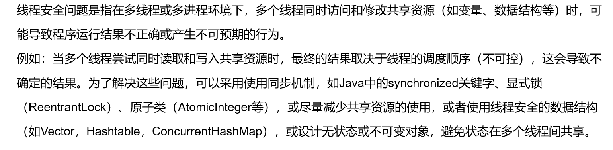


### 2.4.2 演示线程不安全的现象

案例：现在有一个演唱会卖票，总共票数有300张（下面可以先用10张演示一下）。演唱会票通过多个平台同时售票。

```java
package com.atguigu.unsafe;

public class TicketThreadOne extends Thread{
   // private int total = 10;//成员变量之实例变量
    //如果是实例变量，3个对象各自是独立的，无法共享
    //只有同一个对象，被3个线程使用时，才会共享。

    private static int total = 10;//成员变量之静态变量
    //静态变量是所有对象共享，所有线程使用这个类都是共享同一个

    @Override
    public void run() {
//        int total = 10;//局部变量
        while(total>0){
            try {
                Thread.sleep(10);//加入这个休眠， 只是为了让问题暴露明显
            } catch (InterruptedException e) {
                e.printStackTrace();
            }
            total--;
            System.out.println(getName() +"卖出1张票，剩余" + total);
        }
    }
}

```

```java
package com.atguigu.unsafe;

public class TestTicketThreadOne {
    public static void main(String[] args) {
        TicketThreadOne t1 =new TicketThreadOne();
        TicketThreadOne t2 =new TicketThreadOne();
        TicketThreadOne t3 =new TicketThreadOne();

        t1.start();
        t2.start();
        t3.start();
    }
}

```

```
运行结果：
Thread-2卖出1张票，剩余7
Thread-1卖出1张票，剩余7
Thread-0卖出1张票，剩余7
Thread-2卖出1张票，剩余6
Thread-1卖出1张票，剩余5
Thread-0卖出1张票，剩余5
Thread-1卖出1张票，剩余4
Thread-2卖出1张票，剩余2
Thread-0卖出1张票，剩余3
Thread-2卖出1张票，剩余1
Thread-0卖出1张票，剩余0
Thread-1卖出1张票，剩余-1
Thread-2卖出1张票，剩余-2
```


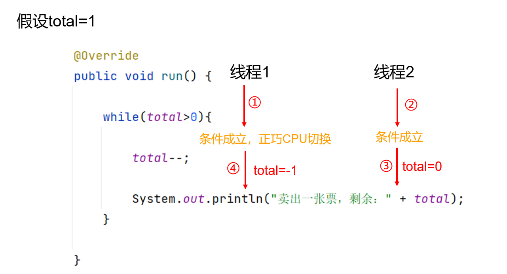


### 2.4.3 解决线程不安全问题

方向：加锁

JavaSE阶段：同步锁 synchronized

#### 1、如何使用同步锁

同步锁的使用方式有2种：

```java
【修饰符】 class 类名{
    【其他修饰符】 synchronized  返回值类型 方法名(形参列表){ //同步方法
        需要加锁的语句代码;
    }
}
```

```java
【修饰符】 class 类名{
    【其他修饰符】  返回值类型 方法名(形参列表){ 
        
        //语句
        
        synchronized(监视器对象){//同步代码块
            需要加锁的语句代码;
        }
        
        //语句
        
    }
}
```

#### 2、同步锁的原理

Java中每一个对象都可以作为线程的监视器对象。比喻：每一个人都可以当厕所所长。

Java的对象结构分为3个部分：

- 对象头：包含对象所有的类指针，锁标记，GC标记等等
  - 其中一个锁标记，就可以用于表示当前对象是不是被某个线程给“占用”
  - 比喻：谁要进入厕所，那么先要征得所长的同意，让所长拿着你的名字牌，表示厕所中有人了，其他人只能等待，等到你用完厕所。用完厕所的人，要从所长那里把名字牌拿走。
  - 对应Java的话，就是某个线程要进入synchronized标记的方法或代码块执行之前，先要占用这个监视器对象的锁标记位。其他线程只能等待，等待这个线程执行完这段代码为止。才继续抢这个监视器对象。执行完同步方法或同步代码块的线程，要清除标记位。
- 实例变量数据区：对象的属性
- 填充空白：可选，不是所有对象都有。当整个对象占用的内存不是字节的整数倍，那么会填充一些空白凑够字节的整数倍，例如：boolean类型的值占1位

#### 3、如何选择同步锁对象

- 具有竞争关系的多个线程，选择**`“同一个”`**同步锁对象即可。对象的类型不重要。
- 必须是一个对象。
- 特别是this对象，以及非静态方法要小心，同步锁对象是不是同一个，要判断清楚


> 对于同步方法来说，同步锁对象是默认的，非静态方法是this对象，静态方法是当前类的Class对象。


#### 4、同步范围的选择问题

同步范围太大，会导致其他线程没有机会

同步范围太小，线程安全问题不彻底

#### 5、演示代码1：错误使用同步方法

```java
package com.atguigu.unsafe2;

public class TicketThreadOne extends Thread{
    private static int total = 10;//成员变量之静态变量

    /*
    run()方法是非静态方法，默认的同步锁对象是this。
    this在这里代表调用run方法的对象。相当于是右边测试类t1,t2,t3三个对象

    以下代码有问题
     */
    @Override
    public synchronized void run() {
        while(total>0){
            try {
                Thread.sleep(10);//加入这个休眠， 只是为了让问题暴露明显
            } catch (InterruptedException e) {
                e.printStackTrace();
            }
            total--;
            System.out.println(getName() +"卖出1张票，剩余" + total);
        }
    }
}

```

```java
package com.atguigu.unsafe2;

public class TestTicketThreadOne {
    public static void main(String[] args) {
        TicketThreadOne t1 =new TicketThreadOne();
        TicketThreadOne t2 =new TicketThreadOne();
        TicketThreadOne t3 =new TicketThreadOne();

        t1.start();
        t2.start();
        t3.start();
    }
}

```


#### 6、演示代码2：正确使用同步方法

```java
package com.atguigu.safe;

public class TicketThreadOne extends Thread{
    private static int total = 1000;//成员变量之静态变量

    @Override
    public void run() {
        while(total>0) {
            saleOneTicket();
        }

    }

    public static synchronized void saleOneTicket(){
       if(total>0){
            try {
                Thread.sleep(10);//加入这个休眠， 只是为了让问题暴露明显
            } catch (InterruptedException e) {
                e.printStackTrace();
            }
            total--;
            System.out.println(Thread.currentThread().getName() + "卖出1张票，剩余" + total);
        }
    }
}

```

```java
package com.atguigu.safe;

public class TestTicketThreadOne {
    public static void main(String[] args) {
        TicketThreadOne t1 =new TicketThreadOne();
        TicketThreadOne t2 =new TicketThreadOne();
        TicketThreadOne t3 =new TicketThreadOne();

        t1.start();
        t2.start();
        t3.start();
    }
}

```

#### 7、演示代码3：同步代码块

```java
package com.atguigu.safe2;

public class TicketThreadOne extends Thread{
    private static int total = 10;//成员变量之静态变量
    private static Object lock = new Object();

    @Override
    public  void run() {
        while(total>0){
            try {
                Thread.sleep(10);//加入这个休眠， 只是为了让问题暴露明显
            } catch (InterruptedException e) {
                e.printStackTrace();
            }
            //""是字符串对象，凡是""引起来都是字符串常量对象，可以被共享
            //synchronized ("何敬泽") {
            synchronized (lock){
                if(total>0) {
                    total--;
                    System.out.println(getName() + "卖出1张票，剩余" + total);
                }
            }
        }
    }
}

```

```java
package com.atguigu.safe2;

public class TestTicketThreadOne {
    public static void main(String[] args) {
        TicketThreadOne t1 =new TicketThreadOne();
        TicketThreadOne t2 =new TicketThreadOne();
        TicketThreadOne t3 =new TicketThreadOne();

        t1.start();
        t2.start();
        t3.start();
    }
}
```

#### 8、演示代码4：错误使用同步方法

```java
package com.atguigu.safe;

public class TicketThreadOne extends Thread{
    private static int total = 10;//成员变量之静态变量

    @Override
    public void run() {
        while(total>0) {
            saleOneTicket();
        }
    }

    /*
    方法是非静态的，那么它的默认锁对象/监视器对象 是 this，
     */
    public synchronized void saleOneTicket(){ //有问题
       if(total>0){
            try {
                Thread.sleep(10);//加入这个休眠， 只是为了让问题暴露明显
            } catch (InterruptedException e) {
                e.printStackTrace();
            }
            total--;
            System.out.println(getName() + "卖出1张票，剩余" + total);
        }
    }
}

```

```java
package com.atguigu.safe;

public class TestTicketThreadOne {
    public static void main(String[] args) {
        TicketThreadOne t1 =new TicketThreadOne();
        TicketThreadOne t2 =new TicketThreadOne();
        TicketThreadOne t3 =new TicketThreadOne();

        t1.start();
        t2.start();
        t3.start();
    }
}

```

#### 9、演示代码5：正确使用同步方法，非静态

```java
package com.atguigu.safe3;

public class TicketThreadTwo implements Runnable{
    private int total = 1000;//成员变量之实例变量，实例变量是每一个对象独立的

    @Override
    public void run() {
        while(total>0){
         /*   try {
                Thread.sleep(10);//加入这个休眠， 只是为了让问题暴露明显
            } catch (InterruptedException e) {
                e.printStackTrace();
            }*/
            saleOneTicket();
        }
    }

    /*
    非静态方法，默认锁对象是this。
    这里this只有1个，因为右边测试类只new了一个TicketThreadTwo的对象
     */
    public synchronized void saleOneTicket(){
        if(total>0){

            total--;
            System.out.println(Thread.currentThread().getName() +"卖出1张票，剩余" + total);
        }
    }
}

```

```java
package com.atguigu.safe3;

public class TestTicketThreadTwo {
    public static void main(String[] args) {
        TicketThreadTwo t = new TicketThreadTwo();
        //因为TicketThreadTwo类的对象只有1个，那么total只有1份
        //所以它也是共享数据

        Thread t1 = new Thread(t);
        Thread t2 = new Thread(t);
        Thread t3 = new Thread(t);
        t1.start();
        t2.start();
        t3.start();


    }
}

```


#### 10、演示代码6：正确使用同步代码块

```java
package com.atguigu.safe4;

public class TicketThreadTwo implements Runnable{
    private int total = 1000;//成员变量之实例变量，实例变量是每一个对象独立的
//    private Object lock = new Object();

    @Override
    public void run() {
        while(total>0){
//            synchronized (lock) {
            synchronized (this) {
                if (total > 0) {
                    total--;
                    System.out.println(Thread.currentThread().getName() + "卖出1张票，剩余" + total);
                }
            }
        }
    }

}

```

```java
package com.atguigu.safe4;

public class TestTicketThreadTwo {
    public static void main(String[] args) {
        TicketThreadTwo t = new TicketThreadTwo();
        //因为TicketThreadTwo类的对象只有1个，那么total只有1份
        //所以它也是共享数据

        Thread t1 = new Thread(t);
        Thread t2 = new Thread(t);
        Thread t3 = new Thread(t);
        t1.start();
        t2.start();
        t3.start();


    }
}

```


#### 11、如何判断自己的线程代码有没有安全问题？

- 多个线程
- 共享资源：可以是同一个变量，同一个对象，同一个文件，同一个打印机等
- 多个线程对这些共享数据有写/修改操作

只要上面的3个条件同时满足了，就一定有安全问题。就一定要加synchronized或 juc中的锁。

## 2.5 单例设计模式

1、什么是设计模式？

大量程序员在编写代码解决问题的过程中，总结出来的一套一套的解决方案。

针对不同的问题，通常会有固定的解决方案的模板。

常见的设计模式有23种。设计模式在不同的语言之间有通用性。

在Java中，具体的设计模式的实现代码与其他语言有区别。因为不同的语言的语法毕竟是不同的。但是理论是相同的。


2、什么是单例设计模式？

为了保证某个类的对象在整个程序运行期间，只有唯一的1个。不允许出现第2个。

要解决这个问题，咱们在设计这个类的时候，必须有一套模板，规范，要求。这些模板就是单例设计模式。


3、单例设计模式的分类

写法有很多种，大致可以分为2大类：

（1）饿汉式单例设计模式：饥不择食，着急。这个类的对象在类初始化时，就提前创建好了。不管你现在用不用这个对象。

（2）懒汉式单例设计模式：拖延。这个类的对象必须等到别人第一次来明确获取这个对象了，才new。

饿汉式的写法1：

```java
public enum SingleOne {
    INSTANCE //这个对象名自己取就可以，不一定非得是INSTANCE
}
```

饿汉式的写法2：

```java
public class SingleTwo {
    //这里final可选，但是public和static必选的，static表示共享同一个，public外面可以获取到
    public static final SingleTwo INSTANCE = new SingleTwo();
    private SingleTwo(){//构造器私有化

    }
}

```

饿汉式的写法3：

```java
public class SingleThree {
    private static final SingleThree INSTANCE = new SingleThree();
    private SingleThree(){//构造器私有化

    }
    public static SingleThree getInstance(){
        return INSTANCE;
    }
}
```

懒汉式的写法1：

```java
package com.atguigu.single;

public class SingleFour {
    private SingleFour(){//构造器私有化
      
    }

    public static SingleFour getInstance(){
        return Inner.INSTANCE;//INSTANCE的类型是SingleFour
    }

    private static class Inner{//静态内部类
        private static SingleFour INSTANCE = new SingleFour();
    }
}

```

懒汉式的写法2：

```java
package com.atguigu.single;

public class SingleFive {
    private static SingleFive instance;

    private SingleFive(){//构造器私有化

    }

    public static synchronized SingleFive getInstance(){
        if(instance == null){
            instance = new SingleFive();
        }
        return instance;
    }
/*    public static SingleFive getInstance(){
        //SingleFive.class代表当前类的Class对象，它是共享的
        synchronized (SingleFive.class) {
            if (instance == null) {
                instance = new SingleFive();
            }
            return instance;
        }
    }*/

    /*public static SingleFive getInstance(){
        //SingleFive.class代表当前类的Class对象，它是共享的
        if(instance == null) {
            synchronized (SingleFive.class) {
                if (instance == null) {
                    instance = new SingleFive();
                }
            }
        }
        return instance;
    }*/
}

```


> 问：请写出一种单例类的写法？
>
> 问：请写出一种懒汉式单例类的写法？
>
> 问：请写出一种饿汉式单例类的写法？


## 2.6  生产者与消费者问题

### 2.6.1 什么是生产者与消费者问题？

当一个或一些线程负责往“共享数据区”填充/增加数据，这个/些线程被称为生产者线程，

另一个或一些线程负责从“共享数据区”消耗/减少数据，这个/些线程被称为消费者线程。

当它俩/它们“一起”工作时可能出现：

- 线程安全问题：解决办法是加synchronized
- 线程的协作问题：
  - 当“共享数据区”空的时候，消费者线程应该停下来“等待”，生产者可以工作。消费者线程需要等待别人“唤醒”它或指定等待时间。
  - 当“共享数据区”满的时候，生产者线程应该停下来“等待”，消费者可以工作。生产者线程需要等待别人“唤醒”它或指定等待时间。
  - 所以解决办法就是 等待与唤醒机制。JavaSE阶段用的是 wait() 和notify() /notifyAll()。这些方法定义在了Object类中。
  - 而且它们都必须由 同步锁对象/监视器对象来调用，不能由别人调用。


### 2.6.2 演示案例：一个生产者VS一个消费者

案例需求：小何觉得学习Java太难了，退学了。在宏福苑开了小餐馆。小餐馆就2个人，他和他女朋友。一个是厨师一个是服务员。

厨师负责把菜做好，放到平台上。服务员负责把平台上的菜拿走。

#### 写法1

```java
package com.atguigu.cook;

public class Window {
    public static final Window INSTANCE = new Window();
    private static final int MAX_VALUE = 5;
    private int total;//代表窗台上的菜的数量

    private Window(){

    }

    public synchronized void put(){
        if(total>=MAX_VALUE){
            try {
                this.wait();
            } catch (InterruptedException e) {
                e.printStackTrace();
            }
        }
        total++;
        System.out.println(Thread.currentThread().getName()+"做好一份菜，剩余" + total);
        this.notify();
    }

    public synchronized void take(){
        if(total<=0){
            try {
                this.wait();
            } catch (InterruptedException e) {
                e.printStackTrace();
            }
        }
        total--;
        System.out.println(Thread.currentThread().getName()+"取走一份菜，剩余" + total);
        this.notify();
    }
}

```

```java
package com.atguigu.cook;

public class Cook extends Thread{
    @Override
    public void run() {
//        Window w = new Window();
        Window w = Window.INSTANCE;
        while(true){
            w.put();
            try {
                Thread.sleep(100);//加上休眠时间，便于观察
            } catch (InterruptedException e) {
                e.printStackTrace();
            }
        }
    }
}

```

```java
package com.atguigu.cook;

public class Waiter extends Thread{
    @Override
    public void run() {
//        Window w = new Window();
        Window w = Window.INSTANCE;
        while(true){
            w.take();
            try {
                Thread.sleep(500);//加上休眠时间，便于观察
            } catch (InterruptedException e) {
                e.printStackTrace();
            }
        }
    }
}

```

```java
package com.atguigu.cook;

public class TestCook {
    public static void main(String[] args) {
        Cook c = new Cook();
        c.setName("小何");
        Waiter w = new Waiter();
        w.setName("翠花");

        c.start();
        w.start();
    }
}
```


#### 写法2

```java
package com.atguigu.cook2;

public class Window {
    private static final int MAX_VALUE = 5;
    private static int total;//代表窗台上的菜的数量

    //静态方法的同步锁对象是当前类的Class对象
    public synchronized static void put(){
        if(total>=MAX_VALUE){
            try {
                Window.class.wait();
            } catch (InterruptedException e) {
                e.printStackTrace();
            }
        }
        total++;
        System.out.println(Thread.currentThread().getName()+"做好一份菜，剩余" + total);
        Window.class.notify();
    }

    public synchronized static void take(){
        if(total<=0){
            try {
                Window.class.wait();
            } catch (InterruptedException e) {
                e.printStackTrace();
            }
        }
        total--;
        System.out.println(Thread.currentThread().getName()+"取走一份菜，剩余" + total);
        Window.class.notify();
    }
}

```

```java
package com.atguigu.cook2;

public class Cook extends Thread{
    @Override
    public void run() {

        while(true){
            Window.put();
            try {
                Thread.sleep(100);//加上休眠时间，便于观察
            } catch (InterruptedException e) {
                e.printStackTrace();
            }
        }
    }
}

```

```java
package com.atguigu.cook2;

public class Waiter extends Thread{
    @Override
    public void run() {
        while(true){
            Window.take();
            try {
                Thread.sleep(500);//加上休眠时间，便于观察
            } catch (InterruptedException e) {
                e.printStackTrace();
            }
        }
    }
}

```

```java
package com.atguigu.cook2;

public class TestCook {
    public static void main(String[] args) {
        Cook c = new Cook();
        c.setName("小何");
        Waiter w = new Waiter();
        w.setName("翠花");

        c.start();
        w.start();
    }
}
```


