# 四、方法

## 1.1 方法的概念

在Java中方法用method表示，在其他语言中习惯叫函数（function）。

方法的定义：代表`一个`，`独立的`,`可复用的`，`功能`。

```java
System.out.println(xx);  //println是一个方法，它完成打印xx到控制台，且换行。
Math.random();  //random()是一个方法，它完成了 随机产生1个[0,1)的double值给你。

Scanner input = new Scanner(System.in);
String str = input.next();  //next()是一个方法，它完成了 从控制台读取一个字符串的功能。
int num = input.nextInt();  //nextInt()是一个方法，它完成了 从控制台读取一个int值的功能。

public static void main(String[] args) 的main是一个方法，称为主方法，它作为Java程序的入口，由JVM自动调用。
```


## 1.2 方法的声明和调用

### 1.2.1 原则

- 方法必须先声明后使用
- 方法不调用不执行，调用一次执行一次

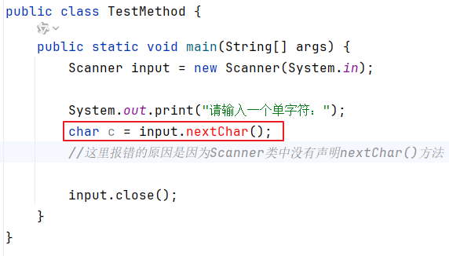

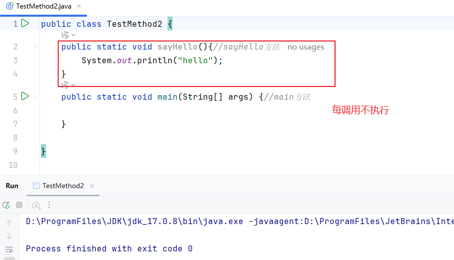

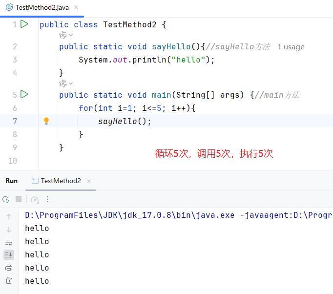

### 1.2.2 方法的声明（必须掌握5个部分叫什么）

位置要求：方法必须定义/声明在类中，方法外

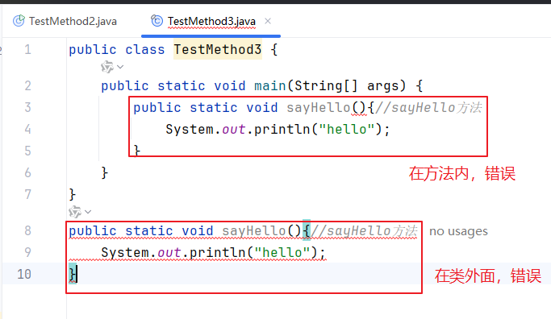

声明的格式：

```java
public class 类名{
    【①修饰符】 ②返回值类型  ③方法名(【④形参列表】){
        ⑤方法体语句;
    }
}

//【】表示可选
```

初期学习方法，方法由5个部分组成。

- 【①修饰符】：今天的方法暂时都是public static，public代表公共的，任意位置可见，static代表静态的，不需要new对象就可以调用这个方法。
- ②返回值类型：代表这个方法的功能执行完之后，是否需要给调用者返回一个结果。
- - 如果需要，就要说明这个结果的类型，它可以是8种基本数据类型或引用数据类型（Sstring类、数组等）。只要是非void，那么方法体中就必须有一个语句 return 结果; 否则代码编译不通过，报错。
  - 如果不需要，就用void表示。
- ③方法名：一个标识符而已。遵循小驼峰命名法，从第二个单词开始首字母大写。见名知意，即方法名能代表方法功能的意思。
- ⑤方法体语句：完成方法功能的语句。
- 【④形参列表】：它们其实就是一组变量，只不过这组变量的值需要在调用的时候由实参来赋值。如果这个方法完成功能的时候不需要额外的数据，那么形参列表可以省略。

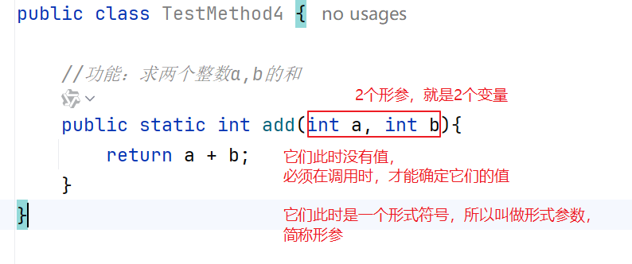

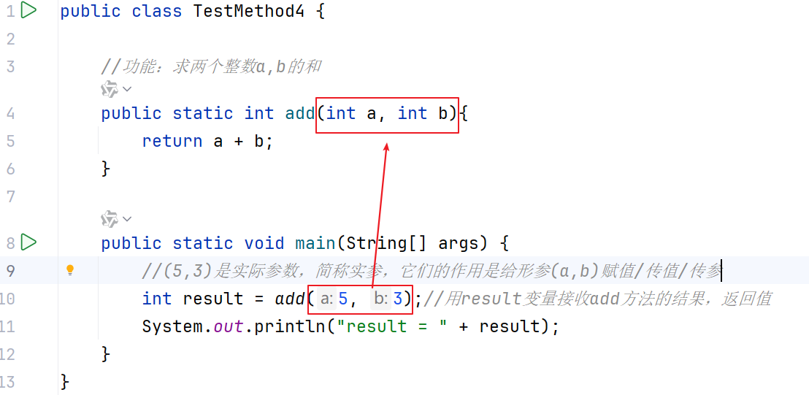

## 1.3 方法调用过程内存分析（理解）

### 1.3.1 过程说明

入栈：当方法被调用执行时，JVM会给这个方法在“栈”内存开辟一块`独立的`内存空间，用于存储这个方法的局部变量等信息。

出栈：当这个方法调用结束，JVM会`自动释放`这个方法占用的`栈内存`空间。

栈：先进后出

### 1.3.2 案例1

```java
public class TestMethodMemory {
    public static void main(String[] args) {
        int a = 1;
        int b = 2;
        add(a,b);
        int result = add(a, b);
        System.out.println("result = " + result);
    }

    public static int add(int a, int b){
        int sum = a + b;
        return sum;
    }
}

```

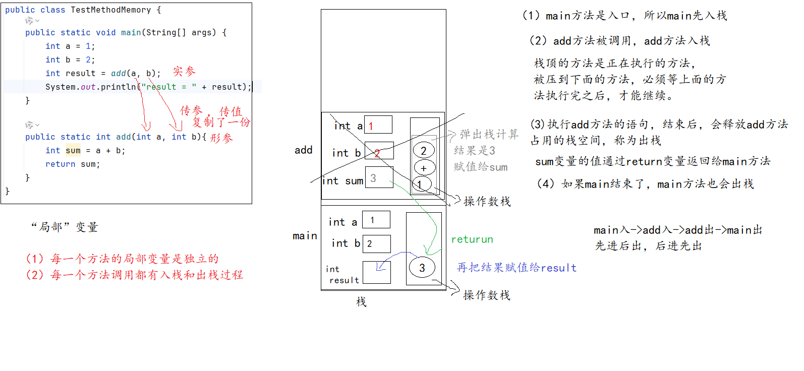


### 1.3.2 案例2

```java
public class TestMethodMemory2 {
    public static void main(String[] args) {
        int[] nums = {1, 2, 3, 4};
        reverse(nums);
        for (int i = 0; i < nums.length; i++) {
            System.out.print(nums[i]+" ");
        }
    }
    //实现了数组的反转
    public static void reverse(int[] arr){
        for(int left=0,right=arr.length-1; left<right; left++,right--){
            int temp = arr[left];
            arr[left] = arr[right];
            arr[right] = temp;
        }
    }
}

```


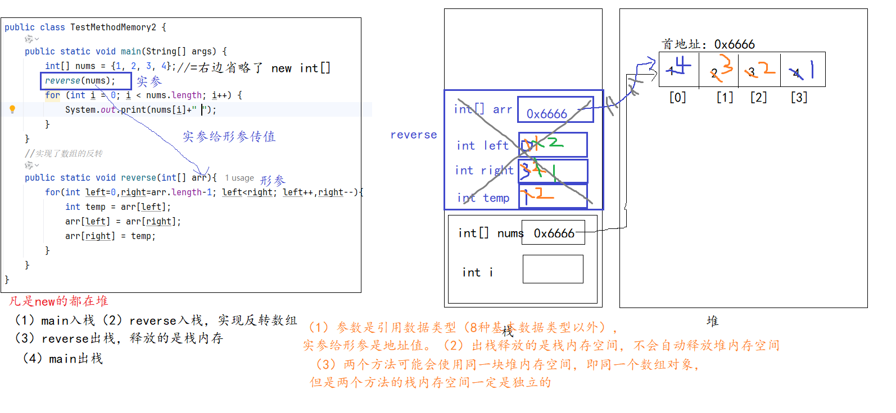

## 1.6 方法的参数传递机制

### 1.6.1 实参给形参传值

- 形参：形式参数
- 实参：实际参数

实参是负责给形参传值，要求实参的类型、个数、顺序 与形参要一一对应。


### 1.6.2 形参的修改是不是会影响实参（理解，会分析代码题即可）

#### 1、参数是基本数据类型

结论：参数是基本数据类型时，实参把数据值copy给形参之后，它们就没关系了。形参无论怎么修改，都与实参无关。

```java
public class TestParamDemo1 {
    public static void main(String[] args) {
        int x = 1;
        int y = 2;
        System.out.println("x = " + x +"，y = " + y );
        swap(x,y);
        System.out.println("x = " + x +"，y = " + y );
    }

    public static void swap(int a, int b){
        int temp = a;
        a = b;
        b = temp;
    }
}

```

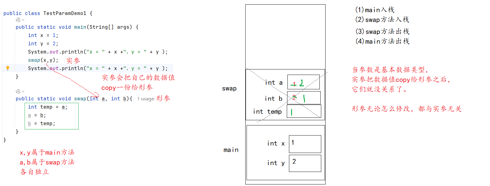

```java
public class TestParamDemo2 {
    public static void main(String[] args) {
        int x= 1;
        System.out.println("x = " + x);
        change(x);
        System.out.println("x = " + x);
    }

    public static void change(int a){
        ++a;
        a=100;
    }
}

```


#### 2、参数是引用数据类型

Java的类，数组等都是引用数据类型，这里用数组演示。

实参给形参的是`首地址的副本`，意味着形参和实参指向同一个对象，所以形参的修改会影响实参。

```java
public class TestParamDemo3 {
    public static void main(String[] args) {
        int[] nums = {10,20,30,40,50};
        print(nums);
        swap(nums,0,4);
        print(nums);
    }

    //功能：交换arr数组中 arr[left]与arr[right]的元素
    public static void swap(int[] arr, int left, int right){
        int temp = arr[left];
        arr[left] = arr[right];
        arr[right] = temp;
    }

    public static void print(int[] arr){
        for (int i = 0; i < arr.length; i++) {
            System.out.print(arr[i] +" ");
        }
        System.out.println();
    }
}

```

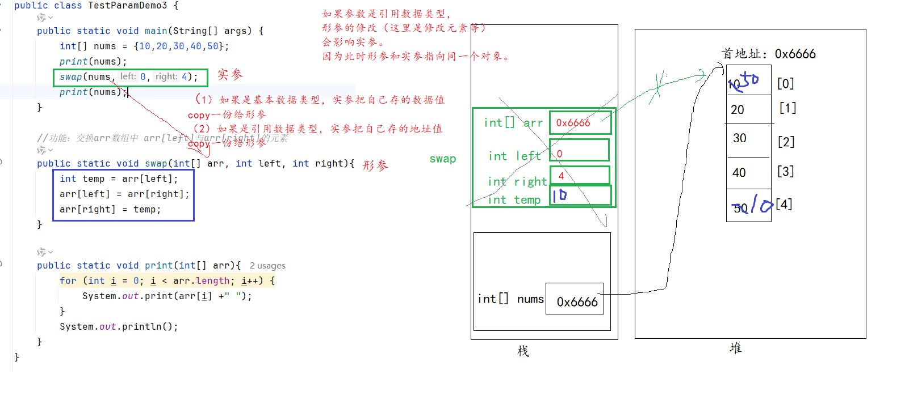

### 1.6.3 形参指向新对象

结论：一旦形参指向新对象，与原来的实参无关了。

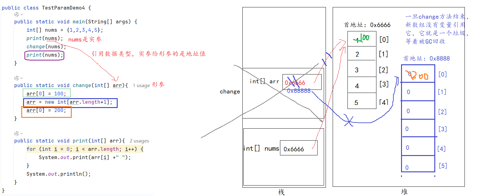


```java
public class TestParamDemo4 {
    public static void main(String[] args) {
        int[] nums = {1,2,3,4,5};
        print(nums);//1,2,3,4,5
        change(nums);
        print(nums);
        //100,2,3,4,5
    }

    public static void change(int[] arr){
        arr[0] = 100;
        arr = new int[arr.length+1];//让形参指向新的数组对象，接下来arr的任何操作与实参无关了
        arr[0] = 200;
    }

    public static void print(int[] arr){
        for (int i = 0; i < arr.length; i++) {
            System.out.print(arr[i] +" ");
        }
        System.out.println();
    }
}
```

如果要拿到新数组，就必须返回新数组。

```java
public class TestParamDemo4_2 {
    public static void main(String[] args) {
        int[] nums = {1,2,3,4,5};
        print(nums);//1,2,3,4,5
        nums = change(nums);//接收新数组的首地址
        print(nums);
        //100,2,3,4,5
    }

    public static int[] change(int[] arr){
        arr[0] = 100;
        arr = new int[arr.length+1];//让形参指向新的数组对象，接下来arr的任何操作与实参无关了
        arr[0] = 200;
        return arr;//返回新的数组的首地址
    }

    public static void print(int[] arr){
        for (int i = 0; i < arr.length; i++) {
            System.out.print(arr[i] +" ");
        }
        System.out.println();
    }
}

```

## 1.7 方法的重载(Overload)（掌握，概念要会背）

1、方法的重载：在同一个类中，出现两个方法的`名称相同`，`形参列表不同`，这样的形式称为方法的重载。方法重载与修饰符、返回值类型、方法体无关。

形参列表不同：可以是`个数不同`，`类型不同`，`顺序不同`，不看形参名

2、为什么要重载？

- 方法名见名知意，如果两个方法的功能是相同的，那么它的名称就应该一样

  

3、重载方法的调用原则

- 先找实参的个数、类型、顺序与形参`完全匹配`的，如果找到了，就可以确定了
- 如果没找到完全匹配的，要找可以`兼容`的，大的类型可以兼容小的类型，例如double可以兼容int

```java
public class TestOverload {
    public static void main(String[] args) {
        //把光标放到调用方法的()里面，按快捷键Ctrl + p
        System.out.println(max(4,6));
        System.out.println(max(4.0,6.0));
        System.out.println(max(4,5,2));

        System.out.println(max(4,6.0));
//        System.out.println(max(4.0,6.0,7.0));//找不到最匹配的，也找不到可以兼容的，就报错了
    }

    //求两个整数的最大值
    public static int max(int a, int b) {
        return a > b ? a : b;
    }

    //求3个整数的最大值
    public static int max(int a, int b, int c) {
        int max = a > b ? a : b;
        return max > c ? max : c;
    }

    //求两个小数的最大值
    public static double max(double a, double b) {
        return a > b ? a : b;
    }
}
```


## 1.8 可变参数（会用即可）

可变参数是指参数的个数不确定，可以是0~n个参数值。

可变参数的标记符号：...

可变参数的使用方式，用使用数组的方式使用它即可。

|                   | 可变参数                                              | 数组类型     |
| ----------------- | ----------------------------------------------------- | ------------ |
| 形式（以int为例） | int...                                                | int[]        |
| 调用时            | 可以传入0~n个元素，也可以直接传入数组                 | 只能传入数组 |
| 限制              | 一个方法最多只能有1个可变参数，而且必须是最后一个形参 | 没有限制     |

```java
public class TestVarParam {
    public static void main(String[] args) {
        System.out.println(add(1,2,3,4,5,6));
        System.out.println(add(1,2));
        System.out.println(add(1));
        System.out.println(add());

        int[] arr = {10,20,30,40,50};
        System.out.println(add(arr));
    }

    //定义一个方法，用于求任意个整数的和
    public static int add(int... nums){
        int sum = 0;
        for (int i = 0; i < nums.length; i++) {
            sum += nums[i];
        }
        return sum;
    }

/*    public static void test(int... nums, int... args){//错误，一个方法不能有2个可变参数

    }*/
}

```

```java
public class TestVarParam3 {
    public static void main(String[] args) {
        System.out.println(concat("[","]","-","hello","world","java","atguigu"));
        System.out.println(concat("","","-","hello","world","java","atguigu"));
        System.out.println(concat("","",",","hello","world","java","atguigu"));
        System.out.println(concat("[","]",","));
    }

    //实现拼接n个字符串，拼接的时候可以指定开头的符号，结尾的符号，中间连接的符号
    //hello  world  java   atguigu
    //[hello,world,java,atguigu]
    //hello-world-java-atguigu
    public static String concat(String start, String end, String middle, String... args){
        String str = start;

        for (int i = 0; i < args.length; i++) {
            if(i==0){
                str += args[i];
            }else{
                str += middle + args[i];
            }
        }

        str += end;
        return str;
    }
}
```


## 1.9 递归调用

1、递归调用的概念：一个方法自己调用自己。

2、递归调用要注意：必须有出口。意思是满足xxx条件递归，不满足xx条件不递归。如果无条件递归，就会发生StackOverflowError。


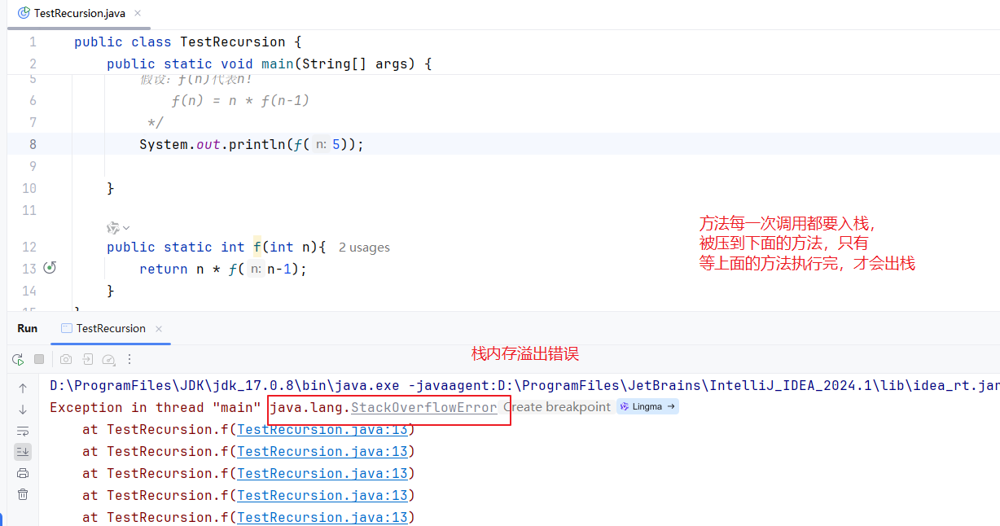

```java
public class TestRecursion {
    public static void main(String[] args) {
        //求n!
        /*
        假设：f(n)代表n!
            f(n) = n * f(n-1)
         */
        System.out.println(f(5));
        System.out.println(loop(5));

    }

    public static int f(int n){
        if(n>1) {
            return n * f(n - 1);//自己调用自己就叫递归
        }
        return 1;
    }

    public static int loop(int n){//用循环代替递归
        int result = 1;
        for(int i=n; i>=1; i--){
            result *= i;
        }
        return result;
    }
}

```

