# 五、面向对象的基本概念

1、什么是对象

对象是指这类事物的一个`具体`的个体，实体。

2、类与对象的关系

类是创建对象的模板，设计图。比喻：造汽车，先有汽车的设计图。设计图中体现了这里车的所有特征/构造/结构和功能。

对象是具体的实例，个体。比喻：对象是具体的一辆车，能开的车。

## 1.3 如何声明类和创建对象？

先有类还是先有对象？

从需求分析/设计项目的角度：先观察对象，才能总结有哪些类？

从代码实现的角度来说：先声明类，后创建对象。

### 1、声明类的格式（必须掌握）

```java
【修饰符】 class 类名{

}
```

暂时今天类的修饰符只写public。public的类有一个要求，类名与xx.java的源文件名必须一致。

类名：见名知意。遵循大驼峰命名法，即每一个单词首字母大写。

```java
public class Student {
}

```

### 2、创建对象的格式（必须掌握）

```java
类名 对象名 = new 类名();
```

new是用来创建实例对象的关键字，实际意义是在堆中开辟一块内存用于存储对象的信息。例如：创建数组对象时，在堆中开辟一块空间，用来存储数组的元素。

```java
public class TestStudent {//主类，包含主方法的类
    public static void main(String[] args) {
        Student s1 = new Student();
        Student s2 = new Student();
        Student s3 = new Student();

        System.out.println(s1);//Student@4eec7777
        System.out.println(s2);//Student@3b07d329
        System.out.println(s3);//Student@41629346
        //s1,s2,s3都是引用数据类型的变量，s1,s2,s3中都是存储对象的首地址。
        //这一点与数组一样

        int[] arr = {1,2,3,4};
        System.out.println(arr);//[I@404b9385
    }
}

```

Student是一个类，也是一种数据类型，称为类类型。它与String是一样的。只不过String是JRE核心类库中已经提前写好的类，Student是咱们自己写的类。同理，数组类型，例如：int[]，String[]，double[]也是数据类型，是数组类型。它们统统都是引用数据类型。

## 1.4 包（认识，会创建即可）

### 1.4.1 包的作用

- 可以通过不同的文件夹/包帮我们管理众多的类，分门别类进行管理，便于后期的维护

- 可以避免类的重名，有了包之后，类的全名称就是包.类名

- 包结合权限修饰符（public，protected，缺省，private等）来限定类或成员可见性范围。关于权限修饰符后面再讲。

  

### 1.4.2 如何声明包？

```java
package 包名;
```

- 这句代码必须在源文件的首行。
- 包名的命名规范：所有单词都小写，单词直接使用.分割。习惯上用公司域名倒置的写法，例如：com.atguigu.xxx

在IDEA中这样操作：

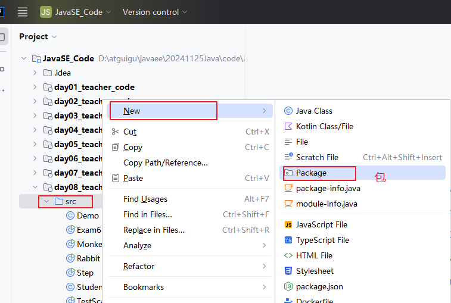


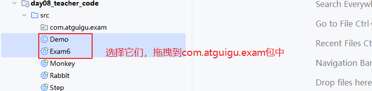

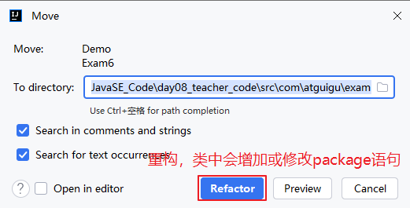

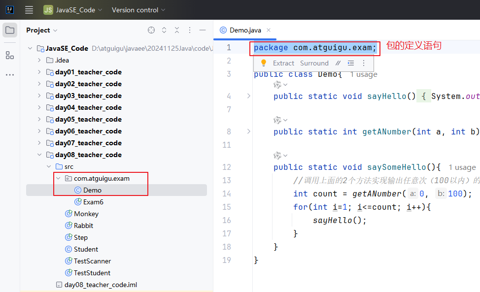

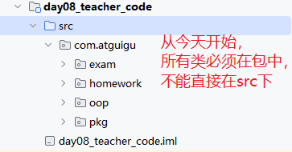

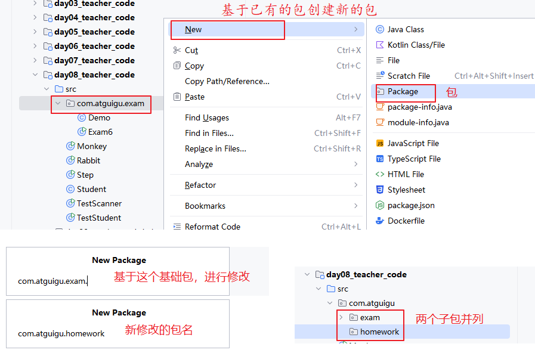

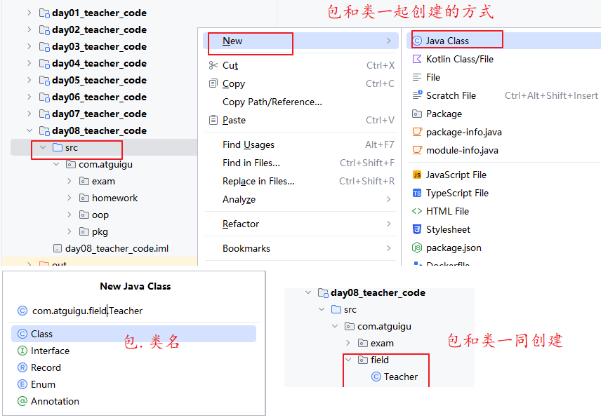

### 1.4.3 如何跨包使用类

- 如果是同一个包，类之间互相使用，不需要import
- 如果是跨包（不同包），类之间互相使用，必须import 或 使用类的全名称
- 只有public修饰的类才能跨包使用
- java.lang包的类，在任意地方使用都不需要导包，例如：String，Math，System 它们都是java.lang包的类

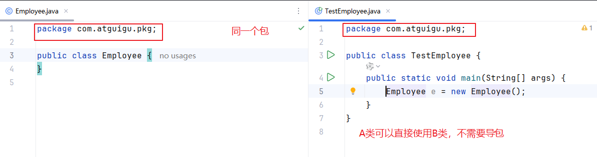

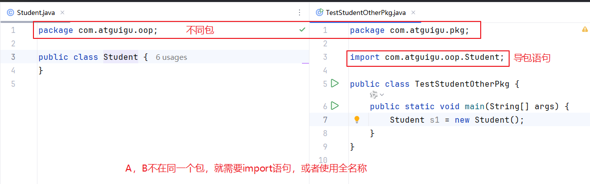

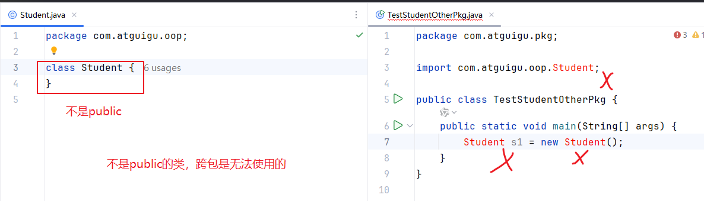

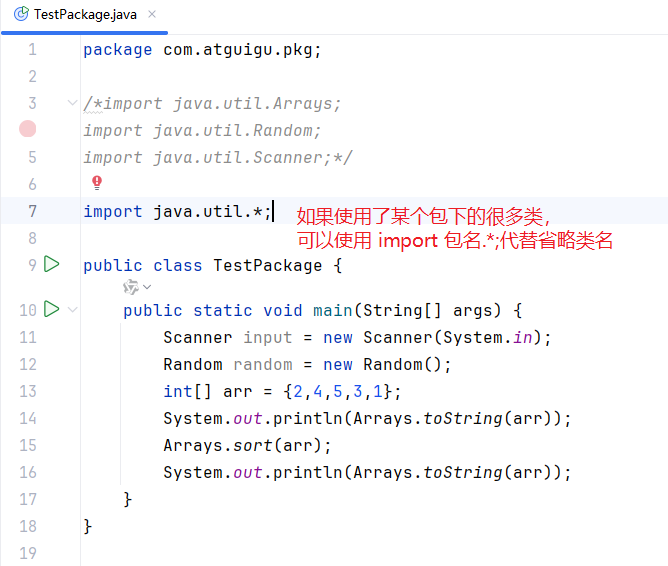

```java
package com.atguigu.pkg;

import java.util.Arrays;
import java.util.Date;
import java.util.Random;
import java.util.Scanner;

public class TestPackage {
    public static void main(String[] args) {
        Scanner input = new Scanner(System.in);
        Random random = new Random();
        int[] arr = {2,4,5,3,1};
        System.out.println(Arrays.toString(arr));
        Arrays.sort(arr);
        System.out.println(Arrays.toString(arr));

        /*
        使用不同包的，同名词的类
        java.util.Date类
        java.sql.Date类
        如果两个类都要用，只能一个是import，一个是全名称。或者两个都全名称。
         */
        Date d = new Date();
        java.sql.Date d2 = new java.sql.Date(2024,12,3);
    }
}

```


## 1.5 类的成员之一：成员变量（必须掌握）

### 1.5.1 成员变量的声明格式

```java
【修饰符】 class 类名{
    【修饰符】 数据类型 变量名;
}
```

成员变量的声明位置：类中方法外。

如果把变量定义/声明到方法里面，那就是局部变量，不是成员变量。

【修饰符】：暂时都是public


### 1.5.2 成员变量的分类

#### 1、静态变量

静态变量不依赖于对象，不属于对象，属于类。跨类使用它，建议通过“类名.静态变量”。也可以通过“对象.静态变量”。

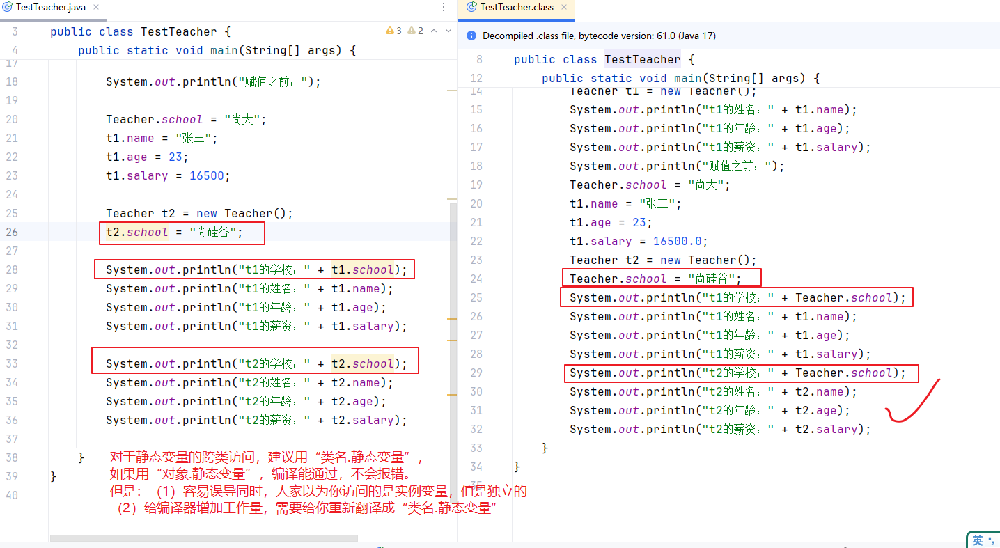

#### 2、实例变量/非静态成员变量

实例变量依赖于对象，属于对象。跨类使用它，必须通过“对象.实例变量”。


### 1.5.3 成员变量的特点

#### 1、成员变量有默认值

| 类型                           | 默认值   |
| ------------------------------ | -------- |
| byte                           | 0        |
| short                          | 0        |
| int                            | 0        |
| long                           | 0L       |
| float                          | 0.0F     |
| double                         | 0.0      |
| char                           | '\u0000' |
| boolean                        | false    |
| String等类、数组等引用数据类型 | null     |

#### 2、是否共享性特点

`静态变量`的值是**所有对象**`共享的`，因为它属于类，而类是创建对象模板，所以即使用类创建对象后通过对象访问static变量进行修改，也是对其他用这个类创建对象的这个值的修改，因为这是**共享的**。

`实例变量`的值是每一个对象`独立的`，因为它属于某个对象。

> 问：成员变量该不该加static？
>
> 原则：看这个成员变量的值是不是所有对象共享的，只存一份的，如果是，就应该是静态的，否则就不能是静态的。


### 1.5.4 示例代码

```java
package com.atguigu.field;

public class Teacher {
    //静态变量，静态成员变量，学校名是所有老师共享的
    public static String school;

    //实例变量，非静态成员变量，姓名、年龄、薪资是每一个老师独立的
    public String name;//姓名
    public int age;//年龄
    public double salary;//薪资
}
```

```java
package com.atguigu.field;

public class TestTeacher {
    public static void main(String[] args) {
//        System.out.println("姓名：" + name);//错误，name在Teacher类中
       // System.out.println("姓名：" + Teacher.name);//错误，因为name没有static

        System.out.println("学校：" + Teacher.school);//null

        Teacher t1 = new Teacher();//创建对象，创建实例
        System.out.println("t1的姓名：" + t1.name);//null
        System.out.println("t1的年龄：" + t1.age);//0
        System.out.println("t1的薪资：" + t1.salary);//0.0

//        int a;//局部变量
//        System.out.println("a = " + a);//报错，因为a没有初始化

        System.out.println("赋值之前：");

        Teacher.school = "尚大";
        t1.name = "张三";
        t1.age = 23;
        t1.salary = 16500;

        Teacher t2 = new Teacher();
        t2.school = "尚硅谷";//推荐用 Teacher.school = "尚硅谷";

        System.out.println("t1的学校：" + t1.school);//推荐用 Teacher.school
        System.out.println("t1的姓名：" + t1.name);
        System.out.println("t1的年龄：" + t1.age);
        System.out.println("t1的薪资：" + t1.salary);

        System.out.println("t2的学校：" + t2.school);//推荐用 Teacher.school
        System.out.println("t2的姓名：" + t2.name);
        System.out.println("t2的年龄：" + t2.age);
        System.out.println("t2的薪资：" + t2.salary);

    }
}

```

```java
package com.atguigu.field;

public class Chinese {//中国人
    //国家名是所有中国人共享的，所以是静态的
    private static String country;

    //每一个中国人的名字是独立的，所以是非静态的
    private String name;
}

```

```java
package com.atguigu.field;

public class Account {//银行账号
    //银行利率是大家统一的，所以是静态的
    private static double rate;//利率

    //余额是每个人不同的，所以是非静态的
    private double balance;//余额
}

```


### 1.5.5 引用数据类型的成员变量

```java
package com.atguigu.field;

public class Husband {//丈夫
    //以下是两个引用数据类型的实例变量
    public String name;
    public Wife wife;
}

```

```java
package com.atguigu.field;

public class Wife {//妻子
    //以下是两个引用数据类型的实例变量
    public String name;
    public Husband husband;
}

```

```java
package com.atguigu.field;

public class TestHusbandWife {//主类，测试类
    public static void main(String[] args) {
        Husband h = new Husband();
        h.name = "张三";

        Wife w = new Wife();
        w.name = "翠花";

        h.wife = w;//给h.wife变量赋值一个Wife类型的对象
        w.husband = h;

        System.out.println("丈夫的姓名：" + h.name +"，他妻子的姓名：" + h.wife.name);
        System.out.println("妻子的姓名：" + w.name +"，她的丈夫的姓名：" + w.husband.name);
    }
}

```

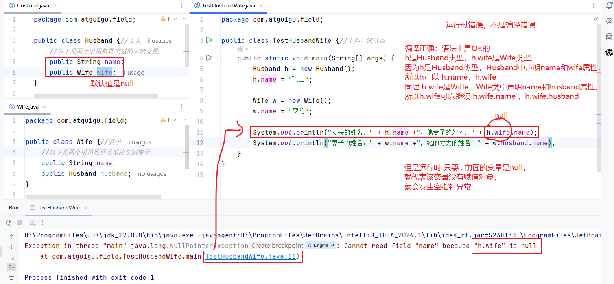


### 1.5.6 成员变量的内存分析

#### 1、实例变量的内存分析

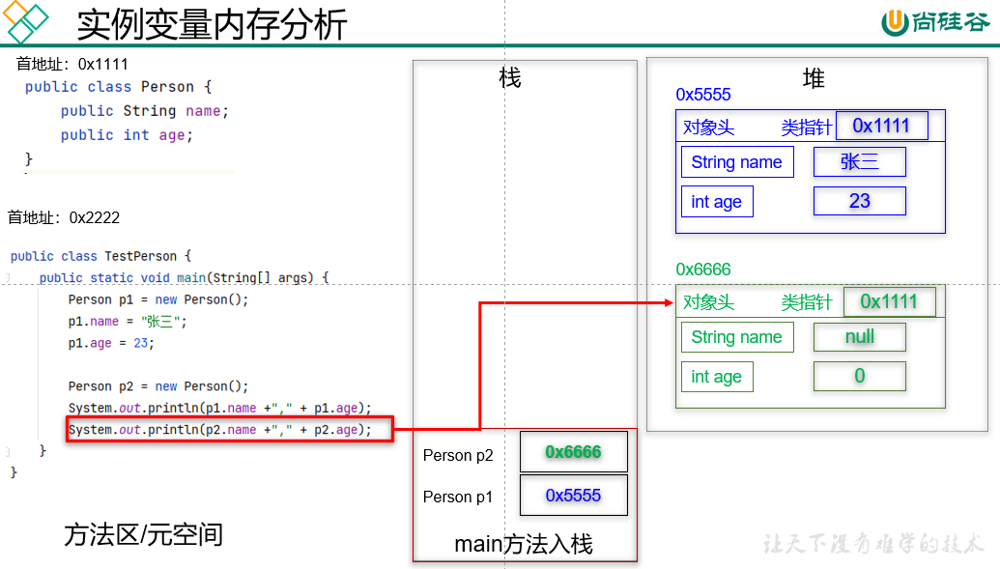

#### 2、静态变量与实例变量的内存分析

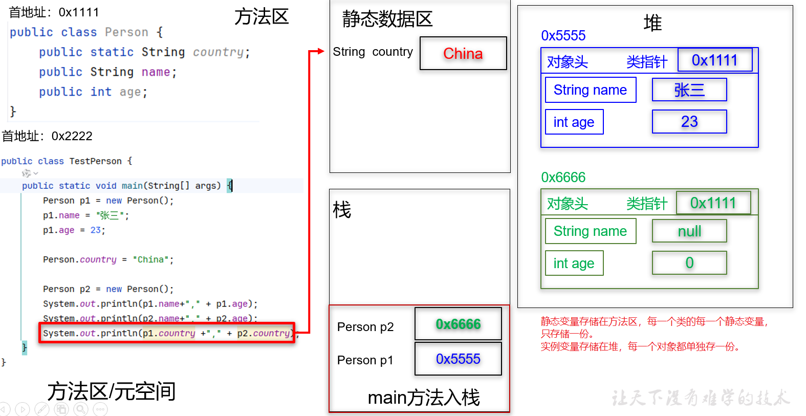

#### 3、引用数据类型成员变量的内存分析

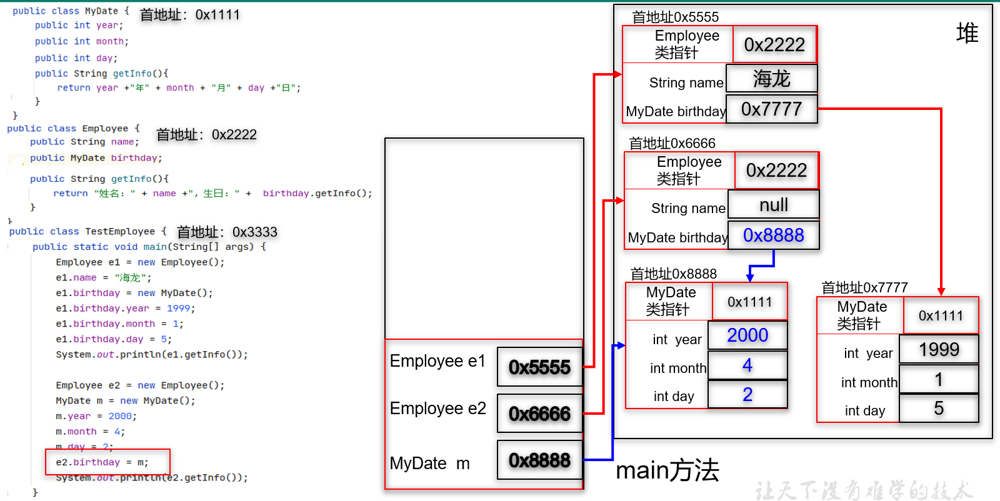


### 1.5.7 静态变量与实例变量的区别

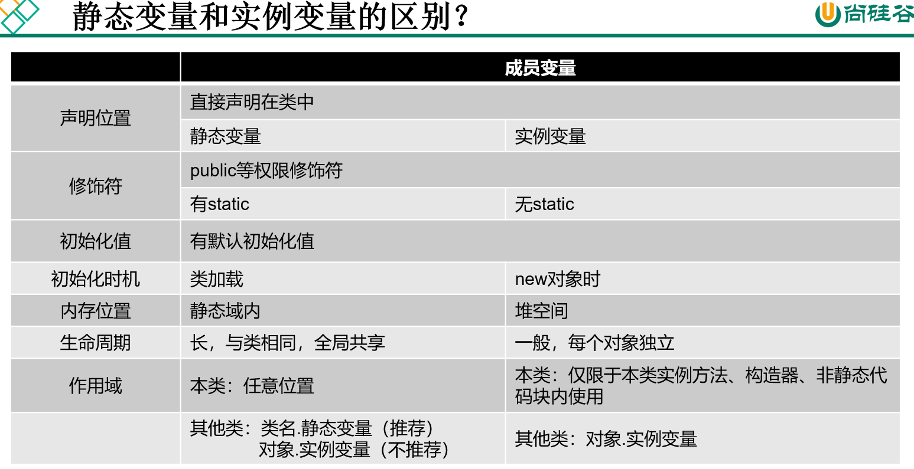

### 1.6.2成员方法的分类

#### 1、静态方法

在一个类中，**`静态方法`**只能访问本类的静态成员，包括静态变量和静态方法。

#### 2、实例方法/非静态方法

实例方法中可以访问本类中的所有成员，包括本类的静态成员

#### 3、this指向

在 Java 中，`this` 是一个关键字，本质上是一个**引用（指针）**，用于指向**当前对象**—— 即当前正在执行的方法所属的对象。它的核心作用是区分对象的成员变量与局部变量，以及简化对象内部的方法调用。

`this` 始终指向**调用当前方法的那个对象**。

- 当通过对象调用非静态方法时，`this` 就指向这个对象本身。
- 在构造方法中，`this` 指向正在被创建的对象。

静态方法中没有this，因为静态方法属于类，不依赖对象存在。且this不能为 null，也不能被赋值（它的指向由 JVM 自动决定，无法手动修改）

### 1.6.6 实例方法调用内存分析

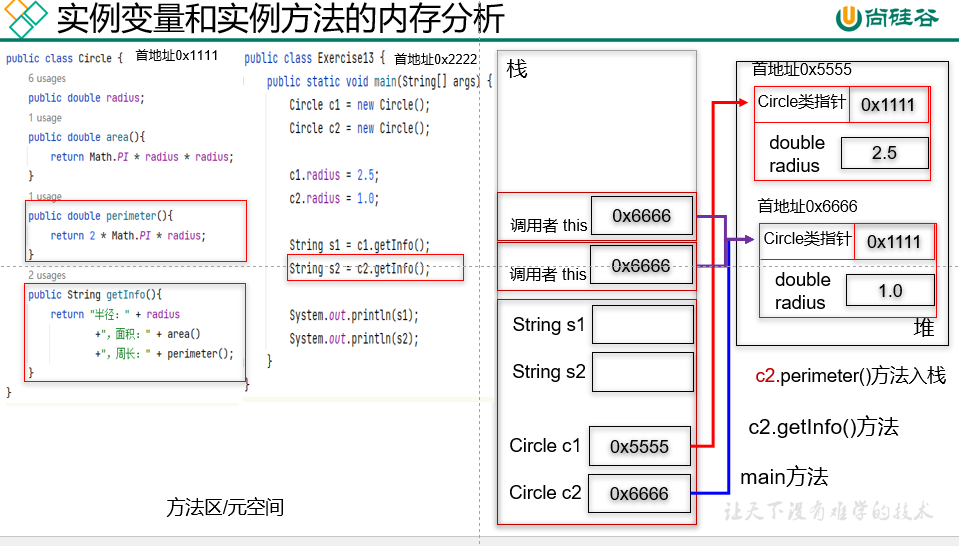


### 1.6.7 静态变量、实例变量、局部变量的区别

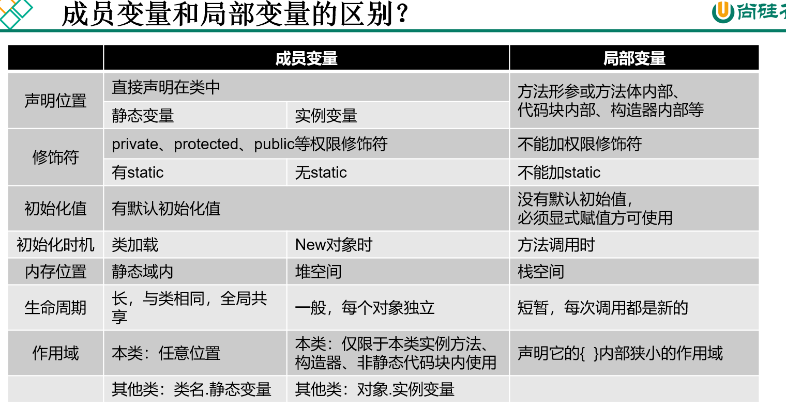

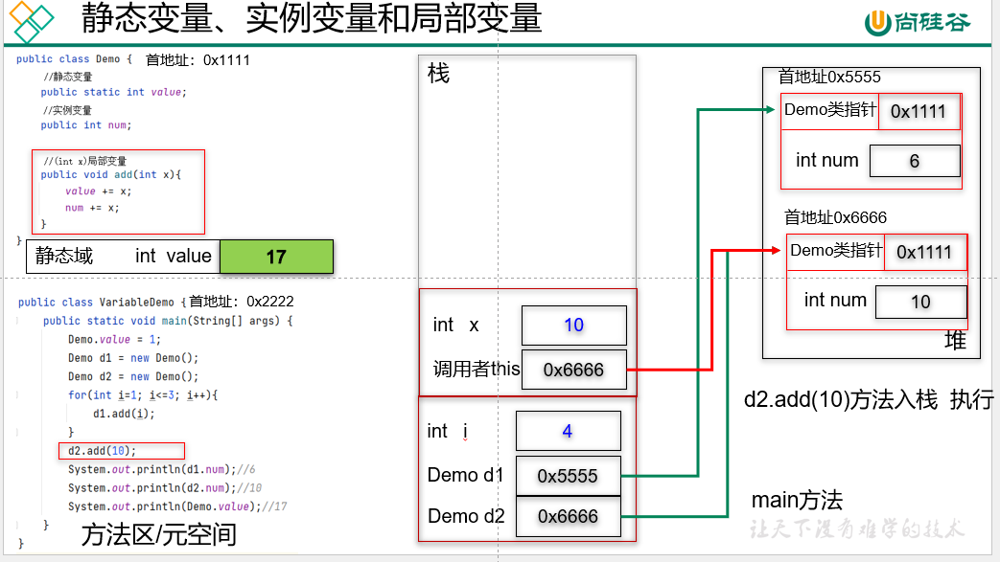

