# 六、面向对象构造器和封装

2.1 构造器有什么用

构造器的作用是为实例对象的实例变量初始化。在new对象的时候用。


## 2.2 构造器长什么样？

- 构造器的名称`必须`与所在的类名完全一致，包括大小写。

- 构造器`没有返回值类型`。不写void，也不写int，String等类型。一旦你写了返回值类型，它就是普通方法。

  

## 2.3 构造器有什么特点或要求？

- 所有类都有构造器

- 如果一个类没有手动编写构造器，那么编译器会给你自动添加一个默认的无参构造。

- 但是如果我们手动编写了构造器，那么编译器就不会再给你添加任何构造器了。

- 构造器可以重载。构造器有时候也叫做构造方法，或构造函数。

- 构造器的修饰符只能是public、protected、缺省、private，不能加其他修饰符（static，final，abstract等）

  

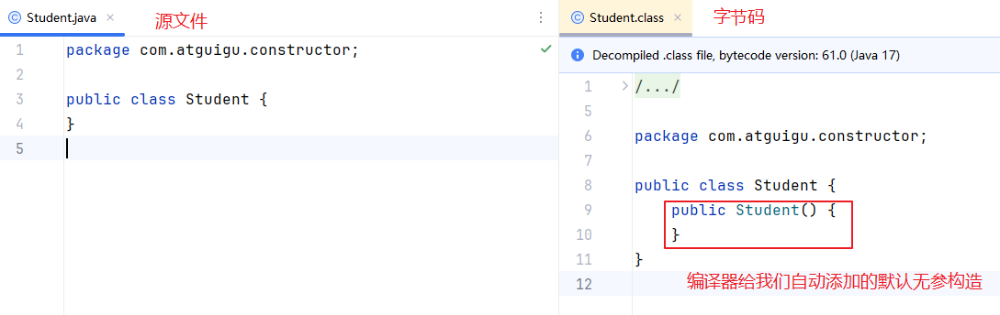


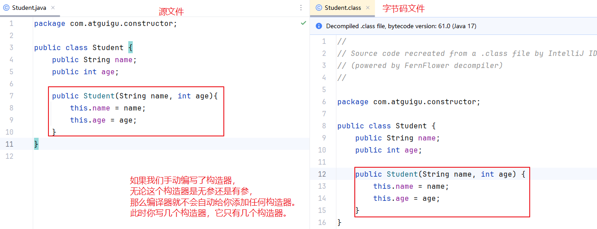


## 2.4 构造器如何快速的创建？Alt + Insert

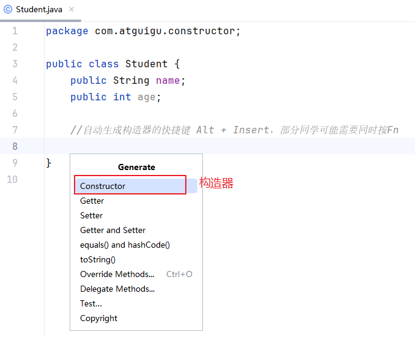

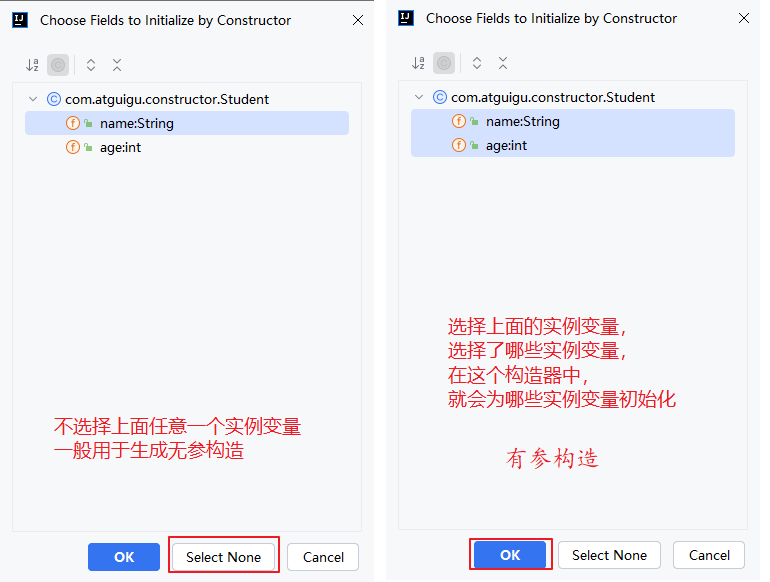


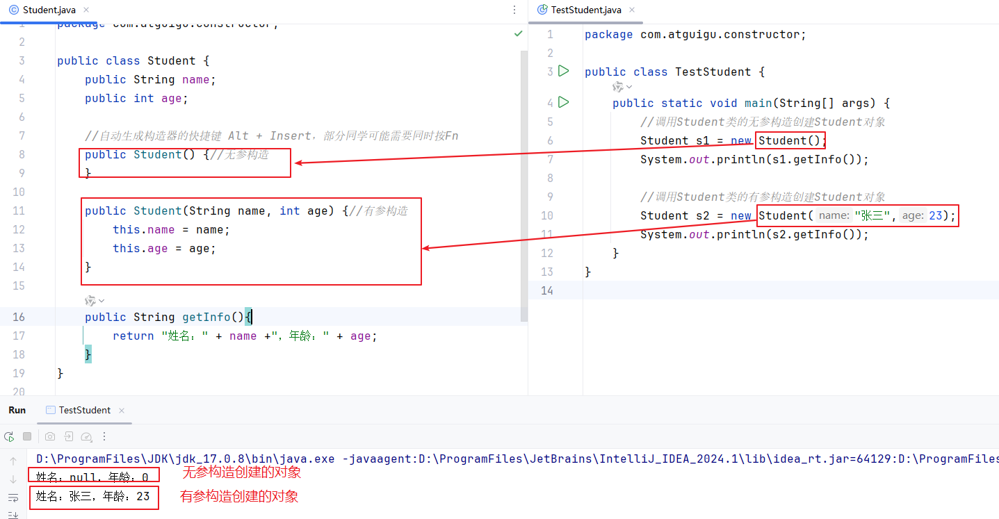


```java
package com.atguigu.constructor;

public class Student {
    public String name;
    public int age;

    //自动生成构造器的快捷键 Alt + Insert，部分同学可能需要同时按Fn
    public Student() {//无参构造
    }

    public Student(String name, int age) {//有参构造
        this.name = name;
        this.age = age;
    }

    public String getInfo(){
        return "姓名：" + name +"，年龄：" + age;
    }
}

```

```java
package com.atguigu.constructor;

public class TestStudent {
    public static void main(String[] args) {
        //调用Student类的无参构造创建Student对象
        Student s1 = new Student();
        System.out.println(s1.getInfo());

        //调用Student类的有参构造创建Student对象
        Student s2 = new Student("张三",23);
        System.out.println(s2.getInfo());
    }
}

```

## 4、面向对象的基本特征之一：封装（必须掌握）

### 3.1 为什么要封装？

生活中，快递为什么有包装盒/包装袋？

- 私密性：保护隐私
- 安全性：避免损坏
- 方便运输
- ......

Java中的类及其成员，也需要封装：

- 广义的封装概念：边界感，
  - 例如：把一类事物的共同特征封装到一个类中，把一个完整的功能封装到一个方法中。
  - 组件之间的封装，例如：项目中用到第三方的支付功能，微信、支付宝、银行等，只能调用对方开放的接口，无法获取内部的实现细节。
- 狭义的封装：对类或成员加权限修饰符，控制它们的可见性范围
  - 隐藏实现细节，便于使用
  - 安全

```java
package com.atguigu.constructor;

public class Student {
    private String name;//属性私有化
    private int age;//属性私有化

    public Student() {//无参构造
    }

    public Student(String name, int age) {//有参构造
        this.name = name;
        this.age = age;
    }

    public void setAge(int age){
        if(age >= 18 && age<=35) {
            this.age = age;
        }else{
            System.out.println("年龄不合法！");
        }
    }

    public String getInfo(){
        return "姓名：" + name +"，年龄：" + age;
    }
}

```

```java
package com.atguigu.constructor;

public class TestStudent {
    public static void main(String[] args) {
        //调用Student类的无参构造创建Student对象
        Student s1 = new Student();
        System.out.println(s1.getInfo());

        //调用Student类的有参构造创建Student对象
        Student s2 = new Student("张三",23);
        System.out.println(s2.getInfo());

        //s2.age = -18;//不安全
        s2.setAge(-18);//安全
        System.out.println(s2.getInfo());

        s2.setAge(30);//安全
        System.out.println(s2.getInfo());
    }
}

```


### 3.2 四种权限修饰符

对类或成员加权限修饰符，控制它们的可见性范围。

|                | private（私有的） | 缺省（不写） | protected（受保护） | public（公共的） |
| -------------- | ----------------- | ------------ | ------------------- | ---------------- |
| 本类           | √                 | √            | √                   | √                |
| 本包其他类     | ×                 | √            | √                   | √                |
| 其他包的子类   | ×                 | ×            | √                   | √                |
| 其他包的非子类 | ×                 | ×            | ×                   | √                |

#### 演示1

本类中所有权限修饰符都可见。

```java
package com.atguigu.one;

public class Father {
    private int a;
    int b;
    protected int c;
    public int d;

    public void test(){
        System.out.println("a = " + a);
        System.out.println("b = " + b);
        System.out.println("c = " + c);
        System.out.println("d = " + d);
    }
}
```


#### 演示2

- 本包的其他类中，除了private，其他权限修饰符都可见。

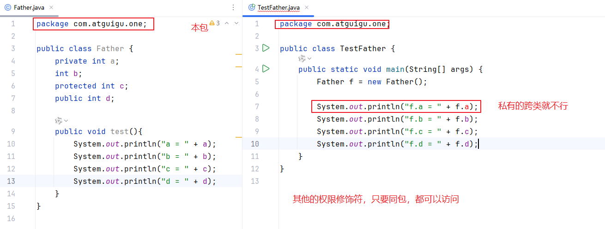

```java
package com.atguigu.one;

public class TestFather {
    public static void main(String[] args) {
        Father f = new Father();

//        System.out.println("f.a = " + f.a); //a在Father类中是私有的
        System.out.println("f.b = " + f.b);
        System.out.println("f.c = " + f.c);
        System.out.println("f.d = " + f.d);
    }
}

```


#### 演示2

A类和B类，B类与A类没有父子类关系的话，B类和A类不同包，那么B类只能用A类public的成员。

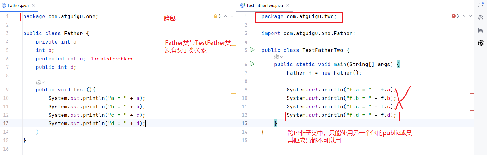

```java
package com.atguigu.two;

import com.atguigu.one.Father;

public class TestFatherTwo {
    public static void main(String[] args) {
        Father f = new Father();

//        System.out.println("f.a = " + f.a);//a在Father类中是private私有的
//        System.out.println("f.b = " + f.b);//b在Father类中是缺省的，默认的
//        System.out.println("f.c = " + f.c);//c在Father类中是protected受保护的
        System.out.println("f.d = " + f.d);
    }
}

```


#### 演示3

A类和B类，B类与A类有父子类关系，B类和A类不同包，那么B类可以用A类public和protected的成员。

私有的和缺省的成员，跨包就不可见。

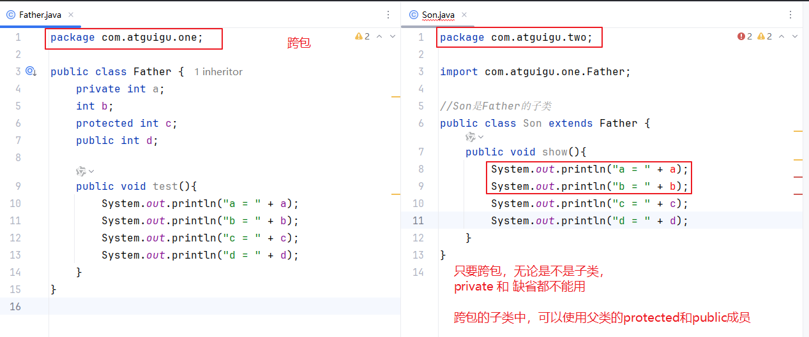

```java
package com.atguigu.two;

import com.atguigu.one.Father;

//Son是Father的子类
public class Son extends Father {
    public void show(){
//        System.out.println("a = " + a);//a在Father类中是private私有的
//        System.out.println("b = " + b);//b在Father类中是缺省的，默认的
        System.out.println("c = " + c);
        System.out.println("d = " + d);
    }
}
```


## 3.3 get/set方法

- set方法：修改某个或某些属性的值
  - 如果是静态变量的set方法，那么出现局部变量与静态变量重名时，通过“类名.静态变量”进行区分
  - 如果是实例变量的set方法，那么出现局部变量与实例变量重名时，通过“this.实例变量”进行区分
- get方法：获取某个或某些属性的值
  - 如果某个属性的类型是boolean，那么它的get方法，一般以is开头。

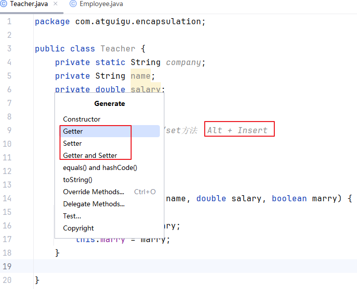

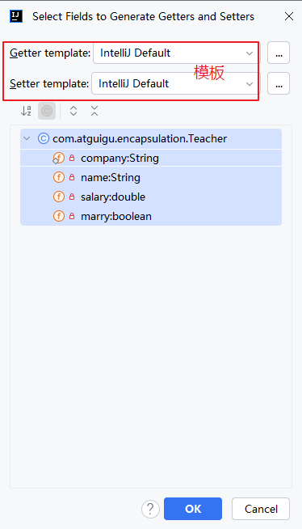

> 问：有构造器，和get/set会不会冲突？
>
> 答：构造器在new对象`时`，赋初始值。
>
> ​        set方法在new对象`后`，用于修改属性的值。
>
> ​        get方法在new对象`后`，用于获取某个属性的值。

### 演示代码1：手动编写

```java
package com.atguigu.encapsulation;

public class Employee {
    private static String company;
    private String name;
    private double salary;
    private boolean marry;

    public Employee() {
    }

    public Employee(String name, double salary) {
        this.name = name;
        this.salary = salary;
    }

    //set方法的作用：供类外面，修饰某个/某些属性的值
    public void setName(String name){
        this.name = name;
    }
    public void setSalary(double salary){
        this.salary = salary;
    }
    public void setMarry(boolean marry){
        this.marry = marry;
    }
    public static void setCompany(String company){
        Employee.company = company;
    }
    //这种set一般是可选
    public void setInfo(String name, double salary){
        this.name = name;
        this.salary = salary;
    }

    //get方法的作用：供类外面，获取某个/某些属性的值
    public String getName(){
        return name;
    }
    public double getSalary(){
        return salary;
    }
    public boolean isMarry(){
        return marry;
    }
    public static String getCompany(){
        return company;
    }
    public String getInfo(){
        return "姓名：" + name +"，薪资：" + salary;
    }
}

```

```java
package com.atguigu.encapsulation;

public class TestEmployee {
    public static void main(String[] args) {
        Employee e1 = new Employee();//无参构造
        Employee e2 = new Employee("小孙", 30000);

        //跨类，无法直接使用对方的私有成员
        //System.out.println("姓名：" + e1.name +"，薪资：" + e1.salary);
        System.out.println("姓名：" + e1.getName() +"，薪资：" + e1.getSalary());
        System.out.println(e1.getInfo());

        System.out.println(e2.getInfo());

        //跨类，无法直接使用对方的私有成员
//        e1.name ="老马";
//        e1.salary = 18000;
        e1.setName("老马");
        e1.setSalary(18000);
        System.out.println(e1.getInfo());

    }
}

```

### 演示代码2：快捷键生成

```java
package com.atguigu.encapsulation;

public class Teacher {
    private static String company;
    private String name;
    private double salary;
    private boolean marry;

    //用快捷键生成构造器、get/set方法  Alt + Insert
    public Teacher() {
    }

    public Teacher(String name, double salary, boolean marry) {
        this.name = name;
        this.salary = salary;
        this.marry = marry;
    }

    public static String getCompany() {
        return company;
    }

    public static void setCompany(String company) {
        Teacher.company = company;
    }

    public String getName() {
        return name;
    }

    public void setName(String name) {
        this.name = name;
    }

    public double getSalary() {
        return salary;
    }

    public void setSalary(double salary) {
        this.salary = salary;
    }

    public boolean isMarry() {
        return marry;
    }

    public void setMarry(boolean marry) {
        this.marry = marry;
    }

    public String getInfo() {
        return "Teacher{" +
                "name='" + name + '\'' +
                ", salary=" + salary +
                ", marry=" + marry +
                '}';
    }
}

```

## 3.4 练习题

```java
package com.atguigu.exer2;

public class Triangle {//三角形类
    private double a;
    private double b;
    private double c;
    //a,b,c没有明确赋值的时候，默认值就是0

    //构造器，用快捷键生成
    //构造器的调用或使用，只有1个位置，就是new后面
    public Triangle() {
    }

    public Triangle(double a, double b, double c) {
/*        if (a <= 0 || b <= 0 || c <= 0 || a + b <= c || b + c <= a || a + c <= b) {
            System.out.println(a + "," + b + "," + c + "的值无法构成三角形");
        }else {
            this.a = a;
            this.b = b;
            this.c = c;
        }*/
        //if-else是双分支条件判断，只会二选一执行

        if (a <= 0 || b <= 0 || c <= 0 || a + b <= c || b + c <= a || a + c <= b) {
            System.out.println(a + "," + b + "," + c + "的值无法构成三角形");
            return; //在这里只是提前结束构造器的执行
        }
        this.a = a;
        this.b = b;
        this.c = c;

        /*if (a <= 0 || b <= 0 || c <= 0 || a + b <= c || b + c <= a || a + c <= b) {
            //抛出一个异常对象
            throw new IllegalArgumentException(a + "," + b + "," + c + "的值无法构成三角形");
        }
        this.a = a;
        this.b = b;
        this.c = c;*/
    }

    public double getA() {
        return a;
    }

/*    public void setA(double a) {
        this.a = a;
    }*/

    public double getB() {
        return b;
    }

/*    public void setB(double b) {
        this.b = b;
    }*/

    public double getC() {
        return c;
    }

/*    public void setC(double c) {
        this.c = c;
    }*/

    public void setBase(double a, double b, double c){
        if (a <= 0 || b <= 0 || c <= 0 || a + b <= c || b + c <= a || a + c <= b) {
            System.out.println(a + "," + b + "," + c + "的值无法构成三角形");
            return; //在这里只是提前结束构造器的执行
        }
        this.a = a;
        this.b = b;
        this.c = c;
    }

    public double area(){
        double p = (a+b+c)/2;
        return Math.sqrt(p * (p-a) * (p-b) * (p-c));
    }
    public double perimeter(){
        return a+b+c;
    }


    public String getInfo(){
        return  "三边：" +a + "," + b + "," + c +"，面积：" + area() +"，周长：" + perimeter();
    }

}

```

```java
package com.atguigu.exer2;

public class TestTriangle {
    public static void main(String[] args) {
        Triangle t1 = new Triangle();
 /*       t1.setA(3);
        t1.setB(4);
        t1.setC(3);*/
        t1.setBase(3,4,3);
        System.out.println(t1.getInfo());

        Triangle t2 = new Triangle(3,4,5);
        System.out.println(t2.getInfo());

        Triangle t3 = new Triangle(1,1,5);
        System.out.println(t3.getInfo());

        Triangle t4 = new Triangle();
/*        t4.setA(3);
        t4.setB(4);
        t4.setC(1);*/
        t4.setBase(3,4,1);
        System.out.println(t4.getInfo());
    }
}
```


## 四、标准Javabean（会使用快捷键）

bean：豆。

Java：产咖啡的印尼的爪哇岛。

Javabean：咖啡豆，Java类。

什么是标准Javabean？

- 属性私有化
- 提供无参构造器。有参构造可选。因为后期Java对象的创建通常都是交给Spring等框架，而这些框架默认都是用无参构造创建对象。
- 提供合适的get/set方法
- 重写（关于重写的概念我们在继承部分讲解）equals和hashCode（hashCode方法前期没用，等到后面讲哈希表的时候再说），toString方法

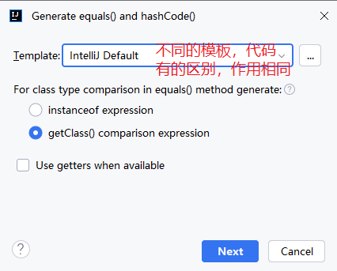

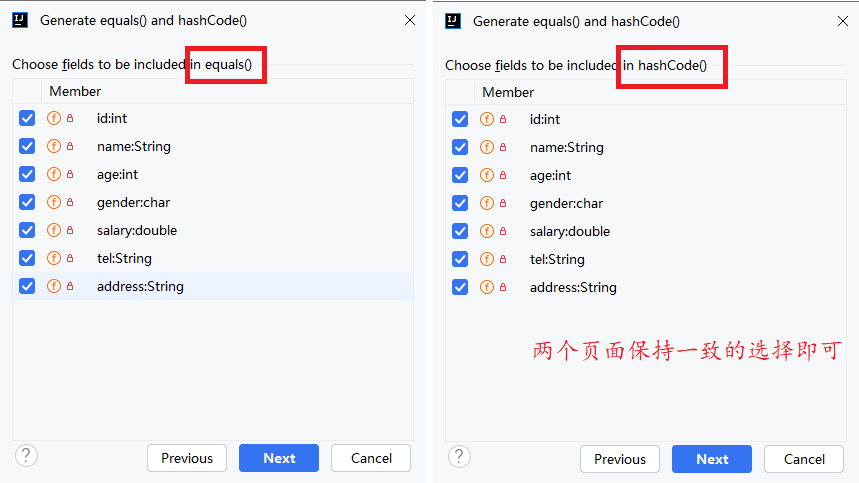

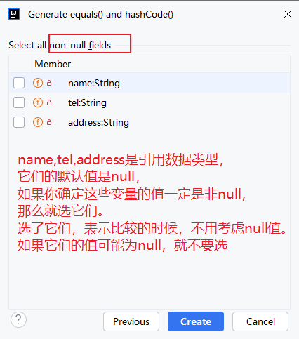

同一个类的构造器之间互相调用问题？

- this()：调用本类的无参构造
- this(实参列表)：调用本类的有参构造

它们都必须在构造器的首行。

```java
package com.atguigu.bean;

import java.util.Objects;

/*
什么是标准Javabean？

- 属性私有化
- 提供无参构造器。有参构造可选。因为后期Java对象的创建通常都是交给Spring等框架，而这些框架默认都是用无参构造创建对象。
- 提供合适的get/set方法
- 重写（关于重写的概念我们在继承部分讲解）equals和hashCode，toString方法

 */
public class Employee {
    private int id;
    private String name;
    private int age;
    private char gender;
    private double salary;
    private String tel;
    private String address;

    public Employee() {
        System.out.println("一个新员工入职");
    }

    public Employee(int id, String name, int age) {
        this();//调用本类的其他构造器，调用无参构造
        this.id = id;
        this.name = name;
        this.age = age;
    }

    public Employee(int id, String name, int age, char gender, double salary, String tel, String address) {
//        this.id = id;
//        this.name = name;
//        this.age = age;
        this(id,name,age);//调用本类的其他构造器，调用有参构造
        this.gender = gender;
        this.salary = salary;
        this.tel = tel;
        this.address = address;
    }

    public int getId() {
        return id;
    }

    public void setId(int id) {
        this.id = id;
    }

    public String getName() {
        return name;
    }

    public void setName(String name) {
        this.name = name;
    }

    public int getAge() {
        return age;
    }

    public void setAge(int age) {
        this.age = age;
    }

    public char getGender() {
        return gender;
    }

    public void setGender(char gender) {
        this.gender = gender;
    }

    public double getSalary() {
        return salary;
    }

    public void setSalary(double salary) {
        this.salary = salary;
    }

    public String getTel() {
        return tel;
    }

    public void setTel(String tel) {
        this.tel = tel;
    }

    public String getAddress() {
        return address;
    }

    public void setAddress(String address) {
        this.address = address;
    }

    public String toString() {
        return "Employee{" +
                "id=" + id +
                ", name='" + name + '\'' +
                ", age=" + age +
                ", gender=" + gender +
                ", salary=" + salary +
                ", tel='" + tel + '\'' +
                ", address='" + address + '\'' +
                '}';
    }

    //equals方法的内部实现，可以先忽略，
    //作用要明确，用于比较两个Employee对象的属性值是不是相同
    @Override
    public boolean equals(Object o) {
        if (this == o) return true;
        if (o == null || getClass() != o.getClass()) return false;

        Employee employee = (Employee) o;
        return id == employee.id && age == employee.age && gender == employee.gender && Double.compare(salary, employee.salary) == 0 && Objects.equals(name, employee.name) && Objects.equals(tel, employee.tel) && Objects.equals(address, employee.address);
    }

    //hashCode()今天先放着，不管它
    @Override
    public int hashCode() {
        int result = id;
        result = 31 * result + Objects.hashCode(name);
        result = 31 * result + age;
        result = 31 * result + gender;
        result = 31 * result + Double.hashCode(salary);
        result = 31 * result + Objects.hashCode(tel);
        result = 31 * result + Objects.hashCode(address);
        return result;
    }
}

```

```java
package com.atguigu.bean;

public class TestEmployee {
    public static void main(String[] args) {
        Employee e1 = new Employee();
        Employee e2 = new Employee(2,"熊二",25);
        Employee e3 = new Employee(3,"张三",23,'男',15000,"10086","北京");


        //toString()作用等价于原来的getInfo()
        //但是它比getInfo()方便，打印对象时，不用手动调用，它会自动调用
/*        System.out.println(e1.toString());
        System.out.println(e2.toString());
        System.out.println(e3.toString());*/
        System.out.println(e1);//如果没有写toString方法，那么打印的是地址值
        System.out.println(e2);
        System.out.println(e3);

        Employee e4 = new Employee(2,"熊二",25);
        System.out.println(e2 == e4);//false
        //e2和e4是地址值，这里比较的是两个对象的地址值
        System.out.println(e2.equals(e4));//比较两个对象是否相等  false
        //默认情况下，equals等价于 ==
        //如果不想让equals方法等价于==，就必须重写
        System.out.println(e1.equals(e2));//false
    }
}

```

