# 七、对象数组

## 1、什么是对象数组

把对象存到数组中，这样的数组就称为对象数组。其实，它和普通的数组是一样的，只是因为对象数组使用起来相对复杂一点。

## 2、如何声明和使用

```java
元素的类型[] 数组名; //此时元素的类型是类类型，例如：Student，Rectangle，String等
```

静态初始化：

```java
元素的类型[] 数组名 = {对象1，对象2，对象3};
```

动态初始化：

```java
元素的类型[] 数组名 = new 元素的类型[长度];
```

数组的遍历：

```java
for(int i=0; i<数组名.length; i++){
    数组名[i]是元素，此时元素是对象
}
```

```java
package com.atguigu.array;

public class Rectangle {//矩形
    //属性私有化
    private double length;
    private double width;

    public Rectangle() {
    }

    public Rectangle(double length, double width) {
        this.length = length;
        this.width = width;
    }

    public double getLength() {
        return length;
    }

    public void setLength(double length) {
        this.length = length;
    }

    public double getWidth() {
        return width;
    }

    public void setWidth(double width) {
        this.width = width;
    }

    public double area(){
        return length * width;
    }
    public double perimeter(){
        return 2 * (length + width);
    }

    //接下来先忽略equals和hashCode方法
    public String toString() {
        return "Rectangle{" +
                "length=" + length +
                ", width=" + width +
                ", area = " + area() +
                ", perimeter = " + perimeter() +
                '}';
    }
}

```

```java
package com.atguigu.array;

public class TestRectangle {
    public static void main(String[] args) {
        //创建5个矩形对象，放到数组中统一管理
//        int[] arr = {1,2,3,4,5};
/*        int[] nums = new int[5];
        for (int i = 0; i < nums.length; i++) {
            System.out.println(nums[i]);
        }*/

//        Rectangle[] arr = {new Rectangle(5,3),new Rectangle(6,1)};

        Rectangle[] arr = new Rectangle[5];
        //此时我创建了一个数组，准备放5个矩形对象
        //此时arr数组的元素是什么值？5个null
        arr[0] = new Rectangle(5,3);
        arr[1] = new Rectangle(6,1);
        arr[2] = new Rectangle(4,2);
        arr[3] = new Rectangle(7,4);
        arr[4] = new Rectangle(6,2);

        //此时arr数组的元素是什么值？
        //如果重写了toString方法，打印元素看到的是5个矩形对象的信息
        //如果没有重写toString方法，打印元素看到的是5个地址值
        for (int i = 0; i < arr.length; i++) {
            System.out.println(arr[i]);
            //打印元素，会自动调用对象的toString()
        }

        System.out.println("排序：");
        //按照矩形对象的面积从小到大排序
        for(int i=1; i<arr.length; i++){
            for(int j=0; j<arr.length-i; j++){
               // if(arr[j] > arr[j+1]){//此时arr[j]是对象，arr[j]里面存储的是地址值，地址值是无法比较大小的
                if(arr[j].area() > arr[j+1].area()){
                   Rectangle  temp = arr[j];
                    arr[j] = arr[j+1];
                    arr[j+1] = temp;
                }
            }
        }

        for (int i = 0; i < arr.length; i++) {
            System.out.println(arr[i]);
            //打印元素，会自动调用对象的toString()
        }

    }
}

```

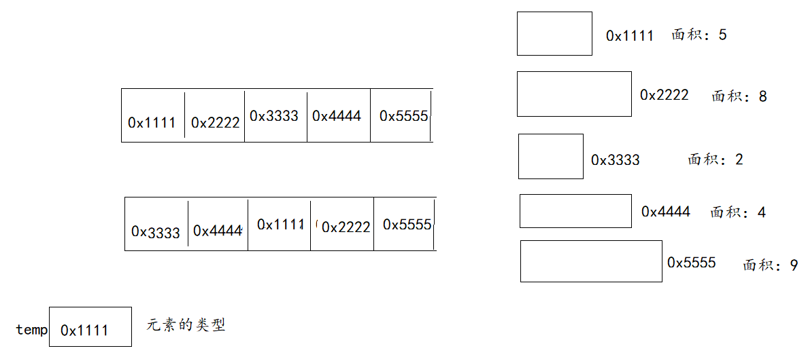

## 3、对象数组的内存分析

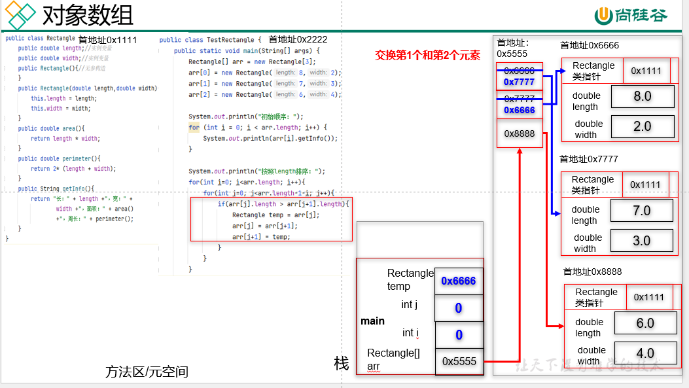


## 4、练习题

```java
package com.atguigu.exer3;

public class Student {
    //这是两个属性，实例变量，非静态成员变量
    private String name;
    private int score;

    //无参构造
    public Student() {
    }

    //有参构造
    public Student(String name, int score) {
        this.name = name;
        this.score = score;
    }

    //get和set
    //get返回属性值
    //set修改属性值
    public String getName() {
        return name;
    }

    public void setName(String name) {
        this.name = name;
    }

    public int getScore() {
        return score;
    }

    public void setScore(int score) {
        this.score = score;
    }

    //getInfo返回整个学生对象的信息
    public String getInfo(){
        return "姓名：" + name +"，成绩：" + score;
    }
}

```

```java
package com.atguigu.exer3;

import java.util.Scanner;

public class TestStudent {
    public static void main(String[] args) {
        //先创建长度为3的数组，类型是Student[]
        Student[] arr = new Student[3];//此时元素是3个null

        //键盘输入3个学生对象
        Scanner input = new Scanner(System.in);

        for (int i = 0; i < arr.length; i++) {
            System.out.print("请输入第" + (i+1) +"个学生的姓名：");
            String name = input.next();

            System.out.print("请输入第" + (i+1) +"个学生的成绩：");
            int score = input.nextInt();

            //把上面输入的姓名和成绩放到学生对象中
//            arr[i] = new Student(name,score);//方式一
            //方式二
            arr[i] = new Student();
            arr[i].setName(name);
            arr[i].setScore(score);
        }

        //遍历输出3个学生对象的信息
        for (int i = 0; i < arr.length; i++) {
            System.out.println(arr[i].getInfo());
        }

        //排序
        System.out.println("按照成绩从高到低排序：");
        for(int i=1; i<arr.length; i++){
            for(int j=0; j<arr.length-i; j++){
                if(arr[j].getScore() < arr[j+1].getScore()){
                    Student temp = arr[j];
                    arr[j] = arr[j+1];
                    arr[j+1] = temp;
                }
            }
        }
        for (int i = 0; i < arr.length; i++) {
            System.out.println(arr[i].getInfo());
        }

        input.close();
    }
}

```

### 数组中删除元素后其他元素前移

```java
/*删除后面客户的工作原理 ：

  假设数组中有n个客户（count = n），要删除第k个客户（k可以是任何位置，包括最后一个）
  循环 for(int i = k; i < count; i++) 会从第k个位置开始，将所有后面的元素前移一位
  当k等于count（删除最后一个客户）时，循环条件不满足（i = k 不小于 count），循环体不  会执行
  然后我们将最后一个元素设为null（ arr[count - 1] = null ）
  最后更新count--，表示客户数量减少了一个
*/
    public static boolean deleteCustomer(int id){
        if (id < 1 || id > count){
            System.out.println("不存在该用户！");
            return false;
        }
// 将后面的元素前移
    for(int i = id; i < arr.length; i++){
        arr[i - 1] = arr[i];
    }
    // 最后一个元素设为null
    arr[length- 1] = null;
    // 更新客户数量
    //count--;  这是因为的的案例中用了count作为计数器计算数组中元素个数
    return true;
    }
```

# 八、面向对象的基本特征之二：继承

## 3.1 什么是继承？

Java中为什么要有继承的设计呢？

* 代码的复用性：子类可以`复用`父类的代码

* 代码的扩展性：子类可以`重写`父类的方法或`扩展`父类没有的成员

* ###### 表示事物之间的is-a关系。例如：Student类继承Person类，Student is a Person.学生类是人类的一个分支。

  

## 3.2 如何继承？（重要）

```java
【修饰符】 class 父类{
    
}
```

```java
【修饰符】 class 子类 extends 父类{//子类是从父类中延伸出来的新的分类，更具体的分类
    
}
```

父类：SuperClass，称为父类或超类 ，基类。

子类：SubClass，称为子类或派生类。

## 3.3 继承的特点或要求（重要）

1、Java中只允许`单继承`。比喻：每一个子类只有1个亲生父亲。

2、但是Java中支持`多层继承`。比喻：代代相传。你的父亲仍然有父亲。爷爷的特征到孙子类仍然是保留的。

3、Java中一个父类可以同时有多个子类。比喻：支持多胎。支持家族兴旺。

4、父类的所有成员变量、成员方法都会继承到子类中。`但是`，父类中私有的成员变量、成员方法，在子类中`不能直接`使用，可以间接使用。

5、父类的`构造器不会继承`到子类中。`但是`，子类的构造器中又`必须调用`父类的构造器。因为子类继承了父类声明的所有成员变量，那么创建子类对象时就需要为这些成员变量初始化，而为这些成员变量初始化的代码已经在父类的构造器中写过了，可以不用重复编写这些代码了，直接调用它们即可。

- super()：表示调用父类的无参构造。这句代码可以省略。
- super(实参列表)：明确表示调用父类的有参构造。这句代码不能省略，一旦省略，就表示调用无参构造了。
- 它们必须在子类构造器的首行。

### 案例一：子类直接用父类的成员

```java
package com.atguigu.inherited;

public class Person {
    public String name;
    public int age;

    public String getPersonInfo(){
        return "姓名：" + name + "，年龄：" + age;
    }
}

```

```java
package com.atguigu.inherited;

public class Student extends Person{

    public int score;//成绩

    public String getStudentInfo(){
        return "姓名：" + name + "，年龄：" + age +"，成绩：" + score;
        //直接使用父类非private的属性
    }
}

```

```java
package com.atguigu.inherited;

public class Student extends Person{

    public int score;//成绩

    public String getStudentInfo(){
        return getPersonInfo() +"，成绩：" + score;
        //间接使用父类非private的方法
    }
}
```

### 案例二：子类间接使用父类的成员

```java
package com.atguigu.inherited;

public class Person {
    private String name;
    private int age;

    public String getPersonInfo(){
        return "姓名：" + name + "，年龄：" + age;
    }
}

```

```java
package com.atguigu.inherited;

public class Student extends Person{

    public int score;//成绩

    public String getStudentInfo(){
        //return "姓名：" + name + "，年龄：" + age +"，成绩：" + score;
        //报错，因为name和age此时在父类Person中是private
        return getPersonInfo() +"，成绩：" + score;
        //直接调用父类的方法，从而间接使用父类的私有属性
    }
}
```

## 3.4 方法的重写（重要）

### 1、什么是方法的重写？

方法的重写（Override）是指子类覆盖/重写/覆写父类的某个方法。因为子类会继承父类的所有方法，但是某些方法的方法体功能实现不适用于子类，那么子类就可以重新实现它。

### 2、如何重写方法？

- 修饰符：
  - 权限修饰符：public、protected、缺省、private，其中private的方法是不能被重写的。并且子类重写时，方法的权限修饰符必须`大于等于`父类被重写方法的权限修饰符。
    - 父类被重写方法是public，子类这个方法只能是public。
    - 父类被重写方法是protected，子类这个方法可以是public，protected
    - 父类被重写方法是缺省，子类这个方法可以是public，protected，缺省
  - 其他修饰符：static，静态方法不能被重写。

- 返回值类型：
  - void和基本数据类型：子类必须保持一致
  - 引用数据类型：子类重写时，方法的返回值类型可以是`小于等于`它
    - 例如父类被重写方法的返回值类型是Person，那么子类重写方法的返回值类型可以是Person，也可以是Student

- 方法名：`必须完全相同`
- 形参列表：`必须完全相同`，这里相同是指类型、个数、顺序。不包括形参名。
- 方法体：子类重写就是为了重新实现方法体，根据功能的需求来。

### 3、如何调用父类被重写的方法？

super.父类被重写方法


### 4、方法重载与重写的区别

|            | 方法的重载         | 方法的重写                                             |
| ---------- | ------------------ | ------------------------------------------------------ |
| 位置       | 同一个类 或 父子类 | 父子类                                                 |
| 英文单词   | Overload           | Override                                               |
| 修饰符     | 不看               | 不能重写private和static的方法。权限修饰符必须满足 >=   |
| 返回值类型 | 不看               | void和基本数据类型：必须相同<br />引用数据类型：满足<= |
| 方法名     | 必须相同           | 必须相同                                               |
| `形参列表` | `必须不同`         | `必须相同`                                             |

### 5、示例代码

```java
package com.atguigu.inherited;

public class Employee {
    private String name;
    private double salary;//薪资

    public Employee() {
    }

    public Employee(String name, double salary) {
        this.name = name;
        this.salary = salary;
    }

    public String getName() {
        return name;
    }

    public void setName(String name) {
        this.name = name;
    }

    public double getSalary() {
        return salary;
    }

    public void setSalary(double salary) {
        this.salary = salary;
    }


    public String getInfo() {
       return "姓名：" + name + "，薪资：" + salary;
    }
}

```

```java
package com.atguigu.inherited;

public class Manager extends Employee{
    private double bonus;//奖金

    public Manager() {
    }

    public Manager(String name, double salary, double bonus) {
        super(name, salary);
        this.bonus = bonus;
    }

    public double getBonus() {
        return bonus;
    }

    public void setBonus(double bonus) {
        this.bonus = bonus;
    }

    public String  getInfo(){
      // return "姓名：" + getName() + "，薪资：" + getSalary() + "，奖金：" + bonus;
       return super.getInfo() + "，奖金：" + bonus;
       //通过super关键字，调用父类被重写的方法
    }
}

```

```java
package com.atguigu.inherited;

public class TestManager {
    public static void main(String[] args) {
        Manager m = new Manager("老马",18000,20000);
        System.out.println(m.getInfo());
    }
}

```

## 3.5 根父类（知道它）


Object是java.lang包下的一个类，它是所有Java类的根，老祖宗。我们称为根父类。

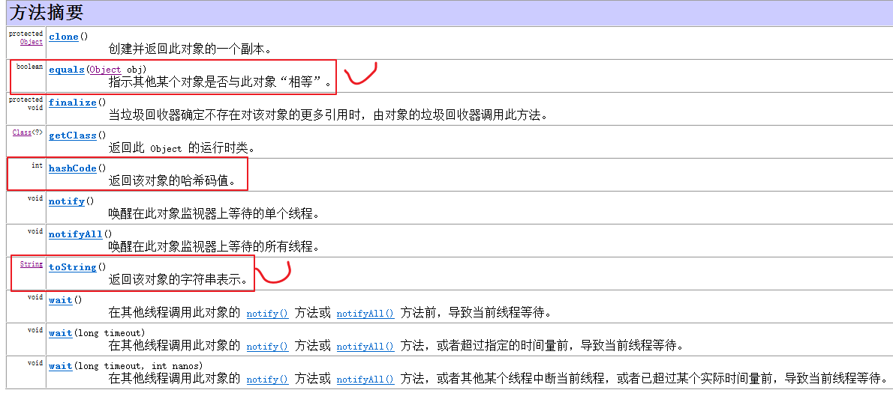

Object类的方法，所有子类都会继承，即所有子类都有这些方法。但是，对于toString，equals和hashCode方法来说，子类通常都会重写。

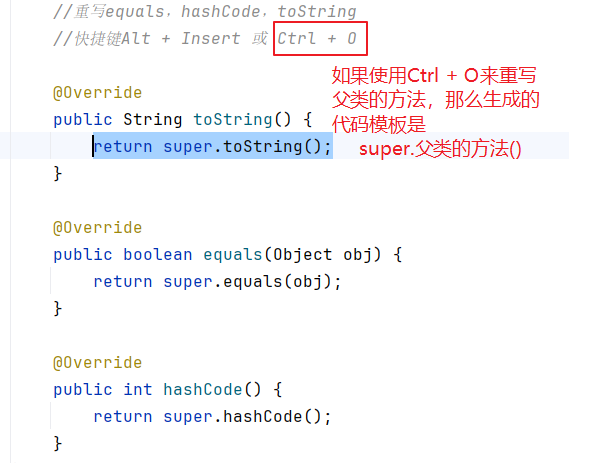

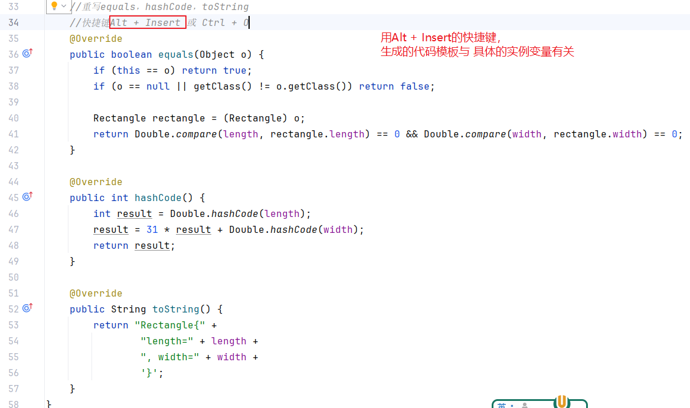

```java
package com.atguigu.inherited;

public class Rectangle {//它没有继承任何类，默认继承的是Object
    private double length;
    private double width;

    public Rectangle() {
        super();//调用父类Object的无参构造
    }

    public Rectangle(double length, double width) {
        super();//调用父类Object的无参构造，在子类有参构造器中，也可以调用父类的无参构造
        this.length = length;
        this.width = width;
    }

    public double getLength() {
        return length;
    }

    public void setLength(double length) {
        this.length = length;
    }

    public double getWidth() {
        return width;
    }

    public void setWidth(double width) {
        this.width = width;
    }

    //重写equals，hashCode，toString
    //快捷键Alt + Insert 或 Ctrl + O
    @Override  //这个是注解。它是用于标记以下方法是重写的意思，它会告诉编译器，让编译器对该方法做严格的格式检查，看它是否满足重写的要求
               //但是，如果你本身没有违反重写的要求，@Override可以去掉。
                //加或不加@Override它，不影响重写的本质。只是格式检查是不是彻底的问题。
                //建议重写方法上保留它。
    public boolean equals(Object o) {
        if (this == o) return true;
        if (o == null || getClass() != o.getClass()) return false;

        Rectangle rectangle = (Rectangle) o;
        return Double.compare(length, rectangle.length) == 0 && Double.compare(width, rectangle.width) == 0;
    }

    @Override
    public int hashCode() {
        int result = Double.hashCode(length);
        result = 31 * result + Double.hashCode(width);
        return result;
    }

    @Override
    public String toString() {
        return "Rectangle{" +
                "length=" + length +
                ", width=" + width +
                '}';
    }
}

```


## 3.6 特殊关键字

### 3.6.1 native（了解）

native修饰的方法，称为本地方法，或内置的方法，它是内置在JVM相关的底层代码中，通过C/C++语言实现的，不是用Java语言实现。在Java层面看不到它的方法体。

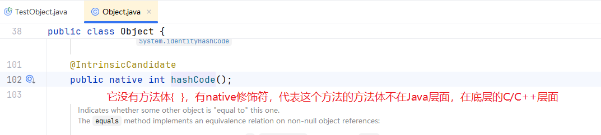

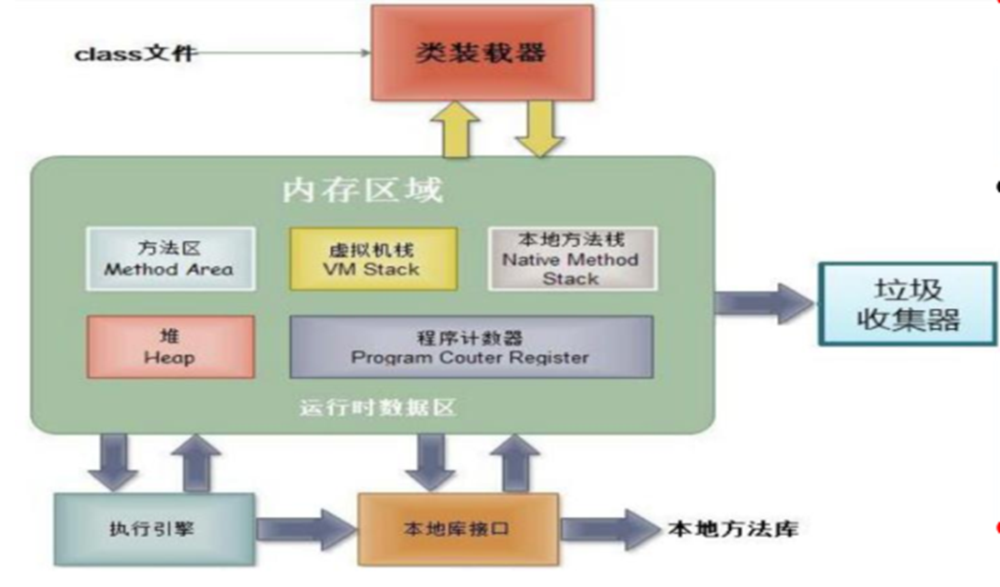

本地方法的执行会自动调用本地方法库。本地方法的执行会在本地方法栈中开辟独立的内存空间。Java虚拟机中的栈空间分为两块：虚拟机栈（服务于Java的方法）和本地方法栈（服务于C/C++的函数）。

> 提示：native的方法，虽然看不到它的源码，但是（1）在Java中可以正常调用。（2）如果子类继承了本地方法，只要它不是private，不是static，不是final，子类可以对它用Java代码进行重写。即本地方法在使用层面，把它当成普通的方法即可。


### 3.6.2 final（重要）

final：最终。

在Java中，它是修饰符，可以用于修饰：类、方法、变量。

|      | 修饰符类                         | 修饰符方法                         | 修饰变量                           |
| ---- | -------------------------------- | ---------------------------------- | ---------------------------------- |
| 作用 | 这个类不能被继承（比喻：太监类） | 这样的方法不能被重写（可以被继承） | 这样的变量称为常量，值不能被修改。 |
| 举例 | String，Math，System等           | Object类中的getClass()             |                                    |

> 对于final修饰变量来说：
>
> （1）final可以修饰局部变量，可以修饰静态变量，可以修饰实例变量
>
> （2）静态变量 + final 建议大写，其他的变量加final一般不大写
>
> （3）静态变量和实例变量  + final之后，它们都没有set方法，可以有get方法
>
> （4）实例变量 + final，可以在变量后面直接写 = 值，也可以在构造器中进行初始化。

#### 案例1：final类

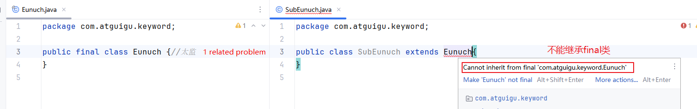


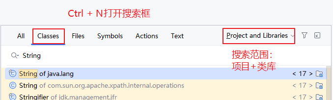

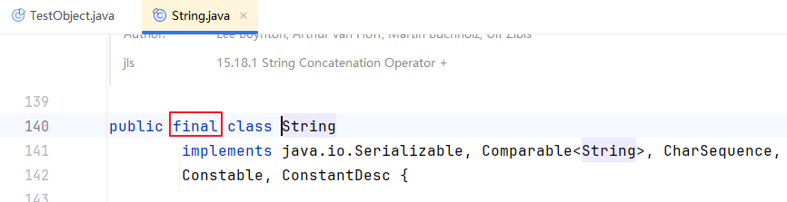

#### 案例2：final的方法

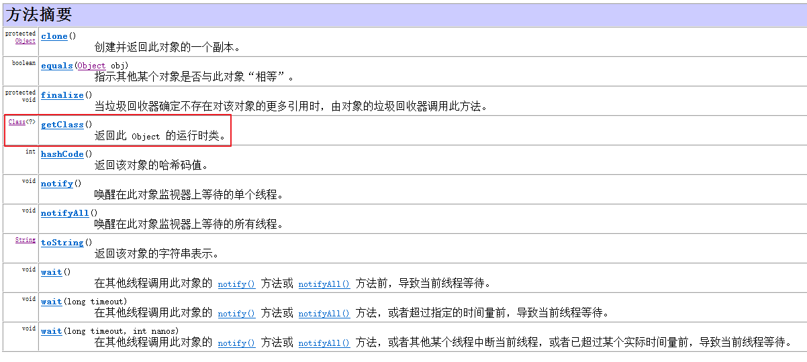

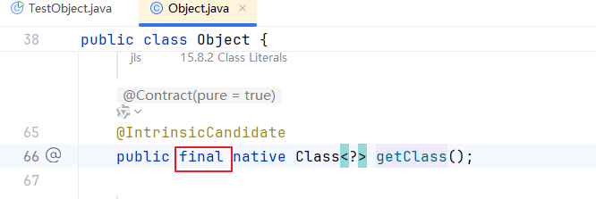

```java
package com.atguigu.keyword;

import com.atguigu.inherited.Student;

public class TestObject {
    public static void main(String[] args) {
        //Object类中有一个方法 getClass()，这个方法是用于返回对象的运行时类型
        String str = "hello";
        Student s = new Student();

        System.out.println(str.getClass());//getClass方法是从Object继承的
        //class java.lang.String
        System.out.println(s.getClass());//getClass方法是从Object继承的
        //class com.atguigu.inherited.Student
    }
}

```

#### 案例3：final的变量

```java
package com.atguigu.keyword;

public class Triangle {//三角形类
    //修改单词大小写的快捷键：Ctrl + Shift + U
    public static final String SHAPE_NAME = "三角形";
    //习惯上，大家只对静态的常量 写大写，
    //局部常量和实例常量一般不大写。
    
/*    private final double a = 1;
    private final double b = 1;
    private final double c = 1;*/
    private final double a;
    private final double b;
    private final double c;

    //通过构造器对a,b,c进行赋值
    public Triangle(double a, double b, double c) {
        this.a = a;
        this.b = b;
        this.c = c;
    }

    //此时无参构造中就不能空着了，必须给final的实例变量一个初始值
    public Triangle() {
        this.a = 1;
        this.b = 1;
        this.c = 1;
    }

    @Override
    public String toString() {
        return "Triangle{" +
                "a=" + a +
                ", b=" + b +
                ", c=" + c +
                '}';
    }
}

```

```java
package com.atguigu.keyword;

public class TestVariable {
    public static void main(String[] args) {
        final int a = 1;//局部变量a前面加final
//        a = 2;//不可以重新赋值
//        a++;//不可以修改值

        System.out.println(Triangle.SHAPE_NAME);
//        Triangle.SHAPE_NAME = "四角形";//不能重新赋值
        Triangle t1 = new Triangle(3,4,5);
        Triangle t2 = new Triangle(6,6,6);
        System.out.println(t1);
        System.out.println(t2);

        Triangle t3 = new Triangle();
        System.out.println(t3);

        System.out.println(Math.PI);
        System.out.println(Integer.MAX_VALUE);
        System.out.println(Integer.MIN_VALUE);
    }
}

```


## 3.7 练习题

### 3.7.1 题1

```java
package com.atguigu.exer;

/*
1、下面的代码声明了2个类，一个是TestOther测试类，一个是Other类
2、Other类有一个属性/成员变量/实例变量，它是int类型的，所以i的默认值是0
3、程序运行的入口是main方法
（1） Other o = new Other();
创建了1个Other类的对象，此时o对象的实例变量/属性值i 是默认值0
（2）new TestOther().addOne(o);
这里为什么要new TestOther()的目的是什么？
因为addOne是“非静态的”方法，而main是“静态的”，同一个类中，静态方法是不能直接调用非静态方法的。
addOne()方法的参数是引用数据类型，实参o给形参o是地址值，相当于两个o指向同一个Other类的对象，
那么它们操作的i是同一个i
（3）public void addOne(final Other o)
这里加final的影响是，不让形参o指向新对象
 */
public class TestOther {
    public static void main(String[] args) {
        Other o = new Other();
        new TestOther().addOne(o);
        System.out.println(o.i);
    }

    public void addOne(final Other o){
//        o = new Other();//错误的，因为o是final，不可以修改值。
        o.i++;
    }
}

class Other{
    public int i;//如果在i的前面加final，那么i的值就不允许修改了，i++就错了
}
```


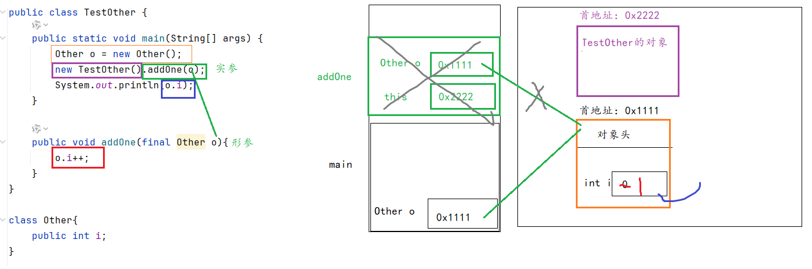

### 3.7.2 题2

```java
package com.atguigu.exer;

public class Person{
    public Person(){//构造器，无参构造器
        System.out.println("this is a Person.");
    }
}
```

```java
package com.atguigu.exer;

/*
（1）Teacher是Person的子类，Teacher类继承了Person类
（2）Teacher类声明了一个私有的属性/实例变量/成员变量 叫做name，这里直接初始化为"tom“
（3）Teacher也有一个无参构造，手动调用了父类的无参构造
 super();  但是，这句代码要求必须在子类构造器的首行，这里是错误的
           如果这里省略了 super(); 那么也会调用Person的无参构造。
           无论如何，子类构造器一定会调用父类的构造器。
 （4）this代表 调用当前方法的对象，但是main方法是静态方法，不需要对象来调用它，
 静态方法中是不允许出现this关键字的。
 （5）这里如果想要访问name属性值，可以通过 tea.name完成
 虽然name和main方法在同一个类中，但是main是静态的，无法直接访问非静态的name,
 必须通过对象.name来完成，这里通过tea.name
 */
public class Teacher extends Person{
    private String name = "tom";
    public Teacher(){
        System.out.println("this is a teacher.");
//        super();//错误
    }
    public static void main(String[] args){
        Teacher tea = new Teacher();
//        System.out.println(this.name);//错误
        System.out.println(tea.name);
    }
}
```

### 3.7.3 题3

```java
package com.atguigu.exer;

/*
1、下面的代码也是声明了2个类，一个是Father父类，一个是Test子类，子类同时又是测试类
2、此时父子类同时声明了name属性，名称相同，值不同
3、父类有一个getName()方法，子类自己没有声明getName()方法，可以调用getName()
4、在main方法中，创建了子类Test的对象，并且调用了test对象的getName()
 */
public class Test extends Father{
    private String name = "test";

    public static void main(String[] args) {
        Test test = new Test();
        System.out.println(test.getName());
    }
}

class Father {
    private String name = "father";

    public String getName() {
        return name;
    }
}
```

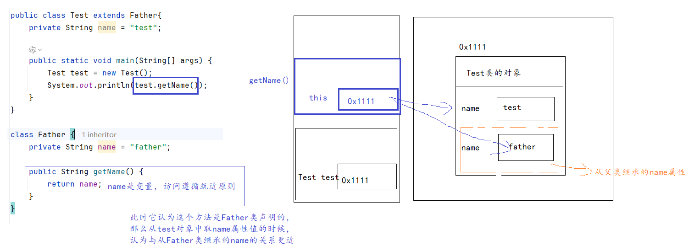

