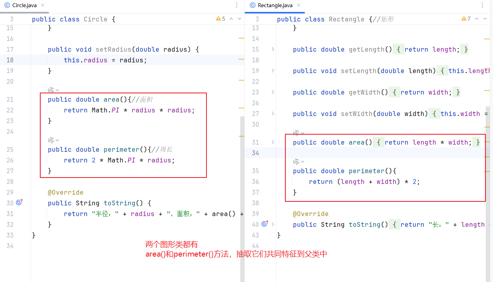
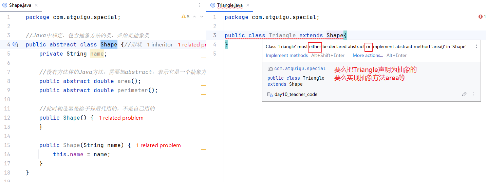
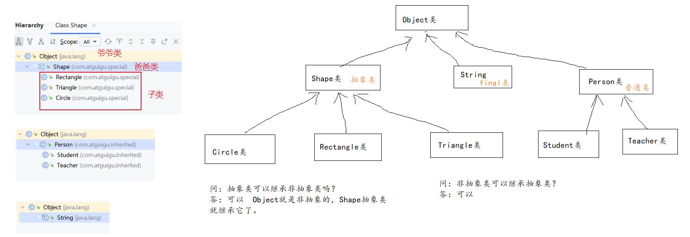

# 九、抽象类（重要）

## 4.1 什么是抽象类？

语法层面来说：有abstract修饰的类，就是抽象类。

```java
【权限修饰符】 abstract class 类名{
    
}
```


## 4.2 为什么要有抽象类？

父类是代表很多子类共同的特征，把很多子类共同的属性、方法抽取到父类中，从而避免在不同的子类中重复声明。

随着父类共同方法的抽取越来越抽象，就会出现抽象方法，即在父类中写不了具体方法体的方法，这样方法必须用abstract修饰，表示没有方法体的抽象方法，Java中规定，包含抽象方法的类必须是抽象类，这样的类是`不能直接new对象`的。



> 问：抽象类有构造器吗？
>
> 答：有，一定有。此时构造器是给子类用的。

## 4.3 抽象类怎么用

抽象类的存在的意义：

- 它代表所有子类共同的特征
- 抽象类就是用来被继承的，子类继承抽象类，必须`重写抽象类的所有抽象方法`，否则子类也是是抽象类



## 4.4 示例代码

```java
package com.atguigu.special;

//Java中规定，包含抽象方法的类，必须是抽象类
public abstract class Shape {//形状
    private String name;

    //没有方法体的Java方法，需要加abstract，表示它是一个抽象方法
    public abstract double area();
    public abstract double perimeter();

    //此时构造器是给子孙后代用的，不是自己用的
    public Shape() {
    }

    public Shape(String name) {
        this.name = name;
    }

    public String toString(){
        return "面积：" + area() +"，周长：" + perimeter();
    }
}

```

```java
package com.atguigu.special;

public class Rectangle extends Shape{//矩形
    private double length;
    private double width;

    public Rectangle() {
    }

    public Rectangle(double length, double width) {
        this.length = length;
        this.width = width;
    }

    public double getLength() {
        return length;
    }

    public void setLength(double length) {
        this.length = length;
    }

    public double getWidth() {
        return width;
    }

    public void setWidth(double width) {
        this.width = width;
    }

    public double area(){
        return length * width;
    }

    public double perimeter(){
        return (length + width) * 2;
    }

    @Override
    public String toString() {
        return "长：" + length + ", 宽：" + width + "，" + super.toString();
    }
}

```

```java
package com.atguigu.special;

public class Circle extends Shape{
    private double radius;//半径属性

    public Circle() {
    }

    public Circle(double radius) {
        this.radius = radius;
    }

    public double getRadius() {
        return radius;
    }

    public void setRadius(double radius) {
        this.radius = radius;
    }

    public double area(){//面积
        return Math.PI * radius * radius;
    }

    public double perimeter(){//周长
        return 2 * Math.PI * radius;
    }

    @Override
    public String toString() {
        return "半径：" + radius + "，" + super.toString();
    }
}

```

```java
package com.atguigu.special;

public class Triangle extends Shape{
    private double a;
    private double b;
    private double c;

    public Triangle() {
    }

    public Triangle(double a, double b, double c) {
        this.a = a;
        this.b = b;
        this.c = c;
    }

    public double getA() {
        return a;
    }

    public void setA(double a) {
        this.a = a;
    }

    public double getB() {
        return b;
    }

    public void setB(double b) {
        this.b = b;
    }

    public double getC() {
        return c;
    }

    public void setC(double c) {
        this.c = c;
    }
    //重写父类抽象方法的快捷键：Ctrl + O 或 Ctrl + I
    //Ctrl + O可以重写父类抽象的和非抽象的方法
//    Ctrl + I 重写父类的抽象方法

    @Override
    public double area() {
        double p = (a+b+c)/2;
        return Math.sqrt(p * (p-a) * (p-b) * (p-c));
    }

    @Override
    public double perimeter() {
        return a + b + c;
    }

    @Override
    public String toString() {
        return "边长：" + a +
                "," + b +
                "," + c
                + "，" + super.toString();
    }
}

```

```java
package com.atguigu.special;

public class TestShape {
    public static void main(String[] args) {
//        Shape s = new Shape();//抽象类是不能直接new对象的
//        System.out.println(s.area());
// 如果可以new对象，就可以通过对象调用抽象方法
        //但是抽象方法没有方法体可执行

        Circle c = new Circle(2.5);
        Rectangle r = new Rectangle(5,3);
        Triangle t = new Triangle(3,4,5);

        System.out.println(c);
        System.out.println(r);
        System.out.println(t);
    }
}

```

### 1. 抽象方法的本质

父类`Shape`中的`area()`和`perimeter()`是**抽象方法**（被`abstract`修饰），它们没有方法体，但强制要求所有非抽象子类（如`Circle`）必须实现这些方法。
你的`Circle`类作为子类，已经正确实现了这两个方法，这是编译通过的前提。

### 2. 方法调用的动态绑定

当执行`super.toString()`时，虽然调用的是父类`Shape`的`toString()`方法，但父类`toString()`中涉及的`area()`和`perimeter()`调用，会遵循 **“运行时对象类型决定方法实现”** 的规则：


- 实际创建的对象是`Circle`实例（比如`Shape shape = new Circle(5);`），这个对象的运行时类型是`Circle`。
- 当调用`area()`或`perimeter()`时，Java 会在运行时找到**该对象实际类型（Circle）中实现的方法**，而不是父类的抽象方法（父类也没有方法体可执行）。

### 3. 本质：多态的体现

## 4.5 答疑



