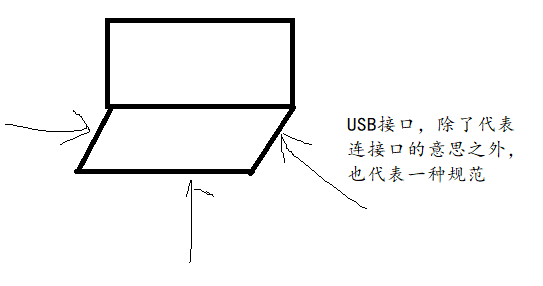
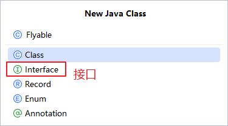
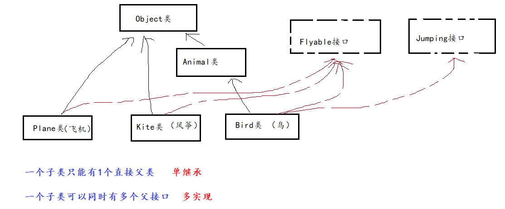
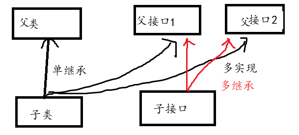
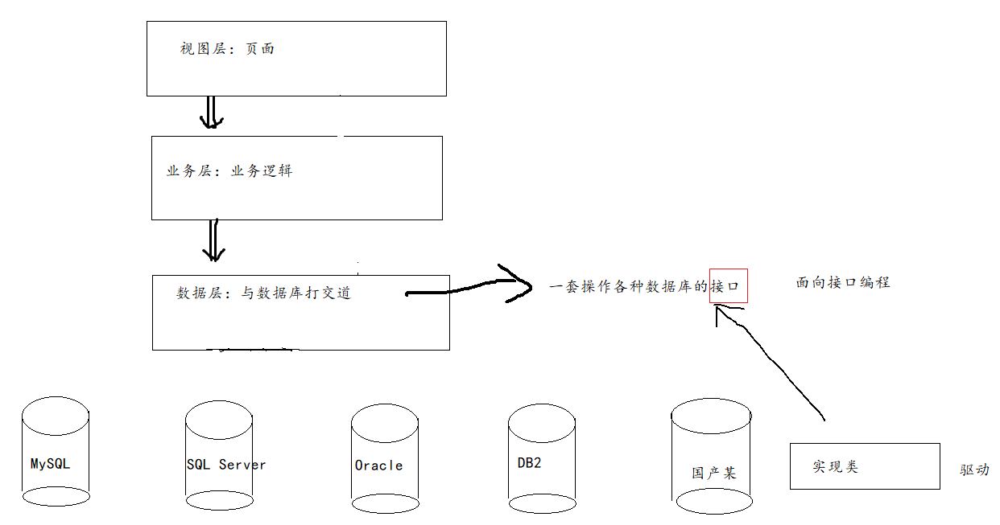
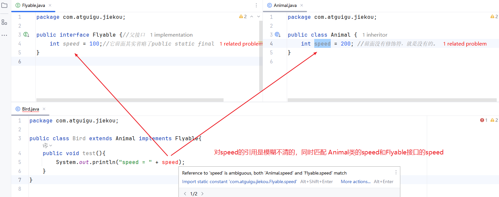
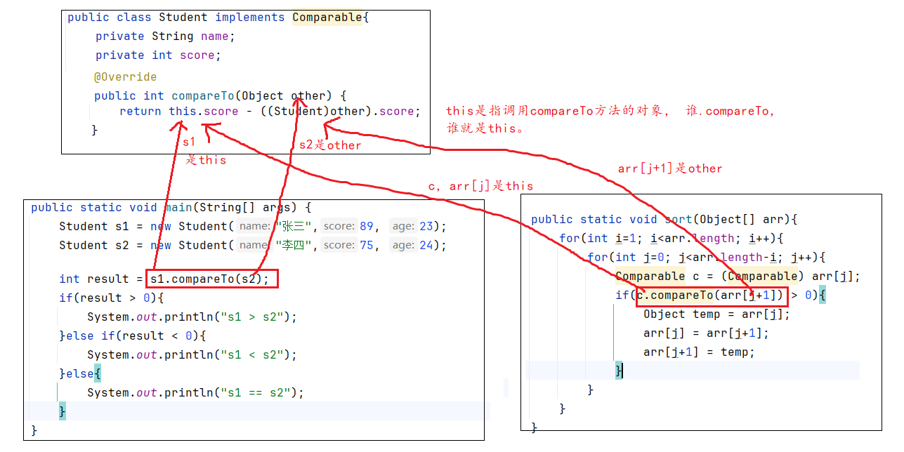
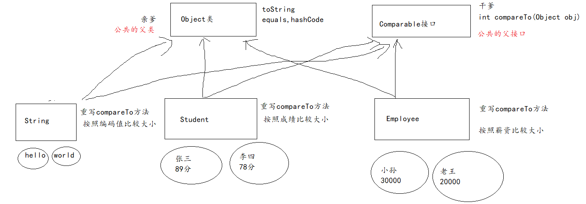
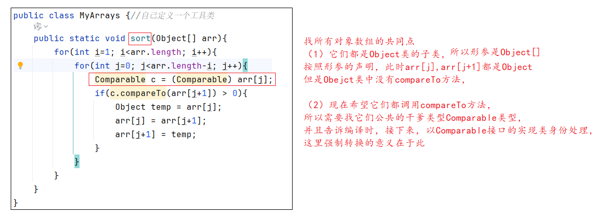
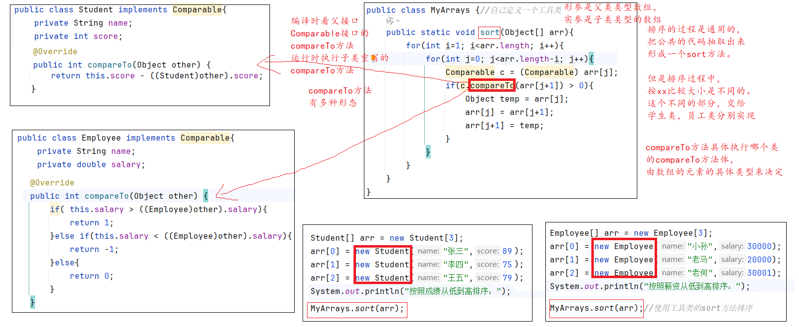

# 十、接口（重要）

## 5.1 什么是接口？

生活中：USB接口，电源插座的接口等，代表连接口。其实还代表了“标准”规范的意思。




Java中的接口也是代表（1）连接口（2）行为规范，方法的规范。

例如：后期做项目时，会调用银行接口，支付宝接口，微信支付接口来完成支付功能。

例如：后端服务器与前端的界面之间要约定双方传数据的规范，标准，这是也是接口的一部分。


从语法层面，说接口是用interface关键字声明的类型。


## 5.2 如何声明接口

```java
【修饰符】 interface 接口名{
    
}
```



## 5.3 接口的成员

回忆类的成员：

```java
(1)成员变量：静态变量和实例变量
(2)成员方法：静态方法和非静态方法
(3)构造器：无参构造和有参构造
(4)代码块
(5)内部类
```

**接口的成员有限制，明显与类不同：**

**JDK8之前：**

- 公共的静态的常量：public static final （3个关键字可以省略），因为接口是代表一种标准规范，那么具体的值必须是明确的，写死的。
- 公共的抽象方法`：public abstract（2个关键字可以省略），因为接口是代表一种标准规范，只是说它有什么功能，但是功能的具体实现要有子类来实现。抽象方法是没有方法体，子类必须实现/重写它。

**JDK8之后：**

- `公共的静态方法`：public static（其中public可以省略，static不能省略），静态方法必须有方法体。静态方法的调用不需要接口的对象。
- `公共的默认方法`：public default（其中public可以省略，default不能省略）
  - 为了接口的升级，Java允许定义默认方法。默认方法是可以写方法体的，子类可以选择实现它，也可以选择不实现它。
  - 如果没有默认方法，按照之前的语法规则，接口中只能增加抽象方法，一旦父接口增加抽象方法，就会影响所有的实现类。

**JDK9之后：**

- 私有的方法（了解）：用于表示接口中内部使用的方法，通常是因为两个静态方法，或两个默认方法之间有共同代码，抽取出来的一个内部方法，这段代码只是功能的一部分，不是完整的功能，不希望外部调用，所以私有化。

## 5.4 接口的特点

- 接口不能直接new对象

- 接口允许多实现
- 接口与接口支持多继承





> 问：抽象类与接口有什么区别？
>
> 相同的：它们都不能new对象，因为它们里面都可能有抽象方法。
>
> 不同点：
>
> （1）成员不同（见上）
>
> （2）类与类之间有“单继承”的限制，需要通过接口来解决这个问题，接口允许多实现

## 5.5 如何使用接口的各个成员

- 静态的，用接口名.静态成员
- 非静态的，创建子类对象，然后对象名.非静态成员

## 5.6 示例代码

```java
package com.atguigu.jiekou;

public class Animal {
    public void eat(){
        System.out.println("吃东西");
    }
}

```

```java
package com.atguigu.jiekou;

public interface Flyable {
    public static final int SPEED = 100;//public static final可以省略
    public abstract void fly();

    public static void prepare(){
        System.out.println("准备起飞");
    }

    public default  void show(){
        System.out.println("我很漂亮");
    }
}

```

```java
package com.atguigu.jiekou;

public interface Jumping {
    void jump();
}

```

```java
package com.atguigu.jiekou;

/*
类与类之间只能单继承，Bird只能有一个直接父类， Animal是Bird的亲生父亲
类与接口之间可以多实现，Bird可以同时有多个父接口，Flyable,Jumping是Bird的干爹
 */
public class Bird extends Animal implements Flyable,Jumping{
    @Override
    public void fly() {
        System.out.println("我要飞的更高！！");
    }

    @Override
    public void jump() {
        System.out.println("我只能蹦蹦跳");
    }
}

```

```java
package com.atguigu.jiekou;

public class Plane implements Flyable{
    @Override
    public void fly() {
        System.out.println("飞入云霄");
    }

    @Override
    public void show() {
        System.out.println("我很酷");
    }
}

```

```java
package com.atguigu.jiekou;

public class Kite implements Flyable{
    @Override
    public void fly() {
        System.out.println("我借助风的力量，飞的很高！");
    }
}

```

```java
package com.atguigu.jiekou;

public class TestFlyable {
    public static void main(String[] args) {
//        Flyable f = new Flyable();//不能直接创建接口的对象，这一点与抽象类是一样的。
        //如何使用接口的抽象方法？
        Bird b = new Bird();//创建接口的实现类/子类对象，才能调用接口的抽象方法
        b.fly();//其实执行的是Bird中重写的fly方法

        //如何使用接口的静态方法？
        Flyable.prepare(); //接口名.静态方法

        //如何使用接口的默认方法？
        b.show();

        //只要子类重写了fly,show方法，都在执行重写后的方法体
        Plane p = new Plane();
        p.fly();
        p.show();

        //如何使用接口的常量？
        System.out.println(Flyable.SPEED);
        /*
        结论：
        使用静态的，就是类型名.静态成员
        使用非静态的，就是new对象，然后对象.非静态成员
         */
    }
}
```


## 5.7 接口的作用/意义

因为接口允许多实现，可以`解决抽象类单继承的限制问题`。

类与接口之间可以是简单的has-a或like-a的关系，而不是死板的is-a的关系。

- 如果是is-a的关系，在逻辑层面要求比较严格。
  - Bird is a Animal。
  - Student is a Person。
  - Circle is a Shape。
- 而has-a或like-a的关系的话，我们只要某个类想要拥有这个接口的方法，那么就可以继承它，不用管逻辑关系。
  - Bird has a fly方法。
  - Plane has a fly方法。
  - Kite has a fly方法。
  - Superman has a fly方法。
  - UFO like a flyable things。

例如：连接wifi，不一定是电脑，手机。可以是任意设备，只要遵循wifi的通信规则设计连网能力，家里任何设备都可以连接wifi。



# 题 1: Overload 与 Override 的区别

### 答法一:

Overload 是指方法的重载，在同一个类或父子类中，方法名相同，形参列表不同的两个方法，称为重载。

Override 是指方法的重写，当子类继承父类或实现父接口时，如果父类或父接口中某个方法的实现不适用于子类，那么子类可以进行重写，要求方法名相同，形参列表相同，权限修饰符满足`>=`的关系，返回值类型总体来说满足`<=`的关系。

### 答法二:

|                              | Overload 方法的重载 | Override 方法的重写                              |
| ---------------------------- | ------------------- | ------------------------------------------------ |
| 位置                         | 同一个类或父子类    | 父子类                                           |
| 权限修饰符                   | 不看                | `>=`，private 的方法不能被重写                   |
| 其他修饰符                   | 不看                | static，final 的方法不能被重写                   |
| 返回值类型                   | 不看                | 基本数据类型和 void：必须相同 引用数据类型：`<=` |
| 方法名                       | 必须相同            | 必须相同                                         |
| 形参列表（个数、类型、顺序） | 必须不同            | 必须相同                                         |

# 题 2：四种权限修饰符的可见性范围分别是什么

|           | 本类中 | 本包的其他类中 | 其他包的子类中 | 其他包的非子类中 |
| --------- | ------ | -------------- | -------------- | ---------------- |
| private   | √      | ×              | ×              | ×                |
| 缺省      | √      | √              | ×              | ×                |
| protected | √      | √              | √              | ×                |
| public    | √      | √              | √              | √                |

**补充：**

- 类（不包括后面要学习的内部类）的前面只允许有`public` 或 缺省。
- 成员变量：四种权限修饰符都可以使用。
- 构造器：四种权限修饰符都可以使用。
- 成员方法：四种权限修饰符都可以使用。

# 题4：构造器的声明格式及其特点和要求

```java
【修饰符】 class 类名 {
    【修饰符】 类名() {
    }
    
    【修饰符】 类名(形参列表) {
    }
}
```

## 构造器的特点和要求

- 构造器的名称必须与类名完全一致；

- 构造器没有返回值类型；

- 构造器的权限修饰符只能是 `public`、`protected`、缺省、`private`，不能有其他修饰符（如 `static`、`final`、`native`、`abstract` 等）；

- 所有类（包括抽象类）都有构造器；

- 如果一个类没有手动定义构造器，编译器会自动为其添加默认的无参构造器；

- 如果一个类手动定义了构造器，编译器就不会自动添加默认的无参构造器，此时该类只有手动定义的构造器；

- 构造器不会被子类继承，但一定会被子类调用：

  - 默认情况下，子类调用的是父类的无参构造；

  - 也可以手动调用父类的构造器：

    - `super()`：调用父类的无参构造；
    - `super(参数)`：调用父类的有参构造；

  - 如果子类构造器中没有写 `super()` 或 `super(参数)`，默认表示调用父类的无参构造.

    

  

# 题6：默写目前学过的36个关键字

```java

## 数据类型相关
- 8种基本数据类型：`byte`, `short`, `int`, `long`, `float`, `double`, `char`, `boolean`
- 引用数据类型：`class`, `interface`
- 空类型：`void`

## 流程控制语句结构
- 条件判断：`if`, `else`
- 选择结构：`switch`, `case`, `default`
- 循环结构：`for`, `do`, `while`
- 跳转语句：`break`, `continue`, `return`

## 和包有关
- `package`, `import`

## 和对象有关
- `new`, `super`, `this`

## 和关系有关
- `extends`, `implements`

## 修饰符
- 权限修饰符：`private`, `protected`, `public`
- 其他修饰符：`static`, `final`, `native`, `abstract`

## 保留字（预留的关键字）
- `goto`, `const`, `_`

## 特殊值
- `true`, `false`, `null`
```

## 2.1 接口的成员的冲突问题

### 1、父类与父接口的成员变量的冲突问题

这种情况比较少见，但是如果出现了，知道怎么解决即可。



```java
package com.atguigu.jiekou;

public interface Flyable {//父接口
    int speed = 100;//它前面其实省略了public static final
}

```

```java
package com.atguigu.jiekou;

public class Animal {
    int speed = 200; //前面没有修饰符，就是没有的。
}

```

```java
package com.atguigu.jiekou;

public class Bird extends Animal implements Flyable{
//    int speed = 300;
    public void test(){
        System.out.println("父类的speed = " + super.speed);
        System.out.println("父接口的speed = " + Flyable.speed);//因为speed在接口中是static
    }
}

```

```java
package com.atguigu.jiekou;

public class TestBird {
    public static void main(String[] args) {
        Bird b = new Bird();
        System.out.println(b);
    }
}
```

### 2、父类的方法与父接口的默认方法冲突

当父类的方法，与父接口的默认方法冲突（方法签名相同），此时遵循亲爹优先原则。默认子类选择的是父类的方法。

```java
所谓的方法签名：
    【修饰符】 返回值类型 方法名(形参列表)  
```

```java
package com.atguigu.jiekou;

public interface Swimming {
    public default void swim(){
        System.out.println("狗刨");
    }
}

```

```java
package com.atguigu.jiekou;

public class Father {
    public void swim(){
        System.out.println("蛙泳");
    }
}

```

```java
package com.atguigu.jiekou;

public class Son extends Father implements Swimming{
}

```

```java
package com.atguigu.jiekou;

public class TestSon {
    public static void main(String[] args) {
        Son s = new Son();
        s.swim();//蛙泳，遵循亲爹优先原则
    }
}

```

### 3、两个父接口的默认方法冲突

当两个父接口的默认方法冲突（方法签名相同），子类必须做出选择，否则编译不通过。

- 选择父接口1的：父接口1.super.默认方法
- 选择父接口2的：父接口2.super.默认方法
- 可以完全重写，任何一个父接口都不选

```java
package com.atguigu.jiekou;

public interface A {
    public default void method(){
        System.out.println("A.method");
    }
}

```

```java
package com.atguigu.jiekou;

public interface B {
    public default void method(){
        System.out.println("B.method");
    }
}

```

```java
package com.atguigu.jiekou;

public class Sub implements A,B{
    @Override
    public void method() {
        A.super.method();
        System.out.println("xxx");
    }
}

```

```java
package com.atguigu.jiekou;

public class TestSub {
    public static void main(String[] args) {
        Sub s = new Sub();
        s.method();
    }
}

```

## 2.2 经典接口：比较器接口

### 2.2.1 java.lang.Comparable接口

Comparable接口：自然比较接口

应用场景：当两个对象要比较大小或排序时，就需要实现这个接口。

具体方式：哪个类的对象要比较大小，就让哪个类实现Comparable接口。实现接口，必须重写/实现接口的抽象方法。

```java
int compareTo(Object other)  抽象方法
```

子类/实现类在重写这个方法时，方法体没有限制，但是返回值有具体要求：

- 当this对象  “大于” other对象时，就返回 正整数
- 当this对象  “小于” other对象时，就返回 负整数
- 当this对象 “等于”  other对象时，就返回零

> 结论：Java中凡是涉及到对象比较大小的类型，统统都会实现Comparable接口，并且重写int compareTo(Object obj)方法。
>
> 这样才能使用我们后面Arrays.sort等通用方法。
>
> 例如：String字符串，Integer整数类等等都实现了这个接口

#### 案例1：学生对象比较大小和排序

```java
package com.atguigu.compare;

/*
一个类编写代码的习惯：
（1）成员变量
（2）构造器
（3）成员方法
get/set
...

 */
public class Student implements Comparable{
    private String name;
    private int score;
    private int age;

    public Student() {
    }

    public Student(String name, int score, int age) {
        this.name = name;
        this.score = score;
        this.age = age;
    }

    public String getName() {
        return name;
    }

    public void setName(String name) {
        this.name = name;
    }

    public int getScore() {
        return score;
    }

    public void setScore(int score) {
        this.score = score;
    }

    public int getAge() {
        return age;
    }

    public void setAge(int age) {
        this.age = age;
    }

    @Override
    public String toString() {
        return "Student{" +
                "name='" + name + '\'' +
                ", score=" + score +
                ", age=" + age +
                '}';
    }

    @Override
    public int compareTo(Object other) {
        /*
        1、这里有2个对象在比较大小？
        this 和 other 两个对象比较大小

        2、怎么比较大小？根据需求来定
        假设，这里按照成绩比较大小
        this.score 与 other.score
         */
        return this.score - ((Student)other).score;
    }
}

```

```java
package com.atguigu.compare;

public class TestStudent {
    public static void main(String[] args) {
        Student s1 = new Student("张三",89, 23);
        Student s2 = new Student("李四",75, 24);

        //比较大小
//        System.out.println(s1 > s2);//错误，因为s1和s2里面存到的是地址值
        int result = s1.compareTo(s2);
        if(result > 0){
            System.out.println("s1 > s2");
        }else if(result < 0){
            System.out.println("s1 < s2");
        }else{
            System.out.println("s1 == s2");
        }
    }
}

```

```java
package com.atguigu.compare;

public class TestStudent2 {
    public static void main(String[] args) {
        System.out.println("=================");

        Student[] arr = new Student[3];
        arr[0] = new Student("张三",89, 23);
        arr[1] = new Student("李四",75, 24);
        arr[2] = new Student("王五",79, 25);
        for (int i = 0; i < arr.length; i++) {
            System.out.println(arr[i]);
        }

        //按照成绩排序：从低到高
        System.out.println("按照成绩从低到高排序：");
        for(int i=1; i<arr.length; i++){
            for(int j=0; j<arr.length-i; j++){
                //arr[j]和arr[j+1]
                if(arr[j].compareTo(arr[j+1]) > 0){
                    Student temp = arr[j];
                    arr[j] = arr[j+1];
                    arr[j+1] = temp;
                }
            }
        }

        for (int i = 0; i < arr.length; i++) {
            System.out.println(arr[i]);
        }
    }
}

```

#### 案例2：员工对象排序

```java
package com.atguigu.compare;

public class Employee implements Comparable{
    private String name;
    private double salary;

    public Employee() {
    }

    public Employee(String name, double salary) {
        this.name = name;
        this.salary = salary;
    }

    public String getName() {
        return name;
    }

    public void setName(String name) {
        this.name = name;
    }

    public double getSalary() {
        return salary;
    }

    public void setSalary(double salary) {
        this.salary = salary;
    }

    @Override
    public String toString() {
        return "Employee{" +
                "name='" + name + '\'' +
                ", salary=" + salary +
                '}';
    }

    @Override
    public int compareTo(Object other) {
        //假设要按照薪资比较大小
        //this 和 other
        if( this.salary > ((Employee)other).salary){
            return 1;
        }else if(this.salary < ((Employee)other).salary){
            return -1;
        }else{
            return 0;
        }
    }
}
```

```java
package com.atguigu.compare;

public class TestEmployee {
    public static void main(String[] args) {
        Employee[] arr = new Employee[3];
        arr[0] = new Employee("小孙",30000);
        arr[1] = new Employee("老马",20000);
        arr[2] = new Employee("老何",30001);

        for (int i = 0; i < arr.length; i++) {
            System.out.println(arr[i]);
        }

        System.out.println("按照薪资从低到高排序：");
        for(int i=1; i<arr.length; i++){
            for(int j=0; j<arr.length-i; j++){
                //arr[j]和arr[j+1]
                if(arr[j].compareTo(arr[j+1]) > 0){
                    Employee temp = arr[j];
                    arr[j] = arr[j+1];
                    arr[j+1] = temp;
                }
            }
        }

        for (int i = 0; i < arr.length; i++) {
            System.out.println(arr[i]);
        }
    }
}

```

#### 案例3：数组工具类

```java
package com.atguigu.compare;

public class MyArrays {//自己定义一个工具类
    public static void sort(Object[] arr){
        for(int i=1; i<arr.length; i++){
            for(int j=0; j<arr.length-i; j++){
                //arr[j]和arr[j+1]
                //如果arr[j]要拥有compareTo方法，那么arr[j]对应的类型必须实现Comparable接口
                /*
                这里咱们约定好，如果要用sort方法排序，那么这数组中的元素的类，必须实现Comparable接口，
                重写compareTo方法，否则就算你调用这个sort，我也不能给你排序，
                会报ClassCastException错误。
                 */
                Comparable c = (Comparable) arr[j];//让arr[j]的类型以Comparable类型呈现
                if(c.compareTo(arr[j+1]) > 0){
                    Object temp = arr[j];
                    arr[j] = arr[j+1];
                    arr[j+1] = temp;
                }
            }
        }
    }
}

```

```java
package com.atguigu.compare;

public class TestStudent3 {
    public static void main(String[] args) {
        System.out.println("=================");

        Student[] arr = new Student[3];
        arr[0] = new Student("张三",89, 23);
        arr[1] = new Student("李四",75, 24);
        arr[2] = new Student("王五",79, 25);
        for (int i = 0; i < arr.length; i++) {
            System.out.println(arr[i]);
        }

        //按照成绩排序：从低到高
        System.out.println("按照成绩从低到高排序：");

        MyArrays.sort(arr);//使用工具类的sort方法排序

        for (int i = 0; i < arr.length; i++) {
            System.out.println(arr[i]);
        }
    }
}

```

```java
package com.atguigu.compare;

public class TestEmployee2 {
    public static void main(String[] args) {
        Employee[] arr = new Employee[3];
        arr[0] = new Employee("小孙",30000);
        arr[1] = new Employee("老马",20000);
        arr[2] = new Employee("老何",30001);

        for (int i = 0; i < arr.length; i++) {
            System.out.println(arr[i]);
        }

        System.out.println("按照薪资从低到高排序：");
        MyArrays.sort(arr);//使用工具类的sort方法排序

        for (int i = 0; i < arr.length; i++) {
            System.out.println(arr[i]);
        }
    }
}
```

#### 相关代码分析

#### 1、compareTo方法中this和other是谁？



#### 2、数组工具类中为什么要把元素强制转换为Comparable类型





#### 3、数组工具类中compareTo方法执行的是哪个类的方法体

