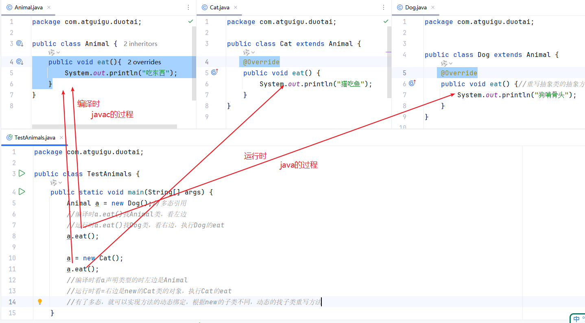
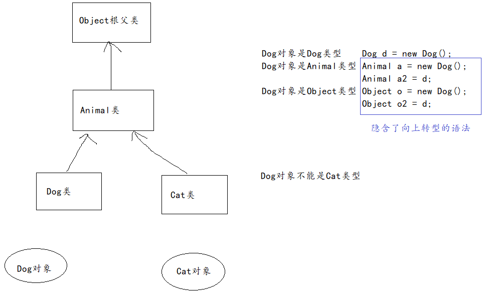
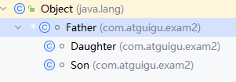
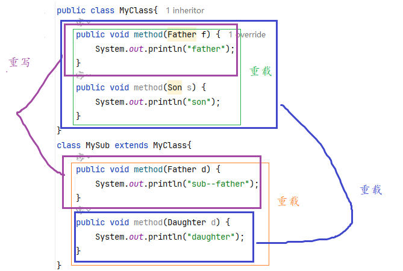

# 三、多态（重要）

## 3.1 什么是多态？

多态的字面意思：多种形态。

Java中多态，是和`方法`有关。

Java中如何体现多态？

- 编译时：方法的重载，一个功能可以有多种实现的方式，方法名相同，形参列表不同，例如：max方法都是找最大值，但是有多种形式，可以是2个整数，3个整数，2个小数.....
  - int max(int a, int b)
  - int max(int a,int b, int c)
  - double max(double a, double b)

- 运行时：方法的重写，父类或父接口的方法，在不同子类中都有不同的实现。例如：Comparable接口的int compareTo(Object obj)，每一个实现类都有不同的实现
  - Student类实现Comparable接口，重写compareTo方法，按照成绩比较大小
  - Employee类实现Comparable接口，重写compareTo方法，按照薪资比较大小

## 3.2 运行时多态如何表现？

多态引用：左边是父类或父接口的类型的变量，右边是子类的对象，这种引用方式就是多态引用。

一旦多态引用，就只能调用父类有的公共的方法，不能调用子类特有的方法。

`编译时看左边，运行时看右边`。如果子类重写了父类/父接口的方法，执行的是子类`重写`的方法体。如果没有重写，仍然执行父类/父接口的方法。

运行时多态让Java的方法实现动态绑定机制。



```java
package com.atguigu.duotai;

public class Animal {
    public void eat(){
        System.out.println("吃东西");
    }
}

```

```java
package com.atguigu.duotai;


public class Dog extends Animal {
    @Override
    public void eat() {//重写抽象类的抽象方法
        System.out.println("狗啃骨头");
    }
    public void watchHouse(){
        System.out.println("看家");
    }
}

```

```java
package com.atguigu.duotai;

public class Cat extends Animal {
    @Override
    public void eat() {
        System.out.println("猫吃鱼");
    }
    public void catchMouse(){
        System.out.println("抓老鼠");
    }
}

```

```java
package com.atguigu.duotai;

public class TestAnimals {
    public static void main(String[] args) {
        Animal a = new Dog();//多态引用   一旦多态引用，就只能调用父类有子类也有的方法
        //编译时a.eat()找Animal类，看左边
        //运行时a.eat()找Dog类，看右边，执行Dog的eat
        a.eat();
//        a.watchHouse();//编译报错，多态引用，不能调用父类无子类有的方法

        a = new Cat();
        a.eat();
        //编译时看a声明类型的时左边是Animal
        //运行时看=右边是new的Cat类的对象，执行Cat的eat
        //有了多态，就可以实现方法的动态绑定，根据new的子类不同，动态的找子类重写方法
    }
}
```


## 3.3 多态应用的场景

### 3.3.1 多态数组

元素的类型声明为父类类型，元素存储的是子类对象。通过多态数组，可以管理一组具有相同父类的子类对象。

```java
package com.atguigu.duotai;

public abstract class Shape {//抽象父类
    public abstract double area();
    public abstract double perimeter();
    /*
    在抽象父类中编写这2个抽象方法的作用？
    （1）在父类中可以调用它们，如果没写，父类中就无法调用它们
    （2）在测试类中，可以通过Shape元素调用area方法
     */

    //这里重写的是Object类的toString方法
    @Override
    public String toString(){
        return "面积：" + area() +"，周长：" + perimeter();
    }
}

```

```java
package com.atguigu.duotai;

public class Rectangle extends Shape {//矩形
    private double length;
    private double width;

    public Rectangle() {
    }

    public Rectangle(double length, double width) {
        this.length = length;
        this.width = width;
    }

    public double getLength() {
        return length;
    }

    public void setLength(double length) {
        this.length = length;
    }

    public double getWidth() {
        return width;
    }

    public void setWidth(double width) {
        this.width = width;
    }

    //重写了抽象父类的两个抽象方法
    @Override
    public double area(){
        return length * width;
    }

    @Override
    public double perimeter(){
        return (length + width) * 2;
    }

    @Override
    public String toString() {
        return "长：" + length + ", 宽：" + width + "，" + super.toString();
    }
}

```

```java
package com.atguigu.duotai;

public class Circle extends Shape {
    private double radius;//半径属性

    public Circle() {
    }

    public Circle(double radius) {
        this.radius = radius;
    }

    public double getRadius() {
        return radius;
    }

    public void setRadius(double radius) {
        this.radius = radius;
    }

    @Override
    public double area(){//面积
        return Math.PI * radius * radius;
    }

    @Override
    public double perimeter(){//周长
        return 2 * Math.PI * radius;
    }

    @Override
    public String toString() {
        return "半径：" + radius + "，" + super.toString();
    }
}

```

```java
package com.atguigu.duotai;

public class Triangle extends Shape{
    private double a;
    private double b;
    private double c;

    public Triangle() {
    }

    public Triangle(double a, double b, double c) {
        this.a = a;
        this.b = b;
        this.c = c;
    }

    public double getA() {
        return a;
    }

    public void setA(double a) {
        this.a = a;
    }

    public double getB() {
        return b;
    }

    public void setB(double b) {
        this.b = b;
    }

    public double getC() {
        return c;
    }

    public void setC(double c) {
        this.c = c;
    }
    //重写父类抽象方法的快捷键：Ctrl + O 或 Ctrl + I
    //Ctrl + O可以重写父类抽象的和非抽象的方法
//    Ctrl + I 重写父类或父接口的抽象方法

    @Override
    public double area() {
        double p = (a+b+c)/2;
        return Math.sqrt(p * (p-a) * (p-b) * (p-c));
    }

    @Override
    public double perimeter() {
        return a + b + c;
    }

    @Override
    public String toString() {
        return "边长：" + a +
                "," + b +
                "," + c
                + "，" + super.toString();
    }
}

```

```java
package com.atguigu.duotai;

public class TestArray {
    public static void main(String[] args) {
        //需求：存储一组图形的对象，统一管理它们，比如：让它们以面积从小到大排序，暂时先不用Comparable接口
        //多态数组：元素的类型声明为父类类型，元素存储的是子类对象。
        Shape[] arr = new Shape[5];

        //下面这些赋值语句，体现了多态引用
        //arr[下标] 它们声明的类型是Shape类型，父类类型
        //arr[下标] 它们赋值的/存储的是子类对象
        //左边是父类或父接口的类型的变量，右边是子类的对象，这种引用方式就是多态引用。
        arr[0] = new Circle(2.5);
        arr[1] = new Rectangle(4,3);
        arr[2] = new Rectangle(5,2);
        arr[3] = new Triangle(3,4,5);
        arr[4] = new Triangle(6,6,6);

        //当arr[下标]调用方法时，就会遵循编译时看左边，运行时看右边
        for(int i=1; i<arr.length; i++){
            for(int j=0; j<arr.length-i; j++){
                //按照面积比较大小
                //编译时，arr[j]是Shape类型，会看Shape类中有没有area()方法
                //运行时，arr[j]会执行子类中重写的area()方法，具体执行哪个子类的，看arr[j]存的是哪个子类的对象
                //遵循了动态绑定
                if(arr[j].area() > arr[j+1].area()){
                    Shape temp = arr[j];
                    arr[j] = arr[j+1];
                    arr[j+1] = temp;
                }
            }
        }

        for (int i = 0; i < arr.length; i++) {
            System.out.println(arr[i]);
        }
    }
}

```


### 3.3.2 多态参数

方法的形参是父类类型，调用方法时的实参是子类对象。在当前方法中，通过形参调用方法，编译时看父类，运行时看子类。

```java
package com.atguigu.duotai;

public class TestAnimal {
    public static void main(String[] args) {
        Dog d = new Dog();
        Cat c = new Cat();

        look(d); //调用方法会有传参的过程  Animal animal形参 = d实参; 比较隐晦的多态引用形式
        look(c);

    }

    //定义一个方法，可以观察动物吃东西的行为
    public static void look(Animal animal){//形参是父类类型
        animal.eat();
        //编译时animal以Animal类型呈现，即以父类类型呈现，只能调用父类有的方法
        //运行时animal执行哪个类eat方法，要看具体的实参
    }
    //可以通过重载的方式，为每一个子类都单独定义一个方法，比较麻烦，重复度高，而且后期维护的成本比较高，如果增加子类，减少子类，这些方法都要涉及到修改
/*    public static void look(Dog dog){
        dog.eat();
    }
    public static void look(Cat cat){
        cat.eat();
    }*/
}

```


### 3.3.3 多态返回值

方法的返回值类型是父类类型，实际返回的结果是子类的对象。

```java
package com.atguigu.duotai;

public class TestAnimal2 {
    public static void main(String[] args) {
        Animal a = buy("狗");//多态引用
        //a是Animal类型，但是实际返回的是子类Dog的对象
        a.eat();
        //编译时看Animal的eat方法
        //运行时看Dog的eat方法

        a = buy("猫");
        a.eat();
        //编译时看Animal的eat方法
        //运行时看Cat的eat方法
    }

    //定义一个方法，可以购买不同宠物对象，形参是用来确定宠物的类型
    //type是狗，返回Dog的对象
    //type是猫，返回Cat的对象
    public static Animal buy(String type){
        switch (type){
            case "狗" : return new Dog();
            case "猫" : return new Cat();
            default: return null;
        }
    }
}

```

## 3.4 向上转型与向下转型

回忆：基本数据类型也有类型转换

- 自动类型转换：小->大  byte->short->int ->long->float->double
- 强制类型转换：大->小  double->float->long->int->short->byte ，有风险，可能损失精度或溢出截断

现在：向上转型与向下转型是针对引用数据类型，而且是针对父子类（父可以是父类，父接口）

- 向上转型：让子类对象以父类或父接口的类型处理（这里的处理，就是接下来调用方法等操作）
- 向下转型：让父类的变量以子类类型处理（这里的处理，就是接下来调用方法等操作）



### 3.4.1 向上转型

```java
package com.atguigu.cast;

import com.atguigu.duotai.Animal;
import com.atguigu.duotai.Dog;

public class TestUpCastingAndDownCasting {
    public static void main(String[] args) {
        Dog d = new Dog();
        d.watchHouse();//Dog自己定义的方方法
        d.eat();//Animal就有的方法
        System.out.println(d.toString());//Object类有的方法

        Animal a = d;
        //a.watchHouse();//错误
        a.eat();
        System.out.println(a.toString());
        
        Object o = d;
     //   o.watchHouse();
      //  o.eat();
        System.out.println(o.toString());
        //越向上转型，能调用的方法越少
        
        
    }
}

```


### 3.4.2 向下转型

```java
package com.atguigu.cast;

import com.atguigu.duotai.Animal;
import com.atguigu.duotai.Dog;

public class TestUpCastingAndDownCasting2 {
    public static void main(String[] args) {
        Object o = new Dog();
//           o.watchHouse();
//          o.eat();
        System.out.println(o.toString());

        Animal a = (Animal) o;//强制向下转型，有风险隐患
        //a.watchHouse();//错误
        a.eat();
        System.out.println(a.toString());

        Dog d = (Dog) o;
        d.watchHouse();//Dog自己定义的方方法
        d.eat();//Animal就有的方法
        System.out.println(d.toString());//Object类有的方法
        //越往下，能调用的方法越多
    }
}

```

### 3.4.3 为什么有向上转型和向下转型？

当我们使用多态数组、多态参数、多态返回值类型时，不得不向上，因为那个时候，关注的是它们（各个子类）的共同操作。

因为向上转型之后，就失去了调用子类特有方法的能力，如果又需要调用子类特有方法，此时就必须向下转型。

向上转型都是安全的，但是向下转型时会有风险，可能会发生ClassCastException类型转换异常。


### 3.4.4 关键字：instanceof

instanceof的作用是用于判断某个变量/对象是不是属于某个类型的。

```java
变量/对象 instanceof 类型
```

当这个变量或对象是该类型或该类型的子类对象时，才会返回true。

```java
package com.atguigu.cast;

import com.atguigu.duotai.Animal;
import com.atguigu.duotai.Cat;
import com.atguigu.duotai.Dog;

public class TestInstanceof {
    public static void main(String[] args) {
        Object o = new Dog();
        //o实际对象的类型是Dog，称为o的运行时类型是Dog类型
        //o的编译时类型是Object
        //编译时看左边，运行时看右边
        //只要Dog或Dog以上的，都是true
        System.out.println(o instanceof Object);//true
        System.out.println(o instanceof Animal);//true
        System.out.println(o instanceof Dog);//true
        System.out.println(o instanceof Cat);//false
        System.out.println(o instanceof Husky);//false
    }
}

```


## 3.5 变态面试题（会分析即可）

### 3.5.1 多态引用结合静态方法

> 结论：没有“编译时看左边，运行时看右边”，因为静态方法不会被重写。
>
> 如果是自己写，千万不要用“对象.静态方法”，而是要用“类名.静态方法”

```java
package com.atguigu.exam;

public class Father {
    public static void method(){
        System.out.println("Father.静态方法method");
    }
}

```

```java
package com.atguigu.exam;

public class Son extends Father{
    //不是重写，也不是重载
    public static void method(){
        System.out.println("Son.静态方法method");
    }
}

```

```java
package com.atguigu.exam;

public class TestSon {
    public static void main(String[] args) {
        Father f =new Son();
        f.method();//因为静态方法不会被重写，此时不会遵循“编译时看左边，运行时看右边”，编译和运行都是看左边。
        //上面的写法只会出现在变态面试题中，实际开发中不会这么写

        //下面才是正经写法
        Father.method();
        Son.method();
    }
}

```

### 3.5.2 多态引用结合成员变量

```java
package com.atguigu.exam;

public class Base {//父类
    int a = 1;
}

```

```java
package com.atguigu.exam;

public class Sub extends Base{
    int a = 2;
}
```

```java
package com.atguigu.exam;

public class TestSub {
    public static void main(String[] args) {
        Base bObject = new Sub();//多态引用，父类的变量指向子类的对象
        System.out.println(bObject.a);//1
        //这里也不遵循“编译时看左边，运行时看右边”的原则
        //对于 对象.成员变量来说，只遵循看左边的原则

        System.out.println(((Sub)bObject).a);//怎么拿到a=2的值？向下转型
        System.out.println("=========================");

        Sub s = new Sub();//不是多态引用
        System.out.println(s.a);//2
        System.out.println(((Base)s).a);//1
    }
}
```

### 3.5.3 虚方法

回忆名词：

```java
静态方法、
非静态方法 / 实例方法
抽象方法
默认方法（只有接口中）
私有方法
本地方法（native）
```

什么是虚方法？

可以被重写的方法，称为虚方法。

虚方法的调用原则：

- 编译时：看左边
  - 用实参的类型与形参列表去匹配，如果有最匹配的，优先考虑最匹配的，如果没有最匹配，找可以兼容的。要是没有可以兼容的，就报错
- 运行时：看右边
  - 看子类中是否有对`刚刚匹配的方法`进行了重写，有重写的，就执行重写的方法体，没有重写的，仍然执行刚刚匹配的方法的方法体。






```java
package com.atguigu.exam2;

public class MyClass{
    public void method(Father f) {
        System.out.println("father");
    }
    public void method(Son s) {
        System.out.println("son");
    }
}
class MySub extends MyClass{
    public void method(Father d) {
        System.out.println("sub--father");
    }
    public void method(Daughter d) {
        System.out.println("daughter");
    }
}
class Father{

}
class Son extends Father{

}
class Daughter extends Father{

}
```

```java
package com.atguigu.exam2;


public class TestMyClass {
    public static void main(String[] args) {
        Father f = new Father();
        Son s = new Son();
        Daughter d = new Daughter();

        MyClass my = new MySub();//多态引用，父类的变量指向子类对象
        my.method(f);//sub-father
        /*
        （1）编译时看左边，去MyClass类中找匹配方法。
        此时用实参f的类型Father，与形参列表匹配，与public void method(Father f) 匹配
        （2）运行时看右边，去MySub类中找有没有对该方法的重写
        有重写，就执行重写后的代码
         */

        my.method(s);//son
        /*
        （1）编译时看左边，去MyClass类中找匹配方法。
        此时实参s的类型是Son，与形参列表匹配，
        与 public void method(Son s) 匹配了
        （2）运行时看右边，去MySub类中找有没有对该方法的重写
        没有重写，仍然执行父类中的方法
         */

        my.method(d);//sub--father
        /*
        （1）编译时看左边，去MyClass类中匹配的方法
        实参d是Daughter类型，与方法的形参列表匹配，
        没有找到最匹配的方法，但是找到了可以兼容的方法。
        public void method(Father f) 可以兼容d实参
        （2）运行时看右边，去MySub类中找有没有对该方法的重写
        有重写，就执行重写后的代码
         */
    }
}

```

