# 一、复习


# 二、IO流（续）

## 2.1 按行读和写

按行读和写是针对纯文本数据来说。

### 2.1.1 Scanner类的nextLine()

1、案例：从控制台按行读取

2、案例：从文件按行读取

```java
package com.atguigu.io;

import org.junit.Test;

import java.io.File;
import java.io.FileWriter;
import java.util.Scanner;

public class TestReadLine {
    @Test
    public void test1()throws Exception{
        //把从控制台接收的一行一行的留言，写到文件中java\1.txt
        Scanner input = new Scanner(System.in);
        FileWriter fw = new FileWriter("java\\1.txt");

        while(true){
            System.out.print("请输入你的留言：");
            //nextLine()按行读
            String line = input.nextLine();//line变量中不包含换行符

            if("exit".equalsIgnoreCase(line)){
                break;
            }
            fw.write(line+"\n");//手动加换行符，写到文件中
        }

        fw.close();
        input.close();
    }

    @Test
    public void test2()throws Exception{
        //从java\1.txt文件中按行读取内容显示
        File file = new File("java\\1.txt");
        Scanner input = new Scanner(file);
        while(input.hasNextLine()){//判断有没有下一行
            String str = input.nextLine();//读取下一行
            System.out.println(str);
        }
        input.close();
    }
}

```

### 2.1.2 BufferedReader类的readLine()

```java
package com.atguigu.io;

import org.junit.Test;

import java.io.BufferedReader;
import java.io.FileReader;

public class TestReadLine2 {
    @Test
    public void test1()throws Exception{
        //从java\1.txt文件中按行读取内容显示
        FileReader fr = new FileReader("java\\1.txt");
        BufferedReader br = new BufferedReader(fr);
        while(true){
            String str = br.readLine();
            if(str == null){
                break;
            }
            System.out.println(str);
        }
        br.close();
        fr.close();
    }
}

```


### 2.1.3 PrintStream类的println()

案例1：按行打印到控制台

案例2：按行打印到文件

```java
package com.atguigu.io;

import org.junit.Test;

import java.io.PrintStream;

public class TestPrintln {
    @Test
    public void test1()throws Exception{
        //按行打印到控制台
        System.out.println("hello");
        System.out.println("world");
    }

    @Test
    public void test2()throws Exception{
        PrintStream ps = new PrintStream("java\\1.txt");
        ps.println("尚硅谷");
        ps.println("atguigu");
        ps.println("javaee");
        ps.close();
    }
}

```


## 2.2 对象序列化和反序列化（重点）

### 2.2.1 什么是序列化和反序列化

序列化：将Java对象转为二进制序列进行输出的过程。

反序列化：将读取的二进值序列重构成一个Java对象的过程。


### 2.2.2 如何实现对象的序列化

对象的序列化需要借助：

- Serializable接口：如果输出的对象没有实现这个接口，就会报NotSerializableException（不支持序列化的异常）
  - 哪个类的对象要序列化，哪个类实现。例如：学生类的对象要输出（序列化），那么就是学生类实现它。
- ObjectOutputStream流

```java
package com.atguigu.io;

import lombok.AllArgsConstructor;
import lombok.Data;
import lombok.NoArgsConstructor;

import java.io.Serializable;

@Data
@NoArgsConstructor
@AllArgsConstructor
public class Student implements Serializable {
    private int id;
    private String name;
}

```

```java
package com.atguigu.io;

import org.junit.Test;

import java.io.FileOutputStream;
import java.io.ObjectOutputStream;

public class TestObjectOutputStream {
    @Test
    public void test1()throws Exception{
        //将一个Student对象的信息保存到 java\stu.aaa文件中
        //注意文件的后缀名项目中自己定义，项目组自己约定好即可，与已有的.txt,.doc,.ppt等扩展名区分开即可
        //因为这个数据用记事本、word、ppt等现有的所有软件都打不开
        //这个数据不是给这些软件看的，是给咱们Java程序自己用的
        Student s = new Student(1,"张三");

        //因为它们不是纯文本数据，所以不能用字符流，只能用字节流
        FileOutputStream fos = new FileOutputStream("java\\stu.aaa");
        ObjectOutputStream oos = new ObjectOutputStream(fos);
        //fos负责把二进制/字节数据写到文件中
        //oos负责把对象转为二进制/字节数据

        //数据流向：Java程序 -> oos（序列化） -> fos -> 文件
        oos.writeObject(s);//底层完成了序列化的过程

        oos.close();
        fos.close();
    }
}

```

### 2.2.3 如何实现对象的反序列化

对象的反序列化需要用到：ObjectInputStream。

注意：读的顺序和要求与写的顺序和要求一致。

```java
package com.atguigu.io;

import org.junit.Test;

import java.io.FileInputStream;
import java.io.ObjectInputStream;

public class TestObjectInputStream {
    @Test
    public void test1()throws Exception{
        //从java\stu.aaa文件中，读取学生对象
        FileInputStream fis = new FileInputStream("java\\stu.aaa");
        //fis的作用是将文件中的字节数据加载到内存中
        ObjectInputStream ois =new ObjectInputStream(fis);
        //ois的作用是将字节数据转为Java对象

        Object obj = ois.readObject();
        System.out.println(obj);

        ois.close();
        fis.close();
    }
}

```


### 2.2.4 序列化版本ID

#### 1、问题

（1）当我们给某个类（例如Student类）实现Serializable接口，没有给这个类（例如：Student）加序列化版本ID，已经完成序列化过程了（把学生对象写到stu.aaa文件中）。

（2）但是，接下来，我们又修改了这个类（例如：Student类）。修改了类，类的变动比较大，生成新的字节码文件时，自动更新了序列化版本ID。

（3）再次进行反序列化（读取stu.aaa文件），此时会发生如下异常：

```java
java.io.InvalidClassException: 无效类异常，即新的字节码文件无效
com.atguigu.io.Student; local class incompatible: 学生类本地的字节码文件不兼容，不合适
stream classdesc serialVersionUID = -8233689158764389969,  流（文件）中字节码描述中序列化版本ID值是 -8233689158764389969
local class serialVersionUID = -905673538542945653  但是本地字节码描述中序列化版本ID值是-905673538542945653
    
    意思：当初把对象写出去的时候，字节码是版本1，现在读取这个对象时，字节码是版本2，不是一个版本，无法兼容
```


#### 2、解决

（1）问题已经发生了，修改Student类，增加序列化版本ID属性，并且把ID值，修改了为 “stream classdesc serialVersionUID”的值

```java
package com.atguigu.io;

import lombok.AllArgsConstructor;
import lombok.Data;
import lombok.NoArgsConstructor;

import java.io.Serializable;

@Data
@NoArgsConstructor
@AllArgsConstructor
public class Student implements Serializable {
    private int id;
    private String name;
    private int score;
    private static final long serialVersionUID = -8233689158764389969L; //这段代码很重要
    //private static final long serialVersionUID是固定写法。

    public Student(int id, String name) {
        this.id = id;
        this.name = name;
    }
}

```

（2）预防这个问题

当我们实现Serializable接口的时候，直接就加serialVersionUID属性值，此时属性值随意。

```java
package com.atguigu.io;

import lombok.AllArgsConstructor;
import lombok.Data;
import lombok.NoArgsConstructor;

import java.io.Serializable;

@Data
@AllArgsConstructor
@NoArgsConstructor
public class Teacher implements Serializable {
    private int id;
    private String name;
    private double salary;
    private static final long serialVersionUID = 1L;
    //因为此时还未对Teacher类的对象进行序列化，那么serialVersionUID的值可以随意
}

```


### 2.2.5 默认不序列化的成员变量

static，transient修饰的成员变量不参与序列化。

- static：整个类全局共享的，不是单独属于某个对象的。而对象序列化是输出这个对象“自己”的属性值。
- transient：这种变量是临时的，或者敏感的，不需要或不能参与序列化。

```java
package com.atguigu.io;

import lombok.AllArgsConstructor;
import lombok.Data;
import lombok.NoArgsConstructor;

import java.io.Serializable;

@Data  //只给实例变量自动生成get/set
@AllArgsConstructor  //构造器只给实例变量初始化
@NoArgsConstructor
public class Teacher implements Serializable {
    private static String company;//公司  static 静态的
    private int id;
    private String name;
    private transient double salary; //transient 瞬时的，临时的

    private static final long serialVersionUID = 1L;
    //因为此时还未对Teacher类的对象进行序列化，那么serialVersionUID的值可以随意

    public static String getCompany() {
        return company;
    }

    public static void setCompany(String company) {
        Teacher.company = company;
    }
}

```

```java
package com.atguigu.io;

import org.junit.Test;

import java.io.FileInputStream;
import java.io.FileOutputStream;
import java.io.ObjectInputStream;
import java.io.ObjectOutputStream;

public class TestTeacher {
    @Test
    public void test1()throws Exception{
        //把一个Teacher类对象，写到 java\tea.aaa文件中
        FileOutputStream fos = new FileOutputStream("java\\tea.aaa");
        ObjectOutputStream oos = new ObjectOutputStream(fos);

        Teacher t = new Teacher(1,"柴林燕",30000);
        Teacher.setCompany("尚硅谷");

        oos.writeObject(t);

        oos.close();
        fos.close();
    }

    @Test
    public void test2()throws Exception{
        //读取java\tea.aaa文件中 Teacher对象

        FileInputStream fis = new FileInputStream("java\\tea.aaa");
        ObjectInputStream ois = new ObjectInputStream(fis);

        Object obj = ois.readObject();//多态引用。左边是父类对象，右边返回的的是Teacher类的对象
        System.out.println(obj);
        //Teacher(id=1, name=柴林燕, salary=0.0)

        System.out.println("company = " + Teacher.getCompany());

        ois.close();
        fis.close();
    }
}

```


### 2.2.6 如何序列化一组对象？

如果有一组对象，那么应该把它们放到数组 或 集合中。然后序列化整个数组 或 集合。对象更多是放到集合中，因为集合更好用，更方便，因为它的类型很丰富，方法也很多。

```java
package com.atguigu.io;

import org.junit.Test;

import java.io.FileInputStream;
import java.io.FileOutputStream;
import java.io.ObjectInputStream;
import java.io.ObjectOutputStream;
import java.util.ArrayList;

public class TestManyObject {
    @Test
    public void test1()throws Exception{
        ArrayList<Student> list = new ArrayList<>();
        list.add(new Student(1,"张三", 99));
        list.add(new Student(2,"李四", 44));
        list.add(new Student(3,"王五", 55));
        list.add(new Student(4,"赵六", 66));

        //把上述一组对象一起序列化
        //保存到java\students.data 文件中
        //.data后缀名是项目组约定好即可
        FileOutputStream fos = new FileOutputStream("java\\students.data");
        ObjectOutputStream ois = new ObjectOutputStream(fos);

        ois.writeObject(list);//把集合当成一个对象输出

        ois.close();
        fos.close();
    }

    @Test
    public void test2()throws Exception{
        //反序列化一组对象
        FileInputStream fis = new FileInputStream("java\\students.data");
        ObjectInputStream ois = new ObjectInputStream(fis);

        Object obj = ois.readObject();
        ArrayList<Student> list = (ArrayList<Student>) obj;
        for (Student s : list) {
            System.out.println(s);
        }

        ois.close();
        fis.close();
    }
}

```


### 2.2.7 集合是如何序列化一组对象的？（源码分析）

1、ArrayList实现了Serializable接口

2、ArrayList有序列化版本ID

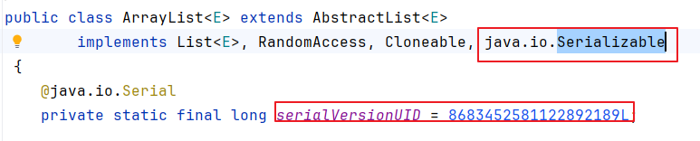

3、ArrayList的elementData加transient修饰，但是size变量没有加transient和static修饰

```java
	transient Object[] elementData; // 默认不参加序列化

    private int size; //参加序列化
```

4、ArrayList类中有如下特殊方法：writeObject和readObject，这2个方法供ObjectOutputStream和ObjectInputStream底层使用，它们不是咱们程序员手动调用。

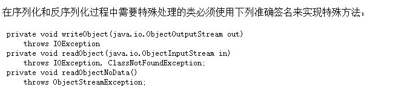

新版的writeObject和readObject源码如下：

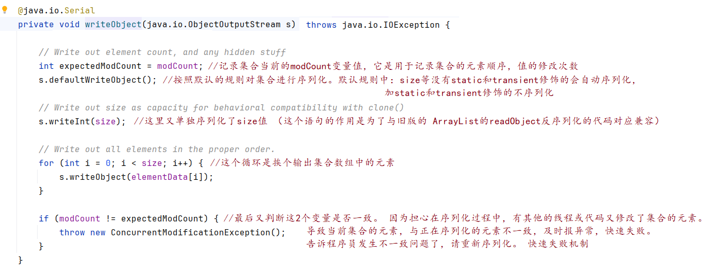

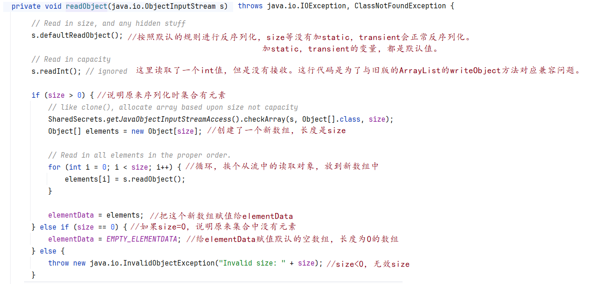


旧版的writeObject和readObject源码如下：

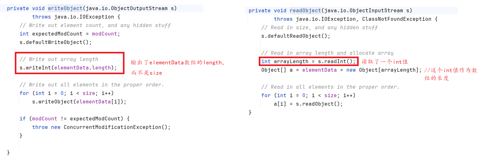


新旧对应关系的分析：

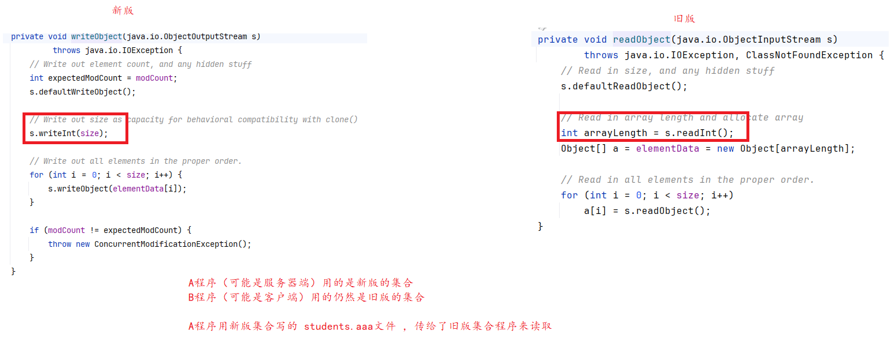

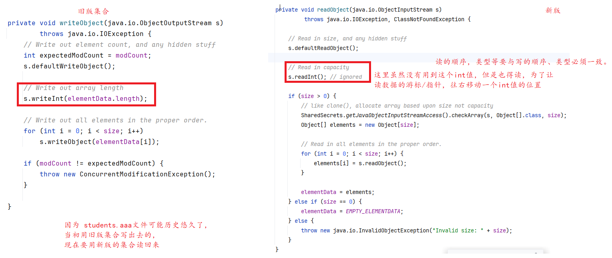


> 思考题：为什么ArrayList集合不直接序列化elementData数组呢？
>
> 答：因为elementData中可能有很多null位置，没有放元素。size < elementData.length。
>
> ​       实际中考虑到效率或网络传输的流量，实际有几个对象，就输出几个对象是最明智的。


# 三、网络编程（了解）

## 3.1 网络编程的基本知识

### 1、IP

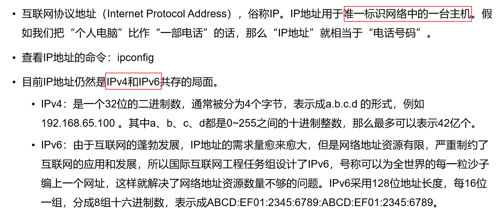

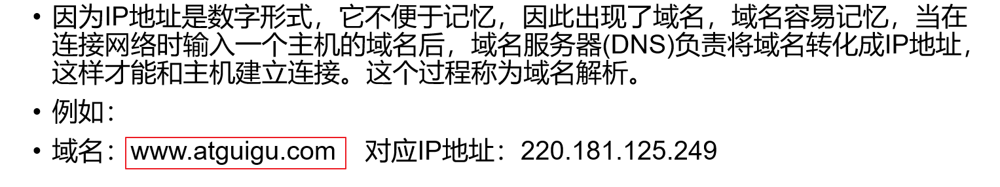

### 2、端口号

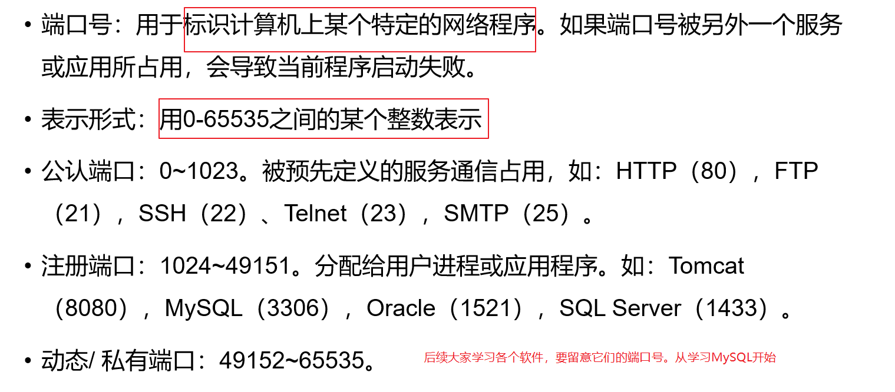

### 3、网络协议

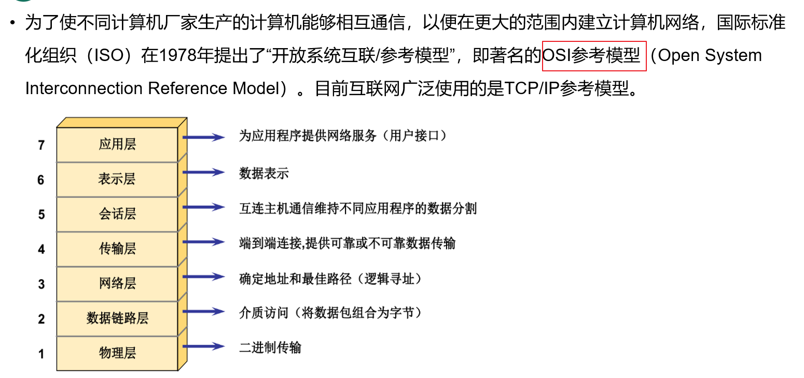

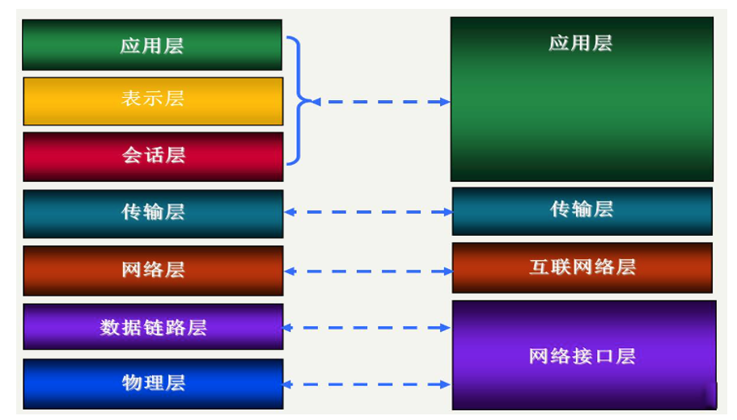

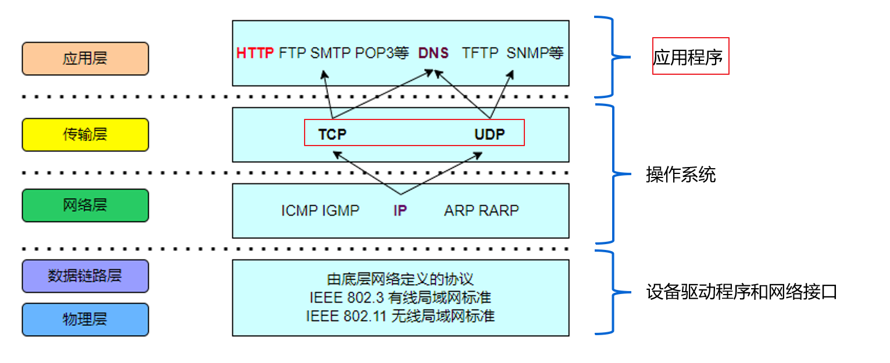

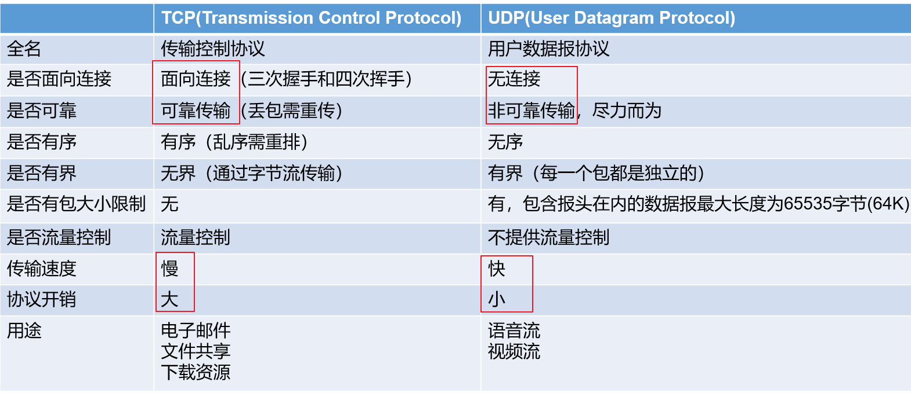

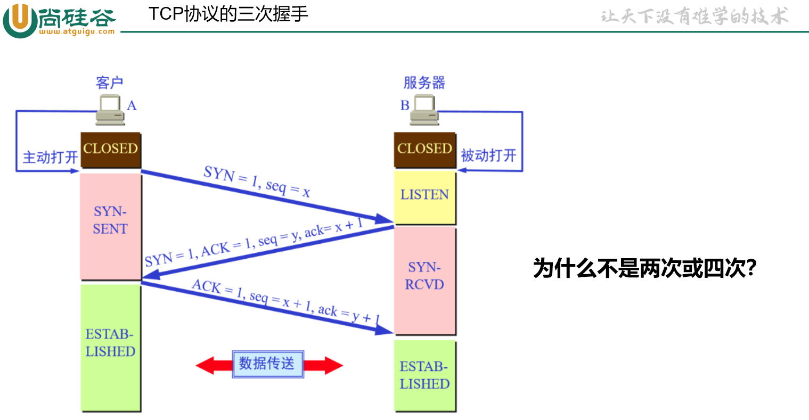

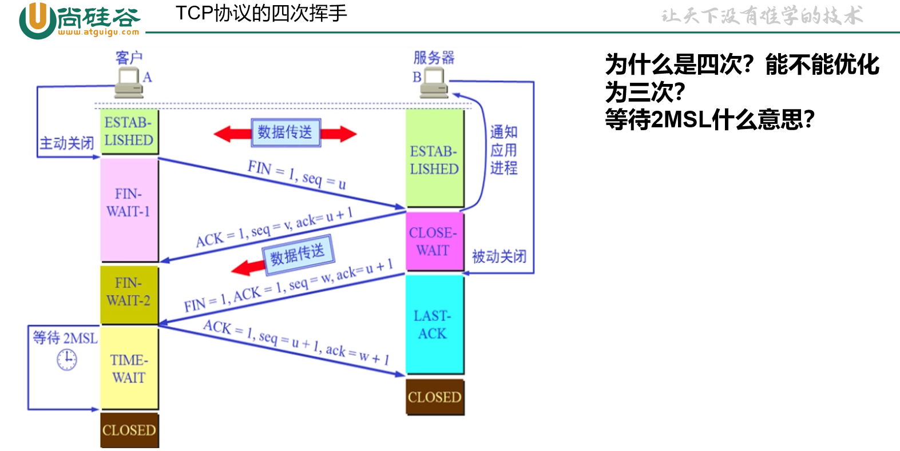


## 3.2 Socket

无论是发送端还是接收端，无论是TCP还是UDP，都必须有Socket对象。Socket对象是Java中负责与底层的网卡驱动交互的对象。

- UDP协议：DatagramSocket类
- TCP协议：ServerSocket类和Socket类


## 3.3 基于UDP协议进行上层开发


### 3.3.1 发送端

基于UDP协议的发送端，在发送数据之前不会检查对方在不在，能不能成功传输数据，只管发送。

```java
package com.atguigu.net;

import java.net.*;

public class Send {//发送端

    public static void main(String[] args) throws Exception {
        //（1）创建一个DatagramSocket对象
        DatagramSocket ds = new DatagramSocket();

        //（2）准备要发送的消息
        String str = "马上要吃饭了，大家吃什么？";

        //（3）把数据打包，打包成 数据报格式
        //需要创建DatagramPacket对象
        byte[] data = str.getBytes();//把字符串转为字节输出，才能在网络中传输
//        InetAddress ip = InetAddress.getByName("www.atguigu.com");//基于域名的方式
        byte[] address = {(byte)192,(byte)168,36,21};
        /*
        192的二进制：
            int类型：00000000 00000000 00000000 11000000
            byte类型：11000000  IP地址是没有负数的，因为底层最高位仍然是数据位，不是符号位
                                                因为底层又把这个byte转为int

         */
        InetAddress ip = InetAddress.getByAddress(address);//基于IP地址的方式
        int port = 8888;//双方约定
        DatagramPacket dp = new DatagramPacket(data,0,data.length,ip,8888);

        //（4）发送
        //通过socket发送
        //数据流向： 程序中byte[]数组 -> dp包裹 -> ds(socket对象） -> 接收端
        ds.send(dp);

        //（5）关闭
        ds.close();
    }

}

```


### 3.3.2 接收端

先运行接收端，才能确保消息能收到。

```java
package com.atguigu.net;

import java.net.DatagramPacket;
import java.net.DatagramSocket;

public class Receiver {//接收端

    public static void main(String[] args) throws Exception{
        //（1）创建一个DatagramSocket对象
        //告诉网卡驱动，网卡驱动程序需要在8888监听传给Receiver程序的数据
        DatagramSocket ds = new DatagramSocket(8888);

        //（2）准备一个字节数组，用来装接收到的数据
        byte[] data = new byte[1024];

        //（3）准备一个DatagramPacket对象，用于接收对方的数据报报文等信息
        //这里没有写IP地址，因为不用限制谁给我发，都可以给我发，只要对方发的时候，写明我的IP地址和端口号是8888就可以
        DatagramPacket dp = new DatagramPacket(data,0,data.length);
        
        //（4）接收
        ds.receive(dp);//如果没有人给你发消息，这句代码会阻塞等待
        
        //（5）查看消息
        int len = dp.getLength();//实际接收了几个字节
        System.out.println(new String(data,0,len));

        //（6）断开
        ds.close();
    }
}

```


## 3.4 基于TCP协议进行上层开发

基于TCP协议的网络应用程序必须分为服务器端和客户端。是C/S结构，C是Client，S是Server。

### 3.4.1 案例1

需求：

- 服务器开启，监听和等待客户端的连接

- 客户端连接服务器
- 服务器监听到客户端连接之后，给客户端发一句话：欢迎登录
- 客户端接收服务器发送的消息

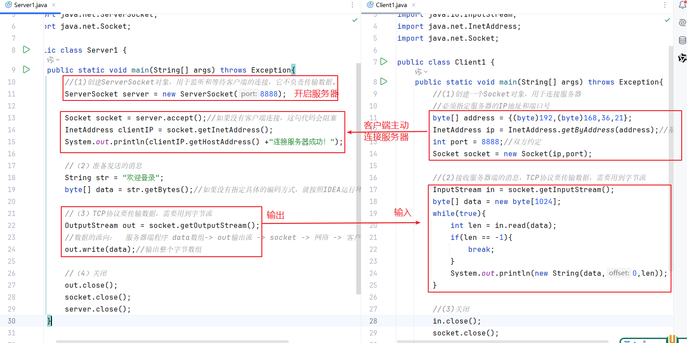

#### 1、服务器端

```java
package com.atguigu.tcp1;

import java.io.OutputStream;
import java.net.InetAddress;
import java.net.ServerSocket;
import java.net.Socket;

public class Server1 {
    public static void main(String[] args) throws Exception{
        //(1)创建ServerSocket对象，用于监听和等待客户端的连接，它不负责传输数据。
        ServerSocket server = new ServerSocket(8888);

        Socket socket = server.accept();//如果没有客户端连接，这句代码会阻塞
        InetAddress clientIP = socket.getInetAddress();
        System.out.println(clientIP.getHostAddress() +"连接服务器成功！");

        //（2）准备发送的消息
        String str = "欢迎登录";
        byte[] data = str.getBytes();//如果没有指定具体的编码方式，就按照IDEA运行环境的编码处理UTF-8

        //（3）TCP协议要传输数据，需要用到字节流
        OutputStream out = socket.getOutputStream();
        //数据的流向：  服务器端程序 data数组-> out输出流 -> socket -> 网络 -> 客户端程序
        out.write(data);//输出整个字节数组

        //（4）关闭
        out.close();
        socket.close();
        server.close();
    }
}

```


#### 2、客户端

```java
package com.atguigu.tcp1;

import java.io.InputStream;
import java.net.InetAddress;
import java.net.Socket;

public class Client1 {
    public static void main(String[] args) throws Exception{
        //(1)创建一个Socket对象，用于连接服务器
        //必须指定服务器的IP地址和端口号
        byte[] address = {(byte)192,(byte)168,36,21};
        InetAddress ip = InetAddress.getByAddress(address);//基于IP地址的方式
        int port = 8888;//双方约定
        Socket socket = new Socket(ip,port);

        //(2)接收服务器端的消息，TCP协议要传输数据，需要用到字节流
        InputStream in = socket.getInputStream();
        byte[] data = new byte[1024];
        while(true){
            int len = in.read(data);
            if(len == -1){
                break;
            }
            System.out.println(new String(data,0,len));
        }

        //(3)关闭
        in.close();
        socket.close();

    }
}

```


### 3.4.2 案例2

需求：

服务器：

- 等待和接收客户端连接
- 如果有客户端连接进来后，`接收`客户端传过来的单词或词语，然后`反转`这个单词或词语，再`返回`给客户端

客户端：

- 主动连接服务器
- 从键盘输入单词或词语，直到输入stop为止
- `输入`一个给服务器`发送`一个，并`接收`服务器反转后的结果

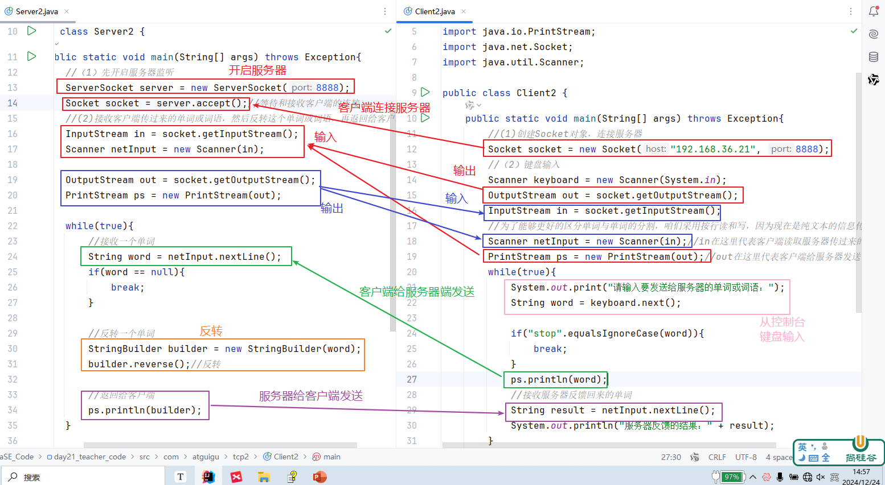

#### 1、服务器端

```java
package com.atguigu.tcp2;

import java.io.InputStream;
import java.io.OutputStream;
import java.io.PrintStream;
import java.net.ServerSocket;
import java.net.Socket;
import java.util.Scanner;

public class Server2 {
    public static void main(String[] args) throws Exception{
        //（1）先开启服务器监听
        ServerSocket server = new ServerSocket(8888);
        Socket socket = server.accept();//等待和接收客户端的连接
        //(2)接收客户端传过来的单词或词语，然后反转这个单词或词语，再返回给客户端
        InputStream in = socket.getInputStream();
        Scanner netInput = new Scanner(in);

        OutputStream out = socket.getOutputStream();
        PrintStream ps = new PrintStream(out);

        while(true){
            //接收一个单词
            String word = netInput.nextLine();
            if(word == null){
                break;
            }

            //反转一个单词
            StringBuilder builder = new StringBuilder(word);
            builder.reverse();//反转

            //返回给客户端
            ps.println(builder);
        }

        ps.close();
        out.close();
        netInput.close();
        in.close();
        socket.close();
        server.close();
    }
}

```

#### 2、客户端

```java
package com.atguigu.tcp2;

import java.io.InputStream;
import java.io.OutputStream;
import java.io.PrintStream;
import java.net.Socket;
import java.util.Scanner;

public class Client2 {
    public static void main(String[] args) throws Exception{
        //(1)创建Socket对象，连接服务器
        Socket socket = new Socket("192.168.36.21", 8888);
        //（2）键盘输入
        Scanner keyboard = new Scanner(System.in);
        OutputStream out = socket.getOutputStream();
        InputStream in = socket.getInputStream();

        //为了能够更好的区分单词与单词的分割，咱们采用按行读和写，因为现在是纯文本的信息传输
        Scanner netInput = new Scanner(in);//in在这里代表客户端读取服务器传过来的消息的输入通道
        PrintStream ps = new PrintStream(out);//out在这里代表客户端给服务器发送消息的输出通道
        while(true){
            System.out.print("请输入要发送给服务器的单词或词语：");
            String word = keyboard.next();

            if("stop".equalsIgnoreCase(word)){
                break;
            }

            //输完一个单词，要送一个单词
//            out.write(word.getBytes());
            ps.println(word);

            //接收服务器反馈回来的单词
            /*byte[] data = new byte[1024];
            while(true){
                int len = in.read(data);
                if(len == -1){
                    break;
                }
                System.out.println(new String(data,0,len));
            }*/
            String result = netInput.nextLine();
            System.out.println("服务器反馈的结果：" + result);
        }

        ps.close();
        netInput.close();
        out.close();
        in.close();
        keyboard.close();
        socket.close();
    }
}

```


### 3.4.3 案例3

需求：

对案例2进行升级，从一个客户端升级为多个客户端同时给服务器发送。

#### 1、服务器端

```java
package com.atguigu.tcp3;

import java.io.InputStream;
import java.io.OutputStream;
import java.io.PrintStream;
import java.net.ServerSocket;
import java.net.Socket;
import java.util.Scanner;

public class Server3 {

    public static void main(String[] args) throws Exception {
        //（1）先开启服务器监听
        ServerSocket server = new ServerSocket(8888);
        while (true) {
            Socket socket = server.accept();//等待和接收客户端的连接
            //每一个客户端得有自己的socket对象
            //每一个客户端都有一个线程独立维护它的通信，所有客户端是“同时”执行的
            MessageThread mt = new MessageThread(socket);
            mt.start();
        }
//        server.close();//服务器不关闭
    }

    private static class MessageThread extends Thread {
        private final Socket socket;//实例变量

        public MessageThread(Socket socket) {
            this.socket = socket;
        }

        @Override
        public void run() {
            try ( //(2)接收客户端传过来的单词或词语，然后反转这个单词或词语，再返回给客户端
                  InputStream in = socket.getInputStream();
                  Scanner netInput = new Scanner(in);

                  OutputStream out = socket.getOutputStream();
                  PrintStream ps = new PrintStream(out);
                  socket;//凡是在try()里面声明的资源对象，都是final，要是自动加，要么手动加
                  //在try()里面声明的会自动加final，在外面声明的需要手动加final
            ) {
                while (netInput.hasNextLine()) {//有没有下一行
                    //接收一个单词
                    String word = netInput.nextLine();

                    System.out.println(socket.getInetAddress().getHostAddress()+"说：" + word);

                    //反转一个单词
                    StringBuilder builder = new StringBuilder(word);
                    builder.reverse();//反转

                    //返回给客户端
                    ps.println(builder);
                }
            } catch (Exception e) {
                e.printStackTrace();
            }
        }
    }
}


```

#### 2、客户端

```java
package com.atguigu.tcp3;

import java.io.InputStream;
import java.io.OutputStream;
import java.io.PrintStream;
import java.net.Socket;
import java.util.Scanner;

public class Client3 {
    public static void main(String[] args) throws Exception{
        //(1)创建Socket对象，连接服务器
        Socket socket = new Socket("192.168.36.21", 8888);
        //（2）键盘输入
        Scanner keyboard = new Scanner(System.in);
        OutputStream out = socket.getOutputStream();
        InputStream in = socket.getInputStream();

        //为了能够更好的区分单词与单词的分割，咱们采用按行读和写，因为现在是纯文本的信息传输
        Scanner netInput = new Scanner(in);//in在这里代表客户端读取服务器传过来的消息的输入通道
        PrintStream ps = new PrintStream(out);//out在这里代表客户端给服务器发送消息的输出通道
        while(true){
            System.out.print("请输入要发送给服务器的单词或词语：");
            String word = keyboard.next();

            if("stop".equalsIgnoreCase(word)){
                break;
            }

            //输完一个单词，要送一个单词
            ps.println(word);

            //接收服务器反馈回来的单词
            String result = netInput.nextLine();
            System.out.println("服务器反馈的结果：" + result);
        }

        ps.close();
        netInput.close();
        out.close();
        in.close();
        keyboard.close();
        socket.close();
    }
}

```


### 3.4.4 案例4

需求：

服务器：

- 监听和等待客户端的连接
- 接收客户端上传的文件，保存到服务器指定目录下，例如：服务器端D:\\upload文件夹下
- 接收完文件之后给客户端反馈：xxx文件上传成功！如果中途出现异常，反馈：xxx文件上传失败！

客户端：

- 从键盘输入要上传的本地文件的完整路径值
- 将指定的文件上传到服务器
- 接收上传结果

- 可以多个客户端同时上传

#### 1、服务器端

```java
package com.atguigu.tcp4;

import java.io.*;
import java.net.ServerSocket;
import java.net.Socket;

public class Server4 {
    public static void main(String[] args)throws Exception {
        //(1)创建ServerSocket的对象，监听和接收客户端的连接
        ServerSocket server = new ServerSocket(8888);

        while(true) {
            Socket socket = server.accept();//它只要执行了，就代表一个客户端连接成功了

            UploadThread thread =new UploadThread(socket);
            thread.start();
        }
    }

    private static class UploadThread extends Thread{
        private Socket socket;

        public UploadThread(Socket socket) {
            this.socket = socket;
        }

        @Override
        public void run() {
            try(
                    //接收(1)文件名.扩展名(2)文件内容
                    InputStream in = socket.getInputStream();
                    BufferedInputStream bis = new BufferedInputStream(in);//提高效率
                    ObjectInputStream ois = new ObjectInputStream(bis);

                    OutputStream out = socket.getOutputStream();
                    PrintStream ps = new PrintStream(out);
            ){

                //先接收(1)文件名.扩展名
                String filename = ois.readUTF();

                String clientIP = socket.getInetAddress().getHostAddress();
                String newFilename = System.currentTimeMillis() + "_" + clientIP + "_" + filename;

                //再接收（2）文件内容
                //数据的流向：客户端 -> in -> bis -> ois -> data -> bos->fos-> 服务器本地的d:\\upload文件夹下
                boolean flag = true;
                try(FileOutputStream fos = new FileOutputStream("d:\\upload\\"+newFilename);
                BufferedOutputStream bos = new BufferedOutputStream(fos);//提高效率
                ) {
                    byte[] data = new byte[1024];
                    while (true) {
                        int len = ois.read(data);//从客户端接收文件内容
                        if (len == -1) {
                            break;
                        }
                        bos.write(data, 0, len);//写到服务器的本地文件中
                    }
                }catch (Exception e){
                    flag = false;
                }
                ps.println(flag ? filename+"文件上传成功！" : filename+"文件上传失败！");
            }catch (Exception e){
                e.printStackTrace();
            }
        }
    }
}

```


#### 2、客户端

```java
package com.atguigu.tcp4;

import java.io.*;
import java.net.Socket;
import java.util.Scanner;

public class Client4 {
    public static void main(String[] args) throws Exception{
        //(1)创建Socket对象，因为只有他才可以建立连接，与网卡驱动交互，进行数据的传输
        //这里填写的是服务器端的IP地址和端口号。
        Socket socket = new Socket("192.168.36.21",8888);

        //(2)键盘输入完整的文件路径值
        Scanner keyboard = new Scanner(System.in);
        System.out.print("请输入你要上传的文件的完整路径值：");
        String filepath = keyboard.nextLine();//因为可能目录或文件名中包含空格
        //D:\temp\img\dog.jpg
        File file = new File(filepath);

        //(3)把这个文件上传给服务器
        OutputStream out = socket.getOutputStream();
        //分别上传(1)文件名.后缀名  和 (2)文件内容
        //为了服务器端方便区分是(1)文件名.后缀名  和 (2)文件内容，这里用ObjectOutputStream来传输数据
        BufferedOutputStream bos = new BufferedOutputStream(out);//提高效率
        ObjectOutputStream oos = new ObjectOutputStream(bos);

        String filename = file.getName();//得到文件名
        oos.writeUTF(filename);//对方用 ObjectInputStream流的readUTF()读取

        //从本地读取文件内容，再发送给服务器
        FileInputStream fis = new FileInputStream(filepath);
        BufferedInputStream bis = new BufferedInputStream(fis);//提高效率
        byte[] data = new byte[1024];
        //数据流向： filepath对应的本地文件 -> fis -> bis -> data数组 -> oos -> bos -> out -> 网络中 -> 服务器
        while(true){
            int len = bis.read(data);//从本地文件读取内容
            if(len==-1){
                break;
            }
            oos.write(data,0,len);//发送给服务器
        }
        oos.flush();
        socket.shutdownOutput();//关闭输出通道，但是连接保留
//        socket.close(); 或  oos.close(); //会导致连接断开

        //接收服务器反馈的结果，约定按行读取
        InputStream in = socket.getInputStream();
        Scanner netInput = new Scanner(in);
        while(netInput.hasNextLine()){
            String result = netInput.nextLine();
            System.out.println("结果：" + result);
        }

        netInput.close();
        in.close();
        bis.close();
        fis.close();
        oos.close();
        bos.close();
        out.close();
        keyboard.close();
        socket.close();
    }
}

```

