# 一、反射

## 1.1 什么是反射

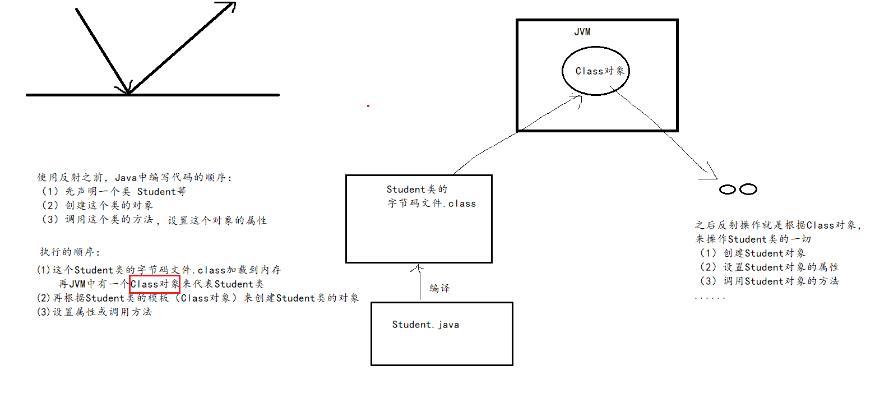

反射操作的第一步：获取某个类的Class对象。

反射机制使得Java可以实现动态编程语言的效果，可以`在运行时`再确定是哪个类，再创建对象，再调用具体的方法等。

### 1、没有反射

先有Student类，再写测试类创建对象，调用方法

```java
package com.atguigu.reflect;

public class Student {
    private int id;
    private String name;

    public Student() {
    }

    public Student(int id, String name) {
        this.id = id;
        this.name = name;
    }

    public int getId() {
        return id;
    }

    public void setId(int id) {
        this.id = id;
    }

    public String getName() {
        return name;
    }

    public void setName(String name) {
        this.name = name;
    }

    @Override
    public String toString() {
        return "Student{" +
                "id=" + id +
                ", name='" + name + '\'' +
                '}';
    }
}

```

```java
package com.atguigu.reflect;

public class TestNoReflect {
    public static void main(String[] args) {
        Student s = new Student();
        s.setId(1);
        s.setName("张三");
        System.out.println(s);
        /*
        如果没有反射，那么Student类必须在编译时是存在的，确定的，
        才能编写测试类的这些代码
         */
    }
}

```

### 2、有反射

```java
package com.atguigu.reflect;

import java.lang.reflect.Constructor;
import java.lang.reflect.Field;

public class TestUseReflect {
    public static void main(String[] args) throws Exception{
        //下面所有""引起来的，都是字符串，它们可以通过键盘输入，或者读取xx配置文件来动态获取
        //而不是在代码中写死
        Class clazz = Class.forName("com.atguigu.reflect.Teacher");
        Constructor constructor = clazz.getConstructor();//获取Teacher类的无参构造
        Object t = constructor.newInstance();

        Field idField = clazz.getDeclaredField("id");
        idField.setAccessible(true);
        idField.set(t, 1);

        Field nameField = clazz.getDeclaredField("name");
        nameField.setAccessible(true);
        nameField.set(t,"李四");

        System.out.println(t);
    }
}

```

上述代码，编译没有任何问题，完全通过。因为Teacher类只要保证在运行时能正常加载就可以了。

以下代码只要保证运行时是存在的，上面的代码就可以正常运行。

```java
package com.atguigu.reflect;

public class Teacher {
    private int id;
    private String name;

    @Override
    public String toString() {
        return "Teacher{" +
                "id=" + id +
                ", name='" + name + '\'' +
                '}';
    }
}

```


## 1.2 获取Class对象（掌握）

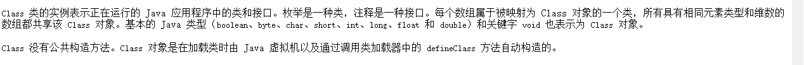

一共有四种方式来`获取`Class对象：

- 类型名.class
  - 这里的类型是指Java中的任意数据类型，包括8种基本数据类型，void，引用数据类型（数组、类、接口、枚举、注解、记录类、密封类等）。

- 对象.getClass()
  - 这个方法是Object类中定义的，适用于所有引用数据类型

- Class.forName("类型的全名称")
  - 这个方法适用于核心类库中或自定义的引用数据类型。不适用于基本数据类型和void、数组，因为它们是JVM内置的数据类型。它们找不到对应的.class文件。

- 类加载器对象.loadClass("类型的全名称")
  - 同Class.forName("类型的全名称")


```java
package com.atguigu.reflect;

import org.junit.Test;

import java.io.Serializable;
import java.time.Month;

public class TestClass {
    @Test
    public void test()throws Exception{
        Class c1 =  int.class;//基本数据类型
        Class c2 = void.class;//空类型
        Class c3 = int[].class;//数组类型
        Class c4 = String.class;//类类型
        Class c5 = Serializable.class;//接口类型
        Class c6 = Month.class;//枚举类型
        Class c7 = Override.class;//注解类型
        Class c8 = Class.class;//Class是一个类

        System.out.println(c1);
        System.out.println(c2);
        System.out.println(c3);
        System.out.println(c4);
        System.out.println(c5);
        System.out.println(c6);
        System.out.println(c7);
        System.out.println(c8);
    }

    @Test
    public void test2()throws Exception{
        String str = "hello";
        Class c1 = str.getClass();//获取的是str变量中引用的对象的“类型”

        Object obj = "world";
        Class c2 = obj.getClass();//获取的是obj变量中引用的对象的“类型”
        //getClass()是获取对象的运行时类型，看右边的类型，即看new的对象，
        //""，比较特殊，看不到new，等价于 new String对象

        System.out.println(c1);
        System.out.println(c2);
        System.out.println(c1 == c2);
    }

    @Test
    public void test3()throws Exception{
       Class c1 = String.class;

        Object obj = "world";
        Class c2 = obj.getClass();//获取的是obj变量中引用的对象的“类型”

        Class<?> c3 = Class.forName("java.lang.String");

        ClassLoader classLoader = ClassLoader.getSystemClassLoader();//获取类加载器对象
        Class<?> c4 = classLoader.loadClass("java.lang.String");

        System.out.println(c1);
        System.out.println(c2);
        System.out.println(c3);
        System.out.println(c4);
        System.out.println(c1 == c2);//true
        System.out.println(c1 == c3);//true
        System.out.println(c1 == c4);//true
    }

    @Test
    public void test4()throws Exception{
        Class c1 = int.class;
        Class c2 = String.class;
        System.out.println(c1==c2);//false
    }

    @Test
    public void test5()throws Exception{
        Class c1 = int[].class;
        Class c2 = int[][].class;
        Class c3 = String[].class;

        System.out.println(c1 == c2);//false  维度不同，一个一维，一个二维
        System.out.println(c3 == c2);//false  维度和元素类型都不同
        System.out.println(c3 == c1);//false 元素类型不同

        int[] arr = {1,2,3,4,5};
        int[] nums = {1,2,2,5,3,3,5,6,8,7,8,10};
        Class<? extends int[]> c4 = arr.getClass();
        Class<? extends int[]> c5 = nums.getClass();
        System.out.println(c4 == c5);//true
    }
}

```


> 强调：每一种数据类型，在JVM中有且只有唯一的Class对象。
>
> ​			 相同的数据类型，Class对象是同一个。
>
> ​           不同的数据类型，Class对象是不同的。


## 1.3  反射的应用

### 1.3.1 查看类型的详细信息

```java
package com.atguigu.reflect;

import org.junit.Test;

import java.lang.reflect.Constructor;
import java.lang.reflect.Field;
import java.lang.reflect.Method;
import java.lang.reflect.Modifier;

public class TestStringInfo {
    @Test
    public void test1()throws Exception{
        Class c1 = Class.forName("java.lang.String");

        Package pkg = c1.getPackage();
        System.out.println("包名：" + pkg.getName());

        int modifiers = c1.getModifiers();
        System.out.println("修饰符：" + modifiers);
        System.out.println("修饰符：" + Modifier.toString(modifiers));
        /*
        Java中每一种修饰符都有一个数字代表它：
                                                    十六进制         十进制        二进制（以1个字节为例）
        public static final int PUBLIC           = 0x00000001;      1           00000001
        public static final int PRIVATE          = 0x00000002;      2           00000010
        public static final int PROTECTED        = 0x00000004;      4           00000100
        public static final int STATIC           = 0x00000008;      8           00001000
        public static final int FINAL            = 0x00000010;      16          00010000
        public static final int SYNCHRONIZED     = 0x00000020;      32          00100000
        。。。。

        String类的修饰符是 17
                    17的二进制：     00010001
         */
    }

    @Test
    public void test2()throws Exception{
        Class c1 = Class.forName("java.lang.String");

        System.out.println("类名：" + c1.getName());

        Class superclass = c1.getSuperclass();//String的父类
        System.out.println("String的父类：" + superclass);

        System.out.println("String的父接口们：");
        Class[] interfaces = c1.getInterfaces();//String的父接口们
        for (Class f : interfaces) {
            System.out.println(f);
        }
    }

    @Test
    public void test3()throws Exception{
        Class c1 = Class.forName("java.lang.String");
        /*
        类的成员：成员变量、成员方法、构造器、代码块、内部类
        除了代码块都能获取。
        为什么代码块获取不了呢？
        因为代码块在从.java文件 -> .class文件的编译过程中，就被组装的对应的方法中了。
        静态代码块 ->  <clinit>类初始化方法
        非静态代码块 会和构造器等代码一起 -> <init>实例初始化方法中
        或者另一种角度来说，代码块是随着别的代码自动执行的，不需要单独调用。
        静态代码块 -> 随着类加载自动执行。
        静态代码块  -> 随着new对象自动执行。
         */
    }

    @Test
    public void test4()throws Exception{
        Class c1 = Class.forName("java.lang.String");

        //获取String类的所有成员变量
        Field[] declaredFields = c1.getDeclaredFields();
        for (Field field : declaredFields) {
            System.out.println(field);
        }
    }

    @Test
    public void test5()throws Exception{
        Class c1 = Class.forName("java.lang.String");

        //获取String类的所有构造器
        Constructor[] declaredConstructors = c1.getDeclaredConstructors();
        for (Constructor c : declaredConstructors) {
            System.out.println(c);
        }
    }

    @Test
    public void test6()throws Exception{
        Class c1 = Class.forName("java.lang.String");

        //获取String类的所有方法
        Method[] declaredMethods = c1.getDeclaredMethods();
        for (Method m : declaredMethods) {
            System.out.println(m);
        }
    }

    @Test
    public void test7()throws Exception{
        Class c1 = Class.forName("java.lang.String");

        //获取String类的所有内部类
        Class[] declaredClasses = c1.getDeclaredClasses();
        for (Class c : declaredClasses) {
            System.out.println(c);
        }
    }

    @Test
    public void test8()throws Exception{
        Class<?> map = Class.forName("java.util.Map");
        Class<?>[] declaredClasses = map.getDeclaredClasses();
        for (Class<?> c : declaredClasses) {
            System.out.println(c);//java.util.Map.Entry
            System.out.println(c.getDeclaringClass());
            System.out.println(c.getEnclosingClass());
        }
    }
}

```


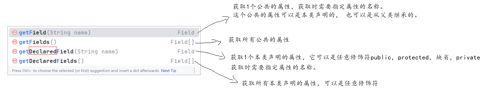

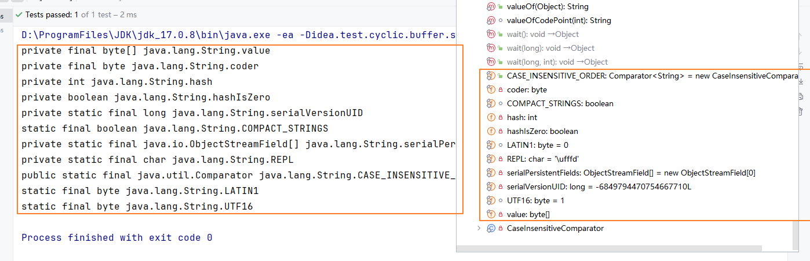

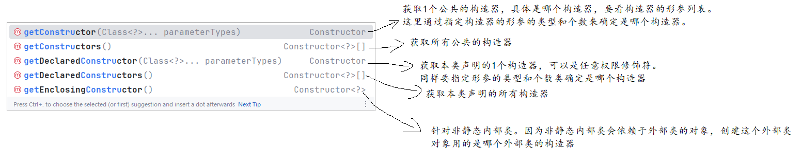

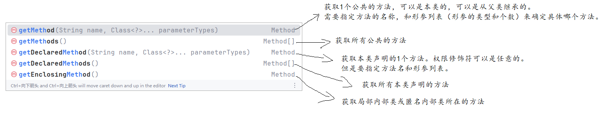

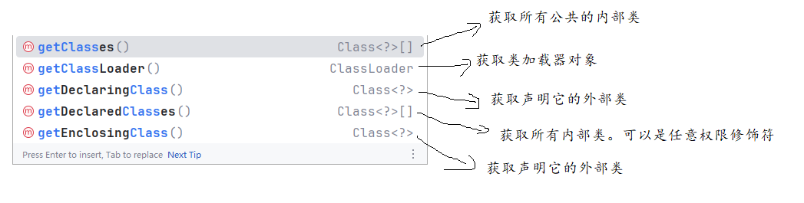

### 1.3.2 反射创建对象

#### 1、构造器的权限修饰符是可见的

- 获取类型对应的Class对象
- 获取构造器对应的Constructor对象
  - Class对象.getDeclaredConstructor() 获取无参构造
  - Class对象.getDeclaredConstructor(构造器的形参的类型的Class对象...) 获取无参构造
    - 例如：public Teacher(int id, String name)构造器
    - Class对象.getDeclaredConstructor(int.class,  String.class）
- 调用Constructor对象.newInstance(【实参列表】)方法来创建这个类的实例对象

```java
package com.atguigu.reflect;

public class Teacher {
    private int id;
    private String name;

    public Teacher() {
    }

    public Teacher(int id, String name) {
        this.id = id;
        this.name = name;
    }

    @Override
    public String toString() {
        return "Teacher{" +
                "id=" + id +
                ", name='" + name + '\'' +
                '}';
    }
}

```


```java
package com.atguigu.reflect;

import org.junit.Test;

import java.lang.reflect.Constructor;

public class TestCreateObject {
    @Test
    public void test1()throws Exception{
        //(1)获取Class对象，如果要创建Teacher类的对象，就获取Teacher类的Class对象
        Class<?> clazz = Class.forName("com.atguigu.reflect.Teacher");

        //(2)你要用哪个构造器创建对象，就要获取这个构造器的Constructor对象
        Constructor<?> constructor = clazz.getDeclaredConstructor();
        //getDeclaredConstructor()的()中空着，表示获取无参构造
        //如果Teacher类没有无参构造，就报java.lang.NoSuchMethodException: com.atguigu.reflect.Teacher.<init>()
        //没有无参的实例初始化方法<init>()

        //(3)用构造器new对象
        Object obj = constructor.newInstance();
        //因为constructor现在代表无参构造，因此newInstance()的()里面空着
        //obj的编译时是Object类型，运行时要看clazz是代表哪个类，它现在代表Teacher，obj就是Teacher类的对象
        System.out.println(obj);
    }

    @Test
    public void test2()throws Exception{
        //(1)获取Class对象，如果要创建Teacher类的对象，就获取Teacher类的Class对象
        Class<?> clazz = Class.forName("com.atguigu.reflect.Teacher");

        //(2)你要用哪个构造器创建对象，就要获取这个构造器的Constructor对象
        //例如：想要用public Teacher(int id, String name)构造器创建Teacher类对象
        Constructor<?> constructor = clazz.getDeclaredConstructor(int.class, String.class);
        //constructor此时是有参构造

        //(3)用构造器new对象
        Object obj = constructor.newInstance(1,"张三");
        //因为constructor现在代表有参构造，因此newInstance()的()里面不能空着
        System.out.println(obj);
    }
}

```

#### 2、构造器的权限修饰符是不可见

```java
package com.atguigu.reflect;

public class Employee {
    private int id;
    private String name;

    private Employee(){

    }

    private Employee(int id, String name) {
        this.id = id;
        this.name = name;
    }

    @Override
    public String toString() {
        return "Employee{" +
                "id=" + id +
                ", name='" + name + '\'' +
                '}';
    }
}

```

```java
package com.atguigu.reflect;

import org.junit.Test;

import java.lang.reflect.Constructor;

public class TestCreateObject2 {
    @Test
    public void test1()throws Exception{
        //演示用Employee类的私有化的构造器创建员工类的对象
        Class c = Class.forName("com.atguigu.reflect.Employee");
        Constructor noArgsConstructor = c.getDeclaredConstructor();
        //getDeclaredConstructor()的()空着
        //noArgsConstructor代表无参构造

        /*
        因为Employee的构造器是private，所以下面的 newInstance()报错了
        java.lang.IllegalAccessException: 非法访问异常。
        class com.atguigu.reflect.TestCreateObject2（测试类）
        cannot access a member of （不能直接访问xx类的成员）
        class com.atguigu.reflect.Employee（员工类）
        with modifiers "private"（用private修饰）
         */
        Object obj = noArgsConstructor.newInstance();
        System.out.println(obj);

    }

    @Test
    public void test2()throws Exception{
        //演示用Employee类的私有化的构造器创建员工类的对象
        Class c = Class.forName("com.atguigu.reflect.Employee");
        Constructor noArgsConstructor = c.getDeclaredConstructor();
        noArgsConstructor.setAccessible(true);//无论这个构造器的权限修饰符是private,缺省,protected,public都可以访问
        Object obj = noArgsConstructor.newInstance();
        System.out.println(obj);
    }

    @Test
    public void test3()throws Exception{
        //演示用Employee类的私有化的构造器创建员工类的对象
        Class c = Class.forName("com.atguigu.reflect.Employee");
        //private Employee(int id, String name)
        Constructor allArgsConstructor = c.getDeclaredConstructor(int.class, String.class);
        allArgsConstructor.setAccessible(true);//无论这个构造器的权限修饰符是private,缺省,protected,public都可以访问
        Object obj = allArgsConstructor.newInstance(1,"chai");
        System.out.println(obj);
    }

    public static void main(String[] args) throws Exception{
        //演示用核心类库中LocalDate等构造器私有化的类创建对象
        //LocalDate date = new LocalDate(2024,1,1);
        //错误，因为private LocalDate(int year, int month, int dayOfMonth)

       // LocalDate date = LocalDate.of(2024,1,1);//不用反射的方式，得到LocalDate的对象

        Class c = Class.forName("java.time.LocalDate");
        Constructor allArgsConstructor = c.getDeclaredConstructor(int.class, int.class, int.class);
        allArgsConstructor.setAccessible(true);
        //上面的setAccessible（true）代码报异常 java.lang.reflect.InaccessibleObjectException 无法访问异常
        //Unable to make private java.time.LocalDate(int,int,int) accessible: 不能设置 LocalDate的私有构造器变的可以访问
        // module java.base does not "opens java.time" to unnamed module @682a0b20  java.base模块的私有成员没有对我们开放
        /*
        如果想要正常运行这个代码，必须设置一个VM Options。
        Run菜单 -> Edit Configurations ->
            左边 看Application （不要用JUnit，即要用main方法）
            右边 在VM Options中加 --add-opens java.base/java.time=ALL-UNNAMED
         */
        Object obj = allArgsConstructor.newInstance(2024,12,25);
        System.out.println(obj);
    }
}

```


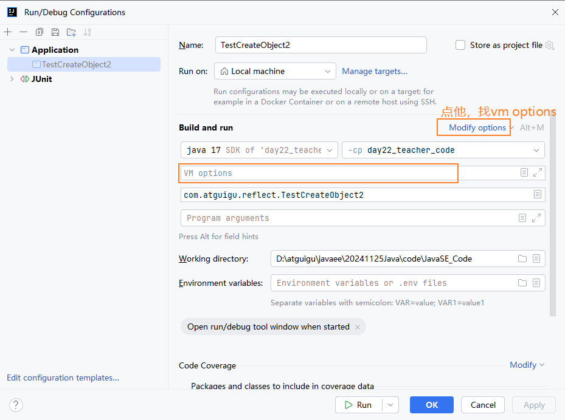

```JAVA
--add-opens java.base/java.time=ALL-UNNAMED
```

如果是JRE核心类库中的其他包，那么要看他在哪个模块，哪个包，即java.base/java.time 看具体情况的。因为LocalDate类在java.base模块的java.time包。

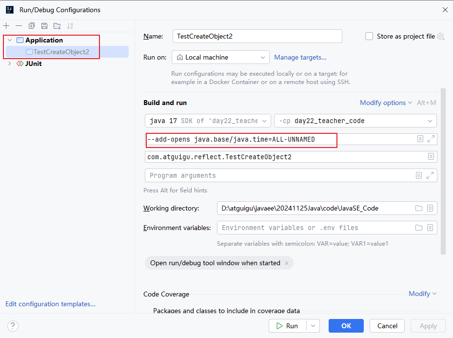

### 1.3.3 反射操作属性

（1）操作是实例变量

- 获取类型的Class对象
- 创建这个类的实例对象（请看第1.3.2小节）
- 获取你要操作的实例变量的Field对象
- 如果该实例变量是私有的，需要调用 Field对象.setAccessible(true);
- Field对象.set(实例对象名, 属性值) 设置/修改属性值  或 Field对象.get(实例对象名)  获取属性值

（2）操作静态变量

- 获取类型的Class对象
- 获取你要操作的静态变量的Field对象
- 如果该静态变量是私有的，需要调用 Field对象.setAccessible(true);
- Field对象.set(null, 属性值) 设置/修改属性值  或 Field对象.get(null)  获取属性值

```java
package com.atguigu.reflect;

public class Teacher {
    private static String school;
    private int id;
    private String name;
}

```


```java
package com.atguigu.reflect;

import org.junit.Test;

import java.lang.reflect.Constructor;
import java.lang.reflect.Field;

public class TestGetSetField {
    @Test
    public void test1()throws Exception{
        //演示通过反射操作Teacher类对象的属性
        //(1)获取Teacher类的Class对象
        Class c = Class.forName("com.atguigu.reflect.Teacher");

        //(2)先创建Teacher类的对象，这里用无参构造创建了对象
        Constructor constructor = c.getDeclaredConstructor();
        Object obj = constructor.newInstance(); //等价于 Object obj = new Teacher();

        //(3)操作Teacher类对象的id,name属性
        Field idField = c.getDeclaredField("id");
        idField.setAccessible(true);
        idField.set(obj,  1); //等价于 obj.setId(1);

        Field nameField = c.getDeclaredField("name");
        nameField.setAccessible(true);
        nameField.set(obj, "chai");//等价于 obj.setName("chai");

        System.out.println("obj对象的ID值：" + idField.get(obj)); //等价于 obj.getId()
        System.out.println("obj对象的name值：" + nameField.get(obj)); //等价于 obj.getName()

    }

    @Test
    public void test2()throws Exception{
        //演示通过反射操作Teacher类的静态变量 school
        //(1)获取Teacher类的Class对象
        Class c = Class.forName("com.atguigu.reflect.Teacher");

        //(2)操作Teacher类静态变量 school
        Field schoolField = c.getDeclaredField("school");
        schoolField.setAccessible(true);
        schoolField.set(null, "尚硅谷");//等价于 Teacher.setSchool("尚硅谷");

        System.out.println("Teacher类的school值：" + schoolField.get(null));//等价于 Teacher.getSchool()
        //这里null代表不需要Teacher类的对象
    }
}

```


### 1.3.4 反射操作方法

（1）调用一个类的静态方法

- 获取类型的Class对象
- 获取你要操作的静态方法的Method对象
- 如果该静态方法是私有的，需要调用 Method对象.setAccessible(true);
- Method对象.invoke(null 【,  调用方法所需要的实参列表】)

（2）调用一个类的实例方法/非静态方法

- 获取类型的Class对象
- 创建这个类的实例对象（请看第1.3.2小节）
- 获取你要操作的非静态方法的Method对象
- 如果该非静态方法是私有的，需要调用 Method对象.setAccessible(true);
- Method对象.invoke(实例对象 【,  调用方法所需要的实参列表】)

```java
public class Demo {
    public static int max(int a, int b){
        return a>b?a:b;
    }
    public static int max(int a, int b, int c){
        int m = a>b?a:b;
        return m>c?m:c;
    }
    public static double max(double a, double b){
        return a>b?a:b;
    }

    public void printRectangle(int line, int column, char sign){
        for(int i=1; i<=line; i++){
            for(int j=1; j<=column; j++){
                System.out.print(sign);
            }
            System.out.println();
        }
    }
}
```

```java
package com.atguigu.reflect;

import org.junit.Test;

import java.lang.reflect.Constructor;
import java.lang.reflect.Method;

public class TestInvokeMethod {
    @Test
    public void test1()throws Exception{
        //(1)获取Demo类的Class对象
        Class clazz = Class.forName("com.atguigu.reflect.Demo");

        //(2)获取你要调用的方法的Method对象
        //例如：public static int max(int a, int b)
        Method maxMethod = clazz.getDeclaredMethod("max", int.class, int.class);

        //（3）调用方法
        Object result = maxMethod.invoke(null, 5, 6);//这里null代表不需要Demo类对象
        //等价于 Object result = Demo.max(5,6);
        System.out.println("result = " + result);
    }

    @Test
    public void test2()throws Exception{
        //(1)获取Demo类的Class对象
        Class clazz = Class.forName("com.atguigu.reflect.Demo");

        //(2）创建Demo类的对象
        Constructor constructor = clazz.getDeclaredConstructor();
        Object obj = constructor.newInstance();

        //(3)获取你要调用的方法的Method对象
        //public void printRectangle(int line, int column, char sign)
        Method method = clazz.getDeclaredMethod("printRectangle", int.class, int.class, char.class);

        //（4）调用方法
        Object result = method.invoke(obj, 5, 10, '@');
        //等价于 obj.printRectangle(5,10,'@');
        System.out.println("result = " + result);
    }
}

```


## 1.4 实际应用场景演示

### 1.4.1 JDBC（下周要学习内容）

Java Database Connectivity，Java连接数据库。后期MyBatis框架中，都会用到反射，根据数据库表中的数据自动映射为Java对象。

- 安装MySQL服务器软件
- 启动MySQL服务器软件
- 下载MySQL的驱动jar
- 创建atguigu数据库，创建部门表t_department，包含3列：did，dname，description，添加模拟数据

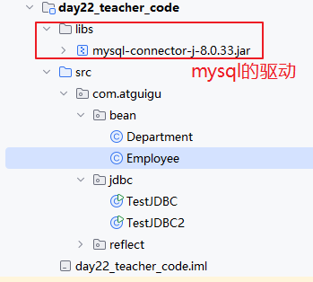

```java
package com.atguigu.jdbc;

import java.sql.*;

public class TestJDBC {
    public static void main(String[] args) throws Exception{
        //这个程序相当于一个客户端，MySQL是服务器端
        Class.forName("com.mysql.cj.jdbc.Driver");
        //这个驱动的Class对象，是给下面的类用
        String url = "jdbc:mysql://localhost:3306/atguigu";//网址
        //http://www.atguigu.com
        //jdbc:mysql: 协议
        //localhost：主机名，对应的IP地址 127.0.0.1
        //3306：端口号
        //atguigu：数据库名，不同项目，数据库名是不同的
        String username = "root";
        String password = "123456";
        Connection conn = DriverManager.getConnection(url, username, password);
        //比喻：昨天学习的Socket

        String sql = "select * from t_department";

        Statement statement = conn.createStatement();
        //比喻：socket.getOutputStream()

        ResultSet res = statement.executeQuery(sql);
        //给服务器发送一条sql语句
        //执行完，服务器会把结果直接返回，返回的结果封装为一个ResultSet的结果集

        ResultSetMetaData metaData = res.getMetaData();
        int columnCount = metaData.getColumnCount();

        while(res.next()){//while循环一次，遍历一行
            for(int i=1; i<=columnCount; i++){//for循环循环一次，遍历一个单元格，一列
                System.out.print(res.getObject(i)+"\t");
            }
            System.out.println();
        }

        res.close();
        statement.close();
        conn.close();
    }
}

```

```java
package com.atguigu.bean;
import lombok.AllArgsConstructor;
import lombok.Data;
import lombok.NoArgsConstructor;

@Data  //自动生成get/set，toString，equals和hashCode方法
@NoArgsConstructor  //自动生成无参构造
@AllArgsConstructor //自动生成全参构造
public class Department {
    private int did;
    private String dname;
    private String description;
}


```

```java
package com.atguigu.jdbc;

import com.atguigu.bean.Department;

import java.lang.reflect.Constructor;
import java.lang.reflect.Field;
import java.sql.*;
import java.util.ArrayList;

public class TestJDBC2 {
    public static void main(String[] args)throws Exception {
        String sql = "select * from t_department";
        ArrayList<Department> list = query(Department.class, sql);
        for (Department d : list) {
            System.out.println(d);
        }
    }

    //这个方法，可以实现把数据库中某个表的每一行数据转为一个Java对象
    //Class代表类型，代表这个表格对应的Java类的类型
    //例如：t_department 对应  Department
    //例如：t_employee 对应  Employee
    public static <T> ArrayList<T> query(Class<T> clazz, String sql)throws Exception{
        //这个程序相当于一个客户端，MySQL是服务器端
        Class.forName("com.mysql.cj.jdbc.Driver");
        //这个驱动的Class对象，是给下面的类用
        String url = "jdbc:mysql://localhost:3306/atguigu";//网址
        //http://www.atguigu.com
        //jdbc:mysql: 协议
        //localhost：主机名，对应的IP地址 127.0.0.1
        //3306：端口号
        //atguigu：数据库名，不同项目，数据库名是不同的
        String username = "root";
        String password = "123456";
        Connection conn = DriverManager.getConnection(url, username, password);
        //比喻：昨天学习的Socket

        Statement statement = conn.createStatement();
        //比喻：socket.getOutputStream()

        ResultSet res = statement.executeQuery(sql);
        //给服务器发送一条sql语句
        //执行完，服务器会把结果直接返回，返回的结果封装为一个ResultSet的结果集

        ResultSetMetaData metaData = res.getMetaData();
        int columnCount = metaData.getColumnCount();

        ArrayList<T> list = new ArrayList<>();

        while(res.next()){//while循环一次，遍历一行
            //一行代表一个对象
            Constructor<T> constructor = clazz.getDeclaredConstructor();
            constructor.setAccessible(true);
            T t = constructor.newInstance();
            for(int i=1; i<=columnCount; i++){//for循环循环一次，遍历一个单元格，一列
                Field field = clazz.getDeclaredField(metaData.getColumnLabel(i));
                field.setAccessible(true);
                field.set(t, res.getObject(i));
            }

            list.add(t);
        }

        res.close();
        statement.close();
        conn.close();

        return list;
    }
}

```


### 1.4.2 代理模式

Spring框架的AOP（面向切面编程）等部分用到代理模式。

#### 基础代码

##### Flyable接口

```java
package com.atguigu.proxy.basic;

public interface Flyable {
    void fly();
}

```

##### Swimming接口

```java
package com.atguigu.proxy.basic;

public interface Swimming {
    void swim();
}

```

##### Bird类实现Flyable接口

```java
package com.atguigu.proxy.basic;

public class Bird implements Flyable{
    @Override
    public void fly() {
        System.out.println("小鸟飞");
    }
}

```

##### Plane类实现Flyable接口

```java
package com.atguigu.proxy.basic;

public class Plane implements Flyable{
    @Override
    public void fly() {
        System.out.println("飞机飞");
    }
}

```

##### Fish类实现Swimming接口

```java
package com.atguigu.proxy.basic;

public class Fish implements Swimming{
    @Override
    public void swim() {
        System.out.println("鱼儿游");
    }
}

```

##### Duck类实现Swimming接口

```java
package com.atguigu.proxy.basic;

public class Duck implements Swimming{
    @Override
    public void swim() {
        System.out.println("鸭子游");
    }
}

```


#### 1、不使用代理模式

如果要给某个类的方法前后加一些语句/功能，只能硬编码，这种方式缺点：重复度高，可维护差（后期如果有变化，要修改的地方很多）。

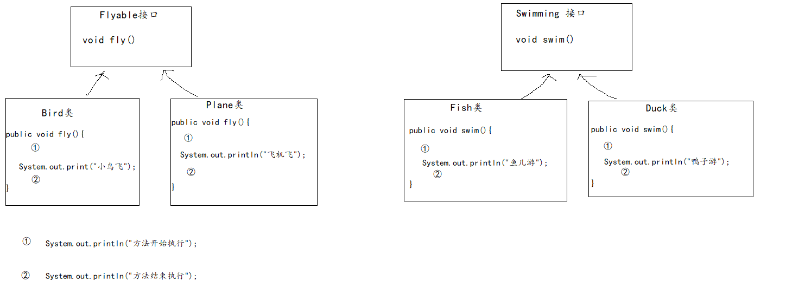

##### Bird类

```java
package com.atguigu.proxy.no;

import com.atguigu.proxy.basic.Flyable;

public class Bird implements Flyable {
    @Override
    public void fly() {
        System.out.println("方法开始执行");
        System.out.println("小鸟飞");
        System.out.println("方法结束执行");
    }
}

```

##### Plane类

```java
package com.atguigu.proxy.no;

import com.atguigu.proxy.basic.Flyable;

public class Plane implements Flyable {
    @Override
    public void fly() {
        System.out.println("方法开始执行");
        System.out.println("飞机飞");
        System.out.println("方法结束执行");
    }
}

```

##### Fish类

```java
package com.atguigu.proxy.no;

import com.atguigu.proxy.basic.Swimming;

public class Fish implements Swimming {
    @Override
    public void swim() {
        System.out.println("方法开始执行");
        System.out.println("鱼儿游");
        System.out.println("方法结束执行");
    }
}

```

##### Duck类

```java
package com.atguigu.proxy.no;

import com.atguigu.proxy.basic.Swimming;

public class Duck implements Swimming {
    @Override
    public void swim() {
        System.out.println("方法开始执行");
        System.out.println("鸭子游");
        System.out.println("方法结束执行");
    }
}

```

##### 测试类

```java
package com.atguigu.proxy.no;

public class TestNoProxy {
    public static void main(String[] args) {
        Bird b = new Bird();
        b.fly();

        Fish f = new Fish();
        f.swim();
    }
}

```


#### 2、使用静态代理

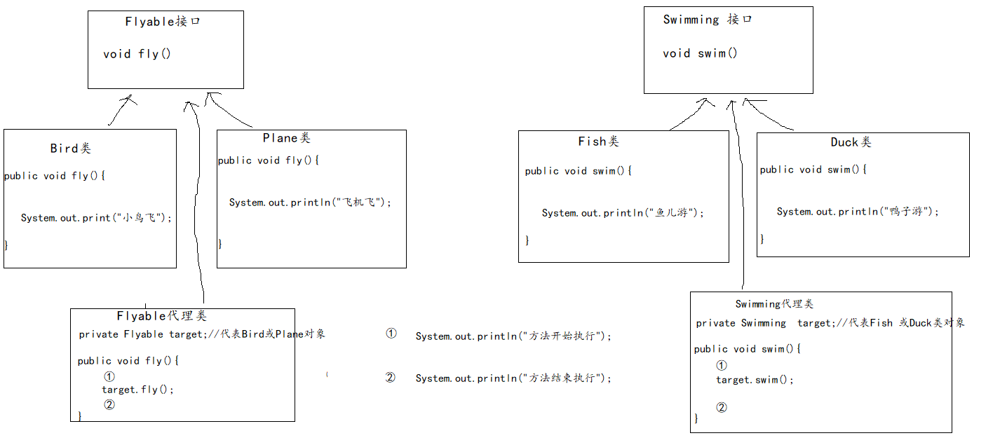

##### Flyable接口静态代理类

```java
package com.atguigu.proxy.jing;

import com.atguigu.proxy.basic.Flyable;

public class FlyableProxy implements Flyable {
    private Flyable target;

    public FlyableProxy(Flyable target) {
        this.target = target;
    }

    @Override
    public void fly() {
        System.out.println("方法开始执行");
        target.fly();
        System.out.println("方法结束执行");
    }
}

```

##### Swimming接口静态代理类

```java
package com.atguigu.proxy.jing;

import com.atguigu.proxy.basic.Swimming;

public class SwimmingProxy implements Swimming {
    private Swimming target;//被代理对象，例如：Fish，Duck对象

    public SwimmingProxy(Swimming target) {
        this.target = target;
    }

    @Override
    public void swim() {
        System.out.println("方法开始执行");
        target.swim();
        System.out.println("方法结束执行");
    }
}

```

##### 测试类

```java
package com.atguigu.proxy.jing;

import com.atguigu.proxy.basic.Bird;
import com.atguigu.proxy.basic.Fish;

public class TestStaticProxy {
    public static void main(String[] args) {
        Bird b = new Bird();
        FlyableProxy fb = new FlyableProxy(b);
        fb.fly();

        Fish f = new Fish();
        SwimmingProxy sf = new SwimmingProxy(f);
        sf.swim();
    }
}

```


#### 3、使用动态代理

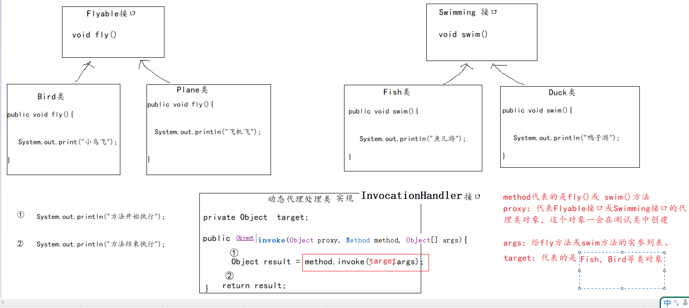

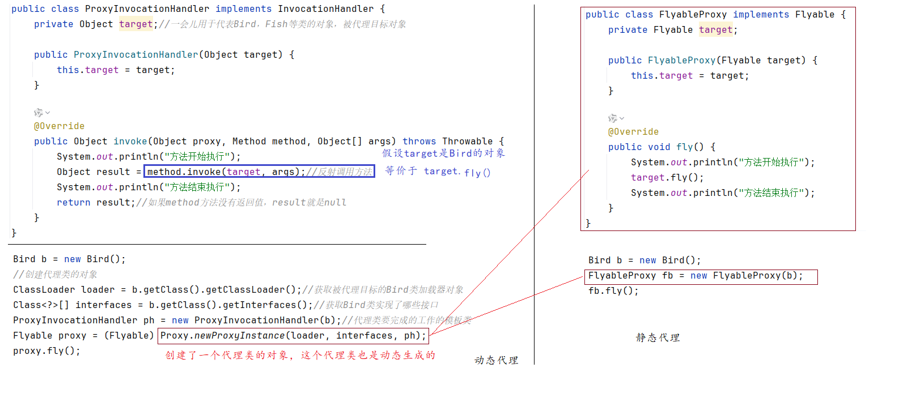

##### 代理类对象执行代理工作的模板类

```java
package com.atguigu.proxy.dong;

import java.lang.reflect.InvocationHandler;
import java.lang.reflect.Method;

public class ProxyInvocationHandler implements InvocationHandler {
    private Object target;//一会儿用于代表Bird，Fish等类的对象，被代理目标对象

    public ProxyInvocationHandler(Object target) {
        this.target = target;
    }

    @Override
    public Object invoke(Object proxy, Method method, Object[] args) throws Throwable {
        System.out.println("方法开始执行");
        Object result = method.invoke(target, args);//反射调用方法
        System.out.println("方法结束执行");
        return result;//如果method方法没有返回值，result就是null
    }
}

```

##### 测试类

```java
package com.atguigu.proxy.dong;

import com.atguigu.proxy.basic.Bird;
import com.atguigu.proxy.basic.Fish;
import com.atguigu.proxy.basic.Flyable;
import com.atguigu.proxy.basic.Swimming;

import java.lang.reflect.Proxy;

public class TestDynamicProxy {
    public static void main(String[] args) {
        Bird b = new Bird();
        //创建代理类的对象
        ClassLoader loader = b.getClass().getClassLoader();//获取被代理目标的Bird类加载器对象
        Class<?>[] interfaces = b.getClass().getInterfaces();//获取Bird类实现了哪些接口
        ProxyInvocationHandler ph = new ProxyInvocationHandler(b);//代理类要完成的工作的模板类
        Flyable proxy = (Flyable) Proxy.newProxyInstance(loader, interfaces, ph);
        proxy.fly();

        System.out.println("=======================");
        Fish f = new Fish();
        ClassLoader loader2 = f.getClass().getClassLoader();//获取被代理目标的Fish类加载器对象
        Class<?>[] interfaces2 = f.getClass().getInterfaces();//获取Fish类实现了哪些接口
        ProxyInvocationHandler ph2 = new ProxyInvocationHandler(f);//代理类要完成的工作的模板类
        Swimming proxy2 = (Swimming) Proxy.newProxyInstance(loader2, interfaces2, ph2);
        proxy2.swim();
    }
}

```


## 1.5 自定义注解

用过的注解：@Override，@Test，@Data，@NoArgsConstructor，@AllArgsConstructor，@Deprecated等。

这些注解是别人定义好的，要么是核心类库中，要么是第三方，例如：JUnit，lombok等。

### 1.5.1 自定义注解的格式

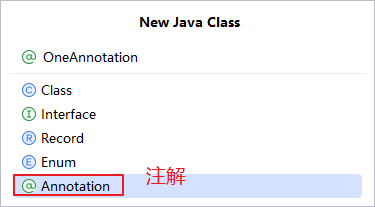

```java
public @interface 注解名{
    
}
```

示例：

```java
package com.atguigu.annotation;

public @interface OneAnnotation {
}

```


### 1.5.2 使用注解

使用注解的语法格式：在类或方法或属性上加@注解名

例如：

```java
@OneAnnotation  //在类上面加注解
public class MyDemo {

    @OneAnnotation   //在属性上面加注解
    private int num;

    @OneAnnotation   //在方法上面加注解
    public void print(){
        System.out.println("我是一个方法而已");
    }
}

```


### 1.5.3 读取注解

如果只有声明和使用，注解没有任何意义，也不会对代码产生任何影响。

注解必须有一段程序来读取它，然后赋予它意义。

@Override注解是由 Java编译器来读取的。当编译器读取到某个方法上加了 @Override，注解，编译器就会执行一段代码，这段代码是检查该方法是不是严格按照重写的要求来编写的。如果不符合重写的要求，就会报错。

@Deprecated 注解是由 Java编译器和 javadoc.exe 来读取。 Java编译器如果到程序员使用了@Deprecated 标记的类或方法，就会弹出警告。 javadoc.exe 读取到@Deprecated 标记的类或方法，就会在API文档中标记 已过时。

@Test注解是由JUnit组件来读取的，就会让这个@Test标记的方法称为一个测试方法，可以独立运行。

下面，编写一段代码读取MyDemo类上面的@OneAnnotation：

```java
package com.atguigu.annotation;

import java.lang.annotation.ElementType;
import java.lang.annotation.Retention;
import java.lang.annotation.RetentionPolicy;
import java.lang.annotation.Target;

@Retention(RetentionPolicy.RUNTIME)  //元注解
@Target({ElementType.FIELD,ElementType.TYPE,ElementType.METHOD}) //元注解
public @interface OneAnnotation {
}

```


```java
package com.atguigu.annotation;


@OneAnnotation  //在类上面加注解
public class MyDemo {

    @OneAnnotation   //在属性上面加注解
    private int num;

    @OneAnnotation   //在方法上面加注解
    public void print(){
        System.out.println("我是一个方法而已");
    }
}

```

```java
package com.atguigu.annotation;

import org.junit.Test;

import java.lang.annotation.Annotation;

public class TestReadOneAnnotation {
    @Test
    public void test1()throws Exception{
        //想要读取MyDemo类上面的@OneAnnotation
        //如果读取到了，我们就打印一句话：MyDemo类也有注解了
        Class clazz = Class.forName("com.atguigu.annotation.MyDemo");
        Annotation[] annotations = clazz.getDeclaredAnnotations();
        for (Annotation annotation : annotations) {
            if(annotation instanceof  OneAnnotation){
                System.out.println("MyDemo类也有注解了");
            }
        }

    }
}

```


## 1.5.4 元注解

当我们定义一个新注解时，加在注解上面的注解，称为元注解。它们是用于对这个新注解进行说明用的。

1、@Target

用于描述新注解可以使用的位置。这个位置由ElementType枚举类的常量对象决定，常见的常量对象有：METHOD，FIELD等。

2、@Retention

用于描述新注解可以保留到哪个阶段，即生命周期。这个生命周期由RetentionPolicy枚举类的3个常量对象之一决定：SOURCE，CLASS，RUNTIME。

- SOURCE：源代码阶段，从java文件到.class文件，这个注解就没用了。
- CLASS：字节码阶段，从字节码被加载到JVM，这个注解就没用了。
- RUNTIME：运行时阶段，可以保留到JVM中。只有这个阶段的注解，才可以被反射读取。

3、@Documented

用于描述新注解要不要在生产API文档时，加上它的信息。

4、@Inherited

用于描述新注解能不能被子类继承


### 1.5.5 注解中的抽象方法

注解被看成是接口，但是它不是真的接口。

注解中也可以定义抽象方法，也只能定义抽象方法。而且这个抽象方法与普通接口的抽象方法有区别：

- 这个抽象方法的返回值类型只能是8种基本数据类型及其包装类，String，枚举，Class类型以及它们的数组。
- 这个抽象方法不能有形参列表，必须是空参
- 这个抽象方法可以指定默认返回值，通过default关键字来指定
- 这个抽象方法在使用注解的时候“重写”，它是在@注解名(抽象方法名=返回值)
- 如果抽象方法名是value，且只有一个抽象方法必须重写的话，那么重写时，可以省略value=

```java
package com.atguigu.annotation;

import java.lang.annotation.Retention;
import java.lang.annotation.RetentionPolicy;

@Retention(RetentionPolicy.RUNTIME)
public @interface TwoAnnotation {
    String method() default "atguigu";
    String show();
}

```

```java
package com.atguigu.annotation;

@OneAnnotation
@TwoAnnotation(show = "尚硅谷")
public class Example {
}

```

```java
package com.atguigu.annotation;

import org.junit.Test;

import java.lang.annotation.Annotation;

public class TestReadTwoAnnotation {
    @Test
    public void test1()throws Exception{
        Class clazz = Example.class;
        Annotation[] annotations = clazz.getAnnotations();
        for (Annotation annotation : annotations) {
            if(annotation instanceof TwoAnnotation){
                TwoAnnotation t = (TwoAnnotation) annotation;
                System.out.println(t.method());//调用注解的抽象方法
                System.out.println(t.show());//调用注解的抽象方法
            }
        }
    }
}

```

## 1.6 总结

Java中一切皆对象。

- Class：Java中把所有数据类型，都看成是Class类的对象。你的程序中有几个类型（包括基本数据类型，类、接口等），相当于JVM中有几个Class类的对象。
- Constructor：Java中把所有构造器都看成Constructor类的对象。你在程序中写了几个构造器，相当于底层就有几个Constructor类的对象。
  - 所有类的构造器都有修饰符、构造名、形参列表、都能new对象
- Field：Java中把所有类的属性/成员变量都看成Field类的对象。
  - 所有类的属性都有修饰符、数据类型、属性名、属性值、都可以get/set值
- Method：Java中把所有类的每一个方法都看成Method类的对象。
  - 所有类的方法都有修饰符、返回值类型、方法名、形参列表、都可以被执行方法体
- Modifier：Java中所有每一个修饰符都是Modifier类中的一个常量值。

Java类的概念：一类具有相同特性的事物的抽象描述。


```java
到底什么是反射？

反射机制是Java语言提供的一种 powerful 机制，允许程序在“运行时`”获取类的信息以及操作类的内部属性和方法。以下是反射机制的主要特点：
（1）动态获取类信息：可以通过Class对象获取类的构造函数、方法、字段等信息。
（2）创建实例：即使没有类的引用，也可以通过反射创建类的实例。
（3）调用方法：可以调用类中的方法，包括私有方法。
（4）设置和获取字段值：能够访问并修改类的私有字段。

需要注意的是，反射虽然强大但也有其缺点，比如性能开销较大，破坏了封装性，并且可能导致代码难以理解和维护。因此，在实际开发中应谨慎使用反射。
```


