# 尚硅谷大模型技术之 NumPy 与 Pandas

> 由 `尚硅谷大模型技术之numpy与pandas1.0.pdf`（149 页）自动转换；图片资源位于同目录 `尚硅谷大模型技术之numpy与pandas1.0.assets/`。

---


（作者：尚硅谷研究院）

版本：V0.9.1

# 第 **1** 章环境搭建

## **1.1 Anaconda**

## **1.1.1** 什么是 **Anaconda**

Anaconda 官网地址：https://www.anaconda.com/

简单来说，Anaconda = Python + 包和环境管理器（Conda）+ 常用库 + 集成工具。它 适合那些需要快速搭建数据科学或机器学习开发环境的用户。Anaconda 和 Python 相当于是 汽车和发动机的关系，安装 Anaconda 后，就像买了一台车，无需自己去安装发动机和其他 零配件，而 Python 作为发动机提供 Anaconda 工作所需的内核。

Anaconda 包及其依赖项和环境的管理工具为 conda 命令，与传统的 Python pip 工具相 比 Anaconda 的 conda 可以更方便地在不同环境之间进行切换，环境管理较为简单。

为什么选择 **Anaconda** ？

- 方便安装：安装 Anaconda 就像安装一个应用程序一样简单，它为您预先安装好 了许多常用的工具，无需单独配置。

- 包管理器： Anaconda 包含一个名为 Conda 的包管理器，用于安装、更新和管理 软件包。Conda 不仅限于 Python，还支持多种其他语言的包管理。

- 环境管理：使用 Anaconda，您可以轻松地创建和管理多个独立的 Python 环境， 比如可以安装 python2 和 python3 环境，然后实现自由切换。这对于在不同项目 中使用不同的库和工具版本非常有用，以避免版本冲突。

- 集成工具和库： Anaconda 捆绑了许多用于数据科学、机器学习和科学计算的重要 工具和库，如 NumPy、Pandas、Matplotlib、SciPy、Scikit-learn 等。

- Jupyter 笔记本： Jupyter 是一个交互式的计算环境，支持多种编程语言，但在 Anaconda 中主要用于 Python。它允许用户创建和共享包含实时代码、方程式、可 视化和叙述文本的文档。


- Spyder 集成开发环境： Anaconda 中集成了 Spyder，这是一个专为科学计算和数 据分析而设计的开发环境，具有代码编辑、调试和数据可视化等功能。

- 跨平台性： Anaconda 可在 Windows、macOS 和 Linux 等操作系统上运行，使其成 为一个跨平台的解决方案。

- 社区支持： Anaconda 拥有庞大的社区，用户可以在社区论坛上获取帮助、分享经 验和解决问题。

## **1.1.2 Anaconda** 下载

- **1** ）进入官网，点击右上角 **Free Download**


- **2** ）点击右下方 **Skip registration** 跳过注册


- **3** ）点击 **Download** 下载，或选择相应的操作系统和版本进行下载


## **1.1.3 Anaconda** 安装

**1** ）双击安装包进入安装


- **2**）点击 **Next**


**3** ）点击 **I Agree**


- **4** ）点击 **Next**


**5** ）修改安装路径，点击 **Next**


- **6** ）酌情修改安装选项，之后点击 **Install** 安装，等待安装完成

安装选项依次为：

- 创建快捷方式-默认选中。为 Anaconda Navigator、Spyder、Jupyter Notebook 和 Anaconda Prompt 软件包创建“开始”菜单快捷方式。

- 将 Anaconda3 添加到我的 PATH 环境变量，将包含 conda 二进制文件的路径添加到 path 环境变量中。Anaconda 不建议选择此选项。conda 二进制文件路径包含其他包 二进制文件，这些二进制文件将添加到 path 环境变量中，即使当前没有处于活动 状态的 conda 环境也是如此。这使得其他软件可以使用这些软件包文件，这可能会 导致错误。可以勾选，也可以在安装后手动添加环境变量。

- 注册 Anaconda3 作为我的默认 Python 3.12-默认选中。将此安装中的 Python 包注册 为 VSCode，PyCharm 等程序的默认 Python。

- 安装完成后清除包缓存。


- **7** ）安装完成后，点击 **Next**


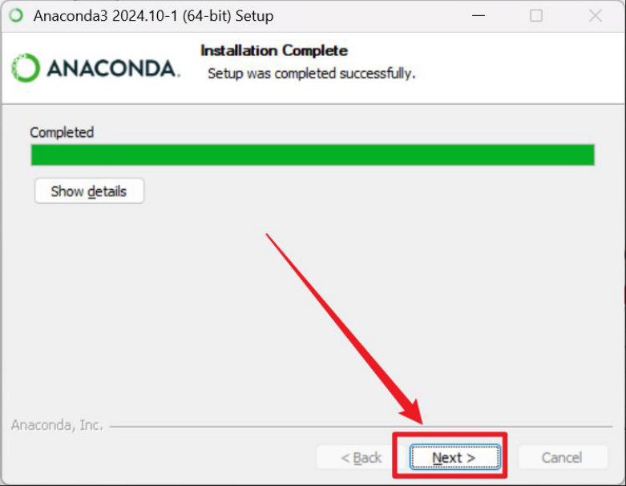


**8** ）再次点击 **Next**


- **9** ）点击 **Finish** ，完成安装


**10** ）若在安装时勾选添加环境变量，会在用户环境变量的 **Path** 中添加相应路径；若安装时

没有勾选添加环境变量，则需要在安装后手动添加环境变量。 **Windows** 操作系统下同

时按下“ **Win+S** ”打开搜索栏，搜索“编辑系统环境变量”可进入查看和编辑环境变量


- **11**）单击右下角环境变量，双击上半部分用户变量中的 **Path** ，若先前安装时勾选了添加环

境变量，在此可查看到已添加的路径


**12** ）若先前安装时未勾选添加环境变量，则需找到先前安装时设定的 **Anaconda** 安装路径。

此处为“ **D:\ProgramFiles\anaconda3** ”，需对照自己的安装路径，在环境变量中点击“新

建”依次添加如下路径：


```python
D:\ProgramFiles\anaconda3（Anaconda 安装路径）
D:\ProgramFiles\anaconda3\Library\mingw-w64\bin （Anaconda 安装路径
\Library\mingw-w64\bin）
D:\ProgramFiles\anaconda3\Library\usr\bin
（
Anaconda
```

 安 装 路 径

```python
\Library\usr\bin）
D:\ProgramFiles\anaconda3\Library\bin（Anaconda 安装路径\Library\bin）
D:\ProgramFiles\anaconda3\Scripts（Anaconda 安装路径\Scripts）
```


**13** ）按下“ **Win+R** ”，输入“ **cmd** ”，点击确定，打开命令提示符


**14** ）输入 **conda info** 查看 **conda** 信息，输入 **python --version** 查看 **Python** 版本。

**Anaconda** 安装成功


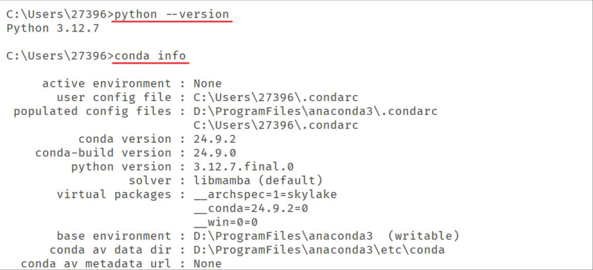


**15** ）因 **conda** 默认源服务器在海外，使用默认源下载第三方库时可能由于网络问题导致下

载失败，故在此配置国内源。在命令提示符中执行 **conda config --set**

**show _** **channel _** **urls yes** ， 会在“ **C:\Users** （用户） **\** 用户名”路径下生成“ **.condarc** ”

文件


**16** ）双击“ **.condarc** ”文件，选择使用记事本打开，删除其中所有内容，并粘贴如下内容之

后保存，这样就配置好了国内清华源

channels: - https://mirrors.tuna.tsinghua.edu.cn/anaconda/cloud/msys2/ - https://mirrors.tuna.tsinghua.edu.cn/anaconda/cloud/condaforge - https://mirrors.tuna.tsinghua.edu.cn/anaconda/pkgs/free/ - defaults


`show_channel_urls: true`


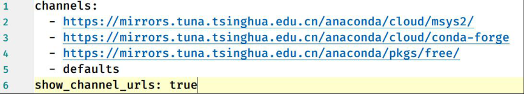


## **1.1.4 Ubuntu** 安装 **Anaconda**

**1** ）在 **/opt** 目录下创建 **module** 与 **software** 目录，并修改所属主与所属组为 **atguigu**

cd /opt sudo mkdir module software sudo chown atguigu:atguigu module software

- **2** ）将 **Anaconda** 的 **.sh** 文件放入 **software** 目录中

- **3** ）执行脚本开始安装 **Anaconda**

bash Anaconda3-2024.10-1-Linux-x86_64.sh

- **4** ）按下回车继续


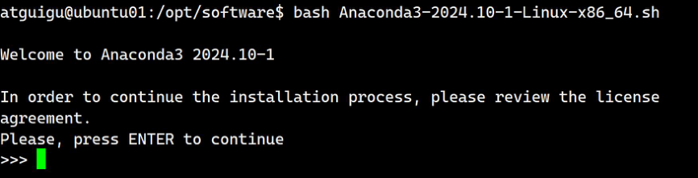


- **5** ）持续按↓直到提示输入 **yes** 或 **no,** 按下回车


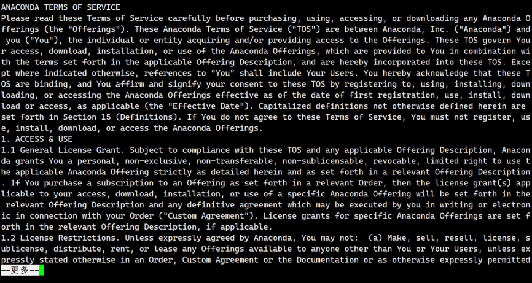


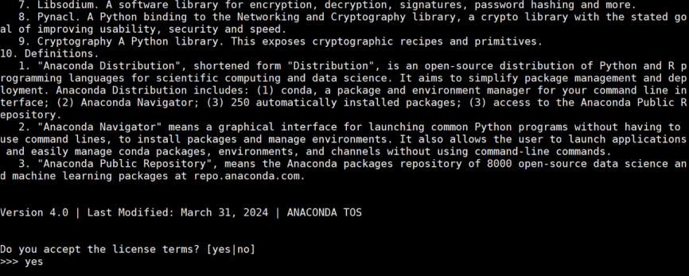


- **6** ）需要指定安装路径，输入 **/opt/module/anaconda3** ，回车，等待安装完成


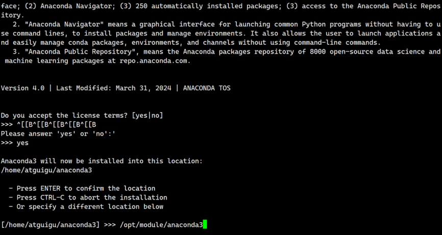


- **7** ）安装后会询问是否进行 **conda** 初始化，注意此处默认为 **no** ，需要输入 **yes**


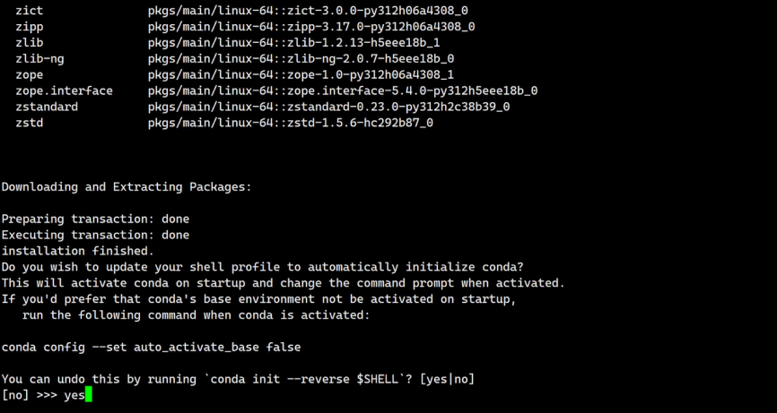


**8** ）如果没有选择 **yes** ，需要手动进行初始化，进入 **conda** 安装目录的 **bin** 目录下，执行 **conda**

**init** 命令


```python
cd /opt/module/anaconda3/bin
./conda init
```


**9** ）初始化完毕后会提示需要重启 **shell** ，断开连接并重新连接虚拟机即可


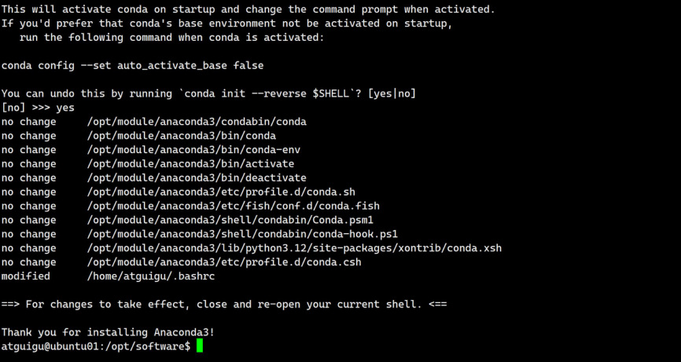


**10** ）重新连接后发现命令行会提示当前处于哪个 **conda** 环境，此处为 **base** 环境


**11** ）配置国内镜像源

配置文件.condarc 在 /home/用户名目录下。

vim ~/.condarc

修改为如下内容：

channels: - https://mirrors.tuna.tsinghua.edu.cn/anaconda/cloud/msys2/ - https://mirrors.tuna.tsinghua.edu.cn/anaconda/cloud/condaforge - https://mirrors.tuna.tsinghua.edu.cn/anaconda/pkgs/free/ - defaults


保存退出。

## **1.1.5 Ubuntu** 卸载 **Anaconda**


- **1**）停用 **Anaconda** 环境

在卸载之前，需要确保当前没有激活 Anaconda 环境。可以通过以下命令来停用当前激 活的 Anaconda 环境：

conda deactivate

执行该命令后，会退出当前的 Anaconda 环境。

- **2**）删除 **Anaconda** 安装目录

rm -rf /opt/module/anaconda3/

- **3**）移除环境变量配置

Anaconda 安装时会在用户的配置文件（如~/.bashrc、~/.zshrc 等）中添加环境变量。需 要手动编辑这些文件，移除与 Anaconda 相关的环境变量配置。

对于 **bash** 用户


```python
nano ~/.bashrc
在打开的文件中，找到类似以下内容的行并删除：
# >>> conda initialize >>>
# !! Contents within this block are managed by 'conda init' !!
__conda_setup="$('/home/your_username/anaconda3/bin/conda'
'shell.bash' 'hook' 2> /dev/null)"
if [ $? -eq 0 ]; then
eval "$__conda_setup"
else
if
[
-f
"/home/your_username/anaconda3/etc/profile.d/conda.sh" ]; then
. "/home/your_username/anaconda3/etc/profile.d/conda.sh"
else
export PATH="/home/your_username/anaconda3/bin:$PATH"
fi
fi
unset __conda_setup
# <<< conda initialize <<<
```


编辑完成后，按 Ctrl + X，然后按 Y 确认保存，最后按 Enter 退出 nano 编辑器。

对于 **zsh** 用户

使用以下命令编辑~/.zshrc 文件：

nano ~/.zshrc

同样找到并删除与 Anaconda 相关的环境变量配置，编辑完成后保存退出。

**4** ）使配置文件生效

source ~/.bashrc # 如果你使用的是 bash source ~/.zshrc # 如果你使用的是 zsh

**5** ）清理残留文件（可选）

有时候，Anaconda 可能会在系统中留下一些残留的配置文件和缓存。可以手动删除这 些文件：


`rm -rf ~/.condarc ~/.conda ~/.continuum ~/.jupyter`

完成以上步骤后，Anaconda 就已经从你的 Ubuntu 系统中彻底卸载了。

## **1.1.6 conda** 常用命令

- **1**）环境管理

|功能|命令|
|---|---|
|创建环境|conda create -n <环境名> python=<版本号>|
||例如：conda create -n env1 python=3.12|
|激活环境|conda activate <环境名>|
||例如：conda activate env1|
|退出环境|conda deactivate|
|列出所有环境|conda env list 或conda info --env|
|删除环境|conda remove -n <环境名> --all|
||例如：conda remove -n env1 --all|
|查看**conda** 信息|conda info|


- **2**）软件包管理

|功能|命令|
|---|---|
|安装软件包|conda install <包名>|
||例如：conda install numpy|
|指定版本安装软件包|conda install <包名>=<版本号>|
||例如：conda install numpy=1.26.4|
|更新软件包|conda update <包名>|
||例如：conda update pandas|
|卸载软件包|conda remove <包名>|
||例如：conda remove matplotlib|


注意：虚拟新的环境起到的作用是环境隔离，项目间相互不影响，如果使用 pycharm 在

指定 anaconda 解释器的时候，会自动创建虚拟环境。

## **1.2 Jupyter**

Jupyter 是一个开源的交互式计算环境，广泛应用于数据科学、机器学习、科学研究等 领域，主要组件有 Jupyter Notebook 和 Jupyter Lab。JupyterLab 作为 Jupyter Notebook 的继


承者，提供了更现代化和功能丰富的界面。JupyterLab 的多文档界面、内置协作功能和扩展 系统使其成为数据科学家和研究人员的首选。

## **1.2.1** 使用本地 **Jupyter**

**1** ）命令提示符中输入 **jupyter lab** 或 **jupyter notebook** ，会弹出浏览器页面直接进入主页面

`C:\Users\fuxiaofeng>jupyter lab`


注意：由于网络等原因，可能导致访问时候出现警告，可以忽略。

## **1.2.2 PyCharm** 中集成 **Jupyter**

Pycharm 界面提供了对 Jupyter Notebook 的集成

- **1** ）进入到设置


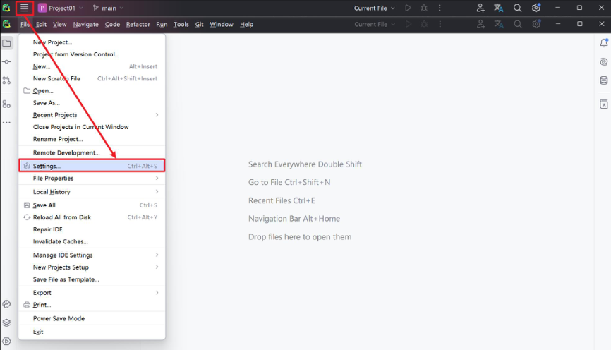


- **2**）添加新的解释器


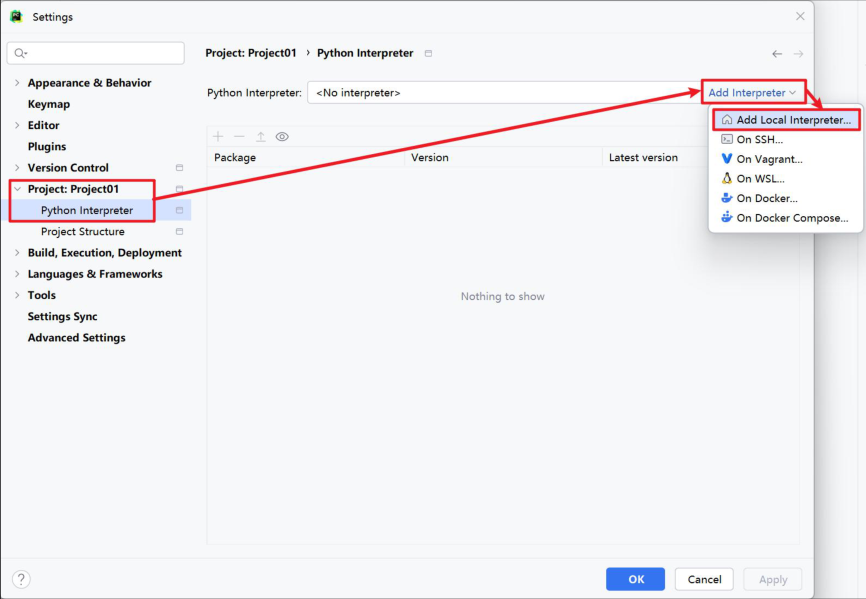


**3** ）解释器类型选择 **Conda**


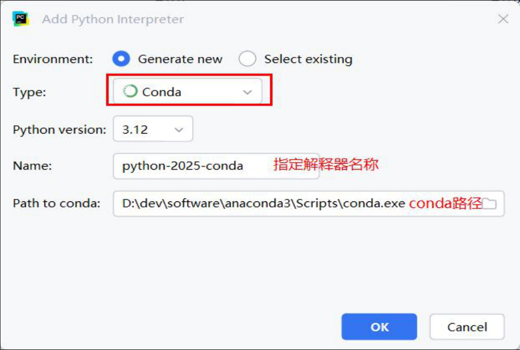


**4** ）为了避免出错，环境改变后，重启 **pycharm**


- **5**）创建 **Jupyter Notebook** 文件


会在当前项目下创建新的 conda 环境，新的 conda 环境中没有 Jupyter，如果运行的话会

自动在当前环境下安装。

## **1.2.3** 使用远程 **JupyterServer**


- **1** ）虚拟机中输入 **jupyter notebook --generate-config** 命令，创建 **jupyter** 配置文件

文件会创建在用户家目录/.jupyter 目录下


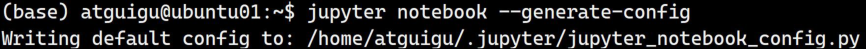


- **2**）创建登录密码

在命令行中输入如下命令，之后输入两次密码，密码会写入配置文件中：

`jupyter-lab password`


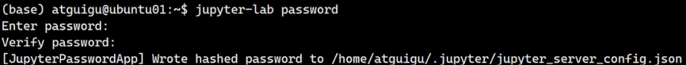


- **3**）修改上面生成的配置文件，添加配置

进入配置文件：


```python
vim /home/atguigu/.jupyter/jupyter_notebook_config.py
添加如下配置：
c.ServerApp.ip = '*'
# 允许所有ip 访问
c.ServerApp.open_browser = False
# 不自动打开浏览器
c.ServerApp.port = 8888
# 指定端口,默认8888
```


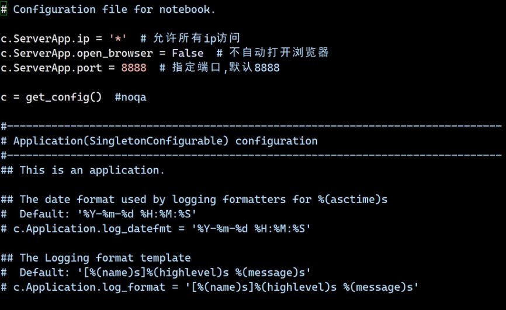


保存退出。

- **4**）虚拟机中输入 **jupyter lab** 命令，启动 **jupyter server**

启动后会返回访问链接，远程访问时需要将链接中的 localhost 或 127.0.0.1 修改为虚拟

机的主机名或虚拟机 ip。


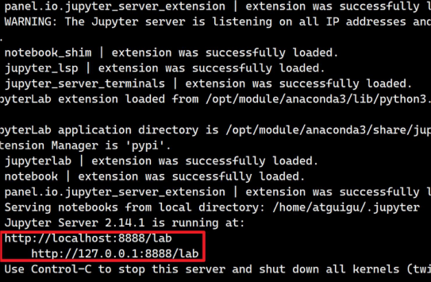


- **5**）在浏览器中输入链接并输入密码，远程使用 **jupyter notebook**


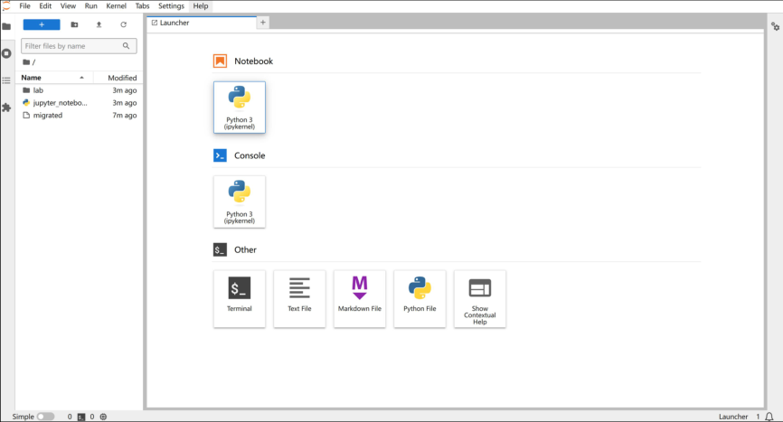


**6** ） **PyCharm** 中打开 **Settings** 设置，在 **Languages & Frameworks** 下的 **Jupyter** 下的 **Jupyter**

**Servers** 中的 **Configured Server** 中填写链接并输入密码


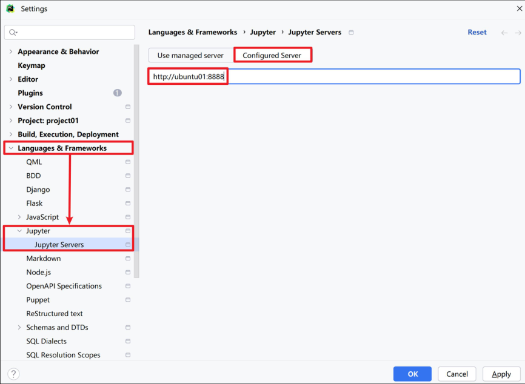


- **7**）**PyCharm** 中新建一个 **.ipynb** 文件


- **8**）也可以在 **.ipynb** 文件上方配置远程 **Jupyter** 服务链接


## **1.2.4 Jupyter** 快捷键

- esc：从输入模式退出到命令模式

- a：在当前 cell 上面创建一个新的 cell

- b：在当前 cell 下面创建一个新的 cell

- dd：删除当前 cell

- m：切换到 markdown 模式

- y：切换到 code 模式

- ctrl+回车：运行 cell

- shift +回车：运行当前 cell 并创建一个新的 cell

# 第 **2** 章 **Numpy**

## **2.1** 什么是 **numpy**

numpy 是 Python 中科学计算的基础包。它是一个 Python 库，提供多维数组对象、各种 派生对象（例如掩码数组和矩阵）以及用于对数组进行快速操作的各种方法，包括数学、逻 辑、形状操作、排序、选择、I/O 、离散傅里叶变换、基本线性代数、基本统计运算、随机 模拟等等。

numpy 的部分功能如下：

- ndarray，一个具有矢量算术运算和复杂广播能力的快速且节省空间的多维数组。

- 用于对整组数据进行快速运算的标准数学函数（无需编写循环）。

- 用于读写磁盘数据的工具以及用于操作内存映射文件的工具。

- 线性代数、随机数生成以及傅里叶变换功能。

- 用于集成由 C、C++、Fortran 等语言编写的代码的 API。

## **2.2 ndarray** 的限制


大多数 numpy 数组都有一些限制：

- 数组的所有元素必须具有相同的数据类型。

- 一旦创建，数组的总大小就不能改变。

- 形状必须是“矩形”，而不是“锯齿状”。例如二维数组的每一行必须具有相同的 列数。

## **2.3 ndarray** 的属性

- **1**）先安装 **numpy** 包


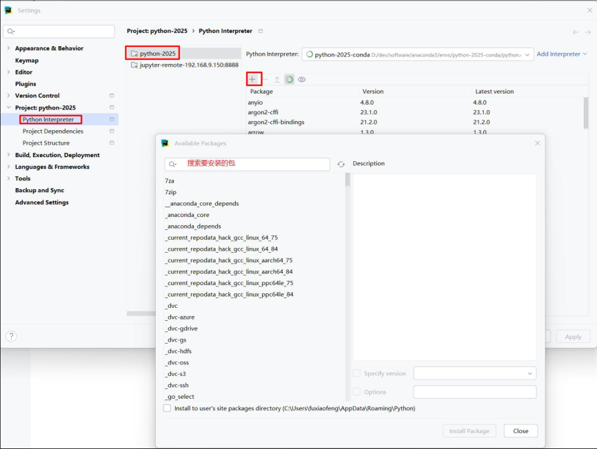


- **2**）如果在 **Pycharm** 中加载不出来，可以通过如下命令安装

C:\Users\fuxiaofeng>conda activate python-2025-conda (python-2025-conda) C:\Users\fuxiaofeng>conda install numpy **3** ） **ndarray** 属性案例

import numpy as np # 导入 numpy a = np.array([[1, 2, 3], [4, 5, 6]]) # 创建一个二维数组 print(a) print(a.ndim) # 维度 print(a.shape) # 形状 print(a.size) # 元素个数 print(a.dtype) # 数据类型


`print(a.itemsize)` # 每个元素字节数大小

## **2.4 ndarray** 的创建方式

## **2.4.1 array()** 与 **asarray()**

**array()** ： 将输入数据转换为 ndarray，会进行 copy。

**asarray()** ： 将输入数据转换为 ndarray，如果输入本身是 ndarray 则不会进行 copy。

数组的创建方式

```python
"""
array:将输入的数据转换为ndarray，会进行copy
asarray：将输入的数据转换为ndarray，如果输入本身是ndarray，则不会进行
copy
"""
import numpy as np
data = [1,2,3]
print(f"元数据地址为:{id(data)}")
arr = np.array(data)
print(f"arr1 地址为:{id(arr)}")
print(f"数组数据为:{arr}")
print("-" * 20)
arr2 = np.array(arr)
print(f"arr2 地址为:{id(arr2)}")
print(f"arr2 数组数据为:{arr2}")
print("-" * 20)
arr3 = np.asarray(arr)
print(f"arr3 地址为:{id(arr3)}")
print(f"arr3 数组数据为:{arr3}")
```


## **2.4.2 zeros()** 、 **ones()** 、 **empty()** 与 **zeros_like()** 、 **ones_like()** 、 **empty_like()**

**zeros()** ： 返回给定形状和类型的新数组，用 0 填充。 **ones()** ： 返回给定形状和类型的新数组，用 1 填充。 **empty()** ： 返回给定形状和类型的未初始化的新数组。

需要注意的是，np.empty 并不保证数组元素被初始化为 0，它只是分配内存空间，数组 中的元素值是未初始化的，可能是内存中的任意值。


上述 3 个方法创建的数组元素类型默认都是 float64。 **zeros_like()** ： 返回与给定数组具有相同形状和类型的 0 新 数组。 **ones_like()** ： 返回与给定数组具有相同形状和类型的 1 新 数组。 **empty_like()** ： 返回与给定数组具有相同形状和类型的未初始化的 新 数组。

```python
arr1 = np.zeros((2, 5))
# 创建全0 数组
# [[0. 0. 0. 0. 0.]
#
[0. 0. 0. 0. 0.]]
arr2 = np.ones_like(arr1)
# 创建和arr1 形状相同的全1 数组
# [[1. 1. 1. 1. 1.]
#
[1. 1. 1. 1. 1.]]
arr3 = np.empty((2, 3))
# 创建未初始化的数组
# [[-9.05243306e-312 -1.06658093e-264
9.05246807e-312]
#
[ 9.05246807e-312
6.91691904e-323
2.96439388e-323]]
arr4 = np.empty_like(arr3)
# 创建和arr3 形状相同的未初始化数组
# [[-6.95272242e-310
1.22635717e+139
9.05246806e-312]
#
[ 9.05246806e-312
1.33397724e-322
4.15015143e-322]]
```


注意：这里元素间的分隔符是空格，而不是小数点 .

## **2.4.3 full()** 与 **full_like()**

**full()** ： 返回给定形状和类型的新数组，用指定的值填充。

**full_like()** ： 返回与给定数组具有相同形状和类型的用指定值填充的新数组。 arr1 = np.full((2, 3), 6) # [[6 6 6] # [6 6 6]] arr2 = np.full_like(arr1, 5) # [[5 5 5] # [5 5 5]]

## **2.4.4 arange()**

**arange()** ： 返回在给定范围内用均匀间隔的值填充的一维数组。

arr1 = np.arange(0, 10, 2) # [0 2 4 6 8]

## **2.4.5 linspace()** 与 **logspace()**

**linspace()** ： 返回指定范围和元素个数的等差数列。数组元素类型为浮点型。


**logspace()** ： 返回指定指数范围、元素个数、底数的等比数列。


```python
arr1 = np.linspace(start=0, stop=10, num=5)
# [ 0.
2.5
5.
7.5 10. ]
arr2 = np.linspace(start=0, stop=10, num=5, endpoint=False)
# 设置
endpoint=False，表示不包括stop
# [0. 2. 4. 6. 8.]
arr3 = np.logspace(start=2, stop=5, num=5, base=2)
# [ 4.
6.72717132 11.3137085
19.02731384 32.
]
```


默认 **endpoint=True** 时

如果把 0 到 10 看作一条线段，相当于用 5 个点将这条线段分成了 4 段，要计算每段的 长度（即相邻元素的间隔），用总长度 (stop - start) 除以段数 (num - 1) ，得到间隔为 10-0 / 4 = 2.5。这样从起始点 0 开始，每次加上间隔 2.5 就能依次得到序列中的元素：0、2.5、 5、7.5、10 。

若 **endpoint=False** 的情况

当 endpoint=False 时，意味着 stop 这个值不包含在生成的序列中，此时 [start, stop) 区 间相当于一条右端点空心（不包含 stop 这个点）的线段。我们在这条线段上放置 num 个点 进行划分，每一个点都会划分出一个新的区间段。比如，放 1 个点会把线段分成 1 段，放 2 个点会分成 2 段，放 num 个点就会分成 num 段，段数就等于点数 num，计算间隔的公 式就变为 (stop - start) / num 。

## **2.4.6** 创建随机数数组

**random.rand()** ： 返回给定形状的数组，用 [0, 1) 上均匀分布的随机样本填充。

**random.randint()** ： 返回给定形状的数组，用从低位(包含)到高位(不包含)上均匀分布的

随机整数填充。

**random.uniform()** ： 返回给定形状的数组，用从低位(包含)到高位(不包含)上均匀分布的 随机浮点数填充。

**random.randn()** ： 返回给定形状的数组，用标准正态分布(均值为 0，标准差为 1)的随机 样本填充。


```python
arr1 = np.random.rand(2, 3)
# [[0.77112868 0.97415392 0.25668864]
#
[0.49946961 0.23491874 0.40514576]]
arr2 = np.random.randint(0, 10, (2, 3))
```


[[7 8 2] # [1 2 3]]

arr3 = np.random.uniform(3, 6, (2, 3)) # [[5.69275495 3.84857937 3.2899215 ] # [5.32035519 3.7460973 3.33859905]] arr4 = np.random.randn(2, 3) # [[-2.03654925 -0.50146561 0.4362483 ] # [-1.90585739 0.94797017 -0.77026926]]

## **2.4.7 matrix()**

matrix 为 ndarray 的子类，只能生成二维的矩阵。

arr1 = np.matrix("1 2; 3 4") # [[1 2] # [3 4]] arr2 = np.matrix([[1, 2], [3, 4]]) # [[1 2] # [3 4]]

## **2.5 ndarray** 的数据类型

|数据类型|类型代码|说明|
|---|---|---|
|**bool**|?|布尔类型|
|**int8**、**uint8**|i1,u1|有符号、无符号的8位（1字节）整型|
|**int16**、**uint16**|i2,u2|有符号、无符号的16位（2字节）整型|
|**int32**、**uint32**|i4,u4|有符号、无符号的32位（4字节）整型|
|**int64**、**uint64**|i8,u8|有符号、无符号的64位（8字节）整型|
|**float16**|f2|半精度浮点型|
|**float32**|f4或f|单精度浮点型|
|**float64**|f8或d|双精度浮点型|
|**complex64**|c8|用两个32位浮点数表示的复数|
|**complex128**|c16|用两个64位浮点数表示的复数|


创建数组时可以使用 dtype 参数指定元素类型：


```python
arr1 = np.array([1, 2, 3], dtype=np.float64)
# [1. 2. 3.]
```


```python
arr2 = np.array([0.2, 2.5, 4.8], dtype="i8")
# [0 2 4]
也可以使用ndarray.astype()方法转换数组的元素类型：
arr1 = np.array([1, 2, 3], dtype=np.float64)
# [1. 2. 3.]
arr2 = arr1.astype(np.int64)
# [1 2 3]
```


## **2.6 ndarray** 切片和索引

ndarray 对象的内容可以通过索引或切片来访问和修改，与 Python 中 list 的切片操作 一样。

可以通过内置的 slice 函数，或者冒号设置 start, stop 及 step 参数进行切片，从原数组中 切割出一个新数组。


```python
import numpy as np
arr = np.arange(10)
print(arr)
# [0 1 2 3 4 5 6 7 8 9
#获取索引为2 的数据
print(arr[2])
# 2
# 从索引2 开始到索引9(不包含)停止，间隔为2
print(arr[slice(2,9,2)])
# [2 4 6 8]
# 从索引2 开始到索引9(不包含)停止，间隔为2
print(arr[2:9:2])
# [2 4 6 8]
# 从索引2 开始到最后(不包含)，默认间隔为1
print(arr[2:])
# [2 3 4 5 6 7 8 9]
```

 `# 从索引2 开始到索引9(不包含)结束，默认间隔为1`


```python
print(arr[2:9])
# [2 3 4 5 6 7 8]
```


## **2.7 numpy** 常用函数

## **2.7.1** 基本函数

|函数|说明|
|---|---|
|**np.abs()**|元素的绝对值，参数是number 或array|
|**np.ceil()**|向上取整，参数是number 或array|
|**np.floor()**|向下取整，参数是number 或array|
|**np.rint()**|四舍五入，参数是number 或array|
|**np.isnan()**|判断元素是否为NaN(Not a Number) ，参数是number 或<br>array|
|**np.multiply()**|元素相乘，参数是number 或array。如果第二个参数传递的<br>是number，原数组中所有元素乘以这个数字，返回新的数组；|
||如果第二个参数也是一个数组，是将两个数组中对应位置的元|
||素相乘，返回一个新的数组，其形状与输入数组相同。|
|**np.divide()**|元素相除，参数是number 或array|
|**np.where(condition, x, y)**|三元运算符，x if condition else y|


```python
arr1 = np.random.randn(2, 3)
print(arr1)
print(np.abs(arr1))
print(np.ceil(arr1))
print(np.floor(arr1))
print(np.rint(arr1))
print(np.isnan(arr1))
print(np.multiply(arr1, 2))
print(np.divide(arr1, arr1))
print(np.where(arr1 > 0, 1, 0))
```


## **2.7.2** 统计函数

|函数|说明|
|---|---|
|**np.mean()**|所有元素的平均值|
|**np.sum()**|所有元素的和|
|**np.max()**|所有元素的最大值|


|**np.min()**|所有元素的最小值|
|---|---|
|**np.std()**|所有元素的标准差|
|**np.var()**|所有元素的方差|
|**np.argmax()**|最大值的下标索引值|
|**np.argmin()**|最小值的下标索引值|
|**np.cumsum()**|返回一个一维数组，每个元素都是之前所有元素的累加和|
|**np.cumprod()**|返回一个一维数组，每个元素都是之前所有元素的累乘积|


多维数组在计算时默认计算全部维度，可以使用 axis 参数指定按某一维度为轴心统计， axis=0 按列统计、axis=1 按行统计。


```python
arr1 = np.random.randint(1, 5, (2, 3))
print(arr1)
print(np.mean(arr1))
print(np.sum(arr1))
print(np.max(arr1))
print(np.min(arr1))
print(np.std(arr1))
print(np.var(arr1))
print(np.argmax(arr1))
print(np.argmin(arr1))
print(np.cumsum(arr1))
print(np.cumprod(arr1))
print(np.cumprod(arr1, axis=1))
```


## **2.7.3** 比较函数

|函数|说明|
|---|---|
|**np.any()**|至少有一个元素满足指定条件，就返回True|
|**np.all()**|所有的元素都满足指定条件，才返回True|
|arr1 = np.array([1, 2,|3, 4, 5])|
|print(np.any(arr1 > 3))||
|print(np.all(arr1 > 3))||


## **2.7.4** 排序函数

**ndarray.sort()** ： 就地排序（直接修改原数组）。

arr1 = np.random.randint(0, 10, (3, 3)) print(arr1) arr1.sort() print(arr1)


```python
arr1.sort(axis=0)
print(arr1)
```


axis：指定排序的轴。默认值为 -1，表示沿着最后一个轴进行排序。在二维数组中，axis

= 0 表示按列排序，axis = 1 表示按行排序。

在 NumPy 中，轴是对数组维度的一种抽象描述。对于多维数组，每个维度都对应一个 轴，轴的编号从 0 开始。对于二维数组，它有两个轴：

轴 0：代表垂直方向，也就是行的方向。可以把二维数组想象成一个表格，轴 0 就像 是表格中从上到下的行索引方向对列数据排序，所以 axis=0 表示按列排序。

轴 1：代表水平方向，也就是列的方向。就像是表格中从左到右的列索引方向对行数据

进行排序，所以 axis=1 表示按行排序。

**np.sort()** ： 返回排序后的副本（创建新的数组）。

arr1 = np.random.randint(0, 10, (3, 3)) print(arr1) print(np.sort(arr1))

## **2.7.5** 去重函数

**np.unique()** ： 计算唯一值并返回有序结果。

arr1 = np.random.randint(0, 5, (3, 3)) print(arr1) print(np.unique(arr1))

## **2.8** 基本运算

numpy 中的数组不用编写循环即可执行批量运算，称之为矢量化运算。

大小相等的数组之间的任何算术运算都会将运算应用到元素级。


```python
arr1 = np.array([[1, 2, 3], [4, 5, 6]])
arr2 = np.array([[7, 8, 9], [10, 11, 12]])
print(arr1 + arr2)
print(arr1 - arr2)
print(arr1 * arr2)
print(arr1 / arr2)
数组与标量的算术运算会将标量值传播到各个元素，不同大小的数组之间的运算叫做广
播。
arr1 = np.array([[1, 2, 3], [4, 5, 6]])
print(arr1 + 100)
print(arr1 - 100)
print(arr1 * 100)
print(arr1 / 100)
```


广播机制是 NumPy 中一个强大的特性，它允许在不同形状的数组之间进行元素级运算。

广播机制的规则如下：

 规则 1：如果俩个数组的维度数不相同，那么小维度数组的形状将会在最左边补 1。


```python
import numpy as np
# 一维数组
arr1 = np.array([1, 2, 3])
# 形状为(3,)
# 二维数组
arr2 = np.array([[4], [5], [6]])
# 形状为(3, 1)
# 对arr1 应用规则1，在其形状最左边补1，变为(1, 3)
[[1,2,3]]
# 此时arr1 形状(1, 3) 和arr2 形状(3, 1) 满足广播条件
result = arr1 + arr2
print("规则1 示例结果：\n", result)
```


 规则 2：如果俩个数组的形状在任何一个维度上都不匹配，那么数组的形状会沿着 维度大小（元素个数）为 1 的维度开始扩展，（维度必须是 1 开始）直到所有维 度都一样，以匹配另一个数组的形状。


```python
import numpy as np
# 二维数组
arr3 = np.array([[1, 2, 3]])
# 形状为(1, 3)
# 二维数组
arr4 = np.array([[4], [5], [6]])
# 形状为(3, 1)
# arr3 沿着第0 个维度扩展,将原有的一行数据复制成3 行,为(3, 3)=>[[1,2,3],
[1,2,3], [1,2,3]]
# arr4 沿着第1 个维度扩展, (3, 3)=>[[4,4,4], [5,5,5], [6,6,6]]
result = arr3 + arr4
print("规则2 示例结果：\n", result)
```


 规则 3：如果俩个数组的形状在任何一个维度上都不匹配，并且没有任何一个维度 大小等于 1，那么会引发异。


```python
import numpy as np
# 一维数组
arr5 = np.array([1, 2, 3])
# 形状为(3,)
# 一维数组
arr6 = np.array([4, 5])
# 形状为(2,)
try:
result = arr5 + arr6
```


print(result) except ValueError as e: print(f"规则 3 示例错误信息：{e}")

## **2.9** 矩阵乘法

通过*运算符和 np.multiply()对两个数组相乘进行的是对位乘法而非矩阵乘法运算。

arr1 = np.array([[1, 2, 3], [4, 5, 6]]) arr2 = np.array([[6, 5, 4], [3, 2, 1]]) print(arr1 * arr2) print(np.multiply(arr1, arr2))

使用 np.dot()、ndarray.dot()、@可以进行矩阵乘法运算。

arr1 = np.array([[1, 2, 3], [4, 5, 6]]) arr2 = np.array([[6, 5], [4, 3], [2, 1]]) #对于矩阵乘法来说，要求第一个矩阵的列数等于第二个矩阵的行数 print(arr1) print(arr2) print(arr1.shape, arr2.shape) print(np.dot(arr1, arr2)) print(arr1.dot(arr2)) print(arr1 @ arr2) # 一个二维数组跟一个大小合适的一维数组的矩阵点积运算之后将会得到一个一维数组 arr3 = np.array([6, 5, 4]) print(arr1 @ arr3)

矩阵乘法的规则是：结果矩阵中第 i 行第 j 列的元素等于第一个矩阵的第 i 行与第二个

矩阵的第 j 列对应元素乘积之和。

- 结果矩阵第一行第一列的元素：

计算 arr1 的第一行 [1, 2, 3] 与 arr2 的第一列 [6, 4, 2] 对应元素乘积之和，即 1*6 + 2*4 + 3*2 = 6 + 8 + 6 = 20。

- 结果矩阵第一行第二列的元素：

计算 arr1 的第一行 [1, 2, 3] 与 arr2 的第二列 [5, 3, 1] 对应元素乘积之和，即 1*5 + 2*3 + 3*1 = 5 + 6 + 3 = 14。

- 结果矩阵第二行第一列的元素：

计算 arr1 的第二行 [4, 5, 6] 与 arr2 的第一列 [6, 4, 2] 对应元素乘积之和，即 4*6 + 5*4 + 6*2 = 24 + 20 + 12 = 56。

- 结果矩阵第二行第二列的元素：


计算 arr1 的第二行 [4, 5, 6] 与 arr2 的第二列 [5, 3, 1] 对应元素乘积之和，即 4*5 + 5*3 +

6*1 = 20 + 15 + 6 = 41。

所以，手动计算得到的结果矩阵是 [[20, 14], [56, 41]]。

# 第 **3** 章 **Pandas**

## **3.1** 什么是 **Pandas**

Pandas 是一个开源的数据分析和数据处理库，它是基于 Python 编程语言的。

Pandas 提供了易于使用的数据结构和数据分析工具，特别适用于处理结构化数据，如

表格型数据（类似于 Excel 表格）。

Pandas 是数据科学和分析领域中常用的工具之一，它使得用户能够轻松地从各种数据 源中导入数据，并对数据进行高效的操作和分析。

用得最多的 pandas 对象是 Series，一个一维的标签化数组对象，另一个是 DataFrame， 它是一个面向列的二维表结构。


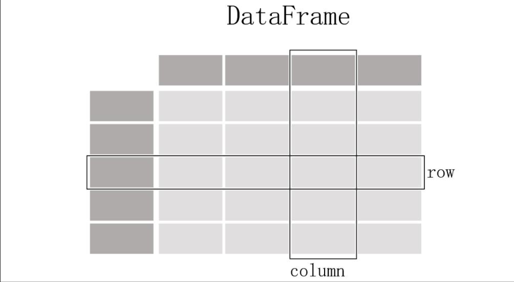


pandas 兼具 numpy 高性能的数组计算功能以及电子表格和关系型数据库（如 SQL）灵

活的数据处理功能。它提供了复杂精细的索引功能，能更加便捷地完成重塑、切片和切块、

聚合以及选取数据子集等操作。

pandas 功能：

- 有标签轴的数据结构

在数据结构中，每个轴都被赋予了特定的标签，这些标签用于标识和引用轴上的数据元

素，使得数据的组织、访问和操作更加直观和方便

- 集成时间序列功能。

- 相同的数据结构用于处理时间序列数据和非时间序列数据。

- 保存元数据的算术运算和压缩。

- 灵活处理缺失数据。

- 合并和其它流行数据库（例如基于 SQL 的数据库）的关系操作。

pandas 这个名字源于 panel data（面板数据，这是多维结构化数据集在计量经济学中的

术语）以及 Python data analysis（Python 数据分析）。

## **3.2 Pandas** 数据结构 **-Series**

Series 是 Pandas 中的一个核心数据结构，类似于一个一维的数组，具有数据和索引。 Series 可以存储任何数据类型（整数、浮点数、字符串等），并通过标签（索引）来访 问元素。Series 的数据结构是非常有用的，因为它可以处理各种数据类型，同时保持了高效 的数据操作能力，比如可以通过标签来快速访问和操作数据。


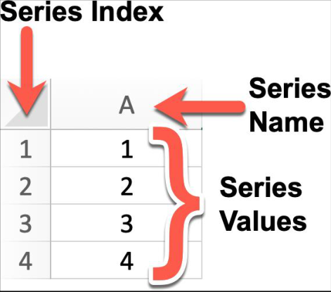


**1** ） Series 特点：

- 一维数组：Series 中的每个元素都有一个对应的索引值。

- 索引：每个数据元素都可以通过标签（索引）来访问，默认情况下索引是从 0 开 始的整数，但你也可以自定义索引。

- 数据类型：Series 可以容纳不同数据类型的元素，包括整数、浮点数、字符串、Python 对象等。

- 大小不变性：Series 的大小在创建后是不变的，但可以通过某些操作（如 append 或 delete）来改变。

- 操作：Series 支持各种操作，如数学运算、统计分析、字符串处理等。

- 缺失数据：Series 可以包含缺失数据，Pandas 使用 NaN（Not a Number）来表示缺 失或无值。

- 自动对齐：当对多个 Series 进行运算时，Pandas 会自动根据索引对齐数据，这使 得数据处理更加高效。

我们可以使用 Pandas 库来创建一个 Series 对象，并且可以为其指定索引（Index）、 名称（Name）以及值（Values）：

## **3.2.2 Series** 的创建

- **1** ）先安装 **pandas** 包，如果在 **Pycharm** 中加载不出来，可以通过如下命令安装

C:\Users\fuxiaofeng>conda activate python-2025-conda (python-2025-conda) C:\Users\fuxiaofeng>conda install pandas

**2** ）直接通过列表创建 **Series**

import pandas as pd


```python
s = pd.Series([4, 7, -5, 3])
print(s)
# 0
4
# 1
7
# 2
-5
# 3
3
# dtype: int64
```


Series 的字符串表现形式为：索引在左边，值在右边。由于我们没有为数据指定索引， 于是会自动创建一个 0 到 N-1（N 为数据的长度）的整数型索引。

- **3**）通过列表创建 **Series** 时指定索引

s = pd.Series([4, 7, -5, 3], index=["a", "b", "c", "d"]) print(s) # a 4 # b 7 # c -5 # d 3 # dtype: int64

**4** ）通过列表创建 **Series** 时指定索引和名称

s = pd.Series([4, 7, -5, 3], index=["a", "b", "c", "d"],name="hello_python") print(s) # a 4 # b 7 # c -5 # d 3 # Name: hello_python, dtype: int6

**5** ）直接通过字典创建 **Series**

dic = {"a": 4, "b": 7, "c": -5, "d": 3} s = pd.Series(dic) print(s) # a 4 # b 7 # c -5 # d 3 # dtype: int64 s1 = pd.Series(dic,index=["a","c"],name="aacc") print(s1) # a 4


```python
# c
-5
# Name: aacc, dtype: int64
```


## **3.2.3 Series** 的常用属性

|属性|说明|
|---|---|
|**index**|Series的索引对象|
|**values**|Series的值|
|**ndim**|Series的维度|
|**shape**|Series的形状|
|**size**|Series的元素个数|
|**dtype** 或**dtypes**|Series的元素类型|
|**name**|Series的名称|
|**loc[]**|显式索引，按标签索引或切片|
|**iloc[]**|隐式索引，按位置索引或切片|
|**at[]**|使用标签访问单个元素|
|**iat[]**|使用位置访问单个元素|


```python
import pandas as pd
arrs =
pd.Series([11,22,33,44,55],name="atguigu",index=["a","b","c","d","e"])
# print(arrs)
# index Series 的索引对象
print(arrs.index)
for i in arrs.index:
print(i)
# values
Series 的值
print(arrs.values)
# ndim
Series 的维度
print(arrs.ndim)
# shape Series 的形状
print(arrs.shape)
# size
Series 的元素个数
print(arrs.size)
# dtype 或dtypes
Series 的元素类型
print(arrs.dtype)
```


```python
print(arrs.dtypes)
# name
Series 的名称
print(arrs.name)
# loc[] 显式索引，按标签索引或切片
print(arrs.loc["c"])
print(arrs.loc["c":"d"])
# iloc[]
隐式索引，按位置索引或切片
print(arrs.iloc[0])
print(arrs.iloc[0:3])
# at[]
使用标签访问单个元素
print(arrs.at["a"])
# iat[] 使用位置访问单个元素
print(arrs.iat[3])
```


## **3.2.4 Series** 的常用方法

|方法|说明|
|---|---|
|**head()**|查看前n行数据，默认5行|
|**tail()**|查看后n行数据，默认5行|
|**isin()**|元素是否包含在参数集合中|
|**isna()**|元素是否为缺失值（通常为NaN或None）|
|**sum()**|求和，会忽略Series中的缺失值|
|**mean()**|平均值|
|**min()**|最小值|
|**max()**|最大值|
|**var()**|方差|
|**std()**|标准差|
|**median()**|中位数|
|**mode()**|众数（出现频率最高的值），如果有多个值出现的频率相同且<br>都是最高频率，这些值都会被包含在返回的Series中|
|**quantile(q,interpolation)**|指定位置的分位数<br>q 的取值范围是0 到1 之间的浮点数或浮点数列表，如<br>quantile(0.5)表示计算中位数（即第50 百分位数）;<br>interpolation：指定在计算分位数时，如果分位数位置不在数据|


||点上，采用的插值方法。默认值是线性插值'linear'，还有其他<br>可选值如'lower'、'higher'、'midpoint'、'nearest'等|
|---|---|
|**describe()**|常见统计信息|
|**value_count()**|每个元素的个数|
|**count()**|非缺失值元素的个数，如果要包含缺失值，用len()|
|**drop_duplicates()**|去重|
|**unique()**|去重后的数组|
|**nunique()**|去重后元素个数|
|**sample()**|随机采样|
|**sort_index()**|按索引排序|
|**sort_values()**|按值排序|
|**replace()**|用指定值代替原有值|
|**to_frame()**|将Series转换为DataFrame|
|**equals()**|判断两个Series是否相同|
|**keys()**|返回Series的索引对象|
|**corr()**|计算与另一个Series的相关系数<br>默认使用皮尔逊相关系数（Pearson correlation coefficient）来计<br>算相关性。要求参与比较的数组元素类型都是数值型。|
||当相关系数为1 时，表示两个变量完全正相关，即一个变量<br>增加，另一个变量也随之增加。|
||当相关系数为-1 时，表示两个变量完全负相关，即一个变量<br>增加，另一个变量随之减少。<br>当相关系数为0 时，表示两个变量之间不存在线性相关性。<br>例如，分析某地区的气温和冰淇淋销量之间的关系|
|**cov()**|计算与另一个Series的协方差|
|**hist()**|绘制直方图，用于展示数据的分布情况。它将数据划分为若干<br>个区间（也称为“bins”），并统计每个区间内数据的频数。<br>需要安装matplotlib包|
|**items()**|获取索引名以及值|


```python
import pandas as pd
import numpy as np
arrs =
pd.Series([11,22,np.nan,None,44,22],index=['a','b','c','d','e','f'])
# head()
查看前n 行数据，默认5 行
print(arrs.head())
# tail()
查看后n 行数据，默认5 行
print(arrs.tail(3))
# isin()
判断数组中的每一个元素是否包含在参数集合中
print(arrs.isin([11]))
# isna()
元素是否为缺失值
print(arrs.isna())
# sum() 求和，会忽略Series 中的缺失值
print(arrs.sum())
# mean()
平均值
print(arrs.mean())
# min() 最小值
print(arrs.min())
# max() 最大值
print(arrs.max())
# var() 方差
print(arrs.var())
# std() 标准差
print(arrs.std())
# print(arrs.var())
# median()
中位数
print(arrs.median())
# mode()
众数
print(arrs.mode())
# quantile()
指定位置的分位数，如quantile(0.5)
print(arrs.quantile(0.25, interpolation="midpoint"))
# describe()
常见统计信息
print(arrs.describe())
# value_counts()
每个元素的个数
print(arrs.value_counts())
# count()
非缺失值元素的个数
print(arrs.count())
```


```python
print(len(arrs))
print(len(arrs))
# drop_duplicates() 去重
这里可以看出，底层None 也作为NaN 处理
print(arrs.drop_duplicates())
# unique()
去重后的数组
print(arrs.unique())
# nunique() 去重后元素个数
print(arrs.nunique())
# sample()
随机采样
print(arrs.sample())
# sort_index()
按索引排序
print(arrs.sort_index())
# sort_values() 按值排序
print(arrs.sort_values())
# replace() 用指定值代替原有值
print(arrs.replace(22,"haha"))
# to_frame()
将Series 转换为DataFrame
print(arrs.to_frame())
# equals()
判断两个Series 是否相同
arr1 = pd.Series([1,2,3])
arr2 = pd.Series([1,2,3])
print(arr1.equals(arr2))
# keys()
返回Series 的索引对象
print(arrs.index)
print(arrs.keys())
# corr()
计算与另一个Series 的相关系数
arr3 = pd.Series([3,2,1])
arr4 = pd.Series([6,7,8])
arr5 = pd.Series([1, -1, 1, -1])
arr6 = pd.Series([1, 1, -1, -1])
print(arr1.corr(arr2))
print(arr1.corr(arr3))
print(arr1.corr(arr4))
```


print(arr5.corr(arr6)) # cov() 计算与另一个 Series 的协方差 print(arr1.corr(arr3)) # hist() 绘制直方图 arr7 = pd.Series([3,2,1,1,1,2,2]) # 绘制直方图 arr7.hist(bins=3) # items() 获取索引名以及值 for i,v in arr7.items(): print(i,v)

## **3.2.5 Series** 的布尔索引

可以使用布尔索引从 Series 中筛选满足某些条件的值。

s = pd.Series({"a": -1.2, "b": 3.5, "c": 6.8, "d": 2.9}) bools = s > s.mean() # 将大于平均值的元素标记为 True print(bools) # a False # b True # c True # d False # dtype: bool print(s[bools]) # b 3.5 # c 6.8 # dtype: float64

## **3.2.6 Series** 的运算

- **1**）**Series** 与标量运算

标量会与每个元素进行计算。


```python
s = pd.Series({"a": -1.2, "b": 3.5, "c": 6.8, "d": 2.9})
print(s * 10)
# a
-12.0
# b
35.0
# c
68.0
# d
29.0
# dtype: float64
```


**2** ） **Series** 与 **Series** 运算

会根据标签索引进行对位计算，索引没有匹配上的会用 NaN 填充。


```python
s1 = pd.Series([1, 1, 1, 1])
s2 = pd.Series([2, 2, 2, 2], index=[1, 2, 3, 4])
print(s1 + s2)
# 0
NaN
# 1
3.0
# 2
3.0
# 3
3.0
# 4
NaN
# dtype: float64
```


## **3.3 Pandas** 数据结构 **-DataFrame**

DataFrame 是 Pandas 中的另一个核心数据结构，类似于一个二维的表格或数据库中的 数据表。它是一个表格型的数据结构，它含有一组有序的列，每列可以是不同的值类型（数 值、字符串、布尔型值），既有行索引也有列索引。


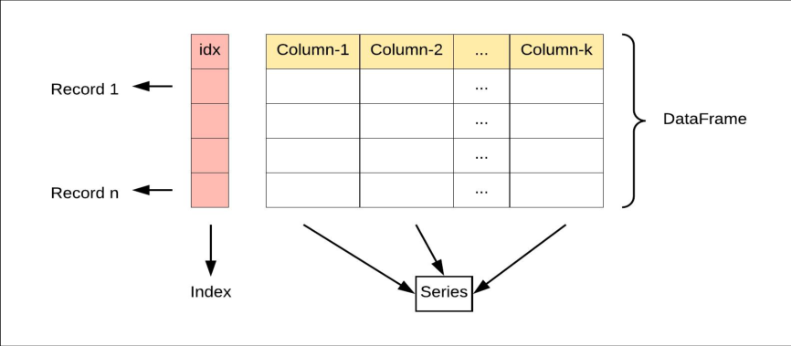


DataFrame 中的数据是以一个或多个二维块存放的（而不是列表、字典或别的一维数据 结构）。它可以被看做由 Series 组成的字典（共同用一个索引）。提供了各种功能来进行数 据访问、筛选、分割、合并、重塑、聚合以及转换等操作，广泛用于数据分析、清洗、转换、 可视化等任务。


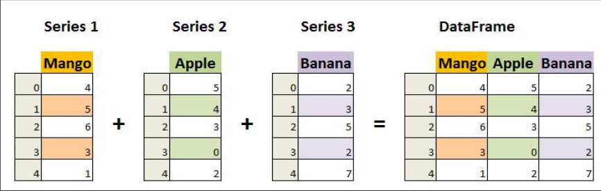


## **3.3.1 DataFrame** 的创建


- **1**）直接通过字典创建 **DataFrame**

df = pd.DataFrame({"id": [101, 102, 103], "name": ["张三", "李四", "王五 "], "age": [20, 30, 40]}) print(df) # id name age # 0 101 张三 20 # 1 102 李四 30 # 2 103 王五 40

**2** ）通过字典创建时指定列的顺序和行索引 df = pd.DataFrame(

data={"age": [20, 30, 40], "name": ["张三", "李四", "王五"]}, columns=["name", "age"], index=[101, 102, 103] ) print(df) # name age # 101 张三 20 # 102 李四 30 # 103 王五 40

## **3.3.2 DataFrame** 的常用属性

|属性|说明|
|---|---|
|**index**|DataFrame的行索引|
|**columns**|DataFrame的列标签|
|**values**|DataFrame的值|
|**ndim**|DataFrame的维度|
|**shape**|DataFrame的形状|
|**size**|DataFrame的元素个数|
|**dtypes**|DataFrame的元素类型|
|**T**|行列转置|
|**loc[]**|显式索引，按行列标签索引或切片|
|**iloc[]**|隐式索引，按行列位置索引或切片|
|**at[]**|使用行列标签访问单个元素|
|**iat[]**|使用行列位置访问单个元素|


```python
import pandas as pd
df = pd.DataFrame(data={"id": [101, 102, 103], "name": ["张三", "李四",
"王五"], "age": [20, 30, 40]},index=["aa", "bb", "cc"])
```


```python
# index DataFrame 的行索引
print(df.index)
# columns
DataFrame 的列标签
print(df.columns)
# values
DataFrame 的值
print(df.values)
# ndim
DataFrame 的维度
print(df.ndim)
# shape DataFrame 的形状
print(df.shape)
# size
DataFrame 的元素个数
print(df.size)
# dtypes
DataFrame 的元素类型
print(df.dtypes)
# T 行列转置
print(df.T)
# loc[] 显式索引，按行列标签索引或切片
print(df.loc["aa":"cc"])
print(df.loc[:,["id","name"]])
# iloc[]
隐式索引，按行列位置索引或切片
print(df.iloc[0:1])
print(df.iloc[0:3,2])
print("----------")
# at[]
使用行列标签访问单个元素
print(df.at["aa","name"])
# iat[] 使用行列位置访问单个元素
print(df.iat[0,1])
```


## **3.3.3 DataFrame** 的常用方法

|方法|说明|
|---|---|
|**head()**|查看前n行数据，默认5行|
|**tail()**|查看后n行数据，默认5行|
|**isin()**|元素是否包含在参数集合中|
|**isna()**|元素是否为缺失值|
|**sum()**|求和|
|**mean()**|平均值|


|**min()**|最小值|
|---|---|
|**max()**|最大值|
|**var()**|方差|
|**std()**|标准差|
|**median()**|中位数|
|**mode()**|众数|
|**quantile()**|指定位置的分位数，如quantile(0.5)|
|**describe()**|常见统计信息|
|**info()**|基本信息|
|**value_counts()**|每个元素的个数|
|**count()**|非空元素的个数|
|**drop_duplicates()**|去重|
|**sample()**|随机采样|
|**replace()**|用指定值代替原有值|
|**equals()**|判断两个DataFrame是否相同|
|**cummax()**|累计最大值|
|**cummin()**|累计最小值|
|**cumsum()**|累计和|
|**cumprod()**|累计积|
|**diff()**|一阶差分，对序列中的元素进行差分运算，也就是用当前元素<br>减去前一个元素得到差值，默认情况下，它会计算一阶差分，<br>即相邻元素之间的差值。参数：<br>periods：整数，默认为1。表示要向前或向后移动的周期数，<br>用于计算差值。正数表示向前移动，负数表示向后移动。<br>axis：指定计算的轴方向。0 或'index' 表示按列计算，<br>1或'columns'表示按行计算，默认值为0。|
|**sort_index()**|按行索引排序|
|**sort_values()**|按某列的值排序，可传入列表来按多列排序，并通过ascending<br>参数设置升序或降序|


|**nlargest()**|返回某列最大的n条数据|
|---|---|
|**nsmallest()**|返回某列最小的n条数据|


在 Pandas 的 DataFrame 方法里，axis 是一个非常重要的参数，它用于指定操作的方向。

axis 参数可以取两个主要的值，即 0 或 'index'，以及 1 或 'columns' ，其含义如下：

- axis=0 或 axis='index'：表示操作沿着行的方向进行，也就是对每一列的数据进行处 理。例如，当计算每列的均值时，就是对每列中的所有行数据进行计算。

- axis=1 或 axis='columns'：表示操作沿着列的方向进行，也就是对每行的数据进行处 理。例如，当计算每行的总和时，就是对每行中的所有列数据进行计算。


```python
import pandas as pd
df = pd.DataFrame(data={"id": [101, 102, 103,104,105,106,101], "name":
["张三", "李四", "王五","赵六","冯七","周八","张三"], "age": [10, 20, 30,
40, None, 60,10]},index=["aa", "bb", "cc", "dd", "ee", "ff","aa"])
# head()
查看前n 行数据，默认5 行
print(df.head())
# tail()
查看后n 行数据，默认5 行
print(df.tail())
# isin()
元素是否包含在参数集合中
print(df.isin([103,106]))
# isna()
元素是否为缺失值
print(df.isna())
# sum() 求和
print(df["age"].sum())
# mean()
平均值
print(df["age"].mean())
# min() 最小值
print(df["age"].min())
# max() 最大值
print(df["age"].max())
# var() 方差
print(df["age"].var())
# std() 标准差
print(df["age"].std())
# median()
中位数
print(df["age"].median())
# mode()
众数
print(df["age"].mode())
```


```python
# quantile()
指定位置的分位数，如quantile(0.5)
print(df["age"].quantile(0.5))
# describe()
常见统计信息
print(df.describe())
# info()
基本信息
print(df.info())
# value_counts()
每个元素的个数
print(df.value_counts())
# count()
非空元素的个数
print(df.count())
# drop_duplicates() 去重
print(df.duplicated(subset="age"))
# sample()
随机采样
print(df.sample())
# replace() 用指定值代替原有值
print("----------------")
print(df.replace(20,"haha"))
# equals()
判断两个DataFrame 是否相同
df1 = pd.DataFrame(data={"id": [101, 102, 103], "name": ["张三", "李四",
"王五"], "age": [10, 20, 30]})
df2 = pd.DataFrame(data={"id": [101, 102, 103], "name": ["张三", "李四",
"王五"], "age": [10, 20, 30]})
print(df1.equals(df2))
# cummax()
累计最大值
df3 = pd.DataFrame({'A': [2, 5, 3, 7, 4],'B': [1, 6, 2, 8, 3]})
# 按列
等价于axis=0 默认
print(df3.cummax(axis="index"))
# 按行
等价于axis=1
print(df3.cummax(axis="columns"))
# cummin()
累计最小值
print(df3.cummin())
# cumsum()
累计和
print(df3.cumsum())
# cumprod() 累计积
print(df3.cumprod())
# diff()
一阶差分
print(df3.diff())
# sort_index()
```

 按行索引排序


print(df.sort_index()) # sort_values() 按某列的值排序，可传入列表来按多列排序，并通过 ascending 参数 设置升序或降序 print(df.sort_values(by="age")) # nlargest() 返回某列最大的 n 条数据 print(df.nlargest(n=2,columns="age")) # nsmallest() 返回某列最小的 n 条数据 print(df.nsmallest(n=1,columns="age"))

## **3.3.4 DataFrame** 的布尔索引

可以使用布尔索引从 DataFrame 中筛选满足某些条件的行。

df = pd.DataFrame( data={"age": [20, 30, 40, 10], "name": ["张三", "李四", "王五", "赵六 "]}, columns=["name", "age"], index=[101, 104, 103, 102], ) print(df["age"] > 25) print(df[df["age"] > 25]) #101 False #104 True #103 True #102 False Name: age, dtype: bool # name age # 104 李四 30 # 103 王五 40

## **3.3.5 DataFrame** 的运算

**1** ） **DataFrame** 与标量运算

标量与每个元素进行计算。


```python
df = pd.DataFrame(
data={"age": [20, 30, 40, 10], "name": ["张三", "李四", "王五", "赵六
"]},
columns=["name", "age"],
index=[101, 104, 103, 102],
)
print(df * 2)
#
name
age
# 101
张三张三
40
# 104
李四李四
60
```


103 王五王五 80 # 102 赵六赵六 20

**2** ） **DataFrame** 与 **DataFrame** 运算

根据标签索引进行对位计算，索引没有匹配上的用 NaN 填充。

df1 = pd.DataFrame( data={"age": [10, 20, 30, 40], "name": ["张三", "李四", "王五", "赵六 "]}, columns=["name", "age"], index=[101, 102, 103, 104], ) df2 = pd.DataFrame( data={"age": [10, 20, 30, 40], "name": ["张三", "李四", "王五", "田七 "]}, columns=["name", "age"], index=[102, 103, 104, 105], ) print(df1 + df2) # name age # 101 NaN NaN # 102 李四张三 30.0 # 103 王五李四 50.0 # 104 赵六王五 70.0 # 105 NaN NaN

## **3.3.6 DataFrame** 的更改操作

**1** ）设置行索引

创建 DataFrame 时如果不指定行索引，pandas 会自动添加从 0 开始的索引。


```python
df = pd.DataFrame({"age": [20, 30, 40, 10], "name": ["张三", "李四", "王
五", "赵六"], "id": [101, 102, 103, 104]})
print(df)
#
age name
id
# 0
20
张三
101
# 1
30
李四
102
# 2
40
王五
103
# 3
10
赵六
104
（1）通过set_index()设置行索引
df.set_index("id", inplace=True)
# 设置行索引
print(df)
#
age name
# id
# 101
20
张三
# 102
30
```

 李四


```python
# 103
40
王五
# 104
10
赵六
（2）通过reset_index()重置行索引
df.reset_index(inplace=True)
# 重置索引
print(df)
#
id
age name
# 0
101
20
张三
# 1
102
30
李四
# 2
103
40
王五
# 3
104
10
```

 赵六

**2** ）修改行索引名和列名

（1）通过 rename()修改行索引名和列名


```python
df = pd.DataFrame({"age": [20, 30, 40, 10], "name": ["张三", "李四", "王
五", "赵六"], "id": [101, 102, 103, 104]})
df.set_index("id", inplace=True)
print(df)
#
age name
# id
# 101
20
张三
# 102
30
李四
# 103
40
王五
# 104
10
赵六
df.rename(index={101: "一", 102: "二", 103: "三", 104: "四"},
columns={"age": "年龄", "name": "姓名"}, inplace=True)
print(df)
#
年龄
姓名
# id
# 一
20
张三
# 二
30
李四
# 三
40
王五
# 四
10
赵六
（2）将index 和columns 重新赋值
df.index = ["Ⅰ", "Ⅱ", "Ⅲ", "Ⅳ"]
df.columns = ["年齡", "名稱"]
print(df)
#
年齡
名稱
# Ⅰ
20
张三
# Ⅱ
30
李四
# Ⅲ
40
王五
# Ⅳ
10
```

 赵六

**3** ）添加列


通过 df[“列名”] 添加列。

|d|f["ph|one"|] = ["13|333333333", "14444444444", "15555555555",|
|---|---|---|---|---|
|"<br>p|16666<br>rint(|6666<br>df)|66"]||
|#||age|name|phone|
|#|id||||
|#|101|20|张三|13333333333|
|#|102|30|李四|14444444444|
|#|103|40|王五|15555555555|
|#|104|10|赵六|16666666666|


- **4**）删除列

（1）通过 df.drop(“列名”, axis=1) 删除，也可是删除行 axis=0

df.drop("phone", axis=1, inplace=True) # 删除 phone，按列删除， inplace=True 表示直接在原对象上修改 print(df) # age name # id # 101 20 张三 # 102 30 李四 # 103 40 王五 # 104 10 赵六

（2）通过 del df[“列名”] 删除

del df["phone"] print(df) # age name # id # 101 20 张三 # 102 30 李四 # 103 40 王五 # 104 10 赵六

- **5**）插入列

通过 insert(loc, column, value) 插入。该方法没有 inplace 参数，直接在原数据上修改。

|d|f.ins|ert(loc|=0,|column="phone", value=df["age"] * df.index)|
|---|---|---|---|---|
|p|rint(|df)|||
|#||phone|age|name|
|#|id||||
|#|101|2020|20|张三|
|#|102|3060|30|李四|
|#|103|4120|40|王五|
|#|104|1040|10|赵六|


## **3.3.7 DataFrame** 数据的导入与导出

- **1**）导出数据

|方法|说明|
|---|---|
|**to_csv()**|将数据保存为csv格式文件，数据之间以逗号分隔，可通过sep<br>参数设置使用其他分隔符，可通过index参数设置是否保存行<br>标签，可通过header参数设置是否保存列标签。|
|**to_pickle()**|如要保存的对象是计算的中间结果，或者保存的对象以后会<br>在Python中复用，可把对象保存为.pickle文件。如果保存成<br>pickle文件，只能在python中使用。文件的扩展名可以<br>是.p、.pkl、.pickle。|
|**to_excel()**|保存为Excel文件，需安装openpyxl包。|
|**to_clipboard()**|保存到剪切板。|
|**to_dict()**|保存为字典。|
|**to_hdf()**|保存为HDF格式，需安装tables包。|
|**to_html()**|保存为HTML格式，需安装lxml、html5lib、beautifulsoup4包。|
|**to_json()**|保存为JSON格式。|
|**to_feather()**|feather是一种文件格式，用于存储二进制对象。feather对象也<br>可以加载到R语言中使用。feather格式的主要优点是在Python<br>和R语言之间的读写速度要比csv文件快。feather数据格式通<br>常只用中间数据格式，用于Python和R之间传递数据，一般<br>不用做保存最终数据。需安装pyarrow包。|
|**to_sql()**|保存到数据库。|


```python
import os
import pandas as pd
os.makedirs("data", exist_ok=True)
df = pd.DataFrame({"age": [20, 30, 40, 10], "name": ["张三", "李四", "王
五", "赵六"], "id": [101, 102, 103, 104]})
df.set_index("id", inplace=True)
df.to_csv("data/df.csv")
df.to_csv("data/df.tsv", sep="\t")
# 设置分隔符为\t
```


```python
df.to_csv("data/df_noindex.csv", index=False)
# index=False 不保存行索引
df.to_pickle("data/df.pkl")
df.to_excel("data/df.xlsx")
df.to_clipboard()
df_dict = df.to_dict()
df.to_hdf("data/df.h5", key="df")
df.to_html("data/df.html")
df.to_json("data/df.json")
df.to_feather("data/df.feather")
```


- **2**）导入数据

|方法|说明|
|---|---|
|**read_csv()**|加载csv 格式的数据。可通过sep 参数指定分隔符，可通过|
||index_col参数指定行索引。|
|**read_pickle()**|加载pickle格式的数据。|
|**read_excel()**|加载Excel格式的数据。|
|**read_clipboard()**|加载剪切板中的数据。|
|**read_hdf()**|加载HDF格式的数据。|
|**read_html()**|加载HTML格式的数据。|
|**read_json()**|加载JSON格式的数据。|
|**read_feather()**|加载feather格式的数据。|
|**read_sql()**|加载数据库中的数据。|


```python
df_csv = pd.read_csv("data/df.csv", index_col="id")
# 指定行索引
df_tsv = pd.read_csv("data/df.tsv", sep="\t")
# 指定分隔符
df_pkl = pd.read_pickle("data/df.pkl")
df_excel = pd.read_excel("data/df.xlsx", index_col="id")
df_clipboard = pd.read_clipboard(index_col="id")
df_from_dict = pd.DataFrame(df_dict)
df_hdf = pd.read_hdf("data/df.h5", key="df")
df_html = pd.read_html("data/df.html", index_col=0)[0]
df_json = pd.read_json("data/df.json")
df_feather = pd.read_feather("data/df.feather")
print(df_csv)
print(df_tsv)
print(df_pkl)
print(df_excel)
print(df_clipboard)
print(df_from_dict)
```


```python
print(df_hdf)
print(df_html)
print(df_json)
print(df_feather)
```


## **3.4 Pandas** 日期数据处理初识

## **3.4.1 to_datetime()** 进行日期格式转换

- **1**）参数说明

|参数名|说明|
|---|---|
|**arg**|要转换为日期时间的对象|
|**errors**|ignore,raise,coerce, 默认为ignore,表示无效<br>的解析将会返回原值|
|**dayfirst**|指定日期解析顺序。如果为True，则以日期<br>开头解析日期，例如：“10/11/12”解析为<br>2012-11-10。默认false|
|**yearfirst**|如果为True，则以日期开头解析，例如：<br>“10/11/12”解析为2010-11-12。如果dayfirst<br>和yearfirst都为True，则yearfirst在前面。<br>默认false。当日期字符串格式不明确时，指<br>定年份是否在最前面。当日期字符串<br>是'2010/1/4'这种形式，由于年份是4 位数<br>字，pandas能很清晰地识别出这是年份，所<br>以即使yearfirst为False，也不会影响其正确<br>解析|
|**utc**|返回utc，即协调世界时间|
|**format**|格式化显示时间的格式，字符串，默认值为<br>None|
|**exact**|要求格式完全匹配|
|**unit**|参数的单位表示时间的单位|
|**infer_datetime_format**|如果为True且未给出格式，则尝试基于第<br>一个非nan 元素推断datetime 字符串的格<br>式，如果可以推断，则切换到更快的解析方<br>法。在某些情况下，这可以将解析速度提高<br>5-10倍。|
|**origin**|默认值为unix,定义参考日期1970-01-01|
|**cache**|使用唯一的已转换日期缓存来应用日期时<br>间转换。在解析重复日期字符串时产生显著<br>的加速。|


**2** ）将字符串字段转换为日期类型

`import pandas as pd`


df = pd.DataFrame({"gmv":[100,200,300,400],"trade_date":["2025-0106","2023-10-31","2023-12-31","2023-01-05"]}) df["ymd"] = pd.to_datetime(df["trade_date"]) print(df)

## **3.4.2** 时间属性访问器对象 **Series.dt,** 获取日期数据的年月日星期

**1** ）获取年月日

df['yy'],df['mm'],df['dd']=df['ymd'].dt.year,df['ymd'].dt.month,df['ymd '].dt.day print(df)

**2** ）获取星期

df['week']=df['ymd'].dt.day_name() print(df)

**3** ）获取日期所在季度

df['quarter']=df['ymd'].dt.quarter print(df)

**4** ）判断日期是否月底年底

df['mend']=df['ymd'].dt.is_month_end df['yend']=df['ymd'].dt.is_year_end print(df)

## **3.4.3 to_period()** 获取统计周期

**freq** ： 这是 to_period() 方法最重要的参数，用于指定要转换的时间周期频率

常见的取值如下：

- "D"：按天周期，例如 2024-01-01 会转换为 2024-01-01 这个天的周期。

- "W"：按周周期，通常以周日作为一周的结束，比如日期落在某一周内，就会转换 为该周的周期表示。

- "M"：按月周期，像 2024-05-15 会转换为 2024-05。

- "Q"：按季度周期，一年分为四个季度，日期会转换到对应的季度周期，例如 2024Q2 。

- "A" 或 "Y"：按年周期，如 2024-07-20 会转换为 2024 。


```python
df["ystat"] = df["ymd"].dt.to_period("Y")
df["mstat"] = df["ymd"].dt.to_period("M")
df["qstat"] = df["ymd"].dt.to_period("Q")
df["wstat"] = df["ymd"].dt.to_period("W")
print(df)
```


## **3.5 DataFrame** 数据分析入门

## **3.5.1** 加载数据集

使用 weather（天气）数据集。其中包含 6 个字段：

- date：日期，年-月-日格式。

- precipitation：降水量。

- temp_max：最高温度。

- temp_min：最低温度。

- wind：风力。

- weather：天气状况。


```python
import pandas as pd
df = pd.read_csv("data/weather.csv")
print(type(df))
# 查看df 类型
print(df.shape)
# 查看df 形状
print(df.columns)
# 查看df 的列名
print(df.dtypes)
# 查看df 各列数据类型
df.info()
# 查看df 基本信息
```


pandas 与 Python 常用数据类型对照：

|**pandas** 类型|**Python** 类型|说明|
|---|---|---|
|**object**|string|字符串类型|
|**int64**|int|整型|
|**float64**|float|浮点型|
|**datetime64**|datetime|日期时间类型|


## **3.5.2** 查看部分数据

**1** ）通过 **head()** 、 **tail()** 获取前 **n** 行或后 **n** 行

print(df.head()) print(df.tail(10))

**2** ）获取一列或多列数据

- （1）加载一列数据

df_date_series = df["date"] # 返回的是 Series df_date_dataframe = df[["date"]] # 返回的是 DataFrame

- （2）加载多列数据


`df[["date", "temp_max", "temp_min"]]` # 获取多列数据

**3** ）按行获取数据

（1） **loc** ： 通过行标签获取数据

df.loc[1] # 获取行标签为 1 的数据 df.loc[[1, 10, 100]] # 获取行标签分别为 1、10、100 的数据 （2） **iloc** ： 通过行位置获取数据 df.iloc[0] # 获取行位置为 0 的数据 df.iloc[-1] # 获取行位置为最后一位的数据

**4** ）获取指定行与列的数据

df.loc[1, "precipitation"] # 获取行标签为 1，列标签为 precipitation 的数据 df.loc[:, "precipitation"] # 获取所有行，列标签为 precipitation 的数据 df.iloc[:, [3, 5, -1]] # 获取所有行，列位置为 3，5，最后一位的数据 df.iloc[:10, 2:6] # 获取前 10 行，列位置为 2、3、4、5 的数据 df.loc[:10, ["date", "precipitation", "temp_max", "temp_min"]] # 通过行 列标签获取数据

## **3.5.3** 分组聚合计算


```python
df.groupby("分组字段")["要聚合的字段"].聚合函数()
df.groupby(["分组字段", "分组字段2", ...])[["要聚合的字段", "要聚合的字段
2", ...]].聚合函数()
（1）将数据按月分组，并统计最大温度和最小温度的平均值
df["month"] =
pd.to_datetime(df["date"]).dt.to_period("M").astype(str)
# 将date 转换
为年-月的格式
df_groupby_date = df.groupby("month")
# 按month 分组，返回一个分组对象
(DataFrameGroupBy)
month_temp = df_groupby_date[["temp_max", "temp_min"]]
# 从分组对象中选
择特定的列
month_temp_mean = month_temp.mean()
# 对每个列求平均值
# 以上代码可以写在一起
month_temp_mean = df.groupby("month")[["temp_max", "temp_min"]].mean()
#
temp_max
temp_min
# month
# 2012-01
7.054839
1.541935
# 2012-02
9.275862
3.203448
# 2012-03
9.554839
2.838710
# 2012-04
14.873333
5.993333
# 2012-05
17.661290
8.190323
```


分组后默认会将分组字段作为行索引。如果分组字段有多个，得到的是复合索引。


（2）分组频数计算

统计每个月不同天气状况的数量。


```python
df.groupby("month")["weather"].nunique()
# date
# 2012-01
4
# 2012-02
4
# 2012-03
4
# 2012-04
4
# 2012-05
3
```


## **3.5.4** 基本绘图

**plot()** ： pandas 提供的绘图方法，它基于 matplotlib 库。将前面计算得到的均值结果绘制 成图表，默认情况下会绘制折线图，其中 "month" 作为 x 轴，"temp_max" 和 "temp_min" 的 均值作为 y 轴。


```python
df.groupby("month")[["temp_max", "temp_min"]].mean().plot()
# 使用plot
```

 绘制折线图


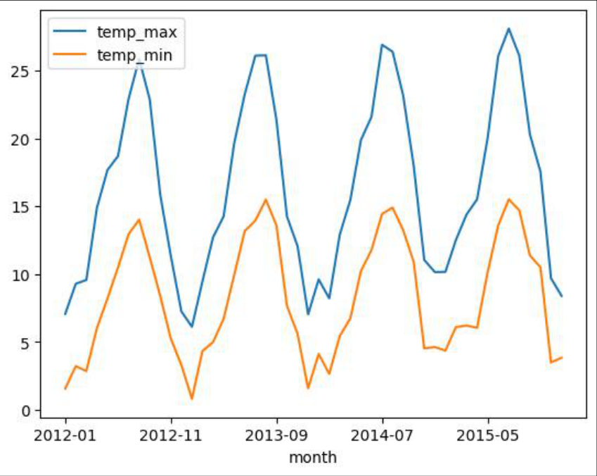


## **3.5.5** 常用统计值

可通过 describe()查看常用统计信息。 `df.describe()` # 查看常用统计信息


```python
df.describe().T
# 行列转置
可通过include 参数指定要统计哪些数据类型的列。
df.describe(include="all")
# 统计所有列
df.describe(include=["float64"])
# 只统计数据类型为float64 的列
```


## **3.5.6** 常用排序方法

**nlargest(n, [** 列名 **1,** 列名 **2, …])** ： 按列排序的最大 n 个

**nsmallest(n, [** 列名 **1,** 列名 **2, …])** ： 按列排序的最小 n 个

**sort_values([** 列名 **1,** 列名 **2, …], asceding=[True, False, …])** ： 按列升序或降序排序

**drop_duplicates(subset=[** 列名 **1,** 列名 **2])** ： 按列去重

（1）找到最高温度最大的 30 天

通过 nlargest()找出 temp_max 最大的 30 条数据。

df = pd.read_csv("data/weather.csv") df.nlargest(30, "temp_max")

（2）从最高温度最大的 30 天中找出最低温度最小的 5 天

通过 nlargest()找出 temp_min 最小的 5 条数据。

df.nlargest(30, "temp_max").nsmallest(5, "temp_min")

（3）找出每年的最高温度

df["year"] = pd.to_datetime(df["date"]).dt.to_period("Y").astype(str) # 将 date 转换为年格式

df_sort = df.sort_values(["year", "temp_max"], ascending=[True,

|F|alse])|# 按year升序，temp_max降序排序|||||
|---|---|---|---|---|---|---|
|d|f_sort|.drop_duplicates(subset="year")<br># 按|year去重||||
|#||date<br>precipitation<br>temp_max|temp_min|wind|weather|year|
|#|228|2012-08-16<br>0.0<br>34.4|18.3|2.8|sun|2012|
|#|546|2013-06-30<br>0.0<br>33.9|17.2|2.5|sun|2013|
|#|953|2014-08-11<br>0.5<br>35.6|17.8|2.6|rain|2014|
|#|1295|2015-07-19<br>0.0<br>35.0|17.2|3.3|sun|2015|


## **3.5.7** 案例：简单数据分析练习

使用 employees（员工）数据集，其中包含 10 个字段：

- employee_id：员工 id。

- first_name：员工名称。

- last_name：员工姓氏。

- email：员工邮箱。

- phone_number：员工电话号码。


- job_id：员工工种。

- salary：员工薪资。

- commission_pct：员工佣金比例。

- manager_id：员工领导的 id。

- department_id：员工的部门 id。

- **1**）加载数据

import pandas as pd

df = pd.read_csv("data/employees.csv") # 加载员工数据

- **2**）查看数据

print(df.head()) # 查看前 5 行 df.info() # 查看数据信息 print(df.describe()) # 查看统计信息 print(df.shape) # 查看数据形状

- **3**）找出薪资最低、最高的员工

print(df[df["salary"] == df["salary"].min()]) # 找出最低薪资的员工 print(df.loc[df["salary"] == df["salary"].min()]) # 找出最低薪资的员工 print(df.loc[df["salary"] == df["salary"].max()]) # 找出最高薪资的员工 print(df.sort_values("salary").head(1)) # 使用排序的方法找出最低薪资的员工 print(df.sort_values("salary", ascending=False).head(1)) # 使用排序的方 法找出最高薪资的员工

- **4**）找出薪资最高的 **10** 名员工

print(df.nlargest(10, "salary")) # 薪资最高的 10 名员工

**5** ）查看所有部门 **id**

print(df["department_id"].unique()) # 所有部门 id

**6** ）查看每个部门的员工数

print(df.groupby("department_id")["employee_id"].count().rename("employ ee_count")) # 查看每个部门的员工数

- **7**）绘图

df.groupby("department_id")["employee_id"].count().rename("employee_cou nt").plot(kind="bar")


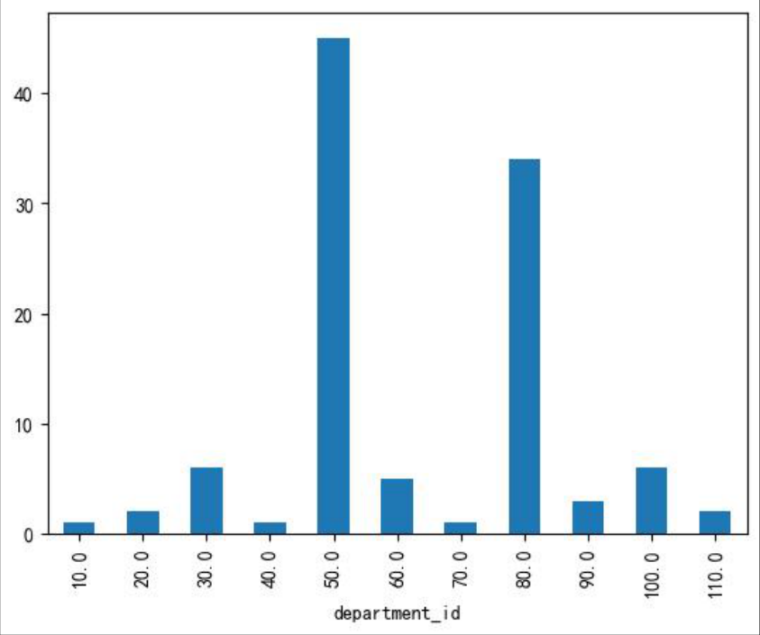


- **8**）薪资的分布

print(df["salary"].mean()) # 平均值 print(df["salary"].std()) # 标准差 print(df["salary"].median()) # 中位数

**9** ）找出平均薪资最高的部门 **id**

print(df.groupby("department_id")["salary"].mean().nlargest(1)) # 平均 薪资最高的部门

## **3.6 Padas** 的数据组合函数

## **3.6.1 concat** 连接

沿着一条轴将多个对象堆叠到一起，可通过 axis 参数设置沿哪一条轴连接。

**1** ） **Series** 与 **Series** 连接


```python
s1 = pd.Series(["A", "B"], index=[1, 2])
s2 = pd.Series(["D", "E"], index=[4, 5])
s3 = pd.Series(["G", "H"], index=[7, 8])
pd.concat([s1, s2, s3])
# 按行连接
# 1
A
# 2
B
```


4 D # 5 E # 7 G # 8 H # dtype: object pd.concat([s1, s2, s3], axis=1) # 按列连接 # 0 1 2 # 1 A NaN NaN # 2 B NaN NaN # 4 NaN D NaN # 5 NaN E NaN # 7 NaN NaN G # 8 NaN NaN H

缺失值会用 NaN 填充。

- **2**）**DataFrame** 与 **Series** 连接

df1 = pd.DataFrame(data={"a": [1, 2], "b": [4, 5]}, index=[1, 2]) s1 = pd.Series(data=[7, 10], index=[1, 2], name="a") pd.concat([df1, s1]) # 按行连接 # a b # 1 1 4.0 # 2 2 5.0 # 1 7 NaN # 2 10 NaN pd.concat([df1, s1], axis=1) # 按列连接 # a b a # 1 1 4 7 # 2 2 5 10

- **3**）**DataFrame** 与 **DataFrame** 连接

df1 = pd.DataFrame(data={"a": [1, 2], "b": [4, 5]}, index=[1, 2]) df2 = pd.DataFrame(data={"a": [7, 8], "b": [10, 11]}, index=[1, 2]) pd.concat([df1, df2]) # 按行连接 # a b # 1 1 4 # 2 2 5 # 1 7 10 # 2 8 11 pd.concat([df1, df2], axis=1) # 按列连接 # a b a b 更多 Java –大数据 –前端 –python 人工智能资料下载，可百度访问：尚硅谷官网


1 1 4 7 10 # 2 2 5 8 11

- **4**）重置索引

可通过 ignore_index=True 来重置索引。

df1 = pd.DataFrame(data={"a": [1, 2], "b": [4, 5]}, index=[1, 2]) df2 = pd.DataFrame(data={"a": [7, 8], "b": [10, 11]}, index=[1, 2]) pd.concat([df1, df2], ignore_index=True) # 重置索引 # a b # 0 1 4 # 1 2 5 # 2 7 10 # 3 8 11

- **5**）类似 **join** 的连接

默认的合并方式是对其他轴进行并集合并（join=outer），可以用 join=inner 实现其他轴

上的交集合并。


```python
df1 = pd.DataFrame(data={"a": [1, 2], "b": [4, 5]}, index=[1, 2])
df2 = pd.DataFrame(data={"b": [7, 8], "c": [10, 11]}, index=[2, 3])
pd.concat([df1, df2])
#
a
b
c
# 1
1.0
4
NaN
# 2
2.0
5
NaN
# 2
NaN
7
10.0
# 3
NaN
8
11.0
pd.concat([df1, df2], join="inner")
#
b
# 1
4
# 2
5
# 2
7
# 3
8
```


## **3.6.2 merge** 合并

通过一个或多个列将行连接。

- **1**）数据连接的类型

merge()实现了三种数据连接的类型：一对一、多对一和多对多。

（1）一对一连接

`df1 = pd.DataFrame(`


```python
{"employee": ["Bob", "Jake", "Lisa", "Sue"], "group": ["Accounting",
"Engineering", "Engineering", "HR"]}
)
df2 = pd.DataFrame({"employee": ["Lisa", "Bob", "Jake", "Sue"],
"hire_date": [2004, 2008, 2012, 2014]})
print(df1)
#
employee
group
# 0
Bob
Accounting
# 1
Jake
Engineering
# 2
Lisa
Engineering
# 3
Sue
HR
print(df2)
#
employee
hire_date
# 0
Lisa
2004
# 1
Bob
2008
# 2
Jake
2012
# 3
Sue
2014
# 通过相同的字段名employee 进行关联的
df3 = pd.merge(df1, df2)
print(df3)
#
employee
group
hire_date
# 0
Bob
Accounting
2008
# 1
Jake
Engineering
2012
# 2
Lisa
Engineering
2004
# 3
Sue
HR
2014
```


（2）多对一连接

在需要连接的两个列中，有一列的值有重复。通过多对一连接获得的结果将会保留重复 值。


```python
df1 = pd.DataFrame(
{"employee": ["Bob", "Jake", "Lisa", "Sue"], "group": ["Accounting",
"Engineering", "Engineering", "HR"]}
)
df2 = pd.DataFrame({"group": ["Accounting", "Engineering", "HR"],
"supervisor": ["Carly", "Guido", "Steve"]})
print(df1)
#
employee
group
# 0
Bob
Accounting
# 1
Jake
Engineering
# 2
Lisa
Engineering
# 3
Sue
HR
print(df2)
#
group supervisor
# 0
Accounting
Carly
```


```python
# 1
Engineering
Guido
# 2
HR
Steve
df3 = pd.merge(df1, df2)
print(df3)
#
employee
group supervisor
# 0
Bob
Accounting
Carly
# 1
Jake
Engineering
Guido
# 2
Lisa
Engineering
Guido
# 3
Sue
HR
Steve
```


在 supervisor 列中有些值会因为输入数据的对应关系而有所重复。

（3）多对多连接

如果左右两个输入的共同列都包含重复值，那么合并的结果就是一种多对多连接。


```python
df1 = pd.DataFrame(
{"employee": ["Bob", "Jake", "Lisa", "Sue"], "group": ["Accounting",
"Engineering", "Engineering", "HR"]}
)
df2 = pd.DataFrame(
{
"group": ["Accounting", "Accounting", "Engineering",
"Engineering", "HR", "HR"],
"skills": ["math", "spreadsheets", "coding", "linux",
"spreadsheets", "organization"],
}
)
print(df1)
#
employee
group
# 0
Bob
Accounting
# 1
Jake
Engineering
# 2
Lisa
Engineering
# 3
Sue
HR
print(df2)
#
group
skills
# 0
Accounting
math
# 1
Accounting
spreadsheets
# 2
Engineering
coding
# 3
Engineering
linux
# 4
HR
spreadsheets
# 5
HR
organization
df3 = pd.merge(df1, df2)
print(df3)
#
employee
group
skills
# 0
Bob
Accounting
math
# 1
Bob
Accounting
spreadsheets
```


|# 2|Jake|Engineering|coding|
|---|---|---|---|
|# 3|Jake|Engineering|linux|
|# 4|Lisa|Engineering|coding|
|# 5|Lisa|Engineering|linux|
|# 6|Sue|HR|spreadsheets|
|# 7|Sue|HR|organization|


多对多连接产生的是行的笛卡尔积。由于左边有 2 个 Engineering，右边有 2 个 Engineering，

所以最终结果有 4 个 Engineering。

- **2**）设置合并的键与索引

merge()会将两个输入的一个或多个共同列作为键进行合并。但由于两个输入要合并的

列通常都不是同名的，因此 merge()提供了一些参数处理这个问题。

（1）通过 on 指定使用某个列连接，只能在有共同列名的时候使用


```python
df1 = pd.DataFrame(
{"employee": ["Bob", "Jake", "Lisa", "Sue"], "group": ["Accounting",
"Engineering", "Engineering", "HR"]}
)
df2 = pd.DataFrame({"employee": ["Lisa", "Bob", "Jake", "Sue"],
"hire_date": [2004, 2008, 2012, 2014]})
print(df1)
#
employee
group
# 0
Bob
Accounting
# 1
Jake
Engineering
# 2
Lisa
Engineering
# 3
Sue
HR
print(df2)
#
employee
hire_date
# 0
Lisa
2004
# 1
Bob
2008
# 2
Jake
2012
# 3
Sue
2014
df3 = pd.merge(df1, df2, on="employee")
print(df3)
#
employee
group
hire_date
# 0
Bob
Accounting
2008
# 1
Jake
Engineering
2012
# 2
Lisa
Engineering
2004
# 3
Sue
HR
2014
（2）两对象列名不同，通过left_on 和right_on 分别指定列名
df1 = pd.DataFrame(
{"employee": ["Bob", "Jake", "Lisa", "Sue"], "group": ["Accounting",
"Engineering", "Engineering", "HR"]}
```


```python
)
df2 = pd.DataFrame({"name": ["Bob", "Jake", "Lisa", "Sue"], "salary":
[70000, 80000, 120000, 90000]})
print(df1)
#
employee
group
# 0
Bob
Accounting
# 1
Jake
Engineering
# 2
Lisa
Engineering
# 3
Sue
HR
print(df2)
#
name
salary
# 0
Bob
70000
# 1
Jake
80000
# 2
Lisa
120000
# 3
Sue
90000
df3 = pd.merge(df1, df2, left_on="employee", right_on="name")
print(df3)
#
employee
group
name
salary
# 0
Bob
Accounting
Bob
70000
# 1
Jake
Engineering
Jake
80000
# 2
Lisa
Engineering
Lisa
120000
# 3
Sue
HR
Sue
90000
（3）通过left_index 和right_index 设置合并的索引
通过设置merge()中的left_index、right_index 参数将索引设置为键来实现合并。
df1 = pd.DataFrame(
{"employee": ["Bob", "Jake", "Lisa", "Sue"], "group": ["Accounting",
"Engineering", "Engineering", "HR"]}
)
df2 = pd.DataFrame({"employee": ["Lisa", "Bob", "Jake", "Sue"],
"hire_date": [2004, 2008, 2012, 2014]})
df1.set_index("employee", inplace=True)
df2.set_index("employee", inplace=True)
print(df1)
#
group
# employee
# Bob
Accounting
# Jake
Engineering
# Lisa
Engineering
# Sue
HR
print(df2)
#
hire_date
# employee
# Lisa
2004
```


|#|Bob<br>2008|
|---|---|
|#|Jake<br>2012|
|#|Sue<br>2014|
|#|设置索引后，如果不指定关联列会报错，建议通过以下方式指定，on="employee"也可|
|#|以实现，但是不同的解释器可能效果不一样，因为设置索引后，employee就不算是列了|
|d|f3 = pd.merge(df1, df2, left_index=True, right_index=True)|
|#|group<br>hire_date|
|#|employee|
|#|Bob<br>Accounting<br>2008|
|#|Jake<br>Engineering<br>2012|
|#|Lisa<br>Engineering<br>2004|
|#|Sue<br>HR<br>2014|


DataFrame 实现了 join()方法，可以按照索引进行数据合并。但要求没有重叠的列，或通 过 lsuffix、rsuffix 指定重叠列的后缀。

import pandas as pd df1 = pd.DataFrame({ 'key': ['A', 'B', 'C'], 'value1': [1, 2, 3] }) df2 = pd.DataFrame({ 'key': ['B', 'C', 'D'], 'value2': [4, 5, 6] })

合并两个 DataFrame，并处理列名冲突 df1.join(df2,lsuffix='_left',rsuffix='_right')

- **3**）设置数据连接的集合操作规则

当一个值出现在一列，却没有出现在另一列时，就需要考虑集合操作规则了。

df1 = pd.DataFrame({"name": ["Peter", "Paul", "Mary"], "food": ["fish", "beans", "bread"]}, columns=["name", "food"]) df2 = pd.DataFrame({"name": ["Mary", "Joseph"], "drink": ["wine", "beer"]}, columns=["name", "drink"]) print(df1) # name food # 0 Peter fish # 1 Paul beans # 2 Mary bread print(df2)


```python
#
name drink
# 0
Mary
wine
# 1
Joseph
beer
print(pd.merge(df1, df2))
#
name
food drink
# 0
Mary
bread
wine
```


合并两个数据集，在 name 列中只有一个共同的值 Mary。默认情况下，结果中只会包含 两个输入集合的交集，这种连接方式被称为内连接（inner join）。

我们可以通过 how 参数设置连接方式，默认值为 inner。how 参数支持的数据连接方式 还有 outer、left 和 right。外连接（outer join）返回两个输入列的并集，所有缺失值都用 NaN 填充。

print(pd.merge(df1, df2, how="outer"))

|#||name|food|drink|
|---|---|---|---|---|
|#|0|Joseph|NaN|beer|
|#|1|Mary|bread|wine|
|#|2|Paul|beans|NaN|
|#|3|Peter|fish|NaN|


左连接（left join）和右连接（right join）返回的结果分别只包含左列和右列。

print(pd.merge(df1, df2, how="left"))

|#||name|food|drink|
|---|---|---|---|---|
|#|0|Peter|fish|NaN|
|#|1|Paul|beans|NaN|
|#|2|Mary|bread|wine|


- **4**）重复列名的处理

可能会遇到两个输入 DataFrame 有重名列的情况，merge()会自动为其增加后缀_x 和_y，

也可以通过 suffixes 参数自定义后缀名。


```python
df1 = pd.DataFrame({"name": ["Bob", "Jake", "Lisa", "Sue"], "rank": [1,
2, 3, 4]})
df2 = pd.DataFrame({"name": ["Bob", "Jake", "Lisa", "Sue"], "rank": [3,
1, 4, 2]})
print(df1)
#
name
rank
# 0
Bob
1
# 1
Jake
2
# 2
Lisa
3
# 3
Sue
4
print(df2)
#
name
rank
# 0
Bob
3
# 1
Jake
1
```


|# 2|Lisa|4||
|---|---|---|---|
|# 3|Sue|2||
|prin|t(pd.m|erge(df1,|df2, on="name"))<br># 不指定后缀名，默认为_x和_y|
|#|name|rank_x<br>r|ank_y|
|# 0|Bob|1|3|
|# 1|Jake|2|1|
|# 2|Lisa|3|4|
|# 3|Sue|4|2|
|prin|t(pd.m|erge(df1,|df2, on="name", suffixes=("_df1", "_df2")))<br># 通过|
|suff|ixes指|定后缀名||
|#|name|rank_df1|rank_df2|
|# 0|Bob|1|3|
|# 1|Jake|2|1|
|# 2|Lisa|3|4|
|# 3|Sue|4|2|


## **3.7 Padas** 的缺失值处理函数

## **3.7.1 pandas** 中的缺失值

pandas 使用浮点值 NaN（Not a Number）表示缺失数据，使用 NA（NotAvailable）表示 缺失值。可以通过 isnull()、isna()或 notnull()、notna()方法判断某个值是否为缺失值。

Nan 通常表示一个无效的或未定义的数字值，是浮点数的一种特殊取值，用于表示那些 不能表示为正常数字的情况，如 0/0、∞-∞等数学运算的结果。nan 与任何值（包括它自身） 进行比较的结果都为 False。例如在 Python 中，nan == nan 返回 False。

NA 一般用于表示数据不可用或缺失的情况，它的含义更侧重于数据在某种上下文中是 缺失或不存在的，不一定特指数字类型的缺失。

na 和 nan 都用于表示缺失值，但 nan 更强调是数值计算中的特殊值，而 na 更强调数据

的可用性或存在性。


```python
s = pd.Series([np.nan, None, pd.NA])
print(s)
# 0
NaN
# 1
None
# 2
<NA>
# dtype: object
print(s.isnull())
# 0
True
# 1
True
# 2
True
# dtype: bool
```


## **3.7.2** 加载数据中包含缺失值

df = pd.read_csv("data/weather_withna.csv")

print(df.tail(5))

|#|date|precipitation|temp_max|temp_min|wind|weather|
|---|---|---|---|---|---|---|
|# 1456|2015-12-27|NaN|NaN|NaN|NaN|NaN|
|# 1457|2015-12-28|NaN|NaN|NaN|NaN|NaN|
|# 1458|2015-12-29|NaN|NaN|NaN|NaN|NaN|
|# 1459|2015-12-30|NaN|NaN|NaN|NaN|NaN|
|# 1460|2015-12-31|20.6|12.2|5.0|3.8|rain|


可以通过 keep_default_na 参数设置是否将空白值设置为缺失值。

df = pd.read_csv("data/weather_withna.csv", keep_default_na=False)

print(df.tail(5))

date precipitation temp_max temp_min wind weather # 1456 2015-12-27 # 1457 2015-12-28 # 1458 2015-12-29 # 1459 2015-12-30 # 1460 2015-12-31 20.6 12.2 5.0 3.8 rain

可通过 na_values 参数将指定值设置为缺失值。

df = pd.read_csv("data/weather_withna.csv", na_values=["2015-12-31"]) print(df.tail(5))

|#|date|precipitation|temp_max|temp_min|wind|weather|
|---|---|---|---|---|---|---|
|# 1456|2015-12-27|NaN|NaN|NaN|NaN|NaN|
|# 1457|2015-12-28|NaN|NaN|NaN|NaN|NaN|
|# 1458|2015-12-29|NaN|NaN|NaN|NaN|NaN|
|# 1459|2015-12-30|NaN|NaN|NaN|NaN|NaN|
|# 1460|NaN|20.6|12.2|5.0|3.8|rain|


## **3.7.3** 查看缺失值

- **1**）通过 **isnull()** 查看缺失值数量

df = pd.read_csv("data/weather_withna.csv") print(df.isnull().sum()) # date 0 # precipitation 303 # temp_max 303 # temp_min 303 # wind 303 # weather 303 # dtype: int64

- **2**）通过 **missingno** 条形图展示缺失值

先安装 missingno 包：pip install missingno


```python
import missingno as msno
import pandas as pd
df = pd.read_csv("data/weather_withna.csv")
msno.bar(df)
```


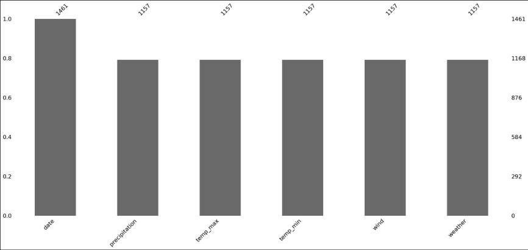


- **3**）通过热力图查看缺失值的相关性

missingno 绘制的热力图能够展示数据集中不同列的缺失值之间的相关性。这里的相关 性体现的是当某一列出现缺失值时，其他列出现缺失值的可能性。如果两个列的缺失值呈现 正相关，意味着当其中一列有缺失值时，另一列也很可能有缺失值；若为负相关，则表示当 一列有缺失值时，另一列更倾向于没有缺失值。

- 颜色与数值：热力图中的颜色和数值反映了列之间缺失值的相关性。接近 1 表示 正相关，接近 -1 表示负相关，接近 0 则表示缺失值之间没有明显的关联。

- 示例说明：假如 A 列和 B 列在热力图中对应区域颜色较深且数值接近 1，这就表 明当 A 列出现缺失值时，B 列也很可能出现缺失值；若数值接近 -1，情况则相反。

`msno.heatmap(df)`


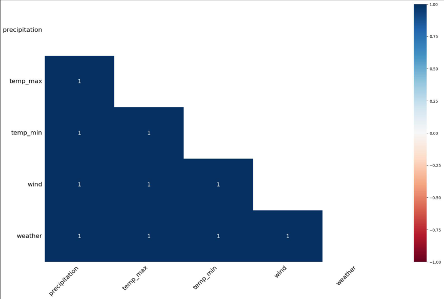


## **3.7.4** 剔除缺失值

通过 dropna()方法来剔除缺失值。

- **1**）**Series** 剔除缺失值


```python
s = pd.Series([1, pd.NA, None])
print(s)
# 0
1
# 1
<NA>
# 2
None
# dtype: object
print(s.dropna())
# 0
1
# dtype: object
```


- **2**）**DataFrame** 剔除缺失值

无法从 DataFrame 中单独剔除一个值，只能剔除缺失值所在的整行或整列。默认情况下，

dropna()会剔除任何包含缺失值的整行数据。


```python
df = pd.DataFrame([[1, pd.NA, 2], [2, 3, 5], [pd.NA, 4, 6]])
print(df)
#
0
1
2
# 0
1
<NA>
2
# 1
2
3
5
# 2
<NA>
4
6
print(df.dropna())
```


0 1 2 # 1 2 3 5 可以设置按不同的坐标轴剔除缺失值，比如 axis=1（或（或 axis='columns'）会剔除任何包 含缺失值的整列数据。 df = pd.DataFrame([[1, pd.NA, 2], [2, 3, 5], [pd.NA, 4, 6]]) print(df) # 0 1 2 # 0 1 <NA> 2 # 1 2 3 5 # 2 <NA> 4 6 print(df.dropna(axis=1)) # 2 # 0 2 # 1 5 # 2 6

可以设置按不同的坐标轴剔除缺失值，比如 axis=1（或（或 axis='columns'）会剔除任何包

有时只需要剔除全部是缺失值的行或列，或者绝大多数是缺失值的行或列。这些需求可 以通过设置 how 或 thresh 参数来满足，它们可以设置剔除行或列缺失值的数量阈值。

df = pd.DataFrame([[1, pd.NA, 2], [pd.NA, pd.NA, 5], [pd.NA, pd.NA, pd.NA]]) print(df) # 0 1 2 # 0 1 <NA> 2 # 1 <NA> <NA> 5 # 2 <NA> <NA> <NA> print(df.dropna(how="all")) # 如果所有值都是缺失值,则删除这一行 # 0 1 2 # 0 1 <NA> 2 # 1 <NA> <NA> 5 print(df.dropna(thresh=2)) # 如果至少有 2 个值不是缺失值,则保留这一行 # 0 1 2 # 0 1 <NA> 2 可以通过设置 subset 参数来设置某一列有缺失值则进行剔除。 df = pd.DataFrame([[1, pd.NA, 2], [pd.NA, pd.NA, 5], [pd.NA, pd.NA, pd.NA]]) print(df) # 0 1 2 # 0 1 <NA> 2 # 1 <NA> <NA> 5 # 2 <NA> <NA> <NA> print(df.dropna(subset=[0])) # 如果 0 列有缺失值,则删除这一行 # 0 1 2 # 0 1 <NA> 2


## **3.7.5** 填充缺失值

- **1**）使用固定值填充

通过 fillna()方法，传入值或字典进行填充。

df = pd.read_csv("data/weather_withna.csv")

|p|rint(d|f.fillna(0)|.tail())<br># 使用|固定值填充||||
|---|---|---|---|---|---|---|---|
|#||date|precipitation|temp_max|temp_min|wind|weather|
|#|1456|2015-12-27|0.0|0.0|0.0|0.0|0|
|#|1457|2015-12-28|0.0|0.0|0.0|0.0|0|
|#|1458|2015-12-29|0.0|0.0|0.0|0.0|0|
|#|1459|2015-12-30|0.0|0.0|0.0|0.0|0|
|#|1460|2015-12-31|20.6|12.2|5.0|3.8|rain|
|p|rint(d|f.fillna({"|temp_max": 60,|"temp_min":|-60}).ta|il())|# 使用字典来|
|填|充|||||||
|#||date|precipitation|temp_max|temp_min|wind|weather|
|#|1456|2015-12-27|NaN|60.0|-60.0|NaN|NaN|
|#|1457|2015-12-28|NaN|60.0|-60.0|NaN|NaN|
|#|1458|2015-12-29|NaN|60.0|-60.0|NaN|NaN|
|#|1459|2015-12-30|NaN|60.0|-60.0|NaN|NaN|
|#|1460|2015-12-31|20.6|12.2|5.0|3.8|rain|


- **2**）使用统计值填充

通过 fillna()方法，传入统计后的值进行填充。

|p|rint(d|f.fillna(df[|["precipitation|", "temp_m|ax", "temp|_min",||
|---|---|---|---|---|---|---|---|
|"|wind"]|].mean()).ta|il())<br># 使用平|均值填充||||
|#||date|precipitation|temp_max|temp_min|wind|weather|
|#|1456|2015-12-27|3.052332|15.851468|7.877202|3.242055|NaN|
|#|1457|2015-12-28|3.052332|15.851468|7.877202|3.242055|NaN|
|#|1458|2015-12-29|3.052332|15.851468|7.877202|3.242055|NaN|
|#|1459|2015-12-30|3.052332|15.851468|7.877202|3.242055|NaN|
|#|1460|2015-12-31|20.600000|12.200000|5.000000|3.800000|rain|


- **3**）使用前后的有效值填充

通过 ffill()或 bfill()方法使用前面或后面的有效值填充。

|print(d|f.ffill().tail())|# 使用前|面的有效值|填充||||
|---|---|---|---|---|---|---|---|
|#|date<br>preci|pitation|temp_max|temp|_min|wind|weather|
|# 1456|2015-12-27|0.0|11.1||4.4|4.8|sun|
|# 1457|2015-12-28|0.0|11.1||4.4|4.8|sun|
|# 1458|2015-12-29|0.0|11.1||4.4|4.8|sun|
|# 1459|2015-12-30|0.0|11.1||4.4|4.8|sun|
|# 1460|2015-12-31|20.6|12.2||5.0|3.8|rain|
|print(d|f.bfill().tail())|# 使用后|面的有效值|填充||||
|#|date<br>preci|pitation|temp_max|temp|_min|wind|weather|


|# 1456|2015-12-27|20.6|12.2|5.0|3.8|rain|
|---|---|---|---|---|---|---|
|# 1457|2015-12-28|20.6|12.2|5.0|3.8|rain|
|# 1458|2015-12-29|20.6|12.2|5.0|3.8|rain|
|# 1459|2015-12-30|20.6|12.2|5.0|3.8|rain|
|# 1460|2015-12-31|20.6|12.2|5.0|3.8|rain|


- **4**）通过线性插值填充

通过 interpolate()方法进行线性插值填充。线性插值操作，就是用于在已知数据点之间 估算未知数据点的值。interpolate 方法支持多种插值方法，可通过 method 参数指定，常见的 方法有：

- 'linear'：线性插值，基于两点之间的直线来估算缺失值，适用于数据呈线性变化的 情况。

- 'time'：适用于时间序列数据，会考虑时间间隔进行插值。

- 'polynomial'：多项式插值，通过拟合多项式曲线来估算缺失值，可通过 order 参数 指定多项式的阶数。


```python
import pandas as pd
import numpy as np
# 创建包含缺失值的Series
s = pd.Series([1, np.nan, 3, 4, np.nan, 6])
# 使用默认的线性插值方法填充缺失值
s_interpolated = s.interpolate()
print(s_interpolated)
# 0
1.0
# 1
2.0
# 2
3.0
# 3
4.0
# 4
5.0
# 5
6.0
# dtype: float64
```


## **3.8 Padas** 的 **apply** 函数

apply()函数可以对 DataFrame 或 Series 的数据进行逐行、逐列或逐元素的操作。可以使 用自定义函数对数据进行变换、计算或处理，通常用于处理复杂的变换逻辑，或者处理不能 通过向量化操作轻松完成的任务。


## **3.8.1 Series** 使用 **apply()**


```python
def f(x):
return x * 10
```


```python
df = pd.DataFrame({"a": [10, 20, 30], "b": [40, 50, 60]})
print(df["a"].apply(f))
# 0
100
# 1
200
# 2
300
# Name: a, dtype: int64
也可以传入lambda 表达式。
df = pd.DataFrame({"a": [10, 20, 30], "b": [40, 50, 60]})
print(df["a"].apply(lambda x: x * 10))
# 0
100
# 1
200
# 2
300
# Name: a, dtype: int64
传入带参数的函数。
def f(x, y=10):
return x * y
```

 df = pd.DataFrame({"a": [10, 20, 30], "b": [40, 50, 60]}) print(df["a"].apply(f, y=5)) # 0 50 # 1 100 # 2 150 # Name: a, dtype: int64

## **3.8.2 DataFrame** 使用 **apply()**

def f(x): return x * 10

```python
df = pd.DataFrame({"a": [10, 20, 30], "b": [40, 50, 60]})
print(df.apply(f))
#
a
b
# 0
100
400
# 1
200
500
# 2
300
600
```


默认 axis=0，按行方向进行操作，对列进行统计；


可以设置 axis=1，按照列的方向进行操作，参数设置按行处理。


```python
def f(x):
return x["a"] / x["b"]
```


```python
df = pd.DataFrame({"a": [10, 20, 30], "b": [40, 50, 60]})
print(df.apply(f, axis=1))
# 0
0.25
# 1
0.40
# 2
0.50
# dtype: float64
```


注意：df.apply 一次只能处理一个 Series（当 axis=0 时处理列，当 axis=1 时处理行）， 而你定义的函数 f 接收两个参数，不能直接使用 df.apply(f)

## **3.8.3** 向量化函数


```python
def f(x, y):
if y == 0:
return np.nan
return x / y
```


```python
df = pd.DataFrame({"a": [10, 20, 30], "b": [40, 0, 60]})
print(f(df["a"], df["b"]))
# ValueError
上述代码会报错，因为y==0 中，y 为向量而0 为标量。
（1）可以通过np.vectorize()将函数向量化来进行计算
def f(x, y):
if y == 0:
return np.nan
return x / y
```


```python
df = pd.DataFrame({"a": [10, 20, 30], "b": [40, 0, 60]})
f_vec = np.vectorize(f)
print(f_vec(df["a"], df["b"]))
# [0.25
nan 0.5 ]
（2）也可以使用@np.vectorize 装饰器将函数向量化
@np.vectorize
def f(x, y):
if y == 0:
return np.nan
return x / y
```


```python
df = pd.DataFrame({"a": [10, 20, 30], "b": [40, 0, 60]})
print(f(df["a"], df["b"]))
# [0.25
nan 0.5 ]
```


## **3.9 Padas** 的数据聚合、转换、过滤函数

## **3.9.1 DataFrameGroupBy** 对象

对 DataFrame 对象调用 groupby()方法后，会返回 DataFrameGroupBy 对象。


```python
df = pd.read_csv("data/employees.csv")
# 读取员工数据
print(df.groupby("department_id"))
# 按department_id 分组，返回
DataFrameGroupBy 对象
# <pandas.core.groupby.generic.DataFrameGroupBy object at
0x0000024FCBAFD700>
```


这个对象可以看成是一种特殊形式的 DataFrame，里面隐藏着若干组数据，但是在没有 应用累计函数之前不会计算。GroupBy 对象是一种非常灵活的抽象类型。在大多数场景中，

可以将它看成是 DataFrame 的集合。

- **1**）查看分组

通过 groups 属性查看分组结果，返回一个字典，字典的键是分组的标签，值是属于该

组的所有索引的列表。

print(df.groupby("department_id").groups) # 查看分组结果 # {10.0: [100], 20.0: [101, 102], 30.0: [14, 15, 16, 17, 18, 19]...

通过 get_group()方法获取分组。

|print|(df.groupby(|"department_id|").get_gro|up(50))<br># 获取分组为50的数据|
|---|---|---|---|---|
|#|employee_id|first_name|last_name|email...|
|# 20|120|Matthew|Weiss|MWEISS...|
|# 21|121|Adam|Fripp|AFRIPP...|
|# 22|122|Payam|Kaufling|PKAUFLIN...|


- **2**）按列取值

print(df.groupby("department_id")["salary"]) # 按 department_id 分组，取 salary 列 # <pandas.core.groupby.generic.SeriesGroupBy object at 0x0000022456D6F2F0>

这里从原来的 DataFrame 中取某个列名作为一个 Series 组。与 GroupBy 对象一样，直

到我们运行累计函数，才会开始计算。

print(df.groupby("department_id")["salary"].mean()) # 计算每个部门平均薪 资 # department_id # 10.0 4400.000000 # 20.0 9500.000000 # 30.0 4150.000000


- **3**）按组迭代

GroupBy 对象支持直接按组进行迭代，返回的每一组都是 Series 或 DataFrame。

for dept_id,group in df.groupby("department_id"): print(f"当前组为{dept_id}，组里的数据情况{group.shape}:") print(group.iloc[:,0:3]) print("-------------------") # 当前组为 10.0，组里的数据情况(1, 10): # employee_id first_name last_name # 100 200 Jennifer Whalen # ------------------# 当前组为 20.0，组里的数据情况(2, 10): # employee_id first_name last_name # 101 201 Michael Hartstein # 102 202 Pat Fay ...

- **4**）按多字段分组

salary_mean = df.groupby(["department_id", "job_id"])[ ["salary", "commission_pct"] ].mean() # 按 department_id 和 job_id 分组 print(salary_mean.index) # 查看分组后的索引 # MultiIndex([( 10.0, 'AD_ASST'), # ( 20.0, 'MK_MAN'), # ( 20.0, 'MK_REP'), # ( 30.0, 'PU_CLERK'), # ( 30.0, 'PU_MAN'), # ...

print(salary_mean.columns) # 查看分组后的列 # Index(['salary', 'commission_pct'], dtype='object')

按多个字段分组后得到的索引为复合索引。

可通过 reset_index()方法重置索引。

print(salary_mean.reset_index())

|#|department_id|job_id|salary|commission_pct|
|---|---|---|---|---|
|# 0|10.0|AD_ASST|4400.000000|NaN|
|# 1|20.0|MK_MAN|13000.000000|NaN|
|# 2|20.0|MK_REP|6000.000000|NaN|
|# 3|30.0|PU_CLERK|2780.000000|NaN|
|# 4|30.0|PU_MAN|11000.000000|NaN|


也可以在分组的时候通过 as_index = False 参数（默认是 True）重置索引。

salary_mean = df.groupby(["department_id", "job_id"], as_index=False)[


|["salary", "commi|ssion_pct"|]||
|---|---|---|---|
|].mean()<br># 按depart|ment_id和j|ob_id分组||
|print(salary_mean)||||
|#<br>department_id|job_id|salary|commission_pct|
|# 0<br>10.0|AD_ASST|4400.000000|NaN|
|# 1<br>20.0|MK_MAN|13000.000000|NaN|
|# 2<br>20.0|MK_REP|6000.000000|NaN|
|# 3<br>30.0|PU_CLERK|2780.000000|NaN|
|# 4<br>30.0|PU_MAN|11000.000000|NaN|


- **5**）**cut()**

pandas.cut()用于将连续数据（如数值型数据）分割成离散的区间。可以使用 cut()来将数

据划分为不同的类别或范围，通常用于数据的分箱处理。

cut()部分参数说明：

|参数|说明|
|---|---|
|**x**|要分箱的数组或Series，通常是数值型数据。|
|**bins**|切分区间的数值列表或者整数。如果是整数，则表示将数据均|
||匀地分成多少个区间。如果是列表，则需要指定每个区间的边|
||界。|
|**right**|默认True，表示每个区间的右端点是闭区间，即包含右端点。|
||如果设置为False，则左端点为闭区间。|
|**labels**|传入一个列表指定每个区间的标签。|


```python
df = pd.read_csv("data/employees.csv")
# 加载员工数据
salary = pd.cut(df.iloc[9:16]["salary"], 3)
print(salary)
# 9
(8366.667, 11000.0]
# 10
(5733.333, 8366.667]
# 11
(5733.333, 8366.667]
# 12
(5733.333, 8366.667]
# 13
(5733.333, 8366.667]
# 14
(8366.667, 11000.0]
# 15
(3092.1, 5733.333]
# Name: salary, dtype: category
# Categories (3, interval[float64, right]): [(3092.1, 5733.333] <
(5733.333, 8366.667] <
#
(8366.667, 11000.0]]
salary = pd.cut(df.iloc[9:16]["salary"], [0, 10000, 20000])
```


print(salary) # 9 (0, 10000] # 10 (0, 10000] # 11 (0, 10000] # 12 (0, 10000] # 13 (0, 10000] # 14 (10000, 20000] # 15 (0, 10000] # Name: salary, dtype: category

Categories (2, interval[int64, right]): [(0, 10000] < (10000, 20000]]

salary = pd.cut(df.iloc[9:16]["salary"], 3, labels=["low", "medium", "high"]) print(salary) # 9 high # 10 medium # 11 medium # 12 medium # 13 medium # 14 high # 15 low # Name: salary, dtype: category

Categories (3, object): ['low' < 'medium' < 'high']

## **3.9.2** 分组聚合

df.groupby("分组字段")["要聚合的字段"].聚合函数() df.groupby(["分组字段", "分组字段 2", ...])[["要聚合的字段", "要聚合的字段 2", ...]].聚合函数()

- **1**）常用聚合函数

|方法|说明|
|---|---|
|**sum()**|求和|
|**mean()**|平均值|
|**min()**|最小值|
|**max()**|最大值|
|**var()**|方差|
|**std()**|标准差|
|**median()**|中位数|
|**quantile()**|指定位置的分位数，如quantile(0.5)|


|**describe()**|常见统计信息|
|---|---|
|**size()**|所有元素的个数|
|**count()**|非空元素的个数|
|**first**|第一行|
|**last**|最后一行|
|**nth**|第n行|


- **2**）一次计算多个统计值

可以通过 agg()或 aggregate()进行更复杂的操作，如一次计算多个统计值。

df = pd.read_csv("data/employees.csv") # 读取员工数据 # 按 department_id 分组，计算 salary 的最小值，中位数，最大值 print(df.groupby("department_id")["salary"].agg(["min", "median", "max"]))

|#||min|median|max|
|---|---|---|---|---|
|#|department_id||||
|#|10.0|4400.0|4400.0|4400.0|
|#|20.0|6000.0|9500.0|13000.0|
|#|30.0|2500.0|2850.0|11000.0|
|#|40.0|6500.0|6500.0|6500.0|
|#|50.0|2100.0|3100.0|8200.0|


- **3**）多个列计算不同的统计值

也可以在 agg()中传入字典，对多个列计算不同的统计值。

|d|f = pd.read_csv("data/employees.csv")<br># 读取员工数据|
|---|---|
|#|按department_id分组，统计job_id的种类数，commission_pct的平均值|
|p|rint(df.groupby("department_id").agg({"job_id": "nunique",|
|"|commission_pct": "mean"}))|
|#|job_id<br>commission_pct|
|#|department_id|
|#|10.0<br>1<br>NaN|
|#|20.0<br>2<br>NaN|
|#|30.0<br>2<br>NaN|
|#|40.0<br>1<br>NaN|
|#|50.0<br>3<br>NaN|


- **4**）重命名统计值

可以在 agg()后通过 rename()对统计后的列重命名。

df = pd.read_csv("data/employees.csv") # 读取员工数据 # 按 department_id 分组，统计 job_id 的种类数，commission_pct 的平均值 print(

df.groupby("department_id")


.agg( {"job_id": "nunique", "commission_pct": "mean"}, ) .rename( columns={"job_id": "工种数", "commission_pct": "佣金比例平均值"}, ) ) # 工种数 佣金比例平均值 # department_id # 10.0 1 NaN # 20.0 2 NaN # 30.0 2 NaN # 40.0 1 NaN # 50.0 3 NaN

- **5**）自定义函数

可以向 agg()中传入自定义函数进行计算。

df = pd.read_csv("data/employees.csv") # 读取员工数据 def f(x): """统计每个部门员工 last_name 的首字母""" result = set() for i in x: result.add(i[0]) return result

```python
print(df.groupby("department_id")["last_name"].agg(f))
# department_id
# 10.0
{W}
# 20.0
{F, H}
# 30.0
{B, T, R, C, K, H}
# 40.0
{M}
# 50.0
{O, E, K, S, W, L, P, D, C, V, B, T, M, J, F, ...
```


## **3.9.3** 分组转换

聚合操作返回的是对组内全量数据缩减过的结果，而转换操作会返回一个新的全量数据。

数据经过转换之后，其形状与原来的输入数据是一样的。

**1** ）通过 **transform()** 将每一组的样本数据减去各组的均值，实现数据标准化


```python
df = pd.read_csv("data/employees.csv")
# 读取员工数据
print(df.groupby("department_id")["salary"].transform(lambda x: x -
x.mean()))
```


0 4666.666667 # 1 -2333.333333 # 2 -2333.333333 # 3 3240.000000 # 4 240.000000

- **2**）通过 **transform()** 按分组使用平均值填充缺失值

df = pd.read_csv("data/employees.csv") # 读取员工数据 na_index = pd.Series(df.index.tolist()).sample(30) # 随机挑选 30 条数据 df.loc[na_index, "salary"] = pd.NA # 将这 30 条数据的 salary 设置为缺失值 print(df.groupby("department_id")["salary"].agg(["size", "count"])) # 查看每组数据总数与非空数据数

def fill_missing(x): # 使用平均值填充，如果平均值也为 NaN，用 0 填充 if np.isnan(x.mean()): return 0 return x.fillna(x.mean())


```python
df["salary"] =
df.groupby("department_id")["salary"].transform(fill_missing)
print(df.groupby("department_id")["salary"].agg(["size", "count"]))
#
```

 查看每组数据总数与非空数据数

## **3.9.4** 分组过滤

过滤操作可以让我们按照分组的属性丢弃若干数据。

例如，我们可能只需要保留 commission_pct 不包含空值的分组的数据。


```python
commission_pct_filter = df.groupby("department_id").filter(
lambda x: x["commission_pct"].notnull().all()
)
# 按department_id 分组，过滤掉commission_pct 包含空值的分组
print(commission_pct_filter)
```


## **3.10 Pandas** 透视表

## **3.10.1** 什么是透视表

透视表（pivot table）是各种电子表格程序和其他数据分析软件中一种常见的数据汇总 工具。它可以根据多个行分组键和多个列分组键对数据进行聚合，并根据行和列上的分组键 将数据分配到各个矩形区域中。

## **3.10.2 pivot_table()**


pandas 中提供了 DataFrame.pivot_table()和 pandas.pivot_table()方法来生成透视表。两者 的区别是 pandas.pivot_table()需要额外传入一个 data 参数指定对哪个 DataFrame 进行处理。

pivot_table()的参数如下：

|参数|说明|
|---|---|
|**values**|待聚合的列，默认聚合所有数值列。|
|**index**|用作透视表行索引的列。即通过哪个（些）行来对数据进行分|
||组，行索引决定了透视表的行维度。|
|**columns**|用作透视表列索引的列。即通过哪个（些）列来对数据进行分|
||组，列索引决定了透视表的列维度。|
|**aggfunc**|聚合函数或函数列表，默认为mean。|
|**fill_value**|用于替换结果表中的缺失值。|
|**margins**|是否在透视表的边缘添加汇总行和列，显示总计。默认值是|
||False，如果设置为True，会添加“总计”行和列，方便查看数|
||据的总体汇总。|
|**dropna**|是否排除包含缺失值的行和列。默认为True，即如果某个组合|
||的行列数据中包含缺失值，则会被排除在外。如果设置为|
||False，则会保留这些含有缺失值的行和列。|
|**observerd**|是否显示所有组合数据，True:只显示实际存在的组合|


## **3.10.3** 案例：睡眠质量分析透视表

使用 sleep（睡眠健康和生活方式）数据集，其中包含 13 个字段：

- person_id：每个人的唯一标识符。

- gender：个人的性别（男/女）。

- age：个人的年龄（以岁为单位）。

- occupation：个人的职业或就业状况（例如办公室职员、体力劳动者、学生）。

- sleep_duration：每天的睡眠总小时数。

- sleep_quality：睡眠质量的主观评分，范围从 1（差）到 10（极好）。

- physical_activity_level：每天花费在体力活动上的时间（以分钟为单位）。

- stress_level：压力水平的主观评级，范围从 1（低）到 10（高）。

- bmi_category：个人的 BMI 分类（体重过轻、正常、超重、肥胖）。


- blood_pressure：血压测量，显示为收缩压与舒张压的数值。

- heart_rate：静息心率，以每分钟心跳次数为单位。

- daily_steps：个人每天行走的步数。

- sleep_disorder：存在睡眠障碍（无、失眠、睡眠呼吸暂停）。

- **1**）统计不同睡眠时间，不同压力等级下的睡眠质量

df = pd.read_csv("data/sleep.csv") sleep_duration_stage = pd.cut(df["sleep_duration"], [0, 5, 6, 7, 8, 9, 10, 11, 12]) # 对睡眠时间进行划分 stress_level_stage = pd.cut(df["stress_level"], 4) # 对压力等级进行划分 print(df.pivot_table(values="sleep_quality", index=[sleep_duration_stage, stress_level_stage], aggfunc="mean")) # sleep_quality # sleep_duration stress_level # (0, 5] (0.991, 3.25] 6.781818 # (3.25, 5.5] 6.161538 # (5.5, 7.75] 5.677778 # (7.75, 10.0] 6.082353 # (5, 6] (0.991, 3.25] 5.876923 # (3.25, 5.5] 6.777778 # (5.5, 7.75] 6.058333 # (7.75, 10.0] 6.438462

**2** ）添加职业作为列维度

print( df.pivot_table( values="sleep_quality", index=[sleep_duration_stage, stress_level_stage], columns=["occupation"], aggfunc="mean" ) ) # occupation Manual Labor Office Worker Retired Student # sleep_duration stress_level # (0, 5] (0.991, 3.25] 6.900000 6.350000 6.720000 6.750000 # (3.25, 5.5] 3.300000 7.966667 6.060000 5.650000 # (5.5, 7.75] 4.833333 6.900000 3.200000 6.533333 # (7.75, 10.0] 7.200000 5.977778 5.225000 7.150000 # (5, 6] (0.991, 3.25] 5.220000 6.433333 5.700000 6.533333


|#|(3.25,||||
|---|---|---|---|---|
|5.5]|5.000000|7.050000|6.900000|9.000000|
|#|(5.5,||||
|7.75]|6.050000|5.300000|5.300000|7.200000|
|#|(7.75,||||
|10.0]|6.475000|4.050000|NaN|7.100000|
|**3**）添加性|别作为第二个列维度||||


|print(<br>df.pivot_table(<br>values="sleep_quality"<br>index=[sleep_duration_<br>columns=["occupation", <br>aggfunc="mean",<br>)<br>)<br># occupation|,<br>stage, stress_<br> "gender"],<br>Manual Labor|level_s|tage],<br>Office||
|---|---|---|---|---|
|Worker<br>Retired|Student||||
|#|||||
|gender|Female|Male|Fem|ale<br>Male|
|Female<br>Male<br>Female|Male||||
|# sleep_duration stress_level|||||
|# (0, 5]<br>(0.991,|||||
|3.25]<br>6.75<br>7.300000|6.700000<br>|6.000|NaN|6.720000<br>6|
|.100000<br>7.400000|||||
|#<br>(3.25,|||||
|5.5]<br>3.30<br>NaN|7.100000|9.700|4.850000|6.866667|
|5.300000<br>6.700000|||||
|#<br>(5.5,|||||
|7.75]<br>4.55<br>5.400000|5.900000|7.900|NaN|3.200000|
|6.850000<br>5.900000|||||
|#<br>(7.75,|||||
|10.0]<br>8.40<br>6.000000|5.180000|6.975|6.600000|4.766667|
|7.150000<br>NaN|||||
|# (5, 6]<br>(0.991,|||||
|3.25]<br>5.50<br>4.800000|8.200000<br>|5.550<br>|5.700000|NaN<br>8|
|.150000<br>3.300000|||||
|#<br>(3.25,|||||
|5.5]<br>5.00<br>NaN|6.600000|7.500|6.700000|7.100000|
|9.000000<br>NaN|||||
|#<br>(5.5,|||||
|7.75]<br>6.60<br>5.500000|4.900000|6.100|4.450000|7.000000|
|7.066667<br>7.600000|||||


|#|(7.75,|||||
|---|---|---|---|---|---|
|10.0]|6.15<br>6.800000|NaN|4.050|NaN|NaN|
|7.266667|6.975000|||||


## **3.11 Pandas** 时间序列

## **3.11.1 Python** 中的日期与时间工具

Python 基本的日期与时间功能都在标准库的 datetime 模块中。


```python
from datetime import datetime
date1 = datetime(year=2000, month=1, day=1)
date2 = datetime.now()
print(date1)
# 2000-01-01 00:00:00
print(date2)
# 2025-01-01 00:00:00
print(date1.year)
# 2000
print(date1.month)
# 1
print(date1.day)
# 1
print(date2.weekday())
# 5
print(date2.strftime("%A"))
# Saturday
print(date2 - date1)
# 18263 days, 0:00:00
```


## **3.11.2 pandas** 中的日期与时间

pandas 的日期时间类型默认是 datetime64[ns]。

- 针对时间戳数据，pandas 提供了 Timestamp 类型。它本质上是 Python 原生 datetime 类型的替代品，但是在性能更好的 numpy.datetime64 类型的基础上创建。对应的索 引数据结构是 DatetimeIndex。

- 针对时间周期数据，pandas 提供了 Period 类型。这是利用 numpy.datetime64 类型将 固定频率的时间间隔进行编码。对应的索引数据结构是 PeriodIndex。

- 针对时间增量或持续时间，pandas 提供了 Timedelta 类型。Timedelta 是一种代替 Python 原生 datetime.timedelta 类型的高性能数据结构，同样是基于 numpy.timedelta64 类型。对应的索引数据结构是 TimedeltaIndex。

- **1**）**datetime64**

to_datetime()可以解析许多日期与时间格式。对 to_datetime()传递一个日期会返回一个

Timestamp 类型，传递一个时间序列会返回一个 DatetimeIndex 类型。


```python
print(pd.to_datetime("2015-01-01"))
# 2015-01-01 00:00:00
print(pd.to_datetime(["4th of July, 2015", "2015-Jul-6", "07-07-2015",
"20150708"], format="mixed"))
```


DatetimeIndex(['2015-07-04', '2015-07-06', '2015-07-07', '2015-0708'], dtype='datetime64[ns]', freq=None)

在加载数据时，可以通过 to_datetime()将数据中的列解析为 datetime64。

df = pd.read_csv("data/weather.csv") print(df["date"].tail()) # 1456 2015-12-27 # 1457 2015-12-28 # 1458 2015-12-29 # 1459 2015-12-30 # 1460 2015-12-31 # Name: date, dtype: object print(pd.to_datetime(df["date"]).tail()) # 1456 2015-12-27 # 1457 2015-12-28 # 1458 2015-12-29 # 1459 2015-12-30 # 1460 2015-12-31 # Name: date, dtype: datetime64[ns]

在加载数据时也可以通过 parse_dates 参数将指定列解析为 datetime64。

df = pd.read_csv("data/weather.csv", parse_dates=[0]) print(df["date"].tail()) # 1456 2015-12-27 # 1457 2015-12-28 # 1458 2015-12-29 # 1459 2015-12-30 # 1460 2015-12-31 # Name: date, dtype: datetime64[ns]

**2** ）提取日期的各个部分

（1）提取 Timestamp

d = pd.Timestamp("2015-01-01 09:08:07.123456") print(d.year) # 2015 print(d.month) # 1 print(d.day) # 1 print(d.hour) # 9 print(d.minute) # 8 print(d.second) # 7 print(d.microsecond) # 123456

（2）对于 Series 对象，需要使用 dt 访问器

df = pd.read_csv("data/weather.csv", parse_dates=[0]) df_date = pd.to_datetime(df["date"]) df["year"] = df_date.dt.year df["month"] = df_date.dt.month


|df|["day"] = df_dat|e.dt.day||
|---|---|---|---|
|pr|int(df[["date",|"year", "mon|th", "day"]].tail())|
|#|date|year<br>month|day|
|#|1456 2015-12-27|2015<br>12|27|
|#|1457 2015-12-28|2015<br>12|28|
|#|1458 2015-12-29|2015<br>12|29|
|#|1459 2015-12-30|2015<br>12|30|
|#|1460 2015-12-31|2015<br>12|31|


- **3**）**period**

可以通过 to_period()方法和一个频率代码将 datetime64 类型转换成 period 类型。

df = pd.read_csv("data/weather.csv") df["quarter"] = pd.to_datetime(df["date"]).dt.to_period("Q") # 将年-月 -日转换为年季度 print(df[["date", "quarter"]].head()) # date quarter # 0 2012-01-01 2012Q1 # 1 2012-01-02 2012Q1 # 2 2012-01-03 2012Q1 # 3 2012-01-04 2012Q1 # 4 2012-01-05 2012Q1

- **4**）**timedelta64**

当用一个日期减去另一个日期，返回的结果是 timedelta64 类型。

df = pd.read_csv("data/weather.csv", parse_dates=[0]) df_date = pd.to_datetime(df["date"]) timedelta = df_date - df_date[0] print(timedelta.head()) # 0 0 days # 1 1 days # 2 2 days # 3 3 days # 4 4 days # Name: date, dtype: timedelta64[ns]

## **3.11.3** 使用时间作为索引

- **1**）**DatetimeIndex**

将 datetime64 类型的数据设置为索引，得到的就是 DatetimeIndex。


```python
df = pd.read_csv("data/weather.csv")
df["date"] = pd.to_datetime(df["date"])
# 将date 列转换为datetime64 类型
df.set_index("date", inplace=True)
# 将date 列设置为索引
df.info()
# <class 'pandas.core.frame.DataFrame'>
```


DatetimeIndex: 1461 entries, 2012-01-01 to 2015-12-31

将时间作为索引后可以直接使用时间进行切片取值。

|pr|int(df.loc[|"2013-01":"2013|-06"])<br>#|获取2013|年1~6|月的数据|
|---|---|---|---|---|---|---|
|#||precipitation|temp_max|temp_min|wind|weather|
|#|date||||||
|#|2013-01-01|0.0|5.0|-2.8|2.7|sun|
|#|2013-01-02|0.0|6.1|-1.1|3.2|sun|
|#|...|...|...|...|...|...|
|#|2013-06-29|0.0|30.0|18.3|1.7|sun|
|#|2013-06-30|0.0|33.9|17.2|2.5|sun|
|pr|int(df.loc[|"2015"])<br># 获取|2015年所|有数据|||
|#||precipitation|temp_max|temp_min|wind|weather|
|#|date||||||
|#|2015-01-01|0.0|5.6|-3.2|1.2|sun|
|#|2015-01-02|1.5|5.6|0.0|2.3|rain|
|#|...|...|...|...|...|...|
|#|2015-12-30|0.0|5.6|-1.0|3.4|sun|
|#|2015-12-31|0.0|5.6|-2.1|3.5|sun|


也可以通过 between_time()和 at_time()获取某些时刻的数据。

df.between_time("9:00", "11:00") # 获取 9:00 到 11:00 之间的数据 df.at_time("3:33") # 获取 3:33 的数据

- **2**）**TimedeltaIndex**

将 timedelta64 类型的数据设置为索引，得到的就是 TimedeltaIndex。

df = pd.read_csv("data/weather.csv", parse_dates=[0]) df_date = pd.to_datetime(df["date"]) df["timedelta"] = df_date - df_date[0] # 得到 timedelta64 类型的数据 df.set_index("timedelta", inplace=True) # 将 timedelta 列设置为索引 df.info()

<class 'pandas.core.frame.DataFrame'>

TimedeltaIndex: 1461 entries, 0 days to 1460 days

将时间作为索引后可以直接使用时间进行切片取值。

print(df.loc["0 days":"5 days"])

|#|date|precipitation|temp_max|temp_min|wind|weather|
|---|---|---|---|---|---|---|
|# timedelta|||||||
|# 0 days|2012-01-01|0.0|12.8|5.0|4.7|drizzle|
|# 1 days|2012-01-02|10.9|10.6|2.8|4.5|rain|
|# 2 days|2012-01-03|0.8|11.7|7.2|2.3|rain|
|# 3 days|2012-01-04|20.3|12.2|5.6|4.7|rain|
|# 4 days|2012-01-05|1.3|8.9|2.8|6.1|rain|
|# 5 days|2012-01-06|2.5|4.4|2.2|2.2|rain|


## **3.11.4** 生成时间序列


为了能更简便地创建有规律的时间序列，pandas 提供了 date_range()方法。

- **1**）**date_range()**

date_range()通过开始日期、结束日期和频率代码（可选）创建一个有规律的日期序列，

默认的频率是天。

print(pd.date_range("2015-07-03", "2015-07-10")) # DatetimeIndex(['2015-07-03', '2015-07-04', '2015-07-05', '2015-0706', # '2015-07-07', '2015-07-08', '2015-07-09', '2015-0710'], # dtype='datetime64[ns]', freq='D')

此外，日期范围不一定非是开始时间与结束时间，也可以是开始时间与周期数 periods。 print(pd.date_range("2015-07-03", periods=5)) # DatetimeIndex(['2015-07-03', '2015-07-04', '2015-07-05', '2015-0706', # '2015-07-07'], # dtype='datetime64[ns]', freq='D')

可以通过 freq 参数设置时间频率，默认值是 D。此处改为 h，按小时变化的时间戳。 print(pd.date_range("2015-07-03", periods=5, freq="h")) # DatetimeIndex(['2015-07-03 00:00:00', '2015-07-03 01:00:00', # '2015-07-03 02:00:00', '2015-07-03 03:00:00', # '2015-07-03 04:00:00'], # dtype='datetime64[ns]', freq='h')

- **2**）时间频率与偏移量

（1）可通过 freq 参数设置时间频率

下表为常见时间频率代码与说明：

|代码|说明|
|---|---|
|**D**|天（calendar day，按日历算，含双休日）|
|**B**|天（business day，仅含工作日）|
|**W**|周（weekly）|
|**ME / M**|月末（month end）|
|**BME**|月末（business month end，仅含工作日）|
|**MS**|月初（month start）|
|**BMS**|月初（business month start，仅含工作日）|
|**QE / Q**|季末（quarter end）|


|**BQE**|季末（business quarter end，仅含工作日）|
|---|---|
|**QS**|季初（quarter start）|
|**BQS**|季初（business quarter start，仅含工作日）|
|**YE / Y**|年末（year end）|
|**BYE**|年末（business year end，仅含工作日）|
|**YS**|年初（year start）|
|**BYS**|年初（business year start，仅含工作日）|
|**h**|小时（hours）|
|**bh**|小时（business hours，工作时间）|
|**min**|分钟（minutes）|
|**s**|秒（seconds）|
|**ms**|毫秒（milliseonds）|
|**us**|微秒（microseconds）|
|**ns**|纳秒（nanoseconds）|


（2）偏移量

可以在频率代码后面加三位月份缩写字母来改变季、年频率的开始时间。

- QE-JAN、BQE-FEB、QS-MAR、BQS-APR 等

- YE-JAN、BYE-FEB、YS-MAR、BYS-APR 等

print(pd.date_range("2015-07-03", periods=10, freq="QE-JAN")) # 设置 1 月为季度末

DatetimeIndex(['2015-07-31', '2015-10-31', '2016-01-31', '2016-0430', # '2016-07-31', '2016-10-31', '2017-01-31', '2017-04-30', # '2017-07-31', '2017-10-31'], # dtype='datetime64[ns]', freq='QE-JAN')

同理，也可以在后面加三位星期缩写字母来改变一周的开始时间。

- W-SUN、W-MON、W-TUE、W-WED 等

print(pd.date_range("2015-07-03", periods=10, freq="W-WED")) # 设置周三 为一周的第一天 # DatetimeIndex(['2015-07-08', '2015-07-15', '2015-07-22', '2015-0729', # '2015-08-05', '2015-08-12', '2015-08-19', '2015-08-26', # '2015-09-02', '2015-09-09'], # dtype='datetime64[ns]', freq='W-WED')


在这些代码的基础上，还可以将频率组合起来创建的新的周期。例如，可以用小时（h）

和分钟（min）的组合来实现 2 小时 30 分钟。


```python
print(pd.date_range("2015-07-03", periods=10, freq="2h30min"))
# DatetimeIndex(['2015-07-03 00:00:00', '2015-07-03 02:30:00',
#
'2015-07-03 05:00:00', '2015-07-03 07:30:00',
#
'2015-07-03 10:00:00', '2015-07-03 12:30:00',
#
'2015-07-03 15:00:00', '2015-07-03 17:30:00',
#
'2015-07-03 20:00:00', '2015-07-03 22:30:00'],
#
dtype='datetime64[ns]', freq='150min')
```


## **3.11.5** 重新采样

处理时间序列数据时，经常需要按照新的频率（更高频率、更低频率）对数据进行重新 采样。可以通过 resample()方法解决这个问题。resample()方法以数据累计为基础，会将数据 按指定的时间周期进行分组，之后可以对其使用聚合函数。


```python
df = pd.read_csv("data/weather.csv")
df["date"] = pd.to_datetime(df["date"])
df.set_index("date", inplace=True)
print(df[["temp_max", "temp_min"]].resample("YE").mean())
# 将数据按年分
组,并计算每年的平均最高最低温度
#
temp_max
temp_min
# date
# 2012-12-31
15.276776
7.289617
# 2013-12-31
16.058904
8.153973
# 2014-12-31
16.995890
8.662466
# 2015-12-31
17.427945
8.835616
```


## **3.12 Matplotlib** 可视化

## **3.12.1 Matplotlib** 简介

- **1**）什么是 **Matplotlib**

Matplotlib 是一个 Python 绘图库，广泛用于创建各种类型的静态、动态和交互式图表。 它是数据科学、机器学习、工程和科学计算领域中常用的绘图工具之一。

- 支持多种图表类型：折线图（Line plots）、散点图（Scatter plots）、柱状图（Bar charts）、直方图（Histograms）、饼图（Pie charts）、热图（Heatmaps）、箱型图 （Box plots）、极坐标图（Polar plots）、3D 图（3D plots，配合 mpl_toolkits.mplot3d）。


   - 高度自定义：允许用户自定义图表的每个部分，包括标题、轴标签、刻度、图例等。 支持多种颜色、字体和线条样式。提供精确的图形渲染控制，如坐标轴范围、图形 大小、字体大小等。

   - 兼容性：与 NumPy、Pandas 等库紧密集成，特别适用于绘制基于数据框和数组的 数据可视化。可以输出到多种格式（如 PNG、PDF、SVG、EPS 等）。

   - 交互式绘图：在 Jupyter Notebook 中，Matplotlib 支持交互式绘图，可以动态更新 图表。支持图形缩放、平移等交互操作。

   - 动态图表：可以生成动画（使用 FuncAnimation 类），为用户提供动态数据的可视 化。

- **2** ）不同开发环境下显示图形

   - 在一个脚本文件中使用 Matplotlib，那么显示图形的时候必须使用 plt.show()。

   - 在 Notebook 中使用 Matplotlib，运行命令之后在每一个 Notebook 的单元中就会直 接将 PNG 格式图形文件嵌入在单元中。

## **3.12.2** 两种画图接口

Matplotlib 有两种画图接口：一个是便捷的 MATLAB 风格的有状态的接口，另一个是功 能更强大的面向对象接口。

- **1**）状态接口


```python
import numpy as np
import matplotlib.pyplot as plt
# 导入matplotlib
x = np.linspace(0, 10, 100)
# 创建x 轴的数据
y1 = np.sin(x)
# 创建y 轴的数据
y2 = np.cos(x)
# 创建y 轴的数据
plt.figure(figsize=(10, 6))
# 创建画布，并指定画布大小10*6 英寸
plt.subplot(2, 1, 1)
# 创建2 行1 列个子图，并指定第1 个子图
plt.xlim(0, 10)
# 设置x 轴的范围
plt.ylim(-1, 1)
# 设置y 轴的范围
plt.xlabel("x")
# 设置x 轴的标签
plt.ylabel("sin(x)")
# 设置y 轴的标签
plt.title("sin")
# 设置子图的标题
plt.plot(x, y1)
# 绘制曲线
plt.subplot(2, 1, 2)
# 创建2 行1 列个子图，并指定第2 个子图
```


```python
plt.xlim(0, 10)
# 设置x 轴的范围
plt.ylim(-1, 1)
# 设置y 轴的范围
plt.xlabel("x")
# 设置x 轴的标签
plt.ylabel("cos(x)")
# 设置y 轴的标签
plt.title("cos")
# 设置子图的标题
plt.plot(x, y2)
plt.show()
```

 # 显示图像


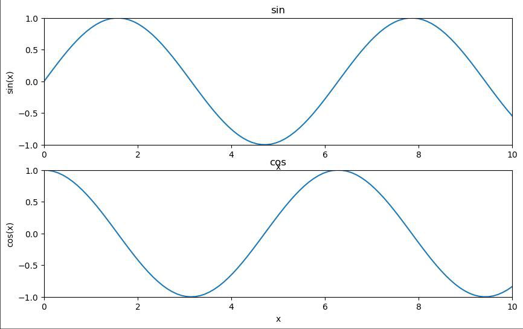


- **2**）面向对象接口


```python
import numpy as np
import matplotlib.pyplot as plt
# 导入matplotlib
x = np.linspace(0, 10, 100)
# 创建x 轴的数据
y1 = np.sin(x)
# 创建y 轴的数据
y2 = np.cos(x)
# 创建y 轴的数据
fig, ax = plt.subplots(2, figsize=(10, 6))
# 创建画布，并指定画布大小
ax[0].set_xlim(0, 10)
# 设置x 轴的范围
ax[0].set_ylim(-1, 1)
# 设置y 轴的范围
ax[0].set_xlabel("x")
# 设置x 轴的标签
ax[0].set_ylabel("sin(x)")
# 设置y 轴的标签
ax[0].set_title("sin")
# 设置子图的标题
ax[0].plot(x, y1)
# 绘制曲线
ax[1].plot(x, y2)
# 绘制曲线
ax[1].set_xlim(0, 10)
# 设置x 轴的范围
```


```python
ax[1].set_ylim(-1, 1)
# 设置y 轴的范围
ax[1].set_xlabel("x")
# 设置x 轴的标签
ax[1].set_ylabel("cos(x)")
# 设置y 轴的标签
ax[1].set_title("cos")
# 设置子图的标题
plt.show()
```


## **3.12.3** 单变量可视化

使用 weather（天气）数据集。其中包含 6 个字段：

- date：日期，年-月-日格式。

- precipitation：降水量。

- temp_max：最高温度。

- temp_min：最低温度。

- wind：风力。

- weather：天气状况。

加载数据：


```python
import pandas as pd
import matplotlib.pyplot as plt
from matplotlib import rcParams
rcParams["font.sans-serif"] = ["SimHei"]
# 指定中文字体
rcParams["axes.unicode_minus"] = False
```

 # 解决负号显示问题


df = pd.read_csv("data/weather.csv") df.info() # 查看数据集信息 # RangeIndex: 1461 entries, 0 to 1460 # Data columns (total 6 columns): # # Column Non-Null Count Dtype # ------------------------# 0 date 1461 non-null object # 1 precipitation 1461 non-null float64 # 2 temp_max 1461 non-null float64 # 3 temp_min 1461 non-null float64 # 4 wind 1461 non-null float64 # 5 weather 1461 non-null object # dtypes: float64(4), object(2) # memory usage: 68.6+ KB

使用直方图将降水量分组并绘制每组出现频次。

fig = plt.figure() ax1 = fig.add_subplot(1, 1, 1) ax1.hist(df["precipitation"], bins=5) # 绘制直方图，将降水量均匀分为 5 组 ax1.set_xlabel("降水量") ax1.set_ylabel("出现频次") plt.show()


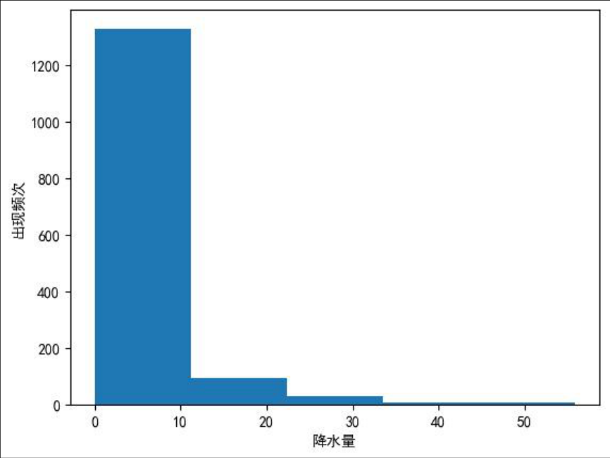


## **3.12.4** 多变量可视化


- **1**）双变量

使用散点图呈现降水量随最高气温变化的大致趋势。


```python
import pandas as pd
import matplotlib.pyplot as plt
from matplotlib import rcParams
rcParams["font.sans-serif"] = ["SimHei"]
# 指定中文字体
rcParams["axes.unicode_minus"] = False
# 解决负号显示问题
df = pd.read_csv("data/weather.csv")
fig = plt.figure()
ax1 = fig.add_subplot(1, 1, 1)
ax1.scatter(df["temp_max"], df["precipitation"])
# 绘制散点图，横轴为最高
气温，纵轴为降水量
ax1.set_xlabel("最高气温")
ax1.set_ylabel("降水量")
plt.show()
```


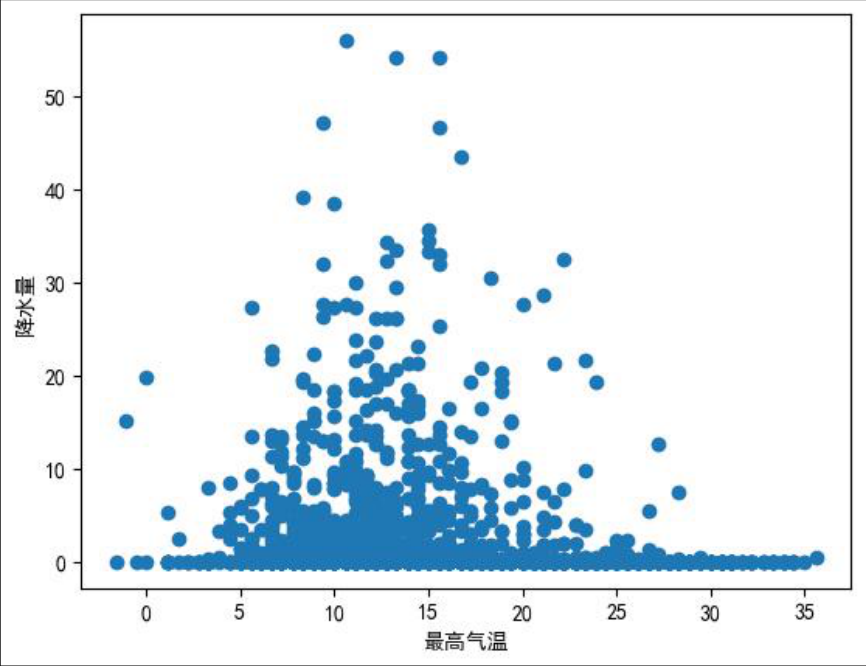


- **2**）多变量

使用散点图呈现降水量随最高气温变化的大致趋势，用不同颜色区分不同年份的数据。

```python
import pandas as pd
import matplotlib.pyplot as plt
```


```python
from matplotlib import rcParams
rcParams["font.sans-serif"] = ["SimHei"]
# 指定中文字体
rcParams["axes.unicode_minus"] = False
# 解决负号显示问题
def year_color(x):
"""添加一列，为不同年份的数据添加不同的颜色"""
match x.year:
case 2012:
return "r"
case 2013:
return "g"
case 2014:
return "b"
case 2015:
return "k"
```


```python
df = pd.read_csv("data/weather.csv")
df["date"] = pd.to_datetime(df["date"])
df["color"] = df["date"].apply(year_color)
fig = plt.figure()
ax1 = fig.add_subplot(1, 1, 1)
# 绘制散点图，横轴为最高气温，纵轴为降水量
# c 设置颜色,alpha 设置透明度
ax1.scatter(df["temp_max"], df["precipitation"], c=df["color"],
alpha=0.5)
ax1.set_xlabel("最高气温")
ax1.set_ylabel("降水量")
plt.show()
```


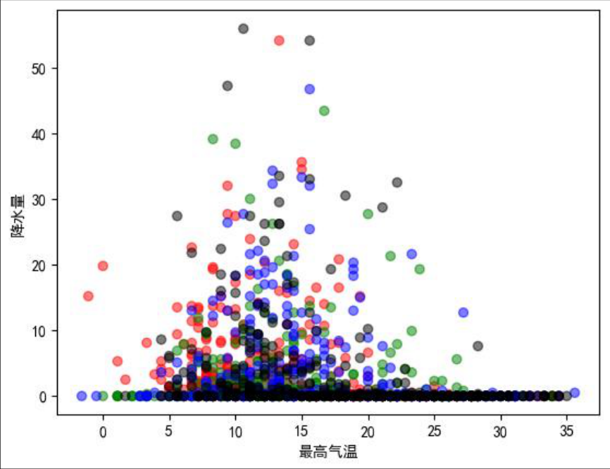


## **3.13 Pandas** 可视化

pandas 提供了非常方便的绘图功能，可以直接在 DataFrame 或 Series 上调用 plot()方法 来生成各种类型的图表。底层实现依赖于 Matplotlib，pandas 的绘图功能集成了许多常见的 图形类型，易于使用。

## **3.13.1** 单变量可视化

使用 sleep（睡眠健康和生活方式）数据集，其中包含 13 个字段：

- person_id：每个人的唯一标识符。

- gender：个人的性别（男/女）。

- age：个人的年龄（以岁为单位）。

- occupation：个人的职业或就业状况（例如办公室职员、体力劳动者、学生）。

- sleep_duration：每天的睡眠总小时数。

- sleep_quality：睡眠质量的主观评分，范围从 1（差）到 10（极好）。

- physical_activity_level：每天花费在体力活动上的时间（以分钟为单位）。

- stress_level：压力水平的主观评级，范围从 1（低）到 10（高）。

- bmi_category：个人的 BMI 分类（体重过轻、正常、超重、肥胖）。


- blood_pressure：血压测量，显示为收缩压与舒张压的数值。

- heart_rate：静息心率，以每分钟心跳次数为单位。

- daily_steps：个人每天行走的步数。

- sleep_disorder：存在睡眠障碍（无、失眠、睡眠呼吸暂停）。

加载数据：

import pandas as pd

|df|= p|d.read_csv("data/sleep.csv")|||
|---|---|---|---|---|
|df|.inf|o()<br># 查看数据集信息|||
|#|Rang|eIndex: 400 entries, 0 to 399|||
|#|Data|columns (total 13 columns):|||
|#|#|Column<br>Non-|Null Count|Dtype|
|#|---|------<br>----|----------|-----|
|#|0|person_id<br>400|non-null|int64|
|#|1|gender<br>400|non-null|object|
|#|2|age<br>400|non-null|int64|
|#|3|occupation<br>400|non-null|object|
|#|4|sleep_duration<br>400|non-null|float64|
|#|5|sleep_quality<br>400|non-null|float64|
|#|6|physical_activity_level<br>400|non-null|int64|
|#|7|stress_level<br>400|non-null|int64|
|#|8|bmi_category<br>400|non-null|object|
|#|9|blood_pressure<br>400|non-null|object|
|#|10|heart_rate<br>400|non-null|int64|
|#|11|daily_steps<br>400|non-null|int64|
|#|12|sleep_disorder<br>110|non-null|object|


dtypes: float64(2), int64(6), object(5)

memory usage: 40.8+ KB

- **1**）柱状图

柱状图用于展示类别数据的分布情况。它通过一系列矩形的高度（或长度）来展示数据

- 值，适合对比不同类别之间的数量或频率。简单直观，容易理解和比较各类别数据。

使用柱状图展示不同睡眠时长的数量。


```python
pd.cut(df["sleep_duration"], [0, 5, 6, 7, 8, 9, 10, 11,
12]).value_counts().plot.bar(
color=["red", "green", "blue", "yellow", "cyan", "magenta", "black",
"purple"]
)
```


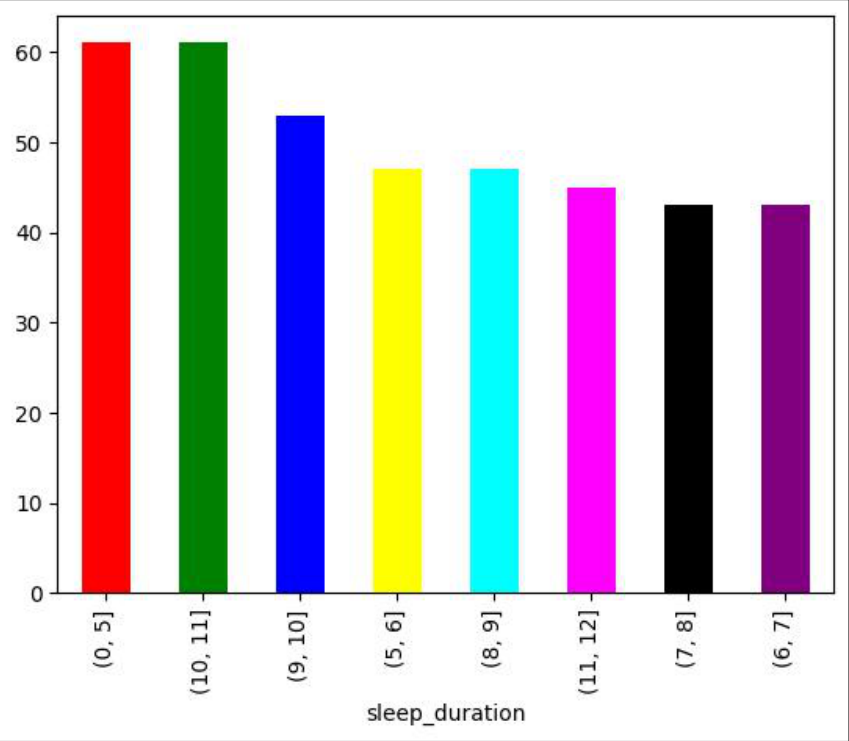


- **2**）折线图

折线图通常用于展示连续数据的变化趋势。它通过一系列数据点连接成的线段来表示数

据的变化。能够清晰地展示数据的趋势和波动。

使用折线图展示不同睡眠时长的数量。


```python
pd.cut(df["sleep_duration"], [0, 5, 6, 7, 8, 9, 10, 11,
12]).value_counts().sort_index().plot()
```


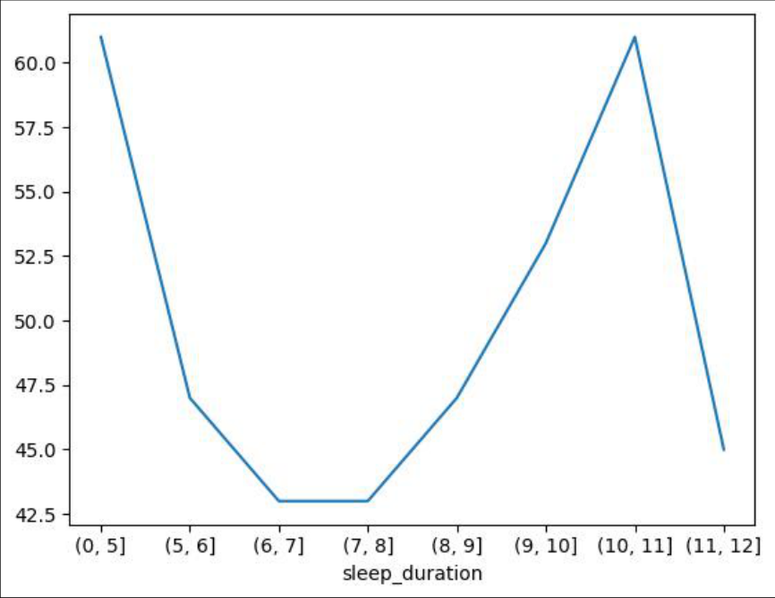


- **3**）面积图

面积图是折线图的一种变体，线下的区域被填充颜色，用于强调数据的总量或变化。可

以更直观地展示数据量的变化，适合用来展示多个分类的累计趋势。

使用面积图展示不同睡眠时长的数量。


```python
pd.cut(df["sleep_duration"], [0, 5, 6, 7, 8, 9, 10, 11,
12]).value_counts().sort_index().plot.area()
```


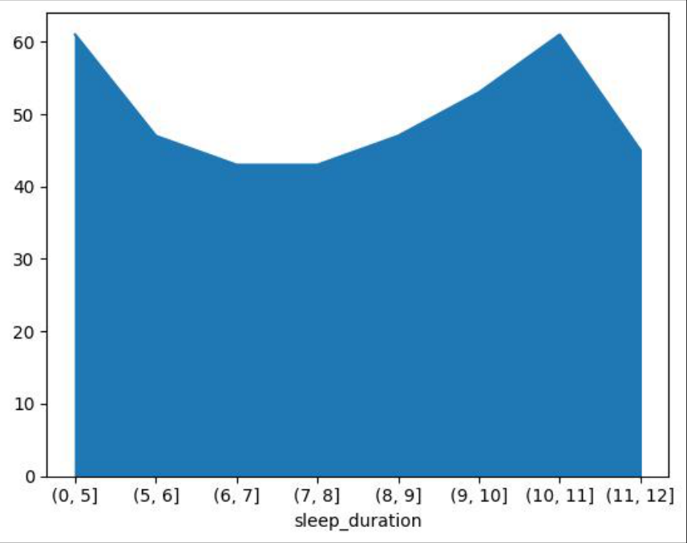


- **4**）直方图

直方图用于展示数据的分布情况。它将数据范围分成多个区间，并通过矩形的高度显示 每个区间内数据的频率或数量。可以揭示数据分布的模式，如偏态、峰度等。

使用直方图展示不同睡眠时长的数量。

`df["sleep_duration"].value_counts().plot.hist()`


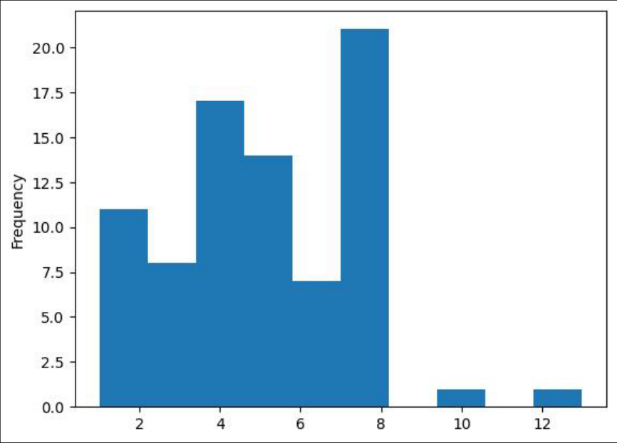


- **5**）饼状图

饼状图用于展示一个整体中各个部分所占的比例。它通过一个圆形图形分割成不同的扇 形，每个扇形的角度与各部分的比例成正比。能够快速展示各部分之间的比例关系，但不适 合用于展示过多的类别或比较数值差异较小的部分。

使用饼状图展示不同睡眠时长的占比。


```python
pd.cut(df["sleep_duration"], [0, 5, 6, 7, 8, 9, 10, 11,
12]).value_counts().sort_index().plot.pie()
```


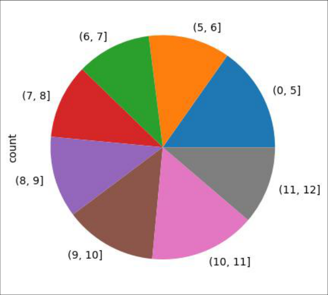


## **3.13.2** 双变量可视化

- **1**）散点图

散点图通过在二维坐标系中绘制数据点来展示两组数值数据之间的关系。能够揭示两个 变量之间的相关性和趋势。

绘制睡眠时间与睡眠质量的散点图。

`df.plot.scatter(x="sleep_duration", y="sleep_quality")`


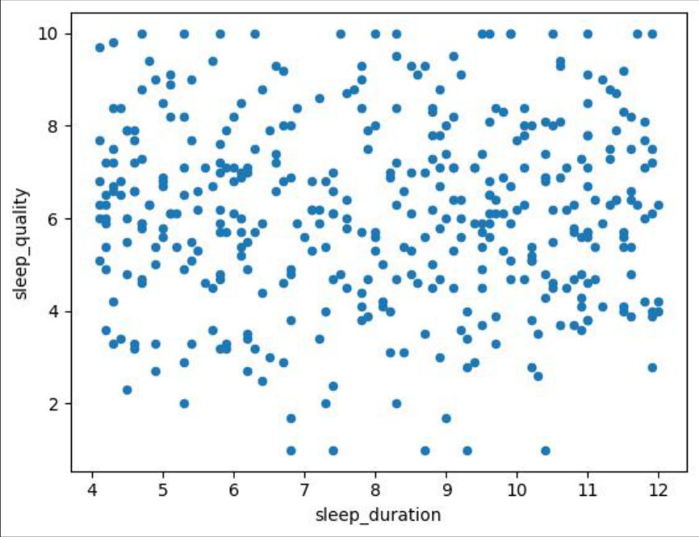


- **2**）蜂窝图

蜂窝图是散点图的扩展，通常用于表示大量数据点之间的关系。它通过将数据点分布在 一个六边形网格中，每个六边形的颜色代表其中的数据密度。适合展示大量数据点，避免了 散点图中的过度重叠问题。

绘制睡眠时间与睡眠质量的蜂窝图。

`df.plot.hexbin(x="sleep_duration", y="sleep_quality", gridsize=10)`


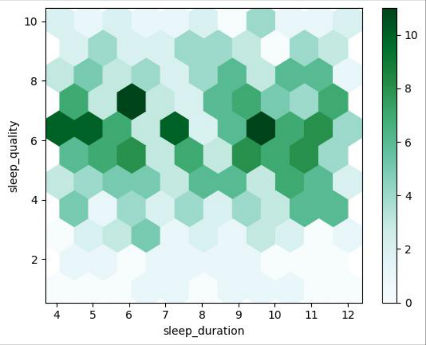


- **3**）堆叠图

堆叠图用于展示多个数据系列的累积变化。常见的堆叠图包括堆叠柱状图、堆叠面积图 等。它通过将每个数据系列堆叠在前一个系列之上，展示数据的累积情况。能够清晰地展示 不同部分的相对贡献，适合多个数据系列的比较。

绘制睡眠时间与睡眠质量的堆叠图。


```python
df["sleep_quality_stage"] = pd.cut(df["sleep_quality"], range(11))
df["sleep_duration_stage"] = pd.cut(df["sleep_duration"], [0, 5, 6, 7,
8, 9, 10, 11, 12])
df_pivot_table = df.pivot_table(
values="person_id", index="sleep_quality_stage",
columns="sleep_duration_stage", aggfunc="count"
)
df_pivot_table.plot.bar()
```


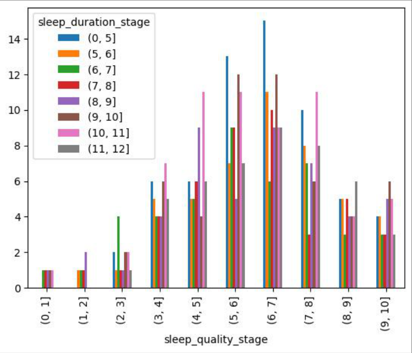


设置 stacked=True，会将柱体堆叠。

`df_pivot_table.plot.bar(stacked=True)`


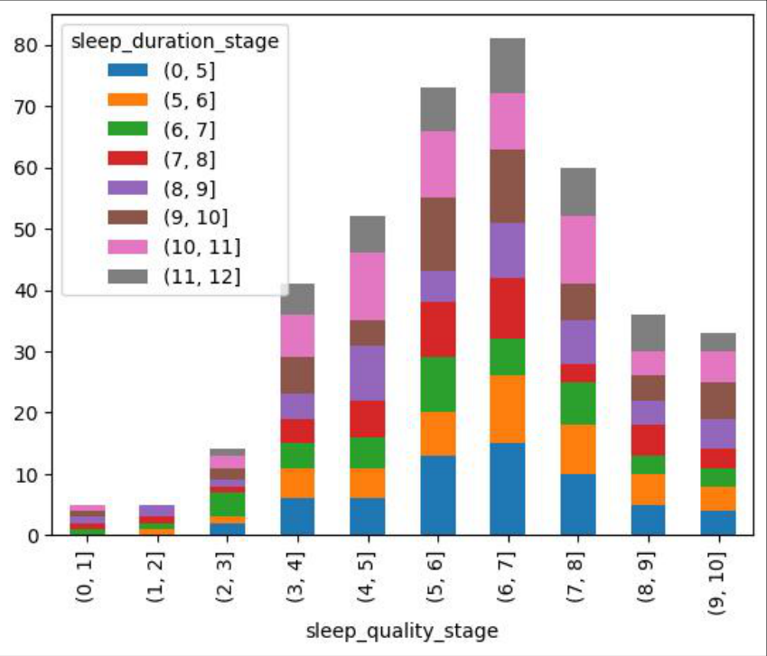


**4** ）折线图

`df_pivot_table.plot.line()`


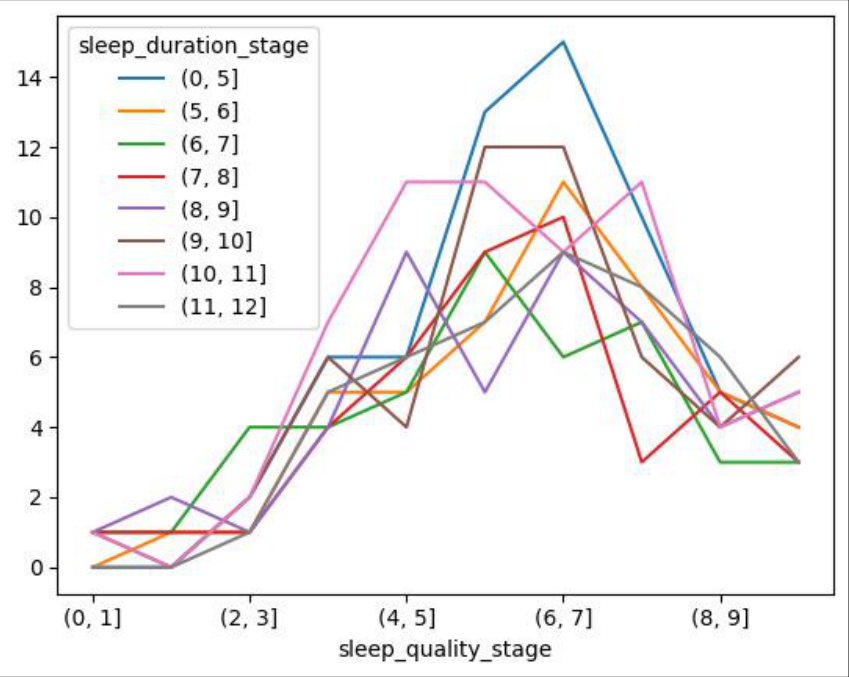


## **3.14 Seaborn** 可视化

## **3.14.1** 什么是 **Seaborn**

Seaborn 是一个基于 Matplotlib 的 Python 可视化库，旨在简化数据可视化的过程。它提 供了更高级的接口，用于生成漂亮和复杂的统计图表，同时也能保持与 Pandas 数据结构的 良好兼容性。

## **3.14.2** 单变量可视化

使用 penguins（企鹅�）数据集，其中包含 7 个字段：

- species：企鹅种类（Adelie、Gentoo、Chinstrap）。

- island：观测岛屿（Torgersen, Biscoe, Dream）。

- bill_length_mm：喙（嘴）长度（毫米）。

- bill_depth_mm：喙深度（毫米）。

- flipper_length_mm：脚蹼长度（毫米）。

- body_mass_g：体重（克）。

- sex：性别（Male、Female）。


加载数据：

import pandas as pd import seaborn as sns import matplotlib.pyplot as plt plt.rcParams["font.sans-serif"] = ["KaiTi"] penguins = pd.read_csv("data/penguins.csv") penguins.dropna(inplace=True) penguins.info() # <class 'pandas.core.frame.DataFrame'> # Index: 333 entries, 0 to 343 # Data columns (total 7 columns): # # Column Non-Null Count Dtype # ------------------------# 0 species 333 non-null object # 1 island 333 non-null object # 2 bill_length_mm 333 non-null float64 # 3 bill_depth_mm 333 non-null float64 # 4 flipper_length_mm 333 non-null float64 # 5 body_mass_g 333 non-null float64 # 6 sex 333 non-null object # dtypes: float64(4), object(3) # memory usage: 20.8+ KB

**1** ）直方图

绘制不同种类企鹅数量的直方图。

sns.histplot(data=penguins, x="species")


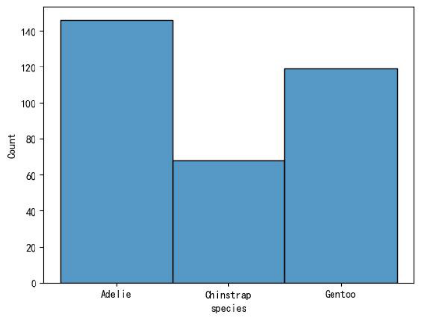


- **2**）核密度估计图

核密度估计图（KDE，Kernel Density Estimate Plot）是一种用于显示数据分布的统计图 表，它通过平滑直方图的方法来估计数据的概率密度函数，使得分布图看起来更加连续和平 滑。核密度估计是一种非参数方法，用于估计随机变量的概率密度函数。其基本思想是，将 每个数据点视为一个“核”（通常是高斯分布），然后将这些核的贡献相加以形成平滑的密 度曲线。

绘制喙长度的核密度估计图。

`sns.kdeplot(data=penguins, x="bill_length_mm")`


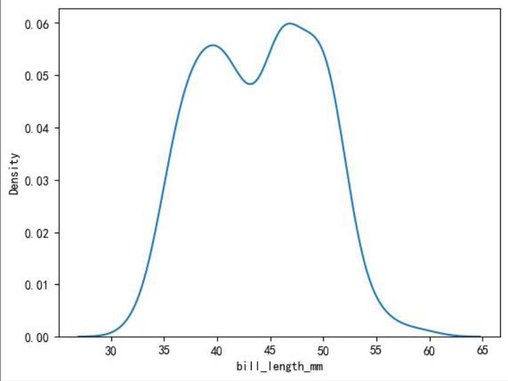


在 histplot()中设置 kde=True 也可以得到核密度估计图。

`sns.histplot(data=penguins, x="bill_length_mm", kde=True)`


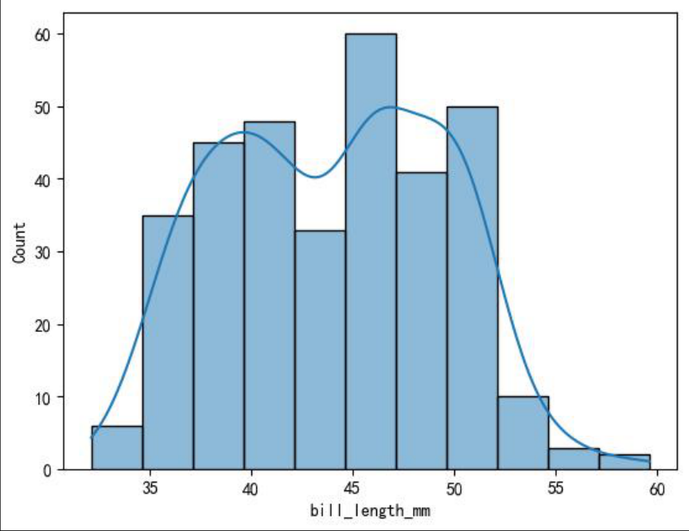


- **3**）计数图

计数图用于绘制分类变量的计数分布图，显示每个类别在数据集中出现的次数，是分析 分类数据非常直观的工具，可以快速了解类别的分布情况。

绘制不同岛屿企鹅数量的计数图。

`sns.countplot(data=penguins, x="island")`


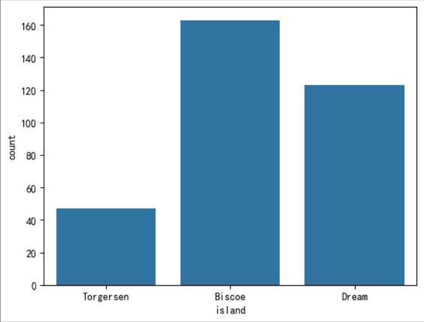


## **3.14.3** 双变量可视化

- **1**）散点图

绘制横轴为体重，纵轴为脚蹼长度的散点图。可通过 hue 参数设置不同组别进行对比。

```python
sns.scatterplot(data=penguins, x="body_mass_g", y="flipper_length_mm",
hue="sex")
```


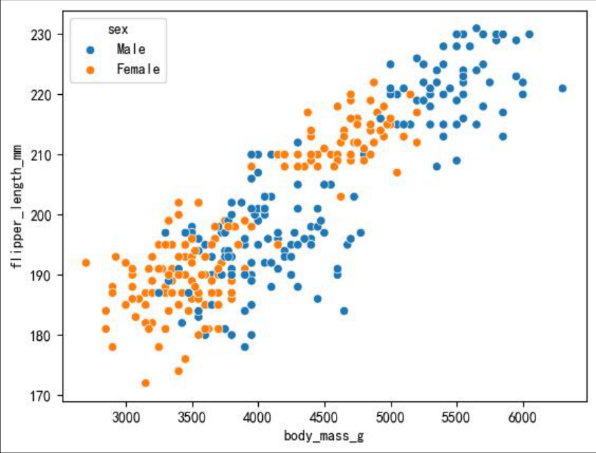


也可以通过 regplot()函数绘制散点图，同时会拟合回归曲线。可以通过 fit_reg=False 关 闭拟合。

`sns.regplot(data=penguins, x="body_mass_g", y="flipper_length_mm")`


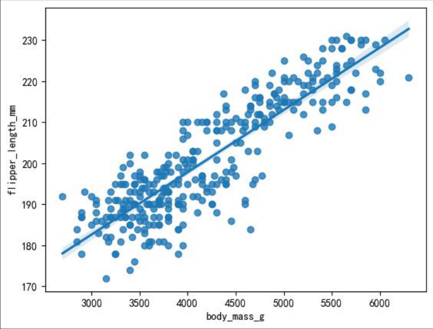


也可以通过 lmplot()函数绘制基于 hue 参数的分组回归图。


```python
sns.lmplot(data=penguins, x="body_mass_g", y="flipper_length_mm",
hue="sex")
```


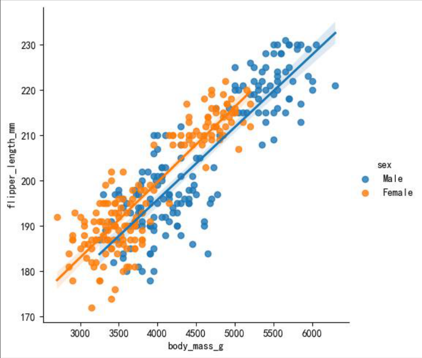


也可以通过 jointplot()函数绘制在每个轴上包含单个变量的散点图。

`sns.jointplot(data=penguins, x="body_mass_g", y="flipper_length_mm")`


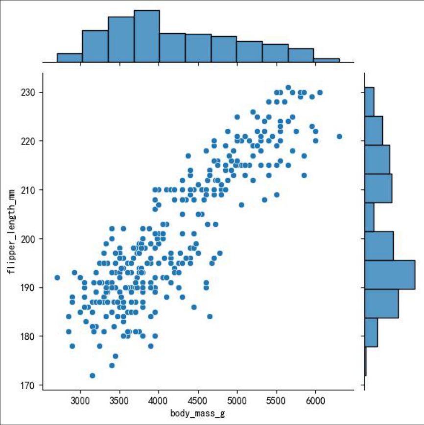


**2** ）蜂窝图

通过 jointplot()函数，设置 kind="hex"来绘制蜂窝图。


```python
sns.jointplot(data=penguins, x="body_mass_g", y="flipper_length_mm",
kind="hex")
```


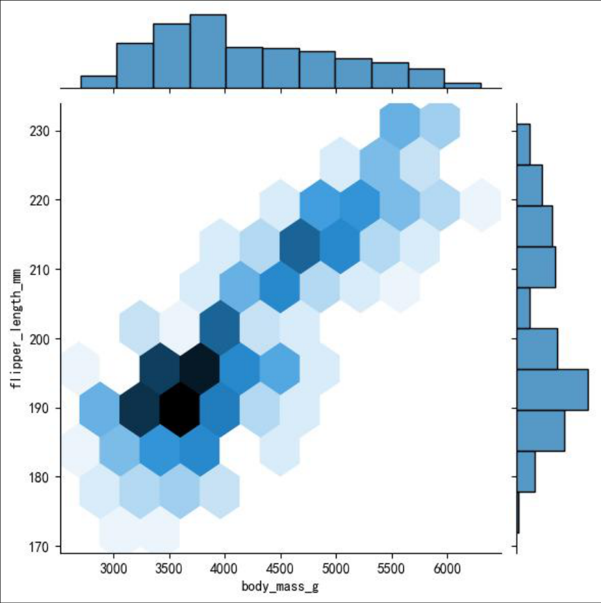


**3** ）二维核密度估计图

通过 kdeplot()函数，同时设置 x 参数和 y 参数来绘制二维核密度估计图。 `sns.kdeplot(data=penguins, x="body_mass_g", y="flipper_length_mm")`


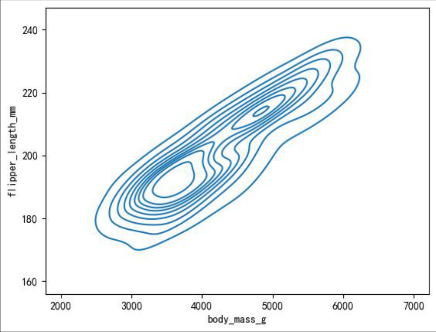


通过 fill=True 设置为填充，通过 cbar=True 设置显示颜色示意条。

```python
sns.kdeplot(data=penguins, x="body_mass_g", y="flipper_length_mm",
fill=True, cbar=True)
```


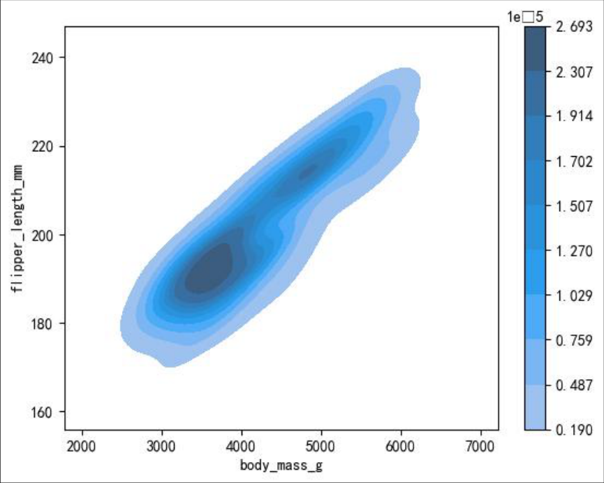


- **4**）条形图

条形图会按 x 分组对 y 进行聚合，通过 estimator 参数设置聚合函数，并通过 errorbar 设 置误差条，误差条默认会显示。可以通过误差条显示抽样数据统计结果的可能统计范围，如 果数据不是抽样数据, 可以设置为 None 来关闭误差条。

```python
sns.barplot(data=penguins, x="species", y="bill_length_mm",
estimator="mean", errorbar=None)
```


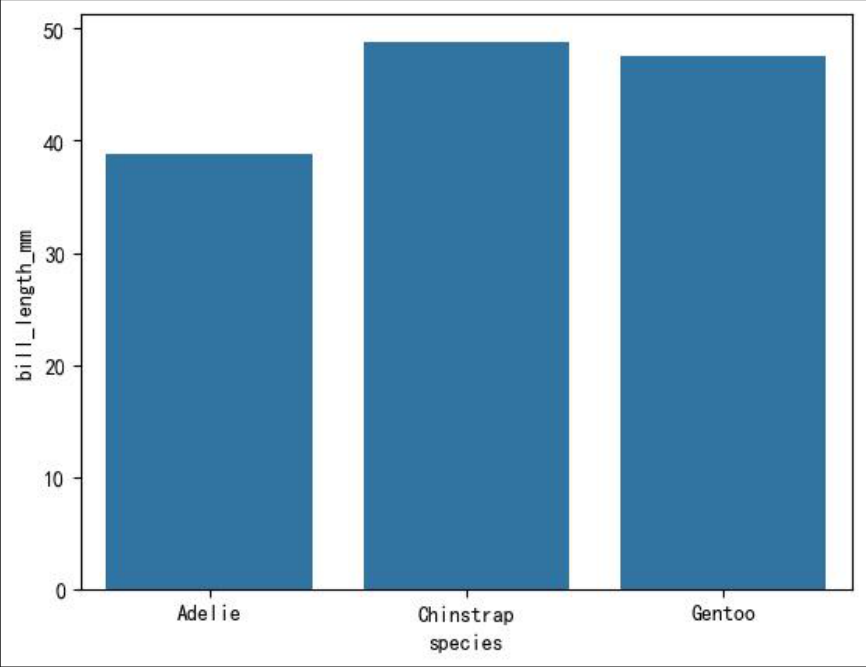


- **5**）箱线图

箱线图是一种用于展示数据分布、集中趋势、散布情况以及异常值的统计图表。它通过 五个关键的统计量（最小值、第一四分位数、中位数、第三四分位数、最大值）来展示数据 的分布情况。

箱线图通过箱体和须来表现数据的分布，能够有效地显示数据的偏斜、分散性以及异常

值。箱线图的组成部分：

- 箱体（Box）：

   - 下四分位数（Q1）：数据集下 25% 的位置，箱体的下边缘。

   - 上四分位数（Q3）：数据集下 75% 的位置，箱体的上边缘。

   - 四分位间距（IQR, Interquartile Range）：Q3 和 Q1 之间的距离，用来衡量数

据的离散程度。

   - 中位数（Median）：箱体内部的水平线，表示数据集的中位数。

- 须（Whiskers）：

   - 下须：从 Q1 向下延伸，通常是数据集中最小值与 Q1 的距离，直到没有超

过 1.5 倍 IQR 的数据点为止。


 上须：从 Q3 向上延伸，通常是数据集中最大值与 Q3 的距离，直到没有超 过 1.5 倍 IQR 的数据点为止。

 异常值（Outliers）：

 超过 1.5 倍 IQR 的数据被认为是异常值，通常用点标记出来。异常值是数据 中相对于其他数据点而言“非常大”或“非常小”的值。

`sns.boxplot(data=penguins, x="species", y="bill_length_mm")`


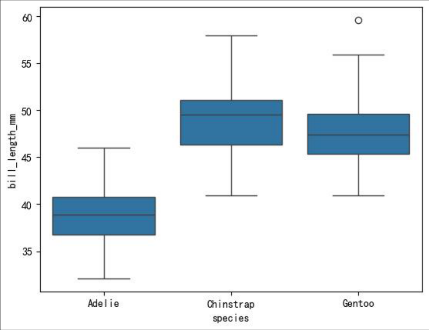


**6** ）小提琴图

小提琴图（Violin Plot）是一种结合了箱线图和核密度估计图（KDE）的可视化图表， 用于展示数据的分布情况、集中趋势、散布情况以及异常值。小提琴图不仅可以显示数据的 基本统计量（如中位数和四分位数），还可以展示数据的概率密度，提供比箱线图更丰富的 信息。 `sns.violinplot(data=penguins, x="species", y="bill_length_mm")`


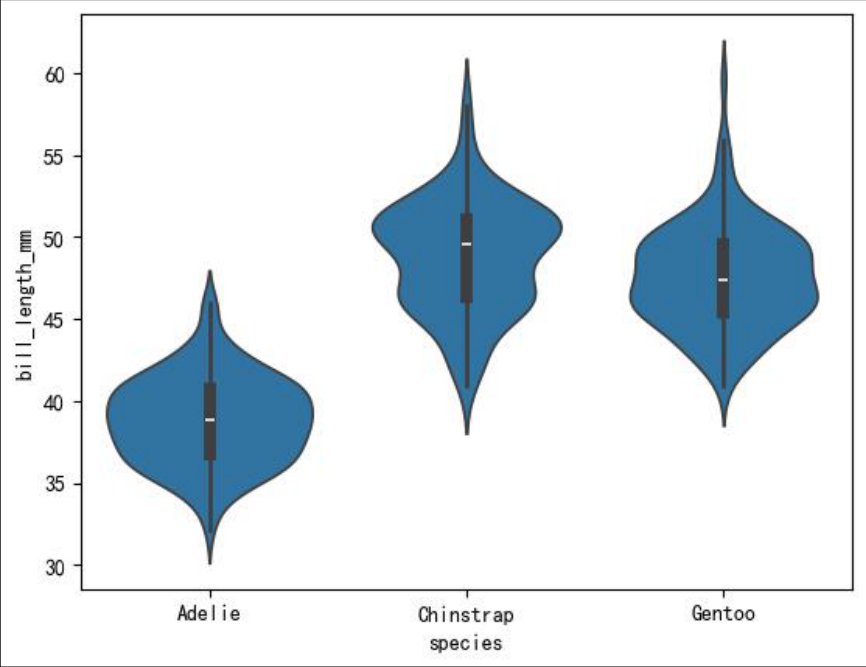


- **7**）成对关系图

成对关系图是一种用于显示多个变量之间关系的可视化工具。它可以展示各个变量之间 的成对关系，并且通过不同的图表形式帮助我们理解数据中各个变量之间的相互作用。

对角线上的图通常显示每个变量的分布（如直方图或核密度估计图），帮助观察每个变

量的单变量特性。其他位置展示所有变量的两两关系，用散点图表示。 `sns.pairplot(data=penguins, hue="species")`


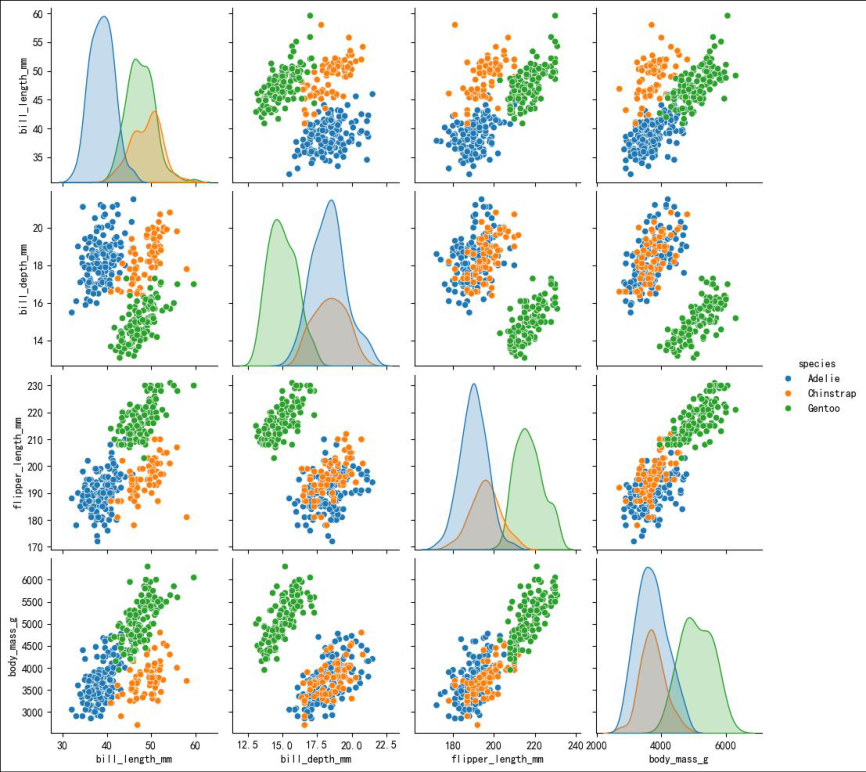


通常情况下成对关系图左上和右下对应位置的图的信息是相同的，可以通过 PairGrid()

为每个区域设置不同的图类型。


```python
pair_grid = sns.PairGrid(data=penguins, hue="species")
# 通过map 方法在网格上绘制不同的图形
pair_grid.map_upper(sns.scatterplot)
# 上三角部分使用散点图
pair_grid.map_lower(sns.kdeplot)
# 下三角部分使用核密度估计图
pair_grid.map_diag(sns.histplot)
```

 # 对角线部分使用直方图


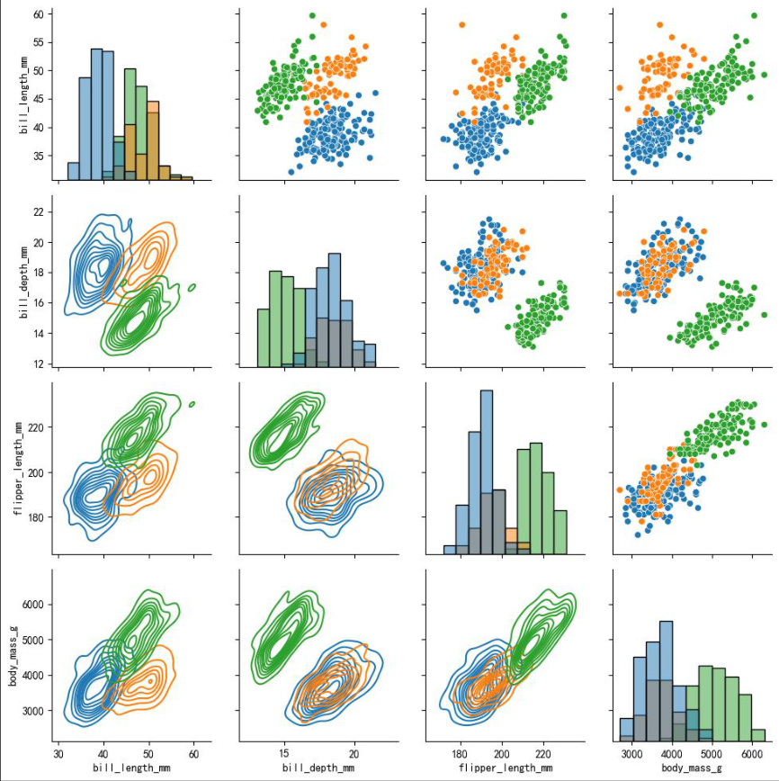


## **3.14.4** 多变量可视化

多数绘图函数都支持使用 hue 参数设置一个类别变量，统计时按此类别分组统计并在绘 图时使用颜色区分。

例如对小提琴图设置 hue 参数添加性别类别：


```python
sns.violinplot(data=penguins, x="species", y="bill_length_mm",
hue="sex", split=True)
```


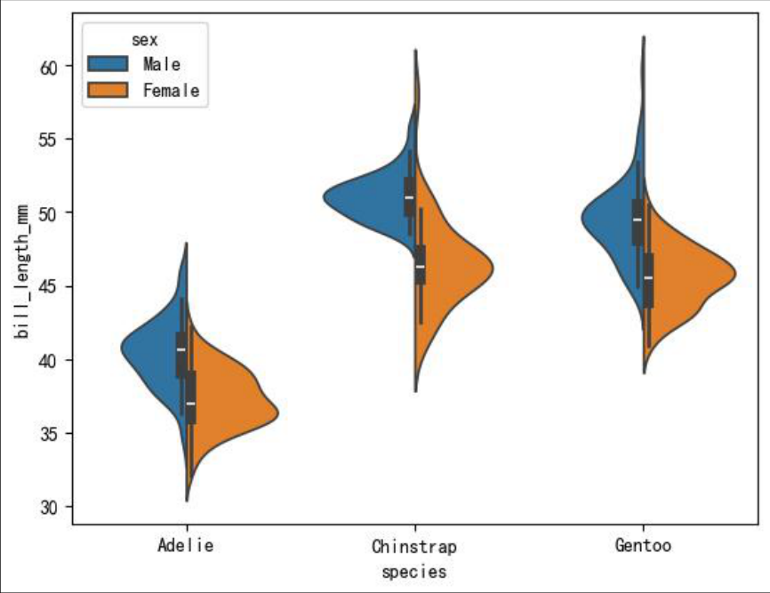


## **3.14.5 Seaborn** 样式

在 Seaborn 中，样式（style）控制了图表的整体外观，包括背景色、网格线、刻度线等 元素。Seaborn 提供了一些内置的样式选项，可以通过 seaborn.set_style()来设置当前图表的 样式。常见的样式有以下几种：

- **white** ： 纯白背景，没有网格线。

- **dark** ： 深色背景，带有网格线。

- **whitegrid** ： 白色背景，带有网格线。

- **darkgrid** ： 深色背景，带有网格线（默认样式）。


```python
sns.set_style("darkgrid")
sns.histplot(data=penguins, x="island", kde=True)
```


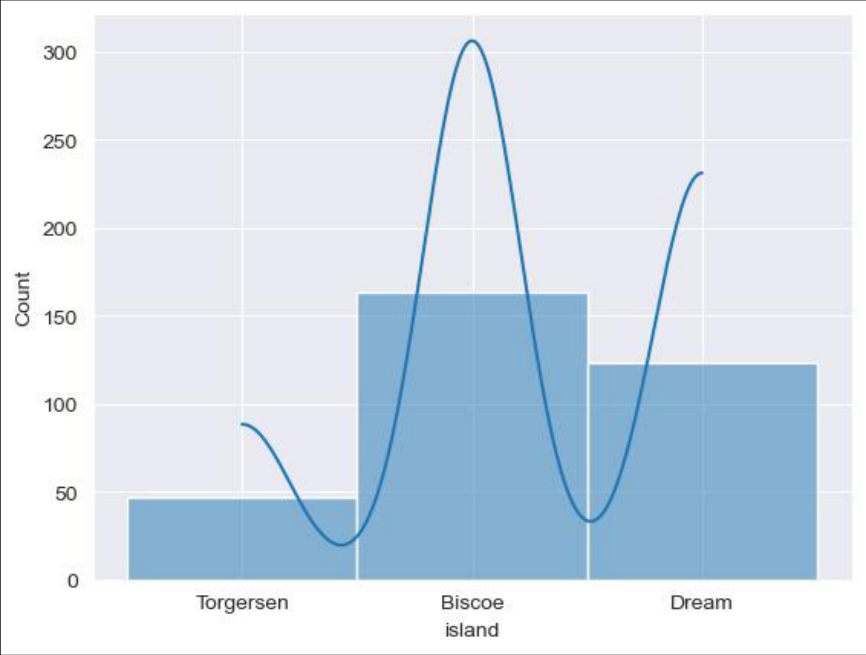


# 第 **4** 章综合案例：房地产市场洞察与价值评估

## **4.1** 业务背景

在房地产市场中，准确的房价预测和深入的市场分析对于房产开发商、投资者以及购房 者都至关重要。房产开发商需要根据市场趋势和不同因素对房价的影响来制定合理的定价策 略，优化项目规划；投资者需要评估房产的潜在价值和投资回报率，做出明智的投资决策； 购房者则希望了解市场行情，找到性价比高的房产。

某大型房地产数据研究机构收集了大量不同地区的房屋销售数据，这些数据包含了房屋 的各种属性信息以及销售相关信息。为了更好地服务于市场参与者，该机构计划对这些数据 进行全面深入的分析，挖掘数据背后的规律和价值。具体目标包括：

- 探究不同房屋特征（如卧室数量、浴室数量、居住面积等）对房价的影响程度，以 便为房价预测模型提供依据。

- 分析不同地区（以邮政编码划分）的房地产市场差异，了解各地区的房价水平、市 场活跃度等情况。


- 研究房屋的建造年份、翻新年份等时间因素对房价的影响，以及不同时间段的市场 趋势变化。

 通过可视化手段直观展示数据的分布和关系，为决策提供清晰的参考。

## **4.2** 数据源介绍

|字段名|含义|数据类型|说明|
|---|---|---|---|
|**id**|房屋销售记录的唯一标<br>识符|整数|用于唯一标识每一<br>条房屋销售记录|
|**date**|房屋销售日期|日期时间类型|记录房屋实际完成<br>销售的日期，可用于<br>时间序列分析，观察<br>不同时间段的市场<br>趋势|
|**price**|房屋销售价格|数值型|反映房屋在销售时<br>的成交金额，是分析<br>的核心指标之一，受<br>多种房屋特征和市<br>场因素影响|
|**bedrooms**|卧室数量|整数|体现房屋的居住功<br>能布局，卧室数量的<br>多少会影响房屋的<br>整体实用性和市场<br>需求|
|**bathrooms**|浴室数量|整数|同样是影响房屋舒<br>适度和实用性的重<br>要因素，与卧室数量<br>共同影响房屋的居<br>住体验|
|**sqft_living**|居住面积（平方英尺）|数值型|指房屋内部可供居<br>住使用的实际面积，<br>是影响房价的关键<br>因素之一|
|**sqft_lot**|土地面积（平方米）|数值型|包括房屋所在土地<br>的总面积，土地面积<br>大小会影响房屋的<br>整体价值和使用空<br>间|
|**floors**|楼层数|整数|房屋的楼层数量会<br>影响房屋的视野、采<br>光、私密性等方面，<br>进而对房价产生影<br>响|


|**waterfront**|是否临水|整数（0 或1）|0 表示房屋不临水，<br>1 表示房屋临水，临<br>水房屋通常具有更<br>高的景观价值和市<br>场价格|
|---|---|---|---|
|**view**|景观评分|整数（0 - 4）|对房屋周边景观的<br>评分，评分越高表示<br>景观越好，景观质量<br>会影响房屋的吸引<br>力和价格|
|**condition**|房屋状况评分|整数（1 - 5）|反映房屋的整体状<br>况，包括房屋的结<br>构、装修、设施等方<br>面的维护情况|
|**grade**|房屋整体质量评分|整数（1 - 13）|综合评估房屋的建<br>筑质量、设计水平等<br>因素，是衡量房屋价<br>值的重要指标|
|**sqft_above**|地上面积（平方米）|数值型|指房屋地面以上部<br>分的建筑面积，不包<br>括地下室面积|
|**sqft_basement**|地下室面积（平方米）|数值型|地下室面积可作为<br>额外的存储空间或<br>功能区域，对房屋的<br>实用性和价值有一<br>定影响|
|**yr_built**|建造年份|整数|记录房屋的建成时<br>间，房屋的建造年份<br>会影响房屋的折旧<br>程度、建筑风格和市<br>场竞争力|
|**yr_renovated**|翻新年份|整数|0 表示房屋未进行<br>过翻新，非0 值表<br>示房屋进行翻新的<br>具体年份，翻新可以<br>提升房屋的价值和<br>居住体验|
|**zipcode**|邮政编码|整数|用于标识房屋所在<br>的地理位置区域，不<br>同的邮政编码区域<br>可能具有不同的市<br>场特征和房价水平|
|**lat**|纬度|数值型|房屋所在位置的纬<br>度坐标，结合经度可|


||||确定房屋的具体地<br>理位置|
|---|---|---|---|
|**long**|经度|数值型|房屋所在位置的经|
||||度坐标，与纬度共同|
||||用于地理空间分析|


## **4.3** 待统计指标及说明

## **4.3.1** 数值型列的描述性统计指标

- 均值（Mean）：一组数据的平均值，反映数据的集中趋势。例如，房价的均值可以 让我们了解该地区房屋的平均销售价格水平。

- 中位数（Median）：将数据按升序或降序排列后，位于中间位置的数值。当数据存 在极端值时，中位数比均值更能代表数据的一般水平。

- 标准差（Standard Deviation）：衡量数据相对于均值的离散程度。标准差越大，说 明数据越分散；反之，则越集中。比如房价的标准差可以反映该地区房价的波动情 况。

- 最小值（Minimum）：数据集中的最小数值，可用于了解数据的下限。

- 最大值（Maximum）：数据集中的最大数值，可用于了解数据的上限。

- 四分位数（Quartiles）：包括第一四分位数（Q1，25% 分位数）、第二四分位数（Q2， 即中位数，50% 分位数）和第三四分位数（Q3，75% 分位数），能帮助了解数据 的分布情况。

## **4.3.2** 不同特征与房价的相关性

- 使用皮尔逊相关系数衡量特征与房价之间的线性关系强度和方向，系数绝对值越接 近 1，相关性越强；正系数表示正相关，负系数表示负相关。

## **4.3.3** 按邮政编码、是否翻新、房龄分组的统计指标

- 平均房价：各邮政编码区域内房屋的平均销售价格，用于对比不同区域的房价水平。

- 平均居住面积：各区域内房屋居住面积的平均值，反映区域房屋规模情况。

- 平均卧室数量：各区域内房屋卧室数量的平均值，体现区域房屋居住功能布局。

## **4.3.4** 时间序列分析指标

- 每年平均房价（Average Price per Year）：按销售年份分组计算的房屋平均销售价 格，可用于观察房价随时间的变化趋势。


## **4.4** 代码实现步骤

## **4.4.1** 数据读取

- **1**）代码


```python
import pandas as pd
import numpy as np
import matplotlib.pyplot as plt
from matplotlib import rcParams
rcParams["font.sans-serif"] = ["SimHei"]
# 指定中文字体
# 读取CSV 文件
data = pd.read_csv('E:\\大模型课程\\05_尚硅谷大模型技术之Numpy&Pandas\\2.
资料\\data\\house_sales.csv')
print('数据基本信息：')
data.info()
```


**2** ）代码说明

使用 pandas 的 read_csv 函数读取 house_sales.csv 文件，将数据存储在 DataFrame 对 象 data 中，方便后续处理，并查看数据基本信息。

## **4.4.2** 数据清洗

**1** ）代码

检查缺失值

```python
missing_values = data.isnull().sum()
print('各列缺失值数量：')
print(missing_values)
# 处理缺失值，这里简单地删除包含缺失值的行
data = data.dropna()
# 检查异常值，以房价为例，使用IQR 方法
Q1 = data['price'].quantile(0.25)
Q3 = data['price'].quantile(0.75)
IQR = Q3 - Q1
lower_bound = Q1 - 1.5 * IQR
upper_bound = Q3 + 1.5 * IQR
```


```python
data = data[(data['price'] >= lower_bound) & (data['price'] <=
upper_bound)]
```


- **2**）代码说明

缺失值处理：使用 isnull().sum() 统计各列缺失值数量，然后用 dropna() 删除包含缺失值 的行。

异常值处理：使用 IQR（Inter - Quartile Range，四分位距）方法来检测和处理房价数据 中的异常值。以房价为例，通过计算第一四分位数 Q1、第三四分位数 Q3 和四分位距 IQR， 确定上下限，筛选出合理范围内的数据。

- data['price'].quantile(0.25) ： quantile 是 pandas 中用于计算分位数的方法。这 里 0.25 表示计算 25% 分位数，也就是第一四分位数 Q1。第一四分位数意味着有 25% 的数据小于这个值。

- data['price'].quantile(0.75)：同理，0.75 表示计算 75% 分位数，即第三四分位数 Q3。 有 75% 的数据小于这个值。

- 四分位距 IQR 是第三四分位数 Q3 与第一四分位数 Q1 的差值。它衡量了数据中间 50% 的数据的分散程度。

- lower_bound：通过 Q1 - 1.5 * IQR 计算出异常值的下限。如果某个数据点小于这个 下限，就可能被视为异常值。

- upper_bound：通过 Q3 + 1.5 * IQR 计算出异常值的上限。如果某个数据点大于这个 上限，也可能被视为异常值。

- 这里的 1.5 是一个常用的系数，在很多情况下可以有效地识别出大部分异常值，但 在某些特殊场景下可能需要调整。

- 使用布尔索引来筛选数据。 (data['price'] >= lower_bound) & (data['price'] <= upper_bound) 表示筛选出 price 列中值大于等于下限且小于等于上限的数据，将这 些数据重新赋值给 data，从而去除了可能的异常值。

## **4.4.3** 数据类型转换

- **1**）代码

将日期列转换为日期类型

`data['date'] = pd.to_datetime(data['date'])`

**2** ）代码说明


使用 pandas 的 to_datetime 函数将 date 列转换为日期类型，便于进行时间序列分析。

## **4.4.4** 创建新的特征

- **1**）代码

计算房屋的使用年限


```python
data['age'] = data['date'].dt.year - data['yr_built']
# 创建新特征：是否翻新
data['is_renovated'] = data['yr_renovated'].apply(lambda x: 1 if x > 0
else 0)
```


- **2**）代码说明

计算房屋使用年限：通过销售日期的年份减去建造年份，得到房屋的使用年限，存储在

新列 age 中，这个特征可能会对房价产生影响。

创建是否翻新特征：使用 apply 方法和 lambda 函数对 yr_renovated 列进行判断，若值大 于 0 则表示房屋已翻新，将 is_renovated 列对应的值设为 1，否则设为 0，以便后续分析翻 新因素对房价的影响。

## **4.4.5** 数据探索性分析 **-** 描述性统计

- **1**）代码

选择数值型列


```python
numeric_columns = data.select_dtypes(include=[np.number]).columns
# 计算描述性统计信息
description = data[numeric_columns].describe(percentiles=[0.25, 0.5,
0.75])
print('数值型列的描述性统计：')
print(description)
```


- **2**）代码说明

data.select_dtypes(include=[np.number]) 选择数据集中的数值型列，并获取其列名存储

在 numeric_columns 中。

data[numeric_columns].describe(percentiles=[0.25, 0.5, 0.75]) 计算数值型列的描述性统计

信息，包括均值、中位数、标准差、最小值、最大值、四分位数等，并将结果存储在 description 中， 帮助我们了解各数值特征的分布情况。

## **4.4.6** 数据探索性分析 **-** 相关性统计

- **1**）代码


计算不同特征与房价的相关性

```python
correlation = data[numeric_columns].corr()
print('各特征与房价的相关性：')
print(correlation['price'])
```


**2** ）代码说明

对数值型列使用 corr 方法计算相关系数矩阵，提取 price 列得到各特征与房价的相关性。

## **4.4.7** 按照邮政编码分组分析

- **1**）代码

按邮政编码分组，计算每组的平均房价、平均居住面积、平均卧室数量

```python
zipcode_stats = data.groupby('zipcode').agg({
'price': 'mean',
'sqft_living': 'mean',
'bedrooms': 'mean'
})
zipcode_stats.columns = ['avg_price', 'avg_sqft_living',
'avg_bedrooms']
print('不同邮政编码区域的统计信息：')
print(zipcode_stats)
```


**2** ）代码说明

使用 data.groupby('zipcode') 按邮政编码对数据进行分组。

agg 方法对分组后的数据进行聚合操作，分别计算每组的平均房价、平均居住面积和平

均卧室数量。

对结果的列名进行重命名，使其更具可读性，并打印输出，可对比不同邮政编码区域的 房屋特征情况。

## **4.4.8** 按照是否翻新分组分析

**1** ）代码

按是否翻新分组，计算每组的平均房价、平均居住面积、平均卧室数量

```python
renovation_stats = data.groupby('is_renovated').agg({
'price': 'mean',
'sqft_living': 'mean',
'bedrooms': 'mean'
})
renovation_stats.columns = ['avg_price', 'avg_sqft_living',
'avg_bedrooms']
```


```python
print('是否翻新分组的统计信息：')
print(renovation_stats)
```


- **2**）代码说明

按 is_renovated 特征对数据进行分组，分析翻新和未翻新房屋在房价、居住面积和卧室 数量等方面的差异。同样使用 agg 方法进行聚合计算，得到相应的统计信息并打印。

## **4.4.9** 按照房龄分组分析

**1** ）代码


```python
# 按房屋使用年限分组（简单分为5 个区间）
data['age_group'] = pd.cut(data['age'], bins=5)
age_stats = data.groupby('age_group').agg({
'price': 'mean',
'sqft_living': 'mean',
'bedrooms': 'mean'
})
print('按房屋使用年限分组的统计信息：')
print(age_stats)
```


**2** ）代码说明

使用 pd.cut 函数将房屋使用年限 age 划分为 5 个区间，创建新列 age_group。

按 age_group 分组，计算每组的平均房价、平均居住面积和平均卧室数量，了解不同使 用年限房屋的特征差异。

## **4.4.10** 时间序列分析 **-** 每年平均房价

- **1**）代码

按年份分组，计算每年的平均房价

```python
yearly_avg_price = data.groupby(data['date'].dt.year)['price'].mean()
print('每年的平均房价：')
print(yearly_avg_price)
```

 **2** ）代码说明

使用 data.groupby(data['date'].dt.year) 按销售日期的年份对数据进行分组。

对每组的 price 列计算均值，得到每年的平均房价，并存储在 yearly_avg_price 中进行打

印输出，可观察房价随时间的变化趋势。

## **4.4.11** 时间序列分析 **-** 不同翻新情况平均房价

**1** ）代码


按年份和是否翻新分组，计算每年不同翻新情况的平均房价

```python
yearly_renovation_avg_price = data.groupby([data['date'].dt.year,
'is_renovated'])['price'].mean()
print('每年不同翻新情况的平均房价：')
print(yearly_renovation_avg_price)
```


- **2**）代码说明

按销售年份和是否翻新进行分组，计算每年翻新和未翻新房屋的平均房价，能让我们看 到在不同年份，翻新因素对房价的影响变化。

## **4.4.12** 可视化

- **1**）房价分布直方图

房价分布直方图

```python
plt.figure(figsize=(10, 6))
plt.hist(data['price'], bins=30, edgecolor='k')
plt.title('房价分布直方图')
plt.xlabel('房价')
plt.ylabel('频数')
plt.show()
```


使用 plt.hist 函数绘制房价的分布直方图，bins=30 控制柱子的数量，edgecolor='k' 为柱 子添加黑色边框。添加标题和坐标轴标签，使图形更易理解，最后使用 plt.show() 显示图形。

- **2**）卧室数量与房价的散点图

卧室数量与房价的散点图

```python
plt.figure(figsize=(10, 6))
plt.scatter(data['bedrooms'], data['price'])
plt.title('卧室数量与房价的关系')
plt.xlabel('卧室数量')
plt.ylabel('房价')
plt.show()
```


使用 plt.scatter 函数绘制卧室数量与房价的散点图，直观展示两者之间的关系。

- **3**）各特征与房价的相关性热力图

各特征与房价的相关性热力图

```python
plt.figure(figsize=(12, 8))
plt.imshow(correlation, cmap='coolwarm', interpolation='nearest')
plt.colorbar()
plt.xticks(range(len(correlation.columns)), correlation.columns,
rotation=90)
```


```python
plt.yticks(range(len(correlation.columns)), correlation.columns)
plt.title('各特征与房价的相关性热力图')
plt.show()
```


使用 plt.imshow 函数绘制相关性热力图， cmap='coolwarm' 设置颜色映射， interpolation='nearest' 控制插值方式。添加颜色条和坐标轴标签，显示各特征与房价的相关性， 最后显示图形。

- **4**）不同邮政编码区域平均房价的柱状图

不同邮政编码区域平均房价的柱状图

```python
plt.figure(figsize=(12, 6))
plt.bar(zipcode_stats.index.astype(str), zipcode_stats['avg_price'])
plt.title('不同邮政编码区域的平均房价')
plt.xlabel('邮政编码')
plt.ylabel('平均房价')
plt.xticks(rotation=45)
plt.show()
```


使用 plt.bar 函数绘制不同邮政编码区域平均房价的柱状图，将 zipcode 转换为字符串类

型。设置图形标题和坐标轴标签，旋转 x 轴标签避免重叠后显示图形。

- **5**）每年平均房价的折线图

每年平均房价的折线图

```python
plt.figure(figsize=(10, 6))
plt.plot(yearly_avg_price.index, yearly_avg_price)
plt.title('每年平均房价趋势')
plt.xlabel('年份')
plt.ylabel('平均房价')
plt.show()
```


使用 plt.plot 函数绘制每年平均房价的折线图，展示房价随时间的变化趋势。

- **6**）不同翻新情况的房价箱线图

不同翻新情况的房价箱线图

```python
plt.figure(figsize=(10, 6))
data.boxplot(column='price', by='is_renovated')
plt.title('不同翻新情况的房价箱线图')
plt.xlabel('是否翻新')
plt.xticks([1, 2], ['未翻新', '已翻新'])
plt.ylabel('房价')
plt.suptitle('')
```

 # 去掉默认的标题


`plt.show()`

使用 data.boxplot 方法绘制不同翻新情况的房价箱线图，展示翻新和未翻新房屋房价的

分布情况

- **7**）房屋使用年限与房价的散点图

房屋使用年限与房价的散点图 plt.figure(figsize=(10, 6)) plt.scatter(data['age'], data['price']) plt.title('房屋使用年限与房价的关系') plt.xlabel('房屋使用年限') plt.ylabel('房价') plt.show()

使用 plt.scatter 函数绘制房屋使用年限与房价的散点图，观察两者之间的关系。

## **4.4.13** 完整代码

import pandas as pd import numpy as np import matplotlib.pyplot as plt from matplotlib import rcParams rcParams["font.sans-serif"] = ["SimHei"] # 指定中文字体

读取 CSV 文件 data = pd.read_csv('E:\\大模型课程\\05_尚硅谷大模型技术之 Numpy&Pandas\\2. 资料\\data\\house_sales.csv') print('数据基本信息：') data.info()


检查缺失值

```python
missing_values = data.isnull().sum()
print('各列缺失值数量：')
print(missing_values)
# 处理缺失值，这里简单地删除包含缺失值的行
data = data.dropna()
# 检查异常值，以房价为例，使用IQR 方法
Q1 = data['price'].quantile(0.25)
```


```python
Q3 = data['price'].quantile(0.75)
IQR = Q3 - Q1
lower_bound = Q1 - 1.5 * IQR
upper_bound = Q3 + 1.5 * IQR
data = data[(data['price'] >= lower_bound) & (data['price'] <=
upper_bound)]
# 将日期列转换为日期类型
data['date'] = pd.to_datetime(data['date'])
```

 # 计算房屋的使用年限

```python
data['age'] = data['date'].dt.year - data['yr_built']
# 创建新特征：是否翻新
data['is_renovated'] = data['yr_renovated'].apply(lambda x: 1 if x > 0
else 0)
```


选择数值型列

```python
numeric_columns = data.select_dtypes(include=[np.number]).columns
# 计算描述性统计信息
description = data[numeric_columns].describe(percentiles=[0.25, 0.5,
0.75])
print('数值型列的描述性统计：')
print(description)
```

 # 计算不同特征与房价的相关性

```python
correlation = data[numeric_columns].corr()
print('各特征与房价的相关性：')
print(correlation['price'])
```

 # 按邮政编码分组，计算每组的平均房价、平均居住面积、平均卧室数量

```python
zipcode_stats = data.groupby('zipcode').agg({
'price': 'mean',
'sqft_living': 'mean',
'bedrooms': 'mean'
})
```


```python
zipcode_stats.columns = ['avg_price', 'avg_sqft_living',
'avg_bedrooms']
print('不同邮政编码区域的统计信息：')
print(zipcode_stats)
# 按是否翻新分组，计算每组的平均房价、平均居住面积、平均卧室数量
renovation_stats = data.groupby('is_renovated').agg({
'price': 'mean',
'sqft_living': 'mean',
'bedrooms': 'mean'
})
renovation_stats.columns = ['avg_price', 'avg_sqft_living',
'avg_bedrooms']
print('是否翻新分组的统计信息：')
print(renovation_stats)
# 按房屋使用年限分组（简单分为5 个区间）
data['age_group'] = pd.cut(data['age'], bins=5)
age_stats = data.groupby('age_group').agg({
'price': 'mean',
'sqft_living': 'mean',
'bedrooms': 'mean'
})
print('按房屋使用年限分组的统计信息：')
print(age_stats)
# 按年份分组，计算每年的平均房价
yearly_avg_price = data.groupby(data['date'].dt.year)['price'].mean()
print('每年的平均房价：')
print(yearly_avg_price)
# 按年份和是否翻新分组，计算每年不同翻新情况的平均房价
yearly_renovation_avg_price = data.groupby([data['date'].dt.year,
'is_renovated'])['price'].mean()
print('每年不同翻新情况的平均房价：')
print(yearly_renovation_avg_price)
```

 # 房价分布直方图


```python
plt.figure(figsize=(10, 6))
plt.hist(data['price'], bins=30, edgecolor='k')
plt.title('房价分布直方图')
plt.xlabel('房价')
plt.ylabel('频数')
plt.show()
# 卧室数量与房价的散点图
plt.figure(figsize=(10, 6))
plt.scatter(data['bedrooms'], data['price'])
plt.title('卧室数量与房价的关系')
plt.xlabel('卧室数量')
plt.ylabel('房价')
plt.show()
# 各特征与房价的相关性热力图
plt.figure(figsize=(12, 8))
plt.imshow(correlation, cmap='coolwarm', interpolation='nearest')
plt.colorbar()
plt.xticks(range(len(correlation.columns)), correlation.columns,
rotation=90)
plt.yticks(range(len(correlation.columns)), correlation.columns)
plt.title('各特征与房价的相关性热力图')
plt.show()
# 不同邮政编码区域平均房价的柱状图
plt.figure(figsize=(12, 6))
plt.bar(zipcode_stats.index.astype(str), zipcode_stats['avg_price'])
plt.title('不同邮政编码区域的平均房价')
plt.xlabel('邮政编码')
plt.ylabel('平均房价')
plt.xticks(rotation=45)
plt.show()
# 每年平均房价的折线图
plt.figure(figsize=(10, 6))
plt.plot(yearly_avg_price.index, yearly_avg_price)
plt.title('每年平均房价趋势')
```


```python
plt.xlabel('年份')
plt.ylabel('平均房价')
plt.show()
# 不同翻新情况的房价箱线图
plt.figure(figsize=(10, 6))
data.boxplot(column='price', by='is_renovated')
plt.title('不同翻新情况的房价箱线图')
plt.xlabel('是否翻新')
plt.xticks([1, 2], ['未翻新', '已翻新'])
plt.ylabel('房价')
plt.suptitle('')
# 去掉默认的标题
plt.show()
# 房屋使用年限与房价的散点图
plt.figure(figsize=(10, 6))
plt.scatter(data['age'], data['price'])
plt.title('房屋使用年限与房价的关系')
plt.xlabel('房屋使用年限')
plt.ylabel('房价')
plt.show()
```


