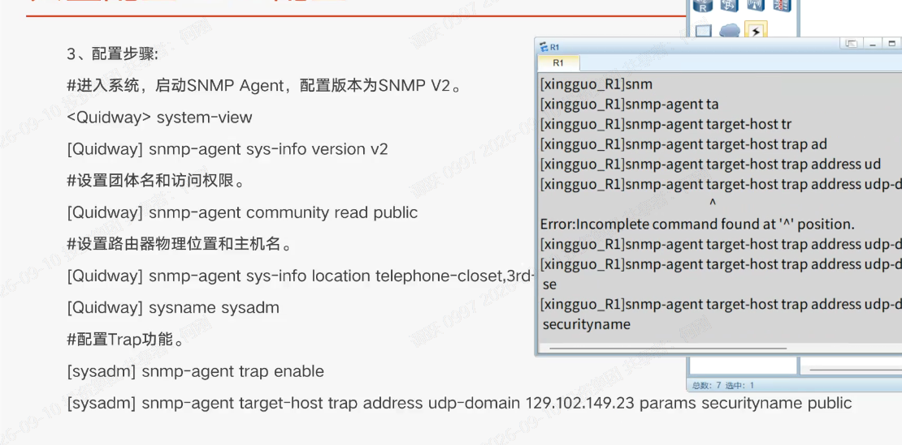

# SNMP 配置与 VRP 命令行补全机制

> 来源：eNSP 上敲 `snmp-agent target-host trap ...` 时遇到 `Error: Incomplete command found at '^' position.`
> 本文解决三件事：**这条报错为什么出现**、**这条 SNMP 命令到底在配什么**、**VRP 命令行该怎么正确地偷懒**。



---

## 一、一句话结论

**`udp-d` 只是关键字 `udp-domain` 的前缀，还没敲完整就按了回车。**
VRP 里回车 = 尝试执行，Tab = 补全。报错里的 `^` 指的就是"命令在这里断了"，后面必填的 IP 地址和 `params securityname` 也都没给。

---

## 二、场景还原

右侧命令行是逐级测试 Tab 补全的过程记录（可原样复现）：

```
[xingguo_R1]snmp                                          ← 按 Tab → snmp-agent
[xingguo_R1]snmp-agent ta                                 ← 按 Tab → target-host
[xingguo_R1]snmp-agent target-host tr                     ← 按 Tab → trap
[xingguo_R1]snmp-agent target-host trap ad                ← 按 Tab → address
[xingguo_R1]snmp-agent target-host trap address ud        ← 按 Tab → udp-domain
[xingguo_R1]snmp-agent target-host trap address udp-d     ← ❌ 这里按了回车，报错
                                                  ^
Error: Incomplete command found at '^' position.
```

这个练法本身是对的（逐级前缀 + Tab 是熟悉命令树最快的办法），出问题的只是最后一步按错了键。

---

## 三、报错解析：`Incomplete command found at '^' position.`

### 1. 三个关键信息

| 要素 | 含义 |
| --- | --- |
| `Incomplete command` | 命令不完整，**缺东西**，不是"写错了" |
| `at '^' position` | 解析器认为**断在这个位置**。`^` 打在 `udp-d` 上，说明它没认出这是一个完整关键字 |
| 触发条件 | 敲了**回车**（执行），而不是 Tab（补全） |

### 2. 为什么不是 `Unrecognized command`

VRP 对输入失败的判定分几种，区分它们能大幅加快排错：

| 报错 | 含义 | 典型场景 |
| --- | --- | --- |
| `Incomplete command found at '^'` | 关键字**不完整**或**缺必填参数** | 敲了 `udp-d`、`ip address 192.168.1.1`（少掩码） |
| `Unrecognized command found at '^'` | 这个位置**根本不存在**这个关键字 | 敲了 `snmp-agent xyz`、视图下敲了别的视图的命令 |
| `Ambiguous command found at '^'` | 前缀**匹配到多个**关键字，无法唯一确定 | 敲了 `s` 这种短前缀 |
| `Too many parameters found at '^'` | 参数**给多了** | 命令已完整，后面还跟了一串 |
| `Wrong parameter found at '^'` | 参数**类型/格式不对** | IP 写成了 `192.168.1.256`、掩码写成 `255.0.0.1` |

记住这条链路就够了：**不存在 → Unrecognized；不唯一 → Ambiguous；不完整 → Incomplete。**

### 3. 一个容易踩的认知坑

"华为支持命令缩写"这句话**只在一半情况下成立**：

- ✅ 前缀能**唯一匹配**某个关键字时，`dis cu`、`int g0/0/0` 这类缩写可以**直接执行**
- ❌ 但这个"能缩写多少"**没有统一标准**，取决于具体命令树。带连字符的复合关键字（如 `udp-domain`、`trap-paramsname`）对缩写的容忍度明显更低，`udp-d` 就会被判成不完整
- ✅ **100% 可靠的做法**：敲前缀 → 按 **Tab** 展开 → 再填参数 → 回车

所以别去背"能不能缩写"，**养成 Tab 的肌肉记忆**更划算。

### 4. 正确操作

```
# ① 敲前缀，按 Tab 展开成完整关键字
[xingguo_R1]snmp-agent target-host trap address udp-d<Tab>
[xingguo_R1]snmp-agent target-host trap address udp-domain

# ② 不知道后面能填什么，就用 ? 问
[xingguo_R1]snmp-agent target-host trap address udp-domain ?
  X.X.X.X    IP address of the target host

# ③ 填完必填参数再回车
[xingguo_R1]snmp-agent target-host trap address udp-domain 129.102.149.23 params securityname public
```

**Tab 和 `?` 的区别**：Tab 是"帮我补全"，`?` 是"告诉我有哪些选项"。任何时候想不起来下一步敲什么，无脑敲 `?`。

---

## 四、这条命令到底在配什么

### 完整命令

```
snmp-agent target-host trap address udp-domain 129.102.149.23 params securityname public
```

### 逐段拆解

| 片段 | 作用 |
| --- | --- |
| `snmp-agent` | 进入 SNMP Agent 配置，同时**启用** SNMP 服务（裸敲 `snmp-agent` 就是开关） |
| `target-host` | 指定"告警发给谁"，即 NMS 网管服务器 |
| `trap` | 这条主机用来收 **Trap**（设备主动上报的告警），区别于 inform |
| `address udp-domain 129.102.149.23` | Trap 通过 **UDP** 发往网管服务器 129.102.149.23 |
| `params securityname public` | 报文里携带的安全名。v2c 下它就等价于**团体名 community**，相当于一个明文口令 |

### 为什么必须是 UDP、为什么不需要确认

```
   网管 NMS                              设备 Agent（路由器）
      │                                        │
      │──── Get/GetNext  (UDP 161) ──────────▶ │   "你 CPU 多少？接口流量多少？"
      │◀─── Response     (UDP 161) ─────────── │   "CPU 12%，G0/0/0 收 3.2Mbps"
      │                                        │
      │◀─── Trap         (UDP 162) ─────────── │   "我 G0/0/10 断了！"（主动上报）
      │                                        │
```

- **Trap 是单向的、无确认的**：设备发出去就完事，网管收没收到它不知道，丢了也不重传（这是 Trap 与 Inform 的核心区别，Inform 要求网管回 ACK）
- 选 UDP 是因为网管报文小而频繁，且**宁可丢也不能因为重传机制加重设备负担**——设备出故障时 CPU 可能已经打满，这时候最需要的就是别再给它加活

### Trap 触发的前提

配了 target-host **不等于**会有 Trap 上来，还必须打开 Trap 开关：

```
snmp-agent trap enable            # 全局开启 Trap（部分版本还需按特性开启）
snmp-agent trap source LoopBack0  # 指定 Trap 的源地址（强烈建议用 Loopback）
```

> ⚠️ **源地址是实战中最容易忽略的一项。**
> 不指定的话，Trap 用**出接口的 IP** 当源地址。网管是按源 IP 认设备的，一旦主链路切换、出接口变了，网管就会把同一台设备识别成"新设备"，告警全部对不上号。
> 用 Loopback 可以让源地址固定，与设备身份绑定，不随链路变化。

---

## 五、两种写法：老式 vs 新式

截图里的写法是**老式单条命令**，而现网设备（包括本目录下的 `xingguo_R1` 配置）普遍用**新式两段式**。两条都要认得。

### 老式（一条搞定）

```
snmp-agent target-host trap address udp-domain 129.102.149.23 params securityname public
```

### 新式（参数模板 + 主机，可复用）

```
snmp-agent target-host trap-paramsname imc v2c securityname %^%#1fYV,bw#l2$_6w;yvM!...
snmp-agent target-host trap-hostname imc address 173.20.1.178 udp-port 162 trap-paramsname imc
```

| 对比项 | 老式 | 新式 |
| --- | --- | --- |
| 命令条数 | 1 条 | 2 条（先定义参数模板，再绑定主机） |
| 多台 NMS | 每条主机都要重复写一遍 securityname | 参数模板可复用，改密码只改一处 |
| 端口 | 默认 162 | 可显式指定 `udp-port` |
| 版本声明 | 靠 `sys-info version` 全局定 | 可在参数模板里按主机指定 `v2c`/`v3` |
| 现网常见度 | 老设备、教材示例 | **新设备主流** |

**所以：认识老式是为了读懂教材和老配置，自己写就用新式。**

---

## 六、一份完整可跑的 v2c 配置

```
system-view
# 1. 基础信息（网管上显示的"这是什么设备、在哪、找谁"）
 sysname xingguo_R1
 snmp-agent sys-info location XingGuo-R1
 snmp-agent sys-info contact call tel at 139xxxxxxx

# 2. 版本 + 团体名
 snmp-agent sys-info version v2c
 snmp-agent community read cipher Public@123 mib-view iso

# 3. Trap
 snmp-agent trap source LoopBack0
 snmp-agent trap enable

# 4. 目标主机（新式两段式）
 snmp-agent target-host trap-paramsname imc v2c securityname cipher Public@123
 snmp-agent target-host trap-hostname imc address 173.20.1.178 udp-port 162 trap-paramsname imc
```

### 验证命令

```
display snmp-agent sys-info version      # 看启用了哪些版本
display snmp-agent community             # 看团体名（cipher 存储则显示密文）
display snmp-agent target-host           # 看目标主机和参数是否配对成功
display snmp-agent trap all              # 看哪些 Trap 开关已打开
debugging snmp-agent trap packet         # 抓 Trap 报文（排错时开，用完记得 undo）
```

---

## 七、v2c 必须先知道的两个坑

### 坑 1：community 相当于明文口令

`securityname public` / `community read public` 里的 `public` 是**默认的、全世界都知道的**字符串。任何人拿到它就能读走整台设备的接口、路由、ARP 表——信息收集阶段这价值极高。

- 改掉 `public`/`private`
- 用 `cipher` 存储（配置里显示成 `%^%#...` 而不是明文）
- **但要注意：cipher 只防"看配置文件的人"，防不了抓包**——v2c 的 community 在报文里仍是明文

### 坑 2：v2c 没有认证和加密，只能上 v3

```
snmp-agent sys-info version v3
snmp-agent group v3 netadmin privacy
snmp-agent usm-user v3 monitor group netadmin
snmp-agent usm-user v3 monitor authentication-mode sha2-256 认证密码
snmp-agent usm-user v3 monitor privacy-mode aes256 加密密码
```

v3 提供**认证（你是谁）+ 加密（内容看不见）**，v2c 两样都没有。生产环境能用 v3 就别用 v2c。

---

## 八、易错点清单

| # | 易错点 | 后果 / 正确做法 |
| --- | --- | --- |
| 1 | 敲前缀后按回车而不是 Tab | `Incomplete command`。前缀 → **Tab** |
| 2 | 以为配了 target-host 就有 Trap | 还必须 `snmp-agent trap enable` |
| 3 | 不配 `trap source` | Trap 源地址随出接口变化，网管认错设备。**用 Loopback** |
| 4 | community 用 `public` | 等于没设密码。改掉 + `cipher` 存储 |
| 5 | `v2` 和 `v2c` 混写 | VRP 关键字是 **`v2c`**（`v2` 是教材里的简写说法） |
| 6 | 以为 `cipher` 能防抓包 | 只防读配置文件。v2c 报文里 community 仍是明文 |
| 7 | `securityname` 和 `community` 对不上 | Trap 被网管丢弃。两边必须是同一个字符串 |
| 8 | 忘记 `snmp-agent` 本身是开关 | 光配参数不敲这条，SNMP 服务根本没起来 |

---

## 九、速查卡片

```
Tab          补全关键字（前缀唯一时生效）
?            列出该位置可用关键字/参数
Ctrl+C       放弃当前正在拼的这一行
display snmp-agent target-host    看 Trap 发给谁、参数对不对
```

**记一句**：`^` 指哪，问题就在哪；`Incomplete` 是"还没说完"，`Unrecognized` 是"说的不是人话"。
