# 前端设备问题汇总

> 来源：`管分公司前端设备问题汇总.pdf`（19 页），截图存放在 `images/前端设备问题汇总/`。

---

# 一、前端设备离线排查内容

## 1. 前端设备网络链路架构图

整体链路：**调控视频网 → 场站视频路由器 → 场站监控光电交换机 →（管道伴行光纤）→ 阀室视频光电交换机 → 防爆球机及音柱**；超脑和站控室也接在场站监控光电交换机上。

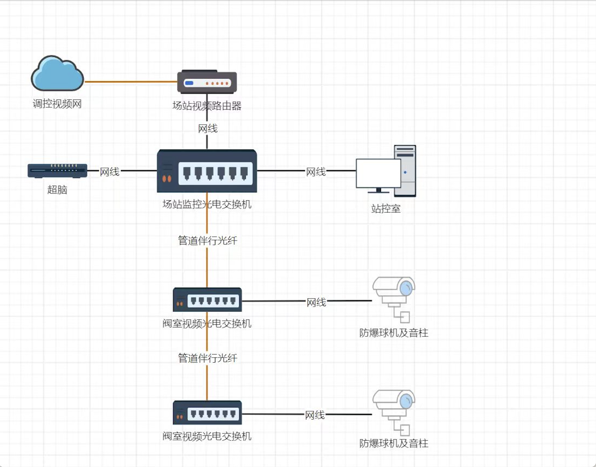

## 2. 设备离线后的排查思路

1. **先定位离线范围**：个别设备离线 → 查超脑通道管理里该设备的状态和原因；整站离线 → 先查录像机本身能否访问、能否 ping 通。
2. **分段排查链路**：前端设备 → 录像机/光电交换机 → 场站监控光电交换机 → 调控视频核心交换机 → 平台服务器，逐段 ping 测试。
3. **确认供电**：链路正常仍离线，多半是设备本身故障或供电问题。
4. **检查平台注册**：能访问 web 界面后，查看 ISUP 平台接入的注册状态和上级平台信息是否正确。

## 3. 场站前端设备掉线排查情况

### 3.1 个别摄像机离线

平台上发现个别摄像机状态离线且无法开流，在本地监控电脑通过 ip 访问**录像机的 web 界面**，进入 **配置 → 系统 → 通道管理**，查看平台掉线设备在超脑里的设备状态：

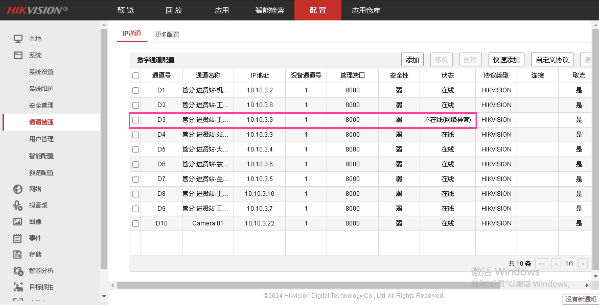

「状态」栏会显示前端摄像机在超脑中的状态：

- **在线**：正常状态。
- **不在线**：会单独显示原因，按原因处理：
  - **网络异常** → 第一步排查前端设备到录像机的**网络链路和供电**是否正常；两者都没问题，就是摄像机本身故障。
  - **密码错误** → 勾选密码错误的设备，点击上方的「修改」，将通道密码改为正确密码。

### 3.2 整个场站的设备全部离线

1. 先在本地监控电脑通过 ip 看能否访问录像机 web 界面；无法访问时，`win + r` → 输入 `cmd` 回车，用 **ping 命令**测试到录像机 ip 是否连通：

   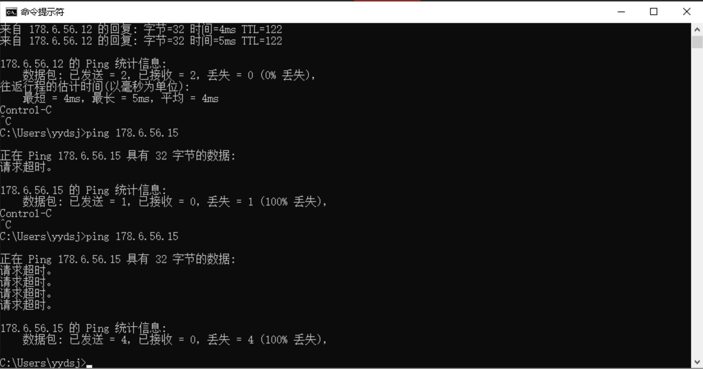

2. **无法 ping 通** → 排查录像机到场站监控光电交换机的链路是否正常。
3. **能 ping 通但平台依旧离线** → 通过 ip 访问录像机 web 界面，进入 **配置 → 网络 → 高级配置 → 平台接入模块**，查看平台接入方式（**ISUP**）的注册状态是否在线。
   - 上级平台信息：**平台地址 178.6.2.111、端口 9842**。
   - 上级信息无误但注册状态离线 → 在监控电脑上 ping 测试**现场监控网络到服务器网络**是否连通：

     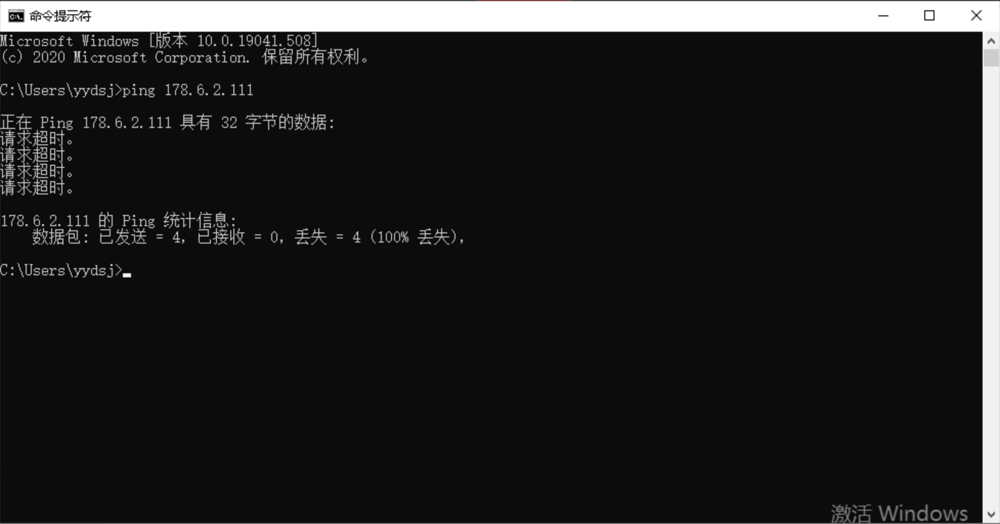

   - 不通 → 排查**场站视频网络到调控视频核心交换机**的链路。
4. **登录报错的情况**：登录 web 界面时提示「网络异常」报错（见下图），此时**平台侧设备可以正常开流，但状态全部离线** → 现场对交换机**断电重启**进行恢复：

   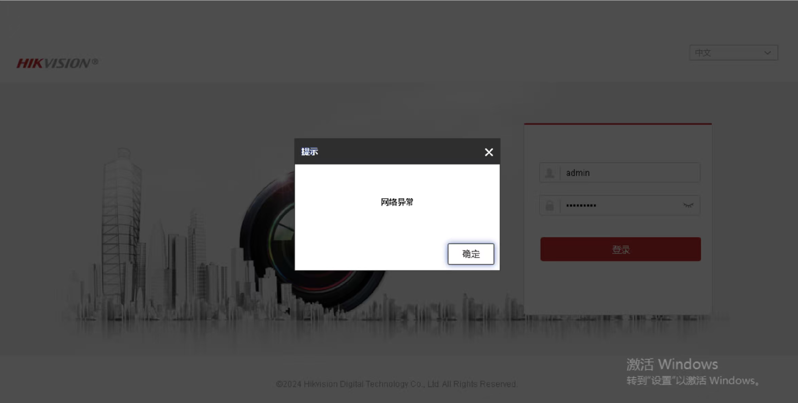

### 3.3 场站新增 ip 网络音柱掉线

现象：平台喊话或场站告警联动时音柱不播放声音，可能是网络音柱故障。以进贤站音柱为例（ip：`178.6.56.11`）：

1. 先通过 ip 看能否访问音柱 web 界面；无法访问时用 **ping** 测试音柱 ip：

   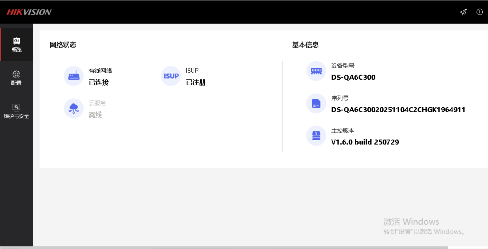

2. **无法 ping 通** → 排查音柱到场站监控光电交换机的网络链路。
3. **能 ping 通但不在线** → 访问音柱 web 界面，登录后在**概览首页**查看 ISUP 注册状态；离线则前往 **配置 → 网络 → 设备接入**，检查平台信息是否填写有误（平台地址 178.6.2.111、端口 9842）：

   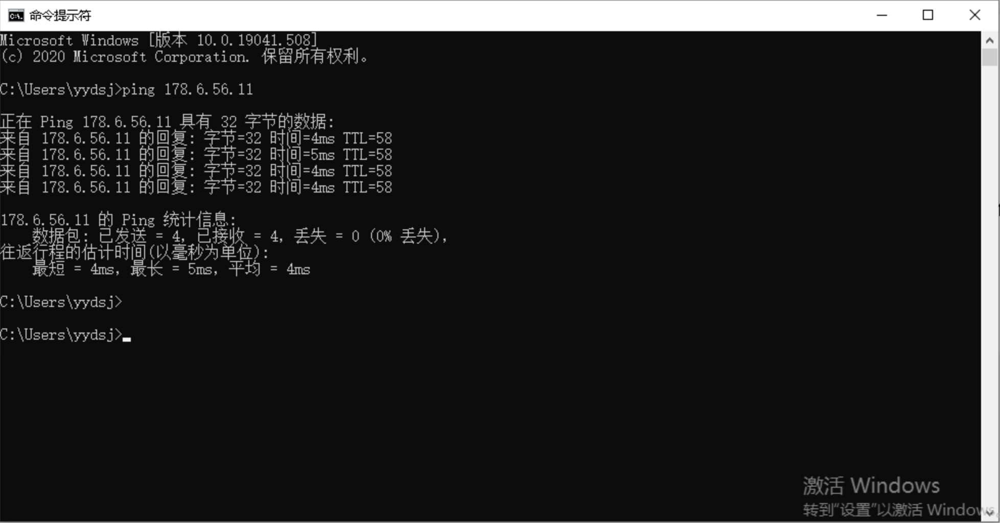

4. 上级信息无误但注册离线 → ping 测试现场监控网络到服务器网络是否连通。

## 4. 阀室前端设备掉线排查情况

### 4.1 阀室球机监控掉线

排查入口与场站相同：场站监控电脑通过 ip 访问**超脑的 web 界面**，在 **配置 → 系统 → 通道管理** 查看掉线设备状态：

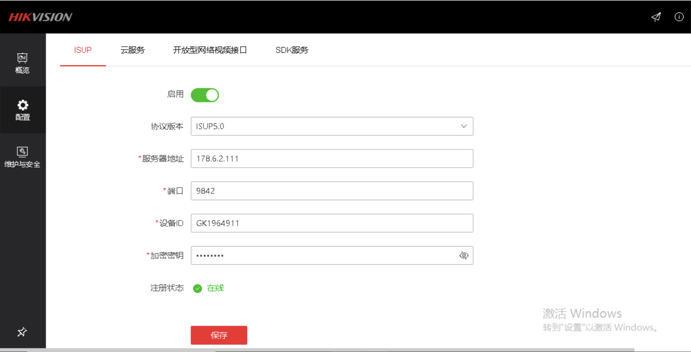

- **网络异常** → 排查前端设备到录像机的网络链路和供电。注意阀室链路要**分段排查**：
  - 设备 → 阀室光电交换机这段是否正常；
  - 阀室光电交换机 → 场站光电交换机这段是否正常。

  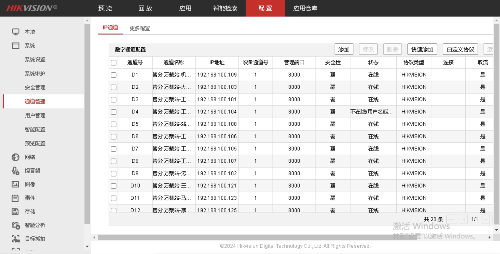

- 两者链路都没问题 → 摄像机本身故障。
- **密码错误** → 勾选设备点「修改」，改回正确通道密码。

### 4.2 阀室防爆音柱故障

只需排查两个方面：

1. 现场设备**供电**是否存在问题；
2. 音柱的**连接线**有没有松动。

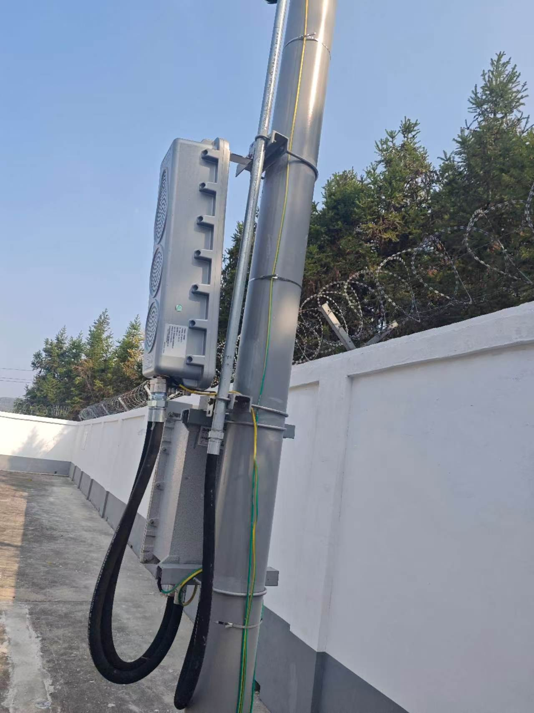

## 5. 高后果区及第三方施工设备掉线排查情况

这类设备（见下图：太阳能/风光互补供电 + 球机）统一采用**太阳能板 + 蓄电池供电、4G 物联网卡上网**连接平台：

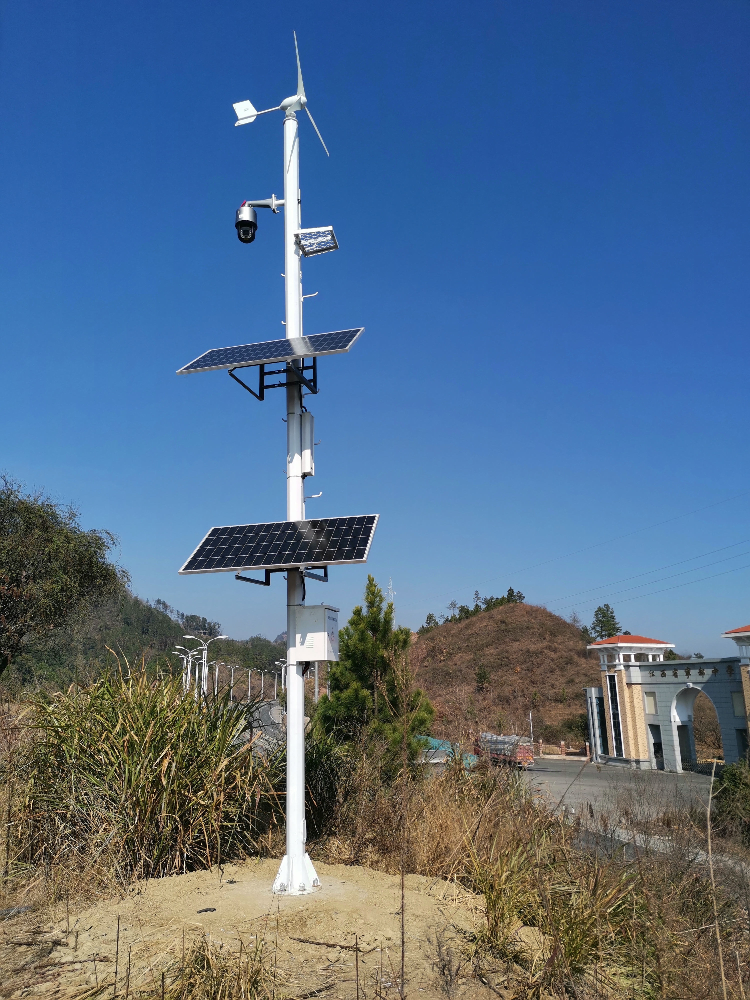

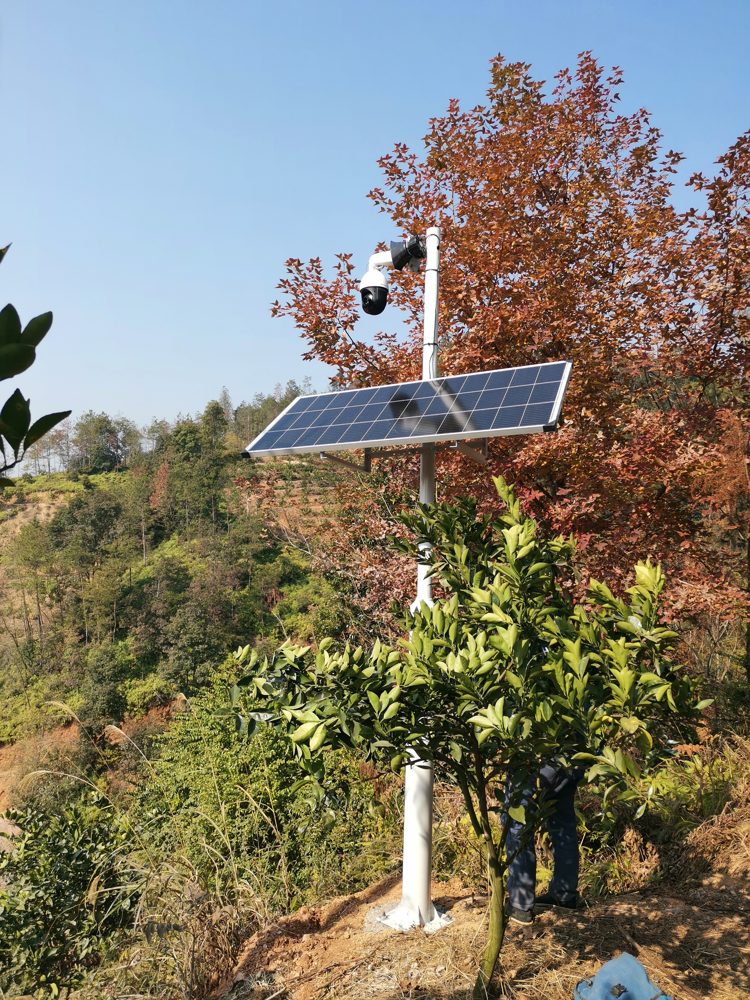

按以下 4 步排查：

### 5.1 流量卡状态

设备掉线时，第一时间联系**云眼公司**查询设备流量卡状态。超出月套餐流量限制时，运营商工单问题可能导致流量卡无法正常上网，致使设备离线。

### 5.2 前端设备供电状态

- 有屏幕的太阳能控制器：看 **load 电压和电流**，电流至少 **> 0.5A**。
- 无显示屏的：用万用表测输出端是否有 **12V** 输出，电压必须 **> 11V**。
- 电压偏低时检查：是否连续阴雨天气、太阳能板被遮挡或积灰严重 → 调整角度或清洗太阳能板。

### 5.3 设备运行状态

流量和供电都正常时，现场**断电重启**，观察设备能否正常自检；用笔记本电脑直连摄像机访问 web 界面，确认设备运行正常、平台注册状态正常。在 **配置 → 网络配置 → 平台接入（或高级配置）** 查看 ISUP 平台接入状态。

### 5.4 前端音柱/扬声器状态

分两步：① 检查设备供电是否正常；② 检查音柱（扬声器）与设备的连接线是否松动。

---

# 二、前端设备常见配置项说明

## 1. 超脑配置项说明

### 1.1 NTP 校时配置

核心作用：通过网络时间协议自动同步标准时间，确保 NVR 及所接入摄像机的系统时间准确无误。

**核心作用详解：**

1. **保证录像时间戳准确**（最根本）：NVR 所有录像文件以系统时间为索引，时间不准会导致回放找不到对应时间段的录像、录像时间与真实事件时间有偏差，严重影响取证效力。
2. **统一多设备时间基准**：NVR 作为中心节点通过 NTP 获取标准时间后，自动下发给所有接入的 IPC，保证整个监控系统时间完全一致。
3. **支撑智能分析功能**：人脸抓拍、车牌识别、行为分析等智能功能的日志和报警都依赖精确时间戳，时间偏差会导致智能检索结果错乱或失效。
4. **保障日志审计合规**：系统操作日志、报警日志的时间准确性是安全审计和法律合规的基本要求。

**主要配置参数**（海康 NVR：配置 → 系统 → 系统设置 → 时间设置 → NTP）：

| 参数 | 说明 |
| --- | --- |
| 启用 NTP | 开关，必须勾选才能生效 |
| NTP 服务器地址 | 填写公网或内网 NTP 服务器 IP/域名 |
| 端口 | 默认 123（UDP），一般无需修改 |
| 校时间隔 | 同步频率，如 60 分钟、1440 分钟等；间隔越短精度越高 |
| 时区 | 必须正确设置，否则即使同步成功显示时间也会偏移 |

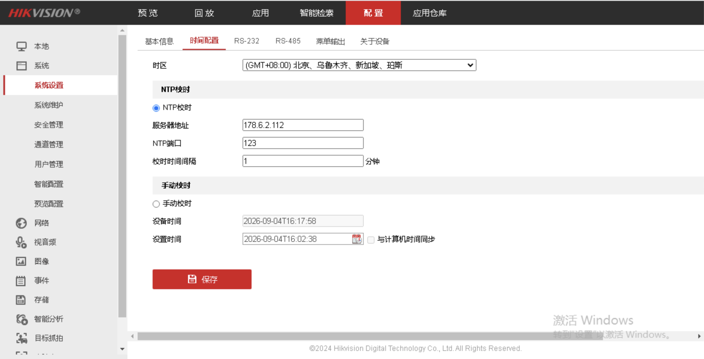

### 1.2 通道管理配置

位置：**配置 → 系统 → 通道管理**。这是整个视频监控系统的核心枢纽，负责建立、维护和管理 NVR 与前端摄像机（IPC）之间的连接关系。

> 类比：如果把 NVR 比作大脑，通道管理就是「神经系统」——让大脑知道有哪些眼睛（摄像机）、每只眼睛在哪里、状态如何、怎么获取画面。

**核心作用：**

1. **设备接入与注册**
   - 添加摄像机：手动输入 IP、端口、用户名密码，或通过 SADP/ONVIF 自动搜索批量添加。
   - 协议适配：支持海康私有协议、ONVIF、RTSP、GB/T28181 等多种协议接入不同品牌摄像机。
   - 即插即用：配合海康 PoE NVR 时，自动为直连 IPC 分配 IP 并完成激活绑定。
2. **连接状态监控**
   - 实时在线检测：显示每个通道的在线/离线状态、网络质量图标。
   - 故障诊断提示：直接显示错误原因，如「用户名密码错误」「网络不可达」「IP 地址冲突」「不支持的码流格式」。
   - 快速排障入口：无需逐个登录摄像机 Web 页面，在 NVR 上即可定位问题。

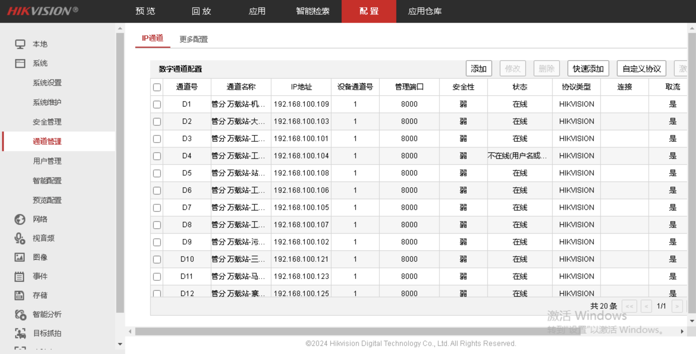

### 1.3 网络配置（TCP/IP）

TCP/IP 模块是设备网络通信的基础底层配置，定义设备在网络中的「身份」和「寻址规则」，是所有上层功能（RTSP、ONVIF、NTP、平台接入、远程访问等）正常工作的前提。

> 没有正确配置 TCP/IP，NVR 就是一个网络孤岛，什么都连不上。

**核心作用：**

1. **定义设备的网络身份**
   - **IP 地址**：设备在局域网/广域网中的唯一标识。
   - **子网掩码**：界定所属网段范围，决定哪些 IP 可直接通信、哪些需经网关。
   - **默认网关**：访问非本网段设备（跨网段 IPC、互联网 NTP 服务器、云平台）时必须经网关转发——**网关配错 = 跨网段通信全部失败**。
2. **DNS 解析配置**
   - 首选/备用 DNS 把域名（如 `ntp.aliyun.com`、`dev.hik-connect.com`）解析为 IP。
   - 关键影响场景：NTP 校时（用域名时）、萤石云/HiLook 等云平台注册、GB/T28181 平台对接（SIP 服务器用域名时）、邮件报警（SMTP 域名解析）。
   - **DNS 未配置或配错，所有基于域名的功能都会失败，即使 IP 网络本身是通的。**
3. **多网卡/多网口管理**（双网口或多网口 NVR）
   - 网口角色分配：哪个口接内网 IPC、哪个口上联外网平台/客户端。
   - 独立 IP 配置：每个网口可配不同网段，实现网络隔离（如 IPC 专网 + 办公网分离）。
   - 链路聚合/容错：部分高端 NVR 支持双网口绑定，提升带宽或冗余。
4. **MTU 与高级网络参数**
   - **MTU**（最大传输单元）：PPPoE 拨号、VPN 隧道、跨运营商等场景中 MTU 不匹配会导致大包丢弃、画面卡顿、连接时断时续。
   - 端口配置：HTTP(80)、HTTPS(443)、RTSP(554)、服务端口(8000) 等，本质上属于 TCP/IP 协议栈的一部分。

### 1.4 视音频配置

决定视频画面的清晰度、流畅度、文件大小以及网络带宽占用——本质是在「画质」与「存储/带宽成本」之间找平衡点。

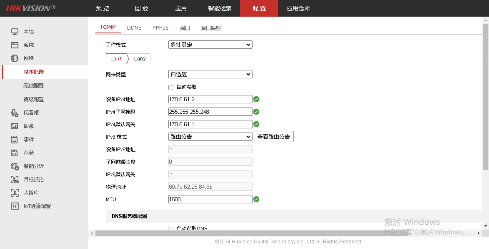

| # | 参数 | 当前值 | 说明 |
| --- | --- | --- | --- |
| 1 | 码流类型 | 主码流（定时） | **主码流**：分辨率最高、码率最大，用于本地高清录像和大屏查看；**子码流**：分辨率低、码率小，用于手机远程预览、多画面预览；**第三码流**：部分高端设备支持，用于特定平台对接或极低带宽环境 |
| 2 | 视频类型 | 复合流 | **复合流**：视频 + 音频一起传输录像（接了拾音器或带麦克风的摄像机选这个才能录音）；**视频流**：只录画面不录音 |
| 3 | 分辨率 | 1920×1080 (1080P) | 决定画面像素数量即清晰度。1080P 是目前主流高清标准；分辨率越高越清晰，但存储和带宽成倍增加 |
| 4 | 码率类型 | 定码率 CBR | **CBR**：码率恒定，带宽占用稳定、便于计算存储容量，但画面剧烈变化时可能出现马赛克；**VBR**：静止时降码率、运动时升码率，更省空间但带宽波动大。安防监控通常推荐 CBR，便于硬盘容量规划 |
| 5 | 图像质量 | 中（灰色不可选） | 选了 CBR 后此项被锁定——定码率模式下码率上限已固定（2048Kbps），设备自动分配质量；只有选 VBR 时才会亮起（高/中/低） |
| 6 | 视频帧率 | 全帧率（25/30fps） | 每秒刷新的画面张数，越高越流畅。安防监控 15~25fps 足够；为省存储可降到 10fps 甚至更低，但会有卡顿感 |
| 7 | 码率上限 | 2048 Kbps (2Mbps) | 限制视频流最大传输速度。1080P + H.265 下这是标准且经济的值；网络卡顿可调低，追求画质可调高（如 4096Kbps） |
| 8 | 视频编码 | H.265 | **H.265 (HEVC)**：比 H.264 省约 50% 存储和带宽，画质相当，强烈建议保持（除非老旧平台/解码器不支持）；**H.264**：兼容性最好但费硬盘 |
| 9 | Smart265 | 关闭 | 海康独有的智能压缩技术（类似 H.265+）：背景不动的地方极度压缩、动的地方正常压缩，可在 H.265 基础上再省 50% 以上存储和带宽。NVR 和后端平台都支持的话强烈建议开启，能极大延长录像天数 |
| 10 | 帧间隔 (I Frame Interval / GOP) | 50 | 两个关键帧（I 帧）之间的间隔帧数。设置原则：帧率的 1~2 倍（25fps 填 50 = 每 2 秒一个关键帧）。值越大越省带宽，但拖动进度条（seek）反应变慢、丢包后画面恢复变慢；值太小费带宽 |

### 1.5 图像配置

图像配置模块用于调节监控画面质量、色彩还原及适应不同环境光线，核心功能分四块：

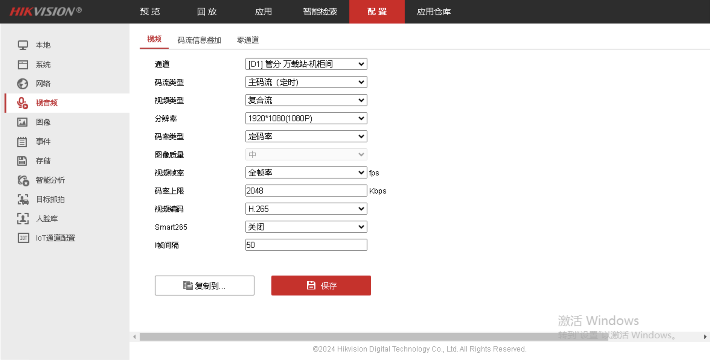

1. **图像参数调节**（基础画面调色）
   - **亮度**：整体明暗程度。
   - **对比度**：亮部与暗部差异，影响层次感。
   - **饱和度**：色彩鲜艳程度（过高失真，过低偏黑白）。
   - **锐度**：边缘清晰度，使细节更分明或更柔和。
   - **色度/色调**：部分型号支持微调颜色偏向。
2. **日夜转换与背光补偿**（复杂光线环境的核心配置）
   - **日夜模式**：设置自动切换阈值、灵敏度及滤光片切换延迟，防止临界光照下频繁切换。
   - **宽动态 (WDR)**：解决强光背景下主体发黑问题，支持数字宽动态或真宽动态，可调等级。
   - **背光补偿**：WDR 关闭时通过提升暗区亮度显示逆光物体，但牺牲亮部细节。
   - **强光抑制**：压制车灯等强点光源，常用于车牌抓拍或出入口监控。
   - **透雾**：雨雾天气增强画面穿透力，提升能见度。
3. **增益与降噪**（低照度下的画面纯净度与噪点平衡）
   - **3D 数字降噪**：消除低照度下的彩色噪点和拖影，等级越高画面越干净，但可能导致运动物体模糊。
   - **增益上限**：限制传感器放大信号倍数。降低上限减少噪点但画面变暗，提高上限则相反。
   - **慢快门/电子防抖**：部分机型支持延长曝光提升亮度，或用 EIS 减少抖动模糊。
4. **OSD 设置**（画面叠加的文字、时间及标识）
   - **通道名称**：自定义名称内容、字体大小、颜色及屏幕位置。
   - **时间日期**：时间格式、显示格式、透明度及位置，支持周显示开关。
   - **自定义字符**：添加固定文本（如「禁止入内」「仓库A区」），支持多行及位置拖动。
   - **OSD 属性**：统一调节所有叠加文字的透明度、背景色、边框样式及对齐方式。

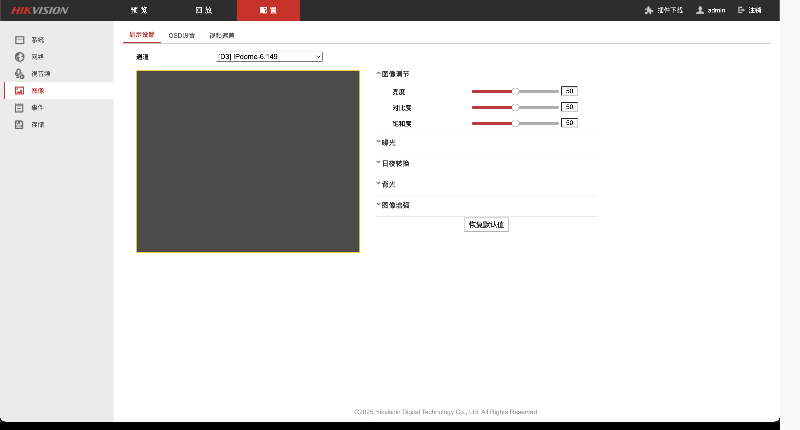

### 1.6 存储配置

存储模块负责管理硬盘状态、规划录像策略以及保障数据安全，包含五个方面：

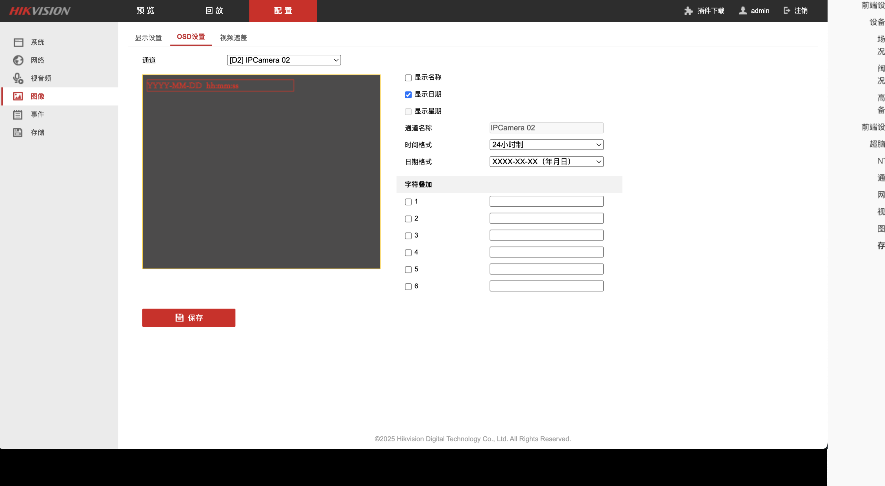

1. **硬盘管理**
   - **硬盘初始化**：格式化新硬盘使其可被识别写入。
   - **状态监测**：实时显示容量、剩余空间、读写状态、温度及 S.M.A.R.T. 健康信息。
   - **工作模式**：普通模式（标准读写）/ 休眠模式（无读写时停转，延长寿命、降功耗噪音）；部分高端机型支持 RAID（RAID0/1/5/6/10）冗余。
   - **配额管理**：为不同通道分配独立存储上限，防止单一通道占满硬盘导致其他通道无法录像。
   - **加密/锁定**：硬盘加密，防止被拔出后在其他设备上读取数据。
2. **录像计划**（何时录、录什么类型）

   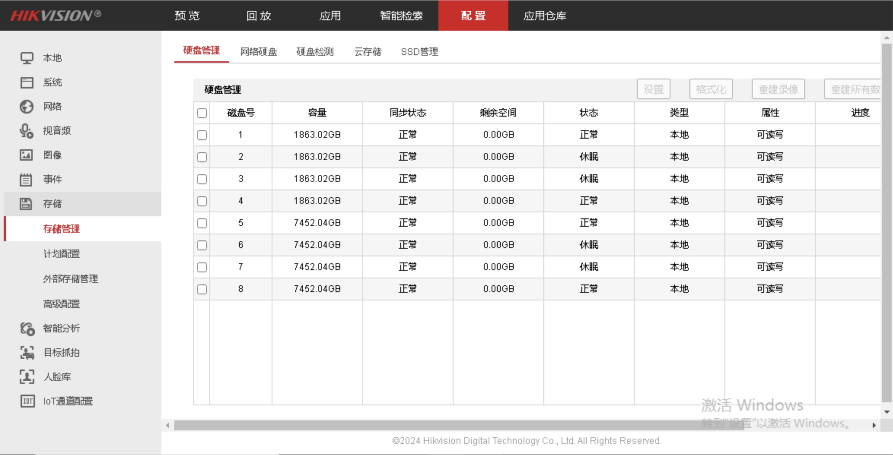

   - **定时录像**：按时间段设置全天或特定时段连续录像。
   - **事件触发录像**：仅在移动侦测、遮挡报警、越界、入侵等智能事件时启动。
   - **报警联动录像**：关联外部传感器（烟感、门磁等）触发。
   - **预录/延录**：事件前保留几秒至几分钟画面（预录）、事件后继续录一段时间（延录），确保记录完整。
   - **多套模板切换**：工作日/节假日/自定义周期自动切换不同录像计划。
3. **存储策略与覆盖规则**（硬盘写满或异常时的行为逻辑）

   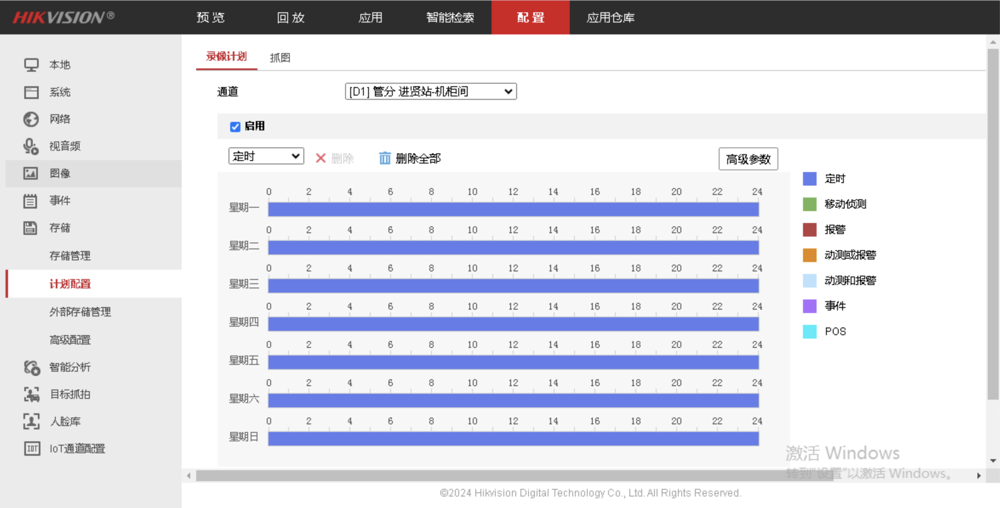

   - **循环覆盖**（默认）：硬盘满后自动删除最早的非重要录像。
   - **停止录像**：硬盘满后停止写入，需手动清理（适用于严禁丢数据的场景）。
   - **过期时间**：设置录像最长保存天数（如 30/90 天），超期自动删除，即使硬盘未满也执行。
   - **锁文件/防覆盖**：把关键录像标记为「只读」，防止被循环覆盖误删。
   - **低码率存储**：非必要时段自动降低录像码率以延长存储时长。
4. **网络存储与备份**（扩展本地存储、异地容灾）
   - **NAS/SMB/CIFS 挂载**：录像直接写入局域网内 NAS 或共享文件夹。
   - **iSCSI / SAN**：企业级块存储对接，适合大规模集中存储项目。
   - **FTP 上传**：报警图片或短视频自动上传远程 FTP 服务器。
   - **云存储对接**：绑定海康云眸、萤石云或第三方云平台，实现云端备份。
   - **eSATA/USB 扩展柜**：外接接口扩展磁盘阵列柜。
5. **存储健康与维护**
   - **坏道检测与修复**：定期扫描硬盘扇区，尝试屏蔽或修复逻辑坏道。
   - **异常告警**：硬盘故障、空间不足、读写错误、NAS 断连等触发声光、邮件或弹窗报警。
   - **日志审计**：记录所有存储相关操作（格式化、删除、配置修改）便于追溯。
   - **存储测试**：模拟写入压力测试，验证新硬盘或扩展存储的稳定性。
