# 光通信（讲解整理）

> 笔记按「光传输技术演进 → 5G 承载网 → 光模块（发射端）→ 光接收与放大 → 光放大板面板接口 → 光传输设备分类 → SDH 同步数字体系」七块重排，内容未删改。
> 注：演进部分的「① SDH 阶段」已由第六节的 SDH 设备介绍补上（时间线：SDH → DWDM → OTN）。

---

## 一、光传输技术演进

### ② DWDM 技术突破阶段（1990s）

- **核心概念**：DWDM = 密集波分复用（Dense Wavelength Division Multiplexing）波长主要集中1550窗口
- **打个比方**：一根本来只跑"一辆车"的光纤，现在同时跑"几十辆不同颜色的车"（每条车道用不同波长的光），互不干扰，到对端再按颜色分开
- **效果**：单根光纤能同时承载**数十个波长信号**，传输容量**提升数十倍**
- **地位**：成为骨干网（核心长途网络）的主流技术——这是互联网带宽爆炸的物理基础

### ③ OTN 架构兴起阶段（2000 年后）

- **核心概念**：OTN = 光传送网（Optical Transport Network）
- **它解决的不再是"容量"，而是"调度和管理"**：
  - **光层交叉连接与调度**：不用把光转回电再处理，直接在光层面把某个波长的信号"绕"到另一条线路，灵活组网、保护倒换更快
  - **兼具灵活性与可靠性**：既能灵活调配资源，又有完善的保护/恢复机制（某段断了自动切到备用路径）
  - **适配多业务差异化**：同一张网能同时承载语音、数据、专线、云业务等，给不同业务不同质量等级

---

## 二、5G 承载网

### 1. 什么是"5G 承载网"？

5G 不是"基站 + 手机"这么简单，它的网络分三块：

| 组成 | 职责 |
| --- | --- |
| **无线接入网（基站）** | 覆盖你身边的 5G 信号 |
| **承载网** | 把成千上万个基站和核心网连接起来的**传输链路**——那些五颜六色的光纤跳线、机架，就是承载网机房里的真实样子（光模块、光纤配线架） |
| **核心网** | 负责计费、认证、会话管理的"大脑" |

> 承载网是中间的"血管"，负责把基站的数据高速、稳定地送到核心网。

### 2. 为什么 5G 承载网要求"低时延"？

4G 时代承载网时延慢一点无感，但 5G 的三大场景对时延极其敏感：

| 场景 | 全称 | 要求 |
| --- | --- | --- |
| **eMBB** | 增强移动宽带 | 高清视频、VR —— 要大带宽 |
| **uRLLC** | 超可靠低时延 | 自动驾驶、远程手术、工业控制 —— **时延要低到毫秒级**，晚几毫秒车可能就撞了 |
| **mMTC** | 海量物联 | 千万级传感器 —— 连接数巨大 |

所以承载网必须**低时延、高可靠**。

### 3. "灵活调度" + "切片"是什么？

- **灵活调度**：光传输系统能在光层/电层随时把某个波长的流量"绕"到别的链路，动态调配——网络哪个方向堵就补哪里
- **网络切片**：把一张物理网络**切成好几条逻辑上互不干扰的"虚拟专网"**——比如自动驾驶专网（低时延优先）、视频专网（带宽优先）、智能抄表专网（海量连接优先），各走各的通道、各自保证质量

### 4. "差异化 QoS"

QoS = 服务质量（Quality of Service）。不同业务对"时延 / 丢包 / 带宽 / 可靠性"的要求完全不同，切片技术让网络能**给不同业务分级保障**，而不是所有流量一视同仁。

---

## 三、光模块：光源与发射端

### ① LD 光源工作原理（激光器）

- **原理**：基于**受激辐射**（stimulated emission）发光
  - 通俗讲：一个光子经过时，"诱发"原子释放出和它**同频、同相、同方向**的光子，像雪崩一样越滚越多 → 输出的是**高度集中、相干**的光
- **特点**：**高亮度、窄线宽**（光很"纯"，频率集中）
- **用途**：**10Gbps 以上、长距离骨干网**（长途传输必须用 LD，因为它能量集中、能传远、速率高）

### ② LED 光源工作原理

- **原理**：基于**自发辐射**（spontaneous emission），原子自己随机发光，光子**方向、相位杂乱**
- **特点**：**亮度较低、线宽大**（光"散"、频率不纯）
- **用途**：**百兆级短距离传输，如局域网接入链路**（家里/楼宇内的短距离，便宜够用）

> 对比记忆：**LD = 激光，准直、纯、传得远、贵；LED = 普通光，发散、杂、传不远、便宜**。

### ③ 光发射模块核心功能

一句话：**完成"电 → 光"的转换**。

- 把电信号（0/1 的电脉冲）**加载到光载波**上（调制），变成随信号变化的光
- 它是**光发射端的关键组件**——也就是把信号"送上光纤"的第一步
- **典型组成**：LD/LED 光源 + 驱动电路 + 调制器 + 光接口，封装成一个模块（就是插在交换机/光传输设备上的那个"光模块"或"光收发一体模块"）

### ④ 光发射模块关键参数

两个直接决定"能传多远 / 多快"的核心参数：

| 参数 | 常见值 | 意义 |
| --- | --- | --- |
| **工作波长** | **1310nm**、**1550nm** | 光纤损耗最低的两个"窗口"（尤其 1550nm 损耗最小），所以长途选它们 |
| **输出功率** | **-10dBm ~ 0dBm** | 光越强越能传远；**直接决定传输距离上限**（再远光就衰减到接收端认不出来了） |

> dBm 是功率单位：0dBm = 1mW，-10dBm = 0.1mW。**发射功率 + 光纤损耗**两个因素一起决定了无中继能传多远。

---

## 四、光接收与放大：探测端和中继

### ① PD 光探测器工作原理（接收端）

- **作用**：把光纤送来的**光信号转回电信号**——和光发射模块的"电 → 光"正好相反，完成"光 → 电"的回收
- **原理**：利用**光电效应**，入射光子打在半导体上激发出电子，形成电流，于是"光的变化"变成了"电的变化"
- **地位**：光接收模块的核心器件（接收端的"眼睛"）
- **常见类型**：
  - **PIN**：结构简单、便宜、响应快，用于**短距**
  - **APD**（雪崩光电二极管）：内部放大倍增，灵敏度高，用于**长距/弱光**

### ② EDFA 光放大器核心作用（中途"充电站"）

- **解决什么问题**：光在光纤里传，能量会**衰减**（前面讲过损耗），传几百公里就弱到接收端认不出来了
- **核心作用**：**补偿光纤传输中的损耗**，而且是**光信号直接放大、无需光电转换**（避开 O-E-O 老办法）：
  - 老办法：光 → 电 →（电放大）→ 光，设备贵、速率受限
  - EDFA：光 → **光**，直接把弱光放大，又快又省
- **效果**：把传输距离从几十公里**延长到数百公里**

### ③ EDFA 工作原理与应用位置

- **原理**：**掺铒光纤** + **泵浦光**。泵浦光（通常是 980nm/1480nm 的激光）激发铒离子，铒离子把能量**受激辐射**给经过的信号光，信号光就被"喂"大了一截——本质和前面 LD 的受激辐射是同一个物理机制
- **部署位置**：链路**中间**（最常用，即"中继"）、**发射端后**、或**接收端前**

### ④ 为什么 EDFA 是革命性的（接回前面 DWDM）

最妙的一点：EDFA 工作在 **1550nm 低损耗窗口**，而且它**能同时放大一整根光纤里的几十个波长**（宽谱放大）——这正是前面 DWDM 能"几十个波长挤一根光纤还传几千公里"的关键前提：没有 EDFA 全光放大，DWDM 每个波长逐路光电再生，成本爆炸。

---

## 五、光放大板面板接口（实物对照）

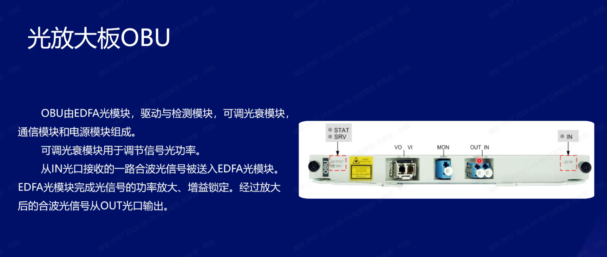

一句话串起来：**IN 输入 →（EDFA 放大）→ OUT 输出 → OUT 接 VI、经可调整后由 VO 输出 → MON 做告警监测。**

| 接口 | 全称/含义 | 作用 |
| --- | --- | --- |
| **IN** | Input | 光信号**输入**口，上游（合波板/前一级）送来的弱光从这里进放大板 |
| **OUT** | Output | 放大后的**输出**口 |
| **VI** | VOA **In**（可调光衰减器输入） | OUT 的输出先接到 VI，串入可调衰减环节 |
| **VO** | VOA **Out**（可调光衰减器输出） | 衰减调整后**真正上路**的光从这里出去 |
| **MON** | Monitor | **监测口**，分出少量光用于功率检测与告警上报 |

**为什么要"OUT → VI → VO"多绕这一步？**

- EDFA 板卡本身的**增益是固定的**（比如固定放大 20dB），但实际每段光缆的损耗千差万别（40km 和 80km 差一倍）。
- 如果只靠固定增益放大，短跨段时光功率会**过强**：接收端过载、光路非线性效应加剧，长跨段又不够。
- 所以板卡在输出端内置 **VOA（Variable Optical Attenuator，可调光衰减器）**：OUT 出来的光先进 VI，按需要衰减到合适值，再从 VO 发出去 —— **"先放大到够用，再按需回调"**，实现输出光功率可调。

> 记忆：IN = 进口，OUT = 出口，**VI/VO = 出口上串的一个"水龙头"（调流量）**，MON = 旁路的水压表。

**MON 监测什么？**

- 实时监测输入/输出光功率，超出门限就上报告警（光功率过低 = 断纤或上游故障；过高 = 异常）。
- 常见用途：定位"是哪一段光衰减了"，以及断纤告警。

---

### 与前文的对应关系

| 笔记里的概念 | 在这块板上的体现 |
| --- | --- |
| EDFA（② ③ ④ 节） | 板卡主体：掺铒光纤 + 泵浦光，光 → 光直接放大 |
| 部署在"链路中间" | 这块板就是插在传输设备机架上的中继放大板 |
| 1550nm 低损耗窗口 | 板卡工作波长窗口，配合 DWDM 多波长同时放大 |

---

## 六、光传输设备分类：OTN / SDH / PTN

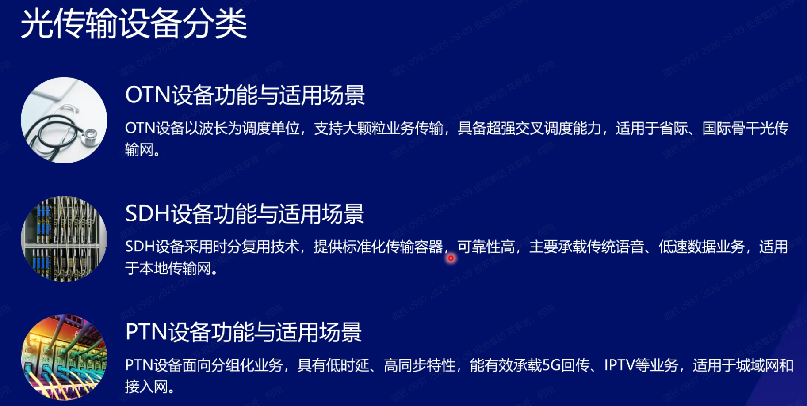

| 设备 | 调度单位/核心技术 | 特点 | 承载业务 | 适用网络层级 |
| --- | --- | --- | --- | --- |
| **OTN** | **以波长为调度单位** | 支持大颗粒业务传输，具备**超强交叉调度能力** | 大颗粒业务 | **省际、国际骨干光传输网** |
| **SDH** | **时分复用（TDM）**，标准化传输容器（STM-N） | 可靠性高 | 传统**语音、低速数据**业务 | **本地传输网** |
| **PTN** | **面向分组化业务**（包交换） | **低时延、高同步** | **5G 回传、IPTV** 等业务 | **城域网和接入网** |

**怎么记：三类设备对应三层网络，核心区别在"调度单位"。**

- **SDH 切的是"时间"**：时隙固定分配，不管业务有没有数据，时隙都占着——适合语音这种恒定速率业务，带宽利用率低，但时延稳定、可靠性高。
- **OTN 切的是"波长"**：一个波长就是一个"车道"，颗粒大（10G/100G 级），在光层直接交叉调度——正是第一节讲的 OTN 架构在设备层面的样子，放在骨干网。
- **PTN 切的是"分组"**：数据打包按需转发，像一张面向连接的"以太网"，天生适合 IP 化的突发业务——5G 基站回传、IPTV 都是分组业务，所以放在最靠近业务的城域和接入层。

**对应关系：**

- **SDH 正好补上演进部分缺失的「①」**——时间线是：SDH（TDM 时代）→ DWDM（解决容量）→ OTN（解决调度管理），三类设备至今仍按网络层级并存，不是简单的取代关系。
- PTN 的"低时延、高同步"对应第二节 5G 承载网的要求；"5G 回传"正是承载网承担的角色。

---

## 七、SDH 同步数字体系详解

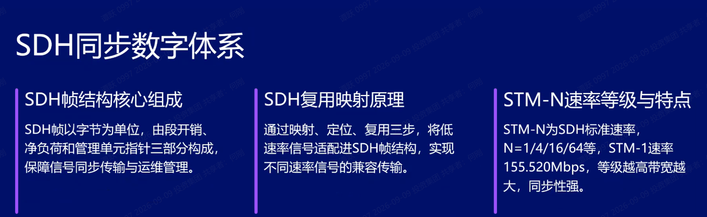

上一节表格里 SDH 只有一行，这页把它拆成三个知识点：**帧结构 → 复用映射 → 速率等级**。

### 1. SDH 帧结构核心组成

SDH 帧以**字节**为单位（STM-1 = 270 列 × 9 行字节，每 125μs 一帧，每秒 8000 帧），由三部分构成：

| 组成 | 位置 | 作用 |
| --- | --- | --- |
| **段开销（SOH）** | 帧的两侧列 | 保障传输的"运维开销"：帧定位、误码监测、公务联络等——同步传输与运维管理靠它 |
| **净负荷（Payload）** | 中间主体 | 真正装业务数据的地方 |
| **管理单元指针（AU-PTR）** | 帧内固定位置 | 指出净负荷在帧里的"偏移量"——接收端靠它找到数据从哪开始 |

> STM-1 速率的由来可以直接算：270 × 9 字节 × 8 bit × 8000 帧/秒 = **155.520 Mbps**。

### 2. SDH 复用映射原理

**三步：映射 → 定位 → 复用**，把各种低速信号（E1 2M、E3 34M 等）装进 SDH 帧：

- **映射**：把低速信号**适配**进标准容器（C），加上通道开销变成虚容器（VC）——相当于"把货物装进标准箱子"
- **定位**：用**指针**记录箱子里货物相对帧起点的位置——低阶信号速率有小偏差时，靠指针微调，不用整体滑动（这是"同步"体制的精髓）
- **复用**：多个低阶信号**字节间插**汇成高阶信号（多个 VC → AUG → STM-N）——"小箱子摞进大箱子"

这样**不同速率的信号都能兼容装进同一种帧结构**，这是 SDH 名字里"同步/数字体系"的意义。

#### 图解：字节间插复用（低阶 → 高阶）

复用方式 = **同步复用 + 灵活的映射结构**，低阶 SDH 到高阶 SDH 采用**字节间插**：4 个 STM-1 复用成 1 个 STM-4。

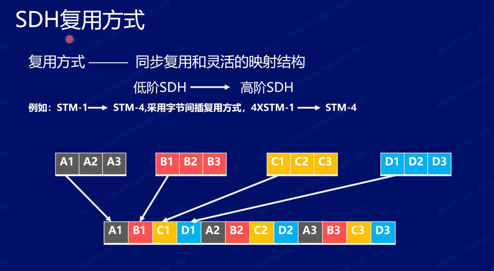

图里 4 路 STM-1 的第 1 个字节（A1、B1、C1、D1）先排一排，然后是各自的第 2 个字节（A2、B2、C2、D2），再第 3 个……像洗牌一样**一轮一轮轮流取样**：

```
STM-1 A: A1 A2 A3
STM-1 B: B1 B2 B3        字节间插后（STM-4）:
STM-1 C: C1 C2 C3   ──►   A1 B1 C1 D1 A2 B2 C2 D2 A3 B3 C3 D3
STM-1 D: D1 D2 D3
```

**为什么这样排？** 每路 STM-1 的字节在 STM-4 里的位置是**固定的、周期性的**（每隔 4 个字节出现一次），所以接收端不需要额外开销就能按固定规律把 4 路信号"梳"分开——这正是"同步复用"的含义：**位置即地址，不用查表**。

### 3. STM-N 速率等级与特点

STM-N 是 SDH 的标准速率，**N = 1 / 4 / 16 / 64**，每升一级 ×4：

| 等级 | 速率 | 记法 |
| --- | --- | --- |
| **STM-1** | **155.520 Mbps** | 基准（155M） |
| **STM-4** | 622.08 Mbps | 4 × 155M |
| **STM-16** | 2488.32 Mbps | 2.5G |
| **STM-64** | 9953.28 Mbps | 10G |

**特点**：等级越高带宽越大；全网共用同一时钟，**同步性强**（这也是它承载语音这种实时业务可靠的底气）。

> 串回前面的图：SDH 靠"固定时隙 + 标准容器"换来了可靠和同步——代价是时隙不管用不用都占着，所以它适合语音/低速数据，不适合 IP 突发业务；后者的活儿交给了 PTN。

### 4. SDH 的时钟与同步

> **"同步"二字，说的就是全网设备共用同一个时钟基准**——不是每台设备各走各的，而是「基准源 → 逐级分发 → 设备跟随」。

**时钟来源（三级）：**

| 层级 | 名称 | 典型实现 | 标准 |
| --- | --- | --- | --- |
| 一级 | **PRC** 基准参考时钟 | 铯原子钟 / GPS 驯服的铷钟，全网最高级 | G.811 |
| 二级 | **SSU / BITS** 同步供给单元 | 局站内的定时分配器，收上层再分发给各设备 | G.812 |
| 三级 | **SEC** SDH 设备时钟 | 设备自身晶振，等级最低 | G.813 |

> BITS（大楼综合定时系统）= 机房里那台专门发 2MHz / 2Mbit/s 定时信号的设备，SDH 设备用电缆从它取时钟。

**三种定时方式：**

1. **外部定时**：从 BITS 直接取时钟（最稳，骨干节点这么干）
2. **线路定时**：从某个方向的 STM-N 光口**信号里提取**时钟——STM-N 是同步帧，接收端能从码流恢复出对端时钟，中间站点逐级往下跟
3. **内部自由振荡**：用自己晶振跑，抓不到任何时钟源时才用（质量最差，只能短暂维持）

常态就是：**最高级节点挂 PRC/BITS，其余站点一级级从线路上"跟"下去**——这才是"同步网"。

**串回前面的两个知识点：**

- **段开销里的 S1 字节**就是干这个的：携带**同步状态信息（SSM）**，标明本端时钟质量等级（G.811/812/813/不可用）。设备据此判断"该不该跟这条时钟"，同时**防止时钟环路**（两站互相跟对方 = 时钟互锁，最忌讳）。
- **指针（AU-PTR）为什么必须存在**：跟随链路上各站时钟有微小频差和相位抖动，净负荷在帧里的位置会飘；指针用来**吸收这点频偏**，小幅调整不必整体滑动帧。第 2 点讲的"定位"，本质就是时钟对齐。

**时钟出问题会怎样：**

- 频偏大 → 指针频繁调整 → 抖动/漂移加剧
- 时钟成环或互跟 → 频率互相拉扯，严重时**滑码（slip）**、业务误码甚至中断
- 抓不到时钟源 → 进入**保持模式（holdover）**，靠晶振记忆的频率撑一段时间

> 一句话记忆：**SDH 的时钟 = 全网统一的时间节拍，由 PRC/BITS 发源，沿 STM-N 线路逐级传递，用 S1 字节标质量防环路，用指针吸收微小偏差。**

### 5. 工作方式：一次端到端的旅程

把前面几块串起来看一次完整传输——**SDH 网络本质是一根"透明的传送管道"**：

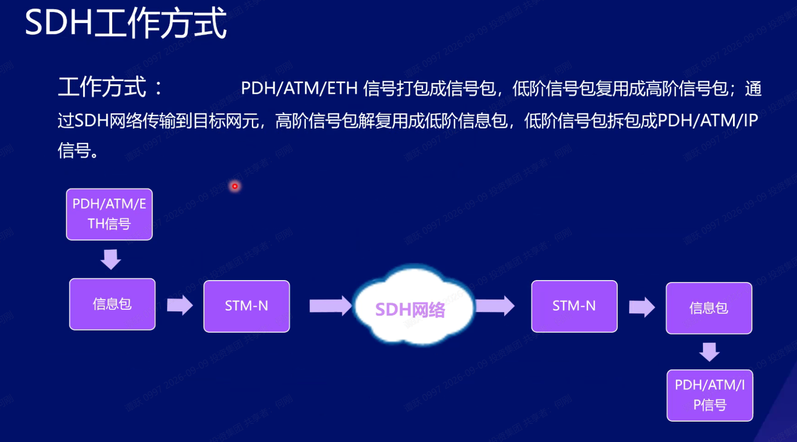

```
发送端                                        接收端
PDH/ATM/ETH 信号
    │ 打包（映射）                              │ 拆包（去映射）
    ▼                                          ▼
  信息包 ──► 复用成 STM-N ──► SDH 网络 ──► 解复用 ──► 信息包 ──► PDH/ATM/IP 信号
                            （传输到目标网元）
```

分步看：

1. **打包（映射）**：PDH（2M/34M/140M）、ATM、以太网等各种业务信号，通过"映射"适配进标准容器，打包成信息包——这就是 7.2 里的第一步
2. **复用**：信息包到STM-N,低阶信号包经**字节间插**复用成高阶 **STM-N**，装进 SDH 帧结构
3. **传输**：通过 SDH 网络送到目标网元，途中由各网元做再生中继，时钟沿线路逐级跟随（7.4）
4. **解复用 + 拆包**：到达对端后反着来一遍——高阶拆低阶、去掉容器开销，还原成 PDH/ATM/IP 信号

**值得注意的一点**：入口写的是 PDH/ATM/**ETH**，出口是 PDH/ATM/**IP**——SDH 不管业务是什么协议，只负责"装箱、运输、拆箱"，本身是**业务透明**的。这就是第一节 OTN 那句**"适配多业务差异化"**的老祖宗：容器化承载的思想从 SDH 一脉传下来。

### 6. 网络级保护分类

前面说 SDH"可靠性高"——高在哪？高在**保护倒换**：故障发生后 **50ms 内**切到备用路径。按拓扑分三大类：

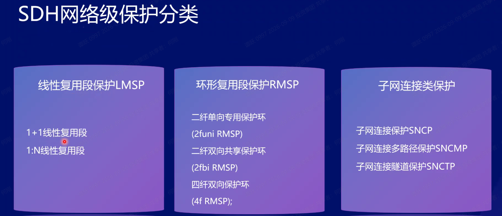

| 大类 | 细分 | 一句话说明 |
| --- | --- | --- |
| **线性复用段保护 LMSP** | ① 1+1 线性复用段 ② 1:N 线性复用段 | 点对点链路保护：**1+1** = 发端把业务**双发**到工作/保护两个通道，收端择优接收（最稳，保护资源独占）；**1:N** = N 个工作通道**共享** 1 个保护通道（赌不会同时全坏，省资源） |
| **环形复用段保护 RMSP** | ① 二纤单向专用保护环（2f uni） ② 二纤双向共享保护环（2f bi） ③ 四纤双向保护环（4f） | 环网保护：**2f 单向专用** = 每根纤一半时隙工作、一半作专用保护，业务走一个方向、备另一个方向；**2f 双向共享** = 两方向的工作时隙互为保护，平时保护时隙还能跑低优先级业务（利用率高）；**4f 双向** = 每段两根工作纤 + 两根保护纤，容量翻倍，还能抗多点故障 |
| **子网连接类保护** | ① 子网连接保护 SNCP ② 子网连接多路径保护 SNCMP ③ 子网连接隧道保护 SNCTP | 通道层保护：在**子网连接**级别做双发选收，**不限拓扑**（链型、环型、网状都行），粒度比复用段保护更细、更灵活 |

**记忆抓手：按"保护谁、在哪保护"分——**

- **LMSP 保护一段链路**（线性拓扑），关键词「双发 / 共享」
- **RMSP 保护一个环**（环形拓扑），关键词「二纤/四纤、单向/双向、专用/共享」
- **SNCP 保护一条连接**（通道层，拓扑无关），关键词「子网连接、双发选收」

> 串回前文：第六节说 SDH「可靠性高」、第一节说 OTN「有完善的保护/恢复机制」——**保护倒换 ≤50ms 就是"高可靠"三个字的具体数字来源**。SDH 的保护思想（专用/共享、1+1/1:N）同样被 OTN 继承了下去。

### 7. 光接口代码：W-Y.Z（ITG-T 规范）

单波长的 SDH 光接口用**代码**表示，格式 **W-Y.Z**，例如 `L-16.1`、`S-4.1`——设备面板上光模块标签常印这个，会读它就知道这口能传多远。

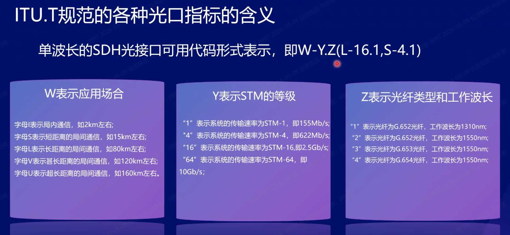

**W = 应用场合（传多远）**

| 字母 | 场合 | 距离 |
| --- | --- | --- |
| **I** | 局内通信 | ~2km |
| **S** | 短距离局间 | ~15km |
| **L** | 长距离局间 | ~80km |
| **V** | 甚长距离局间 | ~120km |
| **U** | 超长距离局间 | ~160km |

**Y = STM 等级（传多快）**：1 → STM-1 (155M)、4 → STM-4 (622M)、16 → STM-16 (2.5G)、64 → STM-64 (10G)——就是 7.3 那张速率表。

**Z = 光纤类型 + 工作波长（在哪传）**

| 代码 | 光纤 | 工作波长 |
| --- | --- | --- |
| **1** | G.652 | 1310nm |
| **2** | G.652 | 1550nm |
| **3** | G.653 | 1550nm |
| **4** | G.654 | 1550nm |

> 四种光纤一句话：**G.652** 最常用的标准单模纤（1310nm 零色散）；**G.653** 色散位移纤（把零色散挪到 1550nm，但会引发四波混频，不适合 DWDM）；**G.654** 截止波长位移纤（1550nm 损耗最小，海底光缆/超长距用）。

**示例拆解：**

- `L-16.1` = 长距离（~80km）+ STM-16（2.5Gbps）+ G.652 光纤 @ 1310nm
- `S-4.1` = 短距离（~15km）+ STM-4（622Mbps）+ G.652 光纤 @ 1310nm

> 串回前文：W 段的距离分档，本质就是 3.4 节「**输出功率 + 光纤损耗 = 无中继传输距离**」的工程化——距离越远，要求的发端功率越高、光口等级越高；Z 段的 1310/1550 也正是 3.4 节说的**两个低损耗窗口**。大距离（V/U 档）就得请出第四节那台"充电站" EDFA 了。

---

## 八、光传输性能指标解读

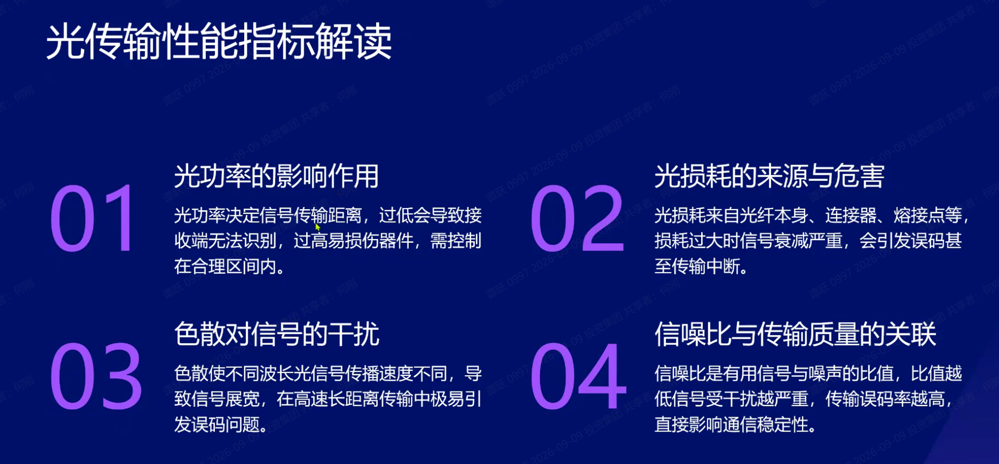

衡量一条光传输链路质量好坏，看四个指标：

| # | 指标 | 说什么 | 过低/过高的后果 |
| --- | --- | --- | --- |
| 01 | **光功率** | 决定信号**传输距离** | **过低** → 接收端无法识别；**过高** → 易损伤器件——需控制在合理区间 |
| 02 | **光损耗** | 来自**光纤本身、连接器、熔接点**等 | 损耗过大 → 信号衰减严重 → 误码甚至传输中断 |
| 03 | **色散** | 不同波长光信号**传播速度不同**，导致信号（脉冲）展宽 | 高速 + 长距离场景极易引发误码（展宽的脉冲挤在一起，0/1 分不清） |
| 04 | **信噪比（SNR）** | **有用信号与噪声的比值** | 比值越低受干扰越严重，**误码率（BER）越高**，直接决定通信稳定性 |

**展开两点：**

- **色散为什么"高速长距离"才致命？** 脉冲展宽量 ∝ 距离，而"一个比特占的时间" ∝ 1/速率。同样 10ps 的展宽，2.5G 时代比特宽 400ps 无所谓，10G 比特只有 100ps、40G 只有 25ps——展宽占比一大，相邻脉冲就"糊"在一起。这就是为什么 7.7 里 G.653 要做"色散位移"、40G+ 系统要上色散补偿模块。
- **误码率（BER）是最终裁判**：光功率、损耗、色散、信噪比四个指标折腾半天，最后都汇总到一个数字——**BER**（通常要求 < 10⁻¹²）。工程上测链路好坏，看的就是误码仪跑出来的 BER 和光功率计读数。

> 串回前文：01 对应 3.4「输出功率」、02 对应 EDFA 解决的问题（第四节）、03 对应 7.7 的 G.653/G.654 光纤选型、04 的信噪比也是 EDFA"直接光放大比 O-E-O 干净"的原因之一——四个指标把前面所有内容收口成了"一条链路质量好不好"的判断标准。

---

## 九、设备实例：华为 OptiX OSN 3500


一台真实的 SDH/MSTP 传输设备（华为城域骨干 MSTP 系列），把前面学的参数落到实物上——**每一行规格都能在前面找到出处**：

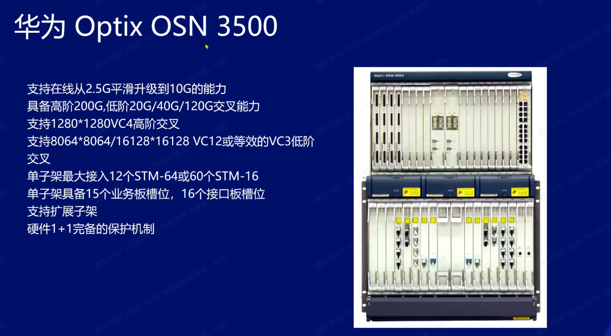

| 规格 | 原文 | 解码（对应前文概念） |
| --- | --- | --- |
| **在线升级 2.5G → 10G** | 支持在线平滑升级 | 就是从 **STM-16 升到 STM-64**（7.3 速率表），不中断业务扩容 |
| **高阶交叉 200G** | 高阶 200G 交叉能力 | 高阶 = **VC4 级**调度（VC4 ≈ 155M 标准容器，7.2）。1280×1280 个 VC4 互相交换，1280 × 155M ≈ **200G** |
| **低阶交叉 20G/40G/120G** | 低阶 20G/40G/120G | 低阶 = **VC12 / VC3 级**调度。VC12 ≈ 2M（E1），8064×2M ≈ 16.5G ≈ 20G、16128×2M ≈ 33G ≈ 40G；120G 对应 VC3/混合颗粒 |
| **接入容量** | 单子架最大 12×STM-64 或 60×STM-16 | 12 × 10G = **120G**，或 60 × 2.5G = 150G——"单子架能插多少线路上路" |
| **槽位** | 15 个业务板槽位 + 16 个接口板槽位 | 业务板（处理交叉）与接口板（出光口/电口）分离，按需插板 |
| **扩展子架** | 支持扩展子架 | 一个机架不够时再挂一个，扩大接入容量 |
| **硬件 1+1 保护** | 硬件 1+1 完备的保护机制 | 主控、交叉、电源等关键单板 **1+1 热备份**（7.6 的保护思想用在设备自身上），坏一块秒切备用 |

**为什么这台设备叫 MSTP 而不是纯 SDH？**

- 纯 SDH 只能传 2M/155M 这类 TDM 业务；**MSTP = 多业务传送平台**，在 SDH 内核上加了以太网板卡——这就是 7.5 工作方式里"入口能接 ETH 信号"在真机上的体现。
- 交叉容量是传输设备的核心指标：**高阶交叉管"大颗粒走哪条线"，低阶交叉管"2M 小颗粒进哪个箱"**——正对应 7.2 的复用映射体系（VC12 → VC3 → VC4 → STM-N）。

> 串回前文：这台设备就是第六节"SDH 设备"的实体化——时分复用内核 + 标准化容器（VC4/VC12/VC3）+ 槽位化板卡 + 1+1 保护；它的光口板出来就是 7.7 那些代码（如 L-16.2）的光接口。

### 槽位分配：板卡往哪插

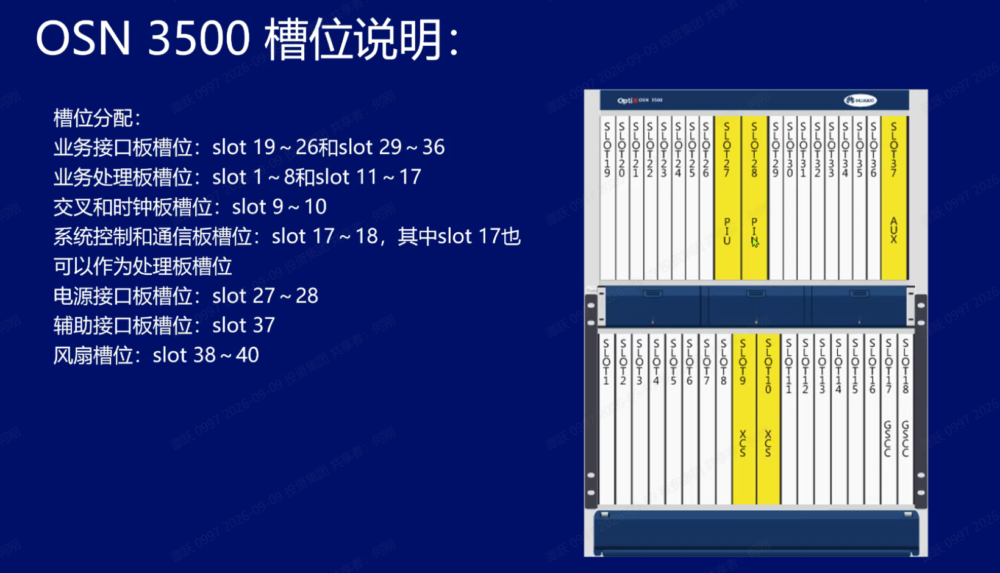

上一节说"业务板 15 个槽、接口板 16 个槽"，这页是具体每个槽位插什么：

| 槽位 | 插什么板 | 对应前文 |
| --- | --- | --- |
| **slot 1~8、11~17** | **业务处理板**（交叉/调度在这里发生） | 9 节说的"低阶/高阶交叉"由这些板完成 |
| **slot 9~10** | **交叉和时钟板（XCS）** | 7.4 的时钟功能 + 交叉矩阵都在这；**插两块 = 1+1 热备份**（设备照片里那对 XCS 就是） |
| **slot 17~18** | **系统控制和通信板（SCC）**（slot 17 也可作处理板） | 设备的"大脑"，管网管通信；同样成对出现（照片里的 GSCC×2） |
| **slot 19~26、29~36** | **业务接口板**（出光口/电口） | 光口板面板上印的就是 7.7 那些代码（L-16.1、S-4.1） |
| **slot 27~28** | **电源接口板（PIU）** | 双路供电，也是 1+1 |
| **slot 37** | **辅助接口板（AUX）** | 告警输出、公务电话等辅助接口 |
| **slot 38~40** | **风扇** | 散热 |

**槽位布局的规律：处理和接口分离。**

- 上半子架（19~37）：**接口区 + 电源 + 辅助**——对外连线都在这
- 下半子架（1~18）：**处理区 + 交叉时钟 + 控制**——对内调度都在这
- 业务流向：**接口板收光 → 处理板做交叉调度 → 交叉板汇到线路方向**，一块业务数据要经过"接口区 → 处理区"两次穿越，所以槽位按功能分区而不是混插

> 串回前文：关键单板（XCS、SCC、PIU）全部**成对配置**，就是 9 节"硬件 1+1 保护"的具体落位——任何一块坏掉，备板秒接管，业务无感。

### 小兄弟：华为 OptiX OSN 2500

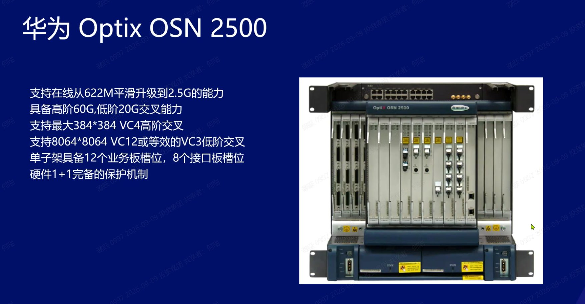

和 OSN 3500 同一家族的**下一档设备**（定位城域汇聚层），规格结构完全同款、数字整体缩一号：

| 规格 | OSN 2500 | OSN 3500 | 解码 |
| --- | --- | --- | --- |
| 在线升级 | **622M → 2.5G**（STM-4 → STM-16） | 2.5G → 10G（STM-16 → STM-64） | 升级路径低两档（7.3 速率表） |
| 高阶交叉 | **60G**（384×384 VC4） | 200G（1280×1280 VC4） | 384 × 155M ≈ 60G，VC4 级调度 |
| 低阶交叉 | **20G**（8064×8064 VC12/VC3） | 20G/40G/120G | 8064 × 2M ≈ 16.5G ≈ 20G，VC12 级调度 |
| 槽位 | **12 业务板 + 8 接口板** | 15 业务板 + 16 接口板 | 子架更小，接入容量更低 |
| 硬件保护 | 1+1 | 1+1 | 关键单板热备，家族统一 |

**两个家族共同点：**

- 规格写法一模一样（升级路径 / 高阶交叉 / 低阶交叉 / 槽位 / 1+1 保护）——华为传输设备的产品说明都按这个套路，**看懂一台就看懂一族**。
- 交叉能力和接入容量是划档的核心依据：3500 是 200G 级（骨干/核心层），2500 是 60G 级（汇聚层），再往下还有接入档——正好对应第六节"SDH 适用于本地传输网"的分层部署思路。

> 串回前文：把 OSN 3500/2500 的档位放回第六节设备表——**大颗粒、高交叉的在骨干（OTN/高档 MSTP），小容量、灵活接入的在本地/汇聚（低档 MSTP）**，同一套 SDH 技术内核按网络层级做裁剪。

### OSN 2500 槽位说明

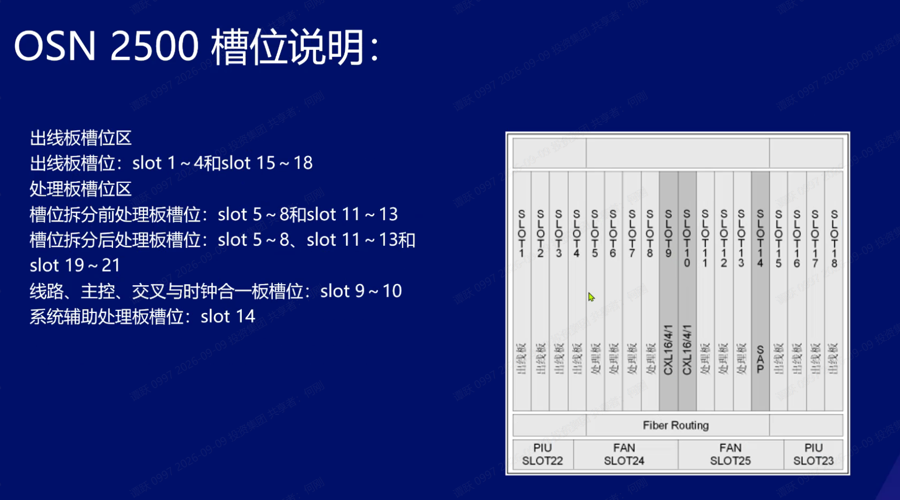

2500 的槽位分区逻辑和 3500 一致（处理/出线分离），但**集成度更高**：

| 槽位 | 插什么 |
| --- | --- |
| **slot 1~4、15~18** | **出线板槽位区**（对外接口） |
| **slot 5~8、11~13** | 处理板槽位（拆分前配置） |
| **slot 5~8、11~13 + 19~21** | 处理板槽位（**槽位拆分后**配置，多出 19~21 三个槽） |
| **slot 9~10** | **线路、主控、交叉与时钟合一板（CXL 16/41）** |
| **slot 14** | 系统辅助处理板（SAP） |
| **slot 22/23** | 电源接口板 PIU |
| **slot 24/25** | 风扇 FAN |

**和 3500 最大的区别：板卡"合一"了。**

- 3500 上交叉时钟（XCS）、系统控制（SCC/GSCC）是**独立的单板**，各占槽位；
- 2500 档次低、空间小，把**线路 + 主控 + 交叉 + 时钟做成一块 CXL 合一板**——一板四用，代价是单板集成度高、功率密度大；
- 保护思路不变：slot 9~10 依然是**两块 CXL 成对配置 = 1+1 热备**，PIU 也是双电源（22/23 对称）。
- 「槽位拆分」是 2500 特有的灵活配置：开启拆分功能后，处理板槽位从 6 个扩到 9 个（多出 19~21），用槽位换容量——小设备也能按需扩。

> 对照记忆：3500 = **大机架、功能单板化**（XCS/SCC 各就各位），2500 = **小机架、功能合一化**（CXL 一板四用）——档位差不仅体现在交叉容量上，也体现在板卡集成度上。

### 最小档：华为 OptiX OSN 1500 设备结构

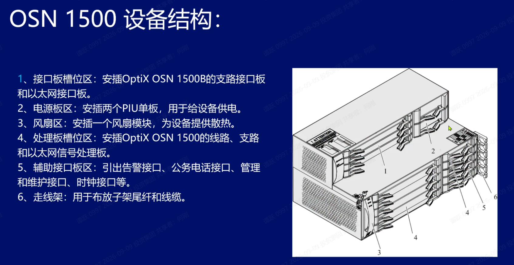

家族第三档（接入档），图上是设备结构剖视图，六个功能区：

| # | 区域 | 作用 |
| --- | --- | --- |
| 1 | **接口板槽位区** | 插支路接口板和以太网接口板 |
| 2 | **电源板区** | 两个 PIU 单板供电（依然双电源 1+1） |
| 3 | **风扇区** | 一个风扇模块散热 |
| 4 | **处理板槽位区** | 线路、支路和以太网信号处理板 |
| 5 | **辅助接口板区** | 告警接口、公务电话、管理和维护接口、时钟接口等 |
| 6 | **走线架** | 布放子架尾纤和线缆（纯机械结构，不插板） |

**三代设备放一起，档位递减的规律一目了然：**

| | OSN 3500 | OSN 2500 | OSN 1500 |
| --- | --- | --- | --- |
| 定位 | 骨干/核心（200G 交叉） | 城域汇聚（60G 交叉） | 接入档（最低） |
| 关键单板 | XCS、SCC 独立单板 | CXL 四合一（线路+主控+交叉+时钟） | 处理板进一步集成 |
| 不变的部分 | 双 PIU 电源、1+1 保护、辅助接口 | 同左 | 同左 |

**不变的三件事**：双电源 PIU、关键板 1+1、辅助接口区（告警/公务/时钟）——无论档位怎么降，可靠性的底线配置一路保留，这是传输设备和普通交换机的设计分野。

> 看图技巧：结构剖视图里编号 6 的"走线架"看着不起眼，但机房里几十台设备的尾纤全靠它理线——**设备再小，走线架就是机房的秩序**。

### 三代通用单板说明（OSN 3500/2500/1500）

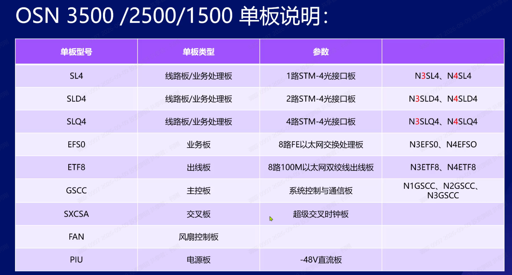

| 单板型号 | 类型 | 参数 |
| --- | --- | --- |
| **SL4** | 线路板/业务处理板 | 1 路 STM-4 光接口板 |
| **SLD4** | 线路板/业务处理板 | 2 路 STM-4 光接口板 |
| **SLQ4** | 线路板/业务处理板 | 4 路 STM-4 光接口板 |
| **EFS0** | 业务板 | 8 路 FE 以太网交换处理板 |
| **ETF8** | 出线板 | 8 路 100M 以太网双绞线出线板 |
| **GSCC** | 主控板 | 系统控制与通信板 |
| **SXCSA** | 交叉板 | 超级交叉时钟板 |
| **FAN** | 风扇控制板 | — |
| **PIU** | 电源板 | -48V 直流板 |

**单板命名有规律，会拆就知道是什么板：**

- **SL4 / SLD4 / SLQ4**：SL = STM-4 线路板（Line），后缀 **D = Dual 双路、Q = Quad 四路**——同一块功能的 1/2/4 口版本，按需选
- **EFS0 / ETF8**：EF = Ethernet FE（百兆以太网），**EFS = 交换处理（往里插在处理区）、ETF = 双绞线出线（往外插在出线区）**——一对板配合工作：EFS0 做二层交换，ETF8 引出 8 个 RJ45 口
- **GSCC**：General SCC，就是槽位图里那对"系统控制与通信板"；**N1/N2/N3/N4 前缀是硬件版本号**（同一块板的迭代），配板时版本要匹配
- **SXCSA**：超级交叉时钟板 = 3500 槽位图里的 XCS，7.4 的时钟 + 交叉矩阵都在上面

**两个工程常识：**

- **PIU 是 -48V 直流**——通信机房统一用 -48V DC（历史原因 + 安全考虑：负电压不易腐蚀、48V 以下人体安全），所以机房必配 -48V 电源架/蓄电池组，市电断了电池顶上。
- EFS0/ETF8 这对以太网板就是 **MSTP 里"M"（多业务）的实体**——7.5 里"入口能接 ETH"靠的就是它们，纯 SDH 是没有这种板的。

> 串回前文：SL4 系列对应 7.7 光口代码（STM-4 级、印着 S-4.1/L-4.1 之类）；SXCSA 对应槽位 9~10 的成对热备；GSCC 对应 17~18 槽——**单板型号 × 槽位表 × 设备规格三张图拼起来，就是这台设备的完整配置单**。

### 单板功能介绍（类比版）

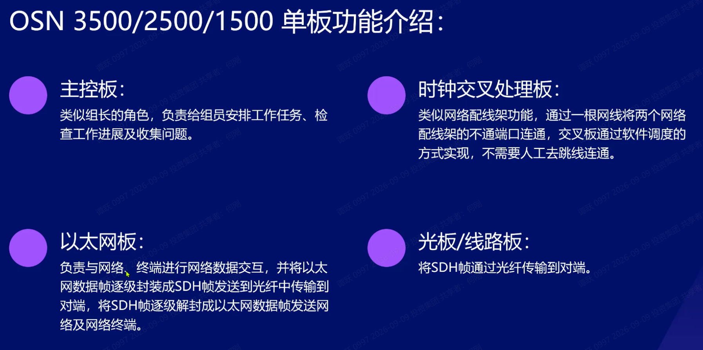

上一节是单板型号表，这页用类比讲四大核心板卡的**职责**，两张对照着看：

| 板卡 | 类比 | 实际职责 | 对应型号 |
| --- | --- | --- | --- |
| **主控板** | **组长**：给组员安排任务、检查进展、收集问题 | 系统控制与通信：下发配置、收集告警性能、管全网管通信 | GSCC |
| **时钟交叉处理板** | **软件化的配线架**：老机房要人工在配线架跳线连通两个端口，交叉板用**软件调度**实现同样的事，不用人跳线 | 交叉矩阵 + 时钟——哪个业务走哪条线，软件配置一下就行 | SXCSA |
| **以太网板** | （无类比，讲流程） | **封装链**：以太网数据帧 → 逐级封装成 SDH 帧 → 上光纤发对端；对端反向逐级解封回以太网帧交给终端 | EFS0 / ETF8 |
| **光板/线路板** | （无类比，一句话） | 将 SDH 帧通过光纤传输到对端 | SL4 / SLD4 / SLQ4 |

**两个值得展开的点：**

1. **"软件配线架"是交叉板的精髓**。传统机房改一条电路 = 工程师拿跳线去配线架上物理插拔；SDH 交叉板把这件事变成了网管上下发一条调度指令——分钟级 vs 天级，这也是"交叉调度能力"被列为传输设备核心指标（9 节那些 200G/60G 交叉）的原因：**交叉容量 = 软件配线架的端口规模**。
2. **以太网板的"逐级封装/解封"**就是 7.5 工作方式的以太网版细节：ETH 帧 → 映射进容器 → VC 复用 → STM-N 帧 → 电/光转换上纤；对端倒序拆开。一去一回，两端以太网板配合 EFS0+ETF8 完成。

> 串回前文：四大板卡正好是 7.5 端到端旅程的分工——以太网管"封装拆封"、交叉板管"走哪条路"、光板管"上光纤"、主控板管"指挥调度和上报状态"。

---

## 十、新一代设备：华为 OptiXtrans E6616（OTN 世代）

> **注：本地只有万载、铜鼓两个站使用该设备。**

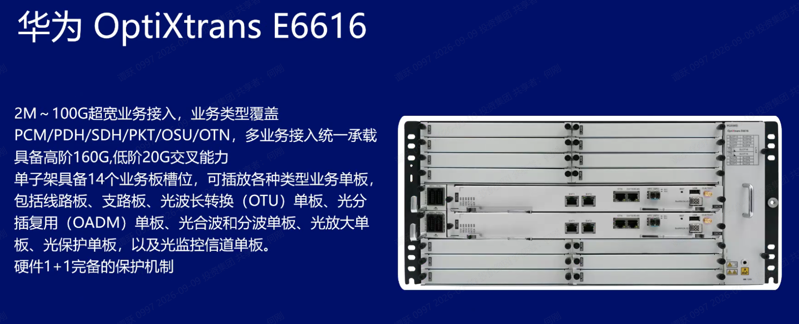

OSN 家族是 SDH/MSTP 世代，E6616 则是**OTN 世代**的下一代产品——前面第一节讲的 OTN 架构落到实物上了：

**规格速览：**

| 规格 | 数值 | 解码 |
| --- | --- | --- |
| 业务接入范围 | **2M ~ 100G** | 从 E1 小颗粒到 100G 大颗粒通吃，跨度远超 OSN（OSN 上限 STM-64=10G） |
| 业务类型 | PCM / PDH / SDH / PKT / **OSU / OTN** | 相比 MSTP 新增 OSU（光业务单元，OTN 时代的"VC12 继任者"，2M 级颗粒的 OTN 承载）和 PKT（分组）——"多业务接入统一承载" |
| 交叉能力 | 高阶 160G / 低阶 20G | 档位对标 OSN 2500（60G）与 3500（200G）之间 |
| 槽位 | 14 个业务板槽位 | 子架结构一脉相承 |
| 保护 | 硬件 1+1 | 家族传统不变 |

**真正值得细看的是它能插的单板类型——一张图列全了第一、四节的所有光层角色：**

| 单板类型 | 干什么的 | 对应前文 |
| --- | --- | --- |
| **线路板 / 支路板** | 对外线路 / 接入业务 | 同 OSN 家族 |
| **光波长转换单板（OTU）** | 业务信号 ↔ 特定波长光的转换（O-E-O），"给业务分配车道" | DWDM 的"每条车道一个波长"（第一节 ②） |
| **光分插复用单板（OADM）** | 在中间站**上下**部分波长，其余波长直通 | OTN"光层交叉连接与调度"的站点级实现（第一节 ③） |
| **光合波 / 分波单板（MUX/DMUX）** | 几十个波长**合到一根纤** / 到对端**按波长分开** | DWDM 本体——"几十辆不同颜色的车挤一根光纤" |
| **光放大单板** | 补偿光纤损耗，光→光直接放大 | **就是第五节那块"光放大板"（EDFA）** |
| **光保护单板（OLP）** | 主备光路自动倒换 | 7.6 的 1+1 保护思想在光层的产品化 |
| **光监控信道单板（OSC）** | 独立于业务波长监控整条光线路 | 放大器/线路状态的"值班电话" |

**一句话总结 E6616 的定位**：OSN 是"SDH 内核 + 以太网板"，E6616 是"**OTN 内核 + 全套光层单板**"——从 OSN 到 E6616，设备能插的板卡从电层（VC 调度）扩展到了光层（波长调度 + 放大 + 合分波），这正是第一节讲的演进（SDH → DWDM → OTN）在设备产品线上的投影。

> 对应关系：E6616 之于 OTN ≈ OSN 3500 之于 SDH——都是各自世代的中坚机型；而它槽位里的光放大板、合分波板，就是第一、四、五节所有"光层概念"的实体。

### 同门结构：OSN 1800V / 1800V Pro / E6616

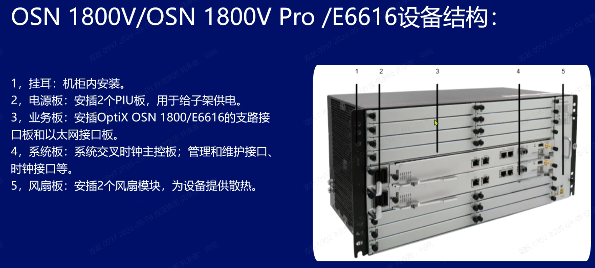

OSN 1800V 和 E6616 是**同一机框结构**（同一张结构图盖两个章），五个功能区：

| # | 区域 | 说明 |
| --- | --- | --- |
| 1 | **挂耳** | 机柜内安装固定用（纯结构件） |
| 2 | **电源板** | 2 个 PIU 板供电——双电源传统保留 |
| 3 | **业务板** | 支路接口板、以太网接口板 |
| 4 | **系统板** | **系统交叉时钟主控板**；管理和维护接口、时钟接口等 |
| 5 | **风扇板** | 2 个风扇模块散热 |

**注意"系统板"这个叫法**：交叉 + 时钟 + 主控**三合一**——比 2500 的 CXL（线路+主控+交叉+时钟四合一）少了线路功能，比 3500 的独立 XCS/SCC 更集成。集成度趋势一路走到底：**3500 单板化 → 2500 四合一 → 1800V/E6616 三合一**，机框越小，单板功能堆得越密。

> 这也回答了一个隐含问题：为什么 E6616 一个子架只有 14 个业务槽（比 3500 的 15+16 少）——新一代设备把主控/交叉/时钟压进一块系统板，省出的空间换更宽的业务接入（2M~100G），**用集成度换业务密度**。

### OSN 1800V / E6616 槽位说明

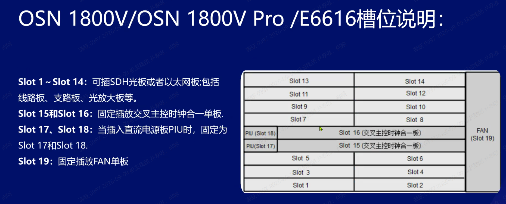

| 槽位 | 插什么 |
| --- | --- |
| **Slot 1~14** | 业务槽：可插 SDH 光板或以太网板——**线路板、支路板、光放大板**等 |
| **Slot 15、16** | **固定**插交叉主控时钟合一板（就是上一节的"系统板"，两块成对 1+1） |
| **Slot 17、18** | 直流电源板 PIU（双电源） |
| **Slot 19** | FAN 风扇板 |

对照槽位图更直观：1~14 两列排开是业务区，15/16 横贯中间是系统板（结构图正面对着你的两块宽板），17/18 PIU + 19 FAN 在底部收尾。

**三个值得注意的点：**

1. **"光放大板"直接列在业务槽的可插清单里**——这是和 OSN 家族最大的不同：3500/2500 插的全是电层业务板，1800V/E6616 的业务槽能插**光层单板**（放大、乃至前面说的 OTU/OADM 类），设备从"电层交叉机"升级成了"光层站点"。
2. **系统板固定槽位、成对配置**：15/16 两块交叉主控时钟合一板 = 1+1 热备，和 2500 的 CXL 双板（9~10 槽）、3500 的 XCS 双板一个思路，**保护设计换汤不换药**。
3. 槽位总数 19 个 = 14 业务 + 2 系统板 + 2 电源 + 1 风扇——和 E6616 规格页"14 个业务板槽位"对上了。

> 至此五代设备的"规格 + 槽位"全部对齐：3500（单板化、最复杂）→ 2500（CXL 四合一）→ 1500（接入档）→ 1800V/E6616（系统板三合一 + 光层单板下放业务槽）。产品线一代比一代集成，但双电源、双系统板、风扇冗余的骨架从没变过。

### OSN 1800V / E6616 单板说明

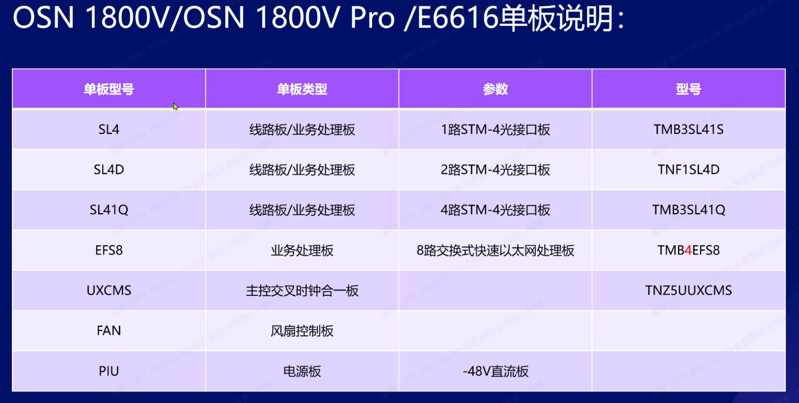

| 单板型号 | 类型 | 参数 | 完整型号示例 |
| --- | --- | --- | --- |
| **SL4** | 线路板/业务处理板 | 1 路 STM-4 光接口板 | TMB3SL41S |
| **SL4D** | 线路板/业务处理板 | 2 路 STM-4 光接口板 | TNF1SL4D |
| **SL41Q** | 线路板/业务处理板 | 4 路 STM-4 光接口板 | TMB3SL41Q |
| **EFS8** | 业务处理板 | 8 路交换式快速以太网处理板 | TMB4EFS8 |
| **UXCMS** | 主控交叉时钟合一板 | —（即槽位 15/16 的"系统板"） | TNZ5UUXCMS |
| **FAN** | 风扇控制板 | — | — |
| **PIU** | 电源板 | -48V 直流板 | — |

**和 OSN 家族单板名对比，有三个细节：**

1. **线路板命名几乎沿用**：SL4 还是那个 SL4（STM-4 线路板），口数后缀从 SLD4/SLQ4 变成 SL4D/SL41Q——**D=双路、Q=四路的规则没变**，只是写法挪了位。老工程师换新设备，看板卡名基本无感切换。
2. **以太网板从 EFS0 → EFS8**：还是 8 路 FE 交换处理板，功能同源；这一代表格里没列 ETF8 出线板，是因为 1800V/E6616 的接口板形态整合了（E6616 规格页里"支路接口板/以太网接口板"）。
3. **UXCMS = 主控交叉时钟合一板**，就是结构图和槽位图里的"系统板"（15/16 槽那对）——名字里 UXC = 交叉、MS = 主控系统，四合一里的三合一版本。**完整型号前缀（TMB3/TNF1/TNZ5…）是封装/版本代号**，同一逻辑单板因版本和接口形态不同而前缀不同，下单时按现场版本匹配即可。

> 收口：单板名一脉相承（SL4/EFS/GSCC→UXCMS/PIU/-48V），机框结构一脉相承（业务区+系统板+双电源+风扇），**华为传输设备学的第一台，后面全靠对照**。

---

## 十一、华为 NCE 统一网管

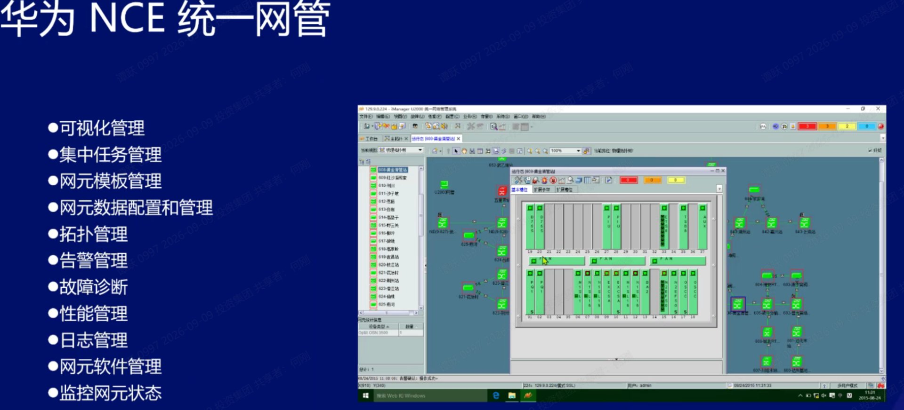

前面十节都在讲设备，这一节讲**怎么管设备**——NCE（Network Cloud Engine）是华为新一代统一网管（U2000 的继任者），一台服务器管全网所有传输设备。右边截图就是网管界面：左侧资源树（万载、铜鼓等各站网元）、中间网元面板（绿色 = 单板在位正常）、右侧全网拓扑图。

图上 11 项功能不是并列的，按日常使用可以归成四类：

| 类别 | 功能 | 干什么 |
| --- | --- | --- |
| **看得见** | 可视化管理、拓扑管理、监控网元状态 | 全网拓扑一张图：哪台设备、哪块单板、哪条链路，绿色正常/红色故障，一眼定位 |
| **配得对** | 网元数据配置和管理、网元模板管理、集中任务管理 | 配置业务（交叉调度指令就从这下发）、模板批量下发、任务集中执行——7.9 说的"软件配线架"的软件就是它 |
| **管得住** | 告警管理、故障诊断、性能管理 | 告警上报（光功率异常、单板不在位、R_LOS 断纤……）、在线诊断、性能数据（误码、光功率曲线）采集分析 |
| **查得到** | 日志管理、网元软件管理 | 操作日志审计（谁改了什么）、网元软件版本批量升级 |

**和前面内容的对应：**

- **主控板（GSCC/UXCMS）就是网管的"耳朵和嘴"**：网管指令下发、告警性能上报，全走主控板——所以 3500 槽位里 SCC 双板热备，坏一块网管还在线。
- **告警管理**收的就是 7.4/7.6 里那些状态的汇总：时钟劣化、保护倒换发生、光功率越限，都会变成网管上的告警条目。
- **性能管理**对应第八节：光功率、误码率（BER）这些指标，日常不用拿光功率计爬站，网管直接采曲线、设门限。
- **"拓扑管理"的绿色面板**就是右边截图中间那个：每块单板画成一个小格子，在位亮绿、告警亮红/黄——第五节光放大板 MON 口的"水压表"，最终都汇到这张图上。

> 一句话：**设备负责跑业务，NCE 负责看得见、配得对、管得住、查得到。** 现场维护的第一入口往往不是机柜里的设备，而是这台网管。

### NCE 网管【常见告警处理】

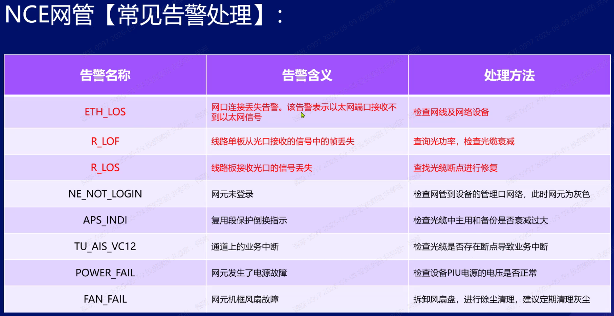

上节"管得住"的具体清单——八个最常见的告警，**名字会拆就知道是啥**（R_ = Receive 接收侧，LOS = Loss of Signal 信号丢失，LOF = Loss of Frame 帧丢失，NE = Network Element 网元，AIS = Alarm Indication Signal 告警指示信号，APS = 自动保护倒换）：

| 告警 | 含义 | 处理方法 | 串回前文 |
| --- | --- | --- | --- |
| **ETH_LOS** | 以太网端口收不到以太网信号 | 检查网线及网络设备 | EFS/ETF 板的网口侧 |
| **R_LOF** | 光口收到的信号**帧丢失** | 查询光功率，检查光缆衰减 | 帧失步 = 段开销帧定位失败（7.1），链路还通但质量差到解不出帧 |
| **R_LOS** | 线路板光口**信号丢失** | 查找光缆断点进行修复 | 最硬的告警：光都没了，基本就是断纤/对端没发 |
| **NE_NOT_LOGIN** | 网元未登录（网元显示灰色） | 检查网管到设备的管理口网络 | 主控板（SCC/UXCMS）是网管的"耳朵和嘴"，嘴断了就是灰色 |
| **APS_INDI** | 复用段保护倒换指示 | 检查主用和备份光缆是否衰减过大 | **7.6 的保护倒换真的发生了**——业务没断（切到备用了），但主用路有问题，别当成"没告警"忽略它 |
| **TU_AIS_VC12** | VC12 通道上业务中断 | 检查光缆是否有断点导致业务中断 | TU_AIS 是**上游发来的"我这边坏了"通知**：上游检测到故障后，向下游插 AIS 告警指示，告诉下游"这个通道里的数据别信了" |
| **POWER_FAIL** | 网元电源故障 | 检查设备 PIU 电源电压是否正常 | PIU 就是那个 -48V 电源板，双配置时坏一块业务不中断但必须换 |
| **FAN_FAIL** | 机框风扇故障 | 拆卸风扇盘除尘清理，建议定期清灰 | 机房灰尘是风扇第一杀手 |

**告警处理的心法（从表里提炼）：**

1. **先分"断没断"**：R_LOS/POWER_FAIL 是硬故障（业务已中断），APS_INDI 是软告警（业务没断但主用路劣化），优先级和处理紧迫度完全不同。
2. **R_LOS 和 R_LOF 的区别**：LOS = 光没了（物理断），LOF = 光在但帧解不出来（衰减过大/质量劣化）——**一个是断，一个是虚**，查法也不同（找断点 vs 查衰减）。
3. **AIS 类告警要看上游**：TU_AIS_VC12 报在本站，根因往往在上游站——顺着业务方向往上游查，别在本站死磕。

### NCE 网管【光功率管理】

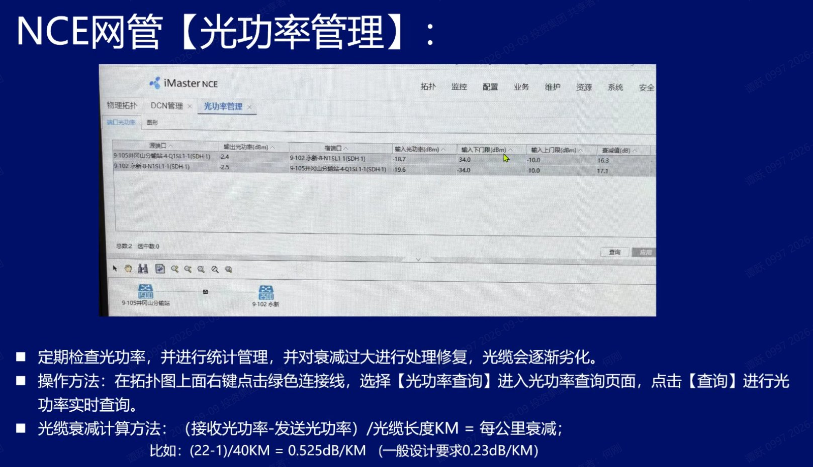

光功率是光链路最重要的健康指标（第八节 01），这一页讲怎么在网管上把它管起来。

**为什么要定期查光功率？** 光缆会**逐渐劣化**——接头进水受潮、光纤弯曲应力、熔接点老化都会让衰减慢慢变大。光功率查询就是给光缆做"体检曲线"，衰减异常增大 = 该安排处理修复了，别等 R_LOS 断了再动手。

**操作方法**：拓扑图上**右键点击绿色连接线** → 选【光功率查询】→ 进入页面点【查询】实时查询。界面上每条链路显示：源口/宿口的**输出光功率(dBm)、输入光功率(dBm)、输入门限(dBm)**——输入功率跌破下门限就会告警，这就是第八节"过低接收端无法识别"的工程化护栏。

**光缆衰减计算方法：**

```
每公里衰减 = |发送光功率 - 接收光功率| / 光缆长度(km)
例：(22 - 1) / 40 km = 0.525 dB/km
一般设计要求：0.23 dB/km
```

**怎么解读这个数：**

- **0.23 dB/km 是设计基准**（1550nm 窗口光纤本征衰减约 0.19~0.22 dB/km + 熔接点/活动连接器余量）。算出来**接近 0.23 = 健康**。
- 例子里 0.525 dB/km 是设计值的 2 倍多——这条 40km 链路已经严重劣化（可能弯曲受压、接头受潮或熔接点问题），要列入整改。
- **注意公式方向**：截图上写"接收-发送"，实际取的是**两端功率差的绝对值**（发送必大于接收，衰减恒为正），手算时别把符号搞反。

> 串回前文：这就是第八节光损耗指标的日常化运维——不需要光功率计爬站，网管直接读两端板的收发光功率（SL4 这类光板自带功率检测），算每公里衰减对比 0.23 基准。而距离上限（7.7 的 W 段分档）本质上也是"发端功率 - 0.23dB/km × 距离 ≥ 接收灵敏度"这道算术题。
