---
aliases:
---
# 言语理解与表达

## 必考题型

### 一、片段阅读

- 中心理解题（基础 & 重要）
- 细节判断题

### 二、语句表达

- 语句排序题
- 语句填空题
- 接语选择题

### 三、逻辑填空（题量大 & 难度高）

- 实词填空
- 成语填空
- 混搭填空

## 中心理解题

### 提问方式：

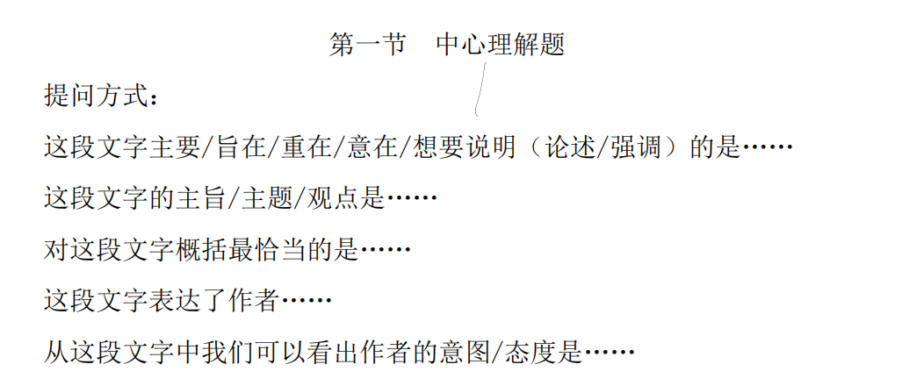

### 中心理解题 · 知识点截图

#### 转折关系

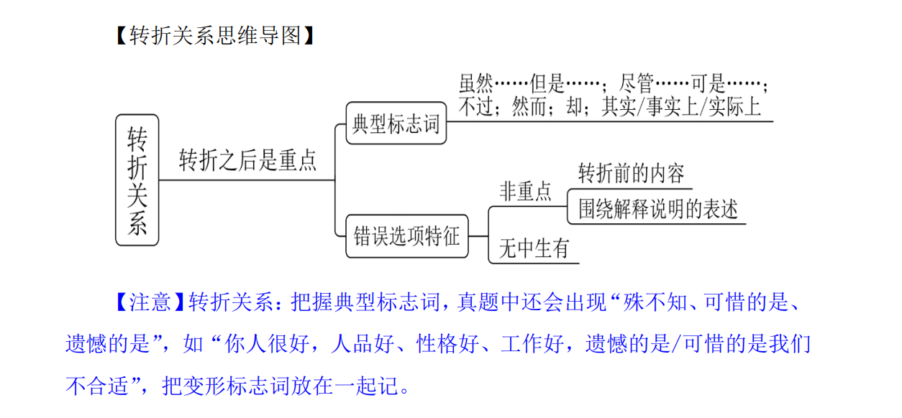

> 要点：转折之后是重点，转折前的内容非重点。典型标志词：虽然……但是……、尽管……可是……、不过、然而、却、其实/事实上/实际上。变形标志词：殊不知、可惜的是、遗憾的是（如"你人很好……遗憾的是/可惜的是我们不合适"）。

#### 因果关系

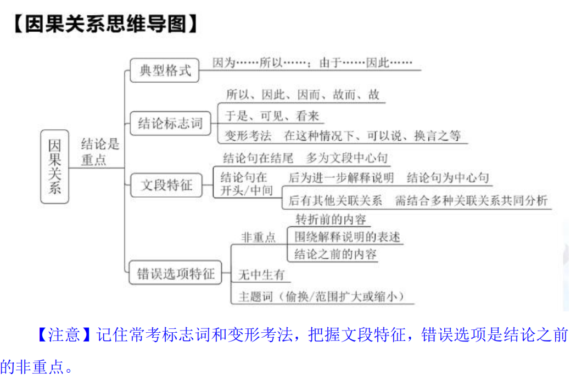

> 完整思维导图：结论是重点。结论标志词：所以、因此、因而、故而、故、于是、可见、看来；变形考法：在这种情况下、可以说、换言之等。文段特征：结论句在结尾多为中心句；在开头/中间时，后面是解释说明则结论句仍是中心句，后面有其他关联关系则需结合多种关联关系共同分析。错误选项特征：转折前/结论前内容非重点、解释说明的表述、无中生有、主题词偷换或范围扩大缩小。

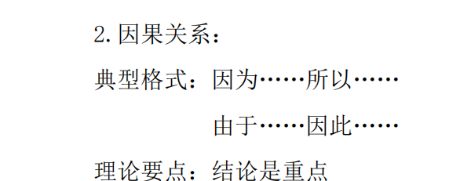

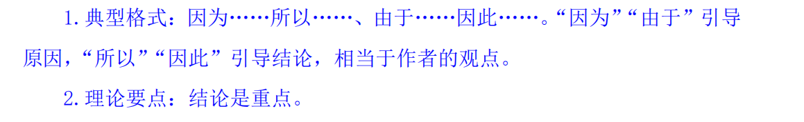

> 要点：结论是重点。"因为/由于"引导原因，"所以/因此"引导结论，结论相当于作者的观点。典型格式：因为……所以……、由于……因此。

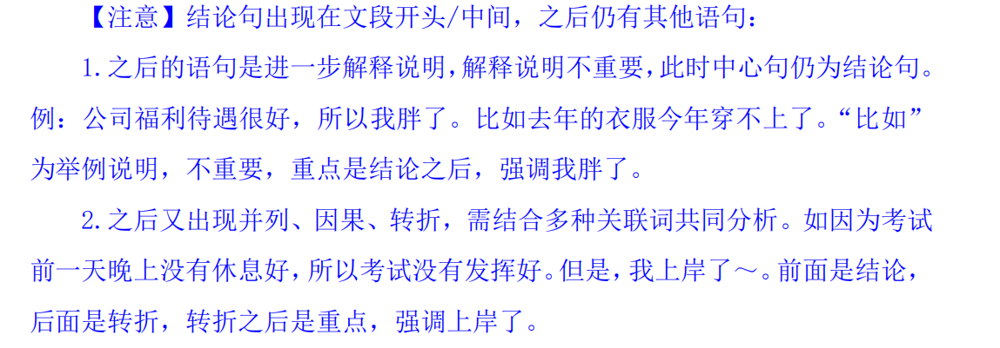

> 注意：结论句在文段开头/中间时——① 之后是解释说明（如"比如"举例），不重要，中心句仍是结论句；② 之后出现并列、因果、转折，需结合多种关联词共同分析（如"……所以没发挥好。但是，我上岸了"——转折之后是重点）。

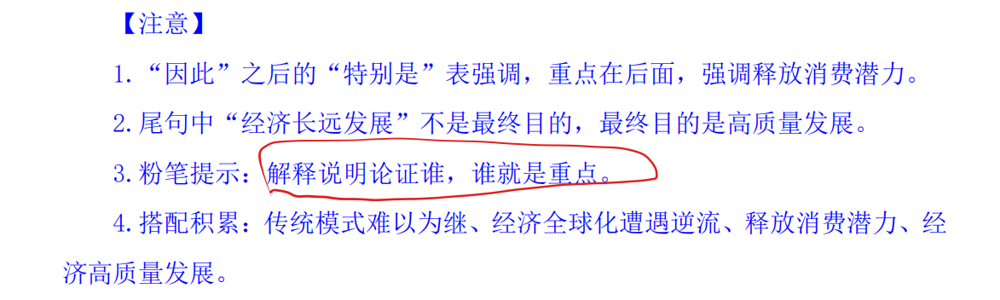

> 结论下的特殊点（强调）：① "因此"之后的"特别是"表强调，重点在后面；② 尾句"经济长远发展"不是最终目的，最终目的是高质量发展；③ 粉笔提示：解释说明论证谁，谁就是重点；④ 搭配积累：传统模式难以为继、经济全球化遭遇逆流、释放消费潜力、经济高质量发展。

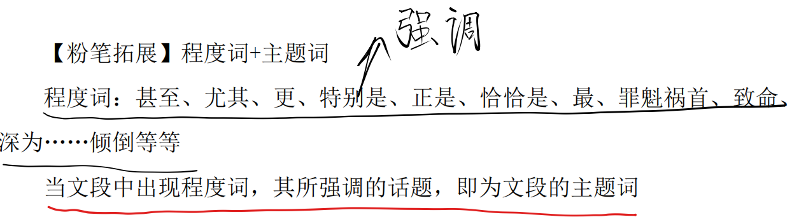

#### 并列关系

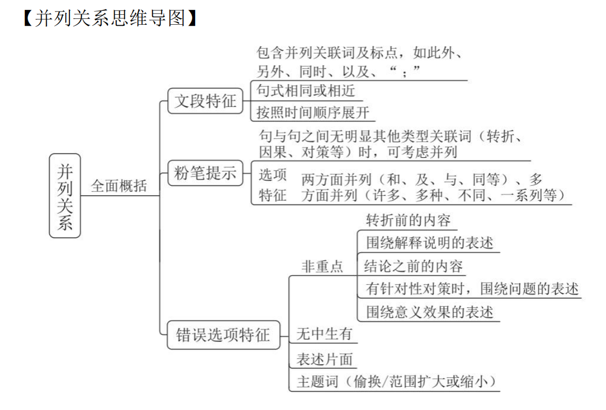

> 思维导图：文段特征（并列关联词及标点：此外/另外/同时/以及/"；"；句式相同或相近；按时间顺序展开）。粉笔提示：句与句之间无明显其他类型关联词（转折、因果、对策等）时，可考虑并列。全面概括特征：两方面并列（和、及、与、同等）、多方面并列（许多、多种、不同、一系列等）。错误选项：转折前内容、解释说明类、结论之前内容、围绕问题/意义效果、无中生有、表述片面、主题词偷换/范围扩大缩小。

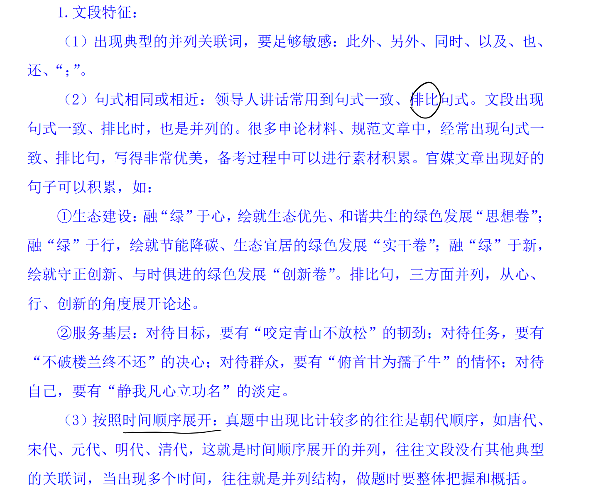

> 文段特征：① 典型并列关联词要敏感——此外、另外、同时、以及、也、还、"；"；② 句式相同或相近（排比句式，领导讲话/官媒文章常见，可做素材积累，如生态建设"三卷"、服务基层"四对待"）；③ 按时间顺序展开（如朝代顺序，出现多个时间往往是并列结构，需整体把握和概括）。

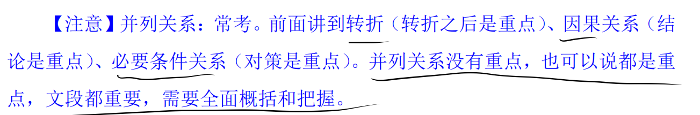

> 注意：并列关系没有重点（也可以说都是重点），文段都重要，需要全面概括和把握。对比：转折之后是重点、因果结论是重点、必要条件对策是重点。

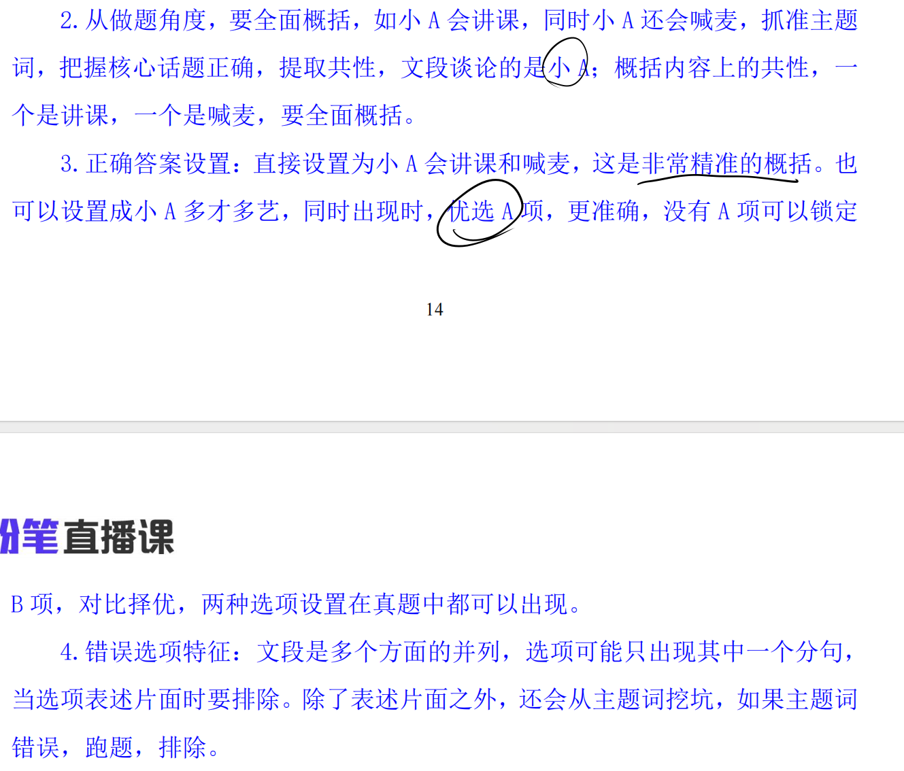

> 做题角度：① 要全面概括——抓准主题词、把握核心话题，提取内容共性（如"小A会讲课+会喊麦"，概括为"多才多艺"）；② 正确答案设置——精准概括（"讲课和喊麦"）或共性概括（"多才多艺"），同时出现优选更准确的，对比择优；③ 错误选项——只出现一个分句（表述片面）排除，主题词挖坑（跑题）排除。

#### 分述

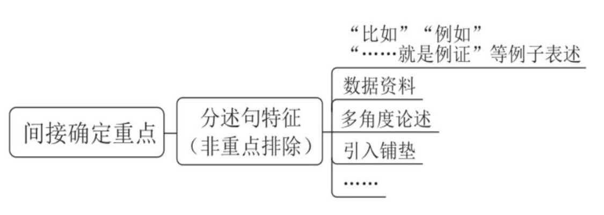

> 分述句特征：① "比如/例如/……就是例证"等例子表述；② 数据资料；③ 多角度论述；④ 引入铺垫。作用：间接确定重点（非重点排除）。

分述看起来像是并列，不确定的时候必须结合选项与分述内容

#### 主题词

主题词或者中心句不好判断的时候可以看解释说明论证谁来进行判断

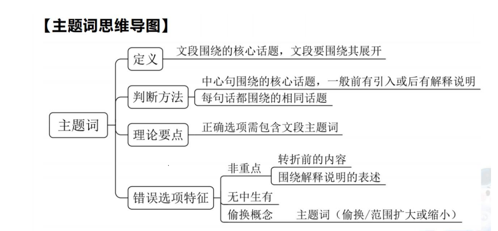

> 定义：文段围绕的核心话题。判断方法：① 中心句围绕的核心话题（一般前有引入或后有解释说明）；② 每句话都围绕的相同话题。理论要点：正确选项需包含文段主题词。错误选项：转折前内容非重点、解释说明类表述、无中生有、偷换概念、主题词偷换或范围扩大/缩小。

#### 对策

为什么...，这是原因，如何，这是对策

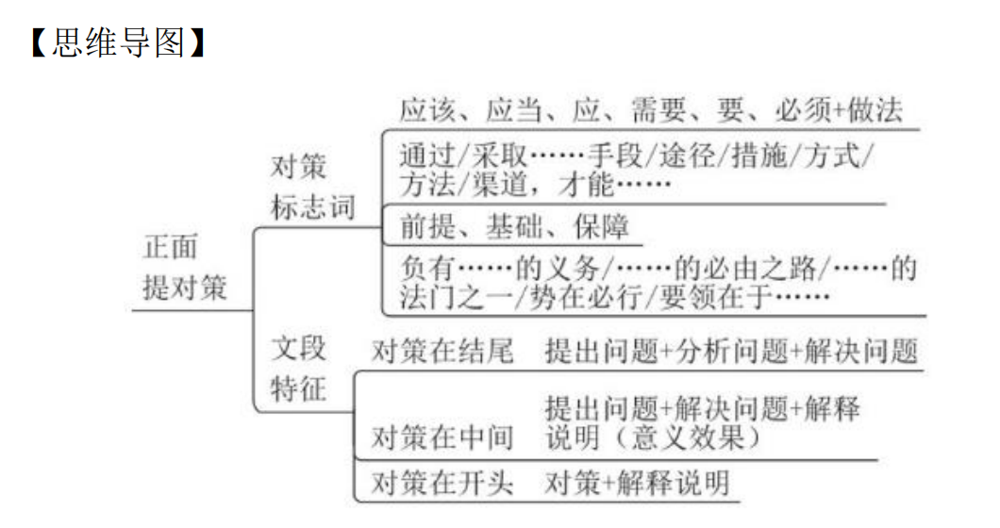

> 思维导图：对策标志词（应该/应当/应/需要/要/必须+做法；通过/采取……手段/途径/措施/方式/方法/渠道，才能……；前提、基础、保障；负有的义务/必由之路/法门之一/势在必行/要领在于……）；提对策（正面）；文段特征（对策在结尾：提出问题+分析问题+解决问题；对策在中间：提出问题+解决问题+解释说明；对策在开头：对策+解释说明）。

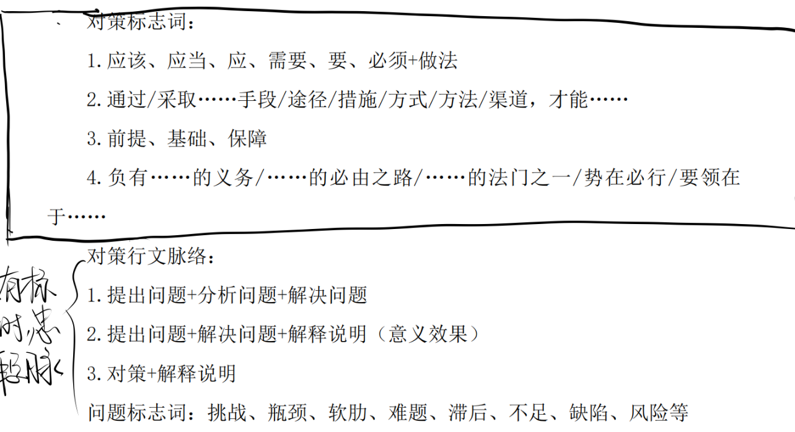

> 对策标志词：① 应该/应当/应/需要/要/必须 + 做法；② 通过/采取……手段/途径/措施/方式/方法/渠道，才能……；③ 前提、基础、保障；④ 负有的义务/必由之路/法门之一/势在必行/要领在……。行文脉络：提出问题+分析问题+解决问题；提出问题+解决问题+解释说明（意义效果）；对策+解释说明。问题标志词：挑战、瓶颈、软肋、难题、滞后、不足、缺陷、风险等。

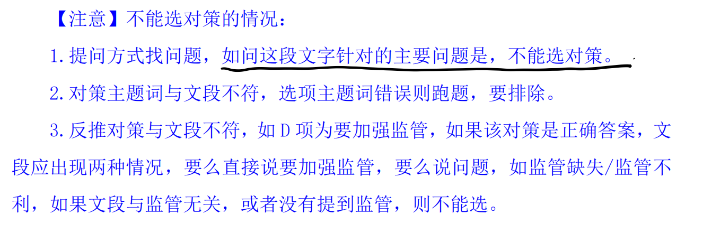

> 不能选对策的情况：① 提问方式找问题（如"这段文字针对的主要问题是"）→ 不能选对策；② 对策主题词与文段不符 → 跑题，排除；③ 反推对策与文段不符（如 D 项"要加强监管"：文段要么直接说要加强监管，要么说"监管缺失/监管不力"；文段与监管无关/没提到监管 → 不能选）。

##### 必要条件关系

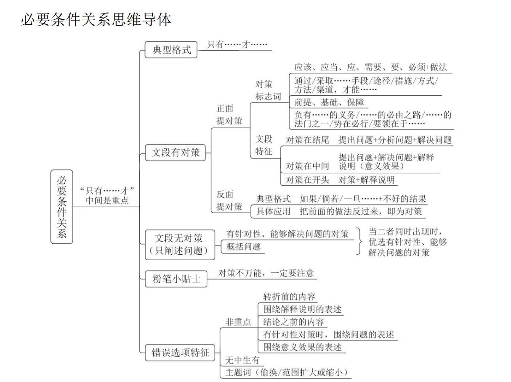

> 典型格式：只有……才……，中间是重点。提对策：正面（标志词）+ 反面（如果/倘若/一旦+不好的结果——把前面的做法反过来即为对策）。文段特征：文段有对策（对策在结尾/中间/开头）；文段无对策（只阐述问题）→ 概括问题，优选有针对性、能够解决问题的对策。粉笔小贴士：对策不万能，一定要注意。错误选项：转折前内容、解释说明类表述、结论之前的内容、有针对性对策时围绕问题的表述、围绕意义效果的表述、无中生有、主题词偷换/范围扩大缩小。

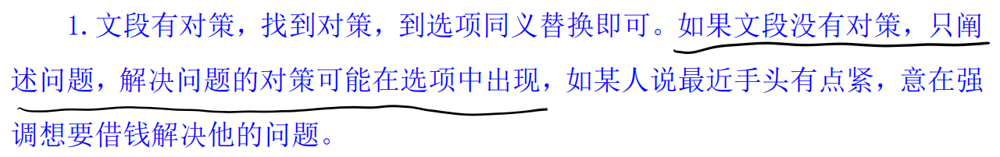

> 实操：① 文段有对策 → 找到对策，到选项里同义替换；② 文段无对策、只阐述问题 → 解决问题的对策可能出现在选项里（如"最近手头有点紧"意在借钱解决问题）。

**注意：结合文段和选项，来排除其他的错误选项**

## 细节判断题

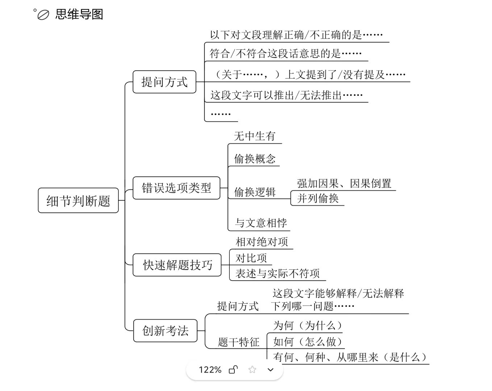

> 思维导图：提问方式（正确/不正确、符合/不符合、提到/没提及、可以推出/无法推出）；错误选项类型（无中生有、偷换概念、偷换逻辑：强加因果/因果倒置/并列偷换、与文意相悖）；快速解题技巧（相对绝对项、对比项、表述与实际不符项）；创新考法（"这段文字能够解释/无法解释下列哪一问题"，题干特征：为何/如何/有何/何种/从哪里来）。

### 提问方式

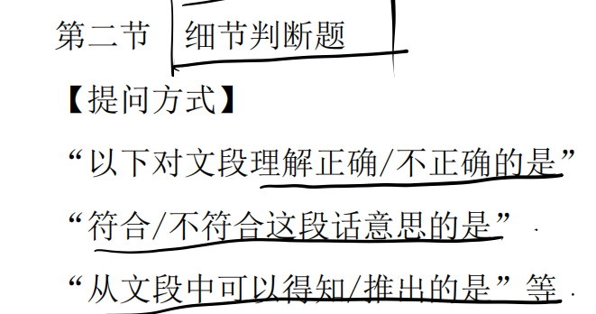

> 提问方式："以下对文段理解正确/不正确的是"、"符合/不符合这段话意思的是"、"从文段中可以得知/推出的是"等。

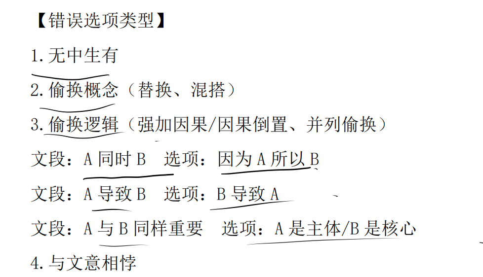

> 错误选项类型：① 无中生有；② 偷换概念（替换、混搭）；③ 偷换逻辑（强加因果/因果倒置："A同时B"偷换成"因为A所以B"、"A导致B"偷换成"B导致A"；并列偷换："A与B同样重要"偷换成"A是主体/B是核心"）；④ 与文意相悖。

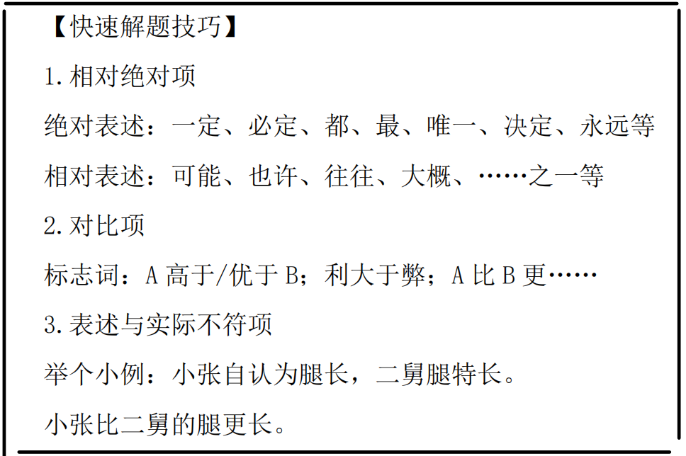

> 快速解题技巧：① 相对绝对项——绝对表述（一定、必定、都、最、唯一、决定、永远等）易错，相对表述（可能、也许、往往、大概、之一等）更稳；② 对比项——标志词 A高于/优于B、利大于弊、A比B更……；③ 表述与实际不符项（如文段只说"小张自认为腿长、二舅腿特长"，选项说"小张比二舅的腿更长"即不符）。

## 语句表达题

### 接语选择题

#### 思维导图

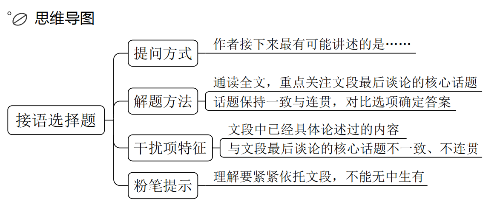

> 提问方式：作者接下来最有可能讲述的是……。解题方法：通读全文，重点关注文段最后谈论的核心话题；话题保持一致与连贯，对比选项确定答案。干扰项特征：文段中已具体论述过的内容；与文段最后谈论的核心话题不一致、不连贯。粉笔提示：理解要紧紧依托文段，不能无中生有。

 切记要忠于文段，对于接语，可以结合文段内容和选项内容进行反推，**如果接下来是说这些内容，文段内容应该是什么**
#### ==例题==

> [!NOTE]
> 通过选项，假设选择该选项，文段应当表述的内容，如下体A，若是推广过程，前文应该是已经普及了，但是文段的意思是还有诸多现实困境，没有推广

![[言语_接语_例1.png]]

> [!NOTE]
> 这个题目带来一个启示，最后一句话**我们应该从更大范围的互动中来考察中国文明的形成过程**这句话的主语是我们，状语是应该从.....的互动中，来考察是谓语，那么可以发现，更大范围是用来修饰互动的，所以重点是互动

![[言语_接语_例7.png]]

> 例7（2024 浙江）：引言部分结尾落在"这种考察视角有失偏颇……我们应该从更大范围的互动来考察中国文明的形成过程"，即话题是**从更大范围的互动考察中国文明的形成** → 选 A（早期中国文明的互动和演进模式）。B"中原中心论"是文段已论述过的内容、C 属细节、D"地理环境"主题词不符，均排除。

### 语句填空题
#### 思维导图

![[言语_语句填空题思维导图.png]]

> [!NOTE]
> **思维导图**
> - 提问方式：填入画横线部分最恰当的一句/项是……
> - 解题方法：注重衔接得当 → 横线为**分句**时优先注重句内衔接；横线为**完整语句**时注重句子之间的关联 → 总要求：**话题一致**
> - 横线在**结尾**：总结前文 / 提出对策
> - 横线在**开头**：概括后文 / 话题引入
> - 横线在**中间**：承上 / 启下 / 承上启下（**最优**）

![[言语_语句填空题.png]]

> [!NOTE]
> 提问方式：填入画横线部分最恰当的一句/项是……。
> 做题思维：不要靠"代入四个选项读哪个顺"——要么误排正确答案，要么觉得四个都通顺。这类题**不考查语感**，考查的是横线与前后文的**逻辑衔接**，内容要连贯。

#### ==例题==

![[言语_语句填空_例4.png]]

> [!NOTE]
> 例4（2025 国考）：横线在**结尾**，前文是"我国有超 2 亿灵活就业人员，新就业形态___"，要**与前文"2 亿灵活就业人员"呼应**（话题一致）→ 选 A（吸纳就业的重要"蓄水池"）。
> 排除：B"区域间劳动资源的互补与共享"→**无中生有**；C"为高技能劳动力流动提供机会"→**片面**（只对应"高技能"那一分句）；D"缓解重点群体就业压力的缓冲器"→文段从未说当前就业有压力、需要"缓冲"，**不要自行脑补**！

### 语句排序题

![[言语_语句排序题思维导图.png]]

> [!important]
> **思维导图**
> - 提问方式：将以上/以下几个句子重新排列，语序正确的是……
> - 解题要点：**从选项入手** → 确定首尾句、确定捆绑/确定顺序 → 对比
> - **确定首尾句**
>   - 确定**首句**：首句特征 = 下定义（"……就是/是指"）
>   - **非首句**特征：① 指代不清的指代词（这、那、他、其、该、此等）；② 关联词的后半部分（但、却、而且等）；③ 举例子（例如、比如、就像等）
>   - 确定**尾句**：因此/所以/看来/这……引导的总结性尾句；对策
> - **确定捆绑**：指代词（这、那、他、其、该、此、这些、他们等）；关联词（转折：虽然……但是……、可是、然而、不过、却等；并列：同时、同样、此外、也等）
> - **确定顺序**：行文逻辑（观点+解释说明、提问+回答、问题+对策等）；日常逻辑（时间脉络、行动顺序等）

**经验捆绑的关键是两句话的话题一致，还可以判断是否中间不可插入其他句子，一般就是首句、尾句、捆绑**
## 逻辑填空
### 词语辨析

![[言语_逻辑填空_词的辨析.png]]

> [!important]
> **思维导图 · 词的辨析**
> - **词义侧重**：辨析方法——拆字组词
> - **搭配对象**：瞻前顾后（动词+名词、形容词+名词……）；热词搭配
> - **程度轻重**：从语义程度方面对词语进行区分；解题方法——所填词语的程度轻重与文段的程度轻重**保持一致**
> - **感情色彩**：从感情色彩方面对词语进行区分（褒义 / 中性 / 贬义）；解题方法——所填词语的感情色彩与文段的感情色彩**保持一致**

#### 词义侧重
##### 例题

![[言语_词义侧重_例题.png]]

> [!important]
> **词义侧重：辨析形近音近词**
> - **方法：用不一样的字组词**
>   - "心酸"中"心"组词 → 心理/心态/心情 → 强调**内心酸楚**，是内心的情感
>   - "辛酸"中"辛"组词 → 辛苦/辛劳 → **生活经历很辛苦**
>   - 本题：形容沦落江湖的艺人、受着生活重压的小人物 → 选 **A 辛酸**
> - **整词进行固定搭配**：例 索然 VS 泰然

#### 固定搭配
#### 程度轻重

![[言语_程度轻重.png]]

> [!important]
> **程度轻重：所填词语的程度与文段的程度保持一致**
> - **辨析方法**：从语义程度方面对词语进行区分
> - **理论要点**：所填词语的程度轻重与文段意思的轻重**保持一致**
> - **粉笔提示**：文段中出现「**更、甚至、乃至**」等词语时，语义程度**前轻后重**
> - **程度积累（由轻到重）**：瑕疵 → 缺点 → 缺陷　｜　大相径庭 → 截然相反

##### 例题

> [!important]
> **这篇文章的观点是存在 \_\_\_\_\_\_甚至错误的。**
> A. 正确　　B. 分歧　　C. 大错特错　　D. 偏差
>
> 选 **D 偏差**：横线后是「甚至错误」，「甚至」表递进、**前轻后重**，横线处必须比"错误"轻 →「偏差」（有偏差，但还没到错误）正合适。
> - C「大错特错」比"错误"更重 → 语序颠倒，排除
> - A「正确」与后文"错误"自相矛盾，排除
> - B「分歧」指意见不一致，与"观点存在……错误"不搭，排除

#### 感情色彩

> [!important]
> **感情色彩：所填词语的感情色彩与文段保持一致**
> - **三类**：褒义（积极）、贬义（消极）、中性（客观）
> - **理论要点**：所填词语的感情色彩与文段的感情色彩**保持一致**
> - **积累 · 同义不同彩**：
>   - **成果**（褒，好的结果）｜ **结果**（中性）｜ **后果**（贬，坏的结果）——如"领导很生气，后果很严重"
>   - **蔚然成风**（褒，形成一种**良好**的风气）｜ **大行其道**（**中性**，真题中多次考查，可用于中性、消极语境）
>   - **不胜枚举**（**中性**，指数不过来）｜ **罄竹难书**（贬，强调罪行很多、数不过来）

### 语境分析

![[言语_逻辑填空_语境分析.png]]

#### 关联关系

##### 转折

![[言语_语境分析_转折.png]]

> [!important]
> - **标志词**：但是、可是、然而、却、其实、实际上、看似……实则……等
> - **理论要点**：前后语义**相反**、感情色彩**相反**

###### 例题

![[言语_语境分析_转折_例2.png]]

> [!important]
> **【例 2】（2024 江苏）** 北极和南极是地球的极巅，它们遥相呼应，各据一方。冰天雪地是极地的特色，寒冷干燥是那里的常态，那里______，生态环境**却**别有洞天，企鹅在南极雪地疾走，白熊在北极冰水游泳，苍鹰在高峰之巅盘旋……神奇的世界、迷人的景象，令人______。
> A. 与世隔绝　心旷神怡　　B. 寸草不生　怦然心动　　C. 人迹罕至　心驰神往　　D. 冰冻三尺　赏心悦目
>
> **选 C（人迹罕至　心驰神往）**——原文出自《人民日报》"极地科考 造福人类"：*"尽管极地**人迹罕至**，那里的生态环境**却**别有洞天……令人**心驰神往**。"*
>
> **第一空 · 转折标志词"却"**：横线前后语义必须相反。「别有洞天」是说生态精彩，那么横线处应说"**没什么人去**"→ 选「**人迹罕至**」。
> - A「与世隔绝」语义过重（极地并非与外界断绝，那里有科考站）
> - B「寸草不生」与极地实际不符（有苔藓、地衣，且后文讲的是企鹅、白熊等**动物**）
> - D「冰冻三尺」与前文「寒冷干燥」**语义重复**，且无法与后文构成转折
>
> **第二空 · 搭配**：面对"神奇的世界、迷人的景象"而生出**向往**，用「**心驰神往**」最准。
> - A「心旷神怡」要**身临其境**才谈得上心情舒畅（对照 [[积累#心驰神往 · xīn chí shén wǎng|心驰神往]] 与 [[积累#心旷神怡 · xīn kuàng shén yí|心旷神怡]] 两条）
> - B「怦然心动」多指对人或事物产生爱慕之情，不合语境
> - D「赏心悦目」多形容景物**本身**（"景色赏心悦目"），「令人赏心悦目」不如「令人心驰神往」自然

##### 因果

![[言语_语境分析_因果.png]]

> [!important]
> - **标志词**：因为……所以、由于……因此、**从而**、导致、使得、**造成**等
> - **理论要点**：横线前后构成**因果关系**

##### 并列

> [!important]
> - **标志词**
>   - **近义并列**：顿号（、）、逗号（，）
>   - **反义并列**：不是……而是……、是……不是……、相反、反之、多一些……少一些……、要……不能……等
> - **理论要点**：近义并列前后**语义、感情色彩相近**；反义并列前后**语义、感情色彩相反相对**
> - **相同句式也可表示并列**：结合前后语境分析——看语义是**相近还是相反**

###### 例题

![[言语_语境分析_并列_例2.png]]

> [!important]
> **【例 2】（2025 浙江 A/B/C 卷-030）** 如果仔细观察每一块岩石，就会发现它们的色彩、纹路以及形状都______。岩石呈现出不同的外观，是因为它们生成的原因各不相同。岩石的生成同时也反映出地球的历史。看起来______、随便散落于路边的岩石，其实浑身刻满了波谲云诡的地质演化史。
> A. 自成一体　微不足道　　B. 大相径庭　平淡无奇　　C. 迥然不同　千篇一律　　D. 独具一格　默默无闻
>
> **选 B（大相径庭　平淡无奇）**
>
> **第一空 · 解释关系**：由后文"岩石呈现出**不同的外观**"可知，横线处要体现"**不同**"之意。
> - A「自成一体」（在风格、结构或体系上自成一格，多用于学术、艺术、建筑）、D「独具一格」（另有一种特别的风格格调）——二者侧重"**独特**"，**排除**
> - B「大相径庭」（彼此相差很远、大不相同）、C「迥然不同」（差别很大、一点儿也不相同）——都表"不同"，**保留**
>
> **第二空 · 并列关系**：横线处与"**随便散落于路边**"构成**近义并列**，共同体现岩石"**平常普通**"的特点。
> - B「平淡无奇」＝很平常、没什么特点 → **符合** ✓
> - C「千篇一律」＝只有一种形式、呆板无新意 → 与前文"岩石各不相同"**自相矛盾**，**排除**
> - A「微不足道」（渺小、不值得一提）、D「默默无闻」（无声无息、无人知晓）——都不能与"随便散落于路边"构成并列

**易错点**：这道题第二空的「并列」标志就是那个**顿号**——"看起来______**、**随便散落于路边的岩石"。看到顿号先想**近义并列**，横线处应与"随便散落"语义**相近**（都指"不起眼、普通"），而不是相反。

#### 对应关系

> [!important]
> **有标志**
> - **解释说明**——标志词：即、就是、可谓、无异于、无疑是等；标点：冒号（：）、破折号（——）；理论要点：注意解释说明部分对**横线处的提示性作用**
> - **形象表达**——标志：如同、就像、类似、双引号等；理论要点：**与形象表达对应的选项优选**
>
> **无标志**
> - **主题词**——文段讨论的核心话题；理论要点：**与主题词对应的选项优选**
> - **前后呼应**——句子内部注重联系；句子之间**整体把握**

###### 例题

![[言语_语境分析_对应关系_例2.png]]

> [!important]
> **【例 2】（2024 黑龙江人民警察）** 汽车货运作为物流行业的一个分支，其自身运行充分遵循市场调节这只"看不见的手"。然而，货车司机只是市场链条上的一环，当整个市场链条出现问题时，如果单就链条上的某一环节着力无异于______。
> A. 抱薪救火　　B. 扬汤止沸　　C. 饮鸩止渴　　D. 刻舟求剑
>
> **选 B（扬汤止沸）**　（文段出处：人民网《根治货运超载须多方形成治理合力》）
>
> **对应关系 · 解释说明**：横线前有标志词「**无异于**」——它是导图里"解释说明"的标志词之一，说明**前文对横线处起解释说明作用**。"**单就链条上的某一环节着力**"＝只处理**局部**、治不了**根本** → 对应「**扬汤止沸**」（办法不彻底、只能暂时缓解，不能从根本上解决问题）✓
> - A「抱薪救火」＝用错误方法消除灾祸、反而使灾祸**扩大** → 文段并未强调"后果加重"，排除
> - C「饮鸩止渴」＝只求解决眼前困难而**不顾严重后果** → 文段未涉及"严重后果"，排除
> - D「刻舟求剑」＝**死守教条、拘泥成法、不知变通** → 与文意不符，排除
>
> （对照 [[积累#扬汤止沸 · yáng tāng zhǐ fèi|扬汤止沸]]／[[积累#抱薪救火 · bào xīn jiù huǒ|抱薪救火]]／[[积累#饮鸩止渴 · yǐn zhèn zhǐ kě|饮鸩止渴]] 三条）

**易错点**：这道题的题眼是「**无异于**」——看到它就要意识到**前文是在给横线处作解释**，横线处只需把前文"只治局部"换个成语说出来。另外三个错项各错在不同的维度：抱薪救火错在"**加重**"、饮鸩止渴错在"**有害**"、刻舟求剑错在"**不变通**"，而文段要的只是"**不彻底**"。
